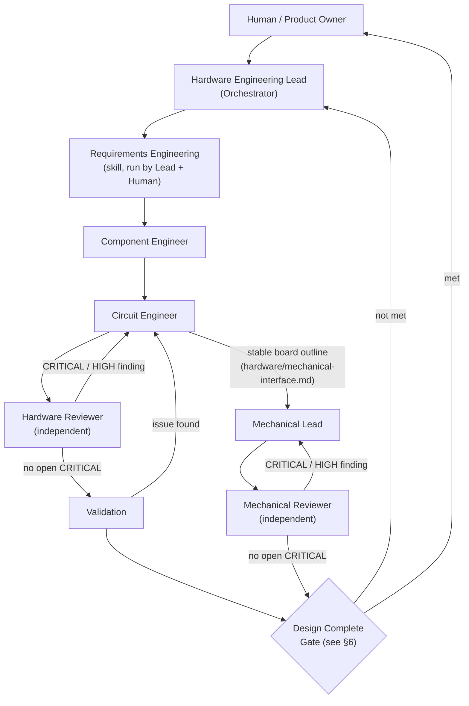

# AI Hardware Engineering Team — Architecture

This document is the canonical reference for the multi-agent Hardware Engineering
Framework in this repository. It defines shared vocabulary and rules that every
agent, skill, and template refers back to. If a template or skill seems to
contradict this document, this document wins — open an issue/ECO to reconcile it.

## 1. Mission

Replace "have one AI write a plausible-looking circuit" with a framework where:

- Every non-trivial numeric/design claim is grounded in a **primary source**
  (manufacturer datasheet / manufacturer documentation), not model prior knowledge.
- Specialized agents own narrow responsibilities so mistakes are caught by a
  **different** reasoning process than the one that made them (independent review).
- Every important decision leaves a **trail** a human can audit later: what was
  decided, why, based on which evidence, and who approved it.
- Humans stay the final authority on architecture, safety, and money/schedule
  decisions. AI is the Engineering Assistant / Engineering Team; the human is the
  **Chief Engineer**.

This framework is domain-general (any embedded/robotics/IoT hardware project),
not specific to any one product. See §9 for the current benchmark project.

## 2. Primary Control Flow



Loop-back rule: any **CRITICAL** or **HIGH** finding from the Hardware Reviewer
sends the design back to the Circuit Engineer for a fix, followed by a
**re-review** (not a rubber stamp — the Reviewer re-runs the full checklist
against the changed area and any area the change could have affected). The
same loop-back rule applies to the Mechanical Lead / Mechanical Reviewer pair,
added in Phase 1 (§3, §5.3, `docs/architecture-evolution.md` §27) — Mechanical
Design can start once Circuit Design has produced a stable board outline (it
does not need to wait for the Electronics-side Design Complete Gate to pass
first, since board geometry is independent of later electrical-only fixes),
and both disciplines' findings feed the **same** Design Complete Gate because
both write to the same `validation/open-issues.md` (§8).

## 3. Agents (MVP)

| Agent | Owns | Does NOT own |
|---|---|---|
| **Hardware Engineering Lead / Orchestrator** | Requirements intake, task delegation, artifact handoff, phase-gate decisions, Critical Issue register, conflict mediation/escalation | Detailed circuit design |
| **Component Engineer** | Candidate sourcing (≥3 when feasible), datasheet-grounded comparison, EOL/availability/ecosystem evaluation, recommendation | Final schematic topology |
| **Circuit Engineer** | Schematic design from approved parts + datasheets, design rationale log | Marking own work reviewed/complete |
| **Hardware Reviewer** | Independent, adversarial review; severity-classified findings | Fixing the design itself |
| **Mechanical Lead** *(Phase 1)* | Enclosure/mechanical design from `hardware/mechanical-interface.md`, sole owner of the mechanical geometry state, design rationale log | Marking own work reviewed/complete; editing Electronics artifacts |
| **Mechanical Reviewer** *(Phase 1)* | Independent, adversarial mechanical review; severity-classified findings (shares `validation/open-issues.md` with Hardware Reviewer) | Fixing the design itself |

The Mechanical Lead / Mechanical Reviewer pair was added in Phase 1 of the
multidisciplinary evolution (`docs/architecture-evolution.md` §7, §10, §27);
the original 4 agents above are unchanged. Hardware Lead orchestrates across
both disciplines today (§10, §5.3) — a separate "System Lead" role remains
premature until a third discipline exists (`docs/architecture-evolution.md`
§7).

Full role specs: `.github/agents/hardware-lead.agent.md`,
`.github/agents/component-engineer.agent.md`,
`.github/agents/circuit-engineer.agent.md`,
`.github/agents/hardware-reviewer.agent.md`,
`.github/agents/mechanical-lead.agent.md`,
`.github/agents/mechanical-reviewer.agent.md`. These are real GitHub Copilot
custom agent profiles (per
[docs.github.com/en/copilot/reference/custom-agents-configuration](https://docs.github.com/en/copilot/reference/custom-agents-configuration)),
each with a required `description` field, so they are selectable directly
wherever the running surface supports the Copilot custom agent picker or
programmatic invocation (e.g. `create_session`'s `agent` parameter, or the
`agent`/`custom-agent` tool alias from another agent's `tools` list).

Invocation model: where a session's own tool surface has not been
refreshed to expose these by name (e.g. this framework's own bootstrap
session), the same role can still be played by loading the corresponding
`.github/agents/<role>.agent.md` + `.github/skills/*/SKILL.md` content explicitly
into a `task` tool call (`agent_type: general-purpose`, or
`explore`/`research`/`rubber-duck` where noted in §5) — the agent profile
file is the authoritative definition of the role either way. The Hardware
Lead role defaults to being played by the primary Copilot session itself,
guided by `.github/copilot-instructions.md` +
`.github/agents/hardware-lead.agent.md`.

## 4. Parallel Execution ("Fleet") Policy

Some phases parallelize well; others must stay serial to preserve a single
coherent judgment. Do not parallelize a phase not listed as parallel-safe below
without Hardware Lead sign-off.

| Phase / Activity | Parallel-safe? | Notes |
|---|---|---|
| Component candidate research (per candidate, per part category) | Yes | e.g. 3 MCU candidates + 3 IMU candidates + 3 power-IC candidates can all be researched concurrently. Use `explore`/`research` agent types for independent research threads. |
| Datasheet extraction (per datasheet) | Yes | Each datasheet's constraint extraction is independent. |
| Circuit sub-block design (e.g. power / MCU periphery / sensor interface) | Conditional | Only after shared resources (rails, ground scheme, pin allocation) are fixed **serially** first. Otherwise parallel sub-blocks can silently conflict. |
| Hardware Reviewer checklist scanning (by topic: power/thermal, interface/timing, protection/EMI) | Yes, for the scan | Sub-scans may run in parallel. |
| Independent premise/assumption review (`rubber-duck`) | Yes | Runs in parallel *with* the Hardware Reviewer's checklist pass — different lens, same input artifact. |
| Requirements sign-off | No | Single coherent agreement with the human. |
| Sub-block interface definition | No | Must precede any parallel sub-block design. |
| Sub-block integration | No | One integrator reconciles all sub-blocks into a coherent whole. |
| Hardware Reviewer **verdict** (PASS/FAIL/CONDITIONAL) | No | Sub-scans may fan out, but exactly one Reviewer pass owns the consolidated, non-contradictory verdict. Independence means one accountable adversarial voice, not several uncoordinated ones. |
| Design Complete gate decision | No | Hardware Lead, serial, per §8. |

## 5. Existing Tooling Leveraged (not hypothetical)

These are tools already available in this CLI's toolset. Do not assume a tool
exists if it is not listed here or in this session's actual tool list — verify
first.

### 5.1 Sub-agent types
- `explore` / `research`: independent research threads (component/datasheet
  gathering) — see §4.
- `rubber-duck`: used **in addition to** (not instead of) the Hardware Reviewer.
  The Hardware Reviewer runs the physical-failure-mode checklist
  (`.github/skills/hardware-review/SKILL.md`). `rubber-duck` is run separately to
  challenge *design premises and blind spots* ("did we even ask the right
  requirement?", "what assumption is this whole approach resting on?"). Both
  feed `validation/open-issues.md`; the `Source` column distinguishes
  `hardware-reviewer` vs `rubber-duck` so provenance is never lost and the two
  lenses are never silently merged into one.

### 5.2 KiCad MCP tools (available only when a KiCad MCP server is connected in
the operator's environment — this is an environment capability, not something
this repository can guarantee for every user)

| Tool | Used by | When | Purpose |
|---|---|---|---|
| `list_projects`, `get_project_structure`, `open_project`, `validate_project` | Circuit Engineer | Any time a KiCad project exists | Sanity-check project health |
| `extract_schematic_netlist`, `extract_project_netlist`, `analyze_schematic_connections`, `find_component_connections` | Circuit Engineer (self-check), Hardware Reviewer (independent verification) | Before handoff to review; during review | Confirm actual schematic connections match the stated design intent / recommended application circuit — an objective, tool-verified cross-check instead of trusting the AI's own narrative |
| `identify_circuit_patterns`, `analyze_project_circuit_patterns` | Hardware Reviewer | During review | Confirm recognizable circuit blocks (decoupling, supply topology) are actually present |
| `analyze_bom`, `export_bom_csv` | Component Engineer, Circuit Engineer, Hardware Lead | Ongoing; before the "major BOM change" HITL gate | Keep `bom/component-selection.md` consistent with the actual KiCad BOM |
| `run_drc_check`, `get_drc_history_tool` | Hardware Reviewer (or future PCB Engineer) | PCB stage | DRC errors become `validation/open-issues.md` entries; DRC history feeds §14 evaluation metrics |
| `generate_pcb_thumbnail`, `generate_project_thumbnail` | Hardware Lead / Reviewer | Before "pre-fabrication" HITL gate | Visual artifact attached to `validation/design-review.md` |

**Not available today:** ERC (schematic-level electrical rule check) has no
dedicated tool in this toolset yet. Treat ERC as Future Integration (§13) until
such a tool exists — do not claim ERC coverage.

### 5.3 Mechanical tooling (Phase 1)

No CAD/3D modeling MCP tool is connected in this environment — **verified**,
not assumed: a live connection check against the only 3D-capable tool surface
present in this session's toolset (`blender-get_addon_status`) returned
"Could not connect to Blender." No local `openscad`/`freecad` binary or
`cadquery`/`solid`/`build123d` Python library is installed either. Until a
working CAD/3D tool is verified connected in a future session:

- The **Mechanical Lead** produces text/parametric output only: an
  OpenSCAD-syntax `.scad` file (every dimension a named variable) plus a
  structured dimensional-spec Markdown table, per
  `.github/agents/mechanical-lead.agent.md` and
  `hardware/mechanical/README.md`.
- Do not claim a rendered preview, an STL export, or an automated fit-check
  exists — see §13 (Future Integration) for the tracked row.
- The Mechanical Lead does use the *existing*, already-documented read-only
  KiCad tools (§5.2: `get_project_structure`, `extract_project_netlist`,
  `analyze_bom`, `generate_pcb_thumbnail`/`generate_project_thumbnail`) to
  populate `hardware/mechanical-interface.md` from an existing KiCad project
  when one exists — this is reuse of an already-verified tool surface, not a
  new capability claim.

## 6. Evidence Model

### 6.1 Source of Truth rule
- Never guess a component spec. Numeric claims must trace to a manufacturer
  datasheet or manufacturer documentation.
- Explicitly separate **Absolute Maximum Ratings**, **Recommended Operating
  Conditions**, and **Typical Characteristics** — never blend them.
- If a value cannot be confirmed from a primary source, record it as `UNKNOWN`.
  Never interpolate from a similar part's datasheet and present it as this
  part's number.
- Repository-stored datasheets/manufacturer docs outrank the AI's prior
  training knowledge whenever they conflict.

### 6.2 Copyright / license policy for datasheets (public repository)

This repository is **public**. Manufacturer datasheets are copyrighted works.

- The actual datasheet files (PDF, etc.) **must never be committed**. They are
  excluded via `.gitignore` (`datasheets/**/*.pdf`, etc.).
- `datasheets/` only ever contains **metadata reference records**: manufacturer,
  part number, datasheet revision/version, publication date, **official URL**,
  and retrieval date (one `*.md` file per datasheet). See
  `datasheets/README.md` for the exact template.
- Local working copies of the actual PDF may be kept on a contributor's disk
  for analysis, but never pushed to this repository.
- Extracted constraint tables (`Parameter | Min | Typ | Max | Unit | Source`)
  are this project's own structured factual extraction, not a bulk
  reproduction of the datasheet's original text/diagrams — keep extraction to
  the minimum facts needed to support a design decision.
- This is a pragmatic engineering/repo-hygiene policy, not a legal opinion. If
  a formal legal determination is needed (e.g., for a future space-flight
  program), consult the repository owner / legal counsel.

### 6.3 Evidence ID scheme

Every citation of a datasheet fact that is used to justify a design decision,
a review finding, an FMEA entry, or a traceability row gets a stable ID so it
can be cross-referenced from anywhere in the repository instead of being
re-typed (and potentially re-worded, and thus desynced) each time.

```
DS-<CATEGORY>-<NNN>
```

- `CATEGORY`: short uppercase code for the component/subsystem category, e.g.
  `MCU`, `IMU`, `PWR`, `CONN`, `SNS` (sensor), `MTR` (motor driver).
- `NNN`: zero-padded sequence number, unique within that category, assigned in
  the order the evidence is first recorded.
- Example: `DS-IMU-003` = the 3rd piece of IMU-related evidence recorded.

Every Evidence ID **must** be registered in `datasheets/evidence-log.md` with
its full citation (which metadata record it points to, section/table/page,
and the specific parameter/claim it supports). `validation/open-issues.md`,
`validation/fmea.md`, `validation/change-log.md`, and
`requirements/traceability-matrix.md` reference Evidence IDs rather than
duplicating citation text, so updating one entry in the evidence log keeps
every dependent artifact consistent.

## 7. Severity Taxonomies (two, kept distinct — do not conflate them)

### 7.1 Hardware Reviewer finding severity (qualitative, per review cycle)

| Severity | Meaning | Example |
|---|---|---|
| **CRITICAL** | Design will fail or cause damage/hazard under normal/expected operating conditions as designed | Exceeding an Absolute Maximum Rating during normal operation; reverse-voltage path that kills a part |
| **HIGH** | Likely malfunction or reliability failure under realistic conditions/corners | Insufficient decoupling causing brownout resets; marginal interface timing |
| **MEDIUM** | Deviates from recommended practice, raises risk, doesn't clearly break function | Non-optimal pull-up value; thin thermal margin |
| **LOW** | Style / best-practice / documentation improvement, negligible functional risk | Missing test-point label |

Each finding is recorded with: **Issue, Rationale, Datasheet Source (Evidence
ID), Failure Mechanism, Affected Component, Recommended Fix, Severity**
(exact schema in `.github/skills/hardware-review/SKILL.md` and
`validation/design-review.md` / `validation/open-issues.md`).

### 7.2 FMEA risk scoring (quantitative, systemic, cross-cutting — §7.3)

FMEA uses the classic **RPN = Severity(1–10) × Occurrence(1–10) ×
Detection(1–10)** scale. This is intentionally a *different* scale from §7.1:
Reviewer findings are about concrete defects in a specific reviewed design
snapshot; FMEA is about anticipating systemic failure modes across the whole
system before they occur. They cross-reference by ID but are not merged into
one scale — collapsing them would weaken both.

### 7.3 FMEA — Failure Mode and Effects Analysis

`validation/fmea.md` is the systemic risk register: component/function →
potential failure mode → potential effect (local/system/mission level) →
Severity/Occurrence/Detection → RPN → current controls → recommended action →
owner → status. This is standard practice for mission/safety-relevant hardware
and carries **elevated importance** for this project given its roadmap toward
a CubeSat-class system (§10): once hardware is in orbit it cannot be repaired,
so failure modes must be anticipated in advance, not just found after the
fact by review.

## 8. Design Complete Gate

A design is **not** allowed to be marked Design Complete unless **all** of the
following hold:

1. Zero unresolved **CRITICAL** findings (CRITICAL can never be
   "accepted risk" — it must reach `RESOLVED`).
2. Every **HIGH** finding is `RESOLVED`, or explicitly `ACCEPTED-RISK` with a
   named human (Chief Engineer) sign-off + written rationale + date.
3. `requirements/traceability-matrix.md` shows 100% `Verified` (or an explicit
   human `Waived` disposition) across all requirement rows.
4. `validation/fmea.md` has been reviewed for this revision.
5. `validation/change-log.md` (ECO) has an entry for this revision, signed off
   by a human.

Findings carry an SLA target (see `validation/open-issues.md` header) so that
CRITICAL/HIGH items do not silently age — exact day counts are set by the
human Chief Engineer per project, not hard-coded by AI.

## 9. Conflict / deadlock resolution between agents

When two agents disagree (e.g., Component Engineer vs. Circuit Engineer on a
part choice; Circuit Engineer vs. Hardware Reviewer on a finding's severity):

1. Each side states its position with evidence (Evidence IDs / requirement
   IDs) — not opinion.
2. The Hardware Lead mediates: checks which position is better grounded
   against `requirements/` and `datasheets/evidence-log.md`; may request
   missing evidence from either side; may invoke `rubber-duck` as a neutral
   third read.
3. If still unresolved (genuine trade-off, safety-relevant ambiguity, or a
   business/schedule trade-off) — escalate to the human Chief Engineer with a
   short decision brief: both positions, evidence, trade-offs, Lead's
   recommendation (if any).
4. Record the resolution in `validation/change-log.md` and/or
   `validation/open-issues.md` with cross-references.

Full process detail: `docs/workflow.md` §"Conflict Resolution / Deadlock
Escalation Protocol".

## 10. Human-in-the-loop Gates

AI never finalizes these alone — explicit human (Chief Engineer) approval is
required:

- Architecture decisions
- Key/major component decisions
- Any case where a datasheet cannot be found (no guessing — escalate)
- Safety-critical changes
- Major BOM changes
- Before PCB fabrication
- Before first power-on of real hardware (see `validation/bring-up-procedure.md`)
- Before mechanical fabrication (3D printing/machining) of an enclosure or
  mechanical part — mirrors the "before PCB fabrication" gate, extended to
  the Mechanical discipline (Phase 1)

## 11. Benchmark Project & Roadmap

- **First benchmark**: MCU + IMU + Power Supply (small circuit).
- **Long-term roadmap** (not built yet): MCU + IMU → Motor Driver → Reaction
  Wheel → 1-axis attitude control → 3-axis attitude control → a standing
  "Cube". The framework must stay reusable for other robotics/IoT/embedded
  hardware, not hard-coded to this one product.
- System-level power/thermal/mechanical concerns that only matter once the
  system grows beyond the benchmark are tracked from day one in
  `hardware/power-budget.md` (see §12) so the framework doesn't need a
  disruptive rework later.

## 12. System-Level Power / Thermal / Mechanical Co-design

- `hardware/power-budget.md` aggregates every subsystem's current/power draw
  against the supply's capability, per rail, with margin — updated every time
  a subsystem is added (e.g., a motor driver later in the roadmap).
- **Future role**: a dedicated **Power Engineer** (see §14) formally owns the
  system power budget and power tree/sequencing once the system grows past
  the benchmark's complexity. Until then, the Circuit Engineer maintains
  `hardware/power-budget.md` as part of `.github/skills/schematic-design/SKILL.md`.
- **Mechanical/Thermal co-design** is an explicit Circuit Engineer checklist
  item (see `.github/agents/circuit-engineer.agent.md`): rotating bodies (e.g. a
  reaction wheel motor) create vibration and localized heating that can
  propagate into the PCB — vibration-induced mechanical stress on solder
  joints/connectors, and thermal gradients that matter especially for
  vibration/temperature-sensitive parts like an IMU (bias drift with
  temperature). The Hardware Reviewer's generic "PCB layout concern" checklist
  item is understood to include this when a rotating body is in the design.

## 13. Future Integration (explicitly NOT implemented — do not assume these
tools/servers exist)

| Integration | Status | Notes |
|---|---|---|
| KiCad ERC | Not available as a tool today | See §5.2 |
| SPICE (simulation, parameter sweep, stability/power analysis) | Not available | No SPICE MCP tool exists in this toolset today |
| Component database / parts availability MCP | Not available | Evaluate when such a tool is actually connected |
| Test equipment MCP (bench instruments) | Not available | Relevant once `validation/bring-up-procedure.md` moves to instrumented bench testing |
| CAD/3D modeling tool (e.g. Blender or a parametric CAD/OpenSCAD engine) | Not available — **verified**, not assumed | A live connection check (`blender-get_addon_status`) failed ("Could not connect to Blender"); no local `openscad`/`freecad` binary or `cadquery`/`solid`/`build123d` Python library is installed either. Mechanical Lead produces text/parametric output only until a working tool is verified connected (§5.3) |

Never implement code/process that assumes any of the above exists. When one
becomes available, move its row out of this table and into §5.

## 14. Future Roles (not implemented as agents yet — documented here so the
framework can add them without restructuring)

| Future role | Scope | Trigger to introduce |
|---|---|---|
| **Power Engineer** | System power budget, power tree, sequencing across subsystems (§12) | When subsystem count / power complexity exceeds what Circuit Engineer can track ad hoc (e.g., at Motor Driver / Reaction Wheel stage) |
| **PCB Engineer** | Layout, stackup, DRC closure, signal/power integrity at layout level | When schematic-to-layout handoff becomes a distinct phase |
| **Firmware Engineer** | Driver-level bring-up code, register-level configuration matching the schematic's actual pin/interface decisions | When firmware work starts in earnest |
| **Control Engineer** | Control-loop design (e.g., attitude control loops) | At 1-axis / 3-axis attitude control roadmap stage |
| **Test Engineer** | Owns `validation/bring-up-procedure.md` formally, designs bench test plans, HIL/environmental test plans | When bring-up moves beyond a one-off MVP bench test |
| **Datasheet Specialist** | Advanced/high-volume operator of `.github/skills/datasheet-analysis/SKILL.md`; owns `datasheets/evidence-log.md` quality and consistency | When datasheet volume/complexity outgrows ad hoc extraction by whichever agent needs a number |
| **Safety/Compliance Reviewer** | Regulatory/standards review (e.g. UL/CE/FCC/EMC compliance where applicable) | When the project needs to target a regulated market or a safety-relevant certification |

These are **not** created as `.github/agents/*.agent.md` files yet — introduce them
only when the trigger condition is met, to avoid role/file proliferation
ahead of actual need.

## 15. Evaluation

See `docs/evaluation.md` for the Single-Agent vs. Multi-Agent comparison
methodology and metrics.

## 16. Directory Map

```
.github/copilot-instructions.md            Repo-wide Copilot operating rules
.github/agents/*.agent.md                  Custom agent profiles (name+description frontmatter):
                                              4 Electronics MVP agents + 2 Mechanical agents (Phase 1)
.github/skills/*/SKILL.md                  Agent skill profiles (name+description frontmatter):
  requirements-engineering/SKILL.md
  component-selection/SKILL.md
  datasheet-analysis/SKILL.md
  schematic-design/SKILL.md
  hardware-review/SKILL.md
  enclosure-design/SKILL.md                Mechanical Lead's procedure (Phase 1)
  mechanical-review/SKILL.md                Mechanical Reviewer's procedure (Phase 1)
.github/instructions/*.instructions.md     Path-scoped rules (datasheets/, hardware+bom/, validation/,
                                              hardware/mechanical/+mechanical-interface.md — Phase 1)
.github/prompts/*.prompt.md                Reusable slash-command-style prompts
.github/workflows/hardware-gate.yml        CI gate: blocks unresolved CRITICAL/HIGH
.github/workflows/agent-frontmatter-lint.yml  CI lint: agent/skill required frontmatter (Phase 1)
.github/CODEOWNERS                         Required human review on safety-critical paths


requirements/
  requirements.md                          Requirements template
  traceability-matrix.md                   Requirement -> Component -> Circuit -> Test

datasheets/
  README.md                                Metadata-only policy + template
  evidence-log.md                          Evidence ID registry

hardware/
  schematic/README.md
  pcb/README.md
  power-budget.md                          System power budget
  mechanical-interface.md                  Electronics -> Mechanical interface contract (Phase 1)
  mechanical/README.md                     Mechanical design artifacts (Phase 1, text/parametric only)

bom/component-selection.md                 Candidate comparison template

validation/
  design-review.md                         Per-cycle review report template (Hardware or Mechanical Reviewer)
  open-issues.md                           Living finding backlog (CI-checked; shared across disciplines)
  fmea.md                                  Systemic risk register
  change-log.md                           ECO / hardware change history
  change-impact-matrix.md                 Cross-domain change impact template
  bring-up-procedure.md                   First-power-on procedure

docs/
  architecture.md                          This document
  workflow.md                              End-to-end workflow + gates
  architecture-evolution.md                Multidisciplinary evolution proposal + Phase 1 status
  evaluation.md                            Single vs multi-agent metrics
  commands/make-circuit.md                 Standard kickoff prompt for a new design cycle

tools/check_open_issues.py                 CI gate parser for open-issues.md
tools/check_agent_frontmatter.py           CI lint for agent/skill frontmatter (Phase 1)
```
