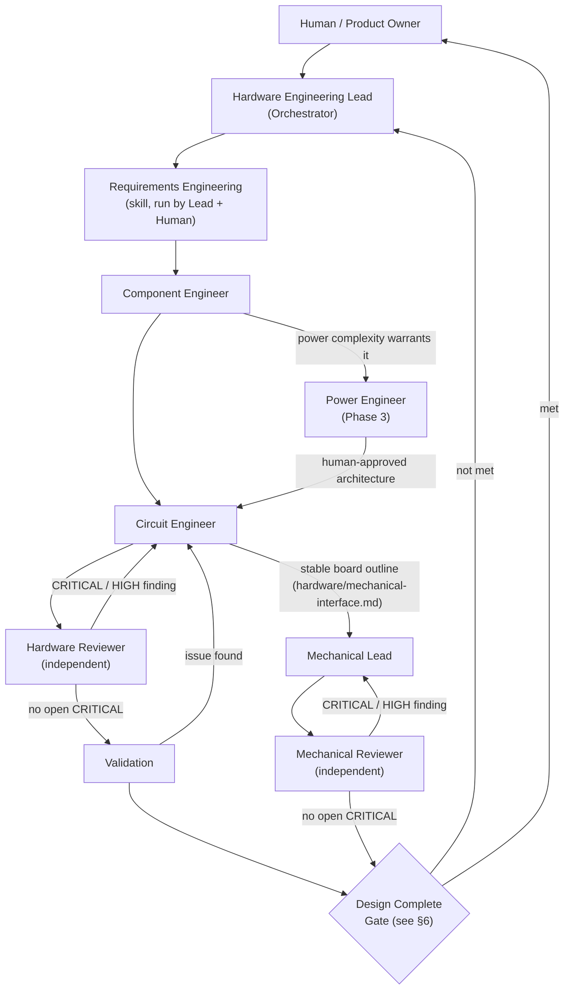

# AI Hardware Engineering Team — Architecture

This document is the canonical reference for the multi-agent Hardware Engineering
Framework in this repository. It defines shared vocabulary and rules that every
agent, skill, and template refers back to. If a template or skill seems to
contradict this document, this document wins — open an issue/ECO to reconcile it.

## 1. Mission

Replace "have one AI write a plausible-looking circuit" with a framework where:

- Every non-trivial numeric/design claim is grounded in a **primary source**
  (manufacturer datasheet / manufacturer documentation), not model prior knowledge.
- Specialized agents own narrow responsibilities so mistakes are caught by a
  **different** reasoning process than the one that made them (independent review).
- Every important decision leaves a **trail** a human can audit later: what was
  decided, why, based on which evidence, and who approved it.
- Humans stay the final authority on architecture, safety, and money/schedule
  decisions. AI is the Engineering Assistant / Engineering Team; the human is the
  **Chief Engineer**.

This framework is domain-general (any embedded/robotics/IoT hardware project),
not specific to any one product. See §9 for the current benchmark project.

## 2. Primary Control Flow



Loop-back rule: any **CRITICAL** or **HIGH** finding from the Hardware Reviewer
sends the design back to the Circuit Engineer for a fix, followed by a
**re-review** (not a rubber stamp — the Reviewer re-runs the full checklist
against the changed area and any area the change could have affected). The
same loop-back rule applies to the Mechanical Lead / Mechanical Reviewer pair,
added in Phase 1 (§3, §5.3, `docs/architecture-evolution.md` §27) — Mechanical
Design/WIP assembly planning starts from identified physical interfaces,
without waiting for Design Complete; finalized dimensions require stable
source inputs, while unknowns remain visible during early evidence generation
(`docs/workflow.md` Phases 8-10),
and both disciplines' findings feed the **same** Design Complete Gate because
both write to the same `validation/open-issues.md` (§8).

## 3. Agents (MVP)

| Agent | Owns | Does NOT own |
|---|---|---|
| **Hardware Engineering Lead / Orchestrator** | Requirements intake, task delegation, integrated interface completion, revision-linked assembly evidence handoff, phase-gate decisions, Critical Issue register, conflict mediation/escalation | Detailed circuit or mechanical geometry design |
| **Component Engineer** | Candidate sourcing (≥3 when feasible), datasheet-grounded comparison, EOL/availability/ecosystem evaluation, recommendation | Final schematic topology |
| **Circuit Engineer** | Schematic design from approved parts + datasheets, design rationale log | Marking own work reviewed/complete |
| **Hardware Reviewer** | Independent, adversarial review; severity-classified findings | Fixing the design itself |
| **Mechanical Lead** *(Phase 1)* | Enclosure/mechanical geometry, design rationale and WIP assembly-process/installed/per-stage evidence from sourced interfaces; requested Fusion native/video package | Marking own work reviewed/complete; editing Electronics artifacts; silently redesigning within visualization |
| **Mechanical Reviewer** *(Phase 1)* | Independent geometry/evidence acceptance, distinguishing early WIP blocker review from final acceptance; severity-classified findings (shared `validation/open-issues.md`) | Fixing the design itself; treating animation or structural CI as safety certification |
| **Firmware Engineer** *(Phase 2)* | Driver-level bring-up firmware from a Design-Complete schematic: peripheral initialization, register-level configuration, design rationale log (`firmware/<board>/`) | Control loops/sensor fusion/unit conversion (Control Engineer's future territory, §14 — not yet triggered); editing Electronics artifacts; marking own work reviewed/complete (self-check stood in for independent review until a Firmware Reviewer trigger was met, `docs/architecture-evolution.md` §32 — now superseded: Firmware Reviewer performs independent review, Phase 5, `docs/architecture-evolution.md` §36) |
| **Power Engineer** *(Phase 3)* | System power-tree/rail-topology proposal (`hardware/power-architecture.md`), multi-rail `hardware/power-budget.md` bookkeeping, once engaged (a Hardware Lead judgment call per project/revision, `.github/agents/power-engineer.agent.md`) | Implementing the actual regulator/converter circuit (Circuit Engineer); selecting the specific part (Component Engineer); self-approving a rail/source architecture decision (always HITL, §10) |
| **Manufacturing Engineer** *(Phase 4)* | Manufacturing PROCESS parameters (infill %/pattern, wall/perimeter count, print orientation vs. load direction, material) for safety-critical/structural mechanical parts, once engaged (a Mechanical Lead / Hardware Lead judgment call per part, `.github/agents/manufacturing-engineer.agent.md`) | The part's CAD geometry itself (Mechanical Lead); declaring its own process specification independently reviewed (Mechanical Reviewer performs that independent cross-check, `.github/skills/mechanical-review/SKILL.md` item 11); certifying FDM plastic as adequate for a hazardous-energy containment purpose without real physical testing |
| **Firmware Reviewer** *(Phase 5)* | Independent, adversarial review of Firmware Engineer's driver-level bring-up code: register/peripheral correctness, pin/interface fidelity against the actual schematic, safety-critical logic correctness where present, premise review; severity-classified findings (own firmware-scoped record, `firmware/<board>/<board>-firmware-review.md` — deliberately does not share `validation/open-issues.md` with Hardware/Mechanical Reviewer, §14, `.github/agents/firmware-reviewer.agent.md`) | Fixing the firmware itself; control-loop/sensor-fusion design (Control Engineer's future territory, §14 — not yet triggered); editing hardware/mechanical artifacts; claiming any real hardware-in-the-loop test or flashing |
| **PCB Engineer** *(Phase 6)* | Schematic-to-PCB layout: footprint assignment (CONFIRMED/ASSUMPTION labeled), board outline/layer-stackup justification, placement, current-aware routing, DRC closure, and the flat BOM + visual snapshot a fabrication decision needs (`.github/agents/pcb-engineer.agent.md`) | Re-litigating component selection or schematic topology (Component Engineer / Circuit Engineer's territory); declaring its own layout "reviewed" or "ready to fabricate" (Hardware Reviewer performs that independent cross-check, its checklist now extended with PCB-layout-specific items rather than a new reviewer agent, §14/`docs/architecture-evolution.md` §37); mechanical/enclosure design; firmware |

The Mechanical Lead / Mechanical Reviewer pair was added in Phase 1 of the
multidisciplinary evolution (`docs/architecture-evolution.md` §7, §10, §27);
the original 4 agents above are unchanged. The Firmware Engineer was added
in Phase 2 (`docs/architecture-evolution.md` §32) once its own trigger
(§14: "when firmware work starts in earnest") was met — no Firmware
Reviewer agent exists yet (Phase 2 deliberately introduced only one new
agent, not the usual design+independent-review pair, per §32's own
scope-proportionality reasoning). The Power Engineer was added in Phase 3
(`docs/architecture-evolution.md` §33) once its own trigger (§14: "when
subsystem count / power complexity exceeds what Circuit Engineer can track
ad hoc") was judged met — an Electronics-adjacent addition (extends the
original 4-agent Electronics team to 5, the same way Component Engineer/
Circuit Engineer/Hardware Reviewer already divide Electronics work, rather
than a new top-level discipline the way Mechanical/Firmware are), engaged
only when the Hardware Lead judges a given project's power complexity
warrants it, not for every future design by default. The Manufacturing
Engineer was added in Phase 4 (`docs/architecture-evolution.md` §35) after
a real gap was found by the human Chief Engineer during review of the
Bench-IMU-01 Rev 3 flywheel containment cap (a still-draft, unmerged
design): a CAD model's stated wall thickness is a geometric claim only, and
this repository had zero coverage of the manufacturing process parameters
(infill %/pattern, wall/perimeter count, print orientation, material) that
actually determine whether a fabricated part has that solid material at
all — confirmed by a repository-wide search for "infill" returning no hits
before this addition. A Mechanical-adjacent addition (extends the
Mechanical discipline's Lead/Reviewer pair to 3, the same way Power
Engineer extends Electronics, rather than a new top-level discipline),
engaged only when the Mechanical Lead / Hardware Lead judges a specific
part's safety-critical/structural function warrants it. Its own output is
independently cross-checked by the Mechanical Reviewer
(`.github/skills/mechanical-review/SKILL.md` item 11), never
self-certified — no new independent reviewer agent was introduced for this
narrow addition, mirroring the same scope-proportionality reasoning §32/§33
already used for not adding a Firmware Reviewer or Power Reviewer
immediately. The Firmware Reviewer was added in Phase 5
(`docs/architecture-evolution.md` §36) once §14's own documented trigger was
met on the same board — not a second board (that row's other named
condition), but a real bring-up failure traced to a class of defect an
independent pass would likely have caught: the pre-existing (Rev ≤2)
`main.c` infinite-loop-on-`bmi270_init()`-failure coupling bug, self-caught
and fixed during Rev 3 firmware bring-up
(`firmware/bench-imu-01/src/main.c`, design rationale §4.9). Unlike
Manufacturing Engineer, this is a genuinely new independent-reviewer agent
(mirroring Mechanical Reviewer's original Phase 1 introduction pattern,
`.github/agents/mechanical-reviewer.agent.md`, not Manufacturing Engineer's
choice to extend an existing reviewer's own checklist) because no existing
reviewer agent covered Firmware Engineer's output at all before this
addition — Hardware Reviewer reviews Circuit Engineer, Mechanical Reviewer
reviews Mechanical Lead, and nothing but self-check reviewed Firmware
Engineer. Its findings are deliberately recorded in a firmware-scoped file
(`firmware/<board>/<board>-firmware-review.md`,
`.github/agents/firmware-reviewer.agent.md`), not
`validation/open-issues.md`, so a firmware-only finding cannot silently
block the Design Complete Gate the way §32 already flagged as an
unresolved coupling risk — this extends the Firmware discipline to 2
agents, the same way Mechanical's Lead/Reviewer pair works. The PCB
Engineer was added in Phase 6 (`docs/architecture-evolution.md` §37) once
§14's own documented trigger ("when schematic-to-layout handoff becomes a
distinct phase") was met by an explicit human request to bring
Bench-IMU-01 Rev 3 to an orderable-PCB stage — the same mechanism (a human
judging a documented trigger met) that introduced Power Engineer and
Firmware Engineer. An Electronics-adjacent addition, like Power Engineer
(extends the Electronics team rather than adding a new top-level
discipline) — but unlike Power Engineer, Manufacturing Engineer, or
Firmware Reviewer, **no new independent-reviewer agent was introduced for
it either**: rather than standing up a "PCB Reviewer," the existing
Hardware Reviewer's own checklist (`.github/skills/hardware-review/SKILL.md`)
was extended with PCB-layout-specific items (DRC closure, copper
current-carrying capacity, clearance/creepage, thermal via/pour integrity),
mirroring Manufacturing Engineer's "extend an existing reviewer" pattern
rather than Mechanical/Firmware Reviewer's "stand up a new agent" pattern —
justified because PCB Engineer's output is the same physical
board/schematic Hardware Reviewer already independently reviews (unlike
Firmware, which needed its own reviewer because nothing previously covered
it at all), and Hardware Reviewer's own checklist item 15 ("PCB layout
concern") already contemplated this in principle, just without a real PCB
to review against yet. Hardware Lead orchestrates across all disciplines
today (§10, §5.3, §5.4) — a separate "System Lead" role remains premature
until the framework's own discipline count grows further
(`docs/architecture-evolution.md` §7).

Separately, all three Reviewer agents (Hardware, Mechanical, Firmware) had
their checklists extended with a **Foresight checklist** — a deliberately
*proactive* checklist, distinct in kind from each Reviewer's existing
*reactive* adversarial-verification checklist above. Motivated by a real
gap observed in ad hoc mechanical-visualization work outside this
project's own formal Bench-IMU-01 deliverables (not itself an ECO-tracked
design change): the existing checklists verify the correctness of a
specific, stated claim well, but nothing in a Reviewer's mandate prompts it
to notice an adjacent concern nobody explicitly asked about. Per-role
content: physical interference and simplified-model distortion for
Mechanical Reviewer (`.github/agents/mechanical-reviewer.agent.md`);
cross-domain interference and stale-`ASSUMPTION` re-verification for
Hardware Reviewer (`.github/agents/hardware-reviewer.agent.md`);
requirement-implied-but-unimplemented functionality and unverified timing/
concurrency for Firmware Reviewer
(`.github/agents/firmware-reviewer.agent.md`) — plus a shared,
non-mandatory "Foresight notes" report subsection for things worth a future
look that aren't yet a concrete finding. No new agent was introduced for
this — a deliberate, human-directed choice, extending three existing
reviewers rather than standing up a "Foresight Reviewer." Full record:
`docs/architecture-evolution.md` §38.

Full role specs: `.github/agents/hardware-lead.agent.md`,
`.github/agents/component-engineer.agent.md`,
`.github/agents/circuit-engineer.agent.md`,
`.github/agents/hardware-reviewer.agent.md`,
`.github/agents/mechanical-lead.agent.md`,
`.github/agents/mechanical-reviewer.agent.md`,
`.github/agents/firmware-engineer.agent.md`,
`.github/agents/power-engineer.agent.md`,
`.github/agents/manufacturing-engineer.agent.md`,
`.github/agents/firmware-reviewer.agent.md`,
`.github/agents/pcb-engineer.agent.md`. These are real GitHub Copilot
custom agent profiles (per
[docs.github.com/en/copilot/reference/custom-agents-configuration](https://docs.github.com/en/copilot/reference/custom-agents-configuration)),
each with a required `description` field, so they are selectable directly
wherever the running surface supports the Copilot custom agent picker or
programmatic invocation (e.g. `create_session`'s `agent` parameter, or the
`agent`/`custom-agent` tool alias from another agent's `tools` list).

Invocation model: where a session's own tool surface has not been
refreshed to expose these by name (e.g. this framework's own bootstrap
session), the same role can still be played by loading the corresponding
`.github/agents/<role>.agent.md` + `.github/skills/*/SKILL.md` content explicitly
into a `task` tool call (`agent_type: general-purpose`, or
`explore`/`research`/`rubber-duck` where noted in §5) — the agent profile
file is the authoritative definition of the role either way. The Hardware
Lead role defaults to being played by the primary Copilot session itself,
guided by `.github/copilot-instructions.md` +
`.github/agents/hardware-lead.agent.md`.

## 4. Parallel Execution ("Fleet") Policy

Some phases parallelize well; others must stay serial to preserve a single
coherent judgment. Do not parallelize a phase not listed as parallel-safe below
without Hardware Lead sign-off.

| Phase / Activity | Parallel-safe? | Notes |
|---|---|---|
| Component candidate research (per candidate, per part category) | Yes | e.g. 3 MCU candidates + 3 IMU candidates + 3 power-IC candidates can all be researched concurrently. Use `explore`/`research` agent types for independent research threads. |
| Datasheet extraction (per datasheet) | Yes | Each datasheet's constraint extraction is independent. |
| Circuit sub-block design (e.g. power / MCU periphery / sensor interface) | Conditional | Only after shared resources (rails, ground scheme, pin allocation) are fixed **serially** first. Otherwise parallel sub-blocks can silently conflict. |
| Hardware Reviewer checklist scanning (by topic: power/thermal, interface/timing, protection/EMI) | Yes, for the scan | Sub-scans may run in parallel. |
| Independent premise/assumption review (`rubber-duck`) | Yes | Runs in parallel *with* the Hardware Reviewer's checklist pass — different lens, same input artifact. |
| Requirements sign-off | No | Single coherent agreement with the human. |
| Sub-block interface definition | No | Must precede any parallel sub-block design. |
| Sub-block integration | No | One integrator reconciles all sub-blocks into a coherent whole. |
| Hardware Reviewer **verdict** (PASS/FAIL/CONDITIONAL) | No | Sub-scans may fan out, but exactly one Reviewer pass owns the consolidated, non-contradictory verdict. Independence means one accountable adversarial voice, not several uncoordinated ones. |
| Design Complete gate decision | No | Hardware Lead, serial, per §8. |

## 5. Existing Tooling Leveraged (not hypothetical)

These are tools already available in this CLI's toolset. Do not assume a tool
exists if it is not listed here or in this session's actual tool list — verify
first.

### 5.1 Sub-agent types
- `explore` / `research`: independent research threads (component/datasheet
  gathering) — see §4.
- `rubber-duck`: used **in addition to** (not instead of) the Hardware Reviewer.
  The Hardware Reviewer runs the physical-failure-mode checklist
  (`.github/skills/hardware-review/SKILL.md`). `rubber-duck` is run separately to
  challenge *design premises and blind spots* ("did we even ask the right
  requirement?", "what assumption is this whole approach resting on?"). Both
  feed `validation/open-issues.md`; the `Source` column distinguishes
  `hardware-reviewer` vs `rubber-duck` so provenance is never lost and the two
  lenses are never silently merged into one.

### 5.2 KiCad MCP tools (available only when a KiCad MCP server is connected in
the operator's environment — this is an environment capability, not something
this repository can guarantee for every user) — **verified connected and
actively used, 2026-08-31** (see below; no longer purely hypothetical/
conditional language)

| Tool | Used by | When | Purpose |
|---|---|---|---|
| `list_projects`, `get_project_structure`, `open_project`, `validate_project` | Circuit Engineer | Any time a KiCad project exists | Sanity-check project health |
| `extract_schematic_netlist`, `extract_project_netlist`, `analyze_schematic_connections`, `find_component_connections` | Circuit Engineer (self-check), Hardware Reviewer (independent verification) | Before handoff to review; during review | Confirm actual schematic connections match the stated design intent / recommended application circuit — an objective, tool-verified cross-check instead of trusting the AI's own narrative |
| `identify_circuit_patterns`, `analyze_project_circuit_patterns` | Hardware Reviewer | During review | Confirm recognizable circuit blocks (decoupling, supply topology) are actually present |
| `analyze_bom`, `export_bom_csv` | Component Engineer, Circuit Engineer, Hardware Lead | Ongoing; before the "major BOM change" HITL gate | Keep `bom/component-selection.md` consistent with the actual KiCad BOM |
| `run_drc_check`, `get_drc_history_tool` | Hardware Reviewer (or future PCB Engineer) | PCB stage | DRC errors become `validation/open-issues.md` entries; DRC history feeds §14 evaluation metrics |
| `generate_pcb_thumbnail`, `generate_project_thumbnail` | Hardware Lead / Reviewer | Before "pre-fabrication" HITL gate | Visual artifact attached to `validation/design-review.md` |

**Verified 2026-08-31** — this repository's first real KiCad project
(`hardware/schematic/bench-imu-01/`, `docs/architecture-evolution.md` §34)
confirmed: KiCad 10.0.1 and `kicad-cli` are genuinely installed, and the
`kicad-*` MCP tools above are genuinely callable — **but a real, significant
MCP-server-side bug was found and precisely characterized**: of the 16
`kicad-*` tools, only 5 (`list_projects`, `get_project_structure`,
`validate_project`, `get_drc_history_tool`, `open_project`) actually work in
this environment. The other 11 — every tool whose schema declares a required
`ctx: Context` parameter (`extract_project_netlist`,
`extract_schematic_netlist`, `analyze_schematic_connections`,
`find_component_connections`, `identify_circuit_patterns`,
`analyze_project_circuit_patterns`, `analyze_bom`, `export_bom_csv`,
`generate_pcb_thumbnail`, `generate_project_thumbnail`, `run_drc_check`) —
consistently fail. **This 5-working/11-failing split is a robust,
independently-reproduced fact**, confirmed across three separate
verification passes this session (the Hardware Lead, a delegated Hardware
Reviewer fidelity-review pass, and an independent PR auditor pass — all
three, working from different sessions/MCP clients, got the identical
count). **The exact client-visible error text, however, is MCP-client-
dependent — do not over-specify it as a single universal fact**: when a
caller omits the `ctx` parameter entirely, every one of the 11 tools fails
identically with `Input validation error: 'ctx' is a required property` (a
client-side schema-validation rejection, before the tool body ever runs) —
this is what the independent auditor's client always produced, for all 11
tools without exception. When a caller instead explicitly supplies a
placeholder `ctx` value (e.g. `{}`), the schema check passes and each tool's
own body actually executes — at which point most (`extract_project_netlist`,
`extract_schematic_netlist`, `analyze_schematic_connections`,
`find_component_connections`, `identify_circuit_patterns`,
`analyze_project_circuit_patterns`, `analyze_bom`, `export_bom_csv`,
`generate_pcb_thumbnail`) fail with `Context is not available outside of a
request` (traced to `kicad_mcp/tools/netlist_tools.py` and siblings in the
local MCP server's own source calling `ctx.report_progress(...)`, which
needs a live FastMCP request context this environment's tool-calling bridge
does not supply) — but `run_drc_check` instead correctly executes and
returns `{"success":false,"error":"PCB file not found in project"}` (a
correct result given no `.kicad_pcb` exists, not a Context error at all),
and `generate_project_thumbnail` fails with yet another, unrelated error
(`'FunctionTool' object is not callable`). All of the above was independently
reproduced by the Hardware Lead a second time, on demand, after the PR
auditor's own pass reported the "omitted `ctx`" behavior exclusively —
confirming both observations are correct for their respective calling
pattern, not contradictory. **Workaround**: use `kicad-cli` directly
(`sch export netlist`, `sch export bom`, `sch erc`) for the equivalent
verification — the same underlying KiCad engine these MCP tools wrap, so the
verification is equally real, and does not depend on this client-specific
nuance at all. Report this precisely:
**"most kicad-* MCP tools are broken in this environment (a real,
reproducible server bug, though its exact symptom is client-dependent), not
that KiCad tooling itself is unavailable"** —
these are different claims, and only the first is currently true.

**ERC — corrected 2026-08-31, was previously "not available"**: `kicad-cli
sch erc` (the raw CLI, run directly, not via any `kicad-*` MCP tool wrapper —
no such wrapper exists) **genuinely works** — verified this session by
running it against a real KiCad 10-native schematic and getting real,
meaningful ERC output (specific violation types: `power_pin_not_driven`,
`pin_not_connected`, `pin_to_pin`, `lib_symbol_mismatch`, etc., not a generic
placeholder). Used for real self-verification of
`hardware/schematic/bench-imu-01/` (0 errors, 1 benign warning after several
real authoring bugs were found and fixed via this exact loop — see that
project's `README.md`). **Precise, non-overclaiming statement**: ERC is a
real, working capability via `kicad-cli`, exercised in this repository — but
there is still no `kicad-*` MCP tool wrapper for it (the MCP tool surface
itself has no ERC-equivalent). Both facts are simultaneously true.

### 5.3 Mechanical tooling (Phase 1)

Capability is **runtime- and operation-specific**, not permanently "no CAD"
or universally "connected." Mechanical Lead records the current installed
version/connection and separately verifies model preparation/import,
Animation workspace/action authoring, native save/reopen and video
publish/playback. Follow the official UI/API references and preflight in
`.github/skills/mechanical-visualization/SKILL.md`. Documented API support,
SDK symbols, an exposed MCP tool and a successfully executed operation are
different facts; none implies the others.

Autodesk Fusion Animation is the standard requested workflow for applicable
multi-part assemblies, including genuine native storyboards and playable
published video. Current AnimationManager/Storyboard API documentation
exists; do not infer absence of Animation APIs from an old search or missing
MCP operation. Conversely, storyboard/view-recording support alone does not
prove component-action authoring or publishing. Experimental/unverified
`fusion_*` MCP tools cannot produce real deliverables.

Retain canonical parametric source and the always-readable dimensional table.
If execution is unavailable, prepare source inputs and WIP planning evidence,
record the precise missing operation and smallest supported handoff, and
leave its artifact BLOCKED. Do not claim a render/export/fit-check/native
animation exists unless actually produced and inspected. Read-only KiCad
extraction (§5.2) still supplies the physical interface facts when available.
See `docs/assembly-evidence.md` for the two-state evidence/release contract.

**Addendum, 2026-09-02 (this session, re-checked at the user's own
prompting after sharing screenshots of a locally-running Blender MCP
add-on)**: a prior session had found Blender (v5.1.1) genuinely connected
and usable (see `hardware/mechanical/README.md`'s own dated addendum, used
read-only to build an exploded assembly view) — but that is explicitly
**not** a standing guarantee, and this session's own fresh check found it
disconnected again, precisely the outcome that addendum itself already
anticipated ("check again rather than assuming... is still connected").
Two separate `blender-get_addon_status` calls this session both failed,
each with a **different** specific error, despite the user's screenshots
showing the Blender-side add-on (Blender 5.1, "Blender MCP" add-on v1.2.0)
itself reporting "Running on port 9876" / offering "Disconnect from MCP
server" (i.e., the add-on believes it is listening/connected):

1. First call: `Addon handshake failed: Connection to Blender lost:
   [Errno 32] Broken pipe`.
2. Second call (after the user's second screenshot, Preferences → Add-ons →
   Blender MCP v1.2.0 enabled): `Addon handshake failed: Communication
   error with Blender: name 'bl_info' is not defined`.

Both calls returned `protocol_version: null`, `blender_version: null`,
`capabilities: []` — no working capability was ever actually obtained this
session. **Historical observation, not a present-session instruction**:
text/parametric-only output was the honest limit of that attempt. This
addendum records what was tried and failed, not a standing claim that Blender
or another CAD tool is unavailable (or usable) in later sessions. No
troubleshooting of the user's local Blender/add-on setup was attempted this
session (out of scope for this documentation-only update).

### 5.4 Firmware toolchain (Phase 2)

No ARM embedded toolchain, PlatformIO, or vendor IDE (STM32CubeIDE/
STM32CubeMX or equivalent) is assumed pre-installed — **verify each
session**, the same discipline §5.3 established for Mechanical's CAD
tooling. During Bench-IMU-01 firmware bring-up (`docs/architecture-evolution.md`
§32), this session found: `arm-none-eabi-gcc` was not pre-installed, but
was confirmed **installable** via a bottled Homebrew formula and was
successfully installed and used to produce a real, zero-warning build (see
`firmware/bench-imu-01/bench-imu-01-firmware-design.md` §0/§7 for the full
account, including a genuine link error the real build surfaced and fixed).
PlatformIO and STM32CubeIDE/CubeMX were checked and are not installed.

- The **Firmware Engineer** produces real firmware source (register-level
  C, a linker script, a Makefile) per
  `.github/agents/firmware-engineer.agent.md` and
  `.github/skills/firmware-bringup/SKILL.md`.
- If a toolchain is available or installable, attempt a real compile —
  meaningfully stronger evidence than uncompiled source. If not available,
  disclose "source-complete and internally self-consistent, not compiled"
  plainly, mirroring §5.3's CAD-tooling disclosure convention.
- There is no physical board to flash or power on in a typical Copilot CLI
  session — do not claim "tested," "verified on hardware," or "flashed"
  unless a real, verified-connected flashing tool and real hardware were
  both actually used that session. Flashing tooling (e.g. `st-flash`,
  OpenOCD) remains Future Integration (§13) until verified connected.

## 6. Evidence Model

### 6.1 Source of Truth rule
- Never guess a component spec. Numeric claims must trace to a manufacturer
  datasheet or manufacturer documentation.
- Explicitly separate **Absolute Maximum Ratings**, **Recommended Operating
  Conditions**, and **Typical Characteristics** — never blend them.
- If a value cannot be confirmed from a primary source, record it as `UNKNOWN`.
  Never interpolate from a similar part's datasheet and present it as this
  part's number.
- Repository-stored datasheets/manufacturer docs outrank the AI's prior
  training knowledge whenever they conflict.

### 6.2 Copyright / license policy for datasheets (public repository)

This repository is **public**. Manufacturer datasheets are copyrighted works.

- The actual datasheet files (PDF, etc.) **must never be committed**. They are
  excluded via `.gitignore` (`datasheets/**/*.pdf`, etc.).
- `datasheets/` only ever contains **metadata reference records**: manufacturer,
  part number, datasheet revision/version, publication date, **official URL**,
  and retrieval date (one `*.md` file per datasheet). See
  `datasheets/README.md` for the exact template.
- Local working copies of the actual PDF may be kept on a contributor's disk
  for analysis, but never pushed to this repository.
- Extracted constraint tables (`Parameter | Min | Typ | Max | Unit | Source`)
  are this project's own structured factual extraction, not a bulk
  reproduction of the datasheet's original text/diagrams — keep extraction to
  the minimum facts needed to support a design decision.
- This is a pragmatic engineering/repo-hygiene policy, not a legal opinion. If
  a formal legal determination is needed (e.g., for a future space-flight
  program), consult the repository owner / legal counsel.

### 6.3 Evidence ID scheme

Every citation of a datasheet fact that is used to justify a design decision,
a review finding, an FMEA entry, or a traceability row gets a stable ID so it
can be cross-referenced from anywhere in the repository instead of being
re-typed (and potentially re-worded, and thus desynced) each time.

```
DS-<CATEGORY>-<NNN>
```

- `CATEGORY`: short uppercase code for the component/subsystem category, e.g.
  `MCU`, `IMU`, `PWR`, `CONN`, `SNS` (sensor), `MTR` (motor driver).
- `NNN`: zero-padded sequence number, unique within that category, assigned in
  the order the evidence is first recorded.
- Example: `DS-IMU-003` = the 3rd piece of IMU-related evidence recorded.

Every Evidence ID **must** be registered in `datasheets/evidence-log.md` with
its full citation (which metadata record it points to, section/table/page,
and the specific parameter/claim it supports). `validation/open-issues.md`,
`validation/fmea.md`, `validation/change-log.md`, and
`requirements/traceability-matrix.md` reference Evidence IDs rather than
duplicating citation text, so updating one entry in the evidence log keeps
every dependent artifact consistent.

## 7. Severity Taxonomies (two, kept distinct — do not conflate them)

### 7.1 Hardware Reviewer finding severity (qualitative, per review cycle)

| Severity | Meaning | Example |
|---|---|---|
| **CRITICAL** | Design will fail or cause damage/hazard under normal/expected operating conditions as designed | Exceeding an Absolute Maximum Rating during normal operation; reverse-voltage path that kills a part |
| **HIGH** | Likely malfunction or reliability failure under realistic conditions/corners | Insufficient decoupling causing brownout resets; marginal interface timing |
| **MEDIUM** | Deviates from recommended practice, raises risk, doesn't clearly break function | Non-optimal pull-up value; thin thermal margin |
| **LOW** | Style / best-practice / documentation improvement, negligible functional risk | Missing test-point label |

Each finding is recorded with: **Issue, Rationale, Datasheet Source (Evidence
ID), Failure Mechanism, Affected Component, Recommended Fix, Severity**
(exact schema in `.github/skills/hardware-review/SKILL.md` and
`validation/design-review.md` / `validation/open-issues.md`).

### 7.2 FMEA risk scoring (quantitative, systemic, cross-cutting — §7.3)

FMEA uses the classic **RPN = Severity(1–10) × Occurrence(1–10) ×
Detection(1–10)** scale. This is intentionally a *different* scale from §7.1:
Reviewer findings are about concrete defects in a specific reviewed design
snapshot; FMEA is about anticipating systemic failure modes across the whole
system before they occur. They cross-reference by ID but are not merged into
one scale — collapsing them would weaken both.

### 7.3 FMEA — Failure Mode and Effects Analysis

`validation/fmea.md` is the systemic risk register: component/function →
potential failure mode → potential effect (local/system/mission level) →
Severity/Occurrence/Detection → RPN → current controls → recommended action →
owner → status. This is standard practice for mission/safety-relevant hardware
and carries **elevated importance** for this project given its roadmap toward
a CubeSat-class system (§10): once hardware is in orbit it cannot be repaired,
so failure modes must be anticipated in advance, not just found after the
fact by review.

## 8. Design Complete Gate

A design is **not** allowed to be marked Design Complete unless **all** of the
following hold:

1. Zero unresolved **CRITICAL** findings (CRITICAL can never be
   "accepted risk" — it must reach `RESOLVED`).
2. Every **HIGH** finding is `RESOLVED`, or explicitly `ACCEPTED-RISK` with a
   named human (Chief Engineer) sign-off + written rationale + date.
3. `requirements/traceability-matrix.md` shows 100% `Verified` (or an explicit
   human `Waived` disposition) across all requirement rows.
4. `validation/fmea.md` has been reviewed for this revision.
5. `validation/change-log.md` (ECO) has an entry for this revision, signed off
   by a human.

For applicable assemblies, generate WIP assembly-process and installed/
per-stage evidence before this gate, as part of real requirement verification
and Mechanical Review. Release **APPROVED assembly documentation** only after
the gate and independent acceptance of the exact revision package
(`docs/assembly-evidence.md`). An early blocker review or structural CI result
does not satisfy these five conditions, waive required Fusion native/video
delivery, or authorize fabrication/power-on/flashing (§10).

Findings carry an SLA target (see `validation/open-issues.md` header) so that
CRITICAL/HIGH items do not silently age — exact day counts are set by the
human Chief Engineer per project, not hard-coded by AI.

## 9. Conflict / deadlock resolution between agents

When two agents disagree (e.g., Component Engineer vs. Circuit Engineer on a
part choice; Circuit Engineer vs. Hardware Reviewer on a finding's severity):

1. Each side states its position with evidence (Evidence IDs / requirement
   IDs) — not opinion.
2. The Hardware Lead mediates: checks which position is better grounded
   against `requirements/` and `datasheets/evidence-log.md`; may request
   missing evidence from either side; may invoke `rubber-duck` as a neutral
   third read.
3. If still unresolved (genuine trade-off, safety-relevant ambiguity, or a
   business/schedule trade-off) — escalate to the human Chief Engineer with a
   short decision brief: both positions, evidence, trade-offs, Lead's
   recommendation (if any).
4. Record the resolution in `validation/change-log.md` and/or
   `validation/open-issues.md` with cross-references.

Full process detail: `docs/workflow.md` §"Conflict Resolution / Deadlock
Escalation Protocol".

## 10. Human-in-the-loop Gates

AI never finalizes these alone — explicit human (Chief Engineer) approval is
required:

- Architecture decisions
- Key/major component decisions
- Any case where a datasheet cannot be found (no guessing — escalate)
- Safety-critical changes
- Major BOM changes
- Before PCB fabrication
- Before first power-on of real hardware (see `validation/bring-up-procedure.md`)
- Before mechanical fabrication (3D printing/machining) of an enclosure or
  mechanical part — mirrors the "before PCB fabrication" gate, extended to
  the Mechanical discipline (Phase 1)
- Before flashing firmware to real hardware for the first time — mirrors
  the "before first power-on" gate, extended to the Firmware discipline
  (Phase 2, `docs/architecture-evolution.md` §32). Not yet applicable to
  any session without a physical board to flash (§5.4) — flagged here so a
  future session with real hardware doesn't skip it.
- Admin-overriding a required CI status check on a pull request — added
  after a real same-night disagreement between autonomous sessions over
  exactly this question; see §17 for the standing decision tree
  (`docs/architecture-evolution.md` §42).

## 11. Benchmark Project & Roadmap

- **First benchmark**: MCU + IMU + Power Supply (small circuit).
- **Long-term roadmap** (not built yet): MCU + IMU → Motor Driver → Reaction
  Wheel → 1-axis attitude control → 3-axis attitude control → a standing
  "Cube". The framework must stay reusable for other robotics/IoT/embedded
  hardware, not hard-coded to this one product.
- System-level power/thermal/mechanical concerns that only matter once the
  system grows beyond the benchmark are tracked from day one in
  `hardware/power-budget.md` (see §12) so the framework doesn't need a
  disruptive rework later.

## 12. System-Level Power / Thermal / Mechanical Co-design

- `hardware/power-budget.md` aggregates every subsystem's current/power draw
  against the supply's capability, per rail, with margin — updated every time
  a subsystem is added (e.g., a motor driver later in the roadmap).
- **Power Engineer** *(Phase 3 of the multidisciplinary evolution,
  `docs/architecture-evolution.md` §33)* formally owns the system power-tree
  proposal (`hardware/power-architecture.md`) and multi-rail
  `hardware/power-budget.md` bookkeeping once engaged — a Hardware Lead
  judgment call per project/revision (`.github/agents/power-engineer.agent.md`
  "When this role is engaged"), not automatic for every design. For a simple
  single-rail benchmark, the Circuit Engineer continues to maintain
  `hardware/power-budget.md` directly as part of
  `.github/skills/schematic-design/SKILL.md`, exactly as before this role
  existed.
- **Mechanical/Thermal co-design** is an explicit Circuit Engineer checklist
  item (see `.github/agents/circuit-engineer.agent.md`): rotating bodies (e.g. a
  reaction wheel motor) create vibration and localized heating that can
  propagate into the PCB — vibration-induced mechanical stress on solder
  joints/connectors, and thermal gradients that matter especially for
  vibration/temperature-sensitive parts like an IMU (bias drift with
  temperature). The Hardware Reviewer's generic "PCB layout concern" checklist
  item is understood to include this when a rotating body is in the design.

## 13. Future Integration (explicitly NOT implemented — do not assume these
tools/servers exist)

| Integration | Status | Notes |
|---|---|---|
| KiCad ERC | **MOVED to §5.2, 2026-08-31 — verified available via `kicad-cli sch erc`** | No longer belongs in this table; see §5.2 for the precise, non-overclaiming statement (real via CLI, still no MCP tool wrapper) |
| SPICE (simulation, parameter sweep, stability/power analysis) | Not available for automated/scriptable use — **checked, not assumed, 2026-08-31** | The `ngspice` engine (`libngspice.dylib`) is genuinely bundled with the local KiCad 10.0.1 install, but `kicad-cli --help` has no `sim` subcommand — no scriptable/CLI-invokable simulation path was found. A human could still run a SPICE simulation interactively inside KiCad's own GUI (Simulation Command menu), which is not something an agent session can drive non-interactively. Remains Future Integration for *automated* use specifically |
| Component database / parts availability MCP | Not available | Evaluate when such a tool is actually connected |
| Test equipment MCP (bench instruments) | Not available | Relevant once `validation/bring-up-procedure.md` moves to instrumented bench testing |
| CAD/assembly-animation tooling | **MOVED to runtime preflight in §5.3** | Past connection failures are historical observations, not permanent instructions. Verify supported model/animation/save/video operations separately; missing agent execution is a precise capability blocker, not proof that Fusion or its public Animation API does not exist. |
| Firmware flashing / hardware-in-the-loop test tool (e.g. `st-flash`, OpenOCD, a debugger's own CLI) | Not available today (to this AI session's own tooling) | Relevant once a physical board exists to flash — see §5.4/§10. An ARM embedded *compiler* toolchain is a separate, already-available concern (§5.4), not blocked on this row. **2026-09-02**: the human's own tool-procurement research (which SWD programmer/flashing software/USB-UART adapter to actually buy for Bench-IMU-01) is now written up in `validation/bring-up-procedure.md` §0a.1–§0a.4 — that is a paper guide for a future physical build, not a change to this row's own status; no flashing tool is connected to this AI session itself |

Never implement code/process that assumes any of the above exists. When one
becomes available, move its row out of this table and into §5.

## 14. Future Roles (not implemented as agents yet — documented here so the
framework can add them without restructuring)

| Future role | Scope | Trigger to introduce |
|---|---|---|
| ~~**Power Engineer**~~ **[IMPLEMENTED — Phase 3, see `docs/architecture-evolution.md` §33]** | System power-tree proposal (`hardware/power-architecture.md`), power budget, sequencing across subsystems (§12) | Met: judged met at the Motor Driver / Reaction Wheel stage — the trigger this row already named as its own example. See §3, `.github/agents/power-engineer.agent.md`, `.github/skills/power-architecture/SKILL.md`. Engaged per-project by Hardware Lead judgment (not automatic for every future design, per that file's "When this role is engaged") |
| ~~**PCB Engineer**~~ **[IMPLEMENTED — Phase 6, see `docs/architecture-evolution.md` §37]** | Layout, stackup, DRC closure, signal/power integrity at layout level | Met: an explicit human request to bring Bench-IMU-01 Rev 3 to an orderable-PCB stage — the trigger this row already named as its own example ("when schematic-to-layout handoff becomes a distinct phase"). See §3, `.github/agents/pcb-engineer.agent.md`, `.github/skills/pcb-layout/SKILL.md`. No new independent-reviewer agent was added alongside it — Hardware Reviewer's own checklist was extended instead (`.github/skills/hardware-review/SKILL.md`) |
| ~~**Firmware Engineer**~~ **[IMPLEMENTED — Phase 2, see `docs/architecture-evolution.md` §32]** | Driver-level bring-up code, register-level configuration matching the schematic's actual pin/interface decisions | Met: `hardware/schematic/bench-imu-01-design.md` reached Design Complete. See §3, §5.4, `.github/agents/firmware-engineer.agent.md`, `.github/skills/firmware-bringup/SKILL.md` |
| **Control Engineer** | Control-loop design (e.g., attitude control loops) | At 1-axis / 3-axis attitude control roadmap stage — **not met** by Bench-IMU-01 (a static bench sensor-readout board, no reaction wheel/motor/attitude-control project exists). Deliberately kept separate from Firmware Engineer above, even though both were once grouped loosely as "Control/Embedded" (`docs/architecture-evolution.md` §7/§11) — Firmware Engineer's own scope explicitly excludes control loops/sensor fusion/unit conversion (`.github/agents/firmware-engineer.agent.md` "Out of scope") precisely so this row's introduction stays gated on its own, later trigger |
| ~~**Firmware Reviewer**~~ **[IMPLEMENTED — Phase 5, see `docs/architecture-evolution.md` §36]** | Independent, adversarial review of Firmware Engineer's driver-level bring-up code (mirroring Hardware Reviewer / Mechanical Reviewer) | Met: a real bring-up failure was traced to a class of defect an independent pass would likely have caught — the pre-existing (Rev ≤2) `main.c` infinite-loop-on-`bmi270_init()`-failure coupling bug, self-caught and fixed during Rev 3 firmware bring-up (`firmware/bench-imu-01/src/main.c`, design rationale §4.9) — the trigger this row already named as its own example (the *other* named condition, a second board's firmware, was not what was met). See §3, `.github/agents/firmware-reviewer.agent.md`, `.github/skills/firmware-review/SKILL.md` |
| **Test Engineer** | Owns `validation/bring-up-procedure.md` formally, designs bench test plans, HIL/environmental test plans | When bring-up moves beyond a one-off MVP bench test |
| **Datasheet Specialist** | Advanced/high-volume operator of `.github/skills/datasheet-analysis/SKILL.md`; owns `datasheets/evidence-log.md` quality and consistency | When datasheet volume/complexity outgrows ad hoc extraction by whichever agent needs a number |
| **Safety/Compliance Reviewer** | Regulatory/standards review (e.g. UL/CE/FCC/EMC compliance where applicable) | When the project needs to target a regulated market or a safety-relevant certification |
| ~~**Systems Engineer**~~ **[IMPLEMENTED — Phase 7 of the multidisciplinary evolution, see `docs/architecture-evolution.md` §44]** | Interface Control for cross-discipline boundary contracts (Electronics ⇔ Mechanical ⇔ Firmware, e.g. `hardware/mechanical-interface.md`); technical trade-off criteria for "which discipline yields" when Hardware Lead's mediation (`docs/workflow.md` §3) surfaces a genuine engineering trade-off, not a process disagreement; methodology ownership for proactive interface-drift detection (e.g. `tools/check_mechanical_pcb_sync.py`) | Met: **MISS-034** (CRITICAL, `validation/open-issues.md`) — a cross-discipline board-geometry interface contract drifted silently for 2+ days across 3 merged PRs because no role owned the *boundary itself* (only each side's own internal self-consistency), caught only by an unrelated scheduled audit. Combined with the human Chief Engineer's own repeated, increasingly specific request across one session for exactly this kind of judgment role. See `.github/agents/systems-engineer.agent.md`, `.github/skills/systems-integration/SKILL.md` |

These are **not** created as `.github/agents/*.agent.md` files yet (except
Firmware Engineer, Power Engineer, Firmware Reviewer, and Systems Engineer,
now implemented above) — introduce the rest only when their trigger
condition is met, to avoid role/file proliferation ahead of actual need.

**Manufacturing Engineer** (§3, `.github/agents/manufacturing-engineer.agent.md`,
Phase 4) is a fourth implemented discipline **not previously listed in this
table at all** — unlike the rows above, it was never a pre-registered future
role with its own named trigger; it was introduced directly from a concrete
gap the human Chief Engineer found during review of a real design (a
CAD-solid enclosure wall's stated thickness has no framework coverage of the
manufacturing process parameters — infill, wall/perimeter count, print
orientation, material — that determine whether a fabricated part actually
has that solid material once printed). See
`docs/architecture-evolution.md` §35 for the full, dated trigger record.

**Systems Engineer** (`.github/agents/systems-engineer.agent.md`, Phase 7 of
the multidisciplinary evolution) is, like Manufacturing Engineer above, not
previously listed in this table before its own addition — it was never a
pre-registered future role with its own named trigger either. Unlike
Manufacturing Engineer (recorded in prose only, with no table row), it is
given a struck-through/`[IMPLEMENTED]` row above, consistent with the Power
Engineer/PCB Engineer/Firmware Engineer pattern, because its own trigger
reads naturally as filling a gap this table's own Electronics/Mechanical-
boundary rows had never named. It is also unlike every prior addition in a
different way: it is not "Electronics-adjacent" (Power Engineer, PCB
Engineer) or "Mechanical-adjacent" (Manufacturing Engineer) — it spans all
three disciplines from its own introduction, cross-cutting like Hardware
Reviewer rather than tied to one subsystem's arrival the way Power Engineer/
Manufacturing Engineer were. It does not take over any existing artifact's
ownership: `hardware/mechanical-interface.md` remains the Mechanical Lead's
own file to populate (`.github/agents/mechanical-lead.agent.md`), and
`tools/check_mechanical_pcb_sync.py` remains a standing CI mechanism already
consulted by the Mechanical Reviewer's own Foundational Change Cascade
Checklist (`.github/skills/mechanical-review/SKILL.md`) — Systems Engineer's
role is judgment and methodology ownership across these existing artifacts/
mechanisms, not a new competing owner of any one of them. This addition's own
§3 "Agents (MVP)" table row and §16 Directory Map entry are deliberately left
for a follow-up change, not silently added here, since this addition's own
scope was explicitly bounded to this table, `docs/architecture-evolution.md`,
and `docs/workflow.md` §3 — see `docs/architecture-evolution.md` §44 for the
full, dated trigger record (MISS-034) and the repeated human request that led
to it.

## 15. Evaluation

See `docs/evaluation.md` for the Single-Agent vs. Multi-Agent comparison
methodology and metrics.

## 16. Directory Map

```
.github/copilot-instructions.md            Repo-wide Copilot operating rules
.github/agents/*.agent.md                  Custom agent profiles (name+description frontmatter):
                                              4 Electronics MVP agents + 2 Mechanical agents (Phase 1)
                                              + 1 Firmware agent (Phase 2) + 1 Power agent (Phase 3)
                                              + 1 Manufacturing agent (Phase 4) + 1 Firmware Reviewer (Phase 5)
.github/skills/*/SKILL.md                  Agent skill profiles (name+description frontmatter):
  requirements-engineering/SKILL.md
  component-selection/SKILL.md
  datasheet-analysis/SKILL.md
  schematic-design/SKILL.md
  hardware-review/SKILL.md
  enclosure-design/SKILL.md                Mechanical Lead's procedure (Phase 1)
  mechanical-review/SKILL.md                Mechanical Reviewer's procedure (Phase 1)
  firmware-bringup/SKILL.md                 Firmware Engineer's procedure (Phase 2)
  power-architecture/SKILL.md                Power Engineer's procedure (Phase 3)
  manufacturing-process-specification/SKILL.md  Manufacturing Engineer's procedure (Phase 4)
  firmware-review/SKILL.md                  Firmware Reviewer's procedure (Phase 5)
  mechanical-visualization/SKILL.md         Mechanical Lead's assembly-instructions/2D-drawing/
                                              WIP assembly evidence + Fusion Animation procedure;
                                              separately gated APPROVED documentation
.github/instructions/*.instructions.md     Path-scoped rules (datasheets/, hardware+bom/, validation/,
                                              hardware/mechanical/+mechanical-interface.md — Phase 1,
                                              firmware/ — Phase 2)
.github/prompts/*.prompt.md                Reusable slash-command-style prompts
.github/workflows/hardware-gate.yml        CI gate: blocks unresolved CRITICAL/HIGH
.github/workflows/agent-frontmatter-lint.yml  CI lint: agent/skill required frontmatter (Phase 1)
.github/workflows/assembly-evidence-check.yml  Revision-linked evidence/status/provenance check,
                                              not geometry/safety certification
.github/CODEOWNERS                         Required human review on safety-critical paths


requirements/
  requirements.md                          Requirements template
  traceability-matrix.md                   Requirement -> Component -> Circuit -> Test

datasheets/
  README.md                                Metadata-only policy + template
  evidence-log.md                          Evidence ID registry

hardware/
  schematic/README.md
  schematic/bench-imu-01/                  Real KiCad project for Bench-IMU-01 Rev 2 (corrected) —
                                              this repository's first, see architecture-evolution.md §34:
                                              bench-imu-01.kicad_pro/.kicad_sch/.kicad_sym (project-local
                                              symbols, e.g. BMI270), sym-lib-table, generate_schematic.py
                                              (the actual generation script), README.md (capture rationale)
  pcb/README.md
  power-budget.md                          System power budget (multi-rail once Power Engineer engaged)
  power-architecture.md                    Power-tree/rail-topology proposal + decision record (Phase 3)
  mechanical-interface.md                  Electronics -> Mechanical interface contract (Phase 1)
  mechanical/README.md                     Mechanical design artifacts (runtime-verified tooling)
  mechanical/assembly-evidence/<assembly>/<revision>/manifest.json
                                              WIP or APPROVED source/artifact handoff
  mechanical/assembly-evidence/<assembly>/current.json
                                              Live revision for dependency checks; older records preserved

bom/component-selection.md                 Candidate comparison template

firmware/                                  Driver-level bring-up firmware (Phase 2)
  README.md                                Discipline overview + tooling-honesty statement
  <board>/                                 One subdirectory per board (e.g. bench-imu-01/)
    README.md, <board>-firmware-design.md, Makefile, linker/, src/

validation/
  design-review.md                         Per-cycle review report template (Hardware or Mechanical Reviewer)
  open-issues.md                           Living finding backlog (CI-checked; shared across disciplines)
  fmea.md                                  Systemic risk register
  change-log.md                           ECO / hardware change history
  change-impact-matrix.md                 Cross-domain change impact template
  bring-up-procedure.md                   First-power-on procedure

docs/
  architecture.md                          This document
  workflow.md                              End-to-end workflow + gates
  assembly-evidence.md                     Assembly evidence contents, states and structural contract
  templates/assembly-manifest.json         Incomplete template, not historical design evidence
  templates/assembly-current.json          Current-revision pointer template
  architecture-evolution.md                Multidisciplinary evolution proposal + Phase 1/2 status
  evaluation.md                            Single vs multi-agent metrics
  commands/make-circuit.md                 Standard kickoff prompt for a new design cycle

tools/check_open_issues.py                 CI gate parser for open-issues.md
tools/check_agent_frontmatter.py           CI lint for agent/skill frontmatter (Phase 1)
tools/check_assembly_evidence.py            Diff-aware current-revision assembly evidence checker
tools/tests/test_assembly_evidence.py       Synthetic positive/negative contract regression cases
```

## 17. Autonomous Operation & Cross-Session Coordination Policy

Added 2026-09-04 after a single overnight monitoring window (full incident
record: `docs/architecture-evolution.md` §42) exposed three real gaps in how
this project's own autonomous sessions must behave once they operate
concurrently and asynchronously against the same shared repository: (a) no
rule for when a required CI gate may be bypassed, (b) no standard for
verifying a claimed human decision before acting on it, and (c) no protocol
for handling disagreement between two autonomous sessions working the same
repo. This section is grounded in established DevOps branch-protection
practice and current multi-agent/agentic-AI governance literature (sources
in §17.4), applied to this project's own real incidents rather than invented
in the abstract.

### 17.1 Admin-override / required-gate-bypass policy

**Default: do not bypass a required status check.** `enforce_admins` being
`false` on this repository means bypass is *technically* available to an
admin — that is a capability, not a standing permission to use it. Bypass is
the deliberate exception on a shared `main`, never the routine path.

This project's own history produced two different answers to the same
question on the same night: PR #38 (MISS-034, a genuine CRITICAL) was
admin-merged past a red `hardware-gate`; PRs #40 (ISS-056) and #41
(MISS-035) each explicitly declined the same option, reasoning that
freezing `main`'s clean-merge capability isn't an autonomous loop's call to
make. Both were defensible in isolation. This subsection replaces both with
one standing rule.

**The reframing that resolves it**: a PR that is open, complete, and public
already delivers its disclosure value the moment it is opened — it is
linkable, permanent in git history, and (per this repo's convention) already
cross-referenced from related artifacts. Merging it into `main` past a
required gate adds a **repository-wide merge freeze** as a side effect,
without adding any *incremental* disclosure. The real trade-off is
**"disclosure-with-freeze" vs. "disclosure-without-freeze,"** not "truth vs.
silence" — the latter framing can be used to justify almost any override and
must not be treated as self-sufficient justification on its own.

**Standing rule** (decision tree, evaluated in order):

1. Does the PR's diff modify an *existing* finding's Severity/Status in
   `validation/open-issues.md`, or touch a path under `hardware/`,
   `firmware/`, or `bom/`? → **Never admin-override.** A gate failure here
   means the gate is doing exactly its job; fix the underlying issue or get
   a proper human disposition instead of bypassing.
2. Is the gate failure entirely **inherited** — caused by a different,
   already-disclosed, pre-existing OPEN finding elsewhere in the file, not
   by anything this PR's own diff introduces (the PR #40/#41 situation, and
   the default state of `main` today because of MISS-034)? → **Default: do
   not admin-override.** Leave the PR open. It merges cleanly the moment the
   blocking finding is dispositioned. No autonomous session may override
   this default on its own judgment that its content is "too important to
   wait."
3. Is this PR's **own new row** what turns the gate red for the first time
   (the PR #38/MISS-034 situation)? The disclosure-vs-freeze reframing above
   still applies: opening the PR already discloses the finding. **Default is
   still no admin-override.** An override may be used **only** with explicit
   human Chief Engineer authorization, given *after* being shown the
   disclosure-with-freeze/disclosure-without-freeze trade-off explicitly
   (not a "hiding a CRITICAL" framing) — this is a human-reserved decision
   (§10), not an autonomous-session self-authorization.
4. **Whenever an override is used** (by human authorization, case 3 only),
   record in the same PR and in `validation/change-log.md` or a future
   `docs/architecture-evolution.md` addendum: the reason, the authorizing
   human, exactly which check(s) were bypassed, that the bypass was scoped
   to this one PR (not a standing change to branch protection), and a
   same-day follow-up dispositioning the underlying finding. This mirrors
   PR #38's own informal practice, made a hard requirement rather than a
   courtesy.

**A structural alternative, evaluated and explicitly deferred**: a CI rule
that mechanically exempts a PR from the CRITICAL/HIGH gate when its diff
touches zero paths under `hardware/**`, `firmware/**`, `bom/**` (regardless
of pre-existing OPEN findings elsewhere) would remove the temptation to
admin-override *and* the temptation to self-classify a PR as "documentation
only" without a mechanical test backing that claim. **It must not be
implemented as a path-filtered `pull_request` trigger** — this repository
already tried that shape and reverted it (PR #27): a required status check
that a path filter skips never reports a conclusion at all, so it stays
"Expected" forever and paradoxically *forces* admin bypass on any PR that
doesn't happen to touch every required check's path set. The technically
sound shape, if it is ever built, is a **diff-aware check**: keep the job
running (and reporting) on every PR as today, but have
`tools/check_open_issues.py` compute the PR's changed-file set and pass the
CRITICAL/HIGH gate whenever that set touches none of `hardware/**`,
`firmware/**`, `bom/**` — independent of what is currently OPEN elsewhere in
the file.

**Disposition: not implemented now, revisit only if the pattern recurs.**
The finding actually blocking merges as of this writing (MISS-034) is
already being actively resolved through the normal route — a dedicated
session enlarging the enclosure to the real board geometry — and once it
lands, `hardware-gate` goes green on `main` and every currently-blocked PR
merges cleanly with no CI change needed. Building new CI machinery to solve
a problem that is already resolving itself through the normal route would
be premature, and conflicts with this project's own established discipline
of introducing new mechanisms only at a demonstrated, sustained trigger
rather than speculatively — the same pattern §14's Future Roles table
already uses for every future role (each implemented only once its own
named trigger condition was actually met). Revisit this specific
recommendation only if the same blocking pattern — a documentation-only PR
touching zero `hardware/`/`firmware`/`bom/` paths, gated by an unrelated,
already-disclosed OPEN finding elsewhere — recurs in a later cycle *after*
MISS-034 is resolved, with a fresh concrete instance to justify it, not
tonight's one-off cluster. Until then, the decision tree above is the sole,
standing mechanism; this recommendation itself remains on record (§17.1
above, and `docs/architecture-evolution.md` §42) so it isn't rediscovered
from scratch if the trigger is ever met. Note that deferring *whether to
build it* is a routine engineering-judgment call (made here without
escalation, mirroring how the Hardware Lead already resolves most
disagreements without going to the human per §9/`docs/workflow.md` §3) —
but *actually changing* the Design Complete Gate's own enforcement
mechanism, if that trigger is ever met, is still a real CI/architecture
change and should go through the same review any other change to
`hardware-gate.yml` would, not be fast-tracked because this section
pre-approved it in the abstract.

**Update — this disposition's own premise was partially undermined the
same day, and the disposition has now been superseded.** It assumed
`main` unfreezes once MISS-034 lands. A newly re-opened HIGH finding
(MISS-023) means that is not so — see `docs/architecture-evolution.md`
§42's dated post-disposition entry for the independently-verified detail.
The session that made the original "not implemented now" call has since
revisited it in light of that fact, plus the practical reality that four
independently-audited, documentation-only PRs are genuinely blocked by an
open-ended freeze (not a short wait for one known fix) — **and reversed
it: the diff-aware exemption is now being implemented**, as its own
separate, properly-reviewed PR, explicitly not folded into this
documentation-only one, commissioned in a dedicated session rather than
rushed to unblock four PRs quickly. This paragraph is left standing rather
than deleted, per this document's own forward-correcting convention — see
`docs/architecture-evolution.md` §42 for the record of who reversed the
call and when, and the eventual implementing PR for its own addendum.

**Operational note (2026-09-04): required reviews now fold into the same
admin-bypass mechanism, not a separate path.** `required_pull_request_
reviews` (`required_approving_review_count: 1`) was restored on `main`
the same day (§17.5). Independently verified before writing this down,
because it materially changes how *every* future PR merges, not just this
one: GitHub does not allow a pull request's own author to submit an
approving review on it, unconditionally, regardless of admin/owner status
— this is separate from, and not fixed by, the `require_last_push_
approval` toggle (confirmed `false` here; that setting only governs
whether an *earlier* approver's review survives a *later* push, a
different question). Because every commit and PR in this repository is
authored under the same single GitHub account regardless of whether a
human or an autonomous session drove it (already noted at §17.5 and
§17.1's own admin-override discussion), there is no second, distinct
identity available to supply a genuine approving review. Concretely: with
`enforce_admins.enabled: false` unchanged, the *only* way any PR — however
clean, however thoroughly independently audited — now merges is via the
same admin-bypass action §17.1's decision tree already governs, which
bypasses the review-count requirement together with any failing status
checks in one action. The review requirement does not add an independent
"someone else checks it" gate in this single-account repository as
configured; it adds one more thing folded into the same bypass. Worth
Kyosuke's awareness (a second reviewing collaborator/account would restore
an independent review gate; without one, this is the practical reality)
— not this section's call to resolve, only to record accurately.

**Update (2026-09-04T02:40:56Z): reverted again.** This operational note
above describes the review-requirement mechanics *while the rule was in
force* (roughly 00:57Z–02:40Z that day) — it was accurate for that window,
and is left standing as a record of it, not deleted. Kyosuke subsequently
had it reverted; see §17.5 for the verified detail. Do not read this note
as describing live configuration — see §17.2's method note on why even
querying the GitHub API directly for "is it live right now" needs care.

### 17.2 Verification-before-acting standard

Any session must **independently verify** a claimed human decision before
acting on it, whenever the action is safety-relevant, scope-changing (e.g. a
requirement's MoSCoW priority, an architecture/major-component decision, or
anything else already on the §10 Human-in-the-Loop list), regardless of how
the claim arrived — **including a relay from the creator/orchestrator
session itself.** A trusted channel is a reason to check promptly, not a
reason to skip checking.

- **Method**: query the primary record — the actual session's own turn
  history via `session_store_sql` (or the equivalent tool available in a
  given session) — for the human's verbatim words. Do not act on a
  paraphrase of a paraphrase.
- **If verification is inconclusive** (e.g., an empty result caused by
  replication lag between a local and cloud session store, as actually
  happened during Rev 5's own verification pass): do not treat an empty
  result as either confirmation or denial. Retry after a reasonable wait; if
  still inconclusive, treat the decision as **unverified** and do not
  proceed with the consequential action. Record that verification was
  attempted and was inconclusive, so a later session or the human knows the
  gap was noticed rather than silently skipped.
- **Once verified**, record the verbatim quote (with translation, if
  applicable), the verification method, and a session/turn reference in the
  artifact the decision affects (`requirements.md`, `change-log.md`, etc.)
  — the citation format Rev 5's ECO-049 already established. Distinguish a
  *specific verdict* from a *decision criterion* the human gave instead
  (Rev 5's own MISS-034 note is the model: it recorded "choose whichever
  option has fewer technical obstacles" as a criterion, not as if the human
  had picked a side).
- **Method note, added same day: normalize timezones before computing a
  duration from an API timestamp.** Not about human-decision verification
  specifically, but the same independent-recomputation discipline this
  section asks for in general, and a real, dated instance of getting it
  wrong: an independently-computed "how long has `main` been frozen" figure
  (`docs/architecture-evolution.md` §42) was overstated by a factor of
  ~2.2× because a GitHub API timestamp (`mergedAt`, returned in UTC) was
  read against a session's local wall-clock display (JST) without
  normalizing both to the same zone first — a timezone conflation, not a
  rounding slip. Caught by a second, independent recomputation, and
  corrected publicly, in place, by the session that had published it. When
  computing an elapsed duration from any API-sourced timestamp, convert
  both endpoints to the same timezone before subtracting (UTC is simplest,
  since `gh`/GitHub API timestamps already are UTC) — do not compare a
  `HH:MM:SS` value against a differently-zoned clock by eye.
- **Method note, added same day: a sub-resource API endpoint can return a
  confident, well-formed response for a rule that is no longer in force —
  querying an authoritative API is not the same as querying the
  authoritative view of it.** Real, same-day, self-reproduced instance:
  `gh api repos/<owner>/<repo>/branches/main/protection` (the top-level
  object) correctly *omits* `required_pull_request_reviews` from its
  returned keys once that rule is off, but
  `.../branches/main/protection/required_pull_request_reviews` (that same
  rule's own dedicated sub-endpoint) returns a plain HTTP 200 with the
  rule's last-configured content (e.g. `required_approving_review_count:
  1`) — no error, nothing that signals staleness, even though the rule is
  not currently in force. A session reaching for "the more specific,
  presumably more authoritative endpoint" gets a confident wrong answer.
  The reliable check is the top-level object's key *set* (a key's
  presence/absence, not a narrower endpoint's always-200 response),
  corroborated by an independent signal where one exists (here,
  `reviewDecision` on a live PR).

This codifies, as a standing requirement rather than a one-off act of good
judgment, the behavior the Rev 5 Requirements session actually used before
recording ECO-049.

### 17.3 Cross-session conflict / staleness handling

When a session receives cross-session information — a message, a relayed
status, another session's claimed conclusion — that conflicts with its own
independently-checked repository state:

1. **Re-verify against primary sources** before acting either way: `git
   log`, `gh pr view`/`gh api`, `validation/open-issues.md`,
   `session_store_sql`. Do not assume the incoming message is right, and do
   not assume it is wrong — check.
2. **If verification resolves it** (one side was simply stale or mistaken),
   **correct the record publicly** — a PR comment, a Notes field, a reply to
   the other session — rather than quietly overwriting it or silently
   ignoring the conflicting claim. (ISS-056's own withdrawn-hypothesis
   pattern and MISS-035's withdrawn R11-fouling claim are the model: a
   disproven claim is recorded as withdrawn, not deleted from history.)
3. **If it is a genuine, unresolved policy disagreement** between two
   autonomous sessions rather than a factual staleness question (tonight's
   actual #38-vs-#40/#41 admin-override disagreement is the example) —
   neither session unilaterally decides it holds the correct position.
   Escalate to the human Chief Engineer with both positions stated, exactly
   as `docs/workflow.md` §3 already prescribes for agent-vs-agent conflict
   within one design cycle — this subsection is that same protocol extended
   across session boundaries and across time, not a second, competing
   protocol.
4. Document that the disagreement occurred and how it was resolved (this
   section, and its evolution-log addendum, is that record for tonight's
   case).
5. **A frozen `updated_at` and a zero/empty diff are not, by themselves,
   evidence a session has stalled or died — and the *absence* of a
   positive "awaiting approval" signal isn't either.** A healthy session in
   `plan` mode passes through two phases that can each run for hours with
   every metadata field frozen: silent research/design first (nothing yet
   to report — no plan, no diff, sometimes no branch/PR either), then,
   once a plan is drafted, paused awaiting an approval decision (which
   *does* surface a positive signal — session-inspection tooling exposes
   this as a `pending_plan` object with `awaiting_response: true` while
   genuinely pending, confirmed against a captured raw output, not a
   secondhand description). A positive signal, when present, is solid
   evidence of life; its *absence* only means "not yet at the approval
   phase, or already past it," not "dead" — both look metadata-identical
   to the first, healthy phase once the plan has been actioned and the
   field clears. The only check that actually distinguishes "working
   silently" from "genuinely dead" is direct interrogation: message the
   session directly and allow a reasonable reply window before concluding
   otherwise. Never re-commission duplicate work or archive another
   session's task on metadata alone — the cost of a duplicate spawned on a
   false premise exceeds the cost of waiting for a reply. General
   principle: **absence of a positive signal is not itself a negative
   signal.** Real, same-day grounding: the creator/orchestrator session
   and an independent autonomous cycle each separately misread exactly
   this metadata signature, for the same session, as "it died," to the
   point of
   spawning duplicate sessions and coming close to reporting a fictitious
   platform failure to the human, before self-correcting — see
   `docs/architecture-evolution.md` §42 for the dated record, including an
   earlier, less precise version of this point that this one corrects.

### 17.4 Grounding

Adapted from established DevOps branch-protection convention (bypass
restricted to a small authorized group, always justified in writing, always
scoped and time-limited, always followed up on, policy changes audited as
rigorously as code changes) and from current multi-agent/agentic-AI
governance practice: action-specific rather than blanket oversight, scored
by reversibility/blast-radius/sensitivity (Arthur AI, "Human-in-the-Loop
Governance for AI Agents"); system-level governance surviving individual
model/agent changes, with decision governance, full audit trails, and
explicit conflict-resolution protocols for inter-agent interaction
(Architecture & Governance Institute, "Governing Multi-Agent AI Systems: An
Enterprise Blueprint"); tiered oversight scaled to an action's/agent's risk
(industry tiered-risk-model practice, e.g. Tigera's agent-governance
guidance); and — the principle this project weights most heavily —
governance itself must be revisited and updated after real incidents and
near-misses rather than staying static (reflected across NIST AI RMF,
ISO/IEC 42001-style postmortem practice, and the agentic-AI governance
literature generally). This section exists *because* of that last
principle: it is itself the postmortem-driven update, not a preemptive
design.

### 17.5 The branch-protection change — resolved

**Branch-protection change, initially unattributed, now resolved by direct
human confirmation.** `main`'s branch protection lost its
`required_pull_request_reviews` rule at some point — independently
confirmed via `gh api repos/ktanino10/ai-hardware-engineering-team/
branches/main/protection` — with no actor identifiable via the GitHub API:
this is a personal-account (not organization) repository, and GitHub's
audit-log API for branch-protection changes is an Enterprise/
organization-only feature, structurally unavailable here; `merged_by`/
commit-author fields also cannot distinguish a human acting directly from
an autonomous session acting through the same authenticated GitHub
account. That structural gap is still true and worth keeping as a general
lesson — but it is no longer why this item is closed.

This section originally recorded the change as a genuinely open,
unattributed item on exactly that basis. A relayed claim then arrived (via
the creator/orchestrator session) that Kyosuke had confirmed removing it
himself — and per §17.2's own standard, that relay was not taken at face
value. It was independently checked against the primary record
(`session_store_sql`): the human was asked directly, in that session,
"did you change this intentionally?", and replied, verbatim, **"私が間違っ
て外しました。"** ("I removed it by mistake.") A genuine human
configuration slip, not agent tampering and not a security concern — now
attributed and closed.

**Attribution and configuration were two different questions — both are
now closed, at two different times.** *Who* removed the rule was resolved
first (above). *Whether the rule would be restored* was a separate,
human-reserved decision — Kyosuke subsequently decided to restore it, and
the creator/orchestrator session re-enabled `required_pull_request_
reviews` (`required_approving_review_count: 1`) via the GitHub API.
Independently confirmed here via `gh api repos/ktanino10/
ai-hardware-engineering-team/branches/main/protection` before recording it
— not taken on the relay alone, consistent with §17.2. See §17.1's new
operational note on what this concretely changes for how PRs merge in a
single-account repository, and `docs/architecture-evolution.md` §42 for
the full dated record, including the verification trail.

**Update (2026-09-04T02:40:56Z): reverted again — treat this section as a
timeline, not a live status check.** Kyosuke instructed, verbatim, 「元に
戻してください」 ("please revert it back"); the orchestrator complied,
reporting 「必須レビュー設定を解除し、元の状態（必須CIチェックのみ）に戻
しました」 ("removed the required-review setting, back to the original
state — required CI checks only"). Independently verified here, three
ways, before writing this down — not taken from a relay: (1) `gh api
repos/ktanino10/ai-hardware-engineering-team/branches/main/protection`'s
returned top-level keys genuinely omit `required_pull_request_reviews`;
(2) `reviewDecision` is empty (not `REVIEW_REQUIRED`) on all six then-open
PRs (#39–#44); (3) `session_store_sql` (local store), creator session,
turn 465, timestamp exactly `2026-09-04T02:40:56.676Z`, carries the
verbatim instruction and its execution. The paragraph above (recording
the restoration) is left standing, not deleted — it accurately described
the roughly 00:57Z–02:40Z window, per this section's own convention of
recording each transition rather than overwriting the last one. Do not
read *this* paragraph as necessarily current either by the time it is
read — query the live API/`reviewDecision` state directly; see §17.2's
method note on why even that needs care (a branch-protection sub-endpoint
can return a stale, confident 200 for a rule no longer in force).
