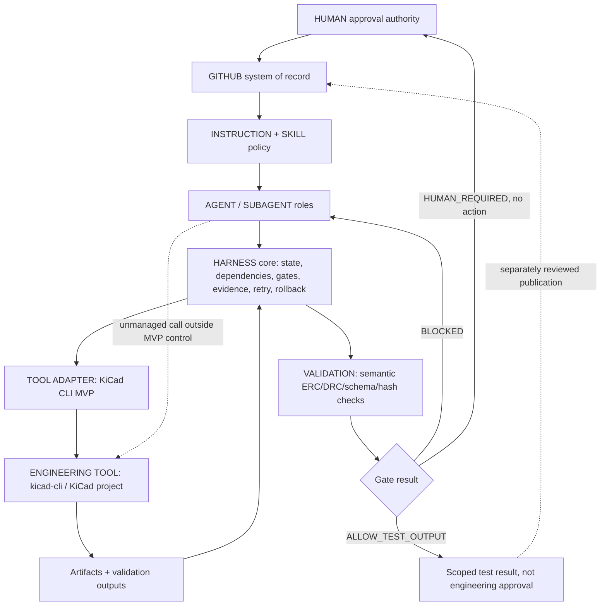

# Engineering Harness architecture proposal（pre-implementation）

この提案は **CANDIDATE / human decision pending** の pre-implementation design である。Primary repository の既存 controls を再利用し、最小の reliability benefit を後続 task で測る。MVP 実装、MCP 接続、CAD/EDA domain command、実験結果は含まない。Cloud 版からの local correction と、別途実施した version/help-only preflight は [`local-supplement.md`](local-supplement.md) に分離して記録する。

## Layer responsibility matrix

| Layer | Responsibility | Not responsible for | Primary binding |
|---|---|---|---|
| HUMAN | Architecture decisions, purchase, fabrication, first power/flashing, safety exceptions | Writing adapter code or changing failed/stale evidence to PASS | HITL gates in `docs/architecture.md` §10; authenticated approval evidence, not actor/date text |
| GITHUB | system of record for commits, PRs, reviews, CODEOWNERS, artifacts, CI checks | Proving CAD/EDA physics by itself | Existing workflows and PR review |
| COPILOT / model pool | Multi-model execution environment and reasoning | Self-certifying identity/cost/approval/physical correctness | Actual tool/session metadata; missing fields = UNKNOWN |
| AGENT / SUBAGENT | Role-bounded technical authorship/review | Owning other roles’ artifacts; bypassing gates | 14-role roster and workflow phases |
| INSTRUCTION / SKILL | Durable policy/expertise and routing | Runtime state, rollback, or validation result | AGENTS/copilot-instructions/skills |
| HARNESS | State, declared dependencies, gates, evidence, retry and owned-output rollback on its controlled invocation path | Global tool interception, OS isolation, replacing roles or human authority | Proposed minimal library/CLI in a later task; existing admission control stays separate |
| TOOL ADAPTER | One engineering tool’s snapshot/execute/validate/rollback/commit protocol | Domain judgment or broad platform orchestration | MVP: KiCad CLI adapter candidate |
| MCP/API/CLI | Connectivity to application | Global trust-boundary enforcement, including when an optional wrapper exists | Runtime-specific capability observations |
| ENGINEERING TOOL | Actual CAD/EDA/simulation/visualization computation | Policy/gate decision | KiCad/Fusion/FreeCAD/etc. |
| VALIDATION | Objective semantic checks | Cosmetic preview or model assertion | DRC/ERC/schema/hash checks |
| ARTIFACTS | Versioned design/evidence/log files | Approval by mere existence | Repository files and hashes |

## Architecture alternatives

### Alternative A — Incremental Harness Core + one KiCad CLI adapter（recommended MVP）

- Add a small operation/evidence schema alongside, not instead of, existing `agent_workflow` admission and CI.
- One adapter: installed native `kicad-cli sch erc` and `kicad-cli pcb drc` on synthetic/test-only fixtures. No export, board rewrite, GUI, MCP package or new tool installation is implied.
- Operation sequence: `snapshot -> execute -> parse semantic result -> retain evidence -> gate -> publish test output or restore owned output`.
- Proposed benefit: measure semantic ERC/DRC handling, direct-input freshness and failed-output containment at a narrow, observable native interface. This is a hypothesis, not an already-proven benefit or a claim that candidate MCP projects are broken.
- Limits: controlled calls and cooperative writers only; no OS sandbox, other adapters, real hardware or repository-wide transitive invalidation.

### Alternative B — Fusion parameter snapshot/rollback adapter first

- Build around Fusion360 MCP patterns: read design parameters, mutate one parameter, compute, rollback on failure.
- Benefits: clean demonstration of snapshot/rollback and typed geometry selection.
- Risks: the Cloud research did not have a usable native Fusion runtime; local Fusion capability is not preflighted by this task. Primary has separate native/video evidence requirements, so this would need its own fixture and capability work.
- Verdict: credible future adapter, not smallest reliable MVP in this repo.

### Alternative C — Repository-only gate/evidence engine without tool adapter

- Implement separate lifecycle/verdict/freshness/gate/recovery records using synthetic outcomes without connecting to KiCad/Fusion/FreeCAD.
- Benefits: safest and easiest CI; good schema tests.
- Risks: cannot prove Harness-versus-no-Harness benefit around a real engineering tool boundary; may duplicate current policy.
- Verdict: useful subset, but insufficient alone because the requested MVP includes one adapter and deterministic validation.

### Alternative D — General multi-model team harness adoption

- Add HARNESS.md / Team Harness / Harness Starter Kit style orchestration and progressive disclosure.
- Benefits: model independence and run artifacts.
- Risks: duplicates current AGENTS/copilot/skills, creates a broader agent factory, and fails the “smallest system capable of proving reliability benefit” objective.
- Verdict: reject for first MVP; reference for future packaging only.

## Recommended architecture



The Harness controls only calls admitted through its wrapper and publication through its own output path. Another agent, MCP client or shell can invoke KiCad directly; the wrapper cannot intercept or prevent that. Repository-relative allowlists, hash fences and symlink rejection reduce mistakes within this path, but are **not an OS sandbox against arbitrary same-UID namespace mutation or unrestricted writers**. Keep existing repository controls and report these limits, not universal prevention.

### Rev5-relevant bounded use

The user's joint goal is the Rev5 three-axis design **and** better AI handling, not replacing that design with a tooling platform or returning to a one-axis goal. The public [`requirements/requirements.md`](../../requirements/requirements.md) Rev5 scope/§10c and inherited [`Bench-IMU-01 schematic`](../../hardware/schematic/bench-imu-01/README.md) / [`PCB workflow`](../../hardware/pcb/README.md) anchor a concrete candidate: prevent an AI handoff from treating an old ERC/DRC report as current review-readiness evidence after a schematic, PCB, rule or library input changes.

The experiment represents that handoff with a tiny test project and a **test-only downstream review-readiness record**, bound directly to its source/configuration hashes and ERC/DRC report. Existing KiCad artifacts are relevance anchors, not fixtures executed here or proof of a completed three-axis board. Fixture success closes no existing electrical, mechanical, source, power, simulation or safety blocker. Rev5 design ownership, existing verdicts, simulation/control implementation and human/physical gates remain unchanged.

## State model

Minimum operation state fields:

| Field | Meaning |
|---|---|
| `operation_id` | Collision-resistant ID scoped by task/adapter/artifact |
| `task_id` / `run_id` | Existing bounded-work link |
| `operation_lifecycle` | `PLANNED`, `RESERVED`, `SNAPSHOTTED`, `EXECUTING`, `VALIDATING`, `SUCCEEDED`, `FAILED`, `BLOCKED`; execution progress/outcome only |
| `validation_verdict` | `NOT_RUN`, `PASS`, `FAIL`, `ERROR`, `NOT_APPLICABLE`; semantic validation of the recorded bytes only |
| `evidence_freshness` | `UNKNOWN`, `CURRENT`, `STALE`; identity against declared current inputs, not correctness |
| `gate_decision` / `gate_reasons` | `NOT_EVALUATED`, `ALLOW_TEST_OUTPUT`, `BLOCKED`, `HUMAN_REQUIRED`; preserve all applicable blocking reasons |
| `recovery_outcome` | `NOT_NEEDED`, `NOT_ATTEMPTED`, `IN_PROGRESS`, `ROLLBACK_OK`, `ROLLBACK_FAILED`; restoration outcome only |
| `owner` | Role/session identity; requested model and attested actual model/tool identity separated |
| `adapter` | Name/version and executable identity; separate presence, version/help, domain-execution and acceptance observations; private paths redacted for publication |
| `input_revisions` | Git commit + file hashes for all inputs |
| `owned_outputs` | Files this operation may create/replace/delete |
| `result_semantics` | Parsed domain result, not just exit code |
| `errors` | Classified error code/message, redacted log pointer |
| `approval_binding` | Typed reference with provenance/verification status, not proof of authority; test approvals explicitly `SYNTHETIC_ONLY` and `usable_for_real_action: false` |

The existing `agent_workflow` `RUNNING` / `DONE` / `BLOCKED` vocabulary remains an independent admission/handoff record. Its `DONE` may contain a failed validation; no replacement or migration of that tool is proposed.

Examples: a failed validation followed by successful restore remains `operation_lifecycle=FAILED`, `validation_verdict=FAIL`, `gate_decision=BLOCKED`, `recovery_outcome=ROLLBACK_OK`. A previously successful operation may retain its historical `PASS` while a new freshness assessment is `STALE` and its current gate is `BLOCKED`. A missing executable is lifecycle `BLOCKED`, verdict `NOT_RUN`, gate `BLOCKED`, not engineering `FAIL` or `PASS`. Unknown identity, cost or evidence is recorded explicitly, never promoted to validation success.

## Dependency model

- Initial scope: explicit direct input bindings for one fixture report and its test-only decision. Include source/configuration hashes, tool identity/version, threshold policy and required evidence.
- The decision explicitly lists the same load-bearing source/configuration inputs **plus** the report hash. It rechecks them itself; no transitive graph traversal or automatically discovered edges are implied.
- A changed declared binding makes the current assessment `STALE` and blocks that dependent test decision. A missing/unknown binding blocks it too; no compatibility exception may silently preserve `PASS`.
- Preserve current historical evidence. Do not rewrite old PASS; issue a new evidence revision and mark the old one historical.
- Unlisted or transitive dependencies remain undetected by this MVP. General `derived_from` / `validated_by` / `approved_by` graph propagation is a possible later proposal, not a solved gap or an adopted roadmap.

## Gate model

| Gate | Blocks when | Required result semantics |
|---|---|---|
| Tool capability gate | tool missing, incompatible or required command unavailable | lifecycle `BLOCKED`, verdict `NOT_RUN`, gate `BLOCKED`; real-tool milestone incomplete |
| Snapshot gate | dirty/missing input, missing hash, unowned output path | gate `BLOCKED`; no unsafe mutation |
| ERC/DRC validation | actual violations or unparseable/incomplete report | verdict `FAIL` or `ERROR`, gate `BLOCKED`; never PASS on exit 0 alone |
| Evidence completeness | missing hash/log/config/result | gate `BLOCKED` |
| Staleness gate | declared revision/hash/tool/threshold differs | freshness `STALE`, gate `BLOCKED` |
| Human-decision routing | export/fabrication/purchase/safety action requested | gate `HUMAN_REQUIRED` with `OUT_OF_MVP_SCOPE`; no such action is implemented or enabled by a JSON approval |

`ALLOW_TEST_OUTPUT` needs successful execution, semantic `PASS`, current and complete evidence, and owned test outputs; it is not Design Complete. Preserve existing stricter rules outside the MVP: CRITICAL blocks Design Complete, non-PASS DRC does not authorize a manufacturing package, and missing/stale evidence cannot support a dependent approval. If multiple gates fail, retain all reasons; routing to a human does not clear failure or staleness.

## Validation strategy

- Unit/fault-injection tests cover separate states, direct-input freshness, semantic parsing, unsafe output paths, missing/corrupt outputs, timeout and rollback failures.
- A later real-tool claim requires **real clean ERC and DRC, real failing ERC, and real failing DRC** on owned test fixtures in both arms. Presence, successful version/help, successful domain command execution and engineering acceptance are four different facts.
- Tool absence is a useful capability-failure observation, not a completed MVP. Missing any mandatory real-tool case leaves that milestone **PARTIAL/incomplete**, even if every mock/unit test passes.
- All requested failure classes, including invalid outline/geometry and corrupt output, are mandatory matched A/B cases; the [`experiment contract`](experiment-contract.md) distinguishes real KiCad from identically injected parser/output faults.
- Golden logs use redacted, minimal command stdout/stderr and file hashes, not raw environment dumps.
- Reuse existing commands where relevant: `PYTHONPATH=tools python3 -m unittest discover -s tools/tests -p 'test_*workflow*.py'`, `python3 tools/check_id_uniqueness.py`, and adapter-specific tests added only in the later MVP task.

## Evidence model

Each operation evidence record should contain:

- scoped evidence ID or derived operation ID;
- operation name and domain;
- role, requested model, actual attested model if available, tool adapter, engineering tool path/version;
- source/input revisions and hashes;
- output revisions and hashes;
- command/config, start/end time, exit code, parsed result semantics;
- separate lifecycle, validation verdict, freshness, gate reasons and recovery outcome;
- redacted log/error pointer;
- approval-reference provenance and verification status, binding the requested action to exact input/evidence hashes without treating typed actor/date/reason as authentication.

## Retry model

Retry only when all are true: failure is connection/startup/transient, no mutation happened or snapshot proves mutation state is known safe, operation is idempotent, and retry count/backoff are recorded. Never retry blindly for DRC/ERC failures, unsafe/unknown state, partial writes, inconsistent outputs, rollback failure, export/fabrication side effects, or human-approval-required states.

## Rollback model

- Snapshot only operation-owned files before mutation.
- Use explicit revision fences: rollback may restore only files whose current hash still matches the operation’s pre/post expectation.
- Under cooperative-writer assumptions, refuse restore on an unexpected current hash; no generic `git reset`. Hash/path checks cannot protect against arbitrary concurrent same-UID namespace changes.
- If restore cannot establish ownership or exact bytes, record `recovery_outcome=ROLLBACK_FAILED`, keep the failed operation and blocked gate, and require reconciliation.
- For KiCad MVP, rollback is file-copy restore for synthetic fixture outputs, not live KiCad undo-stack rollback.
- Even `ROLLBACK_OK` never changes a failed operation or validation to PASS. Retain failure logs/evidence independently of restored output files.

## Human approval model

A typed approval **reference** can carry actor, date, operation ID, input/evidence hashes, requested action, rationale and scope/expiration. Those fields can be forged or self-asserted; they do not prove that an authorized human approved anything. Real authorization needs an independently verified, authenticated human record and its exact applicable scope through the repository's existing process. CODEOWNERS names expected reviewers, not proof that required-review repository rules are enabled; rule enforcement here is **NOT_VERIFIED**.

This MVP implements no irreversible action or authority-granting integration. Test fixtures use `SYNTHETIC_ONLY`, a fictitious actor and `usable_for_real_action: false`; even a matching fixture approval must not enable real export, fabrication, purchase, power-on or flashing. Human decisions remain outside the experiment and cannot override failed/stale evidence to PASS. A generic instruction to continue locally is not architecture, adapter or physical approval.

## Tool adapter architecture

Interface:

1. `preflight()` -> separate presence and version/help observations, with domain execution/acceptance still `NOT_RUN` until exercised.
2. `snapshot(inputs, owned_outputs)` -> hashes and restorable bytes for owned outputs.
3. `execute(request)` -> allowlisted ERC/DRC command with timeout and redacted logs; no arbitrary shell/export, `--save-board` or `--refill-zones`.
4. `parse_result()` -> semantic domain result.
5. `validate()` -> semantic verdict, freshness and distinct gate decision.
6. `publish_test_result()` -> scoped test evidence/artifacts only, not a Git commit, merge, design promotion or manufacturing release.
7. `rollback()` -> restore operation-owned outputs under revision fences.

MVP adapter: native KiCad CLI first because it is a narrow measurable interface, **not a dependency on or installation of `blwfish/kicad-mcp`**. `docs/architecture.md` §5.2 records a 2026-08-31 environment/client-specific MCP observation, not evidence that a separately inspected candidate revision has the same defect. MCP/IPC would require a separately approved scope and its own runtime/operation tests.

## Multi-model strategy

The Harness must treat `MODEL` as replaceable intelligence. It records requested and actual identities where the environment exposes them, but never accepts model self-certification. Comparison experiments may use the same prompts across models, but success metrics are engineering/gate outcomes, not subjective quality. Team Harness-like model abstraction is future reference only; the MVP must not create a new agent factory.

## Security assessment

- External MCPs frequently expose local filesystem, arbitrary Python or editor control; default deny for unbounded execution.
- Adapter allowlists paths/commands and rejects symlinks/path traversal within controlled calls. This is mistake containment under cooperative access, not an OS sandbox or protection from unmanaged clients/unrestricted same-UID writers.
- Logs are redacted and bounded; no credentials, private worktrees, vendor binaries, or raw environment dumps.
- The proposed adapter makes no network requests; ordinary GitHub publication is a separate repository workflow. This policy is not an independently verified OS-level network confinement guarantee.
- Real manufacturing exports, fabrication, purchase, first power/flashing and destructive external actions stay outside MVP permission, regardless of an approval fixture.

## GitHub system-of-record strategy

- Git commits/PRs carry the reviewed state; no hidden local database is authoritative after handoff.
- Existing SQLite reservations remain local admission control only.
- Evidence records include hashes so GitHub review can compare exact bytes.
- Proposed result rendering keeps verdict, applicability, freshness and gate fields separate; no CI behavior is changed here.
- CODEOWNERS declares reviewers for high-risk paths. Actual required-review enforcement depends on repository rules and is **NOT_VERIFIED** in this task; approval references cannot replace those reviews.

## Proposed folder structure（後続 MVP task 用）

No implementation in this milestone. If approved later, the smallest structure should be:

```text
tools/engineering_harness.py                  # core state/gate CLI
tools/engineering_harness_adapters/kicad.py   # one KiCad CLI adapter
tools/tests/test_engineering_harness.py       # synthetic state/gate/rollback tests
docs/engineering-harness-mvp-<date>/          # experiment contract/results for implementation task
```

Do not add root `HARNESS.md` yet. Do not move existing roles/skills/workflows.

## MVP recommendation

Choose **Alternative A: Incremental Harness Core + one KiCad CLI adapter**.

Smallest MVP scope:

1. Separate operation/evidence fields for one test-only EDA validation and downstream review-readiness handoff.
2. Native KiCad CLI preflight; then the real clean/failing ERC/DRC cases required for a later tool-reliability claim.
3. Snapshot/execute/semantic-validate/publish-test-result-or-restore around operation-owned fixture outputs.
4. Direct declared-input freshness and distinct evidence/gate/recovery outcomes; no transitive graph or new authority service.
5. Unit/fault-injection coverage and **both A/B arms for every mandatory scenario** in `experiment-contract.md`, including invalid geometry and corrupt output without adding a CAD adapter.
6. Positive controls, false-blocking measurements and honest benefit/completion reporting; inability to exercise mandatory real-tool cases is PARTIAL, not prevention success.

Out of scope: Fusion/FreeCAD/Blender/Unity integration, external MCP dependency adoption, broad multi-model orchestration, real manufacturing export, root HARNESS.md, physical hardware, private/local Rev5 state and simulation/control changes. Stop before implementation until the human chooses the MVP; fixture results never close real Rev5 blockers.

## Critical self-review（not independent approval）

- Cloud runtime limitations affected the original comparison. The local supplement closes three website retrieval gaps and version/help availability only, not comparative native-tool reliability. CLI-first remains a bounded-interface recommendation, not a finding that all MCP paths fail.
- A one-adapter KiCad MVP risks being too EDA-specific. Mitigation: keep the adapter interface generic and require the experiment to prove a reliability delta before expanding.
- Typed evidence schemas can become duplicate bureaucracy if they do not replace concrete failure modes. Mitigation: implement only fields required by the A/B experiment and existing failures above.
- File-copy rollback for KiCad fixtures is weaker than native application transactions. It is still the correct first proof because it is observable in CI and avoids making false claims about live KiCad undo/IPC state.
- Synthetic approval records do not authenticate a human, and required-review enforcement was not observed. Keeping irreversible actions entirely absent is smaller and more honest than pretending to implement authorization.
- A direct-only dependency list can miss a transitive source change; the declared test decision must list its load-bearing inputs explicitly. No repository-wide invalidation claim follows.
- If the existing baseline already catches every tested failure, no reliability improvement is demonstrated. Report that outcome instead of removing baseline controls or broadening the claim.
