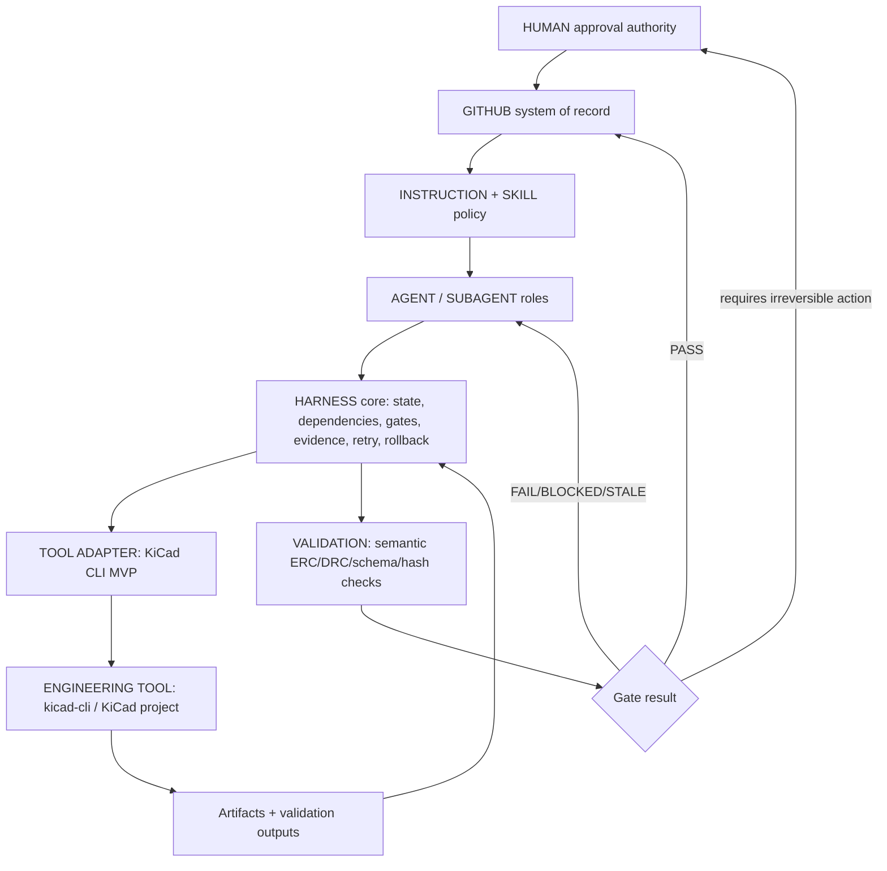

# Engineering Harness architecture proposal（pre-implementation）

この提案は architecture/MVP decision 用の pre-implementation design であり、MVP 実装、MCP 接続、CAD/EDA 実行、実験結果の捏造を含まない。Primary repository の既存 controls を再利用し、最小の reliability benefit を測る。

## Layer responsibility matrix

| Layer | Responsibility | Not responsible for | Primary binding |
|---|---|---|---|
| HUMAN | irreversible architecture, purchase, fabrication, first power/flashing, safety exceptions | Writing adapter code or changing failed evidence to PASS | HITL gates in `docs/architecture.md:601-624`, CODEOWNERS |
| GITHUB | system of record for commits, PRs, reviews, CODEOWNERS, artifacts, CI checks | Proving CAD/EDA physics by itself | Existing workflows and PR review |
| COPILOT / model pool | Multi-model execution environment and reasoning | Self-certifying identity/cost/approval/physical correctness | Actual tool/session metadata; missing fields = UNKNOWN |
| AGENT / SUBAGENT | Role-bounded technical authorship/review | Owning other roles’ artifacts; bypassing gates | 14-role roster and workflow phases |
| INSTRUCTION / SKILL | Durable policy/expertise and routing | Runtime state, rollback, or validation result | AGENTS/copilot-instructions/skills |
| HARNESS | Operation state, dependencies, gates, evidence, retry, rollback, adapter boundary | Replacing roles, human authority, GitHub, or engineering tools | Proposed new minimal library/CLI in a later task |
| TOOL ADAPTER | One engineering tool’s snapshot/execute/validate/rollback/commit protocol | Domain judgment or broad platform orchestration | MVP: KiCad CLI adapter candidate |
| MCP/API/CLI | Connectivity to application | Trust boundary enforcement unless wrapped | Existing KiCad CLI/MCP facts |
| ENGINEERING TOOL | Actual CAD/EDA/simulation/visualization computation | Policy/gate decision | KiCad/Fusion/FreeCAD/etc. |
| VALIDATION | Objective semantic checks | Cosmetic preview or model assertion | DRC/ERC/schema/hash checks |
| ARTIFACTS | Versioned design/evidence/log files | Approval by mere existence | Repository files and hashes |

## Architecture alternatives

### Alternative A — Incremental Harness Core + one KiCad CLI adapter（recommended MVP）

- Extend current `agent_workflow`/CI philosophy with a small harness state/gate/evidence schema under task-owned docs or future `tools/engineering_harness.py`.
- One adapter: KiCad CLI (`kicad-cli sch erc`, `kicad-cli pcb drc`, and controlled export where applicable) over a synthetic/test-only KiCad fixture.
- Operation sequence: `snapshot -> execute -> parse semantic result -> evidence -> gate -> commit or rollback owned outputs`.
- Benefits against Primary failures: avoids broken MCP ctx path, proves semantic DRC/ERC gating, tests missing/stale evidence, and keeps rollback bounded to generated operation-owned outputs.
- Limits: no Fusion/FreeCAD/Blender integration; no real hardware; does not solve full transitive graph for every artifact yet.

### Alternative B — Fusion parameter snapshot/rollback adapter first

- Build around Fusion360 MCP patterns: read design parameters, mutate one parameter, compute, rollback on failure.
- Benefits: clean demonstration of snapshot/rollback and typed geometry selection.
- Risks: requires unavailable native Fusion runtime in hosted Ubuntu; Primary has stricter Fusion native/video evidence needs and no current Fusion artifact fixture. Harder to run deterministic CI.
- Verdict: credible future adapter, not smallest reliable MVP in this repo.

### Alternative C — Repository-only gate/evidence engine without tool adapter

- Implement typed operation/evidence/gate records and simulate PASS/FAIL/STALE states without connecting to KiCad/Fusion/FreeCAD.
- Benefits: safest and easiest CI; good schema tests.
- Risks: cannot prove Harness-versus-no-Harness benefit around a real engineering tool boundary; may duplicate current policy.
- Verdict: useful subset, but insufficient alone because the requested MVP includes one adapter and deterministic validation.

### Alternative D — General multi-model team harness adoption

- Add HARNESS.md / Team Harness / Harness Starter Kit style orchestration and progressive disclosure.
- Benefits: model independence and run artifacts.
- Risks: duplicates current AGENTS/copilot/skills, creates a broader agent factory, and fails the “smallest system capable of proving reliability benefit” objective.
- Verdict: reject for first MVP; reference for future packaging only.

## Recommended architecture



The Harness is a thin execution boundary, not a new agent role. It should keep current repository controls and produce typed state/evidence that existing CI and humans can audit.

## State model

Minimum operation state fields:

| Field | Meaning |
|---|---|
| `operation_id` | Collision-resistant ID scoped by task/adapter/artifact |
| `task_id` / `run_id` | Existing bounded-work link |
| `state` | `PLANNED`, `RESERVED`, `SNAPSHOTTED`, `EXECUTING`, `VALIDATING`, `PASS`, `FAIL`, `BLOCKED`, `STALE`, `ROLLBACK_OK`, `ROLLBACK_FAILED`, `HUMAN_REQUIRED` |
| `owner` | Role/session identity; requested model and attested actual model/tool identity separated |
| `adapter` | Name, version, executable path, capability result |
| `input_revisions` | Git commit + file hashes for all inputs |
| `owned_outputs` | Files this operation may create/replace/delete |
| `result_semantics` | Parsed domain result, not just exit code |
| `errors` | Classified error code/message, redacted log pointer |
| `approval_binding` | Optional human approval bound to exact inputs/evidence |

`UNKNOWN` is valid for unavailable model identity, billing/cost, tool version, or external evidence; it must not be converted into PASS.

## Dependency model

- Nodes: design sources, generated artifacts, evidence records, validation results, approvals, operation logs, tool capability records.
- Edges: `derived_from`, `validated_by`, `approved_by`, `supersedes`, `retired_by`, `blocks`, `depends_on`.
- Any upstream file hash, source revision, adapter version, validation threshold, or human exception target change marks downstream nodes `STALE` unless a declared compatibility rule says otherwise.
- Preserve current historical evidence. Do not rewrite old PASS; issue a new evidence revision and mark the old one historical.
- Initial MVP can implement direct dependency invalidation for one KiCad fixture; transitive multi-domain invalidation is the roadmap.

## Gate model

| Gate | Blocks when | Required result semantics |
|---|---|---|
| Tool capability gate | tool not installed, wrong version, unsupported command | `BLOCKED`, not FAIL |
| Snapshot gate | dirty input, missing input hash, output path not owned | `BLOCKED` |
| ERC/DRC validation | KiCad reports violations or unparsable output | `FAIL` with issue detail, not PASS on exit 0 |
| Evidence completeness | missing hash/log/config/result | `BLOCKED` |
| Staleness gate | upstream revision/hash differs | `STALE` |
| Human approval gate | fabrication/export/purchase/safety exception requested without bound approval | `HUMAN_REQUIRED` |

Preserve existing stricter local rules: CRITICAL blocks Design Complete; DRC != PASS blocks manufacturing package; missing evidence blocks approval; stale simulation blocks any decision that depends on it.

## Validation strategy

- Unit tests with synthetic fixtures for state transitions, stale dependency propagation, semantic PASS/FAIL parsing, unauthorized output paths, and rollback failures.
- One integration-style local fixture using a tiny KiCad project when `kicad-cli` is available; otherwise expected `BLOCKED` capability result with evidence.
- Golden logs use redacted, minimal command stdout/stderr and file hashes, not raw environment dumps.
- Reuse existing commands where relevant: `PYTHONPATH=tools python3 -m unittest discover -s tools/tests -p 'test_*workflow*.py'`, `python3 tools/check_id_uniqueness.py`, and adapter-specific tests added only in the later MVP task.

## Evidence model

Each operation evidence record should contain:

- scoped evidence ID or derived operation ID;
- operation name and domain;
- role, requested model, actual attested model if available, tool adapter, engineering tool path/version;
- source/input revisions and hashes;
- output revisions and hashes;
- command/config, start/end time, exit code, parsed result semantics;
- validation result and gate decision;
- redacted log/error pointer;
- approval object when required, binding actor/date/reason to exact evidence hash.

## Retry model

Retry only when all are true: failure is connection/startup/transient, no mutation happened or snapshot proves mutation state is known safe, operation is idempotent, and retry count/backoff are recorded. Never retry blindly for DRC/ERC failures, unsafe/unknown state, partial writes, inconsistent outputs, rollback failure, export/fabrication side effects, or human-approval-required states.

## Rollback model

- Snapshot only operation-owned files before mutation.
- Use explicit revision fences: rollback may restore only files whose current hash still matches the operation’s pre/post expectation.
- Never discard another writer’s work; no generic `git reset`.
- If rollback cannot prove ownership or restore exact bytes, set `ROLLBACK_FAILED` and require human reconciliation.
- For KiCad MVP, rollback is file-copy restore for synthetic fixture outputs, not live KiCad undo-stack rollback.

## Human approval model

Human approval is a typed record, not a prose exception. It must include actor, date, operation ID, input hashes, evidence hash, requested irreversible action, rationale, and expiration/scope if applicable. Approval can permit a blocked/risky action to proceed under named conditions; it does not rewrite failed/stale validation to PASS.

## Tool adapter architecture

Interface:

1. `preflight()` -> executable/tool version/capability matrix or BLOCKED.
2. `snapshot(inputs, owned_outputs)` -> hashes and restorable bytes for owned outputs.
3. `execute(request)` -> command invocation with timeout and redacted logs.
4. `parse_result()` -> semantic domain result.
5. `validate()` -> deterministic gate result.
6. `commit()` -> publish evidence/artifacts.
7. `rollback()` -> restore operation-owned outputs under revision fences.

MVP adapter: KiCad CLI first. MCP/IPC integrations may be added later behind the same adapter interface after capability preflight proves they work in the current runtime.

## Multi-model strategy

The Harness must treat `MODEL` as replaceable intelligence. It records requested and actual identities where the environment exposes them, but never accepts model self-certification. Comparison experiments may use the same prompts across models, but success metrics are engineering/gate outcomes, not subjective quality. Team Harness-like model abstraction is future reference only; the MVP must not create a new agent factory.

## Security assessment

- External MCPs frequently expose local filesystem, arbitrary Python or editor control; default deny for unbounded execution.
- Adapter allowlists repository-relative input/output paths and rejects symlinks/path traversal.
- Logs are redacted and bounded; no credentials, private worktrees, vendor binaries, or raw environment dumps.
- No network operations in MVP adapter except normal GitHub PR/CI interaction already used by the repository.
- Human approval required for manufacturing exports, fabrication, purchase, first power/flashing, destructive external operations and stale exceptions.

## GitHub system-of-record strategy

- Git commits/PRs carry the reviewed state; no hidden local database is authoritative after handoff.
- Existing SQLite reservations remain local admission control only.
- Evidence records include hashes so GitHub review can compare exact bytes.
- CI publishes PASS/FAIL/N/A/BLOCKED/STALE semantics in human-readable logs.
- CODEOWNERS continues to gate high-risk paths; Harness approval records supplement, not replace, reviews.

## Proposed folder structure（後続 MVP task 用）

No implementation in this milestone. If approved later, the smallest structure should be:

```text
tools/engineering_harness.py                  # core state/gate CLI
tools/engineering_harness_adapters/kicad.py   # one KiCad CLI adapter
tools/tests/test_engineering_harness.py       # synthetic state/gate/rollback tests
docs/engineering-harness-mvp-<date>/          # experiment contract/results for implementation task
```

Do not add root `HARNESS.md` yet. Do not move existing roles/skills/workflows.

## MVP recommendation

Choose **Alternative A: Incremental Harness Core + one KiCad CLI adapter**.

Smallest MVP scope:

1. Typed operation/evidence JSON schema for one KiCad fixture operation.
2. KiCad CLI preflight with `UNKNOWN/BLOCKED` capability semantics.
3. Snapshot/execute/semantic-validate/commit-or-rollback around operation-owned synthetic fixture files.
4. Gates for PASS/FAIL/BLOCKED/STALE/HUMAN_REQUIRED.
5. Tests for stale inputs, semantic DRC/ERC failure, missing evidence, unauthorized export, timeout, partial write, corrupt output, and rollback failure.
6. A/B experiment runner that executes the same fixture directly and through Harness, recording metrics without changing production hardware artifacts.

Out of scope: Fusion/FreeCAD/Blender/Unity integration, broad multi-model orchestration, real manufacturing export, root HARNESS.md, physical hardware, private/local Rev5 state.

## Critical self-review（not independent approval）

- The recommendation may overweight Primary’s current KiCad history because Fusion/FreeCAD websites were not fully accessible/runnable in hosted Ubuntu. This is acceptable for the first MVP because deterministic CI is a higher priority than integration breadth.
- A one-adapter KiCad MVP risks being too EDA-specific. Mitigation: keep the adapter interface generic and require the experiment to prove a reliability delta before expanding.
- Typed evidence schemas can become duplicate bureaucracy if they do not replace concrete failure modes. Mitigation: implement only fields required by the A/B experiment and existing failures above.
- File-copy rollback for KiCad fixtures is weaker than native application transactions. It is still the correct first proof because it is observable in CI and avoids making false claims about live KiCad undo/IPC state.
- Human approvals may be hard to bind without GitHub review APIs in local tests. MVP should model approval objects and require CODEOWNERS/PR evidence for real irreversible actions, while synthetic tests use fixture approvals clearly marked non-real.
