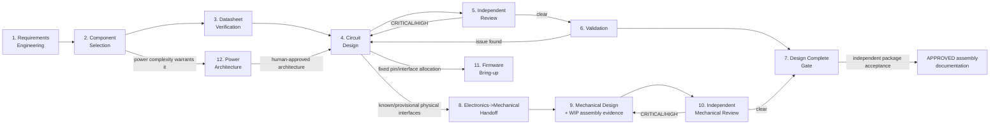

# Engineering Workflow

This is the operational, step-by-step companion to `docs/architecture.md`.
Read architecture.md first for the vocabulary (severity taxonomies, Evidence
ID scheme, gates); this document is "what happens, in what order, with what
entry/exit criteria."

## 1. Phase Sequence

Phases 8-10 (Mechanical, Phase 1 of the multidisciplinary evolution —
`docs/architecture-evolution.md` §27) fork from Phase 4 rather than waiting
for Phase 7, and feed back into the same Phase 7 gate — see Phase 8's entry
criteria below for why. Phase 11 (Firmware, Phase 2 of the multidisciplinary
evolution — `docs/architecture-evolution.md` §32) also forks from Phase 4,
for the same data-driven reasoning, but does **not** feed back into Phase
7's gate — see Phase 11's entry/exit criteria below for why firmware
bring-up is intentionally not a sixth Design Complete condition. Phase 12
(Power Architecture, Phase 3 of the multidisciplinary evolution —
`docs/architecture-evolution.md` §33) forks from Phase 2 instead, since it
needs Component Selection's real per-subsystem current/voltage numbers
before an architecture proposal is possible, and feeds forward *into*
Phase 4 rather than running alongside it — see Phase 12's entry/exit
criteria below.

## 2. Phase Detail

### Phase 1 — Requirements Engineering
- **Owner**: Hardware Lead, with the human Product Owner. Uses
  `.github/skills/requirements-engineering/SKILL.md`.
- **Entry criteria**: A human has stated a goal/problem (even informally).
- **Activities**: detect ambiguity, quantify (turn vague statements into
  measurable, testable requirements), prioritize (Must/Should/Could), detect
  conflicts/gaps (missing environmental, safety, interface requirements).
- **Exit criteria**: `requirements/requirements.md` filled in and
  human-approved (architecture-defining requirements are a HITL gate per
  architecture.md §10).
- **Artifacts produced**: `requirements/requirements.md`,
  `requirements/traceability-matrix.md` (rows initialized, `Status=Pending`).
- **Parallel-safe?** No — single coherent sign-off (architecture.md §4).

### Phase 2 — Component Selection
- **Owner**: Component Engineer. Uses `.github/skills/component-selection/SKILL.md`.
- **Entry criteria**: Approved requirements exist for the part(s) needed.
- **Activities**: identify candidates (≥3 when feasible — fan out with
  `explore`/`research` per candidate, architecture.md §4/§5.1), pull
  datasheets (→ Phase 3 for each), compare electrical specs/package/
  lifecycle/EOL/availability/reference design/ecosystem, recommend.
- **Exit criteria**: `bom/component-selection.md` filled in; recommendation
  approved by human if it is an architecture-defining/major component
  decision (HITL gate).
- **Escalation**: if no datasheet can be found for a candidate under serious
  consideration — stop, do not guess, escalate to human immediately.
- **Parallel-safe?** Candidate research: yes. Final recommendation: no
  (single consolidated judgment).

### Phase 3 — Datasheet Verification
- **Owner**: Component Engineer (during selection) and Circuit Engineer
  (before/while designing). Uses `.github/skills/datasheet-analysis/SKILL.md`.
- **Entry criteria**: A datasheet has been identified for a part in active
  use.
- **Activities**: register the datasheet in `datasheets/` (metadata record
  only — see §6.2 of architecture.md), extract constraints into
  `Parameter | Min | Typ | Max | Unit | Source` tables, separate Absolute
  Max / Recommended / Typical, assign Evidence IDs, log them in
  `datasheets/evidence-log.md`.
- **Exit criteria**: every parameter the design will depend on has an
  Evidence ID, or is explicitly `UNKNOWN`.
- **Parallel-safe?** Yes, per datasheet.

### Phase 4 — Circuit Design
- **Owner**: Circuit Engineer. Uses `.github/skills/schematic-design/SKILL.md`.
- **Entry criteria**: Parts approved (Phase 2) and datasheet constraints
  extracted (Phase 3). When Power Engineer is engaged for this project/
  revision (Phase 12 below), the power-section work specifically also
  requires Phase 12's human-approved architecture first — the rest of
  Circuit Design (non-power sub-blocks) is not blocked on it.
- **Activities**: fix shared resources first (rails, ground scheme, pin
  allocation) — serially — then design sub-blocks (power / MCU periphery /
  sensor interface / …), each against the full mandatory checklist in
  `.github/agents/circuit-engineer.agent.md`, each decision backed by an Evidence ID,
  update `hardware/power-budget.md`, then integrate serially. When Power
  Engineer is engaged, "fix rails" means implementing its approved
  architecture (Phase 12), not deciding the rail topology from scratch.
- **Exit criteria**: schematic artifact + design rationale log + self-check
  against the Hardware Reviewer's checklist completed, handed off.
- **Parallel-safe?** Sub-blocks: yes, after interfaces are fixed. Integration:
  no.

### Phase 5 — Independent Review
- **Owner**: Hardware Reviewer (checklist) + `rubber-duck` (premise check),
  run in parallel against the same handoff. Uses
  `.github/skills/hardware-review/SKILL.md`.
- **Entry criteria**: Circuit Engineer handoff received.
- **Activities**: run the full adversarial checklist (architecture.md §7.1);
  where a KiCad project exists, cross-check with `extract_schematic_netlist`
  / `identify_circuit_patterns` / `run_drc_check` (architecture.md §5.2);
  classify findings CRITICAL/HIGH/MEDIUM/LOW with Evidence IDs; record in
  `validation/design-review.md` (this cycle's report) and
  `validation/open-issues.md` (living backlog).
- **Exit criteria**: a single consolidated verdict — PASS / FAIL /
  CONDITIONAL.
- **Loop-back rule**: any CRITICAL or HIGH → back to Phase 4, then re-review
  (not a rubber stamp; re-run the checklist against the changed area and
  anything the change could affect).
- **Parallel-safe?** Topic-based sub-scans and the rubber-duck pass: yes.
  Verdict: no (architecture.md §4).

### Phase 6 — Validation
- **Owner**: Hardware Lead + human (MVP); future Test/Validation Engineer.
  Uses `validation/bring-up-procedure.md` for first power-on, plus whatever
  simulation is available (currently none — SPICE is Future Integration,
  architecture.md §13).
- **Entry criteria**: Review verdict is PASS (no open CRITICAL).
- **Activities**: bench bring-up per `validation/bring-up-procedure.md`
  (HITL gate: human sign-off required before applying power to real
  hardware), compare measured values against `requirements/
  traceability-matrix.md` and datasheet Recommended Operating Conditions.
- **Exit criteria**: traceability rows move to `Verified` (or `Failed`, which
  reopens Phase 4).
- **Parallel-safe?** Independent test cases: yes. Final validation verdict:
  no.

### Phase 7 — Design Complete Gate
- **Owner**: Hardware Lead (serial, per architecture.md §8).
- Checks all five Design Complete conditions; if any fail, routes back to
  the appropriate earlier phase instead of declaring completion. Where
  Phases 8-10 (Mechanical) are in progress or complete, the same check
  against `validation/open-issues.md` already covers Mechanical Reviewer
  findings too — see architecture.md §8 and §5.3; there is one gate, not a
  separate Electronics gate and Mechanical gate.
- On success: reports up to the human Product Owner / Chief Engineer.
- For assemblies, release APPROVED documentation only with the independently
  accepted revision package (`docs/assembly-evidence.md`). WIP assembly
  planning/animation and blocker review occur before this gate to expose
  faults; they do not waive it or the named physical-action safety gates.

### Phase 8 — Electronics → Mechanical Handoff *(Phase 1 of the
multidisciplinary evolution — `docs/architecture-evolution.md` §13, §27)*
- **Owner**: Mechanical Lead (extraction), Hardware Lead (overall interface
  completion and source-gap routing to existing Circuit/PCB/Mechanical/
  Manufacturing specialists; Systems Engineer for genuine boundary trade-offs).
- **Entry criteria**: Required physical subassemblies/interfaces are
  identified. Begin WIP planning with known/provisional inputs; a stable board
  outline, mounting holes, component heights and connector layout are needed
  before treating them as finalized dimensions, not before generating the
  evidence needed to resolve them. This is **data-driven, not gate-driven**:
  Phase 7 need not have passed. Mark assumptions/UNKNOWNs and re-enter this
  phase when upstream geometry changes.
- **Activities**: Mechanical Lead populates `hardware/mechanical-interface.md`
  from the existing KiCad project (via the same read-only tools documented in
  architecture.md §5.2) or from Circuit-Engineer-/human-supplied facts if no
  KiCad project exists yet. Every field is marked `CONFIRMED` / `ASSUMPTION` /
  `ESTIMATE` / `UNKNOWN` (`.github/instructions/mechanical-design.instructions.md`).
  Include populated/mated electronics, all required boards/sensors/drivers/
  power interfaces, mounting/insulation and retained connector/harness
  envelopes. Hardware Lead assigns source investigations or concrete
  alternatives; missing facts are not indefinitely parked on human approval.
- **Exit criteria**: `hardware/mechanical-interface.md`'s required fields
  (board outline, mounting holes, max component height, connector locations)
  are at least `ASSUMPTION`/`ESTIMATE`-populated, or an `UNKNOWN` has been
  assigned an investigation/next action. This permits WIP progress only;
  required unresolved interfaces do not count as ready for final acceptance.
  Named architecture/safety decisions still follow architecture.md §10.
- **Parallel-safe?** Yes, with Phases 5/6/7 (Electronics review/validation/
  gate) — this is exactly why the entry criterion above is data-driven rather
  than waiting for those phases to finish.

### Phase 9 — Mechanical Design *(Phase 1)*
- **Owner**: Mechanical Lead. Uses `.github/skills/enclosure-design/SKILL.md`
  and `.github/skills/mechanical-visualization/SKILL.md` for early assembly evidence.
- **Entry criteria**: Phase 8 exit criteria met.
- **Activities**: design against the full Phase 1 checklist in
  `.github/agents/mechanical-lead.agent.md` (enclosure/spatial layout, PCB
  mounting, connector accessibility, component-height clearance, internal
  clearance, fastener placement, wall thickness, assembly order, basic
  print-fit tolerance, basic manufacturability/3D-printability); produce the
  source + dimensional-spec table using runtime-verified tooling
  (architecture.md §5.3). Generate WIP assembly instructions, component/
  coordinate mapping, full installed/per-stage evidence and requested Fusion
  native animation/video per `docs/assembly-evidence.md`; self-check before
  handoff. Visualization never silently redesigns geometry or changes an
  installed pose to make a picture fit.
- **Exit criteria**: design artifact + rationale + self-check + revision
  manifest/evidence handed off. An early blocker-review handoff may be
  incomplete if explicitly WIP with source/capability owners and next actions;
  final acceptance requires the complete evidence package.
- **Loop-back**: if `hardware/mechanical-interface.md` changes after this
  phase starts (e.g. Circuit Engineer moves a connector), re-enter Phase 8
  for the changed fields, then resume here.
- **Parallel-safe?** No — single coherent geometry state, one Mechanical Lead
  (architecture-evolution.md §10).

### Phase 10 — Independent Mechanical Review *(Phase 1)*
- **Owner**: Mechanical Reviewer. Uses `.github/skills/mechanical-review/SKILL.md`.
- **Entry criteria**: Mechanical Lead handoff received, including incomplete
  WIP evidence when reviewing blockers early rather than claiming readiness.
- **Activities**: run the full adversarial mechanical checklist
  (`.github/agents/mechanical-reviewer.agent.md`); classify findings
  CRITICAL/HIGH/MEDIUM/LOW with the same taxonomy Hardware Reviewer uses
  (architecture.md §7.1); record in `validation/design-review.md` (a new
  dated instance) and `validation/open-issues.md` (`Source=mechanical-reviewer`
  — the same living backlog Hardware Reviewer uses, so it feeds the same
  Design Complete Gate). Inspect the revision manifest and full installed/
  per-stage evidence; independently inspect native storyboards and published
  video when accepting the requested Fusion package. Animation is not
  collision/continuous-path, support-removal, strength or safety proof.
- **Exit criteria**: a single consolidated verdict — PASS / FAIL / CONDITIONAL,
  naming early WIP blocker scope or final evidence acceptance and the exact
  source/artifact hashes. A WIP review cannot be presented as final readiness.
- **Loop-back rule**: any CRITICAL or HIGH → back to Phase 9, then re-review.
- **Parallel-safe?** No — one Reviewer, one verdict (architecture.md §4).

### Phase 11 — Firmware Bring-up *(Phase 2 of the multidisciplinary
evolution — `docs/architecture-evolution.md` §32)*
- **Owner**: Firmware Engineer. Uses `.github/skills/firmware-bringup/SKILL.md`.
- **Entry criteria**: Circuit Design (Phase 4) has fixed the pin/interface
  allocation (pin assignments, peripheral instances, mode-select straps) for
  the peripherals firmware needs — deliberately **data-driven, not
  gate-driven**, the same reasoning as Phase 8: it does **not** require
  Phase 7 (Design Complete Gate) to have passed first, since pin/interface
  facts are typically stable well before every electrical HIGH finding is
  resolved (e.g. an LDO input-margin disposition, architecture.md §8, has no
  bearing on which pin the IMU's I2C bus uses).
- **Activities**: extract the pin/interface contract from the schematic
  design document (never re-derive it independently); fix the MCU clock
  configuration first, serially, where the schematic leaves it open; gather
  register-level facts from the MCU/peripheral manufacturers' primary
  documentation with new Evidence IDs; implement any manufacturer-mandated
  sensor initialization sequence exactly, vendoring opaque data verbatim
  with attribution where required; write and self-check the firmware
  (`.github/agents/firmware-engineer.agent.md`'s full checklist); attempt a
  real compile if a toolchain is available or installable, disclosing the
  actual outcome honestly either way (architecture.md §5.4).
- **Exit criteria**: firmware source tree + design rationale document
  (Evidence-ID-cited, mirroring the schematic's own style) + self-check
  results + tooling/compile-status disclosure handed off to the Hardware
  Lead.
- **Loop-back rule**: if the schematic's pin/interface facts change after
  this phase starts (e.g. Circuit Engineer reassigns a pin during Phase 5
  rework), re-enter this phase for the affected peripheral driver(s).
- **Does *not* feed Phase 7's gate.** Unlike Phases 8-10, Firmware Bring-up
  is intentionally **not** wired into the Design Complete Gate
  (architecture.md §8) — a firmware defect doesn't block PCB fabrication or
  change anything about whether the *hardware* design is complete; it feeds
  `validation/bring-up-procedure.md` instead, as preparatory work for a
  future physical bring-up. See `docs/architecture-evolution.md` §32 for
  why this also avoids a real coupling problem in the shared
  `validation/open-issues.md` CI gate.
- **Parallel-safe?** No independent Firmware Reviewer exists yet
  (architecture.md §14, architecture-evolution.md §32) — self-check stands
  in for review this round, so there is no separate review pass to
  parallelize against. Safe to run in parallel with Phases 5/6/7/8-10 for
  the same data-driven reasons Phase 8 is.

### Phase 12 — Power Architecture *(Phase 3 of the multidisciplinary
evolution — `docs/architecture-evolution.md` §33)*
- **Owner**: Power Engineer, when engaged (a Hardware Lead judgment call per
  project/revision — `.github/agents/power-engineer.agent.md` "When this
  role is engaged"). Uses `.github/skills/power-architecture/SKILL.md`. For
  a simple single-rail design, this phase is skipped entirely and Circuit
  Engineer continues to own `hardware/power-budget.md` directly within
  Phase 4, exactly as before this phase existed.
- **Entry criteria**: Component Selection (Phase 2) has produced real
  current/voltage/thermal figures for a new subsystem's candidate parts, and
  the Hardware Lead has judged this project's power complexity exceeds what
  Circuit Engineer can track ad hoc (architecture.md §14's own example: "at
  Motor Driver / Reaction Wheel stage"). Deliberately forks from Phase 2
  rather than Phase 4, since an architecture proposal needs real subsystem
  numbers before it's possible at all, and must complete *before* Phase 4's
  power sub-block (not alongside it, unlike Phases 8-10/11's own
  parallel-with-later-phases pattern) — Circuit Engineer cannot correctly
  design a rail whose topology hasn't been decided yet.
- **Activities**: aggregate every existing + new subsystem's real load
  against existing rail capability; where a new rail/physical input is
  genuinely required, propose ≥2 real, named architecture options with
  trade-offs (never a single silently-picked default); check rail
  sequencing/coupling concerns; present the options for the human Chief
  Engineer's architecture decision (architecture.md §10); record the
  options + decision in `hardware/power-architecture.md`; update
  `hardware/power-budget.md` for the approved architecture's multi-rail
  numeric rollup; flag any new part-sourcing need back to Component
  Engineer.
- **Exit criteria**: `hardware/power-architecture.md` shows a recorded human
  decision + updated multi-rail `hardware/power-budget.md`, handed off to
  Circuit Engineer.
- **HITL gate**: the architecture decision itself is never self-approved by
  Power Engineer — same "architecture decisions" gate every other major
  topology choice in this framework goes through (architecture.md §10).
- **Loop-back rule**: if a later subsystem addition exceeds the approved
  architecture's headroom, re-enter this phase before Circuit Design
  proceeds on that subsystem's power section.
- **Parallel-safe?** Candidate-option drafting: yes, in the sense that it
  reuses Component Selection's already-parallel candidate research: no
  additional research fan-out of its own. The architecture recommendation
  and the human decision are each single serial steps, same reasoning as
  every other framework decision point (architecture.md §4).

## 3. Conflict Resolution / Deadlock Escalation Protocol

Applies whenever two agents (or an agent and a human-set constraint) produce
incompatible outputs — e.g. Component Engineer recommends a part for
availability reasons that Circuit Engineer finds has an application-circuit
blocker; or Circuit Engineer and Hardware Reviewer disagree on a finding's
severity.

1. **State positions with evidence.** Each side writes its position citing
   Evidence IDs (`datasheets/evidence-log.md`) or requirement IDs
   (`requirements/requirements.md`) — not unsupported opinion.
2. **Hardware Lead mediates.** Check which position is better grounded
   against `requirements/` and the evidence log. Request missing evidence
   from either side if the picture is incomplete. Optionally invoke
   `rubber-duck` for a neutral third read of the disagreement itself.
3. **Route a genuine cross-discipline technical trade-off to Systems
   Engineer.** If step 2's mediation determines this is a substantive
   Electrical-vs-Mechanical (or vs. Firmware) engineering trade-off — not a
   communication misunderstanding or an evidence gap that step 2 alone
   resolves — hand it to the Systems Engineer
   (`.github/agents/systems-engineer.agent.md`,
   `.github/skills/systems-integration/SKILL.md`) to apply its trade-off
   criteria (which side rests on a verified constraint vs. an unvalidated
   assumption; the cost/risk of changing each side, including
   already-independently-reviewed work that would be invalidated;
   preserving already-validated work where possible; explicitly surfacing
   ripple effects before a resolution is finalized) and produce a
   recommendation. Added following MISS-034
   (`docs/architecture-evolution.md` §44), where exactly this class of
   disagreement — which discipline's stale figure should yield — had a
   mediation *procedure* to surface it but no substantive technical criteria
   to resolve it once surfaced.
4. **Escalate if still unresolved.** Genuine trade-offs, safety-relevant
   ambiguity, or business/schedule trade-offs go to the human Chief Engineer
   as a short decision brief: both positions, evidence, trade-offs, and the
   Lead's recommendation — or, where step 3 applied, the Systems Engineer's
   recommendation — if either has one. The human decides — this is the same
   authority already established for architecture/major-component decisions
   (architecture.md §10), not a new channel. The Systems Engineer's own
   recommendation is never self-executing on a safety-relevant or
   architecture-level question (`docs/architecture.md` §10) — it informs
   this escalation, it does not replace it.
5. **Record the outcome.** Log the resolution and rationale in
   `validation/change-log.md` (if it changes something already designed) and/
   or `validation/open-issues.md` (if it resolves/reclassifies a finding),
   with cross-references to the Evidence IDs used.

## 4. Handoff Mechanism

Two layers, used together — see architecture.md §3 for the invocation model:

- **File-based (durable, git-tracked, the actual Source of Truth)**:
  `requirements/`, `bom/`, `hardware/`, `validation/`, `docs/`. This is what
  survives across sessions and is what a human audits. Every phase's real
  exit criteria is a file being in a specific state, not a chat message.
- **SQL `todos` / `todo_deps` (ephemeral, session-local control plane)**: used
  by whichever session is playing Hardware Lead to sequence and parallelize
  sub-agent dispatch within one working session — e.g. `component-search-mcu`
  / `component-search-imu` / `component-search-power` (no deps → parallel) →
  `component-comparison-consolidate` (depends on all three) →
  `circuit-design-power` / `circuit-design-mcu-periphery` /
  `circuit-design-sensor-if` (parallel, after interfaces fixed) →
  `circuit-integrate` (depends on all three) → `independent-review`
  (review + rubber-duck, parallel) → conditional `circuit-rework` or
  `design-complete-gate`. This layer is **not** a durable record — it resets
  per session and is not the place evidence or decisions live.

Once a stable board outline exists, the same chain extends (Phase 1,
Mechanical — §2 Phase 8-10 above): `circuit-integrate` → (fork)
`mechanical-interface-extract` → `mechanical-design` →
`wip-assembly-evidence` → `independent-mechanical-review` →
conditional `mechanical-rework` or
`design-complete-gate` — the *same* `design-complete-gate` todo both chains
converge on, matching the single shared `validation/open-issues.md` backlog
(architecture.md §8). Once pin/interface allocation is fixed, a third fork
(Phase 2, Firmware — §2 Phase 11 above) can run independently:
`circuit-integrate` → (fork) `firmware-bringup` — this branch does **not**
converge on `design-complete-gate` (§2 Phase 11's own note on why), so it
has no todo dependency on the other two chains' gate step. When Power
Engineer is engaged (Phase 3 — §2 Phase 12 above), a chain precedes
`circuit-integrate` instead of following it: `component-comparison-
consolidate` → (fork) `power-architecture-propose` → `power-architecture-
gate` (the human decision) → `circuit-design-power` (now unblocked, feeds
into the same `circuit-integrate` step every other sub-block does) — this
is the one fork in the framework that runs *before* Circuit Design rather
than alongside/after it, since Phase 12 by definition must finish before
Circuit Engineer can correctly design the power sub-block at all.

The assembly chain's durable handoff is the revision manifest in
[`assembly-evidence.md`](assembly-evidence.md), not a verbal "looks fine."
WIP planning/evidence iterates with geometry and early review; APPROVED
documentation is released after the existing gates and independent package
acceptance. CI checks changed source/artifact/status linkage without
retroactively fabricating historical evidence or blocking policy-only PRs on
missing native artifacts. It does not certify geometry or change the existing
hardware gate's diff-aware exemption.

### 4.1 Cross-Branch ID Collision Resolution (Shared-Namespace Files)

Three files hold a flat, monotonically-increasing ID namespace that any
session/branch can append rows to: `ECO-<NNN>` in
`validation/change-log.md`, `ISS-<NNN>`/`MISS-<NNN>` in
`validation/open-issues.md`, and `DS-<CATEGORY>-<NNN>` in
`datasheets/evidence-log.md` (architecture.md §6.3). When two branches
diverge from the same baseline and each independently appends a new row to
one of these files, each branch can only see its own view of the namespace
at allocation time — it has no way to know what a sibling branch is
concurrently allocating. If both pick the same next-available number for
unrelated content, merging produces a genuine ID collision.

**Git's own merge does not catch this.** Two branches each appending a new
table row is a clean, non-conflicting text merge (different/independent
lines) even though the result now has two different rows silently sharing
one ID — the collision is semantic, not textual, so it can land on `main`
with no merge-conflict marker at all.

This is not hypothetical — it happened for real, more than once, on this
repository's own `bench-imu-01-rev3-motor-driver` branch merging `main`
(see that branch's `validation/change-log.md` ECO-014 and ECO-018 for the
full, dated record):

- **First `main` merge (ECO-014)**: three simultaneous collisions —
  `ECO-006`..`ECO-012`, `ISS-014`, and `DS-MCU-064`..`DS-MCU-068` — each
  branch had independently allocated the same numbers for unrelated
  content since diverging from the same Rev 2 baseline.
- **Second `main` merge (ECO-018)**: a *new* `DS-MCU-069` collision,
  because the first merge's own renumbering had already claimed that slot
  on this branch — proof the same collision class can recur on the same
  branch, not just once per pair of branches.
- **Incomplete first-pass renumbering**: the initial ECO-014 fix updated
  the defining table row but missed several other live citations, requiring
  two dedicated follow-up commits to find and correct dangling/stale
  references the first pass missed, plus a third pass that found two more
  on a final repo-wide sweep.

**Resolution convention, empirically observed here (judgment still
applies — this is not a rigid rule):**

1. **Detect early.** Run `python3 tools/check_id_uniqueness.py` before
   finalizing any merge between two branches that both extended
   `validation/change-log.md`, `validation/open-issues.md`, or
   `datasheets/evidence-log.md` since diverging from a shared baseline.
2. **Decide which side keeps the number.** Keep whichever side's usage is
   already more load-bearing — more reviewed, more cross-referenced
   elsewhere, or an already-closed/self-contained record — and renumber
   the other side's colliding ID to the next free number in the *union* of
   both namespaces (not a naive +1). In the real history above this
   usually meant the branch performing the merge renumbered its own
   newly-added IDs and kept the incoming `main` numbers canonical (`ECO`,
   first `DS-MCU` collision) — but not always: for `ISS-014`, the
   *incoming* `main` finding was renumbered (to `ISS-027`) instead, because
   the local branch's own `ISS-014` was already a fully-resolved, unrelated
   finding, and leaving it in place avoided perturbing something already
   closed. Don't assume the direction is always the same; check which side
   is actually more disruptive to move.
3. **Sweep the whole repository, not just the defining file.** Every place
   the old ID is cited must be found and updated — `grep -rn "<old-id>"`
   across the entire repo, not just the table row that defines it. Treat
   this as a mandatory step: this repository's own history needed multiple
   dedicated follow-up commits specifically because the first renumbering
   pass didn't do this exhaustively.
4. **Record the renumbering as its own `validation/change-log.md` entry**
   (as ECO-014/ECO-018 did), stating old→new for every ID moved and why.
5. **Re-run `check_id_uniqueness.py`** after the sweep to confirm zero
   collisions remain before treating the merge as done.

**A related blind spot, also observed here for real (dated 2026-09-04):**
a "next-free ID" recommendation derived purely from a cross-branch `git`
scan is **advisory, not authoritative**, when a reservation exists only in
an in-flight cross-session message and has not yet landed as a row (even
a placeholder one) in any branch's own `validation/change-log.md` or
`open-issues.md`. Two sibling sessions each independently made this exact
mistake from opposite directions on the same PR, in the same short
window: one issued a static reservation against a branch that was
actively allocating IDs of its own (colliding with what that branch had
already, legitimately taken); the other later ran a fresh, thorough
six-branch-plus-`main` union scan, found the reserved-but-not-yet-used ID
absent everywhere in git, and (reasonably, but wrongly) concluded it was
free and recommended allocating it — which would have caused a real
collision had the recommendation been followed. Both errors come from
treating one half of a two-part namespace (committed `git` state *and*
in-flight session coordination) as the whole of it. **The durable fix is
for a reservation to land in `git` immediately** — even as a minimal
placeholder row (e.g. `| MISS-046 | — | RESERVED | (session `<id>`, not
yet used) | ... |`) — rather than living only in a message that a
different tool/session/scan cannot see. Until reservations are
routinely recorded this way, treat any "next free" figure computed from
`git` alone as a starting point to cross-check against known live
cross-session coordination, not as a final answer.

This is deliberately handled as tooling + process documentation, not a new
agent/reviewer role: detecting a duplicate ID is a deterministic bookkeeping
check, not an engineering-judgment task, and a new discipline for it would
be exactly the role/file proliferation architecture.md §14's closing
paragraph warns against introducing ahead of actual need.

### 4.2 Stale Load-Bearing Figure Propagation (Cross-Document Citations)

A different, equally recurring failure lives in the same file-based
Source-of-Truth layer described above. When a load-bearing computed
physical quantity — an RPM figure, an energy-in-Joules figure, a
friction-margin multiplier, a thermal-rise ΔTJ figure — is corrected in
the one or two documents that actually derive it, every *other* document
that merely cites (rather than derives) that number can silently go
stale. The correction itself is usually careful and independently
re-verified; the gap is that fixing a number in its home document creates
no automatic pressure to look beyond the file(s) already open to every
other file that happens to quote the same figure.

**This isn't even a merge problem.** Unlike §4.1, a single-branch,
single-session edit to the authoritative document is a clean,
unremarkable diff — there is no conflicting merge to flag it. The failure
is purely that "I corrected the number where I derived it" and "I found
and corrected every place it's cited" are two different, unlinked tasks,
and only the first is naturally forced by the edit itself.

This is not hypothetical — it has happened for real, more than once, in
this repository's own `validation/open-issues.md` and
`validation/change-log.md` (dated record, cross-checked against both
files):

- **MISS-021** (MEDIUM, RESOLVED): after the Rev 3.3 motor-voltage/RPM
  correction, `bench-imu-01-manufacturing-spec.md` still cited the
  superseded 121.60J/69.74 m/s/22,200 RPM figures at 6 locations — "not
  flagged by either ECO-022 or ECO-023," the two ECOs that made and then
  swept that same correction. Only caught in a separate, later Mechanical
  Reviewer pass.
- **MISS-029** (LOW, RESOLVED): `bom/component-selection.md`'s own
  friction-torque margin ("~29x") used a stale "~300g representative"
  rotating-assembly mass that pre-dated Rev 4's real bearing/flange/
  stand-plate hardware (actual mass ~405.55g) — discovered during Cycle
  6's unrelated re-review of a Rev 4.1 mechanical fix pass, "not
  mentioned anywhere in the Mechanical Lead's own Rev 4.1 report,
  self-check, or UNKNOWNs table."
- **MISS-019** (LOW, **OPEN** — only partially fixed): the same Rev 3.3
  correction left a cluster of other documents citing the superseded
  "~20,000-22,200 RPM"/"~3.3-3.7x" figures, "missed by ECO-022/ECO-023's
  own completeness sweep." Hardware Lead has since fixed
  `requirements/traceability-matrix.md` and `requirements/requirements.md`
  directly and annotated `bom/component-selection.md`'s table — but the
  finding's own notes say the `firmware/bench-imu-01/*` source-code
  citations "**Remains OPEN**," deferred to a future Firmware Engineer
  dispatch. Still live, not fully closed.
- **ISS-024** (LOW, **OPEN**, unresolved as of this writing): the Rev 5
  schematic's own top-of-file changelog summary states U6's thermal rise
  as "ΔTJ ≈ 10–16°C", inconsistent with three other internally-consistent
  locations in the *same document* and with `hardware/power-budget.md`
  (all state "≈7.5–13.0°C") — a live instance of exactly this failure
  mode sitting in the repo right now, not a closed historical example.
- **MISS-034** (**CRITICAL**, RESOLVED) — the most severe instance yet, and
  a distinct *sub-case* worth naming on its own (§4.2.1 below): the real
  PCB was laid out at 150×95mm (a legitimate, correct Electronics-side
  change, `a454b0c`), but `hardware/mechanical-interface.md` — a
  **snapshot handoff file**, not a live query against the PCB — still
  recorded the *proposed* 100×50mm board that predated the real layout.
  Unlike the examples above (a citation of an already-superseded number),
  this was an entire downstream discipline's parametric design
  (`bench-imu-01-enclosure.scad`, all 5 STL exports, the dimensional spec,
  every derived drawing/visualization) built on the stale snapshot — the
  board (150mm) literally did not fit the enclosure it was meant for
  (123mm). Caught only by a scheduled autonomous audit loop measuring real
  geometry, not by either discipline's own review cycles, both of which
  were internally self-consistent in isolation.

**Resolution convention, empirically grounded (judgment still applies —
this is not a rigid rule):**

1. **Search before closing, not just the file you edited.** When a
   load-bearing computed quantity changes, before closing the triggering
   ECO/finding, run a repo-wide text search (`grep -rn`) for the old
   value's distinctive numeric string(s) — including its unit variants
   (J, m/s, RPM) and any range/rounding forms — across every directory,
   not only the document(s) already being corrected.
2. **Triage every remaining hit.** Each one is either updated to the
   corrected figure, or explicitly re-labeled as a historical "(was X)"
   comparison so a future reader cannot mistake it for a live,
   uncorrected citation.
3. **Record the sweep in the closing `validation/change-log.md` entry.**
   State what was searched for and what was found/fixed — this is what
   makes the convention auditable rather than an unrecorded habit. ECO-024
   already did exactly this for one document, recording: *"Every
   remaining '121.60J'/'69.74 m/s' text in the document was confirmed
   (repo-wide grep) to be an explicitly-labeled historical '(was ...)'
   comparison, not a live uncorrected citation"* — real, working
   precedent that this convention already works when actually applied.
4. Only then treat the propagation as complete — don't close an
   ECO/finding on the strength of the one document you were asked to fix;
   MISS-019 and ISS-024 above are both still open precisely because that
   wider sweep hasn't (yet) happened for them.

Unlike §4.1's ID collisions — a discrete string that either matches or
doesn't — this failure matches free-text numeric values with many valid
spellings (ranges, unit conversions, rounding, thousands separators), so
a generic script would likely both over-flag (legitimate unrelated
numbers) and under-flag (reformatted variants of the same value). This is
deliberately left as a process convention applied at ECO/finding-closure
time, not a new mandatory CI script or a new agent/reviewer role —
mirroring how §4.1 itself invokes this same architecture.md §14 caution
against role/file proliferation ahead of actual demonstrated need for
something more rigid.

### 4.2.1 Cross-Discipline Handoff Snapshot Drift (a named sub-case of §4.2)

MISS-034 above is not merely "a number went uncorrected somewhere" — it is
a specific, recurring *shape* of §4.2's general failure, worth naming
because it has its own distinct mitigation: a **snapshot handoff file**
(`hardware/mechanical-interface.md` is the concrete instance today, but
this generalizes to any interface file one discipline populates from
another's Source of Truth — e.g. a PCB-layout-derived footprint list
consumed by Manufacturing, or a schematic-derived pin-map consumed by
Firmware) is populated once, at handoff time, from an upstream Source of
Truth that can *itself keep changing after the snapshot is taken* (here,
the PCB layout, which continued from a proposal to a real, DRC-clean
board). §4.2's own general resolution convention above (repo-wide grep
for the old value's numeric string) is real and works, but is reactive —
it only fires once someone happens to notice the old number looks
suspicious enough to search for. It also does not by itself answer "has
the upstream Source of Truth moved *again* since my snapshot was taken?",
which is the actual question MISS-034 needed answered.

**Where the upstream Source of Truth is itself machine-readable (a real
file with a stable, parseable format — a `.kicad_pcb`, a generated BOM, a
pin-map export), this sub-case admits a narrower, more reliable automated
check than §4.2's general free-text approach can offer**: rather than
searching for old *values* (which, as §4.2 already notes, have "many valid
spellings" and would both over- and under-flag), directly re-derive the
handful of specific, structured facts the snapshot recorded (a board
outline, a hole pattern, a pin count) from the live upstream file, and
compare them to what the snapshot currently states. This is exact,
structured comparison, not fuzzy text matching, so it does not carry
§4.2's own stated objection to a generic script. The Mechanical discipline
now has a concrete instance of this (`tools/check_mechanical_pcb_sync.py`
or equivalent — see `.github/skills/enclosure-design/SKILL.md`'s own
cascade-checklist addition and `.github/workflows/hardware-gate.yml`),
cross-checking `bench-imu-01-enclosure.scad`'s `pcb_length`/`pcb_width`/
`mount_holes` directly against the real `.kicad_pcb`'s own `Edge.Cuts`/
mounting-hole footprints on every CI run, so this exact class of drift is
now caught mechanically rather than only by a reviewer noticing by eye.
Each discipline's own skill file should ask the same question during its
own periodic audit (see each skill's own "Foundational Change Cascade
Checklist" subsection, added following this same MISS-034 review): *does a
machine-readable upstream Source of Truth exist for a fact this discipline
snapshots into its own interface file, and if so, is there a check that
the snapshot still matches it — not just at handoff time, but on an
ongoing basis?* Where no machine-readable Source of Truth exists (e.g. a
human-stated requirement, an ASSUMPTION/ESTIMATE with no upstream file to
diff against), this narrower automated check is not applicable, and §4.2's
own general, reactive convention remains the right tool.

### 4.3 Audit-Method Failure on Single-Line Records (Pattern-Grep vs. Whole-Line Diff)

§4.1 and §4.2 are failures in how *authors* propagate a change. This one
is a failure in how a *reviewer* reads it, and it produced a worse outcome
than either: an audit that blocked and reverted a change that was, in
fact, correct and human-approved.

The mechanism is structural, not carelessness. `validation/open-issues.md`
and `validation/change-log.md` store one record per **physical line** —
a MISS/ISS/ECO row's entire Notes column, often several hundred words, is
part of the same line as its `Opened`/`Resolved` cells. So a reviewer who
audits a diff by grepping for the *shape* of the expected change
(`git diff | grep -E "2026-09-[0-9]{2}"`, a word-diff filtered to date
tokens, etc.) will see the date edit and **structurally cannot see prose
added to the same row in the same commit**. The grep does not fail loudly;
it returns exactly what was asked for, and the reviewer concludes the
change was narrower than it was.

Two further effects compound it, and both actually occurred:

- **Reporting a self-inflicted absence as the original defect.** If the
  reviewer reverts on that mistaken reading, the revert deletes the prose
  it never saw. A later audit of the resulting state then finds that
  context genuinely missing — and can report it as a defect in the
  *original* change, when it is an artifact of the reviewer's own revert.
  The evidence for the mistake has been destroyed by the mistake.
- **Deriving a correct number that answers the wrong question.** An
  independently-computed value can be arithmetically right and still be
  the wrong basis for a block, if a human has already chosen a different
  value on purpose. Correct arithmetic is not the same as a correct
  premise.

This is not hypothetical — it happened in this repository, and the record
is deliberately preserved rather than tidied away:

- **ECO-063**: a scheduled audit reverted MISS-016's human `ACCEPTED-RISK`
  sign-off date **twice** (ECO-060/PR #51, ECO-062/PR #53), on the premise
  that `2026-09-04` was a miscomputed historical date which should have
  been the git-verified `2026-09-01`, and that the edit lacked human
  authority. Both premises were false: the human Chief Engineer had been
  offered three named options and answered verbatim `今日で再承認`
  ("re-affirm at today's date"), explicitly declining the `2026-09-01`
  option. The value was his deliberate choice, and the authority existed.
- **Same cycle**: that audit also reported the row as self-contradicting
  when the change under review had *already* added a paragraph reconciling
  the two dates — missed precisely by the pattern-grep method above, then
  deleted by the revert.
- **ECO-064**: the same audit asserted the changes had been "self-merged
  before independent audit completed." The merge commits (`7bac4e1`,
  `89964d4`) each record a documented independent audit by a *different*
  session. What actually occurred was two concurrent independent audits
  racing, seconds apart. A governance recommendation built on that false
  premise had to be withdrawn.
- **ECO-065**: the same audit labelled its own reverts
  `Approved by: PENDING — NOT AI-approved` and then merged them itself —
  applying a human-approval standard to a peer that it did not apply to
  its own merges. Caught by that peer, not self-caught.

**Resolution convention, empirically grounded (judgment still applies —
this is not a rigid rule):**

1. **Read the whole changed line on single-line records.** For a diff
   touching `validation/open-issues.md` or `validation/change-log.md`,
   read the full before/after of each changed row — `git diff -U0 --
   <file>` and actually read it, or diff the extracted row. Never let a
   pattern-grep for the expected token be the *only* look at a row you are
   about to act on. A `+4/-3` diffstat on these files can carry several
   hundred words of prose.
2. **Verify the human-decision record before calling an edit
   unauthorized.** For anything touching a named-human disposition
   (`ACCEPTED-RISK`, a Design Complete gate, a safety sign-off), query the
   creator session's own turn history via `session_store_sql` per
   `docs/architecture.md` §17.2 *before* blocking — not after. In the case
   above the decision was plainly visible there; it simply was not looked
   for. Distinguish "I checked the record and the approval is absent" from
   "I have not checked" — only the first justifies a block. Note also that
   a query returning zero rows for an entire session is a *vacuous
   negative*: an instrument that cannot tell "did not happen" from "not
   recorded," and not evidence of absence.
3. **Prefer a blocking review over a unilateral revert on a human
   record.** A review comment is reversible and costs nothing if wrong; a
   revert of a human's own decision destroys context and can outrun the
   evidence that would have corrected it. Reserve reverting for cases
   where the record has actually been checked.
4. **Do not write `PENDING`/`NOT AI-approved` on a change and then merge
   it.** Either wait for the human, or state plainly that it is being
   landed on the author's own authority and why (ECO-064 and ECO-065 both
   take the latter form deliberately).
5. **Correct in public, at the same visibility as the original claim.**
   Where an audit's accusation was recorded in `validation/change-log.md`
   and on PRs, the withdrawal belongs in the same places — not only in a
   summary the next reader may never see.

Deliberately **not** a CI script or a new reviewer role. The failure is a
reading habit under time pressure, not something a checker can assert:
"was this diff read in full" is not machine-checkable, and the useful
guard (query the decision record before blocking) is a sequencing rule for
a human-facing judgment call. This mirrors §4.1's and §4.2's own invocation
of `docs/architecture.md` §14's caution against role/file proliferation
ahead of demonstrated need.

## 5. How to Start a New Design Cycle

Use `docs/commands/make-circuit.md` for the copy-pasteable kickoff prompt.
Mechanical Lead / Mechanical Reviewer, Firmware Engineer, and Power Engineer
all follow the same invocation model as the 4 Electronics agents
(architecture.md §3): native custom-agent invocation where the running
surface supports it, or the `task` tool loading their
`.github/agents/*.agent.md` + `.github/skills/*/SKILL.md` content explicitly
where it doesn't.
