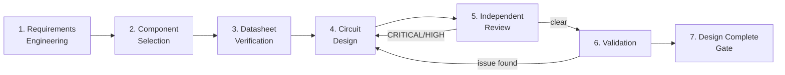

# Engineering Workflow

This is the operational, step-by-step companion to `docs/architecture.md`.
Read architecture.md first for the vocabulary (severity taxonomies, Evidence
ID scheme, gates); this document is "what happens, in what order, with what
entry/exit criteria."

## 1. Phase Sequence

## 2. Phase Detail

### Phase 1 — Requirements Engineering
- **Owner**: Hardware Lead, with the human Product Owner. Uses
  `skills/requirements-engineering/SKILL.md`.
- **Entry criteria**: A human has stated a goal/problem (even informally).
- **Activities**: detect ambiguity, quantify (turn vague statements into
  measurable, testable requirements), prioritize (Must/Should/Could), detect
  conflicts/gaps (missing environmental, safety, interface requirements).
- **Exit criteria**: `requirements/requirements.md` filled in and
  human-approved (architecture-defining requirements are a HITL gate per
  architecture.md §10).
- **Artifacts produced**: `requirements/requirements.md`,
  `requirements/traceability-matrix.md` (rows initialized, `Status=Pending`).
- **Parallel-safe?** No — single coherent sign-off (architecture.md §4).

### Phase 2 — Component Selection
- **Owner**: Component Engineer. Uses `skills/component-selection/SKILL.md`.
- **Entry criteria**: Approved requirements exist for the part(s) needed.
- **Activities**: identify candidates (≥3 when feasible — fan out with
  `explore`/`research` per candidate, architecture.md §4/§5.1), pull
  datasheets (→ Phase 3 for each), compare electrical specs/package/
  lifecycle/EOL/availability/reference design/ecosystem, recommend.
- **Exit criteria**: `bom/component-selection.md` filled in; recommendation
  approved by human if it is an architecture-defining/major component
  decision (HITL gate).
- **Escalation**: if no datasheet can be found for a candidate under serious
  consideration — stop, do not guess, escalate to human immediately.
- **Parallel-safe?** Candidate research: yes. Final recommendation: no
  (single consolidated judgment).

### Phase 3 — Datasheet Verification
- **Owner**: Component Engineer (during selection) and Circuit Engineer
  (before/while designing). Uses `skills/datasheet-analysis/SKILL.md`.
- **Entry criteria**: A datasheet has been identified for a part in active
  use.
- **Activities**: register the datasheet in `datasheets/` (metadata record
  only — see §6.2 of architecture.md), extract constraints into
  `Parameter | Min | Typ | Max | Unit | Source` tables, separate Absolute
  Max / Recommended / Typical, assign Evidence IDs, log them in
  `datasheets/evidence-log.md`.
- **Exit criteria**: every parameter the design will depend on has an
  Evidence ID, or is explicitly `UNKNOWN`.
- **Parallel-safe?** Yes, per datasheet.

### Phase 4 — Circuit Design
- **Owner**: Circuit Engineer. Uses `skills/schematic-design/SKILL.md`.
- **Entry criteria**: Parts approved (Phase 2) and datasheet constraints
  extracted (Phase 3).
- **Activities**: fix shared resources first (rails, ground scheme, pin
  allocation) — serially — then design sub-blocks (power / MCU periphery /
  sensor interface / …), each against the full mandatory checklist in
  `agents/circuit-engineer.agent.md`, each decision backed by an Evidence ID,
  update `hardware/power-budget.md`, then integrate serially.
- **Exit criteria**: schematic artifact + design rationale log + self-check
  against the Hardware Reviewer's checklist completed, handed off.
- **Parallel-safe?** Sub-blocks: yes, after interfaces are fixed. Integration:
  no.

### Phase 5 — Independent Review
- **Owner**: Hardware Reviewer (checklist) + `rubber-duck` (premise check),
  run in parallel against the same handoff. Uses
  `skills/hardware-review/SKILL.md`.
- **Entry criteria**: Circuit Engineer handoff received.
- **Activities**: run the full adversarial checklist (architecture.md §7.1);
  where a KiCad project exists, cross-check with `extract_schematic_netlist`
  / `identify_circuit_patterns` / `run_drc_check` (architecture.md §5.2);
  classify findings CRITICAL/HIGH/MEDIUM/LOW with Evidence IDs; record in
  `validation/design-review.md` (this cycle's report) and
  `validation/open-issues.md` (living backlog).
- **Exit criteria**: a single consolidated verdict — PASS / FAIL /
  CONDITIONAL.
- **Loop-back rule**: any CRITICAL or HIGH → back to Phase 4, then re-review
  (not a rubber stamp; re-run the checklist against the changed area and
  anything the change could affect).
- **Parallel-safe?** Topic-based sub-scans and the rubber-duck pass: yes.
  Verdict: no (architecture.md §4).

### Phase 6 — Validation
- **Owner**: Hardware Lead + human (MVP); future Test/Validation Engineer.
  Uses `validation/bring-up-procedure.md` for first power-on, plus whatever
  simulation is available (currently none — SPICE is Future Integration,
  architecture.md §13).
- **Entry criteria**: Review verdict is PASS (no open CRITICAL).
- **Activities**: bench bring-up per `validation/bring-up-procedure.md`
  (HITL gate: human sign-off required before applying power to real
  hardware), compare measured values against `requirements/
  traceability-matrix.md` and datasheet Recommended Operating Conditions.
- **Exit criteria**: traceability rows move to `Verified` (or `Failed`, which
  reopens Phase 4).
- **Parallel-safe?** Independent test cases: yes. Final validation verdict:
  no.

### Phase 7 — Design Complete Gate
- **Owner**: Hardware Lead (serial, per architecture.md §8).
- Checks all five Design Complete conditions; if any fail, routes back to
  the appropriate earlier phase instead of declaring completion.
- On success: reports up to the human Product Owner / Chief Engineer.

## 3. Conflict Resolution / Deadlock Escalation Protocol

Applies whenever two agents (or an agent and a human-set constraint) produce
incompatible outputs — e.g. Component Engineer recommends a part for
availability reasons that Circuit Engineer finds has an application-circuit
blocker; or Circuit Engineer and Hardware Reviewer disagree on a finding's
severity.

1. **State positions with evidence.** Each side writes its position citing
   Evidence IDs (`datasheets/evidence-log.md`) or requirement IDs
   (`requirements/requirements.md`) — not unsupported opinion.
2. **Hardware Lead mediates.** Check which position is better grounded
   against `requirements/` and the evidence log. Request missing evidence
   from either side if the picture is incomplete. Optionally invoke
   `rubber-duck` for a neutral third read of the disagreement itself.
3. **Escalate if still unresolved.** Genuine trade-offs, safety-relevant
   ambiguity, or business/schedule trade-offs go to the human Chief Engineer
   as a short decision brief: both positions, evidence, trade-offs, and the
   Lead's recommendation if it has one. The human decides — this is the same
   authority already established for architecture/major-component decisions
   (architecture.md §10), not a new channel.
4. **Record the outcome.** Log the resolution and rationale in
   `validation/change-log.md` (if it changes something already designed) and/
   or `validation/open-issues.md` (if it resolves/reclassifies a finding),
   with cross-references to the Evidence IDs used.

## 4. Handoff Mechanism

Two layers, used together — see architecture.md §3 for the invocation model:

- **File-based (durable, git-tracked, the actual Source of Truth)**:
  `requirements/`, `bom/`, `hardware/`, `validation/`, `docs/`. This is what
  survives across sessions and is what a human audits. Every phase's real
  exit criteria is a file being in a specific state, not a chat message.
- **SQL `todos` / `todo_deps` (ephemeral, session-local control plane)**: used
  by whichever session is playing Hardware Lead to sequence and parallelize
  sub-agent dispatch within one working session — e.g. `component-search-mcu`
  / `component-search-imu` / `component-search-power` (no deps → parallel) →
  `component-comparison-consolidate` (depends on all three) →
  `circuit-design-power` / `circuit-design-mcu-periphery` /
  `circuit-design-sensor-if` (parallel, after interfaces fixed) →
  `circuit-integrate` (depends on all three) → `independent-review`
  (review + rubber-duck, parallel) → conditional `circuit-rework` or
  `design-complete-gate`. This layer is **not** a durable record — it resets
  per session and is not the place evidence or decisions live.

## 5. How to Start a New Design Cycle

Use `docs/commands/make-circuit.md` for the copy-pasteable kickoff prompt.
