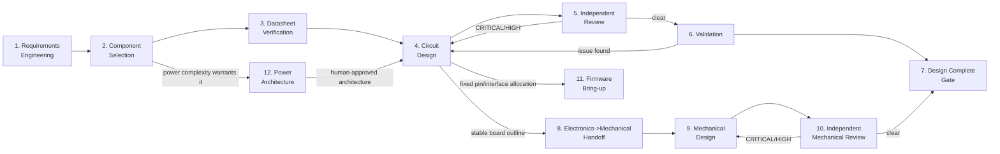

# Engineering Workflow

This is the operational, step-by-step companion to `docs/architecture.md`.
Read architecture.md first for the vocabulary (severity taxonomies, Evidence
ID scheme, gates); this document is "what happens, in what order, with what
entry/exit criteria."

## 1. Phase Sequence

Phases 8-10 (Mechanical, Phase 1 of the multidisciplinary evolution —
`docs/architecture-evolution.md` §27) fork from Phase 4 rather than waiting
for Phase 7, and feed back into the same Phase 7 gate — see Phase 8's entry
criteria below for why. Phase 11 (Firmware, Phase 2 of the multidisciplinary
evolution — `docs/architecture-evolution.md` §32) also forks from Phase 4,
for the same data-driven reasoning, but does **not** feed back into Phase
7's gate — see Phase 11's entry/exit criteria below for why firmware
bring-up is intentionally not a sixth Design Complete condition. Phase 12
(Power Architecture, Phase 3 of the multidisciplinary evolution —
`docs/architecture-evolution.md` §33) forks from Phase 2 instead, since it
needs Component Selection's real per-subsystem current/voltage numbers
before an architecture proposal is possible, and feeds forward *into*
Phase 4 rather than running alongside it — see Phase 12's entry/exit
criteria below.

## 2. Phase Detail

### Phase 1 — Requirements Engineering
- **Owner**: Hardware Lead, with the human Product Owner. Uses
  `.github/skills/requirements-engineering/SKILL.md`.
- **Entry criteria**: A human has stated a goal/problem (even informally).
- **Activities**: detect ambiguity, quantify (turn vague statements into
  measurable, testable requirements), prioritize (Must/Should/Could), detect
  conflicts/gaps (missing environmental, safety, interface requirements).
- **Exit criteria**: `requirements/requirements.md` filled in and
  human-approved (architecture-defining requirements are a HITL gate per
  architecture.md §10).
- **Artifacts produced**: `requirements/requirements.md`,
  `requirements/traceability-matrix.md` (rows initialized, `Status=Pending`).
- **Parallel-safe?** No — single coherent sign-off (architecture.md §4).

### Phase 2 — Component Selection
- **Owner**: Component Engineer. Uses `.github/skills/component-selection/SKILL.md`.
- **Entry criteria**: Approved requirements exist for the part(s) needed.
- **Activities**: identify candidates (≥3 when feasible — fan out with
  `explore`/`research` per candidate, architecture.md §4/§5.1), pull
  datasheets (→ Phase 3 for each), compare electrical specs/package/
  lifecycle/EOL/availability/reference design/ecosystem, recommend.
- **Exit criteria**: `bom/component-selection.md` filled in; recommendation
  approved by human if it is an architecture-defining/major component
  decision (HITL gate).
- **Escalation**: if no datasheet can be found for a candidate under serious
  consideration — stop, do not guess, escalate to human immediately.
- **Parallel-safe?** Candidate research: yes. Final recommendation: no
  (single consolidated judgment).

### Phase 3 — Datasheet Verification
- **Owner**: Component Engineer (during selection) and Circuit Engineer
  (before/while designing). Uses `.github/skills/datasheet-analysis/SKILL.md`.
- **Entry criteria**: A datasheet has been identified for a part in active
  use.
- **Activities**: register the datasheet in `datasheets/` (metadata record
  only — see §6.2 of architecture.md), extract constraints into
  `Parameter | Min | Typ | Max | Unit | Source` tables, separate Absolute
  Max / Recommended / Typical, assign Evidence IDs, log them in
  `datasheets/evidence-log.md`.
- **Exit criteria**: every parameter the design will depend on has an
  Evidence ID, or is explicitly `UNKNOWN`.
- **Parallel-safe?** Yes, per datasheet.

### Phase 4 — Circuit Design
- **Owner**: Circuit Engineer. Uses `.github/skills/schematic-design/SKILL.md`.
- **Entry criteria**: Parts approved (Phase 2) and datasheet constraints
  extracted (Phase 3). When Power Engineer is engaged for this project/
  revision (Phase 12 below), the power-section work specifically also
  requires Phase 12's human-approved architecture first — the rest of
  Circuit Design (non-power sub-blocks) is not blocked on it.
- **Activities**: fix shared resources first (rails, ground scheme, pin
  allocation) — serially — then design sub-blocks (power / MCU periphery /
  sensor interface / …), each against the full mandatory checklist in
  `.github/agents/circuit-engineer.agent.md`, each decision backed by an Evidence ID,
  update `hardware/power-budget.md`, then integrate serially. When Power
  Engineer is engaged, "fix rails" means implementing its approved
  architecture (Phase 12), not deciding the rail topology from scratch.
- **Exit criteria**: schematic artifact + design rationale log + self-check
  against the Hardware Reviewer's checklist completed, handed off.
- **Parallel-safe?** Sub-blocks: yes, after interfaces are fixed. Integration:
  no.

### Phase 5 — Independent Review
- **Owner**: Hardware Reviewer (checklist) + `rubber-duck` (premise check),
  run in parallel against the same handoff. Uses
  `.github/skills/hardware-review/SKILL.md`.
- **Entry criteria**: Circuit Engineer handoff received.
- **Activities**: run the full adversarial checklist (architecture.md §7.1);
  where a KiCad project exists, cross-check with `extract_schematic_netlist`
  / `identify_circuit_patterns` / `run_drc_check` (architecture.md §5.2);
  classify findings CRITICAL/HIGH/MEDIUM/LOW with Evidence IDs; record in
  `validation/design-review.md` (this cycle's report) and
  `validation/open-issues.md` (living backlog).
- **Exit criteria**: a single consolidated verdict — PASS / FAIL /
  CONDITIONAL.
- **Loop-back rule**: any CRITICAL or HIGH → back to Phase 4, then re-review
  (not a rubber stamp; re-run the checklist against the changed area and
  anything the change could affect).
- **Parallel-safe?** Topic-based sub-scans and the rubber-duck pass: yes.
  Verdict: no (architecture.md §4).

### Phase 6 — Validation
- **Owner**: Hardware Lead + human (MVP); future Test/Validation Engineer.
  Uses `validation/bring-up-procedure.md` for first power-on, plus whatever
  simulation is available (currently none — SPICE is Future Integration,
  architecture.md §13).
- **Entry criteria**: Review verdict is PASS (no open CRITICAL).
- **Activities**: bench bring-up per `validation/bring-up-procedure.md`
  (HITL gate: human sign-off required before applying power to real
  hardware), compare measured values against `requirements/
  traceability-matrix.md` and datasheet Recommended Operating Conditions.
- **Exit criteria**: traceability rows move to `Verified` (or `Failed`, which
  reopens Phase 4).
- **Parallel-safe?** Independent test cases: yes. Final validation verdict:
  no.

### Phase 7 — Design Complete Gate
- **Owner**: Hardware Lead (serial, per architecture.md §8).
- Checks all five Design Complete conditions; if any fail, routes back to
  the appropriate earlier phase instead of declaring completion. Where
  Phases 8-10 (Mechanical) are in progress or complete, the same check
  against `validation/open-issues.md` already covers Mechanical Reviewer
  findings too — see architecture.md §8 and §5.3; there is one gate, not a
  separate Electronics gate and Mechanical gate.
- On success: reports up to the human Product Owner / Chief Engineer.

### Phase 8 — Electronics → Mechanical Handoff *(Phase 1 of the
multidisciplinary evolution — `docs/architecture-evolution.md` §13, §27)*
- **Owner**: Mechanical Lead (extraction), Hardware Lead (ensures the
  Electronics artifact is accessible).
- **Entry criteria**: Circuit Design (Phase 4) has produced a **stable board
  outline** — mounting holes, component heights, and connector layout are not
  expected to change further. This is deliberately **data-driven, not
  gate-driven**: it does **not** require Phase 7 (Design Complete Gate) to
  have passed first, since board geometry is independent of later
  electrical-only fixes (e.g. a decoupling-capacitor value change doesn't
  move a mounting hole). If the board outline *does* change later, re-enter
  this phase (see Phase 9's loop-back note).
- **Activities**: Mechanical Lead populates `hardware/mechanical-interface.md`
  from the existing KiCad project (via the same read-only tools documented in
  architecture.md §5.2) or from Circuit-Engineer-/human-supplied facts if no
  KiCad project exists yet. Every field is marked `CONFIRMED` / `ASSUMPTION` /
  `ESTIMATE` / `UNKNOWN` (`.github/instructions/mechanical-design.instructions.md`).
- **Exit criteria**: `hardware/mechanical-interface.md`'s required fields
  (board outline, mounting holes, max component height, connector locations)
  are at least `ASSUMPTION`/`ESTIMATE`-populated, or an `UNKNOWN` has been
  escalated per architecture.md §10.
- **Parallel-safe?** Yes, with Phases 5/6/7 (Electronics review/validation/
  gate) — this is exactly why the entry criterion above is data-driven rather
  than waiting for those phases to finish.

### Phase 9 — Mechanical Design *(Phase 1)*
- **Owner**: Mechanical Lead. Uses `.github/skills/enclosure-design/SKILL.md`.
- **Entry criteria**: Phase 8 exit criteria met.
- **Activities**: design against the full Phase 1 checklist in
  `.github/agents/mechanical-lead.agent.md` (enclosure/spatial layout, PCB
  mounting, connector accessibility, component-height clearance, internal
  clearance, fastener placement, wall thickness, assembly order, basic
  print-fit tolerance, basic manufacturability/3D-printability); produce the
  `.scad` file + dimensional-spec table (no CAD tool is connected — verified,
  architecture.md §5.3); self-check against the Mechanical Reviewer's
  checklist before handoff.
- **Exit criteria**: design artifact + rationale log + self-check handed off.
- **Loop-back**: if `hardware/mechanical-interface.md` changes after this
  phase starts (e.g. Circuit Engineer moves a connector), re-enter Phase 8
  for the changed fields, then resume here.
- **Parallel-safe?** No — single coherent geometry state, one Mechanical Lead
  (architecture-evolution.md §10).

### Phase 10 — Independent Mechanical Review *(Phase 1)*
- **Owner**: Mechanical Reviewer. Uses `.github/skills/mechanical-review/SKILL.md`.
- **Entry criteria**: Mechanical Lead handoff received.
- **Activities**: run the full adversarial mechanical checklist
  (`.github/agents/mechanical-reviewer.agent.md`); classify findings
  CRITICAL/HIGH/MEDIUM/LOW with the same taxonomy Hardware Reviewer uses
  (architecture.md §7.1); record in `validation/design-review.md` (a new
  dated instance) and `validation/open-issues.md` (`Source=mechanical-reviewer`
  — the same living backlog Hardware Reviewer uses, so it feeds the same
  Design Complete Gate).
- **Exit criteria**: a single consolidated verdict — PASS / FAIL / CONDITIONAL.
- **Loop-back rule**: any CRITICAL or HIGH → back to Phase 9, then re-review.
- **Parallel-safe?** No — one Reviewer, one verdict (architecture.md §4).

### Phase 11 — Firmware Bring-up *(Phase 2 of the multidisciplinary
evolution — `docs/architecture-evolution.md` §32)*
- **Owner**: Firmware Engineer. Uses `.github/skills/firmware-bringup/SKILL.md`.
- **Entry criteria**: Circuit Design (Phase 4) has fixed the pin/interface
  allocation (pin assignments, peripheral instances, mode-select straps) for
  the peripherals firmware needs — deliberately **data-driven, not
  gate-driven**, the same reasoning as Phase 8: it does **not** require
  Phase 7 (Design Complete Gate) to have passed first, since pin/interface
  facts are typically stable well before every electrical HIGH finding is
  resolved (e.g. an LDO input-margin disposition, architecture.md §8, has no
  bearing on which pin the IMU's I2C bus uses).
- **Activities**: extract the pin/interface contract from the schematic
  design document (never re-derive it independently); fix the MCU clock
  configuration first, serially, where the schematic leaves it open; gather
  register-level facts from the MCU/peripheral manufacturers' primary
  documentation with new Evidence IDs; implement any manufacturer-mandated
  sensor initialization sequence exactly, vendoring opaque data verbatim
  with attribution where required; write and self-check the firmware
  (`.github/agents/firmware-engineer.agent.md`'s full checklist); attempt a
  real compile if a toolchain is available or installable, disclosing the
  actual outcome honestly either way (architecture.md §5.4).
- **Exit criteria**: firmware source tree + design rationale document
  (Evidence-ID-cited, mirroring the schematic's own style) + self-check
  results + tooling/compile-status disclosure handed off to the Hardware
  Lead.
- **Loop-back rule**: if the schematic's pin/interface facts change after
  this phase starts (e.g. Circuit Engineer reassigns a pin during Phase 5
  rework), re-enter this phase for the affected peripheral driver(s).
- **Does *not* feed Phase 7's gate.** Unlike Phases 8-10, Firmware Bring-up
  is intentionally **not** wired into the Design Complete Gate
  (architecture.md §8) — a firmware defect doesn't block PCB fabrication or
  change anything about whether the *hardware* design is complete; it feeds
  `validation/bring-up-procedure.md` instead, as preparatory work for a
  future physical bring-up. See `docs/architecture-evolution.md` §32 for
  why this also avoids a real coupling problem in the shared
  `validation/open-issues.md` CI gate.
- **Parallel-safe?** No independent Firmware Reviewer exists yet
  (architecture.md §14, architecture-evolution.md §32) — self-check stands
  in for review this round, so there is no separate review pass to
  parallelize against. Safe to run in parallel with Phases 5/6/7/8-10 for
  the same data-driven reasons Phase 8 is.

### Phase 12 — Power Architecture *(Phase 3 of the multidisciplinary
evolution — `docs/architecture-evolution.md` §33)*
- **Owner**: Power Engineer, when engaged (a Hardware Lead judgment call per
  project/revision — `.github/agents/power-engineer.agent.md` "When this
  role is engaged"). Uses `.github/skills/power-architecture/SKILL.md`. For
  a simple single-rail design, this phase is skipped entirely and Circuit
  Engineer continues to own `hardware/power-budget.md` directly within
  Phase 4, exactly as before this phase existed.
- **Entry criteria**: Component Selection (Phase 2) has produced real
  current/voltage/thermal figures for a new subsystem's candidate parts, and
  the Hardware Lead has judged this project's power complexity exceeds what
  Circuit Engineer can track ad hoc (architecture.md §14's own example: "at
  Motor Driver / Reaction Wheel stage"). Deliberately forks from Phase 2
  rather than Phase 4, since an architecture proposal needs real subsystem
  numbers before it's possible at all, and must complete *before* Phase 4's
  power sub-block (not alongside it, unlike Phases 8-10/11's own
  parallel-with-later-phases pattern) — Circuit Engineer cannot correctly
  design a rail whose topology hasn't been decided yet.
- **Activities**: aggregate every existing + new subsystem's real load
  against existing rail capability; where a new rail/physical input is
  genuinely required, propose ≥2 real, named architecture options with
  trade-offs (never a single silently-picked default); check rail
  sequencing/coupling concerns; present the options for the human Chief
  Engineer's architecture decision (architecture.md §10); record the
  options + decision in `hardware/power-architecture.md`; update
  `hardware/power-budget.md` for the approved architecture's multi-rail
  numeric rollup; flag any new part-sourcing need back to Component
  Engineer.
- **Exit criteria**: `hardware/power-architecture.md` shows a recorded human
  decision + updated multi-rail `hardware/power-budget.md`, handed off to
  Circuit Engineer.
- **HITL gate**: the architecture decision itself is never self-approved by
  Power Engineer — same "architecture decisions" gate every other major
  topology choice in this framework goes through (architecture.md §10).
- **Loop-back rule**: if a later subsystem addition exceeds the approved
  architecture's headroom, re-enter this phase before Circuit Design
  proceeds on that subsystem's power section.
- **Parallel-safe?** Candidate-option drafting: yes, in the sense that it
  reuses Component Selection's already-parallel candidate research: no
  additional research fan-out of its own. The architecture recommendation
  and the human decision are each single serial steps, same reasoning as
  every other framework decision point (architecture.md §4).

## 3. Conflict Resolution / Deadlock Escalation Protocol

Applies whenever two agents (or an agent and a human-set constraint) produce
incompatible outputs — e.g. Component Engineer recommends a part for
availability reasons that Circuit Engineer finds has an application-circuit
blocker; or Circuit Engineer and Hardware Reviewer disagree on a finding's
severity.

1. **State positions with evidence.** Each side writes its position citing
   Evidence IDs (`datasheets/evidence-log.md`) or requirement IDs
   (`requirements/requirements.md`) — not unsupported opinion.
2. **Hardware Lead mediates.** Check which position is better grounded
   against `requirements/` and the evidence log. Request missing evidence
   from either side if the picture is incomplete. Optionally invoke
   `rubber-duck` for a neutral third read of the disagreement itself.
3. **Escalate if still unresolved.** Genuine trade-offs, safety-relevant
   ambiguity, or business/schedule trade-offs go to the human Chief Engineer
   as a short decision brief: both positions, evidence, trade-offs, and the
   Lead's recommendation if it has one. The human decides — this is the same
   authority already established for architecture/major-component decisions
   (architecture.md §10), not a new channel.
4. **Record the outcome.** Log the resolution and rationale in
   `validation/change-log.md` (if it changes something already designed) and/
   or `validation/open-issues.md` (if it resolves/reclassifies a finding),
   with cross-references to the Evidence IDs used.

## 4. Handoff Mechanism

Two layers, used together — see architecture.md §3 for the invocation model:

- **File-based (durable, git-tracked, the actual Source of Truth)**:
  `requirements/`, `bom/`, `hardware/`, `validation/`, `docs/`. This is what
  survives across sessions and is what a human audits. Every phase's real
  exit criteria is a file being in a specific state, not a chat message.
- **SQL `todos` / `todo_deps` (ephemeral, session-local control plane)**: used
  by whichever session is playing Hardware Lead to sequence and parallelize
  sub-agent dispatch within one working session — e.g. `component-search-mcu`
  / `component-search-imu` / `component-search-power` (no deps → parallel) →
  `component-comparison-consolidate` (depends on all three) →
  `circuit-design-power` / `circuit-design-mcu-periphery` /
  `circuit-design-sensor-if` (parallel, after interfaces fixed) →
  `circuit-integrate` (depends on all three) → `independent-review`
  (review + rubber-duck, parallel) → conditional `circuit-rework` or
  `design-complete-gate`. This layer is **not** a durable record — it resets
  per session and is not the place evidence or decisions live.

Once a stable board outline exists, the same chain extends (Phase 1,
Mechanical — §2 Phase 8-10 above): `circuit-integrate` → (fork)
`mechanical-interface-extract` → `mechanical-design` →
`independent-mechanical-review` → conditional `mechanical-rework` or
`design-complete-gate` — the *same* `design-complete-gate` todo both chains
converge on, matching the single shared `validation/open-issues.md` backlog
(architecture.md §8). Once pin/interface allocation is fixed, a third fork
(Phase 2, Firmware — §2 Phase 11 above) can run independently:
`circuit-integrate` → (fork) `firmware-bringup` — this branch does **not**
converge on `design-complete-gate` (§2 Phase 11's own note on why), so it
has no todo dependency on the other two chains' gate step. When Power
Engineer is engaged (Phase 3 — §2 Phase 12 above), a chain precedes
`circuit-integrate` instead of following it: `component-comparison-
consolidate` → (fork) `power-architecture-propose` → `power-architecture-
gate` (the human decision) → `circuit-design-power` (now unblocked, feeds
into the same `circuit-integrate` step every other sub-block does) — this
is the one fork in the framework that runs *before* Circuit Design rather
than alongside/after it, since Phase 12 by definition must finish before
Circuit Engineer can correctly design the power sub-block at all.

## 5. How to Start a New Design Cycle

Use `docs/commands/make-circuit.md` for the copy-pasteable kickoff prompt.
Mechanical Lead / Mechanical Reviewer, Firmware Engineer, and Power Engineer
all follow the same invocation model as the 4 Electronics agents
(architecture.md §3): native custom-agent invocation where the running
surface supports it, or the `task` tool loading their
`.github/agents/*.agent.md` + `.github/skills/*/SKILL.md` content explicitly
where it doesn't.
