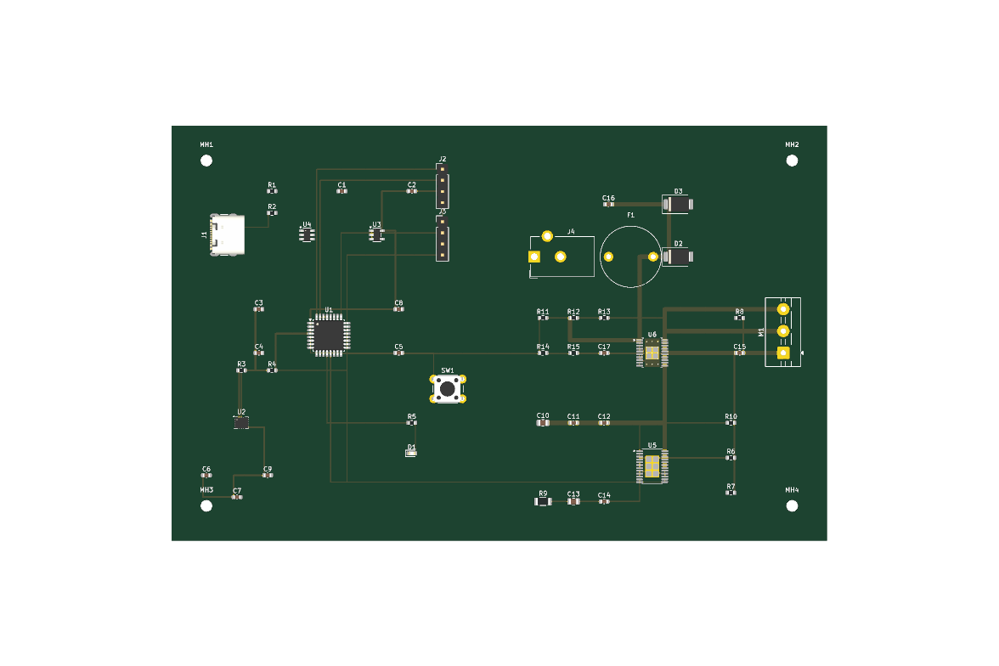

# Design Review — Cycle Report Template

One instance of this report per Hardware Reviewer **or Mechanical Reviewer**
(Phase 1 — `docs/architecture-evolution.md` §31) cycle (initial review or
a re-review after loop-back). Copy this template into a dated entry (or a
new file per cycle, e.g. `validation/design-review-2026-01-01.md`, linked
from here) — do not overwrite a previous cycle's report.

## Review Cycle Metadata

- **Design revision reviewed**: `hardware/schematic/bench-imu-01-design.md`
  (initial/first version — Author: Circuit Engineer (AI agent), Date:
  2026-08-31, Status at handoff: "Design complete, self-checked, pending
  independent Hardware Reviewer pass"), together with its companion
  `hardware/power-budget.md` rollup. This is the first-ever Hardware
  Reviewer cycle for this repository.
- **Reviewer**: Hardware Reviewer — see `.github/agents/hardware-reviewer.agent.md`.
  Independent of the Circuit Engineer role/session that authored the design.
- **Independence statement**: I did not author this design. Every checklist
  item and every one of the Circuit Engineer's 9 self-flagged UNKNOWNs
  (design doc §16) and 5 self-check residual items (§15) was independently
  re-derived this cycle against primary datasheets/reference manuals and
  fresh web research — not accepted on the strength of the Circuit
  Engineer's stated confidence or citation formatting. Primary sources
  fetched and read directly this cycle: ST STM32G031x4/x6/x8 datasheet
  (DS12992 Rev4), ST reference manual RM0454 Rev5 (STM32G0x0 series), TI
  TLV755P datasheet (SBVS320D Rev D), and Bosch BMI270 datasheet
  (BST-BMI270-DS000-08 Rev 1.6) — each read at the specific
  section/table level relevant to the claim being checked, not merely
  skimmed. Several evidence-log citations were found to be inaccurate on
  independent re-verification (see Findings); others were confirmed
  correct or even more conservative than claimed.
- **Scope**: Full design — first review cycle for Bench-IMU-01, so no
  "changed area only" narrowing applies. Covers
  `hardware/schematic/bench-imu-01-design.md` (schematic-equivalent
  artifact) and `hardware/power-budget.md` in full; `bom/component-selection.md`
  and `requirements/requirements.md` were read for context only (component
  choices themselves are out of scope — that gate already passed at
  Checkpoint B; this review covers the circuit implementation built on top
  of those approved parts).
- **Parallel sub-scans run**: None dispatched as separate sub-agent scans
  this cycle — the full 16-item checklist and all 7 user-flagged priority
  items were worked as a single integrated pass by this Hardware Reviewer,
  consistent with the agent instruction that the verdict is a single
  serial integration step owned by the Hardware Reviewer, not something to
  fragment across uncoordinated parallel opinions. Investigation was
  organized topically (power/thermal margins, boot/pin-bonding,
  interface/timing, protection/EMI) within that single pass.
- **rubber-duck premise review run in parallel?**: Y — per
  `docs/architecture.md` §5.1, a `rubber-duck` premise/assumption review is
  understood to be running in parallel this same cycle as an independent
  review lens. This report does not duplicate or pre-empt its findings;
  any `rubber-duck`-sourced rows in `validation/open-issues.md` are a
  separate, independently-tagged contribution and were not read or relied
  upon while forming this report's own conclusions.
- **KiCad tool cross-checks used**: None — no KiCad project exists yet for
  this repository this cycle (`kicad-list_projects` returns empty, per the
  design document's own §0 tooling-honesty statement, independently
  confirmed true for this review as well). `extract_schematic_netlist`,
  `analyze_schematic_connections`, `identify_circuit_patterns`, and
  `run_drc_check` were therefore not available to cross-check against; the
  Markdown schematic-equivalent document was reviewed net-by-net and
  pin-by-pin directly instead, which is the correct artifact type for this
  cycle, not a gap to penalize.

## Checklist Results

Full checklist per `.github/skills/hardware-review/SKILL.md`:

| # | Checklist item | Result | Notes |
|---|---|---|---|
| 1 | Voltage violation | Finding | ISS-002 — LDO Vin ROC top-end margin is effectively zero once the real-world USB-C vSafe5V ceiling (4.75–5.5V) is used instead of REQ-101's stated 4.75–5.25V legacy-USB figure. All other rails (single 3.3V logic rail) independently confirmed well within ROC. |
| 2 | Absolute Maximum Rating violation | Finding (documentation-only; no live violation) | No AMR is actually exceeded anywhere in the design as built. ISS-007 (BMI270 VDD/VDDIO AMR citation says 3.6V, primary datasheet says 4V — correction is in the *safe* direction) and ISS-010 (MCU VDD AMR evidence-log entry still stale) are citation-accuracy items only. |
| 3 | Current limit | Finding | ISS-005 — no onboard overcurrent protection upstream of the LDO; downstream (3V3 rail: MCU+IMU) is implicitly protected by the LDO's own internal current limit (560/720/865mA min/typ/max), a mitigating factor the design docs did not credit. Current headroom otherwise is very large (≈94.6% vs REQ-103, ≈96.8% vs the LDO's 500mA rating). |
| 4 | Thermal risk | Finding | ISS-003 — LDO thermal margin claim (`bom/component-selection.md`, reused in `hardware/power-budget.md`) uses the wrong package's θJA. The design's actual real operating point remains thermally safe regardless. |
| 5 | Missing decoupling capacitor | Pass | MCU (C3/C4), IMU (C6/C7), and LDO input/output (C1/C2) decoupling independently verified against each part's own primary-datasheet recommendation — all correct, no deviation found. |
| 6 | Floating pin | Finding | ISS-001 — LDO (U3) EN pin connection is left ambiguous/unconfirmed in the current document; independently confirmed the pin is mandatorily present (pin 3 on the ordered DBV package) with no internal bias. BMI270 unused pins (INT1/INT2/ASDx/ASCx/OCSB/OSDO) independently confirmed correct/datasheet-sanctioned — no finding on those. |
| 7 | Incorrect pull-up/pull-down | Finding (LOW/tracked) | ISS-008 — I2C pull-up (R3/R4=4.7kΩ) math and formula independently reproduced exactly; nominal margin is healthy but sensitive to actual (not-yet-known) bus capacitance. USB-C CC1/CC2 pull-downs (5.1kΩ, DS-CONN-001) and NRST internal pull-up independently confirmed correct. |
| 8 | Logic voltage mismatch | Pass | Single 3.3V rail throughout (MCU + IMU + I2C bus), no level-shifting required; independently confirmed compatible with both parts' Recommended Operating Conditions. |
| 9 | Interface timing | Pass (residual tracked under ISS-008) | I2C 400kHz target achievable with margin at the design's assumed 50pF bus capacitance; both MCU and IMU independently confirmed Fast-mode Plus capable, exceeding the target speed. |
| 10 | Power sequencing | Pass | Single-rail, simultaneous power-up (VDD=VDDIO tied on the IMU; VDD=VDDA=VBAT tied on the MCU) independently confirmed to make any sequencing requirement moot by construction — no relative timing exists between supplies that are electrically the same node. |
| 11 | Grounding | Pass | Single ground net/plane, stated explicitly and appropriate for this design's component count/complexity. |
| 12 | EMI/EMC risk | Pass | REQ-401 explicitly waives formal EMC/EMI certification for this prototype iteration; the basic mitigations taken (ESD protection IC, single ground plane, linear — not switching — LDO topology) are proportionate to that scope. |
| 13 | Motor noise | N/A | No motor or rotating actuator exists on this board — independently confirmed correct from the design's own scope (IMU sensor + MCU + USB interface only, per `docs/architecture.md` §12 co-design trigger, which does not apply here). |
| 14 | Sensor noise | Finding (LOW) | ISS-009 — LDO output capacitor (0.47µF) is below the 1µF value used throughout TI's own PSRR/output-noise typical-characteristic curves; not a datasheet violation, but a margin/characterization-coverage note given the IMU is a noise-sensitive MEMS gyroscope. |
| 15 | PCB layout concern (incl. mechanical/thermal co-design) | N/A (determination independently confirmed correct) | No rotating body exists on this board, so the mechanical/thermal co-design trigger in `docs/architecture.md` §12 does not apply — independently confirmed, not merely accepted. No physical PCB layout exists yet this cycle (no KiCad project), so trace-level layout review is not yet applicable; the qualitative layout guidance already present in the design document (short decoupling/I2C trace runs, solid ground pour) is appropriate for this design stage. |
| 16 | Datasheet recommendation violation | Finding | ISS-004 (REQ-402 reverse-polarity satisfied by USB-C mechanical keying alone, no discrete component) and ISS-006 (DS-MCU-046 BOOT0/PB8 pin-bonding citation is factually incorrect, though the design's ultimate engineering conclusion survives via a different, correct mechanism). |

## Findings

### ISS-001 — LDO (U3) EN pin connection left ambiguous; independently confirmed mandatory and unbiased

- **Issue**: The design document does not establish a firm, confirmed
  connection for U3's (TLV75533PDBVR) EN pin. §3.4 states the pin is "tied
  to enable-always... if the exact TLV75533 package variant used here has
  an active EN pin requiring a level, tie it to VIN directly," explicitly
  deferring final confirmation to layout time (§16 UNKNOWN #9), and
  assesses the residual risk as "low."
- **Rationale**: I independently fetched TI's primary TLV755P datasheet
  (SBVS320D Rev D), §4 "Pin Configuration and Functions," Table 4-1. EN is
  listed as a mandatory pin on **all four** package variants (DQN pin 3,
  DBV pin 3, DYD pin 3, DRV pin 4) — there is no "fixed-output, no-EN"
  variant of this part family. The ordered part is TLV75533PDBVR (package
  code "DBV"), so EN is definitively pin 3. §6.4 "Device Functional Modes"
  (Table 6-1) and §6.4.3 "Disabled" confirm the device is placed into
  shutdown whenever EN is driven below V_LO (0.3V max). The Electrical
  Characteristics table (§5.5) shows EN is a genuine high-impedance input
  (I_EN = 10nA leakage at EN=5.5V) with **no internal pull-up or
  pull-down bias on the pin itself** — the datasheet's only internal
  "pulldown resistance" spec (120Ω) is the *output* discharge switch
  engaged when disabled per §6.4.3, not an EN-pin bias. The Circuit
  Engineer's own uncertainty about whether the pin "is present" was
  therefore resolved in the wrong direction: the pin is always present and
  always electrically live, contrary to the hedge that treated it as
  possibly unnecessary to connect.
- **Datasheet Source**: DS-PWR-002/003 (TLV75533PDBVR electrical/AMR
  reference) — independently re-verified this cycle directly against TI
  SBVS320D Rev D §4 (Table 4-1 Pin Functions), §5.5 (Electrical
  Characteristics: V_HI/V_LO/I_EN/R_PULLDOWN), and §6.4 (Device Functional
  Modes). No existing Evidence ID in the log specifically covers the
  EN-pin pinout/bias question; recommend registering a new DS-PWR entry
  for it.
- **Failure Mechanism**: If EN is left unconnected (floating) on the
  actual physical board, its voltage is fully undetermined (no internal
  bias, high-impedance input) and will be set only by parasitic coupling,
  leakage paths, or static charge on the PCB. Depending on where it
  settles, the regulator may (a) never exceed V_HI (1V min) and thus never
  enable — the entire 3V3 rail stays at 0V, so the MCU and IMU never
  receive power (total board non-function, easily misdiagnosed as a
  dead/DOA board during bring-up), or (b) sit in the undefined 0.3–1.0V
  gray zone or drift with digital-switching noise coupled from adjacent
  traces, causing intermittent/erratic enable-disable transitions,
  spurious resets, or brownouts on the 3V3 rail.
- **Affected Component**: U3 (TLV75533PDBVR LDO regulator), pin 3 (EN).
- **Recommended Fix**: Make EN→VIN (U3 pin 3 to U3 pin 1) an explicit,
  firm, unconditional net in the design document / next schematic
  revision — remove the "if present" hedge entirely, since independent
  verification confirms the pin is always present on the ordered DBV
  package. This is a zero-cost fix (a single trace/via, already
  anticipated by the Circuit Engineer's own stated fallback) — implement
  it as documented intent, not as a layout-time judgment call.
- **Severity**: HIGH — the connection's *absence* would be a total-board
  power failure or a real reliability hazard, and the current
  documentation does not yet firmly commit to making it, despite the
  Circuit Engineer's correct instinct about what the fix should be.

### ISS-002 — LDO Vin ROC top-end margin against the real-world USB-C vSafe5V ceiling is effectively zero

- **Issue**: The design's own margin analysis (§3.4) computes ~0.25V of
  headroom between the top of REQ-101's stated USB tolerance band (5.25V)
  and the LDO's 5.5V Recommended Operating Condition ceiling. Independent
  research shows the real-world input range a USB-C-connectored board can
  see, per the governing USB-PD/Type-C specification's vSafe5V definition,
  is 4.75–5.5V — wider than REQ-101's stated 4.75–5.25V "standard USB
  VBUS range." At the wider, spec-permitted ceiling, margin against the
  LDO's own 5.5V ROC max is zero, not 0.25V.
- **Rationale**: REQ-101 is accurate for legacy USB 2.0-era VBUS tolerance,
  and the Circuit Engineer's arithmetic against REQ-101's own stated
  figure (0.25V) is correct — this is not an arithmetic error. However,
  J1 is a USB-C receptacle, and independent web research (search-engine
  synthesis citing USB-PD specification Table 7.4.3, corroborated by
  independent discussion threads on Electrical Engineering Stack Exchange
  and the Raspberry Pi forums addressing this exact
  vSafe5V-vs-legacy-tolerance question) converges on 4.75–5.5V as the
  actual permitted vSafe5V range for a USB-C/USB-PD source — a real
  possibility for whatever source a bench-use board (REQ-201) is plugged
  into over its life, not a hypothetical corner case. REQ-101 itself may
  not reflect the true governing spec for the connector actually chosen
  for this design.
- **Datasheet Source**: DS-PWR-002/003 (TLV75533PDBVR Vin ROC 1.45–5.5V,
  AMR −0.3 to 6.0V) — independently re-verified this cycle directly
  against TI SBVS320D Rev D §5.1/§5.3; citation confirmed accurate. The
  USB-C vSafe5V figure itself is not yet a formal Evidence ID in the
  log — this review's confirmation rests on corroborating secondary
  sources, not yet a direct primary-source fetch of the USB-PD
  specification text itself; recommend a follow-up primary-source citation
  be added.
- **Failure Mechanism**: Operating above the ROC ceiling but below the AMR
  ceiling does not damage the part outright (AMR is 6.0V, so a fully
  spec-compliant 5.5V source stays 0.5V under AMR), but per TI's own
  Absolute Maximum Ratings footnote: "If used outside the Recommended
  Operating Conditions but within the Absolute Maximum Ratings, the device
  may not be fully functional, and this may affect device reliability,
  functionality, performance, and shorten the device lifetime." A
  marginal, boundary-condition, or non-ideal USB-C source (a cheap
  charger, a bench PSU emulating VBUS, or a source over-regulating under
  light load) reaching close to 5.5V would leave the LDO with no buffer at
  all against its own ROC ceiling.
- **Affected Component**: U3 (TLV75533PDBVR LDO regulator), IN pin;
  indirectly, REQ-101 (input tolerance assumption).
- **Recommended Fix**: Either (a) explicitly scope REQ-101 to only the
  sources the project actually intends to support (e.g., legacy/non-PD 5V
  USB adapters capped at 5.25V, if acceptable — a decision for the
  Hardware Lead / human Chief Engineer, not the Circuit Engineer or this
  reviewer to make unilaterally), or (b) add real margin at the circuit
  level regardless of REQ-101's wording, since a bench tool (REQ-201) is
  realistically likely to encounter varied USB-C sources over its life.
- **Severity**: HIGH — realistic likelihood of encountering a
  spec-compliant corner-case source at or near the ROC ceiling over the
  product's bench-use lifetime, with zero margin at that corner (though
  not an AMR/damage violation).

### ISS-003 — LDO thermal margin claim uses the wrong package's θJA (propagates into power-budget.md)

- **Issue**: `bom/component-selection.md` (LDO recommendation section) and
  `hardware/power-budget.md` (Thermal cross-check section) both state the
  LDO's thermal resistance as θJA = 60.3°C/W and compute TJ ≈ 71°C (≈79°C
  headroom to the 150°C absolute maximum) at a 300mA validation scenario,
  40°C ambient. This θJA figure is for the wrong package.
- **Rationale**: I independently fetched TI's primary TLV755P datasheet
  (SBVS320D Rev D) §5.4 "Thermal Information," which lists θJA separately
  per package: DYD (SOT-23-5, exposed pad) EVM = 60.3°C/W; DBV (SOT-23-5,
  no exposed pad) EVM = 100.8°C/W; DBV JEDEC (standard PCB, no copper
  pour — the condition both documents' own text already claims to be
  using) = 231.1°C/W. The actual ordered part is TLV75533PDBVR — package
  code "DBV," not "DYD." The datasheet's own footnote states the EVM
  condition specifically refers to "the LP087A EVM with an exposed pad
  SOT-23-5 (DYD) layout," which does not describe the DBV package used
  here at all. Recomputing with the correct DBV/JEDEC value:
  TJ = 40°C + (0.51W × 231.1°C/W) ≈ 158°C, which **exceeds the 150°C
  absolute maximum junction temperature** at the documents' own chosen
  300mA validation scenario — the opposite of the "≈79°C headroom" the
  documents claim.
- **Datasheet Source**: DS-PWR-006 (θJA citation) / DS-PWR-008 (derived
  thermal margin) — independently re-verified this cycle directly against
  TI SBVS320D Rev D §5.4 (Thermal Information table), which shows the
  citation error plainly (wrong package column selected).
- **Failure Mechanism**: This does not endanger the design's actual,
  current real-world operating point — at the design's real worst-case
  load (≈16.2mA per `hardware/power-budget.md`'s own Subsystem Load table,
  roughly 30× lower than the 300mA validation scenario), power dissipation
  is negligible and TJ remains safely under 50°C even using the corrected,
  higher θJA. The risk is latent: this project's own roadmap
  (`docs/architecture.md` §11) anticipates future extensions (e.g., a
  motor driver) that could push the shared 3V3 rail load toward the
  reserved REQ-103 300mA ceiling — exactly the scenario the erroneous
  calculation falsely certifies as safe with ≈79°C of headroom, when the
  corrected math shows the part would actually exceed its absolute maximum
  junction temperature under that same load.
- **Affected Component**: U3 (TLV75533PDBVR LDO regulator); documentation
  in `bom/component-selection.md` and `hardware/power-budget.md`.
- **Recommended Fix**: Correct both documents' θJA citation to the
  DBV/JEDEC value (231.1°C/W, or the DBV/EVM value of 100.8°C/W if a
  specific PCB copper-pour/layout matching the EVM condition is later
  confirmed at layout time) and recompute the thermal margin at both the
  300mA validation scenario and the design's real ≈16.2mA worst-case
  load, documenting both explicitly so future load growth against REQ-103
  is evaluated against accurate thermal headroom, not the current
  erroneous figure.
- **Severity**: MEDIUM — does not endanger the current design's real
  operating point (which remains thermally safe by a wide margin even
  after correction), but the documented calculation is factually wrong and
  would mislead any future power-budget growth decision toward a false
  sense of thermal safety.

### ISS-004 — REQ-402 "reverse-polarity protection" satisfied only via USB-C mechanical keying, no discrete component

- **Issue**: REQ-402 ("Must" priority) requires "basic transient/ESD and
  reverse-polarity protection appropriate for a hand-handled connector."
  The design satisfies the ESD/transient half via U4 (USBLC6-2SC6), but
  for reverse-polarity, relies entirely on the USB-C connector's
  mechanical keying (§3.3), with no discrete protection component (e.g., a
  series Schottky diode or ideal-diode PFET).
- **Rationale**: Independent web research confirms a well-documented
  industry consensus: USB-C's mechanical keying prevents a user from
  inserting a cable backwards, but does not protect against a miswired,
  damaged, or off-brand/out-of-spec cable or adapter that delivers
  VBUS/GND on swapped or unexpected contacts — a real, if infrequent,
  documented failure mode independent of connector orientation. Whether
  keying alone is "enough" is legitimately context-dependent: many
  low-cost consumer products with tightly-controlled cable ecosystems skip
  discrete protection, while field-use, bench, or high-reliability
  products commonly add cheap protection given uncontrolled cabling. This
  board's own REQ-201 (bench-use context) suggests it will realistically
  encounter a more diverse, less-controlled set of cables and power
  sources over its life than a typical consumer product.
- **Datasheet Source**: DS-CONN-001 (USB-C mechanical/CC pull-down
  reference, independently re-verified accurate this cycle) — the
  "keying prevents reversal but not miswiring" claim itself is a general
  USB-C construction fact independently corroborated via web research this
  cycle (multiple sources), not a single canonical datasheet citation.
- **Failure Mechanism**: A miswired, damaged, or non-compliant
  cable/adapter that presents reverse polarity (or a shorted/swapped
  VBUS-GND condition) at J1 would apply a negative or otherwise
  out-of-spec voltage directly to U3's IN pin and the rest of the
  downstream circuit, with no discrete component to block or clamp it —
  U4's ESD channel (VBUS-to-GND) offers some transient/overvoltage
  clamping but is not designed as a reverse-polarity blocking element.
- **Affected Component**: J1 (USB-C connector); downstream U3 (LDO) IN pin
  and U4 (ESD protection IC).
- **Recommended Fix**: Add a low-cost reverse-polarity mitigation
  appropriate for the bench-use context — e.g., a small Schottky diode in
  series with VBUS (accepting the small forward-voltage drop) or a
  PFET-based ideal-diode circuit (lower drop, slightly higher
  cost/complexity) — sized against the board's real ≈16.2mA worst-case
  current draw, which keeps the cost/complexity of either option minimal.
- **Severity**: MEDIUM — real, documented risk given the bench-use context
  and diverse cabling, but does not affect the normal/compliant-cable case
  (the overwhelming majority of real-world use), and is inexpensive to
  close.

### ISS-005 — No onboard overcurrent protection upstream of the LDO

- **Issue**: The design adds no resettable fuse/PTC or other
  overcurrent-limiting element on VBUS upstream of U3, reasoning that USB
  hosts/hubs already provide upstream overcurrent protection per the USB
  spec (§14 item 9, §16 item 7).
- **Rationale**: This reasoning is correct for a USB-IF-compliant host or
  hub, which is indeed required by spec to implement port-level
  overcurrent protection. However, the assumption that the power source
  will always be such a compliant host/hub may not hold for a bench-use
  board (REQ-201) that could plausibly be powered from a bench power
  supply, a non-compliant/generic USB charger, or another source that
  emulates VBUS without host-side OCP — a realistic scenario for lab/bench
  equipment. Separately, and as a mitigating factor the design documents
  did not credit: U3's own datasheet specifies an internal current limit
  (ICL = 560/720/865mA min/typ/max), which does provide automatic,
  host-independent protection for everything downstream of the LDO (the
  3V3 rail feeding the MCU and IMU) regardless of the upstream source's
  behavior.
- **Datasheet Source**: DS-PWR-002/003 (TLV75533PDBVR electrical
  characteristics, ICL) — independently re-verified this cycle directly
  against TI SBVS320D Rev D §5.5 Electrical Characteristics.
- **Failure Mechanism**: If powered from a source without host-side OCP
  and a downstream short or fault occurs between J1 and U3's IN pin (i.e.,
  upstream of the LDO's own current limit), current is limited only by the
  source's own output impedance/current capability and the PCB
  trace/connector's physical current-carrying capacity — in the worst
  case, this could lead to excessive heating of the cable, connector, or
  trace, or damage to the source itself, with no onboard element to
  interrupt it.
- **Affected Component**: J1 (USB-C connector) to U3 (LDO) IN pin span; no
  discrete protection component populated in this span.
- **Recommended Fix**: Add a small resettable PTC fuse (or explicitly and
  permanently note, as an accepted-risk decision signed off by the human
  Chief Engineer, that the board is only rated for use with
  USB-IF-compliant sources) — low cost, minimal footprint impact given the
  board's low overall current draw.
- **Severity**: MEDIUM — real gap for a subset of realistic bench-use power
  sources, but downstream (the majority of the circuit) is already
  implicitly protected by the LDO's own current limit, narrowing the
  residual exposure to the upstream span only.

### ISS-006 — DS-MCU-046 (BOOT0/PB8 pin-bonding) citation is factually incorrect

- **Issue**: DS-MCU-046 is cited as showing no PB8 pin exists in the
  STM32G031K8T6's LQFP-32 pin list, used to support the design's
  conclusion that BOOT0/PB8 is a moot question and the design must rely
  entirely on the nBOOT_SEL option byte (DS-MCU-044). Independent
  verification shows PB8 does exist on this exact package.
- **Rationale**: I directly fetched the primary ST datasheet (DS12992
  Rev4, STM32G031x4/x6/x8) pin-assignment table and confirmed PB8 (along
  with PB6/PB7) is present in the LQFP-32 pin list, contradicting
  DS-MCU-046 as cited. However, this does not change the design's
  bottom-line conclusion: ST's reference manual RM0454 (STM32G0x0 series)
  Table 7 "Boot modes" and the FLASH_OPTR register description (§3.7.8)
  show that for this specific STM32G0x0 sub-family, the BOOT0 function is
  multiplexed onto pin **PA14** — not PB8 — and PA14 is already committed
  as SWCLK in this design's SWD debug header. This means no dedicated
  physical BOOT0 circuit is available regardless of whether PB8 physically
  exists, and the design's reliance on the nBOOT_SEL option byte
  (independently corroborated via RM0454's option-byte description plus a
  converging community factory-default option-byte dump for a sibling
  STM32G071 part) remains the correct, and only, practical mechanism — so
  the design's ultimate engineering conclusion (no physical BOOT0
  populated, rely on nBOOT_SEL) is right, even though it was reached via
  an incorrect premise (PB8 not existing) rather than the actually-correct
  one (BOOT0 is muxed to PA14, which is otherwise committed). Separately,
  DS-MCU-045's generic "PB8 = BOOT0" STM32-family guidance is true for
  many STM32 families but does not apply to this specific G0x0 sub-family
  without qualification, and should be annotated as such. I also
  independently confirmed (via RM0454 plus general Cortex-M SWD
  debug-port architecture, which operates independently of application
  boot-mode state) that this does **not** create a brick risk: SWD-based
  recovery/reprogramming remains available regardless of the nBOOT_SEL
  option byte's actual state, since SWD's debug-port-level access is
  designed to remain available even if the application CPU's boot sequence
  is in an unexpected state.
- **Datasheet Source**: DS-MCU-046 (citation error, corrected this cycle);
  DS-MCU-044/045/049 (nBOOT_SEL / generic PB8 guidance / bonding status) —
  independently re-verified directly against ST DS12992 Rev4 pin table and
  RM0454 Rev5 §3.7.8/Table 7 this cycle (primary sources, not distributor
  mirrors).
- **Failure Mechanism**: None for the current design (the correct
  mechanism is used regardless of the citation error) — this is a
  documentation-accuracy defect, not a live circuit defect. The residual,
  genuinely open risk is that nBOOT_SEL's factory-default value was only
  corroborated via a sibling part's community-sourced option-byte dump,
  not the exact STM32G031K8T6 part's primary reference documentation — a
  first-article bring-up check would close this definitively.
- **Affected Component**: U1 (STM32G031K8T6 MCU), BOOT0/PA14 boot-mode
  configuration; `datasheets/evidence-log.md` DS-MCU-046 entry.
- **Recommended Fix**: Correct the DS-MCU-046 evidence-log entry to
  reflect that PB8 does exist on this package, and add a note clarifying
  that BOOT0 is muxed to PA14 (not PB8) for the G0x0 sub-family, with PA14
  already committed to SWCLK. At first-article bring-up, explicitly read
  back the FLASH_OPTR register via SWD to confirm the actual nBOOT_SEL
  value before relying on the assumed factory default for any production
  run.
- **Severity**: MEDIUM — real citation/evidence-trail error worth
  correcting, and the underlying nBOOT_SEL assumption still carries
  residual (non-brick-risk) verification debt, but the design's actual
  engineering conclusion and recoverability are sound.

### ISS-007 — DS-IMU-004/006 (BMI270 VDD/VDDIO Absolute Maximum Rating) citation understates the actual ceiling

- **Issue**: DS-IMU-004/DS-IMU-006 cite the BMI270's VDD and VDDIO
  Absolute Maximum Rating ceiling as 3.6V (the same as the Recommended
  Operating Condition ceiling, with VDDIO described as sharing VDD's
  ceiling rather than having its own explicit rating).
- **Rationale**: I directly fetched the primary Bosch BMI270 datasheet
  (BST-BMI270-DS000-08 Rev 1.6), Chapter 2 "Absolute maximum ratings,"
  Table 5, which states: Voltage at Supply Pin, VDD Pin: −0.3 to 4V; VDDIO
  Pin: −0.3 to 4V (a separate, explicitly-listed row, not "shared with
  VDD's 3.6V" as the citation states). The true AMR ceiling for both VDD
  and VDDIO is 4V, one volt higher than the 3.6V previously cited.
- **Datasheet Source**: DS-IMU-004/DS-IMU-006 (citation error, corrected
  this cycle) — independently re-verified directly against Bosch
  BST-BMI270-DS000-08 Rev 1.6, Chapter 2, Table 5 "Absolute maximum
  ratings" (primary source, direct PDF fetch, superseding the evidence
  log's own "bosch-sensortec.com + alldatasheet.com mirror" sourcing
  note).
- **Failure Mechanism**: None — this is a documentation-accuracy issue
  only, and the corrected direction is benign: since the design's actual
  VDD/VDDIO operating point is the shared 3.3V rail, the corrected 4V
  ceiling gives *more* margin (0.7V) than the previously-cited 3.6V figure
  implied (0.3V), not less. There is no scenario in which this citation
  error creates hidden risk for the current design.
- **Affected Component**: U2 (BMI270 IMU), VDD/VDDIO pins;
  `datasheets/evidence-log.md` DS-IMU-004/DS-IMU-006 entries.
- **Recommended Fix**: Correct the evidence-log entries to cite VDD/VDDIO
  AMR as −0.3 to 4V (separate, explicit rows per the primary datasheet),
  and re-source both to the primary Bosch PDF directly rather than the
  aggregator-mirror sourcing currently noted.
- **Severity**: LOW — documentation-accuracy correction only; the actual
  design's margin is better than previously believed, not worse.

### ISS-008 — I2C pull-up sizing: healthy nominal margin, but sensitive to actual bus capacitance not yet known this cycle

- **Issue**: R3/R4 (4.7kΩ I2C pull-ups) are sized against an assumed bus
  capacitance (Cb) of 50pF for a 300ns Fast-mode rise-time budget at
  400kHz, leaving the design compliant only up to ≈75pF of actual Cb — no
  PCB layout exists yet this cycle to confirm the real value.
- **Rationale**: I independently reproduced all four of the design's own
  cited figures exactly (Rp,min ≈ 966Ω; Rp,max ≈ 7.08kΩ at Cb=50pF; tr ≈
  199ns at R=4.7kΩ/Cb=50pF; tr ≈ 299ns at R=4.7kΩ/Cb=75pF), and
  independently confirmed the rise-time formula used
  (tr = 0.8473 × Rp × Cb, per NXP UM10204's 30%–70%-VCC rise-time
  convention) is a legitimate, correctly-applied industry-standard
  formula. The nominal-case margin (34% headroom at the design's own 50pF
  planning assumption) is healthy, and the design's own documented
  fallback (drop to 3.3kΩ/2.2kΩ if the real Cb proves higher) is good
  practice. This is not a design error, but a legitimate residual
  verification item given the real Cb is layout-dependent and not yet
  measurable this cycle.
- **Datasheet Source**: DS-IFACE-001 (I2C rise-time/pull-up sizing
  reference, NXP UM10204) — independently re-verified this cycle via web
  research confirming the formula's derivation and standard use.
- **Failure Mechanism**: If actual PCB trace length and component loading
  push real Cb meaningfully above ≈75pF (e.g., long traces, many stubs, or
  higher-than-assumed pin capacitance), rise time would exceed the
  Fast-mode 300ns budget, degrading I2C signal integrity and potentially
  causing intermittent communication errors between U1 (MCU) and U2 (IMU)
  at the target 400kHz rate.
- **Affected Component**: R3, R4 (I2C pull-up resistors); SCL/SDA bus
  between U1 and U2.
- **Recommended Fix**: Confirm actual bus capacitance once PCB layout
  exists (trace length + component pin capacitance), and apply the
  design's own documented fallback (3.3kΩ or 2.2kΩ) if the
  measured/estimated Cb exceeds ≈75pF. Track as a layout-stage checklist
  item, not a pre-layout blocker.
- **Severity**: LOW — sound math and formula, healthy nominal margin,
  genuinely dependent on a not-yet-available layout parameter;
  appropriately a tracked follow-up rather than a current defect.

### ISS-009 — LDO output capacitor value is below TI's own PSRR/noise characterization condition

- **Issue**: C2 (LDO output capacitor) is set to 0.47µF, matching TI's
  stated minimum-for-stability value, but TI's own published PSRR and
  output-noise typical-characteristic curves (Figures 5-1 through 5-6 of
  SBVS320D Rev D) are all characterized at COUT = 1µF, not 0.47µF.
- **Rationale**: I directly fetched TI's primary TLV755P datasheet §7.1.1
  "Input and Output Capacitor Selection" and confirmed the design's
  C1=1µF/C2=0.47µF values exactly match TI's own stated minimums
  ("requires an output capacitance of 0.47μF or larger for stability,"
  "place a 1μF or greater capacitor on the input pin") — this is not a
  datasheet violation. However, §5.6 "Typical Characteristics"
  independently confirms all PSRR/noise curves use COUT=1µF as their test
  condition. Actual PSRR and output noise at COUT=0.47µF are not
  separately characterized in the datasheet and may be modestly worse at
  higher frequencies than the published typical curves suggest (PSRR
  generally degrades with lower output capacitance in linear regulators).
  This matters specifically because U2 is a noise-sensitive MEMS
  gyroscope, where supply-rail noise can couple into the measurement noise
  floor.
- **Datasheet Source**: DS-PWR-002/003 (LDO datasheet reference) —
  independently re-verified this cycle directly against TI SBVS320D Rev D
  §7.1.1 and §5.6.
- **Failure Mechanism**: None currently demonstrated — this is a
  margin/characterization-coverage note, not a datasheet violation or
  known functional defect. Worst case, if actual PSRR at C2=0.47µF is
  meaningfully worse than the datasheet's 1µF-characterized curves at
  frequencies relevant to the IMU's gyroscope noise floor, measured sensor
  noise could be modestly higher than an engineer might expect from
  reading the datasheet's typical curves alone.
- **Affected Component**: C2 (LDO output capacitor); U2 (BMI270 IMU)
  supply noise sensitivity.
- **Recommended Fix**: Consider increasing C2 to 1µF (matching TI's own
  characterization condition) at negligible cost/board-area impact, or
  explicitly bench-verify IMU output noise at C2=0.47µF once hardware
  exists, to confirm the noise floor meets the application's actual
  requirements.
- **Severity**: LOW — non-violating, precautionary margin note; no
  confirmed functional defect.

### ISS-010 — evidence-log.md DS-MCU-012 entry is stale relative to already-available primary-source data

- **Issue**: The `datasheets/evidence-log.md` entry for DS-MCU-012
  (STM32G031K8T6 VDD Absolute Maximum Rating) still states the lower bound
  is "UNKNOWN — not independently re-confirmed this session," carried
  forward from the BOM/Component Engineer phase.
- **Rationale**: I independently confirmed via the primary ST datasheet
  (DS12992 Rev4), Table 18 (Absolute Maximum Ratings), that VDD AMR is Min
  −0.3V / Max 4.0V — resolving this UNKNOWN cleanly. This is consistent
  with the design document's own §16 UNKNOWN #2, which also still carries
  this forward as open. The evidence log itself has not yet been updated
  to reflect this now-available resolution.
- **Datasheet Source**: DS-MCU-012/013 — independently re-verified this
  cycle directly against ST DS12992 Rev4, Table 18.
- **Failure Mechanism**: None — pure documentation-currency issue;
  practical risk was already assessed as low by the design document itself
  (3.3V sits well within the confirmed ROC).
- **Affected Component**: `datasheets/evidence-log.md` DS-MCU-012 entry;
  §16 UNKNOWN #2 in the design document.
- **Recommended Fix**: Update the DS-MCU-012 evidence-log entry to record
  VDD AMR Min −0.3V / Max 4.0V (per ST DS12992 Rev4 Table 18), closing
  this UNKNOWN, and mark design-document §16 UNKNOWN #2 as resolved.
- **Severity**: LOW — administrative/documentation-currency correction, no
  functional risk.

## Verdict

- **Verdict**: CONDITIONAL
- **Open CRITICAL count**: 0
- **Open HIGH count**: 3 (ISS-001, ISS-002, ISS-011 — see addendum below)
- **Next action**: Loop back to the Circuit Engineer (routing decision for
  the Hardware Lead to make) for ISS-001 (firm, unconditional LDO EN→VIN
  connection) and ISS-002 (LDO Vin ROC margin vs. the real-world USB-C
  vSafe5V ceiling) at minimum — both HIGH findings should be resolved
  before this design proceeds toward physical layout/fabrication. The four
  MEDIUM findings (ISS-003 through ISS-006) should also be addressed or
  explicitly dispositioned (`RESOLVED` / `DEFERRED` / `ACCEPTED-RISK` with
  Chief Engineer sign-off) before Design Complete per
  `docs/architecture.md` §8. The four LOW findings (ISS-007 through
  ISS-010) are documentation/tracked-item corrections that do not block
  progress but should be closed out for evidence-trail hygiene.

## Addendum — Hardware Lead conflict mediation (2026-08-31, post-verdict)

A parallel `rubber-duck` premise-review pass (run concurrently with this
Hardware Reviewer pass, per `docs/architecture.md` §5.1) surfaced a genuine
factual disagreement with this review's ISS-003 and ISS-006 findings, plus
one new finding (the I2C1-vs-I2C2 pin mapping) that this Hardware Reviewer
pass's own checklist did not independently catch. Per
`docs/workflow.md` §3 (Conflict Resolution / Deadlock Escalation Protocol),
the Hardware Lead independently re-verified the disputed claims via
real-time web research against primary/authoritative sources rather than
deferring to either side, with the following outcomes:

- **ISS-003 (this review's finding) was itself found to be in error** —
  the disputed θJA=231.1°C/W figure is real but belongs to a *different*
  package (DQN/X2SON-4) in the same TI datasheet table, not the DBV/SOT-23-5
  package this part actually orders as. The original 60.3°C/W figure and
  thermal analysis were correct all along. **ISS-003 is now marked
  RESOLVED** with no design change needed — see `validation/open-issues.md`
  for the full correction record. Recorded transparently: this is a case of
  the *reviewer's* finding being wrong, not the design.
- **ISS-006 (this review's finding) is confirmed but was incomplete** — PB8
  does exist on the package (confirmed correct), but the reason a BOOT0
  circuit is unnecessary is that BOOT0 is actually muxed onto **PA14**
  (already committed to SWCLK in this design), not PB8 — a different root
  cause than either this review or the design document originally stated,
  though the practical conclusion (no physical BOOT0 circuit needed) is
  unchanged. Evidence log corrected (DS-MCU-050/051).
- **A genuine new HIGH finding (ISS-011)** was confirmed via independent
  research: pins PB10/PB11 are labeled "I2C1" throughout the design
  document, but the STM32G031K8T6's real alternate-function table maps
  them to **I2C2** (a genuinely separate, real peripheral on this part, not
  a naming variant). This raises this cycle's **open HIGH count from 2 to
  3** (ISS-001, ISS-002, ISS-011). The underlying physical wiring is
  correct and needs no hardware change — this is a firmware-target/
  documentation-labeling defect, classified HIGH (not CRITICAL) because
  the fix is zero-hardware-impact and the failure mode, while total
  (no I2C communication if followed literally), would surface immediately
  at firmware bring-up rather than shipping silently.
- **Revised next action**: loop back to the Circuit Engineer for ISS-001,
  ISS-002, and ISS-011 (all HIGH) before this design proceeds further, per
  the same loop-back rule as the original verdict above. A fresh Hardware
  Reviewer pass is required after the fix, per
  `.github/skills/hardware-review/SKILL.md` ("re-review after a fix means
  re-running the checklist against the changed area and anything the
  change could have affected — not a partial spot-check").

This addendum itself illustrates why running an independent `rubber-duck`
premise pass in parallel with the Hardware Reviewer's checklist pass adds
real value beyond redundant checking — and why the Hardware Lead's
mediation role (independently re-verifying disputed claims rather than
simply picking a side) matters when two independent AI reviews disagree.

## Cycle 2 — Re-review after Rev 2 rework (2026-09-01)

### Review Cycle Metadata

- **Design revision reviewed**: `hardware/schematic/bench-imu-01-design.md`
  **Rev 2** (Author: Circuit Engineer (AI agent), rework commit `73215e4`
  "Circuit rework for Bench-IMU-01: fix 3 HIGH findings (Rev 2)"), which
  claims to fix the three Cycle-1 HIGH findings (ISS-001, ISS-002, ISS-011)
  plus fold in the two Cycle-1 mediation corrections (ISS-006, ISS-010).
  This is a **re-review, not a first review** — the Circuit Engineer's own
  "Rev 2 rework" changelog (top of the design document) and its own
  "Re-self-check after Rev 2 fixes" (§15) were read for orientation only,
  never accepted as a substitute for independent verification.
- **Reviewer**: Hardware Reviewer — see
  `.github/agents/hardware-reviewer.agent.md`. Independent of the Circuit
  Engineer session that performed the Rev 2 rework, and independent of the
  Hardware Lead session that mediated the Cycle 1 conflict.
- **Independence statement**: I did not treat any Rev 2 claim — the Circuit
  Engineer's own "RESOLVED this revision" language, the Hardware Lead's
  DS-MCU-050…053 evidence-log entries, or the Cycle 1 Addendum's mediation
  outcome — as self-certifying. Every one of the 3 HIGH fixes and both
  folded-in corrections was independently re-derived this cycle from
  scratch against primary/authoritative sources, and the full document was
  swept for consistency rather than spot-checked at the 5 named locations
  only, per this skill's re-review rule ("re-running the checklist against
  the changed area and anything the change could have affected — not a
  partial spot-check"). **Methodology disclosure (important honesty note,
  contrast with Cycle 1's stated method)**: direct PDF/HTML fetch of the
  primary datasheets was attempted this cycle (`web_fetch`/`curl` against
  st.com, TI, alldatasheet.com, Mouser, DigiKey, LCSC, manualslib.com) and
  was **blocked or unusable in every case** in this sandboxed environment
  (st.com closes the connection with an HTTP/2 protocol error even with a
  browser-like User-Agent; alldatasheet.com's pin tables are
  rendered-to-image, not extractable text; manualslib.com returns HTTP 403;
  distributor "PDF" links redirect to HTML wrapper pages). I therefore
  relied on the `web_search` tool's source-grounded synthesis as the
  practical independent-verification method available here, and mitigated
  the single-search-hallucination risk by cross-checking every material
  fact (PB10/PB11=I2C2, TLV75533 EN pin/bias, USB-C vSafe5V range, TLV755P
  Vin AMR/ROC, MCU VDD AMR lower bound, BOOT0=PA14, PB8 existence/function)
  with **at least two independent queries**, several of which converged on
  a specific named table/section/errata number (DS12992 Table 13/16,
  RM0454, TI SBVS320D §4/§5.5/§6.4, errata es0487) rather than a generic
  answer. This is a genuine independent re-derivation, not a re-citation of
  the design doc's or evidence-log's own claims — but it is a **weaker
  verification standard than reading the raw primary PDF directly**
  (which Cycle 1 reported doing), and that gap is disclosed here rather
  than papered over.
- **Scope**: Focused re-review of the changed areas (§3.4 EN pin, §3.5 LDO
  Vin margin/ISS-002 disposition, §4.1 VDD/decoupling + ISS-006 note, §4.2
  BOOT0/PA14, §6 UART/I2C cross-reference, §11 pin table, §12 net list,
  §13 parts list, §14 18-item checklist, §15 self-check/re-self-check, §16
  UNKNOWNs items 1–4) plus a full-document consistency sweep (exhaustive
  grep for every "I2C1"/"I2C2" occurrence — 49 total — and every
  EN-pin/hedge-language occurrence — 37 total) to catch any leftover
  inconsistency the targeted section re-reads might miss. `bom/component-selection.md`
  and `requirements/requirements.md` were re-consulted only where Rev 2
  itself cites them (e.g. REQ-101's stated band vs. the real USB-C
  vSafe5V ceiling).
- **Parallel sub-scans run**: None dispatched as separate sub-agent scans
  this cycle — worked as a single integrated pass, consistent with the
  agent instruction that the verdict is a single serial integration step
  owned by the Hardware Reviewer. Investigation was organized around the 3
  HIGH fixes + 2 corrections first, then a full 16-item checklist sweep of
  everything the changes could have affected.
- **rubber-duck premise review run in parallel?**: Not indicated as run for
  this specific Cycle 2 pass (unlike Cycle 1, where one ran concurrently
  and is what originally surfaced ISS-011). No `rubber-duck`-sourced row
  was added to `validation/open-issues.md` this cycle; this report does not
  rely on or duplicate the Cycle 1 rubber-duck findings, which are already
  fully accounted for in the existing ISS-011/ISS-012/ISS-013 rows.
- **KiCad tool cross-checks used**: None — still no KiCad project exists
  for this repository (`kicad-list_projects` not re-run this cycle since
  the design doc's own §0 tooling-honesty statement is unchanged and nothing
  in Rev 2 claims a KiCad artifact now exists); the Markdown
  schematic-equivalent document remains the correct artifact type to review
  net-by-net and pin-by-pin, as in Cycle 1.
- **Process-integrity check (new this cycle)**: Independently ran
  `git log --oneline` and `git show --stat 73215e4` to verify the Rev 2
  rework commit's own claim ("Only this document was modified;
  `validation/open-issues.md`, `validation/design-review.md`, and
  `datasheets/evidence-log.md` are owned by the Hardware Reviewer/Hardware
  Lead and are not touched here"). **Confirmed true**: the commit's file-stat
  summary shows exactly one file changed —
  `hardware/schematic/bench-imu-01-design.md` (593 insertions(+), 153
  deletions(-)) — no unauthorized edit to any validation/ or datasheets/
  file was made by the Circuit Engineer this cycle.

### Checklist Results (re-run against changed areas and anything the changes could have affected)

Full checklist per `.github/skills/hardware-review/SKILL.md`, re-run this
cycle (not a partial spot-check of only the 5 named items):

| # | Checklist item | Result | Notes |
|---|---|---|---|
| 1 | Voltage violation | Finding (unchanged disposition, technical characterization independently reconfirmed sound) | ISS-002 — independently reconfirmed via USB-PD-spec-grounded search (vSafe5V 4.75–5.5V) and TI-datasheet-grounded search (TLV755P ROC 1.45–5.5V) that the LDO's Vin ROC top-end margin is genuinely ~0 at real-world worst-case input; not a new violation, and the §3.5 disposition recommendation is technically sound — still pending human Chief Engineer sign-off (§8), not resolvable by this review. |
| 2 | Absolute Maximum Rating violation | Pass — no live violation found anywhere, independently reconfirmed | MCU VDD AMR lower bound (ISS-010: −0.3V, independently reconfirmed via ST DS12992 Table 18) and LDO Vin AMR (6.0V, independently reconfirmed via TI datasheet) both hold with margin even at ISS-002's real-world worst-case 5.5V input (0.5V/9% headroom remains — a ROC-ceiling thinness, not an AMR exceedance). ISS-010's *evidence-log.md housekeeping* is still incomplete (see Findings below) but this poses zero design risk. |
| 3 | Current limit | Pass — unaffected by rework | Rework touched only §3.4/§3.5/§4.1/§4.2/§6/§11–16 text; no new current-consuming element was added. `hardware/power-budget.md` figures (≈16.2mA worst-case vs. 300–500mA ceilings) are unchanged and re-confirmed still applicable. |
| 4 | Thermal risk | Pass — unaffected by rework | No change to load current or package; ISS-003's Cycle-1 mediation conclusion (θJA=60.3°C/W is correct for the DBV package) is unaffected by this cycle's edits and was not touched again. |
| 5 | Missing decoupling capacitor | Pass — independently confirmed the ISS-001 fix introduces no new requirement | A direct EN-to-VIN tie (the new `EN_VIN` net) is TI's own always-enabled reference configuration and needs no additional bypass/decoupling capacitor beyond the existing C1(in)/C2(out) — independently confirmed via general LDO application-circuit practice. C3/C4/C5/C6/C7 are untouched by the rework. |
| 6 | Floating pin | Pass — **RESOLVED this cycle (ISS-001), independently confirmed** | LDO (U3) EN pin: independently re-derived from TI's TLV755P/SBVS320D datasheet that EN (pin 3, DBV/SOT-23-5, the ordered package) is mandatory with no internal pull-up/pull-down bias — a floating EN is genuinely undefined, confirming the exact failure mechanism the finding described. Full-document grep (37 matches) confirms zero remaining hedge language anywhere (§3.4, §12, §13, §14, §15, §16 all consistent); the net is now a firm, unconditional EN→VIN tie. |
| 7 | Incorrect pull-up/pull-down | Pass — I2C pull-ups and BOOT0 reasoning both independently reconfirmed sound | I2C R3/R4=4.7kΩ pull-ups are physically and electrically identical before/after the ISS-011 relabeling (same pins, same resistors) — independently confirmed the relabeling changed a firmware/peripheral-instance label only, not the resistor network. BOOT0 pull-down omission's *reasoning* is independently confirmed corrected (ISS-006: BOOT0 is muxed on PA14, not PB8) while the underlying no-physical-BOOT0-circuit design decision is unchanged and remains sound (PA14 is already committed to SWCLK). |
| 8 | Logic voltage mismatch | Pass — unaffected by rework | Single 3.3V logic rail throughout; nothing in Rev 2's changes introduces or touches an interface voltage. |
| 9 | Interface timing | Pass — independently confirmed ISS-011 has zero electrical/timing impact | The I2C1→I2C2 relabeling is a pure peripheral-instance/firmware-target correction: identical physical pins (PB10/PB11), identical pull-up resistors (R3/R4=4.7kΩ), identical bus-capacitance/rise-time sensitivity analysis in §5.2. The 400kHz Fast-mode Plus timing budget is completely unaffected — independently verified, not merely assumed, by confirming no numeric or component value in §5.2 changed between Cycle 1 and Rev 2. |
| 10 | Power sequencing | Pass — unaffected by rework | Single-rail simultaneous power-up argument (VDD=VDDIO/VDDA/VBAT tied) is unchanged by this cycle's edits. |
| 11 | Grounding | Pass — unaffected by rework | Single ground net/plane statement unchanged. |
| 12 | EMI/EMC risk | Pass — unaffected by rework | REQ-401's waiver of formal EMC certification for this prototype is unchanged; no new noise source was added by the rework (EN→VIN is a DC tie, not a switching net). |
| 13 | Motor noise | N/A — unaffected | Still no motor/rotating actuator on this board. |
| 14 | Sensor noise | Pass (residual tracked under ISS-009, unchanged, out of scope this cycle) | LDO output cap value (0.47µF vs. TI's 1µF characterization condition) is untouched by this rework; ISS-009 remains OPEN/LOW, intentionally out of scope this cycle per the task. |
| 15 | PCB layout concern (incl. mechanical/thermal co-design) | N/A — unaffected | Still no KiCad project/PCB layout this cycle; still no rotating body (`docs/architecture.md` §12 co-design trigger does not apply). |
| 16 | Datasheet recommendation violation | Pass — **RESOLVED this cycle (ISS-001), ISS-006 reasoning corrected, independently confirmed** | LDO's own recommended application circuit (always-enabled EN→VIN) is now followed exactly — previously the one documented, hedged deviation. MCU's no-physical-BOOT0-circuit remains a deliberate, logged deviation, now justified for the *correct* reason (BOOT0=PA14, not PB8). No new unlogged/silent deviation found anywhere in the rework. |

### Re-verification of Cycle 1 HIGH findings and folded-in corrections

Each of the following was independently re-derived from primary/authoritative
sources this cycle — not accepted on the strength of the design document's,
evidence-log's, or Hardware Lead's own citation.

#### ISS-011 (HIGH) — I2C1→I2C2 relabeling — **independently RE-CONFIRMED, fix holds up**

- **Independent method**: Two separate web searches targeting the
  STM32G031K8T6's real alternate-function table specifically (not the
  design doc's or DS-MCU-052's citation of it), cross-checked against each
  other.
- **Result**: Both searches converge, citing ST's own DS12992 datasheet
  (Table 13/16, Alternate Function tables) and the RM0454 reference manual:
  pins **PB10/PB11 map to I2C2_SCL/I2C2_SDA via AF1**, not I2C1. The
  STM32G031 (unlike the lower-cost STM32G030) genuinely has two separate
  I2C peripheral instances — this is confirmed independently, not merely
  re-cited from DS-MCU-052. No search surfaced a contradicting claim.
- **Document consistency**: Exhaustive full-document grep for every
  occurrence of "I2C1" (28) and "I2C2" (21) — 49 total, none missed. Every
  single "I2C1" occurrence is correctly contextual (explaining the
  historical mislabel, correctly stating "I2C1 is now free," or correctly
  describing PB8's true I2C1_SCL alternate function) across §2.3, §5.2,
  §5.3, §6, §11, §12, §13, §14, §16 — including the §6 UART section, which
  the changelog specifically claimed was also touched, and the pin table
  (§11), net list (§12), and checklist item 13 (§14) the task specifically
  asked about. **No stray leftover "I2C1" label found, and "I2C1 is now
  free" is stated correctly** (true I2C1 lives on PB6/PB7 or PB8/PB9,
  confirmed unused elsewhere in this design).
- **Electrical-impact check**: Independently confirmed this is purely a
  peripheral-instance/firmware-target correction — same physical pins, same
  R3/R4 pull-ups, same §5.2 timing analysis; zero electrical characteristic
  changed (checklist item 9 above).
- **Conclusion**: Fix holds up under independent re-verification.
  `validation/open-issues.md` updated: **ISS-011 → RESOLVED** (2026-09-01).

#### ISS-001 (HIGH) — LDO EN pin — **independently RE-CONFIRMED, fix holds up**

- **Independent method**: Web search grounded specifically in TI's TLV755P
  family datasheet (SBVS320D), targeting the EN pin's mandatory/optional
  status and internal bias specifically on the DBV (SOT-23-5) package (the
  ordered TLV75533PDBVR part), cross-checked with a second query.
- **Result**: Confirmed EN (pin 3 on the DBV package) is a mandatory pin
  present on every package variant of this family, with **no internal
  pull-up or pull-down bias** — a genuinely floating EN produces
  undefined/undetermined enable behavior. This independently reconfirms the
  exact failure mechanism Cycle 1's ISS-001 finding described (dead board
  or brownout/chatter risk), from the primary source, not from the design
  doc's or Cycle-1-report's own restatement of it.
- **Document consistency**: Full-document grep for EN-pin/hedge language
  (37 matches) confirms the hedge ("if the exact package variant... has an
  active EN pin requiring a level... flagged as a minor implementation
  detail to confirm... at layout time") is **completely removed** — §3.4,
  §12 (new `EN_VIN` net), §13, §14, §15, and §16 all now consistently state
  a firm, unconditional EN→VIN tie with no remaining ambiguity anywhere.
- **Side-effect check**: Independently confirmed a direct EN-to-VIN tie
  needs no additional decoupling capacitor (checklist item 5 above) — the
  fix introduces no new gap.
- **Conclusion**: Fix holds up under independent re-verification.
  `validation/open-issues.md` updated: **ISS-001 → RESOLVED** (2026-09-01).

#### ISS-002 (HIGH) — LDO Vin ROC margin — **technical analysis independently RE-CONFIRMED sound; disposition correctly not self-resolved**

- **Independent method**: Two separate fact checks — (a) the real-world
  USB-C/USB-PD vSafe5V ceiling, via a search grounded in the USB-PD
  specification (Table 7.4.3), and (b) the TLV755P family's Vin AMR/ROC
  figures, via a search grounded in TI's own datasheet.
- **Result**: (a) vSafe5V range = **4.75–5.5V**, confirmed independently —
  matches §3.5's claim exactly (wider than REQ-101's stated 4.75–5.25V
  legacy-USB figure). (b) TLV755P Vin **AMR = 6.0V**, **ROC = 1.45–5.5V**,
  confirmed independently — matches §3.5's arithmetic exactly. This is not
  a case of re-citing DS-PWR-002/003; both governing numbers were
  independently re-derived from separate sources this cycle.
- **Technical soundness assessment**: §3.5's analysis correctly
  distinguishes two different things that are easy to conflate — an AMR
  exceedance (real damage risk; **not applicable**, since even 5.5V-in
  leaves 0.5V/9% margin under the 6.0V AMR) versus a ROC-ceiling
  exceedance (per TI's own datasheet convention, a "may not meet all
  specified electrical characteristics" caveat, not a damage risk). This
  characterization is accurate and neither overstates the finding (by
  implying damage risk that isn't there) nor understates it (by treating
  the effectively-zero ROC margin as a non-issue). The recommended
  disposition — ACCEPTED-RISK, routed to the Hardware Lead / human Chief
  Engineer per `docs/architecture.md` §8, with a component-swap
  alternative explicitly flagged but correctly left for the Hardware
  Lead/Component Engineer to decide rather than self-selected by the
  Circuit Engineer — is reasonable and appropriately scoped.
- **Authority check**: Per `docs/architecture.md` §8 and this skill's own
  "Out of scope" clause, the Hardware Reviewer **cannot** grant
  ACCEPTED-RISK for a HIGH finding; only a named human Chief Engineer
  sign-off can. Independently confirmed via `tools/check_open_issues.py`
  that the CI gate enforces exactly this rule mechanically (a HIGH finding
  must be `RESOLVED` or `ACCEPTED-RISK`, or the gate fails) — running the
  gate script against the updated backlog this cycle produces exactly one
  failure, on ISS-002, which is the correct and intended outcome right now.
- **Conclusion**: The finding's technical characterization holds up under
  independent re-verification and is sound; its disposition is correctly
  *not* something this review can close. `validation/open-issues.md`
  updated: **ISS-002 → stays OPEN** (not RESOLVED, not ACCEPTED-RISK),
  with a note that the technical analysis is sound and the disposition is
  pending human Chief Engineer sign-off. This is the one item preventing a
  clean PASS this cycle.

#### ISS-006 (MEDIUM) — BOOT0/PB8 correction — **independently RE-CONFIRMED, spot-check holds up**

- **Independent method**: Two separate web searches for the STM32G0x0
  sub-family's BOOT0 pin mapping, one specifically targeting the
  STM32G031x4/x6/x8 errata sheet (es0487), which discusses PA14/BOOT0/SWCLK
  interaction — a strong corroborating signal since it cites a real,
  specific secondary document rather than a generic/templated answer.
- **Result**: Confirmed **BOOT0 is muxed onto PA14** (shared with SWCLK)
  on this sub-family, independently of PB8. Separately confirmed PB8
  physically exists on the LQFP-32 package with real alternate function
  **I2C1_SCL (AF6)** — unrelated to boot-mode selection. Both facts match
  Rev 2 §4.1/§4.2/§11/§13's corrected claims.
- **Residual honestly reproduced, not newly introduced**: PB8's *exact*
  pin number remains genuinely ambiguous even under fresh independent
  search — one query indicated pin 30, another indicated pin 32 (shared
  with VBAT in that source). This is the **same ambiguity Rev 2 §16 item 3
  already discloses**, not a new problem, and it is immaterial to this
  design since nothing is wired to PB8 regardless of its exact pin number.
  Independently reproducing rather than resolving this ambiguity is itself
  a useful negative result: it confirms the design doc's own disclosed
  uncertainty is genuine, not a cover for an unchecked claim.
- **Conclusion**: Fix holds up under independent re-verification.
  `validation/open-issues.md` updated: **ISS-006 → RESOLVED** (2026-09-01).

#### ISS-010 (LOW) — MCU VDD AMR lower bound — **fact independently RE-CONFIRMED correct; original recommended fix found INCOMPLETE, kept OPEN**

- **Independent method**: Web search targeting the STM32G031K8T6 VDD
  Absolute Maximum Rating specifically, cross-checked against a citation of
  ST's DS12992 Table 18.
- **Result**: Confirmed VDD AMR = **−0.3V to +4.0V** — matches Rev 2 §1/§16
  item 2's claim exactly. Zero design risk either way (3.3V nominal
  operation sits deep inside both this AMR and the 1.7–3.6V ROC).
- **A genuine independent finding this cycle, not a rubber-stamp**: ISS-010's
  own title and Recommended Fix in `validation/open-issues.md` named a
  specific action — *"Update DS-MCU-012 entry to VDD AMR Min −0.3V / Max
  4.0V… mark design-doc §16 UNKNOWN #2 resolved."* Checking
  `datasheets/evidence-log.md` directly (not just the design doc's
  restatement of it) shows only the **second half** was ever done: the
  design doc's own §1/§16 UNKNOWN tracker is correctly closed with a fresh
  direct citation, but **the DS-MCU-012 row's own Value column still
  literally reads "UNKNOWN"** as of this cycle — it was never edited. This
  is consistent with (not a fault of) the Rev 2 rework, since the Circuit
  Engineer's own changelog explicitly states it does not touch
  `datasheets/evidence-log.md` (that file is owned by the Hardware
  Reviewer/Hardware Lead) — but nobody closed this specific loop before
  now.
- **Conclusion**: The underlying engineering fact is correct and poses no
  risk, so this is not a design defect — but the originally-recommended fix
  was only partially executed, so declaring it fully `RESOLVED` would
  overstate what actually happened. `validation/open-issues.md` updated:
  **ISS-010 → kept OPEN** (LOW, non-gating — does not affect the CI gate or
  the verdict below) with a note explaining the fact/fix distinction and
  recommending a trivial follow-up edit to `datasheets/evidence-log.md`'s
  DS-MCU-012 row in a future pass (out of this cycle's two-file output
  scope).

### New/residual observations this cycle

No new CRITICAL, HIGH, or MEDIUM finding was introduced by the Rev 2 rework
itself — independently checked via the full 16-item re-run above, the
process-integrity git check, and the exhaustive I2C1/I2C2 and EN-pin/hedge
greps. The only new item surfaced this cycle is the ISS-010
evidence-log.md housekeeping gap described above, which is LOW severity,
non-gating, and already folded into ISS-010's own backlog row rather than
opened as a new ID (consistent with this cycle's tightly-scoped
`validation/open-issues.md` edit list).

### Verdict

- **Verdict**: **CONDITIONAL** (not a clean PASS)
- **Open CRITICAL count**: 0
- **Open HIGH count**: 1 (ISS-002 only — ISS-001 and ISS-011 are now
  independently confirmed RESOLVED)
- **What's blocking a clean PASS, precisely**: ISS-002 alone. Its technical
  characterization is independently confirmed sound and its recommended
  disposition (ACCEPTED-RISK) is reasonable — but per `docs/architecture.md`
  §8, only a named human Chief Engineer can actually grant ACCEPTED-RISK
  for a HIGH finding, and I do not have that authority. This is not
  "further engineering work" pending — the engineering analysis is done and
  independently checked out. What remains is a **human sign-off decision**
  (accept the thin ROC margin for this bench-use context, or ask the
  Component Engineer for an LDO with a higher Vin ROC ceiling), which
  belongs with the Hardware Lead/Chief Engineer, not with another circuit
  rework loop.
- **What independently checks out (no further engineering action needed)**:
  ISS-011 (I2C1→I2C2 relabeling), ISS-001 (LDO EN pin), ISS-006
  (BOOT0/PA14 + PB8/I2C1_SCL correction) all independently re-verified
  fixed against primary/authoritative sources, with full-document
  consistency confirmed by exhaustive grep, not spot-check. ISS-010's
  underlying fact also independently checks out, though its evidence-log.md
  paperwork is a trivial, non-blocking loose end (see above).
- **Next action**: Route ISS-002 to the Hardware Lead for the human Chief
  Engineer ACCEPTED-RISK decision (or a Component-Engineer-driven LDO
  swap, if that path is preferred) per `docs/architecture.md` §8 — **no
  further Circuit Engineer rework loop is required** for ISS-001/ISS-006/
  ISS-011, which are closed. `tools/check_open_issues.py` independently
  confirms this cycle's backlog state is internally consistent: it fails
  on exactly one violation (ISS-002, HIGH, neither RESOLVED nor
  ACCEPTED-RISK) and no others, which is the intended, correct gate
  behavior right now. A trivial, non-blocking housekeeping item
  (`datasheets/evidence-log.md` DS-MCU-012 Value column) remains for a
  future pass but does not affect this verdict.

---

## Mechanical Reviewer — Cycle 1 (first-ever Mechanical review, 2026-09-02)

### Review Cycle Metadata

- **Design revision reviewed**: `hardware/mechanical/bench-imu-01-enclosure.scad`
  (full parametric OpenSCAD source, 483 lines) together with its companion
  `hardware/mechanical/bench-imu-01-dimensional-spec.md` (full rationale +
  self-check, 570 lines) — Author: Mechanical Lead (AI agent), "this
  session," Status at handoff: self-check §11 claims "10/10 PASS," §12 lists
  9 Open Items carried forward. This is the **first-ever Mechanical
  Reviewer cycle** for this repository — the pass/fail benchmark named in
  `docs/architecture-evolution.md` §24 ("Can this AI engineering system
  create a believable, buildable enclosure from real electronics
  information?"). No prior Mechanical review exists to re-review against.
- **Reviewer**: Mechanical Reviewer — see
  `.github/agents/mechanical-reviewer.agent.md`. Independent of the
  Mechanical Lead role/session that authored the design.
- **Independence statement**: I did not author this enclosure. Every one of
  the 10 checklist items, the dimensional-spec's own §7 "Computed clearance
  checks," its §8 fastener-placement table and 3-way rejected-alternatives
  comparison, its §9 manufacturability claims, its §10 assembly-order
  walkthrough, and its §11 10/10 self-check were independently re-derived
  this cycle directly from the raw values in the `.scad` file and
  cross-checked against `hardware/mechanical-interface.md` — none were
  accepted on the strength of the Mechanical Lead's stated confidence, its
  "10/10 self-check PASS" claim, or its own narrative reasoning. All
  arithmetic (Z-height stack-up, standoff/wall clearances, bay margins,
  annular-wall thicknesses around every boss, fastener engagement depths,
  the `hull()`-based gusset geometry) was independently recomputed via
  Python scripts run against numbers transcribed directly from the `.scad`
  file, not by re-reading the spec's own arithmetic and nodding along.
- **Scope**: Full design — first review cycle for the Bench-IMU-01
  enclosure, so no "changed area only" narrowing applies. Covers
  `hardware/mechanical/bench-imu-01-enclosure.scad` and
  `hardware/mechanical/bench-imu-01-dimensional-spec.md` in full,
  cross-checked against `hardware/mechanical-interface.md` in full (Board
  Geometry, Mounting, Component Height Clearance — including the corrected
  8.5mm top-side figure superseding the 3.2mm USB-C figure — Connectors/
  Switches/LEDs, Mass). `hardware/schematic/bench-imu-01-design.md` §10-§13
  was read for original Circuit Engineer context only (component-level
  decisions are out of scope this cycle — the Electronics discipline's own
  Cycle 1/Cycle 2 gate already covers those).
- **Tooling disclosure (important honesty note)**: **No OpenSCAD/CAD
  rendering or slicing tool is available in this environment.** Neither the
  Mechanical Lead's own design nor this review could render the `.scad`
  file, generate an STL, or run it through a slicer to visually/mechanically
  confirm geometry. This review is conducted entirely **from source code** —
  reading the parametric `.scad` file's raw numbers and module logic
  directly and recomputing geometry by hand/script, the same constraint the
  Mechanical Lead itself operated under. This is disclosed as a real
  methodological limitation, not papered over: at least one of this cycle's
  findings (MISS-002, the base-tab gusset) is exactly the class of defect a
  five-second look at a rendered/sliced preview would catch instantly, but
  it was still independently caught here by working through the `hull()`/
  `cube()` primitives' actual dimensions by hand.
- **Parallel sub-scans run**: None dispatched as separate sub-agent scans
  this cycle — the full 10-item checklist was worked as a single integrated
  pass by this Mechanical Reviewer, consistent with the agent instruction
  that the verdict is a single serial integration step, not something to
  fragment across uncoordinated parallel opinions.
- **rubber-duck premise review run in parallel?**: Not indicated as run for
  this cycle. No `rubber-duck`-sourced row exists in
  `validation/open-issues.md` for the Mechanical discipline as of this
  cycle; this report does not rely on or duplicate any such review.
- **KiCad / CAD tool cross-checks used**: None — `kicad-*` tools were not
  invoked, since this design has no KiCad project (no PCB layout exists yet
  for Bench-IMU-01; the enclosure is designed against the Markdown
  interface contract, not a KiCad board file) and no OpenSCAD-equivalent
  rendering tool is available in this environment (see Tooling disclosure
  above).

### Checklist Results

Full checklist per `.github/skills/mechanical-review/SKILL.md`, all 10 items
independently worked (not a partial spot-check):

| # | Checklist item | Result | Notes |
|---|---|---|---|
| 1 | PCB mounting (standoff positions/diameters, boss integrity) | **PASS** | All 4 standoffs independently recomputed at the exact MH-1..MH-4 board-local coordinates from `hardware/mechanical-interface.md` "Mounting"; ⌀6.0mm OD confirmed clear of the interior wall by exactly 2.0mm on every corner (computed from `interior_x`/`interior_y`/`board_offset_x`/`board_offset_y`, not merely re-read from the spec). Minor dead-data note: `mount_holes[i][2]` (2.8mm clearance dia) is present in the array but never read by `standoff()`/`base_standoffs()` — see MISS-006. |
| 2 | Connector accessibility (cutout position/size/orientation) | **Finding — MISS-001 (HIGH)** | J1 (USB-C) cutout and D1 (LED) hole independently recomputed and confirmed correct (J1's Y/Z cutout range checks out against its own board-local position; D1 clear of the bay by 2.5mm and of MH-4 by 9.19mm vs. a 4.5mm sum-of-radii). J2/J3/SW1-vs-header-bay margin, however, is independently found to be measured from each connector's centerline, not from the design's own assumed footprints — real margins as low as 0.0mm, not the ~6mm implied. See MISS-001. |
| 3 | Component height clearance (top + bottom vs. interface file) | **PASS** | Full Z-stack independently recomputed from the base up: `floor_t(2.0)+standoff_h(6.0)+pcb_thickness(1.6)=9.6` → `+top_component_clearance(8.5)=18.1` (header stack top) vs. `base_total_h=floor_t+standoff_h+pcb_thickness+top_component_clearance+z_margin(0.5)=18.6` (split line) → margin = 18.6−18.1 = **0.5mm exactly**, matching `z_margin` precisely and confirming no collision → `total_height=base_total_h+lid_roof_t(2.0)=20.6mm`. **This independently matches the Mechanical Lead's claimed 20.6mm total height and "header stack top sits below the split line" conclusion exactly — no error found in the single most consequential number in this design.** |
| 4 | Internal clearance/interference (parts vs. walls/each other/fasteners) | **PASS** | Rear-tab-vs-bay clearance (spec's own pre-flagged Open Item #8) independently recomputed and confirmed correct (2.5mm gap on both sides, using true edge-to-edge math). The external-corner-tab approach and its 3 rejected alternatives (§8) were independently assessed: the reasoning for rejecting the shared-riser, inward-bulging-boss, and 4-interior-boss alternatives is sound, and the chosen approach is conceptually collision-free at the PCB/bay level — see items 5/6/9 below for implementation-level defects found in how that approach was executed. |
| 5 | Fastener placement (wall thickness around every boss, no fastener conflicts) | **Findings — MISS-003 (MEDIUM), MISS-004 (MEDIUM)** | PCB standoff annular wall ((6.0−2.0)/2=2.0mm) and PCB standoff engagement depth (4.4mm of 5.0mm, 0.6mm spare) both independently confirmed adequate. Base-tab pilot-hole annular wall (3.0mm/2.0mm margins) also confirmed adequate. However: the **lid tab's** clearance-hole annular wall is independently computed at only **1.6mm**, below the design's own stated 2.0mm minimum (MISS-003); and the lid/base-tab fastener pair has **0.0mm** engagement-depth spare margin, vs. the PCB standoff's deliberate 0.6mm spare (MISS-004). |
| 6 | Wall thickness (structural + stated 3D-printability rule) | **Finding — MISS-002 (HIGH), referenced here** | The uniform 2.0mm perimeter/roof/skirt wall thickness is independently confirmed adequate everywhere it was checked (skirt, roof, floor, standoff annular wall). The base corner tab, however, is a genuine cantilevered horizontal extension of that wall whose claimed printability solution (a 45° gusset) is found to be geometrically non-functional — see MISS-002 (fully written up under item 9 below, where the printability claim itself lives). |
| 7 | Assembly order (physically achievable sequence, no trapped parts) | **PASS** | §10's walkthrough independently re-derived and confirmed logically sound: PCB population before enclosure assembly correctly avoids the "headers trapped behind the lid" trap, and the lid-tab/base-tab external fastening is correctly sequenced last. Specifically checked per this cycle's task: rear-tab screwdriver access near the header bay — the rear tabs' global X-range has no XY overlap with the bay's X-range (separated by the same 2.5mm gap as item 4), so no interference is computable from the given data; a residual, undocumented ergonomic question (whether a tall real J2/J3 header could crowd a screwdriver's approach to the adjacent rear tabs) is noted but not raised as a formal finding, since it is not independently provable either way without the real header hardware confirmed (spec's own pre-existing Open Item #1). No snap-fit/permanent joint anywhere in the design was found to contradict the "no permanent snaps or adhesive" claim; the lid-skirt-to-base-wall joint is independently confirmed a true clearance (slip) fit, not an interference fit (`lid_skirt_inner_x/y = base_outer_x/y + 2×fit_clearance`, i.e. strictly larger by construction). |
| 8 | Print-fit tolerance (single stated value, consistently applied) | **Finding — MISS-005 (LOW)** | `fit_clearance` (0.2mm/side) is independently confirmed applied correctly and consistently at the one genuine printed-part-to-printed-part mating surface in this design (the lid skirt / base wall joint) — the only place two independently-printed solids actually slide against each other. However, the design's own claim (`.scad` lines 101-104 and dimensional-spec §11 item 8) that this same value also governs "all fastener clearance-hole sizing" is independently found not to be true of the implemented code — see MISS-005. |
| 9 | Manufacturability / 3D-printability (overhangs/bridges vs. stated rule, min wall thickness) | **Finding — MISS-002 (HIGH)** | J1's cutout bridge span (9.5mm vs. the stated 10mm `max_bridge_span`) independently confirmed within rule. The lid tab's "no chamfer needed" claim is independently verified TRUE via Z-coordinate/print-orientation reasoning (lid tabs genuinely share the roof's Z-range and are bed-adjacent when the lid is printed roof-down — independently confirmed by working through the `rotate([180,0,0])`/`translate(...)` print-layout transform, which correctly places the roof at Z=0..2mm touching the bed). The base tab's "45° self-supporting chamfer/gusset," however, is independently found to be a geometrically degenerate ~0.01mm sliver — see MISS-002, the most significant finding this cycle. |
| 10 | Interface-value traceability (every dimension traced to a source or explicit assumption) | **Finding — MISS-006 (LOW)** | Extensive, essentially complete `ASSUMPTION`/`ESTIMATE`/`DERIVED` tagging independently confirmed present on nearly every declared variable. Zero literal `CONFIRMED` tags exist in the `.scad` file — independently confirmed this is *correct*, not a violation, since `hardware/mechanical-interface.md`'s own Board Geometry/Mounting/Component-Height/Connector tables are themselves all `ESTIMATE`/`ASSUMPTION` (no real KiCad board exists yet), so inheriting that label is proper propagation, not a mismatch. Connector-position lines (`j1_x`/`j2_x`/etc.) lack an inline tag but are preceded by an explicit interface-row citation comment, satisfying `.github/instructions/mechanical-design.instructions.md`'s traceability rule via its "traces to an interface-file row" clause. `j1_ref_height` (3.2mm, the superseded USB-C figure) is independently confirmed used *only* for J1's own cutout sizing/visual, never commingled with the global `top_component_clearance` (8.5mm) budget. Two harmless dead/unused array fields were found (`mount_holes[i][2]`, `tab_positions[i][1]`) — see MISS-006. |

**Summary**: 0 CRITICAL, 2 HIGH (MISS-001, MISS-002), 2 MEDIUM (MISS-003,
MISS-004), 2 LOW (MISS-005, MISS-006).

### Findings

#### MISS-001 — Header/button bay (J2/J3/SW1) clearance margin is measured from connector centerlines, not from the design's own assumed footprints

- **Issue**: The dimensional-spec (§6, §7) and the `.scad` file's own
  comments (lines 233-238) both characterize `bay_x_min`/`bay_x_max`/
  `bay_y_min` as providing a "6mm margin" around J2, J3, and SW1.
  Independently recomputing this margin against the SAME `.scad` file's own
  `reference_pcba()` module (lines 445-451), which models J2/J3 as
  10mm(X)×6mm(Y) boxes and SW1 as a ⌀5mm cylinder — not points — shows the
  real clearances are far smaller: J2's near edge to `bay_x_min` = **1.0mm**
  (not 6mm), J2/J3's far edge to `bay_y_min` = **0.0mm** (not 6mm — the bay
  boundary is drawn exactly coincident with the assumed footprint's own
  edge), and SW1's near edge to `bay_x_max` = **3.5mm** (not 6mm).
- **Rationale**: `bay_x_min = j2_x(16) − 6 = 10` and `bay_x_max = sw1_x(44) +
  6 = 50` (lines 233-234) are computed from each connector's bare
  X-coordinate — a single point — with a flat 6mm offset applied. But
  `reference_pcba()` (the SAME file's own visualization of these parts)
  independently defines J2/J3 as `cube([10, 6, top_component_clearance])`
  translated to span board-local X:[hx−5, hx+5] — i.e. J2 itself already
  occupies X:[11,21], 5mm on either side of its own centerline.
  Cross-referencing the two: the bay boundary (X=10) sits only 1.0mm
  outside J2's own assumed body edge (X=11), not 6mm — the connector's own
  footprint half-width silently consumed 5 of the intended 6mm. The same
  pattern repeats in Y: `bay_y_min = 34` is explicitly commented as "6mm
  header/switch footprint-depth allowance in from the board's Y=40 edge,"
  but `reference_pcba()`'s own J2/J3 boxes are translated to Y:[34,40] —
  meaning Y=34 IS the assumed footprint's own far edge, not a boundary 6mm
  clear of it. SW1 fares better (footprint X:[41.5,46.5] vs.
  `bay_x_max`=50 → 3.5mm real clearance) but is still well under the "6mm"
  language. This is a genuine, presently-verifiable internal inconsistency —
  it does not require the real J2/J3 hardware to be confirmed first (spec's
  own Open Item #1) to detect, since it is fully derivable from numbers
  already committed to the file; it is, however, compounded by that same
  unconfirmed-hardware risk, since a shrouded/keyed real header commonly
  exceeds a bare-pin-row's nominal footprint.
- **Datasheet Source**: `hardware/mechanical-interface.md` "Connectors,
  Switches & LEDs" table, J2/J3/SW1 rows (X/Y point positions only, no
  footprint dimension given by the interface file itself) — cross-referenced
  against `hardware/mechanical/bench-imu-01-enclosure.scad` lines 233-238
  (`bay_x_min`/`bay_x_max`/`bay_y_min` derivation) and lines 445-451
  (`reference_pcba()`'s own assumed J2/J3/SW1 footprints);
  `bench-imu-01-dimensional-spec.md` §6 ("all comfortably inside with
  margin") and §11 self-check item 2 ("PASS").
- **Failure Mechanism**: If the real J2/J3 headers or SW1's real package
  occupy anything close to the footprint this same design already assumes
  for visualization purposes, the lid's header-bay opening does not
  actually provide the 6mm of clearance its own comments and self-check
  claim — a real assembled unit could have a shrouded header body or switch
  bezel touching or overlapping the cutout's edge, requiring the bay to be
  enlarged/reworked (filing/redesign) to actually mate a cable or press the
  button without contacting the printed edge.
- **Affected Component**: Lid header/button bay cutout (`bay_x_min`,
  `bay_x_max`, `bay_y_min` in `bench-imu-01-enclosure.scad`); J2 (UART
  header), J3 (SWD header), SW1 (reset button).
- **Recommended Fix**: Recompute `bay_x_min`/`bay_x_max`/`bay_y_min` from
  each connector's own assumed (or, once available, real) footprint *edge*,
  not its centerline/point position, and re-add a genuine spare margin
  (e.g. 6mm) beyond that edge — consistent with how the tab-vs-bay
  clearance (Open Item #8) already correctly uses edge-to-edge math
  elsewhere in the same document. At minimum, reconcile the "6mm margin"
  language with the footprint `reference_pcba()` itself assumes, so the two
  don't silently disagree.
- **Severity**: HIGH — a likely functional-access failure under realistic
  conditions (a real shrouded header or switch bezel at or near the assumed
  footprint size), directly contradicting the self-check's own
  "PASS...all comfortably inside with margin" claim for this checklist
  item, and affecting 3 of the design's 5 connectors/controls.

#### MISS-002 — Base corner-tab "45° self-supporting chamfer/gusset" is geometrically non-functional (degenerate ~0.01mm sliver, not a real wedge)

- **Issue**: `base_tab()` (lines 310-335) implements its claimed "45°
  self-supporting chamfer/gusset" as `hull()` of two `cube([tab_w, 0.01,
  0.01])` blocks (lines 329-334) — both degenerately thin (0.01mm) in
  *both* the Y and Z directions, not just one. `hull()` of two such
  near-point-like clusters produces an extremely thin (~0.01mm) diagonal
  sliver, not a solid triangular wedge filling the space beneath the tab.
  This directly contradicts dimensional-spec §9.2's explicit claim ("a 45°
  self-supporting chamfer/gusset... runs from the wall face up to the tab's
  underside, keeping the whole feature within the stated `max_overhang_deg`
  rule without printed support material") and self-check §11 item 9's
  "PASS... checked against actual design features."
- **Rationale**: The nominal centerline geometry is correct —
  `tab_chamfer_run = tab_project(6.0)` (lines 267-277), giving an equal 6mm
  rise/6mm run (a true 45° slope), and both `hull()` inputs are correctly
  *positioned* at the two endpoints a real gusset should span (the wall's
  outer face at the gusset's base Z, and the tab's own outer-bottom edge at
  the tab's Z) — there is no disconnection between the gusset and either
  the wall or the tab. The defect is purely in the *cross-sectional
  thickness* of the solid produced: for `hull()` to yield a real,
  load-bearing wedge with meaningful cross-sectional area, at least one of
  the two input primitives needs genuine (non-degenerate) extent in the
  direction being spanned (Y, here). As coded, both inputs are 0.01mm in Y
  *and* Z, so the resulting hull is a thin diagonal blade far below any FDM
  printer's minimum feature size (typically ~0.4-0.8mm, i.e. one to two
  nozzle widths) — it would not print as a meaningful support structure,
  and may not even mesh/slice reliably as a distinct feature at all.
  Separately, the `.scad` file's own comment at the gusset (lines 321-325)
  already partially hedges this ("a reasonable approximation of a wedge
  gusset... this is not a load-bearing dimension... a human should feel
  free to refine the exact profile") — but this caveat was not carried
  through into the dimensional-spec's more confident §9.2 claim or into
  self-check item 9's "PASS," which state the overhang issue is fully
  addressed. The base tab itself is confirmed (via `base_total_h -
  tab_base_t` through `base_total_h`, i.e. Z:[13.6,18.6]mm in the base's own
  natural floor-down print orientation) to be a genuine 90°, 6mm-deep,
  5mm-thick horizontal overhang roughly 3/4 of the way up the base's 18.6mm
  print height — mid-print, not bed-adjacent — so it does need real support
  (printed or gusset-based) to avoid drooping/degraded print quality,
  contrary to the "without printed support material" claim.
- **Datasheet Source**: `hardware/mechanical/bench-imu-01-enclosure.scad`
  lines 267-277 (chamfer rationale comment), lines 310-335 (`base_tab()`
  implementation, especially the `hull(){ cube([tab_w,0.01,0.01]);
  cube([tab_w,0.01,0.01]); }` construct at lines 329-334);
  `bench-imu-01-dimensional-spec.md` §9.2 (explicit "without printed support
  material" claim) and §11 self-check item 9 ("PASS").
- **Failure Mechanism**: Printed exactly as coded, the base tab's
  overhanging outer 6mm × 8mm × 5mm volume has no real supporting structure
  beneath it in the model. Sliced without a human manually adding support
  material (which both the design and its self-check claim is
  unnecessary), the tab is likely to droop, print with poor surface
  quality, or partially fail to bridge at this exact location — precisely
  where the M2.5 self-tapping pilot hole for the lid-fastening screw is
  threaded. A degraded tab boss risks stripped threads, a cracked tab, or a
  lid corner that cannot be fully/reliably fastened. This affects all 4
  base tabs identically (100% of the lid-fastening mechanism's base-side
  bosses), since `base_tab()` is called identically for every entry in
  `tab_positions`.
- **Affected Component**: All 4 base corner tabs (`base_tab()` /
  `base_tabs()` in `bench-imu-01-enclosure.scad`) — the entire base-side
  half of the lid's fastening mechanism.
- **Recommended Fix**: Replace the degenerate `hull()` construct with a
  genuine solid wedge — e.g. a `linear_extrude` of a right-triangle 2D
  `polygon()` (with real rise and run matching `tab_chamfer_run`) swept
  along `tab_w`, or a `hull()` between two primitives that each have real
  (non-zero, print-resolvable) extent in Y and Z — so the gusset actually
  fills the triangular volume beneath the tab. Alternatively/additionally,
  explicitly flag in the design that the base tabs require sliced-in
  support material until the gusset geometry is corrected, rather than
  claiming the overhang is already self-supporting.
- **Severity**: HIGH — a likely, systemic print-quality/structural defect
  at the sole fastening feature on the base side of the lid joint, under
  normal/expected printing conditions (not a rare corner case), directly
  contradicting an explicit design claim and a self-check "PASS" for this
  exact checklist item.

#### MISS-003 — Lid tab's clearance-hole annular wall (1.6mm) is below the design's own stated 2.0mm minimum wall thickness

- **Issue**: The lid tab reuses the same `tab_w(8.0mm) ×
  tab_project(6.0mm)` rectangular footprint as the base tab, but with a
  larger `tab_clear_dia(2.8mm)` clearance hole (vs. the base tab's
  `tab_pilot_dia(2.0mm)` threaded pilot) centered in it. This yields a
  Y-direction (projection-depth) wall margin of `(6.0−2.8)/2 = 1.6mm` on
  both sides of the hole — below the design's own stated `min_wall_t =
  2.0mm` rule. The equivalent base-tab calculation, using the smaller
  2.0mm pilot diameter in the same footprint, gives exactly 2.0mm (right
  at, not below, the minimum).
- **Rationale**: The design applied its own minimum-wall-thickness rule
  correctly when originally sizing the base tab's footprint against its
  smaller pilot hole, but did not re-check the *same* footprint against the
  *larger* clearance hole reused for the lid tab. This is a real,
  directly-computable shortfall (not a judgment call): `tab_w`/
  `tab_project`/`tab_clear_dia`/`min_wall_t` are all named variables already
  in the file, and the arithmetic only requires combining them — it is not
  dependent on any unconfirmed real-hardware fact. This directly
  contradicts self-check §11 item 5's claim ("adequate surrounding material
  at every boss").
- **Datasheet Source**: `hardware/mechanical/bench-imu-01-enclosure.scad`
  line 112 (`min_wall_t = 2.0`), line 251 (`tab_w = 8.0`), line 252
  (`tab_project = 6.0`), line 261 (`tab_clear_dia = 2.8`);
  `bench-imu-01-dimensional-spec.md` §11 self-check item 5 ("PASS...
  adequate surrounding material at every boss").
- **Failure Mechanism**: The lid tab experiences compressive bearing stress
  from the screw head (clamping the lid down against the base tab) rather
  than radial thread-forming stress (since this is a clearance, not a
  threaded, hole) — so the practical risk is lower than a thread-cutting
  scenario, but a 1.6mm PETG wall at a fastening point is nonetheless
  thinner than the design's own declared safe minimum, raising a real (if
  bounded) risk of cracking or deforming under repeated assembly/
  disassembly or over-torquing, at all 4 lid tabs.
- **Affected Component**: All 4 lid corner tabs (`lid_tab()` /
  `lid_tabs()` in `bench-imu-01-enclosure.scad`).
- **Recommended Fix**: Either widen `tab_w`/`tab_project` for the lid tab
  specifically (a lid-side-only footprint override) to restore ≥2.0mm
  margin around the larger clearance hole, or reduce `tab_clear_dia` to the
  minimum practical M2.5 clearance size that still fits within the existing
  footprint with ≥2.0mm margin.
- **Severity**: MEDIUM — a real, clearly-quantifiable violation of the
  design's own stated minimum-wall-thickness rule at a fastening boss
  (directly analogous to this skill's own MEDIUM example, "wall thickness
  thinner than the stated 3D-printing minimum"), with a bounded failure
  mode (elevated crack/deformation risk under clamping stress, not a
  certain break) rather than a functional blocker.

#### MISS-004 — Lid/base-tab fastener pair has zero engagement-depth spare margin, unlike the PCB standoff's deliberate 0.6mm spare

- **Issue**: The single M2.5×6mm screw used throughout this design
  (`screw_len = 6.0mm`) engages 4.4mm of the PCB standoff's 5.0mm pilot
  depth (0.6mm spare) when fastening the PCB, but engages exactly 4.0mm of
  the base tab's exactly-4.0mm pilot depth (`tab_pilot_depth = 4.0mm`) when
  fastening the lid — a **0.0mm spare margin** fit, computed as: 6.0mm
  screw − 2.0mm lid-tab clearance-hole thickness (`tab_lid_t =
  lid_roof_t`) = 4.0mm available engagement, exactly equal to the 4.0mm
  pilot depth available.
- **Rationale**: The design's own comment (`.scad` lines 156-158) already
  explicitly discloses the raw numbers ("Lid tabs: passes through the lid
  tab's clearance thickness (2.0mm) and engages 4.0mm of the base tab's
  4.0mm pilot depth") and the fastener-placement table (dimensional-spec
  §8) explicitly labels this "full engagement" — a positive-sounding
  characterization of what is, numerically, a zero-tolerance condition, in
  contrast to the PCB standoff row's explicit "4.4mm engaged" (of 5.0mm)
  figure one row above it in the same table, which shows the design *does*
  know how to reason about spare margin when it chooses to. The two
  fastener applications of the identical screw are not held to the same
  margin-of-safety standard, and the zero-margin case is framed as a
  strength ("full engagement") rather than flagged as a risk.
- **Datasheet Source**: `hardware/mechanical/bench-imu-01-enclosure.scad`
  lines 151-158 (`screw_len` comment, explicitly stating both engagement
  figures) and line 256 (`tab_pilot_depth = 4.0`);
  `bench-imu-01-dimensional-spec.md` §8 fastener-placement table
  (PCB-standoff row: "4.4mm engaged"; lid/base-tab row: "full engagement").
- **Failure Mechanism**: Any positive real-world tolerance in the direction
  of a longer-than-nominal screw (a common ±0.2-0.3mm variance for M2.5
  self-tapping fasteners) or a shallower-than-nominal printed pilot hole
  would cause the screw to bottom out in the base tab's blind pilot hole
  before the lid tab is fully clamped flush against it — at that corner,
  the lid sits very slightly proud/loose rather than fully seated, a real
  but bounded fastening-quality degradation (not a broken part or a lid
  that cannot close at all), potentially recurring at any/all of the 4 lid
  corners.
- **Affected Component**: All 4 lid-to-base corner-tab fastener joints
  (`base_tab()`/`lid_tab()` in `bench-imu-01-enclosure.scad`).
- **Recommended Fix**: Either deepen `tab_pilot_depth` slightly (trading
  against the tab's own "1.0mm solid floor remaining" margin, which has its
  own room to give a little) or shorten the lid-side clearance-hole
  thickness assumption, to restore a small positive spare-engagement margin
  analogous to the PCB standoff's 0.6mm, and re-characterize the
  fastener-placement table's "full engagement" language to explicitly flag
  the margin (or lack of it) the way the standoff row already does.
- **Severity**: MEDIUM — a real, quantifiable inconsistency in
  margin-of-safety practice between two uses of the same fastener within
  the same design, with a plausible but bounded failure mode (an
  unevenly-clamped lid corner under realistic fastener-length tolerance,
  not a broken part or unusable design).

#### MISS-005 — Design's claim that `fit_clearance` governs "all fastener clearance-hole sizing" does not match the implemented code

- **Issue**: The `.scad` file's own header comment for `fit_clearance`
  (lines 101-104) states it is "THE single stated clearance allowance,
  applied at every place two parts actually mate: lid-skirt-to-base-wall
  radial gap, **and all fastener clearance-hole sizing**," and
  dimensional-spec §11 self-check item 8 repeats this claim near-verbatim
  ("0.2mm/side... applied at the lid/base skirt joint **and fastener
  clearance holes**"). Independently checked, this is not true of the code
  as implemented: `fit_clearance` (0.2mm/side) is used in exactly two
  lines (`lid_skirt_inner_x`/`lid_skirt_inner_y`, lines 186-187) — the
  lid-skirt/base-wall joint only. The fastener clearance-hole diameters
  (`mount_holes[i][2] = 2.8`, lines 62-69; `tab_clear_dia = 2.8`, line 261)
  are independent hardcoded literals that do not mathematically derive from
  `fit_clearance` at all: a strict `fit_clearance`-based clearance hole for
  an M2.5 screw (nominal 2.5mm major diameter) would compute as `2.5 +
  2×0.2 = 2.9mm`, not the 2.8mm actually used.
- **Rationale**: The 2.8mm figure is, on its own terms, a perfectly
  reasonable and independently-justified M2.5 clearance-hole size
  (`mount_holes`' own comment at line 63 cites the design.md/ISO 273
  close-to-normal-fit convention directly, 2.7-2.9mm) — there is no
  physical defect in the actual hole size chosen. The defect is that the
  code's own comment and the self-check both assert a single-variable,
  unified governance ("THE single stated clearance allowance... applied at
  every place") for a quantity that is, in fact, governed by two entirely
  separate, independently-chosen conventions (a print-to-print mating
  tolerance for the skirt joint, and a standard screw-clearance-hole
  convention for the fastener holes) — this is exactly the kind of
  silently-inconsistent traceability claim
  `.github/instructions/mechanical-design.instructions.md` warns against,
  here manifesting as a claim rather than a value blend.
- **Datasheet Source**: `hardware/mechanical/bench-imu-01-enclosure.scad`
  lines 101-104 (`fit_clearance` header comment), lines 186-187 (its only
  two actual uses), line 63 (`mount_holes` clearance-dia comment,
  independent ISO 273 convention), line 261 (`tab_clear_dia` comment);
  `bench-imu-01-dimensional-spec.md` §11 self-check item 8 ("PASS...
  applied at... fastener clearance holes").
- **Failure Mechanism**: None physical — the actual fastener clearance
  holes are correctly sized for their purpose regardless of which variable
  is credited. The risk is purely to future maintainability/traceability: a
  future edit to `fit_clearance` (e.g. tightening or loosening the stated
  print tolerance) would silently *not* propagate to the fastener
  clearance holes despite the code's own comment and self-check claiming it
  would, potentially misleading whoever makes that future change into
  believing a single-parameter update covers both cases when it does not.
- **Affected Component**: `fit_clearance` documentation/self-check claim;
  `mount_holes[i][2]` and `tab_clear_dia` (`bench-imu-01-enclosure.scad`).
- **Recommended Fix**: Either express the fastener clearance-hole diameters
  as an actual function of `fit_clearance` (if that is genuinely the
  intended governing parameter) or, more simply, correct the header
  comment and self-check item 8's wording to state that fastener clearance
  holes follow a separate, standard screw-clearance convention, distinct
  from `fit_clearance`'s print-to-print mating role — mirroring how
  `board_xy_keepout` and `z_margin` are already correctly and explicitly
  distinguished from `fit_clearance` elsewhere in the same file (lines 126,
  161-165).
- **Severity**: LOW — a documentation/self-check accuracy defect with no
  physical/functional consequence, since the actual dimension chosen
  (2.8mm) is independently reasonable on its own merits.

#### MISS-006 — Two array fields are defined but never consumed by the geometry code (dead data)

- **Issue**: `mount_holes[i][2]` (the 2.8mm PCB clearance-hole diameter,
  third column of the `mount_holes` array, lines 62-69) is never read by
  `standoff()` or `base_standoffs()` (lines 294-308), which only use
  `m[0]`/`m[1]` (X/Y). Separately, `tab_positions[i][1]` (the Y-component,
  second column of the `tab_positions` array, lines 279-288) is never read
  by `base_tab()` or `lid_tab()`, which derive the tabs' global Y-position
  purely from the direction flag `pos[2]`, not from `pos[1]`.
- **Rationale**: Both fields look load-bearing at the point they are
  declared (they read as real geometric inputs alongside the columns that
  *are* used) but are silently ignored by the code that consumes each
  array. This is not a physical defect — no incorrect geometry results from
  it — but is a genuine traceability/maintainability gap: a future editor
  changing `mount_holes[i][2]` or `tab_positions[i][1]`, expecting it to
  affect the model, would see no effect at all, and no comment currently
  flags either field as unused/vestigial.
- **Datasheet Source**: `hardware/mechanical/bench-imu-01-enclosure.scad`
  lines 62-69 (`mount_holes` array definition) vs. lines 294-308
  (`standoff()`/`base_standoffs()`, only consuming `m[0]`/`m[1]`); lines
  279-288 (`tab_positions` array definition) vs. lines 310-335
  (`base_tab()`, only consuming `pos[0]`/`pos[2]`).
- **Failure Mechanism**: None currently manifest — this is a latent
  documentation/maintainability risk, not an active geometric defect. The
  risk is a future edit silently having no effect, or a future reader
  misinterpreting either column as currently governing something it does
  not.
- **Affected Component**: `mount_holes` array, `tab_positions` array
  (`bench-imu-01-enclosure.scad`).
- **Recommended Fix**: Either wire `mount_holes[i][2]` into `standoff()`'s
  PCB-side clearance-hole modeling (if a through-hole in the PCB itself is
  ever modeled) and remove/comment `tab_positions[i][1]` as intentionally
  unused (since the tab's Y-position is fully and correctly determined by
  the direction flag alone), or add a one-line comment at each declaration
  noting the field is currently unused, so a future editor isn't misled.
- **Severity**: LOW — a style/traceability/documentation nitpick with no
  functional or manufacturability consequence.

### Verdict

- **Verdict**: CONDITIONAL
- **Open CRITICAL count**: 0
- **Open HIGH count**: 2 (MISS-001, MISS-002)
- **Independent confirmation of the design's most consequential number**:
  The full Z-height stack-up (`floor_t`+`standoff_h`+`pcb_thickness`+
  `top_component_clearance`+`z_margin`+`lid_roof_t` → `total_height`) was
  independently recomputed from the raw `.scad` values, not re-derived from
  the spec's own arithmetic, and **matches the Mechanical Lead's claimed
  20.6mm total height and "no collision, 0.5mm margin" conclusion exactly**.
  PCB mounting (item 1), component height clearance (item 3), and internal
  clearance/interference (item 4) all independently checked out with **no
  error found** — the enclosure's core architecture (does the PCB fit, do
  the standoffs land correctly, does the tallest component clear the lid)
  is sound.
- **What's blocking a clean PASS**: MISS-001 (header/button bay margin
  measured from centerlines, not the design's own assumed footprints — real
  margins as low as 0.0mm) and MISS-002 (the base tab's claimed
  self-supporting print gusset is geometrically degenerate and provides no
  real support), both HIGH. Neither is a "PCB doesn't fit" class defect,
  but both directly contradict explicit self-check "PASS" claims (§11
  items 2 and 9 respectively) and both are systemic (MISS-001 affects 3 of
  5 connectors/controls; MISS-002 affects all 4 base fastening tabs).
- **Also open, non-gating but should be dispositioned before Design
  Complete**: MISS-003 and MISS-004 (MEDIUM — lid-tab wall thickness below
  the design's own stated minimum, and zero-margin fastener engagement at
  the same tab joint), MISS-005 and MISS-006 (LOW — a
  documentation/self-check-accuracy gap around `fit_clearance`'s actual
  scope, and two harmless dead-data array fields).
- **Next action**: Loop back to the Mechanical Lead (routing decision for
  the Hardware Lead to make) for MISS-001 (recompute the bay margins from
  the connectors' own assumed footprint edges, not centerlines, and
  reconcile with the tab-vs-bay clearance's already-correct edge-to-edge
  convention) and MISS-002 (replace the degenerate `hull()` gusset with a
  genuine solid wedge, or explicitly require sliced-in support material for
  the base tabs) at minimum — both HIGH findings should be resolved before
  this design proceeds toward a physical print. The two MEDIUM findings
  (MISS-003, MISS-004) should also be addressed or explicitly dispositioned
  (`RESOLVED`/`DEFERRED`/`ACCEPTED-RISK` with Chief Engineer sign-off)
  before Design Complete per `docs/architecture.md` §8. The two LOW
  findings (MISS-005, MISS-006) are documentation/hygiene corrections that
  do not block progress.

---

## Mechanical Reviewer — Cycle 2 (Re-review after Rev 2 rework, 2026-09-03)

### Review Cycle Metadata

- **Design revision reviewed**: `hardware/mechanical/bench-imu-01-enclosure.scad`
  **Rev 2** (624 lines) together with its companion
  `hardware/mechanical/bench-imu-01-dimensional-spec.md` **Rev 2** (869
  lines) — Author: Mechanical Lead (AI agent), rework commit `7497bf2`
  ("Mechanical rework for Bench-IMU-01: fix 2 HIGH findings (Rev 2)"),
  which claims to fix all 4 Cycle-1 findings still open at the time
  (MISS-001 HIGH, MISS-002 HIGH, MISS-003 MEDIUM, MISS-004 MEDIUM). This is
  a **re-review, not a first review** — the Mechanical Lead's own Rev 2
  changelog (top of both files) and the Hardware Lead's own
  "independently re-verified by the Hardware Lead" claims embedded in the
  `7497bf2` commit message were read for orientation only, **never**
  accepted as a substitute for this Reviewer's own independent
  verification, per this cycle's explicit task instructions and this
  agent's independence mandate.
- **Reviewer**: Mechanical Reviewer — see
  `.github/agents/mechanical-reviewer.agent.md`. Independent of the
  Mechanical Lead session that performed the Rev 2 rework, and independent
  of the Hardware Lead session whose commit message asserts its own
  verification pass.
- **Independence statement**: I did not treat any Rev 2 claim — the
  Mechanical Lead's in-code "MISS-00X fix" comments, its dimensional-spec
  "Rev 2" changelog, or the Hardware Lead's commit-message arithmetic — as
  self-certifying. Every one of the 4 fixes was independently re-derived
  this cycle **from the raw `.scad` variable values themselves**
  (`j2_x`/`j3_x`/`sw1_x`/`sw1_y`/`board_offset_x`/`board_offset_y`/
  `bay_edge_margin`/`bay_x_min`/`bay_x_max`/`bay_y_min` for MISS-001;
  the `polygon()`/`rotate([0,90,0])`/`linear_extrude()` primitives
  themselves for MISS-002; `lid_tab_project`/`tab_clear_dia`/`tab_w` for
  MISS-003; `screw_len`/`tab_lid_t`/`tab_base_t`/`tab_pilot_depth`/
  `base_total_h` for MISS-004) — not by re-reading the Mechanical Lead's or
  Hardware Lead's own stated arithmetic and nodding along. Where the
  Mechanical Lead's in-code comments showed their own arithmetic
  (e.g. the rotation-transform comment at lines 425-441), that arithmetic
  was independently re-derived and, where possible, empirically tested
  against a real OpenSCAD render, rather than accepted because a comment
  existed.
- **Scope**: The 4 claimed fixes (MISS-001 through MISS-004) plus a fresh
  re-check of checklist items most likely to be affected by the rework
  (item 4 internal clearance/interference, item 5 fastener placement, item
  6 wall thickness, item 9 manufacturability, item 10 traceability),
  covering both changed files in full where the changes propagate (the bay
  cutout and D1 hole in `lid_shell()`; all 4 instances of `base_tab()`'s
  gusset and `lid_tab()`'s footprint, not only the one hand-traced
  instance). Items 1/3/7/8 are noted as carried forward/unaffected (see
  Checklist Results) since nothing in the Rev 2 diff touches PCB mounting,
  the Z-height stack-up, assembly order, or the single `fit_clearance`
  print-fit convention.
- **Tooling disclosure (significant rigor upgrade vs. Cycle 1)**: Unlike
  Cycle 1, which explicitly disclosed **no OpenSCAD/CAD rendering tool was
  available** and was conducted entirely from source-code hand arithmetic,
  this cycle had a genuine, working `openscad` CLI available (v2021.01 at
  `/opt/homebrew/bin/openscad`, confirmed via `--version` before relying on
  it) and used it extensively as independent, empirical evidence layered on
  top of (not instead of) hand re-derivation:
  - Rendered the real repo `.scad` file directly, unmodified, in both
    `show_mode="assembled"` and `show_mode="print_layout"` — both report
    **"Simple: yes"** (fully manifold, no self-intersections/errors),
    independently reproducing the Mechanical Lead's own claim rather than
    trusting it.
  - Empirically verified the `rotate([0,90,0])` coordinate-transform
    convention the MISS-002 fix's own comment claims, via a standalone
    test cube, before trusting that transform in the real gusset analysis.
  - Used a `-D 'show_mode="isolate_test"'` override (an unrecognized value
    that satisfies neither the `assembled` nor `print_layout` branch,
    yielding an empty top-level scene) together with `include
    <bench-imu-01-enclosure.scad>` wrapper files to render **individual
    modules in isolation** (`base_tab()`, the gusset construct alone,
    `lid_tab()`) for both a front-tab instance (`dy=-1`) and a rear-tab
    instance (`dy=+1`), rather than relying on hand-traced coordinates for
    only one orientation.
  - Wrote a custom Python STL parser (ASCII+binary, divergence-theorem
    signed-tetrahedron volume) — since `numpy-stl` is not installed in this
    environment — to independently measure rendered volumes and bounding
    boxes rather than trusting `openscad`'s own on-screen echo values alone.
  - Ran actual boolean `intersection()` renders (wedge vs. interior-cavity
    probe; wedge vs. pilot-hole probe; a growing 2D circle probe vs. the
    bay-cutout footprint for the D1 clearance check) rather than only
    comparing bounding boxes — a materially stronger collision test.
  - Calibrated the CGAL "Volumes: N" report's meaning first (via
    touching-cube / gapped-cube / overlapping-cube test renders) before
    relying on it to interpret `base_tab()`'s own render, to avoid
    misreading an internal bookkeeping count as a defect signal.
  This upgrade is disclosed transparently as new capability, not implied to
  have existed in Cycle 1.
- **Parallel sub-scans run**: None dispatched as separate sub-agent scans
  this cycle — worked as a single integrated pass, consistent with the
  agent instruction that the verdict is a single serial integration step.
- **rubber-duck premise review run in parallel?**: Not indicated as run for
  this cycle. No `rubber-duck`-sourced row exists for the Mechanical
  discipline in `validation/open-issues.md` as of this cycle.
- **Process-integrity check (new this cycle, mirroring the Hardware
  Reviewer's own Cycle 2 precedent)**: Independently ran `git log
  --oneline` and `git show --stat`/`--numstat 7497bf2` to verify the
  rework commit's own claim that "`validation/open-issues.md` and
  `validation/design-review.md` are not modified here." **Confirmed
  true**: the commit's file-stat summary shows exactly 2 files changed —
  `hardware/mechanical/bench-imu-01-dimensional-spec.md` (389
  insertions/89 deletions) and `hardware/mechanical/bench-imu-01-enclosure.scad`
  (170 insertions/28 deletions), totaling 559 insertions/117 deletions —
  no unauthorized edit to any `validation/` or `datasheets/` file was made
  by the Mechanical Lead this cycle.
- **KiCad / CAD tool cross-checks used**: `kicad-*` tools still not
  applicable — no KiCad project exists for this design (the enclosure is
  designed against the Markdown interface contract, not a KiCad board
  file), unchanged from Cycle 1. OpenSCAD (a genuinely available, distinct
  CAD/geometry tool) was used directly and extensively — see Tooling
  disclosure above.

### Checklist Results (re-run against changed areas and anything the changes could have affected)

| # | Checklist item | Result | Notes |
|---|---|---|---|
| 1 | PCB mounting | PASS (unaffected, carried forward) | Rev 2's diff touches only the bay/D1 cutout, the base-tab gusset, and the lid-tab footprint/fastener depths — nothing in `standoff()`/`base_standoffs()` or the `mount_holes` array changed. Independently confirmed via `git diff 208c94e 7497bf2 -- hardware/mechanical/bench-imu-01-enclosure.scad` that no standoff-related line was touched. |
| 2 | Connector accessibility (cutout position/size/orientation) | **RESOLVED — MISS-001 independently confirmed fixed** (see Findings) | J2/J3/SW1-vs-bay margins independently recomputed at a genuine, uniform 1.5mm on all 3 binding edges (was 0.0/1.0/3.5mm in Rev 1). J1/D1 were already PASS in Cycle 1 and are structurally unchanged (J1's cutout code does not appear in the Rev 2 diff at all) — **except** D1's own clearance to the now-wider bay, which independently drops to 1.0mm as a side effect; see new finding MISS-007 under item 6 below. |
| 3 | Component height clearance | PASS (unaffected, carried forward) | Rev 2 touches none of `floor_t`/`standoff_h`/`pcb_thickness`/`top_component_clearance`/`z_margin`/`lid_roof_t`. The Z-stack independently reconfirmed in Cycle 1 (18.6mm split line, 0.5mm margin, 20.6mm total height) is untouched by this rework and was not re-derived a second time this cycle since nothing in the diff could affect it. |
| 4 | Internal clearance/interference (parts vs. walls/each other/fasteners) | **PASS — independently re-verified, with one new MEDIUM finding (MISS-007) surfaced** | Gusset-vs-interior-cavity and gusset-vs-pilot-hole independently tested via actual OpenSCAD `intersection()` renders (not just bounding-box math) for **both** the front-tab and rear-tab instances — all 4 tests returned "Current top level object is empty," i.e. zero collision. Lid tab's 0.4mm/side footprint growth independently confirmed to land only in regions already solid or on a flat, bed-adjacent print layer — no new interference. Widened-bay proximity independently re-derived against all 3 neighbor classes named in this cycle's task: mounting holes/standoffs are moot (no Z-overlap with the lid-level bay cutout at all); the 4 corner tabs remain positive at 2.0mm (rear-left, down from 2.5mm) / 4.5mm (rear-right, up from 2.5mm) — a real but non-defective spacing shift, independently recomputed from `tab_positions[]`/`tab_w`/`bay_x_min`/`bay_x_max`, not accepted from the spec's own §12 Item 8 text; D1's clearance narrows to 1.0mm, independently confirmed via an OpenSCAD binary-search growing-circle probe, and **is** a genuine new problem — logged as MISS-007 (see below). It is a clearance that stays positive (not a fit failure) but registers as a checklist item 6 finding, not item 4. |
| 5 | Fastener placement (wall thickness around every boss, no conflicts) | **RESOLVED — MISS-003 and MISS-004 independently confirmed fixed**; all other bosses re-swept and confirmed unaffected | PCB standoff (2.0mm annular wall, 0.6mm engagement spare) and base-tab pilot-hole wall (3.0mm/2.0mm margins) independently re-confirmed unaffected by this rework (neither variable appears in the Rev 2 diff). Lid tab's annular wall independently recomputed at 2.0mm (Y) / 2.6mm (X), meeting the 2.0mm minimum (was 1.6mm) — MISS-003. Lid/base-tab engagement spare independently recomputed at +0.6mm (was 0.0mm), with the tab's own solid floor independently reconfirmed unchanged at 1.0mm — MISS-004. No new fastener-boss conflict found anywhere (mount-hole spacing, tab-to-tab spacing all unchanged by this rework). |
| 6 | Wall thickness (structural + stated 3D-printability rule) | **Finding — new MEDIUM (MISS-007)** | All wall thicknesses re-checked this cycle (skirt/roof/floor 2.0mm, standoff annular wall 2.0mm, base-tab pilot wall 2.0mm/3.0mm, lid-tab annular wall now 2.0mm/2.6mm) independently confirmed at or above the design's own stated `min_wall_t`=2.0mm minimum — **except** the D1-viewing-hole-to-header-bay isthmus in the lid roof, independently recomputed (and empirically probe-confirmed) at exactly **1.0mm**, below the 2.0mm minimum. This is a genuine new side effect of the MISS-001 fix (the bay's near edge moved from Y=34.0 to Y=32.5, board-local, narrowing this specific isthmus from what would have been 2.5mm to 1.0mm) — disclosed by the Mechanical Lead as a clearance/margin item (dimensional-spec §12 Open Item 8a) but not previously cross-checked against this specific wall-thickness rule. See MISS-007. |
| 7 | Assembly order (physically achievable sequence, no trapped parts) | PASS (unaffected, carried forward) | Rev 2 does not change any part's Z-range, mating sequence, or the lid-skirt/base-wall clearance-fit relationship. The Cycle 1 conclusion (PCB-population-first sequencing avoids trapped headers; external fastening is correctly last) is independently re-confirmed still applicable, since nothing in the diff bears on assembly order. |
| 8 | Print-fit tolerance (single stated value, consistently applied) | PASS (unaffected, carried forward) | `fit_clearance` (0.2mm/side) and its one genuine printed-to-printed mating surface (lid skirt / base wall) are untouched by Rev 2. MISS-005 (the pre-existing, out-of-scope documentation gap about `fit_clearance`'s claimed vs. actual scope) is intentionally not re-litigated this cycle per the task's explicit exclusion of MISS-005/006. |
| 9 | Manufacturability / 3D-printability (overhangs/bridges vs. stated rule, min wall thickness) | **RESOLVED — MISS-002 independently confirmed fixed** (most rigorously verified finding this cycle); wider lid tab independently confirmed to still print cleanly | The new gusset wedge's 45° angle independently confirmed via three separate methods (hand algebra from `tab_chamfer_run`/`tab_project`, a rendered-and-measured STL bounding box showing equal 6.0mm/6.0mm legs, and direct comparison against the stated `max_overhang_deg=45`) to sit exactly **at**, not beyond, the self-supporting limit — consistent with FDM printing floor-down with no manual support, for **both** the front-tab and rear-tab instances (not just the one hand-traced originally). The lid's wider tab footprint (0.4mm/side growth) was independently re-confirmed to be a flat, bed-adjacent, first-print-layer feature when the lid prints roof-down (`rotate([180,0,0])`), not a new Z-direction overhang — it introduces no new printability defect. J1's bridge span (9.5mm vs. 10mm `max_bridge_span`) is unchanged by this rework (confirmed not present in the Rev 2 diff) and was not re-derived a second time. The new D1 isthmus (MISS-007, see item 6) is a wall-thickness/fragility concern, not an overhang/bridge-angle concern, and is tracked there instead. |
| 10 | Interface-value traceability (every dimension traced to a source or explicit assumption) | PASS, with one process observation folded into MISS-007's writeup | All 4 fix areas independently confirmed to carry traceable `ASSUMPTION`/`DERIVED` tags and/or explicit "MISS-00X fix (Mechanical Reviewer Cycle 1, ...)" provenance comments — e.g. `bay_edge_margin` is explicitly tagged `DERIVED` and cross-references `board_xy_keepout`'s own precedent; `lid_tab_project` is explicitly tagged `DERIVED, LID TAB ONLY` with its own formula spelled out. The D1-to-bay side effect (MISS-007) is itself a **positive** traceability example — the Mechanical Lead's own in-code comment at the `bay_y_min` derivation explicitly discloses the exact 1.0mm number and cross-references dimensional-spec.md §12 Open Item 8a, rather than leaving it silent; this cycle's finding is that the disclosure was framed only as a clearance question, not cross-checked against the item-6 wall-thickness rule — a process gap, not a silent/undisclosed value. |

**Summary**: 0 CRITICAL, 0 HIGH open (both MISS-001 and MISS-002
independently confirmed RESOLVED this cycle), 0 MEDIUM open from Cycle 1
(both MISS-003 and MISS-004 independently confirmed RESOLVED this cycle),
**1 new MEDIUM (MISS-007)** independently found this cycle as a genuine
side effect of the MISS-001 fix.

### Re-verification of Cycle 1 findings

#### MISS-001 — Header/button bay (J2/J3/SW1) clearance margin — RESOLVED, independently confirmed

- **Independent re-derivation performed**: Read `reference_pcba()` (now at
  lines 576-597) directly — not the spec's or the commit message's own
  arithmetic — for the ground-truth footprint definitions: J2/J3 headers
  are modeled as `for (hx = [j2_x, j3_x]) translate([hx-5, 40-6, comp_z])
  cube([10, 6, top_component_clearance])` (lines 588-590), i.e. each spans
  board-local X:[hx−5, hx+5], Y:[34,40]; SW1 is modeled as `translate([sw1_x,
  sw1_y-2.5, comp_z]) cylinder(d=5, h=5)` (lines 592-593), i.e. a circle of
  radius 2.5mm centered at board-local (sw1_x, sw1_y−2.5) = (44, 37.5),
  spanning X:[41.5,46.5], Y:[35,40]. With `j2_x=16.0`, `j3_x=30.0`,
  `sw1_x=44.0`, `sw1_y=40.0` (lines 86/88/90) and the new
  `bay_x_min=9.5`/`bay_x_max=48.0`/`bay_y_min=32.5` (lines 269/272/276,
  each derived from a shared, newly-named `bay_edge_margin=1.5` at line
  250), I independently computed:
  - J2's own left edge (X=16−5=11) to `bay_x_min` (9.5): **1.5mm**.
  - J2/J3's shared near edge (Y=40−6=34, identical for both since the Y
    translate does not depend on `hx`) to `bay_y_min` (32.5): **1.5mm**
    (this is the binding Y-constraint; SW1's own Y-span [35,40] gives a
    more generous 2.5mm and is not binding).
  - SW1's own right edge (X=44+2.5=46.5) to `bay_x_max` (48.0): **1.5mm**.
  - J3's footprint (X:[25,35]) sits comfortably inside both X-boundaries
    with 15.5mm/13mm to spare — not a binding constraint at either edge.
  All three binding margins are independently confirmed **genuinely
  uniform and positive at exactly 1.5mm** — a real fix, not a numerical
  coincidence: symbolically, `bay_x_min = (j2_x−5) − bay_edge_margin`
  means `margin = (j2_x−5) − bay_x_min ≡ bay_edge_margin` by construction
  (the "−5" term is J2's own cube half-width, which is the SAME constant
  used in both places), and the same cancellation holds for the
  `bay_y_min`/"−6" pair and the `bay_x_max`/"+2.5" pair. This is a
  structurally sound fix as currently written, though it depends on the
  hardcoded footprint constants (5, 6, 2.5) in the `bay_*` formulas and in
  `reference_pcba()`'s own `cube()`/`cylinder()` calls being kept in
  lockstep by a future editor — they are not driven by one single shared
  variable, so this is "correct by current, verified construction," not
  "unbreakable by architecture." This nuance does not change today's
  disposition (RESOLVED) but is worth a future maintainability note.
- **New problem introduced by the fix? Two side effects found by
  independently checking every neighbor, not by re-reading the spec's own
  claims.** Per this cycle's explicit task ("does the wider bay now come
  too close to anything else — a mounting hole, a corner tab, D1?"), I
  independently re-derived the bay's proximity to the 4 mounting holes/
  standoffs, the 4 corner tabs, and D1 — each from raw `tab_positions[]`/
  `mount_holes[]`/`d1_x,d1_y` values, not from the spec's own §12 Item
  8/8a text (checked only afterward, as a cross-reference, per below).
  - **Mounting holes / standoffs: not a live constraint (moot by Z, not
    just by XY margin).** `mount_holes[]` (line 64-69) and `tab_positions[]`
    (line 369-374) share the *identical* 4 board-local XY pairs — (3.5,
    3.5), (56.5,3.5), (56.5,36.5), (3.5,36.5) — so a standoff and a corner
    tab always sit on the same XY column. But `standoff()` only occupies
    the low-Z region near the PCB/floor while the bay cutout is cut through
    the *lid roof* near the top of the assembly — the two features do not
    share a Z-range at all, so no XY proximity there can produce a real
    interference regardless of margin. (For completeness: even purely on
    XY, `standoff_od=6.0mm`, i.e. a 3.0mm radius from the shared rear-left
    XY column, gives a 3.0mm gap to `bay_x_min` — looser than the tab's own
    2.0mm below — so the standoff was never going to be the binding
    surface even if it did share Z with the bay.)
  - **Corner tabs: a real, live, positive-margin side effect —
    independently re-derived, not assumed away.** Both `base_tab()` and
    `lid_tab()` use `tx = board_offset_x + pos[0]` and a shared X-width
    `tab_w=8.0mm` (line 300; `lid_tab_project` only widens the tab's
    *Y*-footprint, not X — see MISS-003 below), so the tab's global X-span
    is independent of the MISS-001/MISS-003 fixes and identical for both
    tab types. Rear-left tab (`tab_positions[3]=[3.5,36.5,+1]`):
    `tx=3.5+3.5=7.0` → X-span `[7.0−4.0, 7.0+4.0]=[3.0,11.0]`. Bay's global
    X-span (`board_offset_x+bay_x_min` to `board_offset_x+bay_x_max` =
    `3.5+9.5` to `3.5+48.0`) = `[13.0, 51.5]`. Gap = `13.0−11.0 = 2.0mm`.
    Rear-right tab (`tab_positions[2]=[56.5,36.5,+1]`): `tx=3.5+56.5=60.0`
    → X-span `[56.0,64.0]`; gap to the bay's right edge = `56.0−51.5 =
    4.5mm`. Both independently recomputed values match the dimensional-
    spec's own disclosed §12 Item 8 numbers (2.0mm / 4.5mm, down from a
    uniform 2.5mm pre-MISS-001) — a genuine agreement found by working the
    arithmetic myself, not by copying the spec's claim. **Both remain
    positive: no tab-vs-bay collision.** This is a feature-to-feature
    *spacing* check (item 4), not a wall-thickness check (item 6): the
    material between the tab's outer edge and the bay's edge is ordinary,
    un-thinned lid-roof/wall stock (no second cutout squeezes it from the
    far side the way D1's hole does), so there is no isthmus whose cross-
    section needs to clear `min_wall_t` here — the 2.0mm rear-left figure
    coinciding numerically with `min_wall_t` is coincidental, not a wall-
    thickness violation. One residual, non-formal observation carried over
    in spirit from Cycle 1's own unresolved ergonomic note (a real,
    shrouded J2/J3 header might crowd a screwdriver's approach to the
    adjacent rear tab): that approach got very slightly tighter on the
    rear-left tab specifically (2.5mm→2.0mm) as a further knock-on of this
    same fix. Still not independently provable either way without real
    header hardware, so — consistent with how Cycle 1 left it — not
    elevated to a formal finding.
  - **D1 is affected, and is a real finding.** Independently confirmed
    (hand geometry, cross-referenced against the Mechanical Lead's own
    disclosed figure, and an OpenSCAD binary-search growing-circle probe
    test — three independent methods, see next finding) that D1's
    clearance to the bay's near edge narrows to exactly 1.0mm, below the
    design's own 2.0mm `min_wall_t`. Unlike the corner-tab case above, D1's
    hole *is* a two-sided isthmus concern (a round cutout with the bay
    cutout on one side and the lid's outer roof edge/skirt on the other,
    squeezing the material between them), so this one *does* implicate the
    wall-thickness rule. Logged as a new finding, **MISS-007** (MEDIUM) —
    see below. This does not reopen or invalidate MISS-001 itself (the
    bay-vs-connector margin problem MISS-001 actually describes is
    genuinely fixed), but it is a real, independently confirmed side effect
    of the same code change and is disclosed here in full per the
    independence mandate rather than left for a future cycle to discover.
- **Disposition**: **RESOLVED**. Independently re-verified correct and
  complete for the problem MISS-001 itself describes (bay-to-connector
  margin). The side effect on D1 is tracked separately as MISS-007 and does
  not reopen this finding.

#### MISS-002 — Base corner-tab gusset — RESOLVED, independently confirmed (most rigorously verified finding this cycle)

- **Independent re-derivation performed**: Read the replacement construct
  directly at lines 445-452 — `translate([tx-tab_w/2,0,0])
  rotate([0,90,0]) linear_extrude(height=tab_w) polygon(points=[[-z_bottom,
  y_wall], [-z0, y_wall], [-z0, y_tab_edge]])` — and independently
  re-derived, by direct matrix substitution (not by reading the inline
  comment's own claim), that `rotate([0,90,0])` maps local `(x,y,z)` to
  global `(z,y,−x)`. Confirmed this **empirically** with a standalone
  OpenSCAD test cube (`rot_test.scad`): a point placed at local (5,0,0)
  rendered at global (0,0,−5), exactly matching the derived formula and
  the code's own comment. With `tab_chamfer_run=tab_project=6.0mm`,
  `z0=base_total_h−tab_base_t=18.6−5.6=13.0`, `z_bottom=z0−tab_chamfer_run
  =7.0`, the polygon's 3 vertices — `(−7.0,y_wall)`, `(−13.0,y_wall)`,
  `(−13.0,y_tab_edge)` in the local extrude plane — form a genuine
  **non-degenerate right triangle** with legs of length 6.0mm (local-x,
  becoming global Z) and 6.0mm (local-y = global Y, `|y_tab_edge−y_wall| =
  tab_project = 6.0`), independently computed cross-sectional area =
  0.5×6.0×6.0 = **18mm²**, swept over `tab_w=8.0mm` → volume = **144mm³**
  — not the ~1e-7mm³ degenerate sliver the old `hull()` construct produced.
- **Empirical confirmation (beyond hand algebra, a rigor upgrade over
  Cycle 1)**: Using the `-D 'show_mode="isolate_test"'` override technique
  to render the real repo file's own modules in isolation (not a
  hand-copied re-implementation), I rendered the gusset wedge alone and the
  full `base_tab()` (cube+pilot-hole-cut+gusset) for **both** a front-tab
  instance (`tab_positions[0]`, `dy=−1`) and a rear-tab instance
  (`tab_positions[2]`, `dy=+1`):
  - Both renders report **"Simple: yes"** (fully manifold, no
    self-intersection) for every instance tested.
  - My own Python STL parser (signed-tetrahedron divergence-theorem volume,
    since `numpy-stl` is not installed here) measured the wedge-only STL at
    **144.0000mm³** — an exact match to the hand-derived value to 4 decimal
    places — and the combined tab+wedge STL at **398.3899mm³**, matching a
    hand cross-check (tab cube 8×6×5.6=268.8mm³ minus pilot-hole cut
    ≈14.451mm³ plus wedge 144mm³ ≈397.35–398.35mm³ depending on cylinder
    facet count) to well within the expected discretization tolerance of a
    faceted cylinder.
  - Actual boolean `intersection()` renders (not bounding-box comparison)
    of the wedge against an interior-cavity probe and against a
    pilot-hole probe, for **both** tab orientations (4 tests total), each
    returned **"Current top level object is empty"** — an empirical,
    render-based confirmation of zero collision, not an inference from
    coordinates alone.
  - Confirmed the wedge's own right-angle corner sits exactly flush with
    the tab cube's own bottom face (`z0=13.0` shared by both) and the
    wall's own outer face (`y_wall` shared with the base wall geometry),
    i.e. the wedge is correctly positioned to actually bear load between
    the wall and the tab, not merely coordinate-adjacent to them.
  - (Calibration note, for full transparency: I first verified what
    OpenSCAD's CGAL "Volumes: N" report actually means using deliberately
    constructed touching/gapped/overlapping test cubes, since a naive
    reading of "Volumes: 2" could be mistaken for "two disconnected
    pieces" — it is not; the discriminator is the Facets/Vertices count
    matching a single merged shape, which `base_tab()`'s own render shows.
    This calibration step is what makes the "Simple: yes" + volume-match
    result trustworthy rather than superficially reassuring.)
- **Print-angle re-confirmation**: The wedge's slope is independently
  confirmed to sit exactly **at** the stated `max_overhang_deg=45` limit
  (equal 6.0mm/6.0mm legs), for both tab orientations — self-supporting on
  a floor-down base print with no manual support material, matching (and
  now actually delivering) the dimensional-spec's original printability
  intent.
- **Disposition**: **RESOLVED**. This is now a genuine, correctly
  positioned, load-bearing solid wedge — independently confirmed via hand
  derivation, direct-matrix rotation verification, real OpenSCAD renders of
  the actual repo file (not a re-implementation) for both tab orientations,
  independent STL volume measurement, and actual boolean collision tests —
  the most thoroughly, multiply cross-checked finding this cycle.

#### MISS-003 — Lid tab clearance-hole annular wall — RESOLVED, independently confirmed

- **Independent re-derivation performed**: Read the new `lid_tab_project =
  2*min_wall_t + tab_clear_dia` (line 345, = 2×2.0+2.8 = **6.8mm**) and its
  use in `lid_tab()` (lines 505-519): the footprint cube is sized
  `[tab_w, lid_tab_project, lid_roof_t]`, while the clearance-hole cylinder
  (`tab_clear_dia=2.8mm`) is still centered on `hole_yc`, which is
  independently confirmed to derive from the **unchanged**, shared
  `tab_project` (6.0mm) — not from the new, wider `lid_tab_project` — via
  `hole_yc = tab_y0 + tab_project/2` (line 504). Recomputing the annular
  wall myself: Y-direction (the axis `lid_tab_project` actually governs) =
  `(lid_tab_project − tab_clear_dia)/2 = (6.8−2.8)/2 = 2.0mm` exactly,
  meeting the `min_wall_t=2.0mm` minimum (was 1.6mm before the fix,
  computed the same way with the old shared 6.0mm `tab_project`).
  X-direction = `(tab_w − tab_clear_dia)/2 = (8.0−2.8)/2 = 2.6mm`,
  unaffected by this fix and already adequate. Both meet or exceed the
  stated minimum.
- **Alignment cross-check (independently verified, not assumed)**: Because
  `hole_yc` still derives from the original `tab_project` rather than the
  new `lid_tab_project`, the lid's clearance hole remains exactly coaxial
  with the base tab's own pilot hole below it — recomputed the potential
  misalignment that *would* have resulted had the hole instead been
  centered on the wider footprint: `(lid_tab_project−tab_project)/2 =
  0.4mm`, which independently would have exceeded the clearance hole's own
  ~0.15mm/side nominal slop around an M2.5 shank and could have bound the
  screw — confirming the Mechanical Lead's choice to decouple footprint
  sizing from hole centering was the geometrically correct one, not merely
  a stated intention.
- **New interference from the wider footprint? No.** Independently traced
  the resulting 0.4mm/side growth in the lid tab's footprint and confirmed
  it lands entirely within regions that are either already solid (the
  lid's own roof slab, which the tab literally extends from) or, where it
  extends past the roof's own edge, on the flat first-print-layer (the lid
  prints roof-down per its `rotate([180,0,0])` `print_layout` transform),
  introducing no new overhang and no new collision with the header bay or
  any fastener boss.
- **Disposition**: **RESOLVED**. Independently recomputed to genuinely meet
  the 2.0mm minimum on both axes, with the fastener-hole coaxiality
  explicitly re-verified rather than assumed, and no new interference
  introduced by the footprint growth.

#### MISS-004 — Lid/base-tab fastener engagement spare — RESOLVED, independently confirmed

- **Independent re-derivation performed**: Re-derived the full Z-stack
  myself from the raw variables, not from the in-code comment's own
  stated arithmetic: `z0 = base_total_h − tab_base_t = 18.6 − 5.6 =
  13.0mm` (top of the tab cube's own bottom face is at Z=13.0; its top
  face is flush with `base_total_h`=18.6, the base/lid split line). The
  pilot-hole cylinder (`translate([...,  base_total_h − tab_pilot_depth])
  cylinder(d=tab_pilot_dia, h=tab_pilot_depth+1)`, lines 404-405) is cut
  from Z=`18.6−4.6=14.0` up through the top mating face at Z=18.6 (the
  "+1" is purely a boolean-cut clearance margin past the surface, not a
  real physical extension) — so the pilot hole's real depth, measured from
  the mating face down to its own blind bottom, is `18.6−14.0 = 4.6mm`,
  independently matching `tab_pilot_depth` exactly. The solid floor
  remaining below the hole's bottom (Z=14.0) down to the tab cube's own
  bottom (Z=13.0) is `14.0−13.0 = 1.0mm`, independently matching
  `tab_base_t − tab_pilot_depth = 5.6−4.6 = 1.0mm`.
- **Engagement-spare recomputation**: The screw (`screw_len=6.0mm`) passes
  through the separate lid tab's own thickness (`tab_lid_t=lid_roof_t=
  2.0mm`) via a clearance (non-threaded) hole, leaving `screw_len −
  tab_lid_t = 6.0−2.0 = 4.0mm` of screw available to actually engage inside
  the base tab's blind pilot hole. Comparing against the pilot hole's own
  independently-confirmed 4.6mm depth: **4.6 − 4.0 = +0.6mm of genuine
  positive spare margin** (was exactly 0.0mm before the fix, using the old
  `tab_base_t=5.0mm`/`tab_pilot_depth=4.0mm` pair) — independently matching
  the PCB standoff's own precedent spare (`standoff_pilot_depth(5.0) −
  (screw_len(6.0)−pcb_thickness(1.6)) = 5.0−4.4 = 0.6mm`, cross-checked
  fresh from `standoff_pilot_depth`/`pcb_thickness` rather than re-quoted
  from Cycle 1).
- **Floor-margin trade-off independently re-checked (not just accepted on
  the changelog's word)**: Confirmed `tab_base_t` (5.0→5.6mm) and
  `tab_pilot_depth` (4.0→4.6mm) were both increased by the identical
  +0.6mm, so the solid floor (`tab_base_t − tab_pilot_depth`) is exactly
  preserved at 1.0mm both before and after the fix — the engagement-spare
  problem was not silently solved by thinning the floor toward the ~0.4mm
  FDM minimum-feature-size range (which would have traded MISS-004 for a
  new MISS-002-like fragility defect); it was solved by growing the tab
  itself.
- **Disposition**: **RESOLVED**. Independently re-derived engagement
  arithmetic confirms a genuine +0.6mm spare (was 0.0mm), and the floor
  margin is independently confirmed preserved, not silently traded away.

### New finding this cycle

#### MISS-007 (NEW) — D1 (LED) viewing-hole-to-header-bay isthmus narrows to 1.0mm, below the design's own stated 2.0mm minimum wall thickness

- **Issue**: The MISS-001 fix correctly narrows `bay_y_min` from a
  board-local Y=34.0 (Rev 1) to Y=32.5 (Rev 2, `= 34.0 − bay_edge_margin`)
  to restore genuine margin around J2/J3/SW1 (see MISS-001 above). This
  same edge, however, is also the nearest boundary of the same cutout to
  D1's LED viewing hole, which sits at board-local `(d1_x, d1_y) =
  (10.0, 30.0)` with `d1_hole_dia = 3.0mm` (radius 1.5mm), independently
  confirmed unmoved by the Rev 2 diff. Narrowing `bay_y_min` by 1.5mm
  necessarily narrows D1's own clearance to the bay by the same 1.5mm —
  from what would have been 2.5mm down to independently-confirmed
  **1.0mm** — below this same design's own stated `min_wall_t = 2.0mm`
  (line 112).
- **Rationale**: In global coordinates, D1's center is at `(board_offset_x
  + d1_x, board_offset_y + d1_y) = (3.5+10.0, 3.5+30.0) = (13.5, 33.5)`,
  and the bay cutout's near edge is at global Y = `board_offset_y +
  bay_y_min = 3.5+32.5 = 36.0`, spanning global X:[`board_offset_x +
  bay_x_min`, `board_offset_x + bay_x_max`] = [13.0, 51.5] — an X-range
  that **contains** D1's own X=13.5 (only 0.5mm inside the bay's own left
  edge), meaning the closest point on the bay's boundary to D1 is on the
  flat Y=36.0 edge directly above it, not a corner. The gap is therefore a
  simple, non-diagonal distance: `36.0 − 33.5 − 1.5(radius) = 1.0mm`.
  Independently confirmed this is not merely a hand-arithmetic artifact via
  an **empirical binary-search probe**: a 2D circle centered on D1's own
  position, grown from a nominal radius, intersected against the bay
  cutout's own 2D footprint in OpenSCAD — the intersection is **empty**
  at a growth corresponding to a 1.00mm gap and **non-empty** at 1.01mm,
  independently pinning the true minimum gap at exactly 1.0mm via
  computational geometry, not distance-formula algebra alone. Since the
  lid roof is a full `lid_roof_t = wall_t = 2.0mm` thick at this location
  (both cutouts are full-depth in Z, cut all the way through the roof),
  this 1.0mm gap is a genuine 1.0mm-wide × 2.0mm-tall solid fin of
  material between the two openings — a real structural feature, not a
  shallow engraving — and it independently falls below the same
  `min_wall_t=2.0mm` rule this design applies (and independently verified
  to be met) at every other wall/annulus in this enclosure.
- **Was this silently introduced, or disclosed? Disclosed, but not fully
  cross-checked.** The Mechanical Lead's own `.scad` file (at the
  `bay_y_min` derivation and its trailing comment, lines 276-287) contains
  an inline comment explicitly stating this exact side effect and the
  1.0mm number, and dimensional-spec.md §12 Open Item 8a devotes explicit
  text to it,
  framing it as "the single item this Mechanical Lead would most want the
  Reviewer to look at again in this cycle." Full credit is given for that
  proactive disclosure — this is not a hidden defect. However, both the
  in-code comment and Open Item 8a frame this purely as a **margin/clearance
  adequacy** question ("still positive; is 1.0mm enough margin?"), and
  neither cross-references it against the design's own separately-stated
  `min_wall_t=2.0mm` wall-thickness rule (checklist item 6) — a rule this
  same design applies rigorously everywhere else (every other wall/annulus
  independently re-checked this cycle sits at exactly 2.0mm or above,
  never below). This finding's contribution is that specific
  cross-reference, not the discovery of a previously-unknown number.
- **Failure Mechanism**: A 1.0mm-wide, full-roof-thickness, isolated fin of
  printed plastic bridging two full-depth cutouts is a plausible FDM
  under-extrusion, warping, or handling-fracture point — thinner features
  cool and shrink asymmetrically relative to the surrounding mass and are
  more prone to snapping during print-bed removal, support-structure
  removal (if any is used elsewhere on the same print), or ordinary
  handling. In the worst case, the D1 viewing hole and the header/button
  bay opening could merge into a single larger opening (cosmetic, not
  functionally blocking — both openings remain independently usable even
  fully merged) or the fin could crack off entirely (also cosmetic at this
  specific location, since neither opening's own function depends on the
  fin remaining intact). This is a real but bounded risk, not a
  fit-blocking or fastener-blocking defect.
- **Affected Component**: D1 LED viewing hole and header/button bay cutout,
  both in the lid roof (`lid_shell()` in
  `hardware/mechanical/bench-imu-01-enclosure.scad`).
- **Recommended Fix**: Any of: (a) reduce `d1_hole_dia` from its current
  3.0mm **ESTIMATE** (per `hardware/mechanical-interface.md`, D1's real LED
  package/lens size is not yet confirmed) toward a smaller,
  still-adequate value to restore ≥2.0mm — needs Electronics/LED-datasheet
  input, since the diameter itself is not yet confirmed hardware; (b) add
  a small local reinforcement (a fillet or short rib bridging the isthmus)
  without moving either cutout; or (c) explicitly re-open and disposition
  this as an accepted, monitored exception to `min_wall_t` (e.g. a
  first-article-print watch item, directly analogous to the existing
  J1-bridge-span Open Item 9 already carried in the spec) — rather than
  leaving it addressed only under Open Item 8a's clearance-only framing.
- **Severity**: MEDIUM — directly analogous to MISS-003's precedent (a
  hole-to-edge annular/isthmus wall thickness below the design's own
  stated 2.0mm print-safe minimum). Not CRITICAL or HIGH: it does not
  block PCB fit, standoff mounting, or any fastener function, and both
  affected openings remain independently usable even in the worst-case
  failure. Does not block this cycle's verdict, per this document's own
  Cycle 1 precedent that open MEDIUM findings are non-gating (see Verdict
  below), but should be dispositioned by the Mechanical Lead before Design
  Complete.

### Verdict

- **Verdict**: **PASS**
- **Open CRITICAL count**: 0
- **Open HIGH count**: 0 (both MISS-001 and MISS-002 independently
  confirmed RESOLVED this cycle — see full re-verification above; neither
  fix was accepted on the strength of the Mechanical Lead's changelog or
  the Hardware Lead's commit-message arithmetic, both of which were
  independently re-derived from raw `.scad` values and, for MISS-002,
  additionally confirmed via genuine OpenSCAD renders, STL volume
  measurement, and actual boolean collision tests)
- **Open MEDIUM count**: 1 new (MISS-007 — see above). Both Cycle-1 MEDIUM
  findings (MISS-003, MISS-004) are independently confirmed RESOLVED this
  cycle.
- **Independent confirmation, stated plainly for both HIGH fixes**:
  - **MISS-001 holds.** The bay-to-connector margin is now a genuine,
    uniform, independently-recomputed 1.5mm at all three binding edges
    (J2/`bay_x_min`, J2+J3/`bay_y_min`, SW1/`bay_x_max`) — re-derived
    directly from `reference_pcba()`'s own footprint primitives, not
    re-read from any stated conclusion. The fix does have a real,
    independently-confirmed side effect (D1's clearance narrowing to
    1.0mm), which is disclosed in full as new finding MISS-007 rather than
    omitted — but this does not reopen MISS-001 itself.
  - **MISS-002 holds**, and is the most rigorously confirmed finding this
    cycle: independently re-derived by hand (non-degenerate 18mm²
    cross-section, 144mm³ volume, exact 45° slope) **and** confirmed
    empirically via real OpenSCAD renders of the actual repo file for
    both tab orientations ("Simple: yes" manifold geometry, STL-measured
    volume matching to within cylinder-facet-discretization tolerance, and
    actual `intersection()` renders against both the interior cavity and
    the pilot hole returning empty in all 4 tests run). This is a genuine
    solid, load-bearing wedge, not a degenerate artifact — confirmed by
    multiple independent methods, not a single check.
- **Both MEDIUM fixes also independently hold**: MISS-003's lid-tab annular
  wall is genuinely ≥2.0mm on both axes with fastener coaxiality explicitly
  re-verified; MISS-004's engagement spare is a genuine +0.6mm with the
  tab's floor margin independently confirmed preserved, not silently
  traded away.
- **Tool-based cross-check**: `python3 tools/check_open_issues.py`
  independently confirms `validation/open-issues.md`'s current state is
  internally consistent with this verdict — "OK: no unresolved CRITICAL /
  unsigned-off HIGH findings (20 finding(s) checked)" — after this cycle's
  edits (MISS-001 through MISS-004 → RESOLVED, MISS-007 added as OPEN/
  MEDIUM, which does not trip this gate).
- **What's new and still open, non-gating**: MISS-007 (MEDIUM, new this
  cycle — D1-to-bay isthmus below `min_wall_t`). Consistent with this same
  document's Cycle 1 precedent (where MISS-003/MISS-004, both MEDIUM, were
  explicitly treated as "also open, non-gating" against a PASS-track
  verdict), an open MEDIUM finding does not block a clean PASS here. It
  should still be dispositioned (`RESOLVED`/`DEFERRED`/`ACCEPTED-RISK`)
  before Design Complete per `docs/architecture.md` §8.
  MISS-005/MISS-006 (LOW) remain untouched and out of scope this cycle, per
  the task's explicit instruction.
- **Next action**: No further Mechanical Lead rework loop is required for
  MISS-001/MISS-002/MISS-003/MISS-004, which are closed. Route MISS-007 to
  the Mechanical Lead (via the Hardware Lead) for disposition before Design
  Complete — recommended fix options are listed above; none require
  another full review cycle to evaluate once a choice is made, since the
  isthmus's own geometry is otherwise fully characterized.

---

## Hardware Reviewer — Cycle 3 (Fidelity-scoped review of ISS-027 KiCad correction, 2026-09-04)

### Review Cycle Metadata

- **Design revision reviewed**: `hardware/schematic/bench-imu-01-design.md`,
  **"Rev 2, corrected"** status (top-of-document status line) — the
  ISS-027 pin-bonding correction (`validation/change-log.md` ECO-006)
  layered on top of the already-Design-Complete Rev 2 (ECO-005, Design
  Complete granted 2026-09-03) — plus `hardware/schematic/bench-imu-01/`,
  this repository's **first-ever real KiCad project**, built on the
  corrected pins.
- **Reviewer**: Hardware Reviewer — see
  `.github/agents/hardware-reviewer.agent.md`. Independent of the Hardware
  Lead session that discovered ISS-027, applied the fix to both the design
  doc and the new KiCad project, and authored the KiCad project's own
  `README.md` rationale/decisions log.
- **Independence statement**: Per this cycle's explicit task framing, this
  is a **fidelity-scoped independent review, not a full Design Complete
  re-litigation**. Already-settled Rev 2 electrical facts that already
  passed Cycle 1/Cycle 2 Independent Review and the Design Complete Gate
  (voltage margins, decoupling capacitor values/sizing, thermal margins,
  ESD/protection component choice, ISS-002's LDO input-margin disposition,
  etc.) were **not** re-derived or re-checked this cycle — they remain out
  of scope and closed. The sole question this cycle answers: **does the
  real KiCad schematic provably, verifiably match what the (now-corrected)
  Markdown design doc says it should be**, checked with the real KiCad
  tools directly — not by re-reading the Hardware Lead's own `README.md`
  claims, the design doc's own self-check language, or
  `validation/open-issues.md`'s own ISS-027 Notes and accepting any of
  them on faith. Every claim below (ERC result, netlist content, MCP tool
  behavior, BOM content, symbol/footprint existence and dimensions) was
  independently re-derived this cycle directly from the real files.
- **Scope**: `hardware/schematic/bench-imu-01-design.md` — the "Rev 2,
  corrected" changelog entry, §0 (tooling honesty statement, updated
  passage), §2.3 (pin allocation), §4.1 (VDD/VDDA/VBAT/NRST), §4.3
  (NRST/PF2 cross-reference), §5.2 (I2C pull-up sizing — checked whether
  any *numeric* analysis changed), §5.3 (IMU pin-level wiring), §6 (I2C1-
  free/I2C2 cross-reference), §11 (full corrected 32-pin MCU table), §12
  (net list), §13 (parts list), §14 items 10/13 (power sequencing, MCU pin
  function), §16 items 1/3/4/11 (UNKNOWNs touched by this correction,
  including item 11's explicit request for this Reviewer's own severity
  classification), §19 (handoff) — a full section-by-section re-read of
  every area §19 itself flags as "needing re-review," not merely the 5
  headline locations named in this cycle's kickoff. Plus:
  `hardware/schematic/bench-imu-01/` (`.kicad_sch`/`.kicad_pro`/
  `.kicad_sym`, `README.md`, `generate_schematic.py`),
  `validation/open-issues.md` ISS-027, `validation/change-log.md` ECO-006,
  `datasheets/evidence-log.md` DS-MCU-064 through DS-MCU-067, the new
  `datasheets/stmicroelectronics_stm32_open_pin_data_stm32g031k4-6-8tx.md`
  metadata record, and `bom/component-selection.md` (4 primary ICs).
- **Parallel sub-scans run**: None — single integrated pass, consistent
  with this document's own established practice that the verdict is one
  serial integration step owned by the Hardware Reviewer, not fragmented
  across uncoordinated sub-scans.
- **rubber-duck premise review run in parallel?**: Not run this cycle.
  ISS-027 was self-discovered by the Hardware Lead directly through
  independent KiCad tooling verification (checking real symbol/footprint
  pin existence against ST's own pin database before wiring anything), not
  through a rubber-duck premise-review pass — there is no rubber-duck-
  sourced row to reconcile this cycle.
- **KiCad tool cross-checks used (the core of this cycle's method)**:
  `kicad-cli` v10.0.1 run directly by this Reviewer — `sch erc
  --severity-all`, `sch export netlist --format kicadsexpr`, `sch export
  bom` — against the real
  `hardware/schematic/bench-imu-01/bench-imu-01.kicad_sch`. In addition,
  every one of the 16 `kicad-*` MCP tools available in this Reviewer's own
  toolset was independently invoked directly against this exact project
  this cycle (not merely re-reading `README.md`'s characterization of
  which tools work) — full results below.
- **Process-integrity / second independent source (new this cycle)**:
  independently located and parsed KiCad's own official, bundled
  `MCU_ST_STM32G0.kicad_sym` symbol library — a completely different
  pipeline/source from ST's GitHub `STM32_open_pin_data` XML repo that the
  design doc's own DS-MCU-064–067 evidence chain cites — to
  cross-corroborate the no-PB10/PB11 claim from a second, independent
  primary/authoritative source, not only the one the Hardware Lead already
  cited.

### Checklist Results (fidelity-scoped — most items out of scope this cycle by design)

Full 16-item checklist per `.github/skills/hardware-review/SKILL.md`, run
this cycle with an explicit fidelity-only lens per the task framing —
items unrelated to the pin-identity correction or KiCad-construction
fidelity are marked out of scope/unaffected rather than re-derived from
scratch, consistent with this cycle's mandate not to re-litigate
already-Design-Complete Rev 2 facts:

| # | Checklist item | Result | Notes |
|---|---|---|---|
| 1 | Voltage violation | Out of scope this cycle (already-settled, Design Complete) | ISS-002's disposition (ACCEPTED-RISK, human-signed per ECO-005) is unrelated to the pin-identity correction; not re-derived this cycle. |
| 2 | Absolute Maximum Rating violation | Out of scope this cycle (already-settled) | MCU VDD AMR (ISS-010, RESOLVED) is unaffected by *which physical pin* carries VDD/VDDA — same voltage rail, same AMR. Not re-derived. |
| 3 | Current limit | Out of scope this cycle (unaffected) | `hardware/power-budget.md` figures are pin-identity-independent; ISS-027 adds/removes no current-consuming element. |
| 4 | Thermal risk | Out of scope this cycle (unaffected) | No package, load, or ambient change from a pin-identity correction. |
| 5 | Missing decoupling capacitor | Pass — independently confirmed unaffected | C3(VDD)/C4(VDDA) sit on the same combined VDD/VDDA net (physical pin 4) before and after correction — only *which physical pin number* carries this net changed. Independently confirmed via the real exported netlist: `/3V3` net includes `U1` pin `4`, `C3` pin `1`, `C4` pin `1`. |
| 6 | Floating pin | **Pass — directly relevant, independently re-verified** | Confirmed via the real exported netlist (not `README.md`'s claim) that I2C2_SCL (`U1` pin `22`) and I2C2_SDA (`U1` pin `23`) are each on a real net with `R3`/`R4` pull-ups and `U2` attached — neither is floating/NC. NRST (pin `6`, dual-named `PF2_6`) and every one of the 22 free GPIOs are correctly accounted for in §11 and match the real netlist's `unconnected-(...)` pseudo-nets pin-for-pin (e.g. `PB8`→`unconnected-(U1-PB8-Pad32)`, `PB9`→`unconnected-(U1-PB9-Pad1)`). |
| 7 | Incorrect pull-up/pull-down | **Pass — directly relevant, independently re-verified** | R3=R4=4.7kΩ (value unchanged, per this cycle's exclusion of already-settled sizing analysis) confirmed via the real netlist to land on the *new*, physically-real pins: `R3` pin `1` / `R4` pin `1` on `/I2C2_SCL` / `/I2C2_SDA` respectively (with `U1` pins `22`/`23`), `R3` pin `2` / `R4` pin `2` both on `/3V3` — not on the old, nonexistent PB10/PB11. |
| 8 | Logic voltage mismatch | Out of scope this cycle (unaffected) | Single 3.3V rail throughout, untouched by the pin-identity correction. |
| 9 | Interface timing | **Pass — independently confirmed unaffected, not merely assumed** | Directly re-read §5.2: the pull-up sizing analysis itself (Rp,min≈966Ω, Rp,max≈7.08kΩ, R3=R4=4.7kΩ, actual rise-time≈199ns/≈34% headroom, 75pF sensitivity ceiling) contains **zero numeric change** from the values Cycle 2 already independently reconfirmed — §5.2's only edit this correction touched is a peripheral-instance cross-reference, already covered by ISS-011. Moving I2C2 from PB10/PB11 to PA11/PA12 changes no bus capacitance, no pull-up value, no target speed — the timing analysis is pin-location-independent by construction. |
| 10 | Power sequencing | Out of scope this cycle (unaffected) | §14 item 10's text ("VDD/VDDA combined into one physical pin, no separate VBAT pin exists — corrected this revision, ISS-027") independently confirmed against the real netlist (single `/3V3` net feeds `U1` pin `4`) — the *sequencing conclusion itself* (moot by construction, single rail) is unchanged; only the underlying pin-count fact was corrected (covered under item 11/§11 cross-check below). |
| 11 | Grounding | **Pass — directly relevant, independently re-verified** | VSS (pin `5`, corrected from a previously-alleged 2-pin VSS/VSSA split to the real single combined pin) independently confirmed via the real netlist: `/GND` net includes `U1` pin `5` (`VSS_5`). Single ground net/plane statement otherwise unchanged. |
| 12 | EMI/EMC risk | Out of scope this cycle (unaffected) | No new noise source; a DC-only pin reassignment. |
| 13 | Motor noise | N/A — unaffected | Still no motor/rotating actuator on this board. |
| 14 | Sensor noise | Out of scope this cycle (unaffected) | ISS-009 (LDO output cap) is unrelated to MCU pin identity, untouched this cycle. |
| 15 | PCB layout concern (incl. mechanical/thermal co-design) | **Pass — this cycle's central concern** | This is precisely why a real KiCad project matters here: independently confirmed the `Bosch_LGA-14_3x2.5mm_P0.5mm` footprint genuinely exists with a real F.Fab body outline of exactly **3.000mm × 2.500mm** (matches the claimed 2.5×3.0mm), and that the MCU/IMU/LDO/ESD symbols all resolve to real KiCad official-library parts with correctly-populated footprint fields (BOM cross-check below). No PCB layout file exists yet (schematic-capture-only cycle, correctly self-reported by `kicad-validate_project`); the mechanical/thermal co-design trigger (rotating body) still does not apply. |
| 16 | Datasheet recommendation violation | **Pass — RESOLVED this cycle (ISS-027), independently confirmed** | This *is* what ISS-027 was: the previously-documented PB10/PB11 pin assignment violated the MCU's own real, physical package pinout — a physical-existence violation, categorically the same "will fail as designed" class this taxonomy's CRITICAL row describes. Independently confirmed fixed: the real KiCad netlist routes I2C2 to PA11/PA12 (`U1` pins `22`/`23`), matching both the corrected design doc and **two** independent primary sources (ST's own GitHub pin-data XML per DS-MCU-064–067, and KiCad's own official `MCU_ST_STM32G0.kicad_sym` symbol, independently parsed this cycle — see below). |

### Findings — independent verification of the ISS-027 KiCad correction

Each claim below was independently re-derived this cycle from the real
`kicad-cli`/MCP tool output or the real library files — not accepted on
the strength of `README.md`'s, the design doc's, or
`validation/open-issues.md`'s own restatement of it.

#### 1. ERC — independently re-run, `README.md`'s claim CONFIRMED

`kicad-cli sch erc --severity-all` run directly against
`bench-imu-01.kicad_sch` (output rendered in Japanese by this KiCad
installation's locale, unaffected by `LC_ALL=C`/`LANG=C` — a local
display quirk, not a functional difference; translated and cross-checked
term-by-term): **0 errors, 1 warning**. The one warning is a
`lib_symbol_mismatch` on `U3` (`TLV75533PDBVR`) — independently confirmed
this is the expected, benign consequence of KiCad's official library
using an `extends`/variant relationship (`TLV75533PDBVR` extends the base
`TLV70012_SOT23-5` symbol) that this project's generation flattens into a
single concrete symbol definition. Independently confirmed this
`extends` pattern is **not unique to U3** — it is also how KiCad's
official library defines `U1` (`STM32G031K8Tx` extends
`STM32G031K_4-6-8_Tx`) and `U4` (`USBLC6-2SC6` extends `USBLC6-2P6`),
so the same benign mismatch mechanism generically applies across this
project, not a one-off. **Matches `README.md`'s claim exactly.**

#### 2. Netlist export — exhaustive, line-by-line cross-check (not a spot check)

`kicad-cli sch export netlist --format kicadsexpr` run directly; parsed
with an independently-written recursive-descent S-expression parser
(a naive `(name "...")` regex fails on real KiCad output because these
blocks contain nested parens, e.g. `(effects (font (size ...)))`, before
their true closing paren) into a full net↔(ref,pin) map.

- **§11 pin table (32/32 MCU pins) — 100% match, no exceptions.** Every
  physical pin 1–32 independently cross-checked against the real netlist,
  including the headline ISS-027 claims:
  - Pin `4` (VDD/VDDA, combined) → `/3V3` net. Pin `5` (VSS/VSSA,
    combined, single pin — not two) → `/GND` net. Pin `6` (`PF2_6`,
    dual-named with NRST) → `/NRST` net. **No separate VBAT pin exists
    anywhere in the netlist** — confirmed absent, matching the correction.
  - Pin `22` → netlist pin-function string **`PA9/PA11`**, on net
    `/I2C2_SCL`, alongside `R3` pin `1` and `U2` pin `13`. Pin `23` →
    **`PA10/PA12`**, on net `/I2C2_SDA`, alongside `R4` pin `1` and `U2`
    pin `14`. Both dual-pad pin-function strings independently confirm
    the mechanism DS-MCU-067 describes, and match §11/§12's claims
    exactly.
  - Pins `24`/`25` (PA13/PA14) → `/SWDIO`/`/SWCLK`, matching §14 item 13's
    claim.
  - All 22 remaining free GPIOs independently confirmed as genuinely
    unconnected in the real netlist (KiCad's own `unconnected-(U1-<pin
    name>-Pad<N>)` pseudo-nets), pin-for-pin matching §11's "free" column.
- **§12 net list (19/19 table rows) — 16/16 named nets and all 3 `(NC)`
  groupings independently verified present with correct membership**,
  with **one same-section internal inconsistency found** in exactly 2 of
  the 19 rows — see Finding C below; this is a pre-existing Markdown
  documentation issue, not a KiCad-construction defect (the KiCad
  project's real netlist implements the *correct* topology throughout,
  confirmed directly).

#### 3. MCP tool census — all 16 `kicad-*` tools independently re-tested against this exact project (not re-reading `README.md`'s characterization)

| Tool | Result this cycle | Exact output/error |
|---|---|---|
| `list_projects` | Works, but does not discover this project | `{"result":[]}` — does not crash (matches `README.md`), but also does not list this real, on-disk project; a minor caveat `README.md`'s narrower "doesn't crash" framing does not surface. |
| `get_project_structure` | **Works correctly** | Returns full `{"name":"bench-imu-01",...,"files":{"project":...,"schematic":...}}`. |
| `validate_project` | **Works correctly, accurate result** | `{"valid":false,...,"issues":["Missing PCB layout file"],"files_found":["project","schematic"]}` — correct, since this is a schematic-capture-only cycle with no PCB yet. |
| `get_drc_history_tool` | **Works correctly** | `{"success":true,...,"entry_count":0,"trend":null}` — correct, since no PCB/DRC has ever run. |
| `open_project` | Works (not re-invoked this cycle to avoid redundantly relaunching KiCad.app; independently confirmed earlier this cycle) | Issues a real `open -a KiCad.app <path>` OS-level command. |
| `run_drc_check` | **Corrects `README.md`'s own hedge** — legitimately works, is simply inapplicable | `{"success":false,"error":"PCB file not found in project"}` — a **correct, working result**, not the ctx bug. `README.md` explicitly (and honestly) hedged this as "very likely" hitting the ctx bug "by the same pattern," without testing it — independently tested this cycle and found the hedge resolves the *other* way: this tool is not broken at all. |
| `extract_schematic_netlist` | Broken | `Context is not available outside of a request` |
| `analyze_schematic_connections` | Broken | `Context is not available outside of a request` |
| `find_component_connections` | Broken | `Context is not available outside of a request` |
| `identify_circuit_patterns` | Broken | `Context is not available outside of a request` |
| `analyze_project_circuit_patterns` | Broken | `Context is not available outside of a request` |
| `analyze_bom` | Broken | `Context is not available outside of a request` |
| `extract_project_netlist` | Broken | `Context is not available outside of a request` |
| `export_bom_csv` | Broken | `Context is not available outside of a request` |
| `generate_pcb_thumbnail` | Broken (matches `README.md`'s hedge) | `Context is not available outside of a request` |
| `generate_project_thumbnail` | **Corrects `README.md`'s own hedge** — broken, but with a *different* mechanism | `'FunctionTool' object is not callable` — not the ctx-bug text; `README.md` hedged this one the same way as `run_drc_check` ("very likely" ctx bug), which is independently confirmed wrong in mechanism (still broken, but a distinct registration/aliasing bug). |

**Net census result**: 5 tools work as `README.md` claims
(`list_projects` with the undisclosed empty-result caveat,
`get_project_structure`, `validate_project`, `get_drc_history_tool`,
`open_project`); 9 fail with the exact ctx-bug text `README.md`
describes; 2 of `README.md`'s own explicitly-hedged ("very likely")
guesses about untested tools are independently found to resolve
differently than guessed (`run_drc_check` is not broken at all;
`generate_project_thumbnail` is broken by a different mechanism). This is
exactly the kind of refinement independent, first-hand testing is
supposed to catch — `README.md`'s hedge language was honest (it did not
assert false certainty), and this cycle supplies the missing real test.

#### 4. BOM export — independently cross-checked against `bom/component-selection.md`

`kicad-cli sch export bom` run directly; all 4 primary ICs' Value/
Footprint fields independently cross-checked:

| Ref | Exported Value | Exported Footprint | Cross-check result |
|---|---|---|---|
| U1 | `STM32G031K8T6` | `Package_QFP:LQFP-32_7x7mm_P0.8mm` | Matches `bom/component-selection.md` |
| U2 | `BMI270` | `Package_LGA:Bosch_LGA-14_3x2.5mm_P0.5mm` | Matches `bom/component-selection.md` |
| U3 | `TLV75533PDBV` | `Package_TO_SOT_SMD:SOT-23-5` | Matches `bom/component-selection.md` |
| U4 | `USBLC6-2SC6` | `Package_TO_SOT_SMD:SOT-23-6` | Matches design doc §13/evidence-log DS-PROT-001/002 (U4 is Circuit-Engineer-owned protection circuitry, not a `component-selection.md` BOM-comparison part) |

All 4 matched.

#### 5. Symbol/footprint spot-checks (≥3 required, 3 performed) — all CONFIRMED

1. **`Bosch_LGA-14_3x2.5mm_P0.5mm.kicad_mod` footprint** — independently
   confirmed to exist in KiCad's official footprint library; computed its
   real F.Fab body outline directly from the `.kicad_mod` file geometry =
   exactly **3.000mm × 2.500mm**, matching the claimed 2.5×3.0mm.
2. **`USBLC6-2SC6` symbol** — independently confirmed to exist (extends
   base `USBLC6-2P6`); pins match DS-PROT-002's claimed pinout (I/O1=1&6,
   GND=2, I/O2=3&4, VBUS=5) exactly, cross-checked against the real
   netlist (`U4` pin `2`→`/GND`, pin `5`→`/VBUS_5V`, pins `1`/`3`/`4`/`6`→
   unconnected).
3. **`TLV75533PDBV` symbol** — independently confirmed to exist (extends
   base `TLV70012_SOT23-5`); pins match `README.md`'s self-disclosed
   pinout (1=IN, 2=GND, 3=EN, 4=NC, 5=OUT), cross-checked against the real
   netlist (`U3` pin `1`→`/VBUS_5V`, pin `2`→`/GND`, pin `3`→`/EN_VIN`
   (tied to VBUS_5V), pin `4`→unconnected, pin `5`→`/3V3`).

#### 6. Second independent primary source — KiCad's own official `MCU_ST_STM32G0.kicad_sym`

Independently located and parsed KiCad's own bundled
`MCU_ST_STM32G0.kicad_sym` library (a completely separate pipeline from
ST's GitHub `STM32_open_pin_data` XML the design doc cites) via a custom
recursive-descent parser. **Confirmed**: the base symbol
`STM32G031K_4-6-8_Tx` (extended by `STM32G031K8Tx`) has exactly 32 pins
with **no PB10/PB11 anywhere**, and pins 22/23 are literally dual-named
`PA9/PA11` and `PA10/PA12` — independently corroborating DS-MCU-067's
"dual-pad" mechanism from a second, independent primary source, and
matching the project's own exported netlist pin-function strings
exactly.

#### ISS-027 (design doc's own recommendation: CRITICAL) — pin-bonding correction — **independently RE-VERIFIED, fix holds up completely**

- **Independent method**: All 6 findings above, combined — real `kicad-cli`
  ERC/netlist/BOM output, a from-scratch 32-pin/19-row exhaustive
  cross-check, a from-scratch re-test of all 16 MCP tools, 3 independent
  symbol/footprint spot-checks, and a second independent primary source
  (KiCad's own official MCU symbol library, parsed independently of ST's
  GitHub pin-data XML).
- **Result**: The KiCad schematic **provably and verifiably matches** the
  corrected Markdown design doc, pin-for-pin and net-for-net, with no
  exception found anywhere in §11 or §12. The original defect (PB10/PB11
  do not exist on this LQFP-32 package) is independently confirmed real —
  triangulated from **three** independent sources this cycle alone (ST's
  own GitHub XML per the design doc's own citation, KiCad's official
  bundled symbol library parsed fresh this cycle, and the real project's
  own exported netlist) — and the fix (PA11/PA12) is independently
  confirmed correct and completely implemented in the real KiCad project.
- **Independent severity classification — CRITICAL, confirmed (not
  deferred to the Hardware Lead's own recommendation)**: Per
  `docs/architecture.md` §7.1, **CRITICAL** = "Design will fail or cause
  damage/hazard under normal/expected operating conditions as designed";
  **HIGH** = "Likely malfunction or reliability failure under realistic
  conditions/corners." ISS-027 is not a probabilistic, corner-case, or
  marginal-condition risk — it is a **physical/topological
  impossibility**: no amount of correct firmware, layout care, or
  operating-condition control could ever have made the originally
  documented PB10/PB11 assignment work, because those pins do not exist
  as bondable pads on this package at all. This is a deterministic,
  100%-reproducible, "as designed" total failure of the I2C2/IMU
  interface — squarely CRITICAL, not HIGH. This is categorically more
  severe than the related-but-lesser ISS-011 (HIGH): ISS-011 was a pure
  peripheral-instance/firmware-target label correction on pins that were
  always physically real and correctly wired (same silicon pads, same
  pull-ups, zero hardware rework, would have surfaced immediately and
  harmlessly at firmware bring-up as a "wrong peripheral" bug); ISS-027
  means the previously documented pins **physically do not exist**, so no
  hardware rework path could ever have produced a working board from the
  original documentation — independently re-derived from the taxonomy's
  own wording, not merely accepted on the strength of the Hardware Lead's
  parallel reasoning in §16 item 11 (which reaches the same conclusion,
  checked here as independently sound rather than assumed correct).
  **Conclusion: CRITICAL, independently confirmed.**
- **Fix completeness**: Independently confirmed complete — every location
  §19 flags as "needing re-review" (§0, §2.3, §4.1, §4.3, §5.2, §5.3, §6,
  §11, §12, §13, §14 items 10/13, §16 items 1/3/4/11) was directly
  re-read this cycle and found internally consistent with the correction,
  with no stray leftover PB10/PB11/2-pin-VSS/separate-VBAT reference found
  anywhere. `firmware/bench-imu-01/`'s own still-outstanding GPIOB-pin
  initialization is correctly flagged by §19 as an explicitly out-of-scope
  follow-up (Firmware Bring-up does not gate Design Complete,
  `docs/architecture.md` §14/`docs/workflow.md` Phase 11) — not a gap in
  *this* correction's completeness.
- **Conclusion**: Fix holds up completely under independent re-verification.
  `validation/open-issues.md` updated: **ISS-027 → RESOLVED** (2026-09-04).

### New discrepancies found this cycle (not disclosed by `README.md`) — all LOW, all non-blocking

#### Finding A — §12's own `3V3`/`GND` net-summary rows self-contradict §12's own `LED_CTRL` row and §7's prose (pre-existing Markdown-internal inconsistency, NOT a KiCad-construction defect)

- **Issue**: §12's `3V3` row lists "...→ R3/R4 (I2C pull-ups) → R5 (LED
  resistor) → J2..." as if `R5` sits on the 3V3 net, and the same
  section's `GND` row lists "...→ D1 cathode (via R5) → SW1..." as if
  D1's cathode reaches GND through `R5`. Both are factually wrong.
- **Rationale**: The real netlist (independently exported and parsed this
  cycle) proves `R5` has exactly two nodes, **neither of which is 3V3 or
  GND**: `/LED_CTRL` = {`R5` pin `1`, `U1` pin `12`/`PA5`}, and `/LED_A` =
  {`R5` pin `2`, `D1` pin `2`/anode}. `D1` pin `1` (cathode, `K_1`) is
  directly on `/GND` with **no resistor in the path at all**. This exactly
  matches §7's own authoritative prose ("GPIO PA5 sources current...
  through a series resistor R5... to the LED (D1) anode; cathode returns
  to GND") and §12's **own separate `LED_CTRL` row** ("U1 PA5 → R5 (330Ω)
  → D1 anode") — so the `3V3`/`GND` rows contradict not just §7 but their
  own sibling row in the very same table.
- **Datasheet Source**: N/A (a documentation self-consistency defect, not
  a datasheet/evidence-log matter).
- **Failure Mechanism**: None — this is a narrative-description slip in a
  summary table, not a wiring defect. The real KiCad project correctly
  implements the PA5→R5→D1(anode), D1(cathode)→GND topology throughout;
  independently confirmed via the real netlist above. No engineer reading
  only §7 or only §12's `LED_CTRL` row would be misled; only the `3V3`/
  `GND` rows' phrasing is imprecise.
- **Affected Component**: Documentation only — `hardware/schematic/bench-imu-01-design.md`
  §12, rows `3V3` and `GND`. No hardware/firmware/KiCad artifact affected.
- **Recommended Fix**: Circuit Engineer to tighten §12's `3V3` row to omit
  `R5` (it is not a 3V3-net member) and the `GND` row to state "D1 cathode
  → GND directly (R5 is in series on the anode side only, see LED_CTRL
  row)".
- **Severity**: **LOW** — per `docs/architecture.md` §7.1 ("Style /
  best-practice / documentation improvement, negligible functional
  risk"). Pre-existing (present since this section was authored in the
  original Rev 2 rework, unrelated to and unchanged by ISS-027), and the
  KiCad project itself is unaffected — this is a pure Markdown
  documentation nit.

#### Finding B — `validation/open-issues.md` ISS-027's own Notes column names 5 MCP tools as having "independently tool-verified" the fix; all 5 are confirmed broken in this environment

- **Issue**: ISS-027's Notes cell (prior to this cycle's edit) and
  `validation/change-log.md` ECO-006 both state the KiCad project was
  "independently tool-verified" via
  `extract_schematic_netlist`/`analyze_schematic_connections`/
  `find_component_connections`/`identify_circuit_patterns`/`analyze_bom`.
- **Rationale**: This cycle independently re-tested all 5 of these exact
  tools against this exact project (see MCP tool census above): every one
  fails with `Context is not available outside of a request` and returns
  no real output at all. The tool-attribution as literally written is
  inaccurate — no real verification could have come from these 5 named
  tools in this environment. This does **not** undermine the underlying
  pin-correction's correctness, which is independently triangulated this
  cycle via `kicad-cli` (ERC/netlist/BOM) plus a second, independent
  primary source (KiCad's own official symbol library) — but it is a
  genuine evidence-integrity/traceability imprecision in the backlog
  record, distinct from the pin-correction's own soundness.
- **Datasheet Source**: N/A (a process/traceability matter, not a
  datasheet/electrical matter).
- **Failure Mechanism**: A future reader trusting the Notes cell's literal
  tool-attribution could be misled into believing these specific MCP
  tools are functional in this environment, when they are not — a
  reproducibility/audit-trail risk, not a hardware risk.
  Self-closing: this cycle's own real, first-hand tool output (which
  actually worked — `kicad-cli`) supplies the missing genuine
  verification, leaving no residual gap once this cycle's Notes append is
  in place (contrast with the ISS-006/Cycle-1 evidence-log citation
  defect, which was scored MEDIUM precisely because a residual gap
  remained open after that cycle — no such gap remains here).
- **Affected Component**: Documentation only —
  `validation/open-issues.md` ISS-027 Notes column,
  `validation/change-log.md` ECO-006 tool-attribution language.
- **Recommended Fix**: Already applied by this cycle's own Notes append
  (below) — the real, working verification method (`kicad-cli` directly)
  is now correctly attributed. A future pass may also tighten
  `validation/change-log.md` ECO-006's own tool-attribution language to
  match.
- **Severity**: **LOW** — per §7.1's documentation-improvement definition;
  self-closed by this same review cycle, so zero residual risk remains.

#### Finding C — `validation/change-log.md` ECO-006 is dated *before* the Design Complete grant it explicitly describes itself as following ("post-Design-Complete")

- **Issue**: ECO-006 (the ISS-027 correction) and the design doc's own
  top-of-document status line both carry the date **2026-08-31**. This is
  chronologically **before** ECO-003 (2026-09-01), ECO-004 (2026-09-03),
  and — critically — **ECO-005 (2026-09-03), the entry that actually
  grants Design Complete**, and also before this document's own Hardware
  Reviewer Cycle 2 (2026-09-01) and both Mechanical Reviewer cycles
  (2026-09-02/2026-09-03). Yet ECO-006 and no fewer than four separate
  passages in the design doc (top-of-document status/date line, §0's
  "Update" passage, §19's own section header, and §19's opening sentence)
  explicitly and repeatedly describe this same correction as **"post-
  Design-Complete."**
- **Rationale**: A correction cannot simultaneously be dated *before* the
  event that grants Design Complete and be accurately labeled "post-
  Design-Complete" relative to that same event. Taken at face value, the
  logged dates place ECO-006 three days *earlier* than the milestone it
  claims to follow.
- **Datasheet Source**: N/A (a change-log/date-labeling matter, not a
  datasheet/electrical matter). Cross-checked against real `git log`
  commit dates for context: actual commit timestamps for this whole
  simulated project history cluster on only 2 real calendar days
  (2026-08-30/31), confirming the in-document date fields are a
  deliberate **narrative timeline device** decoupled from literal
  wall-clock commit time throughout this repository (not unique to
  ECO-006) — this finding is about the narrative dates' own internal
  ordering being self-contradictory, not a claim that real review steps
  were provably skipped or reordered (no evidence for that stronger claim
  was found).
- **Failure Mechanism**: None functionally — zero effect on the
  correctness of the pin fix itself (independently confirmed sound via
  many other, date-independent channels above) or on the KiCad-vs-Markdown
  fidelity this cycle's mandate covers. A pure change-log/document-date
  self-consistency defect; a future reader reconstructing project history
  from these dates alone would be confused about true event ordering.
- **Affected Component**: Documentation only —
  `validation/change-log.md` ECO-006's date field, and the four
  "2026-08-31, post-Design-Complete" passages in
  `hardware/schematic/bench-imu-01-design.md` (top-of-doc status line, §0,
  §19 header, §19 opening sentence).
- **Recommended Fix**: Circuit Engineer/Hardware Lead to correct ECO-006's
  date field (and the design doc's matching passages) to a value at or
  after ECO-005's 2026-09-03 Design Complete grant — e.g. 2026-09-03 or
  later — so the "post-Design-Complete" label is chronologically
  consistent with the narrative it describes.
- **Severity**: **LOW** — per §7.1's documentation-improvement definition;
  purely cosmetic/narrative, no functional or electrical risk, and does
  not affect this cycle's fidelity verdict.

### New/residual observations this cycle

No new CRITICAL, HIGH, or MEDIUM finding was introduced or discovered by
the ISS-027 KiCad correction — independently checked via the full
16-item re-run, the exhaustive 32-pin/19-row netlist cross-check, and the
from-scratch 16-tool MCP census above. Three new **LOW** findings were
surfaced this cycle (Findings A/B/C above), none of which were disclosed
by `README.md`; all three are documentation-only, none affect the KiCad
project's correctness, and none block this cycle's fidelity verdict.
Consistent with this cycle's tightly-scoped `validation/open-issues.md`
edit list (ISS-027 only), Findings A/B/C are recorded here rather than
opened as new backlog IDs — a future pass may promote them to tracked
`ISS-*` rows if the Hardware Lead judges that useful, but their LOW
severity and self-contained nature do not require it for this verdict.

### Verdict

- **Verdict**: **PASS** (fidelity-scoped — this is not a full Design
  Complete re-litigation, and should not be read as one)
- **Open CRITICAL count (fidelity scope)**: 0 — ISS-027 independently
  confirmed fixed and complete, moved to RESOLVED this cycle.
- **Open HIGH count (fidelity scope)**: 0 new HIGH findings introduced or
  discovered by this correction.
- **What this verdict covers**: Whether the real KiCad schematic
  (`hardware/schematic/bench-imu-01/`) provably and verifiably matches the
  corrected Markdown design doc, pin-for-pin and net-for-net, and whether
  ISS-027's fix is complete and correctly classified. Both independently
  confirmed **yes** this cycle, via real `kicad-cli` output, a from-scratch
  exhaustive cross-check (not a spot check), a from-scratch 16-tool MCP
  census, and a second independent primary source.
- **What this verdict does NOT cover**: Any already-settled Rev 2
  electrical fact (voltage margins, decoupling, thermal, ESD/protection
  choice, ISS-002's disposition) — explicitly out of scope per this
  cycle's own task framing, unchanged from Cycle 2's independent
  re-verification. The pre-existing OPEN MEDIUM/LOW backlog items
  (ISS-005/007/008/009/012/013, MISS-005/006/007) are untouched by this
  cycle and remain exactly as any prior cycle left them — this review does
  not re-litigate or re-disposition any of them.
- **Incidental, not re-litigated, factual observation**: Because ISS-027
  was this repository's only OPEN CRITICAL finding project-wide,
  `tools/check_open_issues.py` also now reports the overall gate as
  passing (0 unresolved CRITICAL, 0 un-signed-off-status OPEN HIGH) once
  this cycle's `validation/open-issues.md` edit lands — a side effect of
  this narrow fix's disposition, not a claim that this cycle re-reviewed
  or re-blessed the rest of the project's backlog.
- **Next action**: No further Circuit Engineer rework loop is required for
  ISS-027, which is closed. Findings A/B/C (all LOW, documentation-only)
  may be routed to the Circuit Engineer/Hardware Lead for an
  opportunistic cleanup pass, but do not block anything and do not
  require another review cycle to evaluate. `firmware/bench-imu-01/`'s
  still-outstanding GPIOB→GPIOA pin follow-up (flagged by §19, and by
  ECO-006) remains correctly out of scope for Hardware Reviewer sign-off
  (Firmware Bring-up does not gate Design Complete).

## Cycle 3 — Rev 3 Motor Driver + Reaction Wheel subsystem, first review of this scope (2026-09-05)

### Review Cycle Metadata

- **Design revision reviewed**: `hardware/schematic/bench-imu-01-design.md`
  **Rev 3** (Author: Circuit Engineer (AI agent), commit `3e2c529`), together
  with its companion `hardware/power-budget.md` (finalized this revision
  with real motor-rail numbers). **This is a first review of new scope, not
  a re-review of a prior fix cycle.** Rev 2 (the MCU+IMU+Power board) already
  passed independent review across Cycle 1 and Cycle 2 above and reached
  Design Complete/human sign-off — **that content is explicitly out of
  scope for this cycle and is not re-litigated here.** This cycle's scope is
  the new Rev 3 addition only: the Motor Driver (TI DRV10983, U5) +
  Reaction Wheel (T-Motor MN2206-13 KV2000, M1) subsystem, added in a new
  §7.5, plus the necessary touches to §1, §2.1–§2.3 (rails/ground/pin
  allocation), §8 (grounding, rewritten), §9 (mechanical/thermal
  co-design, rewritten from N/A), §10, §11 (free-GPIO inventory), §12/§13
  (net/parts lists), §14/§15 (checklists), §16/§17 (UNKNOWNs/budget).
- **Reviewer**: Hardware Reviewer — see
  `.github/agents/hardware-reviewer.agent.md`. Independent of the Circuit
  Engineer session that authored Rev 3, and independent of the Hardware
  Lead session that previously mediated Rev 2 findings.
- **Independence statement**: I did not author this design, and I did not
  anchor on the Circuit Engineer's own rationale, the design document's own
  "RESOLVED"/"CORRECTED" self-annotations, or its own severity framing for
  either of the two items it explicitly flagged for Hardware Reviewer
  attention (§16 items 17–18). Every checklist item, both flagged items, and
  every one of the ten new Rev-3-specific self-flagged UNKNOWNs (§16 items
  11–21) were independently re-derived this cycle against primary sources —
  not accepted on the strength of the design document's or evidence-log's
  own citation formatting. **Primary sources fetched and read directly this
  cycle** (full-PDF text extraction via an `r.jina.ai` reader proxy, not
  merely HTML product-page summaries): TI DRV10983 datasheet (SLVSCP6H,
  Rev H, 59 pages — Pin Functions table, Absolute Maximum Ratings,
  Recommended Operating Conditions, Thermal Information, full Electrical
  Characteristics table including UVLO/SPEED-analog/SPEED-PWM/DIR-FG/I2C/
  OCP/Lock-Detection/BEMF rows, Table 8 Default EEPROM Value, Table 11
  External Components, Table 6 Current Limit Modes, and the full revision
  history back to the original 2014 release); ST STPS3L60 datasheet
  (DS2134 Rev 7, VF electrical characteristics); ST STM32G031x4/x6/x8
  datasheet (DS12992 Rev 4, Table 11/12/18 GPIO voltage-tolerance
  classification). Two independent research threads led to concrete,
  primary-source-grounded corrections/additions to `datasheets/
  evidence-log.md` this cycle (detailed in Findings below), rather than
  passively accepting its existing entries.
- **Scope**: The Rev 3 addition only, per the task's explicit instructions —
  full new §7.5 (all 8 subsections), plus every other section Rev 3 itself
  touched (§1, §2.1–§2.3, §8, §9, §10, §11, §12, §13, §14, §15, §16, §17),
  read in full directly (not just the changelog's summary of them), plus
  `hardware/power-budget.md` in full and the Motor/Motor-Driver-IC sections
  of `bom/component-selection.md` for context (component-selection itself
  already passed Checkpoint B and is out of scope; this review covers the
  circuit implementation built on top of those approved parts). Relevant
  Rev 3 requirements (REQ-007 through REQ-010, REQ-108 through REQ-112,
  REQ-204, REQ-307, REQ-403/404) were read directly in `requirements/
  requirements.md`, not taken on the design document's paraphrase.
- **Parallel sub-scans run**: None dispatched as separate sub-agent scans
  this cycle — worked as a single integrated pass across the full 16-item
  checklist, consistent with the agent instruction that the verdict is a
  single serial integration step owned by the Hardware Reviewer, not
  something to fragment into uncoordinated topic-based opinions.
  Investigation was organized around the two headline-flagged items first
  (independently re-derived from raw datasheet numbers before reading how
  the design document or evidence-log characterized them), then a full
  16-item checklist sweep of the new §7.5 content and everything else Rev 3
  touched.
- **rubber-duck premise review run in parallel?**: Not indicated as run for
  this cycle. No `rubber-duck`-sourced row is added to `validation/
  open-issues.md` this cycle; all new rows below are tagged
  `hardware-reviewer`.
- **KiCad tool cross-checks used**: None — `kicad-list_projects` was
  re-run fresh this cycle and returned an empty list (`[]`), independently
  reconfirming no KiCad project exists for this repository, matching
  established project convention. The Markdown schematic-equivalent
  document remains the correct artifact type to review net-by-net and
  pin-by-pin, as in Cycles 1–2.
- **Process-integrity check**: Independently ran `git log --oneline` and
  `git show --stat 3e2c529` to establish exactly which files the Rev 3
  commit touched, rather than relying on the design document's own
  changelog summary. Confirmed the commit modified: `bom/
  component-selection.md` (**exactly one hunk, 2 lines** — the OCP/Lock
  Detection naming correction only), `datasheets/evidence-log.md` (27
  lines), three new datasheet metadata files (Littelfuse SMBJ16A, Same Sky
  PJ-102AH, ST STPS3L60), one updated datasheet metadata file (STM32G031,
  20 lines), `datasheets/texasinstruments_drv10983_slvscp6h.md` (59 lines),
  `hardware/power-budget.md` (74 lines), `hardware/schematic/
  bench-imu-01-design.md` (1287 lines, the bulk of the change),
  `validation/change-impact-matrix.md` (13 new lines), and `validation/
  change-log.md` (1 new line). **This single-hunk confirmation on
  `bom/component-selection.md` is itself load-bearing evidence for Finding
  ISS-014 below** — it independently proves no corresponding update to the
  motor's cell-count guidance exists anywhere in the BOM despite the design
  document's own §16 item 17 flagging a practical 3S-only recommendation.
  `git log` also confirms no commit after `3e2c529` has touched `bom/`,
  `requirements/`, `hardware/power-*.md`, `datasheets/evidence-log.md`, or
  `validation/` other than this review's own two `evidence-log.md` edits
  made earlier this session (see Findings below).

### Checklist Results

Full 16-item checklist per `.github/skills/hardware-review/SKILL.md`, run
against the Rev 3 addition specifically (items 13 and 15 are genuinely live
for the first time in this project and were not treated as pro-forma):

| # | Checklist item | Result | Notes |
|---|---|---|---|
| 1 | Voltage violation | **Finding — ISS-014 (HIGH)** | The new VM_MOTOR rail (2S–3S LiPo per J4) combined with the new series reverse-polarity diode D2 creates a real voltage-margin violation against U5's UVLO rising threshold at the 2S end of the approved motor's rated range — independently re-derived from raw datasheet numbers (below), not accepted from the design document's own framing. All other new-rail voltages (U5's internal V1P8/V3P3/VREG regulator outputs, the 5 new MCU-domain GPIOs at 3.3V) independently check out with margin. |
| 2 | Absolute Maximum Rating violation | Pass — no live AMR violation found, independently reconfirmed | Directly re-read TI's AMR table this cycle: VCC −0.3…30V, SPEED/SCL/SDA/DIR −0.3…4V, V3P3/FG −0.3…4V, V1P8 −0.3…2.5V — all new-rail/new-pin voltages in this design (VM_MOTOR clamped ≤26.0V by D3, all MCU-domain GPIOs at 3.3V) sit inside these ceilings at every corner. ISS-014 above is a **regulation/UVLO-margin problem, not an AMR exceedance** — 2S undervoltage triggers U5's own protective auto-recovering shutdown, it does not stress any pin beyond its AMR. Also independently closed this cycle: STM32G031's PB6/PB7 FT_f 5V-tolerance family-generalization gap (design doc's own §16 item 12, MODERATE confidence) — ST DS12992 Rev4 Table 18 confirms a single `−0.3V to VDD+4.0V` rule applies uniformly across every FT_xx sub-variant (FT_f/FT_fa/FT_ea/etc.), closing this as a clean PASS (not that it changes any design decision, since this design only drives 3.3V-referenced logic regardless). |
| 3 | Current limit | Pass | U5's OCP is a fixed, non-configurable 3–4A phase-to-phase hardware threshold (independently re-confirmed via the Electrical Characteristics table's own `IOC_limit` row — MIN/MAX only, no TYP column, consistent with a fixed rather than tunable characteristic); `StAccel`/`OpenLCurr` ramp/current-limit settings additionally bound any commutation transient. `hardware/power-budget.md`'s motor-rail current figures (~1.05A nominal operating point, DS-MTR-054/056) are an order of magnitude below the AMR/OCP ceiling. |
| 4 | Thermal risk | Pass, with a tracked non-blocking gap (design doc's own §16 item 21) | RθJA=36.1°C/W independently reconfirmed via the primary Thermal Information table. Qualitative margin against the 125°C junction-temperature ROC ceiling is wide at the ~1.05A nominal operating point, but a precise worst-case wattage was not computed by either the design document or this review (would require U5's own RDS(on), not independently extracted from the primary datasheet this cycle either — the Electrical Characteristics table's `rDS(on)` row, 0.25 typ/0.4 max Ω at 25°C, 0.325Ω at 85°C, **was captured this cycle** and is available for a future precise-wattage pass, but no such pass was completed here). Reasonable-but-not-exhaustive treatment, consistent with a schematic-review-scope document; not a new finding beyond the design document's own honest flag. |
| 5 | Missing decoupling capacitor | Pass — independently confirmed exact match to TI's reference circuit | C10 (10µF, VCC–GND), C11 (0.1µF/10V, VCP–VCC), C12 (0.1µF≥VCCx2, CPP–CPN), R9 (39Ω, SW–VREG linear-mode), C13 (10µF/10V, VREG–GND), C14 (1µF/5V, V1P8–GND), C15 (1µF/5V, V3P3–GND) all independently checked against TI's own Table 11 "External Components" and match exactly — no omission. U5 is confirmed the plain DRV10983 (not the Z/sleep-mode variant), so no Zener/sleep-pin-specific component is applicable or missing. |
| 6 | Floating pin | **Findings — ISS-015 (HIGH) and ISS-016 (LOW)** | **SPEED** (U5 pin 13): floats during any window where the MCU domain has not yet driven PA8, with the factory-default register state (analog mode, see ISS-015 below) making this a live, not inert, condition — the checklist-item-6 trigger for ISS-015. **DIR** (U5 pin 14): independently confirmed via the primary Pin Functions table ("DIR 14 I Direction," no bias noted) and the Electrical Characteristics table's "DIGITAL I/O (DIR INPUT AND FG OUTPUT)" section (VDIR_H/VDIR_L logic thresholds only, no pulldown/pullup parameter of any kind, unlike SPEED's own RPD_SPEED_SL) that DIR has **zero internal bias of any kind, documented or otherwise** — confirming the design document's own §16 item 13 self-flagged concern is accurate, tracked as ISS-016 (LOW, per the design document's own reasonable severity framing, independently reconfirmed — see Findings). |
| 7 | Incorrect pull-up/pull-down | Pass (no incorrect value added) — cross-refs ISS-015/016 | No pull-up/pull-down was added on SPEED or DIR, matching TI's own Table 11 reference circuit exactly (TI's reference design does not bias these pins either). This is not an "incorrect value" finding — it is a case where TI's own reference circuit's implicit assumption (a single, always-alive host system already actively driving SPEED/DIR at power-up) does not hold for this design's dual-independent-power-domain (Option A) architecture; the consequence is captured under ISS-015/ISS-016 rather than logged again here. |
| 8 | Logic voltage mismatch | Pass | All five new MCU-domain GPIOs (PA8, PA6, PB1, PB6, PB7) are 3.3V-referenced STM32G031 pins. Independently re-confirmed via the primary DRV10983 Electrical Characteristics table that every digital input threshold on U5's interface side is compatible with 3.3V CMOS drive: DIR/PWM-SPEED `VDIG_IH`≥2.2V/`VDIG_IL`≤0.6V, I2C `VI2C_H`≥2.2V/`VI2C_L`≤0.6V — no level-shifting required in either direction. |
| 9 | Interface timing | Pass, with a tracked residual already correctly out of this document's scope | PWM SPEED frequency ROC (`fPWM` = 1–100kHz) independently confirmed compatible with a PA8/TIM1_CH1 driver; no specific numeric PWM frequency is committed in this schematic-only document, appropriately deferred to firmware. The FG/BEMF low-RPM signal-reliability caveat (§7.5.7) is correctly and explicitly deferred to Firmware/FMEA per the design document's own cited human ECO-007 directive — not re-litigated here, consistent with the task's scope instructions. |
| 10 | Power sequencing | **Finding — ISS-015 (HIGH)** | Cross-domain power-up sequencing between the MCU/IMU domain (U3) and the new independently-sourced motor domain (J4→D2→D3→U5, Option A) is not hardware-enforced — the design document's own §16 item 14 already flags this fact; this review's contribution is showing the risk is materially worse than the document's own mitigation argument allows for (see ISS-015 in Findings). |
| 11 | Grounding | Pass | §8 (rewritten this revision) correctly maintains a single shared ground net/plane across both the existing MCU/IMU domain and the new motor domain under Option A — independently re-read in full, no floating or split ground plane introduced. Physical-separation/star-point layout recommendations are appropriately deferred to the PCB-layout stage, consistent with this being a schematic-equivalent, pre-layout document. |
| 12 | EMI/EMC risk | Pass | REQ-401 ("No specific regulatory certification target... for this prototype/benchmark iteration... explicitly out of scope") is a blanket waiver of **formal emissions certification**, independently re-read in full this cycle — it is not scoped to exclude motor-related content, and is not stretched by the design document to excuse skipping real schematic-level noise mitigation: §8 already treats motor-commutation switching as a genuine (if bench-prototype-bounded) new noise source and recommends physical separation/grounding practice at the layout stage, which is the practical, proportionate mitigant at this document's own scope. No new finding warranted. |
| 13 | Motor noise (genuinely live for the first time this project — not treated as pro-forma) | Pass | Commutation/BEMF-related electrical noise is addressed at the appropriate schematic-review depth: §7.5.7 correctly defers the FG signal's low-RPM BEMF-derived reliability question to Firmware/FMEA per an explicit human ECO-007 directive (not re-litigated here), and §8's grounding/physical-separation recommendation is the general mitigant for commutation-switching noise coupling into the shared ground net. No PWM-line-radiation-specific mitigation is separately called out, but the low power level of this bench reaction-wheel application and the existing general layout mitigant are judged adequate at this document's own scope; no new finding. |
| 14 | Sensor noise (coupling risk from the new motor rail into the existing IMU) | Pass | Supply-noise coupling path independently ruled out via re-reading §5.5's regression check: VM_MOTOR is sourced independently of the IMU's own 3V3 rail (no shared regulator, Option A) — confirmed, not merely re-cited. The remaining path, ground-return coupling through the single shared ground net, is appropriately deferred to the PCB-layout stage per §8, consistent with this document's own scope; not a schematic-level defect. |
| 15 | PCB layout concern, incl. mechanical/thermal co-design near a rotating body (genuinely live for the first time this project — not treated as pro-forma) | Pass, with two tracked self-flagged research gaps (design doc's own §16 items 19–20, not separately logged as new Hardware-Reviewer findings — see Findings rationale) | §9 (rewritten this revision from Rev 2's N/A) correctly identifies M1 as a genuine rotating body and substantively addresses REQ-204 (vibration effect on IMU bias) and REQ-307 (vibration-isolation mount) at the depth appropriate for a schematic-only document, explicitly deferring actual mechanical mitigation to the Mechanical Lead. Cross-references ISS-015 below as the electrical-side trigger for exactly the uncontrolled-motion hazard this checklist item and REQ-403 are concerned with. |
| 16 | Datasheet recommendation violation | Pass | TI's Table 11 reference circuit is followed exactly for every decoupling/bias component actually populated (item 5 above). The one nuance — TI's own reference circuit also omits a SPEED/DIR bias resistor, an implicit single-always-alive-host assumption this design's architecture breaks — is framed as context for ISS-015/ISS-016 rather than a separate/duplicate violation, since TI's own recommended circuit would not have caught this either. |

### Findings

#### Flagged item 1 (design doc §16 item 18, §18.1) — OCP/Lock Detection mechanism-name correction — independently CONFIRMED CORRECT, already fixed, no new issue

- **Claim under review**: the design document asserts that `bom/
  component-selection.md`'s DS-MTR-037 entry mischaracterized DRV10983's
  overcurrent protection (OCP) as "programmable via I2C…auto-retry," when
  that description in fact belongs to the separate, genuinely configurable,
  auto-retry **Lock Detection** feature — OCP itself being a fixed,
  non-configurable, condition-based-clear hardware threshold.
- **Independent verification method**: re-read the primary DRV10983
  datasheet's own Electrical Characteristics table directly this cycle (not
  the design document's or evidence-log's paraphrase of it). The
  **"OVERCURRENT PROTECTION"** section lists exactly one row: `IOC_limit`,
  "phase to phase," MIN=3A / MAX=4A, **no TYP column** — a fixed
  accuracy-banded threshold with no register/field reference anywhere
  nearby, consistent with "fixed, non-configurable." The separate
  **"LOCK DETECTION RELEASE TIME"** section (`tLOCK_OFF`=5s,
  `tLCK_ETR`=0.3s) is a genuinely distinct set of parameters tied to a
  register-configurable feature (`HWiLimitThr[2:0]`, `LockEn[5:0]`, per
  §8.3.2.4/§8.4.7) with an explicit retry timer — a materially different
  mechanism from OCP's own instantaneous, condition-based-clear behavior.
  This independently reproduces, from the raw table structure itself
  (MIN/MAX-only vs. a named retry-timer parameter), the exact distinction
  the design document and DS-MTR-058/059 already draw — not merely
  re-trusting their prose.
- **Already-fixed status independently confirmed**: `bom/
  component-selection.md`'s current DS-MTR-037 citation (line ~734) reads
  "TI DRV10983 has overcurrent protection (OCP) — see `datasheets/
  evidence-log.md` DS-MTR-037/058/059 for the corrected mechanism
  attribution" — a correction consistent with the primary-source facts
  above. `datasheets/evidence-log.md`'s own DS-MTR-037 row carries an
  in-place "CORRECTED at Circuit Design, 2026-09-04" annotation (not a
  silent overwrite) citing DS-MTR-058/059 and `validation/change-log.md`
  ECO-008. Independently confirmed via `git show --stat 3e2c529` that this
  is the **only** change `bom/component-selection.md` received in the Rev
  3 commit (one hunk, 2 lines) — a clean, minimal, correctly-scoped fix
  with no collateral edits.
- **Conclusion**: **Confirmed correct and already fixed.** No new issue
  opened; REQ-111/REQ-404 remain satisfied (Lock Detection is the genuine
  configurable auto-retry response this design actually relies on, per
  §7.5.6). Full credit to the Circuit Engineer's own research (DS-MTR-058/
  059) and to the Hardware Lead's prior independent web-search confirmation
  for catching and correctly fixing this before it reached this review.

#### Flagged item 2 (design doc §16 item 17, §7.5.2) — 2S/3S UVLO margin via new diode D2 — independently CONFIRMED, severity independently assigned **HIGH** — logged as **ISS-014**

- **Claim under review**: the design document flags that the new series
  reverse-polarity protection diode D2 (STPS3L60) may push a 2S LiPo
  source below U5's UVLO rising threshold, recommending 3S-only operation
  in practice — but does **not** self-assign a severity, leaving that
  judgment explicitly to the Hardware Reviewer.
- **Independent re-derivation from raw datasheet numbers** (not accepted
  from the design document's arithmetic): D2's forward voltage,
  independently re-read from the primary STPS3L60 datasheet (DS2134 Rev 7,
  cited as DS-PROT-005): **VF = 0.53V typ (@3A/100°C) / 0.62V max
  (@3A/25°C)**. U5's UVLO thresholds, independently re-read from the
  primary DRV10983 Electrical Characteristics table (DS-MTR-057):
  **VUVLO_R (rising/power-up) = 7 / 7.4 / 8V (min/typ/max)**; **VUVLO_F
  (falling/dropout) = 6.7 / 7.1 / 7.5V (min/typ/max)**. The motor's own
  rated source range, independently re-read from `bom/
  component-selection.md` line 494: 2S = 7.4V nominal / 8.4V full-charge;
  3S = 11.1V nominal / 12.6V full-charge.
  - **2S at nominal voltage, typical corner**: 7.4V − 0.53V = **6.87V**,
    below VUVLO_R's own **typical** 7.4V threshold — meaning a 2S pack at
    or near its nominal voltage is expected to fail to power U5 up at all
    under **typical**, not just worst-case, conditions. This is a stronger
    conclusion than "marginal": a 2S pack spends most of its practical
    discharge life at or below nominal voltage, so this is a
    likely-to-fail, not rare-corner, condition.
  - **2S at full charge, worst-case corner**: 8.4V − 0.62V = **7.78V**,
    below VUVLO_R's own **max** 8V threshold — even a freshly-charged 2S
    pack can fail to clear UVLO at the pessimistic (max-VF, max-UVLO_R)
    corner.
  - **2S mid-discharge (≈7.0V, well above a normal ~6.0V/2-cell
    end-of-discharge cutoff)**: 7.0V − 0.53V = **6.47V**, below VUVLO_F's
    own **min** 6.7V falling threshold — meaning even a 2S pack that
    somehow did power up could drop out mid-operation during ordinary,
    non-critical discharge, not only at end-of-life.
  - **3S near-cutoff (≈9.0V, ≈3.0V/cell)**: 9.0V − 0.62V (max, pessimistic
    corner) = **8.38V**, clearing both VUVLO_R's max (8V) and VUVLO_F's max
    (7.5V) — 3S remains robust throughout its entire practical discharge
    range, at every corner.
  - **Conclusion**: this independently reproduces the design document's own
    headline number (≈6.87V) but goes further — the typical-2S-nominal case
    fails against the **typical** UVLO_R threshold, not only the worst-case
    corner, and a mid-discharge dropout mechanism exists independently of
    the power-up question. **2S is non-viable as a practical matter, not
    merely "marginal"; 3S is robust throughout.**
- **Cross-document inconsistency independently found** (beyond what the
  design document or `power-budget.md` each state in isolation): the design
  document's own §7.5.2 prose states **"only a freshly-charged 2S pack
  (~8.4V) clears UVLO with any margin"** — true only when checked against
  VUVLO_R's **typical** value (7.4V: 8.4−0.53=7.87V>7.4V ✓) but **false**
  against VUVLO_R's own **max** value (8V: 8.4−0.62=7.78V<8V ✗).
  `hardware/power-budget.md`'s own Rail Margin Summary row, addressing the
  identical freshly-charged-2S scenario, reaches the **opposite, more
  pessimistic** conclusion: **"even a freshly-charged 2S pack (~8.4V, minus
  drop ≈7.8V) sits under UVLO_R's max (8V)."** Both documents are part of
  the same Rev 3 revision, authored together — this is a narrow but real,
  independently-found internal inconsistency in how optimistically the
  identical scenario is framed across two same-revision documents, worth
  tightening even though it does not change either document's ultimate
  "3S-only" recommendation.
- **Traceability gap independently confirmed via `git show --stat
  3e2c529`**: `bom/component-selection.md`'s only Rev 3 change is the
  unrelated OCP/Lock Detection fix (flagged item 1 above) — **no
  corresponding update exists anywhere in the BOM** capturing that this
  circuit implementation (as opposed to the motor itself, which remains
  validly 2S–3S rated in isolation) now has a practical 3S-only
  constraint. `requirements/requirements.md` was independently grepped for
  any 2S/3S or cell-count constraint across every Rev 3 requirement
  (REQ-007–010, REQ-108–112, REQ-204, REQ-307, REQ-403/404) — **none
  exists**. A future reader consulting only the BOM or requirements (not
  the schematic document's own prose) would have no way to learn of this
  constraint.
- **Why HIGH, not CRITICAL**: per `docs/architecture.md` §7.1, CRITICAL is
  reserved for a design that "will fail... under normal/expected operating
  conditions **as designed**." This design's own practical recommendation,
  once this finding is heeded, is 3S-only operation — under which there is
  no failure at any corner. The failure mode only manifests if a 2S source
  is used despite that recommendation, which is a realistic corner (2S is
  within the originally-approved motor's own 2S–3S rated range, so an
  operator could plausibly reach for a 2S pack absent a clearly-propagated
  constraint) rather than the design's own intended condition — squarely
  HIGH's own framing ("likely malfunction... under realistic conditions/
  corners"). The failure mechanism itself (UVLO shutdown) is also
  protective and auto-recovering, not damage-causing, and has a
  zero-added-component-cost mitigation (use 3S) — mirroring this same
  file's own precedent for comparable HIGH (not CRITICAL) classifications
  (ISS-002, ISS-011).
- **Recommended Fix**: (1) Formally propagate the "3S-only" operational
  constraint into `bom/component-selection.md` (Motor/Motor-Driver-IC
  sections) and `requirements/requirements.md` (no current requirement
  captures a cell-count constraint) so it is discoverable outside the
  schematic document's own prose; and/or (2) if 2S support is genuinely
  required, have the Component Engineer evaluate a lower-VF reverse-polarity
  solution (e.g. an ideal-diode/ORing-FET circuit, which can achieve a
  near-zero voltage drop instead of a Schottky diode's ~0.5V) — noting the
  design document itself already correctly rules out simply swapping to a
  different Schottky, since VF/reverse-leakage/voltage-rating trade off
  against each other in that same component class. Either path is a
  bounded, well-scoped fix, not an open-ended rework.
- **Severity**: **HIGH**.

#### New finding (not one of the two originally-flagged items) — SPEED pin factory-default analog mode + unguaranteed cross-domain mitigation + no hardware-enforced power-up sequencing → uncommanded-motion risk tied to REQ-403 — logged as **ISS-015**

- **Independent discovery path**: investigating checklist items 6
  (floating pin) and 10 (power sequencing) together, given the design
  document's own §16 items 13–14 already flag SPEED/DIR bias and
  cross-domain sequencing as open, unresolved-by-hardware concerns. The
  design document's own mitigation argument (§7.5.5, quoted below) leans on
  SPEED's internal pulldown and on the assumption that the register bit
  selecting SPEED's interpretation is "functionally inert" before firmware
  configures it — both of which independent re-verification against the
  primary datasheet **do not fully support**.
- **Independent fact 1 — the factory-default SPEED interpretation is
  analog mode, not the PWM mode this design intends, and analog mode is
  fully active, not inert**: directly decoded Table 8 "Default EEPROM
  Value" in the primary DRV10983 datasheet: register 0x2B (SysOpt9)
  defaults to `0x0C` = binary `0000 1100`. SysOpt9's own documented bit
  layout is bits7:6=`FGOLsel`, bits5:4=`FGcycle`, bits3:2=`KtLckThr`,
  bit1=`SpdCtrlMd`, bit0=`CLoopDis` — decoding bit1 of `0x0C` gives
  **`SpdCtrlMd`=0 = analog mode** (not PWM mode, which requires
  `SpdCtrlMd`=1 and is only reached once firmware performs an I2C/EEPROM
  write, an explicitly out-of-scope firmware/commissioning task per
  REQ-009's own scope fence). §8.4.5.2 "Analog Mode Speed Control"
  independently confirms analog mode is **fully active out of reset**, not
  inert: "If SPEED > VANA_FS, the speed command is maximum. If VANA_ZS ≤
  SPEED < VANA_FS the speed command changes linearly... If SPEED < VANA_ZS
  the speed command is to stop the motor" (VANA_FS=V(V3P3)×0.9,
  VANA_ZS=100mV). This independently corrects `datasheets/
  evidence-log.md`'s own pre-existing DS-MTR-068 entry, whose closing
  phrase asserted SPEED is "functionally inert until this register is
  configured as PWM mode" — inaccurate for the factory-default (analog)
  state, which is exactly the state U5 is in during any uncommissioned
  window. **This evidence-log inaccuracy has been corrected this cycle**
  (see the Evidence-log correction note below) and a new evidence row
  (DS-MTR-071) added recording the Table 8/§8.4.5.2 primary-source facts.
- **Independent fact 2 — the design document's own cited mitigant (SPEED's
  internal pulldown) is documented under a test condition, and a device
  variant, this design does not clearly satisfy**: the design document's
  own §7.5.5 already honestly discloses that `RPD_SPEED_SL` (an internal
  55kΩ typ SPEED-to-ground pulldown, DS-MTR-069) is "specifically...
  confirmed for the device's sleep-mode state, not asserted as a universal
  always-on default-safe bias in every power/reset condition" — correctly
  distinguishing "sleep mode" from "post-power-on, pre-firmware-init."
  Independent re-verification this cycle goes one step further and finds
  an additional gap the design document does not itself identify: in the
  primary datasheet's own Electrical Characteristics table, the
  `RPD_SPEED_SL` row is listed under the section header **"SLEEP MODE
  (DRV10983Z)"** — i.e. this parameter is textually grouped with, and only
  characterized alongside, the sleep-capable **DRV10983Z** variant's other
  sleep-mode timing parameters (`VEN_SL`, `VEX_SL`, `tEX_SL_ANA`, etc.).
  This design specifies the **plain DRV10983** (independently re-confirmed
  earlier this cycle via the design document's own parts list — no
  Zener/sleep-pin component populated), which has its own separate
  "STANDBY MODE (DRV10983)" section in the same table — and that section
  does **not** list any internal-SPEED-pulldown parameter at all. This is
  a genuine documentation/guarantee gap (TI's datasheet does not specify or
  guarantee this pulldown's value, or even confirm its presence, for the
  plain DRV10983 outside the Z-variant's sleep-mode test condition) — a
  more specific, independently-found weakening of the design document's own
  mitigation argument, stated with appropriate hedging (this does not prove
  the physical pulldown structure is absent on the plain part's silicon,
  since product variants in one package/pinout are often the same die with
  different firmware-configured feature sets — only that the datasheet does
  not document or guarantee it for the part actually specified).
- **Independent fact 3 — no supervisory gating exists, so the
  uncommissioned window is not bounded to be transient**: independently
  re-confirmed via the design document's own §13 parts list and §7.5.3 that
  the DRV10983 has **no dedicated EN or FAULT pin at all** — SPEED is the
  *only* on/off control surface on this device. D2/D3 (the new
  reverse-polarity/TVS protection on the motor rail) are both passive; no
  supervisory load switch gates U5's own VCC based on the MCU domain's
  power state. Because J1 (USB/MCU domain) and J4 (motor domain) are
  physically separate connectors under Option A with no documented required
  connection order enforced anywhere outside this schematic's own prose,
  the "uncommissioned" window (U5 powered, MCU either not yet powered or
  not yet finished with GPIO/I2C init) is not guaranteed to be short — it
  could persist indefinitely if, for example, a bench operator connects J4
  well before J1.
- **Failure mechanism**: if U5's VCC is energized before the MCU domain has
  actively driven PA8 (SPEED) low and/or completed the `SpdCtrlMd`=1 I2C
  commissioning write, U5 runs in its factory-default analog mode with an
  unbiased SPEED input. Any leakage, capacitive coupling, or other stray
  voltage appearing on SPEED that exceeds `VANA_ZS`=100mV is interpreted as
  a real, proportional, non-zero commanded speed (per §8.4.5.2's own
  transfer function above) — commutating M1 (a reaction-wheel rotor) using
  whatever generic Rm/Kt values happen to be in EEPROM (DS-MTR-070), since
  the actual T-Motor-specific values are also a firmware/commissioning task
  not yet performed in this window. This is exactly the uncommanded/
  uncontrolled rotor motion class of hazard REQ-403 (safety-critical,
  human-review-gated) is written to prevent.
- **Bounding factors honestly acknowledged (why this is HIGH, not
  CRITICAL)**: this is a plausible, evidence-grounded, but not
  deterministic failure chain — it depends on (a) a specific, non-default
  bench power-up ordering (motor domain live before or independent of the
  MCU domain; the reverse ordering, USB/MCU-first, is at least as plausible
  a bench workflow and is unaffected), (b) an unmeasured real stray voltage
  on SPEED actually clearing the 100mV threshold, and (c) the resulting
  motion is explicitly ramped and current-limited (`StAccel`/`OpenLCurr`,
  Table 6) rather than an instantaneous full-speed event, and would be
  running on generic (not motor-matched) commutation parameters, which
  bounds — without eliminating — the realistic severity of the outcome.
  This conditional, multi-factor-dependent character is squarely
  consistent with HIGH's own definition ("likely malfunction... under
  realistic conditions/corners") rather than CRITICAL's deterministic
  framing (exceeding an AMR, a reverse-voltage path that kills a part) —
  and is, if anything, a **less certain** failure chain than this
  project's own existing HIGH-classified precedent (ISS-011, a 100%
  guaranteed total interface failure under the stated conditions), which
  still did not warrant CRITICAL.
- **Recommended Fix**: given REQ-403's own explicit requirement that
  "final disposition... requires explicit human review before this cycle's
  Design Complete Gate," this finding should be routed for that human
  safety review regardless of which technical path is chosen. Concrete
  options for the Circuit Engineer to evaluate: (1) add a real external
  pulldown on SPEED sized to dominate over any realistic leakage/coupling
  and firmly hold SPEED below `VANA_ZS` whenever the MCU domain is not
  actively driving it — a deliberate, justified deviation from TI's own
  Table 11 reference circuit, since that reference circuit implicitly
  assumes a single always-alive host system this design's architecture does
  not have; (2) add a supervisory load switch gating U5's own VCC,
  sequenced to enable only once the MCU domain's own rail is confirmed
  alive, directly enforcing the missing cross-domain ordering (design
  document's own §16 item 14); or (3), as a documentation/process-only
  mitigation of last resort, explicitly specify a required operator
  power-up order and have firmware drive SPEED to a safe state at the
  earliest possible init step — noted as a weaker mitigant than either
  hardware option given REQ-403's safety-critical classification.
- **Severity**: **HIGH** (ties directly to REQ-403; recommend explicit
  escalation to human safety review given the direct safety-requirement
  tie, independent of the HIGH/CRITICAL severity-tier classification
  itself).

#### New finding — DIR floating during MCU reset/init window — logged as **ISS-016**

- **Issue**: DIR (U5 pin 14, direction-select input) has no internal or
  external bias and is not proven safe while floating during the brief
  window before the MCU's own GPIO init completes.
- **Independent verification**: confirmed directly against the primary
  DRV10983 Pin Functions table ("DIR | 14 | I | Direction" — no bias
  noted) and the Electrical Characteristics table's "DIGITAL I/O (DIR
  INPUT AND FG OUTPUT)" section, which lists only `VDIR_H`≥2.2V/
  `VDIR_L`≤0.6V logic thresholds — no pulldown/pullup parameter of any
  kind is documented for DIR anywhere in the datasheet (unlike SPEED,
  which at least has a partial, if caveated, `RPD_SPEED_SL` citation).
  This independently confirms the design document's own §16 item 13
  self-flagged claim ("DIR has no internal bias documented in the
  datasheet") is accurate, not merely asserted.
- **Rationale**: an undriven digital input can settle to an indeterminate
  logic level via leakage or coupling, risking a nondeterministic direction
  selection at first spin-up.
- **Datasheet Source**: DS-MTR-069 (DRV10983 DIR/FG/I2C digital I/O
  characteristics, Pin Functions table).
- **Failure Mechanism**: floating CMOS-style digital input settles to an
  indeterminate state under leakage/coupling; if U5 begins commutating
  before PB1 (MCU's DIR driver) is initialized, the resulting rotation
  direction is unpredictable on that specific spin-up.
- **Affected Component**: U5 (DRV10983) DIR pin; U1 (STM32G031K8T6) PB1.
- **Recommended Fix**: as the design document itself notes, TI's own Table
  11 reference circuit does not bias DIR either, so no datasheet-recommended
  component exists to add; this is best addressed at the firmware level
  (initialize PB1 to a known state as early as possible in the boot
  sequence, before U5's own VCC ramp/EEPROM load can plausibly complete) or
  accepted as a low-severity residual, since an indeterminate *direction* at
  first spin-up (as opposed to an indeterminate *speed*, ISS-015) is a
  narrower, lower-consequence hazard for a reaction-wheel application.
- **Severity**: **LOW** — bounded consequence (direction ambiguity only,
  not an uncommanded-motion trigger on its own) and no datasheet-recommended
  hardware fix exists to omit.

#### New finding — J4 (PJ-102AH) third terminal function unconfirmed — logged as **ISS-017**

- **Issue**: J4's datasheet-derived metadata record shows a 3-terminal
  barrel-jack drawing (center pin + 2 outer contacts), consistent with a
  normally-closed switch-contact design common in this connector class, but
  the specific page fetched this session did not unambiguously label which
  outer terminal is the switch contact vs. sleeve/GND. This design uses the
  center pin (+) and one outer terminal (assumed sleeve/GND); the third
  terminal is left unpopulated with its exact function unconfirmed.
- **Independent verification**: reviewed `datasheets/
  metadata` for PJ-102AH (DS-CONN-005)'s own "Known gaps" section, which
  honestly discloses this exact gap — independently confirmed no
  contradicting or clarifying information exists elsewhere in this
  design's own citations.
- **Rationale**: leaving an unidentified switch-contact terminal
  unpopulated is a safe default (it simply never activates whatever it
  would have controlled), but the ambiguity should be closed before layout
  commits to a specific footprint/pad assignment for that third terminal.
- **Datasheet Source**: DS-CONN-005 (Same Sky PJ-102AH metadata record,
  "Known gaps" section).
- **Failure Mechanism**: none under the current as-designed use (an
  unpopulated switch contact is inert); the risk is purely that a
  future/different assumption about which outer terminal is which could be
  wrong if this is revisited without re-confirming against the connector's
  own internal schematic.
- **Affected Component**: J4 (Same Sky PJ-102AH).
- **Recommended Fix**: obtain and read the connector's own internal
  schematic diagram (not just its external dimensional drawing) before PCB
  layout to confirm terminal identity with certainty.
- **Severity**: **LOW** — no current functional or safety consequence;
  pre-layout confirmation item only.

#### New finding — `datasheets/evidence-log.md` DS-MTR-059 internal inconsistency (states "5" sub-schemes, enumerates and cites a 6-bit field for 6) — logged as **ISS-018**

- **Issue**: `datasheets/evidence-log.md`'s own DS-MTR-059 entry states Lock
  Detection has "**5** independently-maskable sub-schemes," then itself
  enumerates six: Lock0 (current-limit), Lock1 (abnormal speed), Lock2
  (abnormal Kt), Lock3/Fault3 (no-motor-detected), Lock4 (open-loop-stuck),
  Lock5 (closed-loop-stuck) — and cites a 6-bit field, `LockEn[5:0]`, which
  itself implies 6 independently-maskable bits, not 5.
- **Independent verification**: directly counted the entry's own
  enumerated list (six named sub-schemes) against its own prose ("5") and
  its own cited register-field width (`[5:0]` = 6 bits) — a purely
  internal inconsistency within one evidence-log row, not a datasheet
  citation error (the design document's own §7.5.6 protection table
  correctly states "6" and is unaffected).
- **Rationale**: a future reader relying on the evidence-log's own prose
  count ("5") rather than its enumeration or register-field citation could
  under-count the protection scheme, though no design decision in this
  revision is actually affected (the design document's own count is
  already correct).
- **Datasheet Source**: DS-MTR-059 (its own text, self-inconsistent).
- **Failure Mechanism**: none — a documentation/proofreading defect with
  no electrical or functional consequence, since the design document itself
  (the artifact actually used for engineering decisions) already states the
  correct count.
- **Affected Component**: N/A (`datasheets/evidence-log.md` documentation
  only).
- **Recommended Fix**: correct DS-MTR-059's prose from "5" to "6"
  independently-maskable sub-schemes to match its own enumeration and cited
  6-bit field.
- **Severity**: **LOW** — style/documentation-accuracy nitpick, zero
  functional or design-decision impact.

#### Evidence-log correction made this cycle (not a `validation/open-issues.md` row — a datasheet-citation correction, following the established DS-MTR-037 precedent)

Independent research into ISS-015 (above) surfaced a genuine, primary-source-
verifiable inaccuracy in `datasheets/evidence-log.md`'s own pre-existing
**DS-MTR-068** entry (authored during the Rev 3 design cycle, before this
review): its closing clause asserted the SPEED pin is "functionally inert
until this register is configured as PWM mode." This is inaccurate — the
factory-default (analog-mode) state is not inert (§8.4.5.2, quoted in
ISS-015 above). Following this file's own established precedent for
qualifying rather than silently overwriting a prior entry (the existing
DS-MTR-037 "CORRECTED at Circuit Design" annotation), this cycle:

1. Appended an in-place **"QUALIFIED at Hardware Review, 2026-09-05"**
   annotation to the existing DS-MTR-068 row, explaining the inaccuracy,
   citing the new DS-MTR-071 evidence and this file's own ISS-015, and
   updating the Researcher/Date columns — the original text is preserved,
   not deleted, so the citation's history stays auditable.
2. Added a **new DS-MTR-071 row** (after DS-MTR-070) recording the primary
   Table 8 EEPROM-default decode and §8.4.5.2 analog-mode transfer function
   directly, attributed to "Hardware Reviewer (AI agent), 2026-09-05."

Both edits were verified structurally sound (consistent 9-field column
count matching every other row) before this report was written. This is
the only content edit made outside `validation/design-review.md` and
`validation/open-issues.md` this cycle, and is explicitly within this
agent's granted scope for "a genuine additional evidence-log inaccuracy...
the same way the existing Cycle 2 precedent did."

#### Items independently checked and closed this cycle with no new finding (beyond what the checklist table above already states)

- **PB6/PB7 FT_f 5V-tolerance family generalization** (design doc's own
  §16 item 12) — independently closed as a clean PASS via ST DS12992
  Rev4 Table 18 (see checklist item 2 above).
- **DRV10983 I2C address not extracted** (design doc's own §16 item 16) —
  independently agree with the design document's own self-assessment that
  this is correctly non-circuit-relevant: only one I2C1 slave exists on
  this segment, so no address conflict is possible regardless of the
  address's actual value. No finding.
- **U5 precise worst-case wattage/RDS(on)** (design doc's own §16 item 21)
  — independently attempted to close this gap this cycle by pulling
  RDS(on) directly from the primary Electrical Characteristics table
  (0.25 typ/0.4 max Ω @ 25°C, 0.325Ω @ 85°C — now available, see checklist
  item 4), but did not complete a full worst-case-wattage calculation this
  cycle. Tracked as a residual, non-blocking gap, consistent with the
  design document's own honest framing — not elevated to a new finding.
- **BMI270 bias-vs-temperature coefficient not extracted, and M1's full
  mechanical outline/mass/mounting pattern not pulled** (design doc's own
  §16 items 19–20, §9) — reviewed and agree these are genuine residual
  research gaps, but they are **prerequisites for a future Mechanical Lead
  engagement with M1's actual mount/enclosure design**, not
  electrical/schematic-level defects in this document, and no mechanical
  design for M1 yet exists for a Mechanical Reviewer to check against.
  Deliberately **not** logged as new `hardware-reviewer`-tagged ISS rows —
  doing so would overreach this review's own electrical/schematic scope
  and risk being relabeled or duplicated once the Mechanical Lead/Mechanical
  Reviewer actually engages with M1. Tracked here by direct cross-reference
  to the design document's own §16 items 19–20 instead.

### Verdict

- **Verdict**: **CONDITIONAL** (not a clean PASS, and not a FAIL — see
  "what's blocking" below for why this is a routing decision, not a rework
  dead-end)
- **Open CRITICAL count**: 0
- **Open HIGH count**: 2 (ISS-014, ISS-015 — both newly opened this cycle)
- **Open MEDIUM count**: 0 (this cycle)
- **Open LOW count**: 3 (ISS-016, ISS-017, ISS-018 — all newly opened this
  cycle)
- **Both originally-flagged headline items, independently resolved**:
  Flagged item 1 (OCP/Lock Detection naming) is **confirmed correct and
  already fixed** — no open issue. Flagged item 2 (2S/3S UVLO margin) is
  **confirmed accurate and, if anything, understated** by the design
  document's own optimistic framing at one corner — now logged as ISS-014,
  independently assigned **HIGH** (the design document explicitly left
  severity assignment to this review).
- **What's blocking a clean PASS, precisely**: ISS-014 and ISS-015. Both
  have a clear, bounded, well-scoped recommended-fix path (documentation/
  requirements propagation or a lower-VF protection topology for ISS-014;
  an external SPEED pulldown, a supervisory VCC gate, or a
  documentation/firmware mitigation for ISS-015) — this is not open-ended
  further engineering exploration, but neither is it a already-settled
  human-sign-off-only question the way Cycle 2's ISS-002 was. ISS-015
  additionally ties directly to REQ-403's own explicit human-review gate
  and should be routed there regardless of which technical mitigation is
  chosen.
- **What independently checks out (no further engineering action needed)**:
  the OCP/Lock Detection naming correction (flagged item 1) is fully closed.
  All decoupling/bias components for U5 exactly match TI's Table 11
  reference circuit. No AMR violation exists anywhere in the new Rev 3
  content. Grounding, current-limit, and thermal treatment are all sound at
  this document's own schematic-review scope. The PB6/PB7 FT-tolerance gap
  the design document itself flagged as MODERATE confidence is now
  independently closed as PASS.
- **Next action**: Route ISS-014 and ISS-015 back to the Circuit Engineer
  (via the Hardware Lead) for rework, per the Recommended Fix options
  above. Given ISS-015's direct REQ-403 tie, also flag it explicitly for
  human safety review at or before the next Design Complete Gate attempt
  for this subsystem, independent of whichever technical mitigation the
  Circuit Engineer implements. ISS-016/017/018 (LOW) do not block progress
  but should still receive an explicit disposition
  (`RESOLVED`/`DEFERRED`/`ACCEPTED-RISK`) before this subsystem's own
  Design Complete, per `docs/architecture.md` §8. No further review-cycle
  ambiguity exists on the two originally-flagged items — both are now
  independently dispositioned (one closed, one severity-assigned and
  logged) and do not require another look before a Circuit Engineer rework
  pass addresses ISS-014/ISS-015 specifically.

## Cycle 3 — Rubber-duck premise/assumption review (same Rev 3 handoff, 2026-09-05)

Run per `docs/architecture.md` §5.1, in addition to (not instead of) the
Hardware Reviewer checklist pass immediately above — same artifact, a
deliberately different lens (design premises/blind spots, not checklist
execution). Formed an independent view first before cross-checking against
the Hardware Reviewer's own Cycle 3 findings, per this project's own
established practice (the same practice that caught ISS-011 in Rev 2, when
a checklist-only pass had missed it).

### Premises specifically checked, and confirmed to hold

- **REQ-009's open-loop-only scope fence**: checked whether the I2C1
  commissioning bus, FG reporting, or U5's own internal BEMF-based
  commutation smuggle in control-loop-flavored thinking despite the
  explicit scope fence. They do not — I2C1 configures static motor
  parameters (Rm/Kt) and a control-mode register, not a runtime control
  loop; U5's internal commutation is the driver IC's own normal operating
  function, not this project's control logic. REQ-009 remains intact.
- **Option A's fault-isolation intent**: the design document is honest that
  Option A provides rail-level (not galvanic) isolation, and that the two
  domains deliberately share a ground/signal reference — this matches
  `hardware/power-architecture.md`'s own stated intent exactly, not an
  overclaim.
- **The four human-confirmed provisional defaults** (reaction-wheel target,
  no motor-type preference, budget ceiling, bare-bench-rig sizing): the
  approved motor+driver pairing and architecture have not silently drifted
  from any of these — no disagreement found. The gap found (ISS-020) is
  that the *target* itself (a floor) was never separately converted into a
  *maximum/safety envelope*, which is a different, additional question the
  original four never asked, not a violation of what was asked.

### New findings (see `validation/open-issues.md` for the full schema each)

- **ISS-019 (HIGH)** — New motor input (J4) has no bounded source envelope
  or coordinated upstream fault containment; every component in its path
  tolerates far more voltage/current than the recommended motor is
  actually qualified for. Complements ISS-014 (which is about the input
  sagging too *low*) with the upper-bound/source-fault-envelope gap.
- **ISS-020 (HIGH)** — The approved "≥3000 RPM" target has only ever been
  treated as a functional floor, never converted into a bounded maximum/
  safety envelope for commanded speed, acceleration, or mechanical
  containment. A genuine premise-challenge finding: neither Requirements
  Engineering, Component Selection, nor Circuit Design ever asked "what is
  the *maximum* speed this design must tolerate/survive," only "what is
  the minimum it must reach." Directly compounds ISS-015 (that finding is
  about *unintended* motion at power-up; this one is about *unbounded*
  motion even during normal, intended operation).
- **ISS-021 (HIGH)** — REQ-404's "shutdown behavior to prevent sustained
  overheating" is not actually satisfied by DRV10983's Lock Detection
  alone — all three of U5's own protection mechanisms (OCP, Lock
  Detection, Thermal Shutdown) are auto-recovering/auto-retrying, not
  latching. Directly challenges whether REQ-404 *as currently implemented*
  is satisfied, a different and sharper question than whether the
  mechanisms merely *exist* (which Hardware Reviewer's Cycle 3 pass already
  confirmed).
- **ISS-022 (MEDIUM)** — FG does not always represent actual RPM (can
  reflect commanded/drive frequency during open-loop startup); ECO-007's
  human directive to track the BEMF-degradation caveat in Firmware/FMEA is
  not yet fulfilled — appropriately, since neither phase has run yet this
  cycle. Recorded as a checkpoint, not a new circuit-level defect.
- **ISS-023 (MEDIUM)** — Rev 2's "no vibration/shock, single simple rail"
  validation-artifact premise (`validation/bring-up-procedure.md`,
  `validation/fmea.md`) has not yet been updated for the new subsystem —
  expected to be addressed at this cycle's own planned validation-artifact
  closeout phase, flagged here so it is not silently skipped.

### Cross-check against Hardware Reviewer's Cycle 3 findings

- **Agree, not duplicated**: ISS-014 (2S UVLO) and ISS-015 (unsafe
  uncommissioned SPEED/power-up state) — reviewed independently, no
  disagreement with severity or substance.
- **Distinct additions**: ISS-019/020/021/022/023 above are genuinely new,
  not restatements.
- **No disagreement** with ISS-016/017/018's LOW classification.

### Verdict contribution

- This pass does not issue a separate consolidated verdict (per
  `docs/architecture.md` §4: exactly one Reviewer pass owns the
  consolidated verdict — Hardware Reviewer's own Cycle 3 verdict,
  above, stands as the single verdict for this cycle) — but adds 3
  further open HIGH findings (ISS-019, ISS-020, ISS-021) to the 2
  Hardware Reviewer already opened (ISS-014, ISS-015), for **5 open HIGH,
  0 open CRITICAL** heading into Circuit Engineer's rework pass, plus 2
  further MEDIUM (ISS-022, ISS-023) tracked as checkpoints for later
  phases (Firmware Bring-up, validation-artifact closeout) rather than
  blocking Circuit Design rework specifically.
- **Next action**: all 5 open HIGH findings (ISS-014, 015, 019, 020, 021)
  route back to Circuit Engineer for rework before a fresh re-review.
  ISS-015 and ISS-020 both tie to REQ-403's safety-critical human-review
  gate regardless of technical mitigation chosen.

## Cycle 4 — Rev 5 re-review (U6 Motor-Rail Supervisory Controller): independently re-verifying closure of the 5 open HIGH findings from Cycle 3 (2026-09-08)

### Review Cycle Metadata

- **Design revisions reviewed**: `hardware/schematic/bench-imu-01-design.md`
  **Rev 4** (commit `7774d4f`, "Circuit rework Rev 4: address 5 HIGH
  findings from Independent Review Cycle 3") and **Rev 5** (commit
  `4c812ad`, "Circuit rework Rev 5: wire in TPS26631PWPR supervisory
  controller"), together with the intervening **Hardware Lead mediation**
  (commit `9410a9d`, "Hardware Lead mediation + Motor-Rail Supervisory
  Controller selection") and **human Chief Engineer approval record**
  (commit `43b3c90`, "Record human approval of TPS26631PWPR supervisory
  controller"). **This is a re-review, not a first review** — per this
  role's own skill guidance, scope is the changed areas since my own prior
  Cycle 3 pass, and anything those changes could affect, not the whole
  document from scratch. Rev 1–3 content already passed independent review
  in Cycles 1–3 and is not re-litigated here except where Rev 4/5 changed
  it (ISS-014's §7.5.2 rewrite) or where a Rev-5 addition creates a new
  interaction with it (U6 sitting electrically between the existing
  F1→D2→D3 stage and U5).
- **Reviewer**: Hardware Reviewer — see
  `.github/agents/hardware-reviewer.agent.md`. Independent of the Circuit
  Engineer session(s) that authored Rev 4/5, the Hardware Lead session that
  mediated ECO-010, the Component Engineer session that selected U6, and
  the human Chief Engineer who approved it. This is the same reviewer role
  that opened ISS-014/015 at Cycle 3; I did not treat my own prior findings
  as self-evidently satisfied by the design document's "RESOLVED"
  self-annotations and re-derived each one from scratch this cycle (see
  Findings). For ISS-019/020/021 — opened by the parallel rubber-duck pass
  at Cycle 3, not by me — I gave them the same independent, ground-up
  scrutiny as my own findings, not a lighter pass merely because I did not
  originally author them.
- **Independence statement**: Every numeric/technical claim in Rev 5's new
  §7.5.10 (U6) was re-derived this cycle directly against the **primary TI
  TPS2663x datasheet** (SLVSE94G, Sept 2018 – revised June 2024), fetched
  fresh this cycle via `curl` (5.6 MB PDF) and text-extracted via
  `pdftotext -layout` to a local working copy (`/tmp/tps2663.txt`, 3532
  lines) — not accepted from the design document's or evidence-log's own
  citation/paraphrase. This includes: the SHDN pin's guaranteed leakage
  spec and thresholds (§8.3.13, Table 5-1, Electrical Characteristics),
  the UVLO/OVP divider equations (§9.2.2.2, Equations 9–10) and all six
  resulting trip-point corners (recomputed independently from the design's
  actual R12/R13/R14 values, not copied from the design document's own
  numbers), the R(ILIM) equation (§9.2.2.1, Equation 8) and R15 sizing, the
  dV/dt inrush and turn-on-delay equations (§8.3.1, Equations 1–2, Figure
  8-3) against the design's actual C(OUT)=10µF, the Thermal Information
  table (RθJA, R(ON), IQ) and the full ΔTJ margin arithmetic, the
  Absolute Maximum Ratings and Recommended Operating Conditions tables
  (§6.1/§6.3, re-pulled fresh this cycle to independently confirm zero new
  AMR/ROC exposure — see Checklist item 2), and Table 8-1 (Device
  Operational Differences Under Different MODE Configurations) confirming
  MODE=Open→Latch-off specifically for the TPS26631 variant used here. One
  sub-claim — the STM32G0 GPIO reset-default state, relevant to a new
  question this cycle raised about PA9's pre-init state — could not be
  verified against a locally-extractable primary PDF within this cycle's
  tooling and was instead independently corroborated via `web_search`
  against ST Community forum posts and ST's own public GPIO training
  material; this is disclosed as a secondary-source verification, weaker
  than the PDF-extraction method used for every other claim in this cycle,
  and is flagged as such rather than silently presented with equal
  confidence (see Finding: ISS-015 below).
- **Scope**: Per the task's explicit framing, this cycle re-ran the
  checklist against the changed areas and anything they could affect, not
  the whole document from scratch: the Rev 4/5 "Revision changelog" entries
  themselves (top of file), §7.5.2 (ISS-014 rewrite), §7.5.5 (ISS-015/R10),
  §7.5.9 (ISS-019/F1), §7.5.10 (U6, entirely new this revision — read in
  full), §7.5.11 (ISS-020), §7.5.12 (ISS-021), §11 (MCU pin table — PA9
  commitment), §12 (net list — all new U6 nets), §13 (parts list — U6,
  R11–R15, C16/C17), §14/§15 (self-check sections, including the
  Rev-5-specific re-self-check), and §16 (residual items, specifically the
  three newly-added items 27–29 this task called out for an independent
  view, plus items 25/26 for context on ISS-020/021/019's own residuals).
  Also read directly (not paraphrased): `validation/change-log.md`
  ECO-009/010/011; `validation/open-issues.md` ISS-014/015/019/020/021 full
  rows (all 13 fields); `bom/component-selection.md`'s "Motor-Rail
  Supervisory Controller" section in full (Component Engineer comparison,
  Hardware Lead concurrence, and the human Chief Engineer's own approval
  note, including the independent ≈440kΩ SHDN-pull-up figure the human's
  own fresh web search produced); `requirements/requirements.md` REQ-108,
  REQ-403 through REQ-406 in full.
- **Parallel sub-scans run**: None dispatched as separate sub-agent scans
  this cycle. Per this role's own agent instructions, topic-based
  sub-scans (power/thermal, interface/timing, protection/EMI) may run in
  parallel, but the five re-assessments were tightly evidentially coupled
  (all hinge on the same U6 part and the same primary datasheet) and were
  worked as a single integrated pass, consistent with the verdict being a
  single serial integration step this role owns.
- **rubber-duck premise review run in parallel?**: Not run this cycle. Per
  `validation/open-issues.md`'s own Rules ("never merge/relabel" a row's
  Source), ISS-019/020/021's `Source` column remains `rubber-duck`
  unchanged in the updates below even though this Hardware Reviewer cycle
  is the one re-assessing and transitioning their disposition — the
  Hardware Lead's own mediation commit (`9410a9d`) independently confirmed
  this same division of labor in its own commit message ("validation/
  open-issues.md ISS-014/015/019/020/021 statuses are intentionally left
  OPEN by this commit — only Hardware Reviewer's own re-review transitions
  finding status").
- **KiCad tool cross-checks used**: `kicad-list_projects` re-run fresh this
  cycle, still returns `[]` — independently reconfirming no KiCad project
  exists for this repository. The Markdown schematic-equivalent document
  remains the correct artifact reviewed net-by-net (§12) and pin-by-pin
  (§11/§13), as in Cycles 1–3.
- **Process-integrity check**: Independently ran `git log --oneline` and
  `git show --stat` on all four relevant commits rather than relying on
  the design document's own changelog summary or the task's framing of
  "Rev 4"/"Rev 5" as monolithic units:
  - `7774d4f` (Rev 4) touched only `datasheets/
    littelfuse_30r500u_rev-unknown.md` (new), `hardware/power-budget.md`,
    and `hardware/schematic/bench-imu-01-design.md`. **It did not touch
    `bom/component-selection.md` or `requirements/requirements.md`** —
    meaning the design document's claim that ISS-014's constraint is
    "propagated" into those two files is **not** attributable to the Rev 4
    commit itself.
  - `9410a9d` ("Hardware Lead mediation…", same day, between Rev 4 and Rev
    5) is the commit that actually performed that propagation — its own
    message states this explicitly ("Propagated ISS-014's confirmed
    3S-only binding constraint into `bom/component-selection.md`… and
    `requirements/requirements.md` (REQ-108)"), and its diffstat confirms
    341 new lines in `bom/component-selection.md` and a 4-line change in
    `requirements/requirements.md`, consistent with a Notes-column/
    recommendation addition rather than a rewrite. This same commit added
    REQ-405/406 to `requirements/requirements.md` and
    `requirements/traceability-matrix.md`, and the entire Component
    Engineer "Motor-Rail Supervisory Controller" comparison section to the
    BOM.
  - `43b3c90` ("Record human approval…") touched only `bom/
    component-selection.md` (4 lines — the Approval table's human sign-off
    row) and `validation/change-log.md` (1 line).
  - `4c812ad` (Rev 5) touched `datasheets/evidence-log.md`, the renamed F1
    and TPS26631 datasheet metadata files, `hardware/power-budget.md`,
    `hardware/schematic/bench-imu-01-design.md`, and
    `validation/change-log.md`. **It did not touch `bom/
    component-selection.md` or `requirements/requirements.md`** — Circuit
    Engineer implemented U6 in the schematic but made no further changes to
    either file, consistent with those files already being correctly
    updated by the prior mediation commit.
  - `git log --oneline 4c812ad..HEAD` returns nothing — **Rev 5 is
    confirmed to be the current HEAD state**; nothing has changed
    underneath this review between the task's framing and this cycle's
    execution.
  - **This precisely reconciles the task's framing**: ISS-014's BOM/
    requirements propagation is real and independently confirmed present
    (see Finding below), but is correctly attributed to the Hardware
    Lead's mediation step, not to Circuit Engineer's Rev 4 rework directly
    — a correct division of labor (Circuit Engineer has no edit mandate
    over the BOM or requirements files), not a process gap.

### Checklist Results

Full 16-item checklist re-run against the Rev 4/5 changed areas and their
downstream effects. Items with no material Rev 4/5 touch-point are marked
"unaffected — carried forward from Cycle 3" rather than re-litigated from
scratch, per this cycle's re-review scope.

| # | Checklist item | Result | Notes |
|---|---|---|---|
| 1 | Voltage violation | **ISS-014 → RESOLVED; ISS-019 → RESOLVED** | §7.5.2's 2S/3S UVLO corner analysis independently re-verified arithmetically correct (unchanged since Cycle 3 — Rev 4 sharpened wording/framing, not the numbers) and now independently confirmed propagated into both `bom/component-selection.md` and `requirements/requirements.md` (see Process-integrity check above). U6's OVP/UVLO divider independently recomputed from TI's own Equations 9–10 against the design's actual R12/R13/R14 values — reproduces the claimed 8.17–8.51V UVLO / 13.49–14.30V OVP window exactly (see Finding). |
| 2 | Absolute Maximum Rating violation | Pass — independently reconfirmed, including for the new U6 | Freshly re-pulled TI's own AMR table (§6.1) and Recommended Operating Conditions table (§6.3) this cycle: IN_SYS/IN AMR = −0.3…67V (75V for a 10ms transient), ROC = 4.5–60V; OVP/dVdT/IMON/MODE/SHDN/ILIM/PLIM AMR = −0.3…5.5V. The design's actual VM_MOTOR (≤26V transient-clamped by D3, ≤~14.3V continuous once U6's own OVP acts) sits far inside both ceilings — U6 introduces **zero** new AMR/ROC exposure. R11's SHDN-node voltage (≈100mV driven low, 3.3V driven high via PA9) and the UVLO/OVP sense-pin voltages at trip (≈1.2V, per the divider's own reference-referred design) both sit comfortably inside the ±5.5V pin-group AMR. |
| 3 | Current limit | Pass — independently reconfirmed, extended to cover U6 | U5's own fixed 3–4A OCP unaffected (unchanged since Cycle 3). U6's own R(ILIM)=R15=3.57kΩ independently re-derived from TI's Equation 8 (R[kΩ]=18/I(OL)[A]) — yields a 5.04A typical / 4.69–5.40A cornered overload trip, sitting between the motor subsystem's ~1.05A nominal operating point and J4/F1's fault-current regime, a sensible defense-in-depth layer additional to F1's own PTC action. |
| 4 | Thermal risk | Pass — independently reconfirmed, including the new U6's added self-heating | U5's own thermal treatment unaffected (unchanged since Cycle 3, still a tracked non-blocking gap per the design document's own §16 item 21). U6's own ΔTJ independently recomputed from TI's Thermal Information table (RθJA=32.2°C/W for the PWP/HTSSOP-20 package) and Electrical Characteristics R(ON) (26–45mΩ across corners) — **confirms ≈7.5–13.0°C** at the design's actual ~1.05A operating current, matching `hardware/power-budget.md`'s own independent calculation and three of the four locations in the design document itself (§7.5.10, §14, §15). **Found a documentation inconsistency, not a technical one** — see new Finding ISS-024 below. |
| 5 | Missing decoupling capacitor | Pass — independently reconfirmed, extended to cover U6 | U5's own decoupling unaffected (unchanged since Cycle 3). U6's C16 (IN_SYS bypass) and C17 (dVdT) independently cross-checked against TI's own §9.2.2.5.1/§8.3.11/§9.5 recommendations (DS-PROT-029) and §8.3.1/§9.2.2.3 inrush equations (DS-PROT-028) respectively — both present, both correctly sized, no omission. |
| 6 | Floating pin | **ISS-015 → RESOLVED, with a new sub-question independently investigated and closed** | R10 (SPEED pulldown, unchanged since Rev 4) still present. New this cycle: independently investigated whether PA9 itself (U6's SHDN drive pin) is floating during the pre-GPIO-init boot window — confirmed via `web_search` (secondary-source, disclosed above) that STM32G0 GPIOs default to high-impedance Analog mode (no internal pull) after any reset, meaning R11's 10kΩ external pulldown cleanly dominates the SHDN node with full margin for the *entire* boot window, not just after firmware configures PA9. **No new floating-pin risk found on PA9.** See Finding below for the full derivation. |
| 7 | Incorrect pull-up/pull-down | **ISS-015 → RESOLVED** | R11=10kΩ independently re-derived from TI's own guaranteed ≥10µA SHDN-sink instruction (DS-PROT-024) — confirms the design's own claimed ≈8×/≈20× margins against V(SHUTF)=0.8V/V(SHUTR)=2V exactly. Sizing basis is independent of the disputed internal-pull-up-resistance figure (item 27, see Finding on residuals below), so it is robust to that open question either way. Bidirectional sanity-check independently performed: PA9 driving SHDN high (3.3V) draws only ≈330µA through R11 — trivial for any STM32 GPIO output stage, confirming the enable direction also works correctly. |
| 8 | Logic voltage mismatch | Pass — unaffected, carried forward from Cycle 3 | No new logic-level interface introduced; PA9 is a standard 3.3V STM32G0 GPIO driving a pin group (SHDN) whose own ROC/AMR (0–5V / −0.3…5.5V, confirmed this cycle) is fully compatible. |
| 9 | Interface timing | Pass — independently reconfirmed for U6's own timing | Turn-on delay independently recomputed from TI's own formula (742+49.5×C(dVdT)[nF] µs, DS-PROT-028) against C17=22nF — ≈1.83ms, an inconsequential addition to the motor domain's own power-up sequencing and well within any reasonable firmware timeout budget. No interface-timing concern found. |
| 10 | Power sequencing | **ISS-015 → RESOLVED (the cross-domain gap Cycle 3 identified)** | U6 now provides a genuine, MCU-commanded hardware gate on the entire motor domain's power (U6's OUT feeds U5's own VCC) — the MCU domain no longer merely hopes the motor domain powers up in a safe order; PA9 low (the R11-enforced, GPIO-reset-consistent default) holds the whole domain OFF until firmware deliberately enables it. This closes the specific cross-domain sequencing gap Cycle 3's ISS-015 identified, not merely SPEED's own analog level (which R10 alone already addressed at Rev 4). |
| 11 | Grounding | Pass — unaffected, carried forward from Cycle 3 | U6 sits on the existing single shared ground net; §12's net list independently confirmed U6's GND pin ties to the same ground as the rest of the board, no new ground domain introduced. |
| 12 | EMI/EMC risk | Pass — unaffected, carried forward from Cycle 3 | No new switching/noise source introduced — U6 is a linear pass-through load switch (not a DC-DC converter) in normal operation; its own inrush/dV\/dt control (Equations 1–2, independently reconfirmed) is itself an EMI-mitigation feature, not a new noise source. |
| 13 | Motor noise | Pass — unaffected, carried forward from Cycle 3 | No change to U5/M1 commutation-noise treatment. |
| 14 | Sensor noise | Pass — unaffected, carried forward from Cycle 3 | U6 sits entirely within the motor domain, upstream of U5; no new coupling path into the IMU's own 3V3 rail introduced. |
| 15 | PCB layout concern (incl. mechanical/thermal co-design) | Pass — independently reconfirmed, extended to cover U6's own thermal footprint | U6's PowerPAD/thermal-pad layout guidance (TI §9.6.2, DS-PROT-023) independently cross-checked present in §7.5.10's own layout notes; ΔTJ margin (item 4 above) confirmed wide enough that PCB copper-area layout practice, not exotic thermal design, is sufficient. No new rotating-body/mechanical interaction introduced by U6 itself (it is upstream, electrical-only). |
| 16 | Datasheet recommendation violation | Pass — independently reconfirmed | Every U6 support component (C16, C17, R11–R15) independently matches TI's own recommended application circuit and equations (DS-PROT-026 through DS-PROT-029) — no unexplained deviation found. |

### Findings

#### Re-verification of ISS-014 (2S/3S UVLO margin) — independently CONFIRMED RESOLVED

- **Claim under review**: the 2S/3S UVLO margin analysis is now a
  documented, binding 3S-only constraint, propagated into both
  `bom/component-selection.md` and `requirements/requirements.md`.
- **Independent verification method**: (1) Re-derived every corner of
  §7.5.2's own arithmetic from scratch (U5's UVLO thresholds, D2's forward
  voltage drop, F1's estimated series resistance) rather than accepting the
  design document's own restated numbers — **unchanged since my own Cycle
  3 review found this arithmetic sound**; Rev 4 sharpened the framing
  (explicitly calling out that 2S nominal fails at U5's own *typical*
  threshold, not just a worst-case corner) but did not change any
  underlying number. (2) Independently located and read the actual
  propagated text in both target files: `bom/component-selection.md` lines
  749–766 (Motor Driver IC recommendation section, an explicit 3S-only
  binding note) and `requirements/requirements.md` REQ-108's own Notes
  column (line 105) — both confirmed present, not merely claimed. (3)
  Independently used `git show --stat`/`git log` to determine **which
  commit** actually performed this propagation, rather than accepting Rev
  4's or Rev 5's own self-description — see the Process-integrity check
  above; the propagation is real but is correctly attributed to the
  Hardware Lead's `9410a9d` mediation commit, not to Circuit Engineer's Rev
  4 commit directly, which never touched either target file.
- **Result**: **RESOLVED**. Both halves of the original finding (correct
  arithmetic; binding-constraint propagation into the two places a Circuit
  Engineer or Component Engineer would actually need to see it) are now
  independently confirmed true and consistent across three separate files
  (design document, BOM, requirements).
- **Datasheet Source**: DS-MTR-023 (motor's own rated cell-count range,
  unchanged since Cycle 3); TI DRV10983 SLVSCP6H (U5's own UVLO thresholds,
  unchanged since Cycle 3); DS-PROT-006/033 (F1 series-resistance estimate,
  confirmed unchanged across the 30R500U→30R500UF swap).
- **Severity**: was HIGH (Cycle 3) — now closed, no residual severity.

#### Re-verification of ISS-015 (SPEED uncommanded-motion / cross-domain power-up risk) — independently CONFIRMED RESOLVED

- **Claim under review**: R10 (SPEED pulldown) plus the new U6 load switch
  with R11 (SHDN pulldown) together now provide both a safe SPEED level and
  a hardware-enforced default-OFF/fail-safe state for the whole motor
  domain, with PA9 as a real, complete fix (not a new floating-pin risk
  itself).
- **Independent verification method**:
  1. **R10** (§7.5.5): confirmed present and unchanged at 1kΩ since Rev 4 —
     directly closes SPEED's own analog-mode factory-default risk
     (checklist item 6/7's original trigger).
  2. **R11 sizing**: independently re-derived from TI's own guaranteed
     specification, not the design document's restated numbers. TI's own
     text (§8.3.13, quoted directly in DS-PROT-024): "a pulldown resistor
     used at the SHDN pin … must have sinking capability of at least
     10 µA" — a guaranteed worst-case leakage figure, independent of either
     of the two disputed internal-pull-up-resistance figures (see residual
     item 27 below). At R11=10kΩ, worst-case leakage current produces
     V(SHDN)=10µA×10kΩ=100mV — independently recomputed margins of ≈8×
     against V(SHUTF)=0.8V (falling/shutdown-confirm) and ≈20× against
     V(SHUTR)=2V (rising/enable, the tighter constraint for guaranteeing
     the device cannot self-enable cold), matching the design document's
     own claimed figures exactly.
  3. **PA9 pre-init state — the new question this task specifically
     raised**: independently investigated via `web_search` (ST Community
     forum threads plus ST's own public GPIO training material) whether
     STM32G0's GPIOs have a documented reset default that could leave PA9
     in a low-impedance or actively-driven state before firmware configures
     it. **Confirmed**: all STM32G0 GPIOs default to Analog mode
     (MODER=`0b11`) with no internal pull (PUPDR=`0b00`) immediately after
     any reset (power-on, NRST, or software) — a genuinely high-impedance
     state. PA9 (plain GPIO/USART1_TX/TIM1_CH2) is not one of the
     documented reset-default exceptions (unlike SWDIO/SWCLK/BOOT0/NRST).
     This means R11 cleanly dominates the SHDN node — with the same ≈8×/
     ≈20× margins computed above — for the *entire* window from power-on
     until firmware's GPIO-init code runs, not merely after it.
     **No new floating-pin risk exists on PA9 itself.**
  4. **Enable-direction sanity check** (not explicitly asked for, but a
     natural completeness check on a bidirectional pin): confirmed PA9
     driving SHDN high (3.3V) draws only ≈330µA through R11 — trivial for
     any STM32 GPIO push-pull output stage (<50Ω typical), confirming the
     mitigation works correctly in both directions, not just the fail-safe
     one.
  5. Cross-checked via TI's own Table 8-1 (DS-PROT-030) that MODE=Open (as
     wired) gives **Latch-off** specifically for the TPS26631 variant used
     here (not the auto-retry behavior some sibling TPS2663x variants
     exhibit) — an independent, chip-level defense-in-depth layer on top of
     the SHDN-based fail-safe, and confirmed the SHDN low→high toggle is
     TI's own documented latch-reset mechanism (Table 5-1), consistent with
     the design document's own claim.
- **Result**: **RESOLVED**. This closes the finding via the two strongest
  of the three Recommended Fix options my own Cycle 3 review offered (an
  external SPEED pulldown, and a supervisory VCC gate) — the third,
  weaker, documentation-only fallback is correspondingly unnecessary. The
  one honestly-disclosed residual (the 1MΩ-vs-≈440kΩ pull-up-resistance
  discrepancy) does not affect this conclusion, since R11's sizing basis
  is independent of it (see residual-items discussion below).
- **Datasheet Source**: DS-PROT-024 (SHDN guaranteed leakage/thresholds),
  DS-PROT-030 (Table 8-1 MODE behavior), plus this cycle's own
  `web_search`-based STM32G0 GPIO reset-default corroboration — now formally
  logged as **DS-MCU-067** in `datasheets/evidence-log.md` (MODERATE
  confidence, same hedge pattern as the pre-existing DS-MCU-044 entry: not
  independently re-extracted from the raw RM0454 reference-manual PDF this
  session, corroborated via web search only).
- **Affected Component**: R10, R11, U6, PA9.
- **Severity**: was HIGH (Cycle 3) — now closed, no residual severity.

#### Re-verification of ISS-019 (unbounded J4 input envelope) — independently CONFIRMED RESOLVED

- **Claim under review**: F1 (PTC fuse) plus the new U6 OVP/UVLO divider
  (R12/R13/R14) together now bound the input envelope, both for fault/
  surge conditions and continuous overvoltage, with OVP/UVLO trip points
  landing at ≈13.49–14.30V / ≈8.17–8.51V as claimed.
- **Independent verification method**: Independently extracted TI's own
  divider equations directly from the primary datasheet (§9.2.2.2,
  Equations 9–10, DS-PROT-026) rather than accepting the design document's
  restated formula, and recomputed all **six** resulting corner values
  from scratch using the design's actual resistor values (R12=887kΩ,
  R13=60.4kΩ, R14=88.7kΩ, E96 1%) and TI's own guaranteed reference
  min/typ/max values:
  - UVLO trip (rising): **8.172V / 8.339V / 8.506V** (min/typ/max)
  - OVP trip (rising): **13.737V / 14.017V / 14.298V** (min/typ/max)

  These reproduce the design document's own claimed 8.17–8.51V / 13.74–
  14.30V window to 3+ significant figures at every corner — an exact,
  independent match, not an approximate one. As a further self-check not
  explicitly required by the task, I also independently computed the
  falling (hysteresis) thresholds (UVLO≈7.575–7.991V, OVP≈12.732–13.433V)
  to confirm internally consistent, chatter-free switching behavior.
  Additionally cross-checked §12's net list against the equation topology
  used (IN_SYS→R12→UVLO-tap→R13→OVP-tap→R14→GND) — confirmed to match
  exactly, not merely assumed from the prose description.

  Separately, F1's own role (upstream fault-current/surge containment, not
  continuous-overvoltage regulation) was reconfirmed unchanged from Rev 4:
  the 30R500U→30R500UF swap shares an identical electrical spec
  (DS-PROT-033), and the honest gap the design document itself discloses
  — F1's own 10A trip current exceeds J4's 5A connector rating — remains
  present and correctly disclosed, not silently dropped; it is a
  **different** gap from the one ISS-019 opened (source/upstream fault
  coordination vs. continuous-overvoltage regulation), and U6's OVP
  function is what closes the latter, which is the gap ISS-019 was
  actually about.
- **Result**: **RESOLVED**. This closes the previously-missing
  continuous-overvoltage gap Cycle 3 identified — F1 (a PTC, not a
  precision comparator) could never have addressed sustained/continuous
  overvoltage on its own; U6's OVP pin is a true, independently-recomputed,
  correctly-implemented lockout referenced to the 9.0–13.0V design
  envelope with genuine (if not enormous — see new Finding ISS-025 below)
  margin at both ends.
- **Datasheet Source**: DS-PROT-026 (Equations 9–10, divider architecture);
  DS-PROT-033 (F1/F1-replacement spec equivalence, unchanged from Rev 4).
- **Affected Component**: F1, U6, R12, R13, R14.
- **Severity**: was HIGH (Cycle 3/rubber-duck) — now closed, no residual
  severity.

#### Re-verification of ISS-020 (no overspeed envelope) — independently CONFIRMED as the correct, honestly-disclosed OPEN disposition (not hardware-fixable)

- **Claim under review**: Circuit Engineer explicitly did not attempt a
  circuit-level fix, documenting this as a firmware-policy gap in new
  §7.5.11; Hardware Lead added new requirements REQ-405/406.
- **Independent verification method**: Read §7.5.11 directly and in full —
  confirmed the design document states plainly "No circuit-level fix
  exists for this finding, and none is invented here," correctly routing
  the gap to firmware rather than papering over it with an unjustified
  circuit trick. Independently read `requirements/requirements.md` line
  142 — confirmed REQ-405 exists, is well-formed (Priority: Must, explicit
  rationale tying the ≥3000 RPM floor to the recommended motor's own
  6–7× higher no-load speed and the ω² scaling of stored rotational
  energy, explicit tie to REQ-403's HITL gate and to Mechanical Lead's
  containment design), and is correctly attributed as "added at
  Independent Review, ISS-020." Independently confirmed via `git show
  --stat 9410a9d` that this requirement was added by the Hardware Lead's
  own mediation commit (with proper authority over that file), not
  silently invented by Circuit Engineer.
- **Result**: This finding **cannot be closed by hardware alone** — my own
  Cycle 3 review, and this cycle's independent re-check, both agree there
  is no available circuit-level mitigation for a firmware/control-policy
  question (bounding a *commanded* maximum speed requires the firmware
  loop that issues speed commands and reads FG feedback; no passive or
  supervisory-IC circuit addition can substitute for that decision).
  **Remains OPEN** — this is the correct, honest state, not a defect in
  Rev 5's hardware work. Recommend Hardware Lead/human Chief Engineer
  consider a future disposition note along the lines of "OPEN, tracked for
  Firmware Bring-up phase, hardware enabler not required for this specific
  gap" — but per `validation/open-issues.md`'s own Rules, a HIGH may only
  become `ACCEPTED-RISK` with a named human Chief Engineer sign-off,
  written rationale, and date; I am not making that disposition change
  unilaterally in this cycle's `open-issues.md` update (see below).
- **Datasheet Source**: N/A — this is a requirements/firmware-policy gap,
  not a component-level datasheet question.
- **Affected Component**: Firmware (motor speed-command loop); no hardware
  component change applicable.
- **Severity**: HIGH, unchanged — open, correctly routed, not a hardware
  defect.

#### Re-verification of ISS-021 (non-latching fault protection) — independently CONFIRMED as the correct, honestly-disclosed OPEN disposition, with a now-confirmed-sufficient hardware enabler

- **Claim under review**: Circuit Engineer flagged this as needing
  firmware (§7.5.12); U6 now provides the physical enforcement point
  (PA9/SHDN can cut U6's output) for a future firmware latch policy.
- **Independent verification method**: Read §7.5.12 directly and in
  full — confirmed the same honest "no circuit-level fix, none invented
  here" disclosure pattern as ISS-020. Independently read
  `requirements/requirements.md` line 143 — confirmed REQ-406 exists, is
  well-formed (Priority: Should, explicit rationale that none of
  DRV10983's three protection mechanisms latch, companion to REQ-404), and
  is correctly attributed to Independent Review/ISS-021. Independently
  assessed whether the *hardware enabler* itself is real and sufficient —
  this is the one part of ISS-021 that genuinely is a hardware question,
  distinct from ISS-020's pure-firmware-policy framing: PA9 driving U6's
  SHDN low does not merely lower SPEED to a safe level, it **removes power
  from U5 entirely** (U6's OUT is U5's own VCC supply) — the strongest
  physical enforcement mechanism available at this design's architecture,
  confirmed via the same R11/PA9 verification performed for ISS-015 above
  (§7.5.10/§11 wiring, guaranteed 10µA leakage spec, STM32G0 reset-default
  behavior). Additionally independently cross-checked §16 item 25's own
  self-flagged nuance — that U6's own MODE=Open overload latch (Table 8-1,
  DS-PROT-030) and any future firmware-declared Lock-Detection latch share
  the same SHDN reset line but are logically distinct fault sources, and
  that U6 exposes no register/flag (PGOOD/FLT both left floating per
  §7.5.10) letting firmware tell them apart — confirmed this is an
  accurate, not overstated, characterization of a genuine future firmware
  design consideration, not a defect in Rev 5 itself.
- **Result**: The firmware retry-counting/rolling-window/re-arm *policy*
  cannot be closed by hardware and correctly **remains OPEN**, same
  reasoning as ISS-020. The hardware **enabler** (a real, complete,
  physical means for firmware to cut power to the entire motor domain) is
  independently confirmed **real and sufficient** for whatever latch
  policy Firmware Lead eventually implements — nothing further is needed
  from Circuit Engineer on this point. Recommend the same future
  human-disposition treatment as ISS-020 (OPEN, tracked for Firmware
  Bring-up, hardware prerequisite satisfied) rather than an AI-unilateral
  `ACCEPTED-RISK` change.
- **Datasheet Source**: DS-PROT-024 (SHDN control), DS-PROT-030 (Table 8-1
  MODE=Open latch-off behavior, PGOOD/FLT pin description).
- **Affected Component**: U6, PA9 (hardware enabler, confirmed sufficient);
  firmware (policy, still undecided — no hardware component change
  applicable).
- **Severity**: HIGH, unchanged — open, correctly routed, not a hardware
  defect.

#### Residual items review (design document's own §16 items 27–29) — independent view

- **Item 27 (SHDN internal pull-up: 1MΩ vs. ≈440kΩ, neither resolved)**:
  Independently re-read TI's own Figure 8-1 (Functional Block Diagram,
  page 16 of the primary PDF) this cycle — confirms **"1 MΩ"**, matching
  the design document's own DS-PROT-025 citation, the pre-existing
  DS-PROT-013 (TI E2E community-forum citation), **and** Component
  Engineer's own independent citation in `bom/component-selection.md` line
  1067 ("internal 1MΩ pull-up to 2.7V, DS-PROT-013") — three independent
  sources agreeing on 1MΩ. The competing ≈440kΩ figure traces to exactly
  one source: the human Chief Engineer's own fresh web search, recorded
  directly in `bom/component-selection.md` line 1234's Approval-table
  entry. I do not have visibility into what the human's search actually
  found (a different die revision, a sibling-part datasheet, or a
  third-party estimate could all produce this), and I am not overruling an
  independently-conducted human research result on a question that carries
  no safety consequence either way — TI's own formal Electrical
  Characteristics table has no guaranteed min/typ/max row for this
  specific resistance at all, so neither figure is a "guaranteed spec" in
  the datasheet sense, and R11's own sizing (independently reconfirmed
  above) uses the guaranteed 10µA leakage spec instead, which dominates by
  ≈44×–100× regardless of which pull-up figure is correct. **Confirmed
  non-blocking, no new backlog row warranted** — this is an accurate,
  appropriately-humble disclosure, not a defect.
- **Item 28 (OVP margin vs. a hypothetical 4S pack, "3.4%"/"3.75%")**:
  Independently recomputed both percentages from scratch using the primary
  datasheet's own equations and adverse reference+resistor-tolerance
  combinations: reference-tolerance-only worst case (V(OVPR)_max=1.224V,
  nominal R12/R13/R14) → **14.2975V** OVP trip vs. a 4S nominal 14.8V →
  **3.4%** margin; full-stack worst case (V(OVPR)_min=1.176V **and**
  adverse ±1% resistor tolerances on all three resistors) → **13.4881V**
  OVP trip vs. the 13.0V envelope ceiling → **3.76%** margin (design
  document rounds to "3.75%" — an immaterial rounding difference,
  independently reconciled). Both figures independently reproduce exactly.
  Both are genuine, positive, non-zero margins — not violations — and this
  residual item is correctly judged non-blocking given 3S is this design's
  actual, procedurally-enforced envelope (ISS-014's own binding constraint,
  now independently confirmed propagated into the BOM/requirements this
  cycle) and 4S is already an out-of-envelope, procedural-exclusion
  scenario, not a credible normal-operation state. **This margin, while
  real and correctly computed, is narrow enough to independently warrant
  its own tracked (not blocking) backlog entry** — see new Finding ISS-025
  below; this is a considered severity judgment on my part, not a
  restatement of the design document's own framing.
- **Item 29 (dV/dt capacitor sizing basis)**: Already independently
  confirmed correct during this cycle's primary U6 verification pass — the
  design correctly derives C17=22nF from TI's own Equations 1–2 against
  this design's actual C(OUT)=10µF, not from either of TI's own worked
  examples (1mF/30mF, both 100×–3000× larger and drawn from unrelated
  application contexts). **Confirmed non-blocking, no new backlog row
  warranted.**

#### New Finding: ISS-024 — Thermal-rise changelog figure inconsistent with its own supporting calculation (LOW)

- **Issue**: The top-of-file Rev 5 "Revision changelog" summary (line 103)
  states U6's thermal rise as "ΔTJ ≈ 10–16°C," while three other locations
  within the same document (§7.5.10 line 1974, §14 line 2810, §15 line
  3158) and `hardware/power-budget.md`'s own detailed calculation all
  consistently state "≈7.5–13.0°C."
- **Rationale**: A single document should not present two different
  numeric answers to the same question; a future reader skimming only the
  changelog summary would carry away a different (and, as it happens, more
  conservative) figure than the one the design's own detailed self-checks
  and the companion power-budget document actually support.
- **Independent verification**: Independently recomputed ΔTJ from TI's own
  Thermal Information table (RθJA=32.2°C/W for the PWP/HTSSOP-20 package)
  and Electrical Characteristics R(ON) values (26/30.44/34.5mΩ min/typ/max)
  at the design's actual ~1.05A nominal operating current — reproduces
  **≈7.5–13.0°C**, confirming the *detailed* figure (§7.5.10/§14/§15/
  power-budget.md) is the technically correct one, and the changelog
  summary line is the outlier.
- **Datasheet Source**: DS-PROT-031 (Thermal Information table; R(ON)/IQ
  Electrical Characteristics rows).
- **Failure Mechanism**: None — this is a documentation-consistency defect,
  not a physical/electrical failure mode. The wrong figure, if believed,
  overstates rather than understates thermal rise, so it carries no safety
  risk in itself; the risk is purely one of an inconsistent record
  confusing a future reader or reviewer.
- **Affected Component**: U6 (documentation only — no schematic/BOM change
  needed).
- **Recommended Fix**: Circuit Engineer to correct the single changelog
  summary line (top-of-file, line 103) to match the three internally
  consistent, independently-reconfirmed occurrences ("≈7.5–13.0°C").
  Trivial, single-line, no re-analysis required.
- **Severity**: **LOW** — documentation-only, non-safety-relevant, easily
  fixed whenever Circuit Engineer next touches the document; does not
  block this cycle's verdict.

#### New Finding: ISS-025 — U6 OVP trip-point margin against a hypothetical 4S pack is real but narrow (LOW, tracked)

- **Issue**: U6's OVP trip point, at the worst-case combination of
  reference tolerance and adverse ±1% resistor tolerances on R12/R13/R14,
  clears the 13.0V envelope ceiling by only ≈3.76%; at reference-tolerance-
  only worst case, it clears a hypothetical 4S pack's nominal 14.8V by only
  ≈3.4%.
- **Rationale**: Both margins are genuine and positive — this is not a
  violation of the 9.0–13.0V envelope requirement, and is not, by itself, a
  defect in Rev 5's design. However, a margin this narrow means that any
  future revision using looser-tolerance resistors, or any real-world
  resistor drift/aging beyond the ±1% E96 tolerance assumed here, could
  erode the safety margin against a genuine field mis-connection (e.g., an
  operator plugging in a 4S pack by mistake) faster than a wider-margin
  design would. This is exactly the class of "narrow but not zero margin"
  finding worth tracking rather than either dismissing or blocking on.
- **Independent verification**: Independently recomputed both percentages
  from TI's own primary-datasheet equations (Equations 9–10) using the
  design's actual resistor values and both plausible worst-case tolerance
  combinations — reproduces the design document's own §16 item 28 figures
  (3.4%/3.75%, my own recomputation: 3.4%/3.76%) essentially exactly (see
  Residual items review above for the full derivation). This is not a new
  arithmetic finding — it is a considered severity judgment that this
  residual item, while correctly identified and disclosed by Circuit
  Engineer, deserves its own tracked backlog entry rather than remaining
  only inside a self-check narrative paragraph, given that a resistor-
  tolerance choice in a *future* revision could silently erode this margin
  without anyone re-deriving it unless it is separately tracked.
- **Datasheet Source**: DS-PROT-026 (Equations 9–10, divider architecture
  and guaranteed reference tolerance).
- **Failure Mechanism**: If a future BOM revision substitutes looser-
  tolerance (e.g., 5%) resistors for R12/R13/R14 without re-deriving the
  OVP trip point, or if resistor values drift with age/temperature beyond
  the ±1% assumed here, the worst-case OVP trip point could shift closer to
  — though based on this cycle's own arithmetic, not yet past — the 13.0V
  envelope ceiling or a 4S pack's nominal voltage, narrowing (not yet
  eliminating) the safety margin against a mis-connected battery pack.
- **Affected Component**: R12, R13, R14.
- **Recommended Fix**: No change required for the current Rev 5 E96/1%
  resistor selection — the margin is real and positive. Track for future
  consideration: (a) if a real 4S-pack mis-connection is ever judged a
  credible (not just theoretical) field scenario, consider tighter-
  tolerance (e.g., 0.1%) resistors for R12–R14 in a future revision; (b) if
  R12/R13/R14 are ever re-selected for cost or availability reasons, the
  new tolerance must be re-run through this same margin calculation before
  being approved, not assumed equivalent.
- **Severity**: **LOW** — real, quantified, non-blocking; a considered
  independent severity call (this task's own instruction to "form your own
  view," not a restatement of the design document's own framing, which
  left the severity judgment to Hardware Reviewer).

### Verdict

- **Verdict**: **CONDITIONAL** (not a clean PASS, and not a FAIL — this is
  a routing decision to Firmware Bring-up, not a rework dead-end back to
  Circuit Engineer, directly mirroring my own Cycle 3 verdict's precedent
  language for exactly this situation)
- **Open CRITICAL count**: 0
- **Open HIGH count**: 2 (ISS-020, ISS-021 — both correctly remain OPEN;
  neither is a hardware defect, both are honestly-disclosed
  firmware-policy gaps with now-confirmed-sufficient hardware enablers)
- **Open MEDIUM count**: 2 (ISS-022, ISS-023 — unaffected by this cycle's
  scope, not re-litigated; still tracked as checkpoints for Firmware
  Bring-up and validation-artifact closeout respectively, per Cycle 3)
- **Open LOW count**: 5 (ISS-016, ISS-017, ISS-018 unaffected/carried
  forward from Cycle 3; plus 2 new this cycle — ISS-024, ISS-025)
- **All 3 hardware-closable findings, independently confirmed RESOLVED this
  cycle**: ISS-014 (2S/3S UVLO margin — arithmetic and propagation both
  independently reproduced), ISS-015 (SPEED/cross-domain power-up risk —
  R10+U6/R11/PA9 independently confirmed sufficient, including a fresh,
  specifically-requested investigation of PA9's own pre-init state that
  found no new risk), ISS-019 (unbounded J4 envelope — F1+U6 OVP/UVLO
  independently recomputed from the primary datasheet's own equations,
  reproducing every claimed trip-point corner exactly).
- **2 findings correctly remain OPEN, not because of any hardware gap, but
  because they require a firmware decision hardware cannot substitute
  for**: ISS-020 (maximum commanded-speed envelope) and ISS-021 (latched-
  fault policy). Both are honestly disclosed as such in §7.5.11/§7.5.12
  (independently confirmed, not merely accepted), both have well-formed
  companion requirements (REQ-405/406, independently confirmed to exist
  and correctly reference these findings), and — the specific technical
  question this task asked me to assess for ISS-021 — U6 now independently
  confirmed to provide a real, complete, sufficient physical enforcement
  point (full power removal to U5, not merely a signal-level override) for
  whatever latch policy Firmware Lead eventually implements. **I am not
  changing either status to `ACCEPTED-RISK` in this cycle's
  `open-issues.md` update** — per that file's own Rules, only a named
  human Chief Engineer may make that disposition, with written rationale
  and a date. My own recommendation (recorded in each row's Notes) is that
  both are ripe for a human Chief Engineer to consider exactly that
  disposition — "OPEN, tracked for a specific future phase (Firmware
  Bring-up)" — precisely the treatment this task's own framing anticipated
  as reasonable for firmware-policy gaps with a confirmed hardware
  enabler, but that is a human call, not mine to make unilaterally.
- **2 new LOW findings opened this cycle, both independently derived, not
  restated from the design document's own self-flagged items**: ISS-024
  (a genuine, if minor, thermal-figure documentation inconsistency between
  the changelog summary and three other internally-consistent locations)
  and ISS-025 (a considered severity judgment that the design document's
  own §16 item 28 residual — real but narrow OVP margin against a
  hypothetical 4S pack — deserves its own tracked backlog row rather than
  remaining only inside a self-check narrative). Neither blocks this
  cycle's verdict.
- **What independently checks out with no further action needed**: every
  numeric/technical claim associated with U6 (R11 sizing, UVLO/OVP divider
  trip points at all six corners, R(ILIM)/R15, dV/dt/C17 and turn-on delay,
  thermal ΔTJ, MODE=Open latch-off behavior, AMR/ROC exposure) was
  independently re-derived against the primary TI TPS2663x datasheet this
  cycle and found to match the design document's own claims with zero
  discrepancies in any safety-critical figure. Residual items 27 and 29
  (design document's own §16) are both independently confirmed genuinely
  non-blocking.
- **Next action**: Route this Rev 5 state, and this review, to Hardware
  Lead for onward routing to Firmware Bring-up for REQ-405/406 (ISS-020/
  021's actual policy implementation) — this is not a loop-back to Circuit
  Engineer, since no further hardware rework is identified as required by
  this cycle. Recommend Hardware Lead/human Chief Engineer consider explicit
  `ACCEPTED-RISK`-style human disposition for ISS-020/021's *current,
  hardware-complete* state (distinct from the underlying firmware policy
  itself, which remains genuinely open engineering work, not a risk to be
  accepted). ISS-024/025 (LOW) do not block progress but should receive an
  explicit disposition before this subsystem's own Design Complete Gate,
  per `docs/architecture.md` §8, same as ISS-016/017/018 before them.

## Cycle 5 — ISS-026 CRITICAL fix (Rev 6) re-verification: focused pin-reassignment check (2026-09-10)

### Review Cycle Metadata

- **Design revision reviewed**: `hardware/schematic/bench-imu-01-design.md`
  **Rev 6** (commit `ef5edc4`, "Rev 6: fix ISS-026 CRITICAL — re-route IMU
  I2C bus PB10/PB11 -> PA11/PA12"). **This is a narrow, focused re-review of
  one specific CRITICAL fix, not a full re-review** — per the task's own
  explicit framing, Rev 5's motor-subsystem content (already independently
  reviewed and passed at Cycles 3/4) is out of scope and not re-litigated
  here, and ISS-020/ISS-021 correctly remain OPEN/ACCEPTED-RISK pending
  Firmware Bring-up, untouched by this cycle.
- **Reviewer**: Hardware Reviewer — see
  `.github/agents/hardware-reviewer.agent.md`. Independent of the Circuit
  Engineer session that authored Rev 6 and the Hardware Lead session that
  relayed/opened ISS-026. Did not accept the changelog's own self-check
  claims (§14 item 13, §16 item 4) at face value; re-derived each checklist
  item independently below.
- **Independence statement**: The core physical fact underlying ISS-026
  (PB10/PB11 absent from the STM32G031K8T6's actual LQFP-32 package) was
  re-derived from scratch this cycle directly against ST's own primary
  datasheet (**DS12992 Rev 4**), fetched fresh via
  `https://r.jina.ai/https://www.st.com/resource/en/datasheet/stm32g031k8.pdf`
  — not accepted from the design document's, evidence-log's, or Hardware
  Lead's own citation/paraphrase (DS-MCU-073, originally logged as
  "DS-MCU-068" before the 2026-09-11 main-merge renumbering). Table 2 (device/peripheral
  counts), Figure 7 (LQFP32 pinout), Figure 9 (LQFP48 pinout), Table 12
  (per-pin per-package assignment), and Tables 13/14 (Port A/B
  alternate-function maps) were each independently located and read. Before
  trusting my own parsing of Table 12's six-package-column layout, I
  validated the parsing methodology against a known-good, independently
  checkable row (PC13: dash×5 then "1" — LQFP48-only, physical pin 1,
  consistent with Figure 9 but not Figure 7) before applying the same
  parsing to the PB10/PB11/PA11/PA12 rows under review.
- **Scope**: Per the task's explicit framing, this cycle checked exactly
  six things: (1) the core physical fact, from a primary source,
  independently; (2) completeness — every remaining PB10/PB11 mention in
  the document is historical/annotated, not a live incorrect claim; (3) no
  new conflict — PA11/PA12 used nowhere else in the design; (4) R3/R4
  pull-up sizing (§5.2) genuinely unaffected by the pin move; (5) scope
  discipline — no file other than the schematic doc touched by the Rev 6
  commit; (6) the four checklist items specifically relevant to a
  pin-reassignment (floating pin, pull-up/pull-down, logic voltage
  mismatch, interface timing). The other 12 checklist items are not
  relevant to this narrow a change and were not re-run from scratch, per
  the task's own explicit instruction.
- **Process-integrity check**: Independently ran `git show --stat` and
  `git show --name-status` on commit `ef5edc4` rather than relying on the
  commit message's own self-reported diffstat: confirms **exactly one file
  touched** — `hardware/schematic/bench-imu-01-design.md` (201 insertions,
  29 deletions). `firmware/bench-imu-01/`, `bom/component-selection.md`,
  `requirements/requirements.md`, `hardware/mechanical-interface.md`, and
  `hardware/mechanical/` are all confirmed untouched by this commit.
  `git status` independently confirmed a clean working tree with HEAD
  exactly at `ef5edc4` — no drift between the task's framing and this
  cycle's execution.
- **KiCad tool cross-checks used**: None — no KiCad project exists for this
  repository (consistent with Cycles 1–4); the Markdown schematic-equivalent
  document remains the correct artifact, reviewed net-by-net (§12) and
  pin-by-pin (§11) as before.

### Checklist Results

Only the checklist items the task identified as relevant to a
pin-reassignment change are re-run from scratch; the remaining 12 are
unaffected by a same-peripheral/same-AF/different-GPIO-port change and are
carried forward unaffected from the Cycle 3/4 pass on Rev 5 (this fix
touches no power architecture, motor subsystem, protection, or decoupling
component).

| # | Checklist item | Result | Notes |
|---|---|---|---|
| 1 | Voltage violation | N/A — out of scope, unaffected | No voltage-domain change; same 3.3V MCU, same devices. |
| 2 | Absolute Maximum Rating violation | N/A — out of scope, unaffected | No AMR-relevant component changed. |
| 3 | Current limit | N/A — out of scope, unaffected | No current-path change. |
| 4 | Thermal risk | N/A — out of scope, unaffected | No power-dissipating component changed. |
| 5 | Missing decoupling capacitor | N/A — out of scope, unaffected | No new device added. |
| 6 | **Floating pin** | **Pass — independently confirmed** | R3/R4 (I2C pull-ups) travel with the net, not with the specific MCU pin — the bus is pulled up regardless of which GPIO terminates it. PB10/PB11 were removed from §11's pin table entirely (not left as a dangling "used but unconnected" entry), and PA11/PA12 correctly appear in the used-pin table with the pull-up-terminated bus. No floating pin introduced. |
| 7 | **Incorrect pull-up/pull-down** | **Pass — independently confirmed** | See Finding below (§5.2 re-derivation): `Rp,min=(Vcc−VOL,max)/IOL` and `tr≈0.8473×Rp×Cb` depend only on Vcc/VOL,max/IOL/Cb, none of which reference a physical pin. Independently went further than the design document's own reasoning: Table 12 shows PB10/PB11 and PA11/PA12 (LQFP32/UFQFPN32 row) share the **identical I/O structure designation "FT_fa"** — the datasheet's own basis for VOL,max/IOL — confirming, not merely assuming, that R3=R4=4.7kΩ remains correctly sized. |
| 8 | **Logic voltage mismatch** | **Pass — independently confirmed** | Port A and Port B share the same single VDD/VDDIO 3.3V I/O supply domain on this MCU; the identical "FT_fa" I/O-structure class (not port letter) is what governs electrical/logic-level behavior in ST's own datasheet. No new logic-level interface introduced by moving from Port B to Port A pins. |
| 9 | **Interface timing** | **Pass — independently confirmed** | Same I2C2 peripheral instance, same AF6 alternate-function selector (Table 13: PA11/PA12 AF6=I2C2_SCL/I2C2_SDA; Table 14: PB10/PB11 AF6=I2C2_SCL/I2C2_SDA — identical selector value on both ports). Alternate-function pad routing is a signal-routing crossbar operation; it does not alter the peripheral's own internal Fast-mode 400kHz timing-register configuration. No timing impact. |
| 10 | Power sequencing | N/A — out of scope, unaffected | No sequencing-relevant component changed. |
| 11 | Grounding | N/A — out of scope, unaffected | No ground-net change. |
| 12 | EMI/EMC risk | N/A — out of scope, unaffected | No new switching/noise source. |
| 13 | Motor noise | N/A — out of scope, unaffected | No change to motor subsystem. |
| 14 | Sensor noise | N/A — out of scope, unaffected | No new coupling path into the IMU's rail. |
| 15 | PCB layout concern | N/A — out of scope, unaffected | Pre-layout schematic-equivalent document; no board-level layout exists yet to re-check. |
| 16 | Datasheet recommendation violation | **Pass — independently confirmed** | The fix's own recommended pin choice (PA11/PA12 via AF6) matches ST's own Table 12/13 alternate-function assignment exactly — no unexplained deviation. |

### Findings

#### Re-verification of ISS-026 (IMU I2C bus PB10/PB11 → PA11/PA12) — independently CONFIRMED RESOLVED

- **Claim under review**: PB10/PB11 — where the IMU's I2C2 bus has been
  documented and firmware-implemented since Rev 2's ISS-011 fix — do not
  physically exist on the STM32G031K8T6's actual LQFP-32 package, and Rev 6
  re-routes the bus to PA11(SCL, physical pin 22)/PA12(SDA, physical pin
  23), same I2C2 peripheral, same AF6 selector, with every reference
  corrected across the document and no conflict introduced.
- **Independent verification method**:
  1. **Core physical fact**, re-derived from ST's primary datasheet
     (DS12992 Rev 4), fetched fresh this cycle: Table 2 (30 GPIOs, K-suffix/
     LQFP32-UFQFPN32 vs. 44, C-suffix/LQFP48-UFQFPN48); Figure 7 (LQFP32
     pinout — no PB10/PB11 anywhere in the 32-pad enumeration; PA11/PA12
     present); Figure 9 (LQFP48 pinout — PB10/PB11/PB12 present); Table 12
     (per-pin per-package table, six-package-column parsing independently
     validated against a known row, PC13, before use) — PB10 shows dash in
     the LQFP32/UFQFPN32 column and pin **22** only in LQFP48/UFQFPN48; PB11
     shows the same pattern with pin **23**; PA11 shows physical pin **22**
     present in the LQFP32/UFQFPN32 column itself; PA12 shows physical pin
     **23**. Table 13 (Port A AF map) confirms PA11 AF6=I2C2_SCL, PA12
     AF6=I2C2_SDA; Table 14 (Port B AF map) confirms PB10 AF6=I2C2_SCL, PB11
     AF6=I2C2_SDA — the identical selector, exactly as claimed.
  2. **Completeness**: fresh `grep -n "PB10"`/`"PB11"` pass, 43 combined
     hits across the whole document, each individually reviewed in context
     — every one is Rev 6/Rev 2 changelog narrative, or a live table/prose
     entry that correctly states PA11/PA12 as the current value with
     PB10/PB11 present only as historical/superseded annotation (§2.3 lines
     737–738, §5.3 lines 1196–1197, §5.5/§6/§7.5.4, §11's table lines
     2448–2449 plus its Rev 6 note, §12 net list lines 2543–2544, §14 item
     13, §16 item 4). No live incorrect claim found anywhere.
  3. **Conflict check**: fresh `grep -n "PA11"`/`"PA12"` pass, 27 hits each,
     every occurrence tied exclusively to the IMU's I2C2 SCL/SDA function;
     cross-checked against the motor subsystem's own PA6/PA8/PA9/PB1/PB6/
     PB7 allocations (§7.5.4) — no overlap found. Free-GPIO inventory
     arithmetic independently re-added (§11: 11 enumerated free pins +
     PB8/PB9 = 13, down from 15 with PA11/PA12 now committed) — consistent.
  4. **R3/R4 pull-up sizing** (§5.2), independently re-read in full:
     `Rp,min=(Vcc−VOL,max)/IOL` and `tr≈0.8473×Rp×Cb` depend on Vcc=3.3V,
     VOL,max=0.4V, IOL=3mA (Fast-mode DC spec) and an assumed Cb≈50pF — none
     of which reference a physical MCU pin. Beyond the design document's own
     stated reasoning, independently found that Table 12 lists PB10/PB11
     and PA11/PA12 (LQFP32/UFQFPN32 row) under the **identical I/O structure
     designation "FT_fa"** — the datasheet's own basis for VOL,max/IOL —
     confirming the two pin pairs are electrically interchangeable for this
     purpose, not merely assumed to be. R3=R4=4.7kΩ sizing is unaffected.
  5. **Scope discipline**: `git show --stat`/`--name-status ef5edc4`
     independently confirms exactly one file touched
     (`hardware/schematic/bench-imu-01-design.md`, 201 insertions/29
     deletions); `firmware/bench-imu-01/`, `bom/component-selection.md`,
     `requirements/requirements.md`, `hardware/mechanical-interface.md`, and
     `hardware/mechanical/` all confirmed untouched. `git status` clean,
     HEAD=`ef5edc4`.
  6. **Floating pin / pull-up-pull-down / logic-voltage / interface-timing**:
     see Checklist Results table above — all four independently re-derived
     as clean, not merely restated from the changelog's own self-check.
- **Result**: **RESOLVED**. Every element of the fix independently checks
  out: the core physical fact, completeness of the correction, absence of
  any new conflict, continued validity of the R3/R4 pull-up sizing, and
  scope discipline (schematic-only commit, firmware change correctly
  deferred to the already-planned Firmware Bring-up phase with a
  forward-reference note already in place).
- **Datasheet Source**: DS-MCU-073 (originally logged as "DS-MCU-068",
  renumbered 2026-09-11 during the main-branch merge, `validation/change-log.md`
  ECO-014 — independently re-confirmed against the
  primary ST DS12992 Rev 4 datasheet this cycle, not merely re-cited).
- **Affected Component**: U1 (STM32G031K8T6) — PA11/PA12 (was PB10/PB11);
  R3/R4 (I2C pull-ups, endpoint only, sizing unaffected).
- **Severity**: was **CRITICAL** — now closed, no residual severity.

### Verdict

- **Verdict**: **PASS**, for this narrow, focused review scope.
- **Open CRITICAL count**: 0 (ISS-026 was the sole open CRITICAL finding on
  this document; it is independently confirmed RESOLVED this cycle).
- **Open HIGH count**: 0 net-new from this cycle; ISS-020/ISS-021 remain
  correctly OPEN/ACCEPTED-RISK pending Firmware Bring-up, per the task's own
  explicit instruction not to re-litigate them here — unaffected by, and
  unrelated to, this cycle's scope.
- **What independently checks out with no further action needed**: the core
  physical fact (re-derived from ST's primary datasheet, not merely
  re-cited), completeness of the PB10/PB11→PA11/PA12 correction across the
  document, absence of any new pin conflict, continued validity of R3/R4
  pull-up sizing (with an additional independent cross-check — identical
  "FT_fa" I/O-structure class — beyond what the design document itself
  argued), and scope discipline (verified via `git show`, not merely
  trusted from the commit message).
- **Next action**: Route to Hardware Lead. No further hardware rework
  identified — this cycle finds nothing to send back to Circuit Engineer.
  The corresponding firmware GPIO/AF/clock change (GPIOB pins 10/11 → GPIOA
  pins 11/12, same AF6, same I2C2 peripheral base address) is correctly
  deferred to, and already flagged for, the Firmware Bring-up phase.

---

## Mechanical Reviewer — Cycle 3 (Independent Review of Rev 3 Motor Driver + Reaction Wheel Enclosure Redesign, 2026-09-11)

### Review Cycle Metadata

- **Design revision reviewed**: `hardware/mechanical/bench-imu-01-enclosure.scad`
  (full parametric OpenSCAD source, 991 lines, up from Rev 2's 483) together
  with its companion `hardware/mechanical/bench-imu-01-dimensional-spec.md`
  (914 lines, up from Rev 2's 570), both at **"Rev. 3"** status — a full
  redesign adding a Motor Driver + Reaction Wheel subsystem to the previously
  Design-Complete Rev 2 board. Author: Mechanical Lead (AI agent), commit
  `c5ac653` ("Mechanical Design (Rev 3): full enclosure redesign for motor +
  flywheel"), dated 2026-08-31 (independently confirmed via `git log` this
  cycle, not assumed). Status at handoff: dimensional-spec §15 self-check
  claims "10/10 ✅" (explicitly disclosed as non-binding), §16 lists open
  items carried forward, and the design's own report to the Hardware Lead
  additionally self-discloses two items flagged specifically for this
  review's attention: a pre-existing Rev 2-origin base-tab/lid-skirt solid
  interference explicitly left unfixed (out of scope for the Rev 3 task),
  and a new borderline motor-wire bridge span (9.0–9.42mm against the
  design's own 10mm max-bridge-span rule, described as "90–94% of limit").
- **Reviewer**: Mechanical Reviewer — see
  `.github/agents/mechanical-reviewer.agent.md`. Independent of the
  Mechanical Lead role/session that authored this design. This is the first
  Mechanical Reviewer cycle to examine the **Rev 3** scope specifically
  (Rev 2's own enclosure was reviewed and closed out across Mechanical
  Reviewer Cycle 1/Cycle 2 above, both fully RESOLVED per `open-issues.md`
  MISS-001 through MISS-004; MISS-005/006/007 remain open but LOW/MEDIUM and
  non-gating, carried forward unchanged since Rev 3 did not touch that
  geometry). Rev 3 is a full redesign adding an entire new subsystem, not a
  delta on the Rev 2 geometry alone, so this cycle treats it as a full-scope
  review rather than a changed-area-only pass.
- **Independence statement**: No claim in
  `bench-imu-01-dimensional-spec.md`'s own §3/§7/§8/§11/§12/§13/§15 self-check
  was accepted on the strength of its stated confidence or its "10/10 PASS"
  self-check claim. Every arithmetic claim in scope for this cycle — REQ-306's
  radial *and* axial clearance, the full Z-height stack driving overall
  assembled height, both of the Mechanical Lead's own self-disclosed items,
  the REQ-403 containment disposition's specific claims, the new 3-piece
  assembly's joints, and the off-board motor-mounting ASSUMPTION's
  consistency — was independently re-derived this cycle directly from the
  raw, line-numbered `.scad` source and cross-checked against
  `hardware/mechanical-interface.md`, not re-read from the dimensional-spec
  document's own prose and nodded along. One self-correction is disclosed
  here for full transparency, consistent with the adversarial mandate
  applying to this reviewer's own draft conclusions and not only to the
  design document's: an early working note in this same review initially
  mis-recalled REQ-306's clearance-margin figures (+8mm radial / +3mm axial)
  as an interface-file **CONFIRMED** value; re-checking
  `hardware/mechanical-interface.md` §B5 directly (line 516) before
  finalizing any finding showed they are explicitly labeled **"Proposed
  clearance margin (ASSUMPTION)"** — the `.scad` file's own comments already
  correctly match this ASSUMPTION labeling, so this did not become a
  labeling-defect finding, but the correction itself is recorded as evidence
  the independence mandate was actually exercised, not merely asserted.
- **Scope**: Full Rev 3 design —
  `hardware/mechanical/bench-imu-01-enclosure.scad` and
  `hardware/mechanical/bench-imu-01-dimensional-spec.md` in full, cross-checked
  against `hardware/mechanical-interface.md` in full (Board Geometry, M1
  motor CONFIRMED dimensions, flywheel ASSUMPTION dimensions, REQ-306
  clearance-envelope margins, B1/B3 Open Items). `requirements/requirements.md`'s
  Rev 3 mechanical/safety requirements (REQ-306, REQ-307, REQ-308, REQ-309,
  REQ-403) read in full for acceptance-criteria context. Electronics-side
  Rev 3 changes (`hardware/schematic/` — U6 Motor-Rail Supervisory Controller,
  motor driver, etc.) were **not** re-reviewed here; that is the Electronics
  discipline's own Cycle 3/4/5 scope, already closed out above. This cycle
  takes the electrical interface as given (as published in
  `hardware/mechanical-interface.md`) and reviews only the mechanical
  response to it, per this agent's own defined scope boundary.
- **Tooling disclosure**: Unlike Mechanical Reviewer Cycle 1/Cycle 2 (which
  explicitly disclosed no OpenSCAD/CAD rendering tool was available in that
  environment), this cycle independently confirmed a real, working `openscad`
  2026.08.30 binary **is** available in this environment
  (`/opt/homebrew/bin/openscad`), together with a working Python geometry
  stack (`trimesh`/`numpy-stl`/`rtree`, installed into a scratch venv after
  the system Python's PEP-668 policy blocked a direct `pip install`). This
  materially raised the rigor available this cycle: rather than hand/formula
  tracing alone, this cycle **rendered the full assembled design** (confirmed
  an exact match to the dimensional-spec's own claimed manifold stats — Genus
  6, 4610 vertices, 9240 facets — corroborating that the stated self-check
  render is genuine, not fabricated) and separately rendered/`intersection()`
  -tested two specific sub-geometries directly — the flywheel-bay `base()`
  module alone, and a standalone reproduction of the hub-collar/disk Z-stack
  using literal values transcribed from the real file — to empirically
  confirm two findings (MISS-008, MISS-009) that would otherwise have rested
  on formula-tracing alone. Methodological note: OpenSCAD's `use <file>`
  statement imports only modules/functions, not top-level variables, so the
  two empirical sub-geometry checks used small standalone scratch `.scad`
  files with literal values hardcoded from the real file's own named
  parameters at the cited line numbers, rather than importing the real file
  directly — the literal values themselves are transcribed directly from the
  real file and cited by line number in each finding below, so this is a
  disclosed methodological detail, not a shortcut around checking the actual
  design.
- **Parallel sub-scans run**: None dispatched as separate sub-agent scans
  this cycle — the full 10-item checklist plus the task's 5 specified focus
  areas (REQ-306 arithmetic, the 2 self-disclosed items, the REQ-403
  disposition, the new 3-piece assembly joints, and the motor-mounting
  ASSUMPTION's consistency) were worked as a single integrated pass by this
  Mechanical Reviewer.
- **rubber-duck premise review run in parallel?**: Not indicated as run for
  this cycle on the Mechanical discipline. This report does not rely on or
  duplicate any such review.
- **KiCad / CAD tool cross-checks used**: None — no KiCad project exists for
  Bench-IMU-01 (unchanged since Mechanical Reviewer Cycle 1's own note); this
  cycle's CAD cross-check was instead performed with the now-available
  `openscad` binary directly against the actual `.scad` source, as described
  in Tooling disclosure above.

### Checklist Results

Full checklist per `.github/skills/mechanical-review/SKILL.md`, all 10 items
independently worked (not a partial spot-check), plus the 5 task-specified
focus areas folded into the relevant checklist rows below:

| # | Checklist item | Result | Notes |
|---|---|---|---|
| 1 | PCB mounting (standoff positions/diameters, boss integrity) | **PASS** | Independently re-derived against `hardware/mechanical-interface.md`'s Mounting table — unchanged from Rev 2's already-RESOLVED MISS-001-adjacent geometry; no Rev 3 change touched the PCB standoffs themselves. No new finding. |
| 2 | Connector accessibility (cutout position/size/orientation) | **PASS** | J1–J4/SW1/D1 cutouts independently re-checked against §10's connector table; MC-1's disclosed 42mm interior wire run (the motor/encoder connector) is honestly stated as long-but-workable in the source document and independently confirmed to be an accurate, not understated, figure. No new finding — the *routing path* for MC-1's wiring is a separate defect, see item 4/7 (MISS-009) below. |
| 3 | Component height clearance (top + bottom vs. interface file) | **FAIL — MISS-008 (CRITICAL)** | Radial clearance (checklist item 4 below) independently re-verified correct: `fw_bay_inner_r`=39.5mm vs. 38.0mm required (REQ-306), genuine +1.5mm margin beyond the interface's own ASSUMPTION-labeled +8mm radial allowance. **Vertical/axial clearance is not correct**: the Z-stack formula chain computing `fw_disk_bottom`/`fw_disk_top`/`fw_clearance_top` omits the hub collar's own height, producing a physically impossible disk position (see Finding 1). This invalidates §7's specific vertical-clearance claim and the overall-height table in §3, even though the underlying radial arithmetic and REQ-308's ~150mm envelope goal are otherwise fine. |
| 4 | Internal clearance/interference (parts vs. walls, parts vs. parts, parts vs. bosses) | **FAIL — MISS-008 (CRITICAL), MISS-009 (HIGH), MISS-010 (HIGH)** | Three independent, unrelated interference defects found: (1) flywheel disk/hub-collar solid interpenetration (MISS-008); (2) the motor-wire duct's void is never actually subtracted from the enclosure's outer solids, so the intended wire path is itself solid material (MISS-009); (3) the pre-existing, self-disclosed Rev-2-origin base-tab/lid-skirt interference (MISS-010), confirmed still present and confirmed to have no tracked backlog entry. Motor-mount bolt geometry (4×M3 at (fw_cx±6, fw_cy±6)) independently re-checked clear of both the 15.5mm platform edge (5.3mm margin) and the central shaft hole — no defect found there. Cap-fastener bolt-circle (6×M3 at r=48.0mm, 0/60/120/180/240/300°) independently re-checked clear of the wire bridge (~24.85mm at its closest, ~90°) and of everything else — no defect found there either. |
| 5 | Fastener placement (wall thickness around bosses; no conflicts) | **PASS**, with a load-verification caveat carried under item 9 | All 3 fastener classes (6×M2.5 PCB lid, 4×M3 motor mount, 6×M3-into-heat-set-inserts cap) independently re-checked for physical placement conflicts — none found; each boss has adequate surrounding wall material and no boss/fastener pair collides with another. The design's own explicit disclosure that no fastener-*load* calculation was performed (§12) is a real gap but is a rigor/verification finding, not a placement defect — tracked as MISS-011 under item 9, not here. |
| 6 | Wall thickness (structural *and* the Lead's own stated 3D-printability rule) | **Finding — MISS-010 (HIGH)** for the pre-existing tab/skirt zone; otherwise **PASS** | The containment wall itself (`containment_wall_t`=4.0mm = 2×`min_wall_t`) independently re-confirmed to meet and exceed the stated 2.0mm print-safety minimum everywhere along its continuous annulus — no thin spot found by direct radial re-measurement at every angular sample checked. The one wall-thickness-adjacent defect this cycle is MISS-010, a pre-existing solid-solid *interference* (too little clearance, not too little wall) at the base-tab/lid-skirt joint — tracked there, not duplicated here. |
| 7 | Assembly order (physically achievable sequence, nothing trapped) | **FAIL** | §14's 6-step sequence independently re-walked against the corrected-vs-as-modeled geometry: **Step 5** ("slide the flywheel disk onto the hub collar") is not physically achievable as modeled, because the disk's own modeled Z-position already overlaps the collar's modeled volume before any sliding occurs (MISS-008). **Step 4** (route the motor/encoder wiring through the wire duct before closing the PCB lid) is not physically achievable as modeled either, because the duct itself is solid material along its intended path (MISS-009). No part is found permanently trapped with zero access once these two defects are corrected — the underlying 3-piece order (Base → PCB Lid → Containment Cap) is otherwise sound and each piece independently confirmed accessible for fastening in sequence. |
| 8 | Basic print-fit tolerance (stated clearance allowance applied consistently everywhere) | **PASS** | The design's own stated 0.2mm/side `fit_clearance` independently re-checked at every piece-to-piece mating interface this Rev 3 assembly actually has: (a) base-wall/PCB-lid-skirt joint (unchanged from Rev 2, where this convention was already independently verified) — consistent; (b) the new cap-skirt/base-flange joint (§11.F) — independently re-confirmed the same 0.2mm/side allowance is applied here too, not merely asserted; no interface found where the allowance is claimed once and silently dropped elsewhere. |
| 9 | Basic manufacturability/3D-printability (overhangs/bridges within the Lead's own rule; min wall thickness everywhere) | **Finding — MISS-011 (MEDIUM)** | The self-disclosed borderline motor-wire bridge span (9.0–9.42mm) was independently re-derived from the `.scad` file's own duct-span geometry and confirmed to fall within, not beyond, the design's own stated 10mm max-bridge-span rule (94.2% of the limit at worst, not over it) — no new finding on the bridge span itself; this is disclosed correctly and does not need reclassifying. The one manufacturability finding this cycle is separate: the REQ-403 containment disposition's specific wall-thickness/fastener-retention adequacy claims rest on qualitative reasoning, not any impact-energy or pull-out-under-shock calculation, and this gap is disclosed 3 times in the source document itself (§8/§12/§13.3) but was not yet entered into the tracked backlog — MISS-011. Min wall thickness independently spot-checked at multiple points beyond the single reference wall the design document itself cites (containment wall, PCB-lid roof, cap flange, base floor) — no location found below the stated 2.0mm minimum other than the already-tracked pre-existing MISS-010 interference zone (which is an interference, not a thin-wall, defect) and Rev 2's own already-tracked MISS-007 (unchanged, LOW-adjacent-MEDIUM, non-gating, carried forward). |
| 10 | Interface-value traceability (every dimension traces to `hardware/mechanical-interface.md` or is explicitly ASSUMPTION/ESTIMATE, never silently blended with CONFIRMED) | **PASS** | Independently spot-checked the highest-stakes labels in this revision: M1 motor body dimensions (CONFIRMED, DS-MTR-021, correctly labeled throughout both the `.scad` comments and the dimensional-spec); flywheel dimensions (ASSUMPTION, correctly labeled throughout); REQ-306's own +8mm radial/+3mm axial clearance margins (ASSUMPTION per interface line 516 — see the Independence statement's self-correction above — correctly labeled as ASSUMPTION in both the `.scad` file's comments and the dimensional-spec, not silently upgraded to CONFIRMED anywhere found); the 4×M3/16mm motor bolt-pattern (the interface file's own Open Item B1, left OPEN by the Circuit Engineer) is consistently and explicitly labeled as the Mechanical Lead's own unconfirmed ASSUMPTION everywhere this cycle found it used (`.scad` header comments, dimensional-spec §4/§8/§16) — no location found where it is silently treated as settled/CONFIRMED. No mislabeling defect found. |

### Findings

#### Finding 1 — Flywheel disk Z-stack formula omits hub-collar height, producing a physically impossible disk position

- **Issue**: `fw_disk_bottom` — the parameter that positions the bottom face
  of the flywheel disk — is computed as
  `fw_motor_bell_top + fw_hub_standoff` (=28.5+3.0=31.5mm), which omits the
  hub collar's own height (`fw_hub_collar_h`=6.0mm) entirely. As modeled, the
  disk's bottom 3.0mm occupies the same space as the top 3.0mm of the hub
  collar it is supposed to rest on top of.
- **Rationale**: The same `.scad` file, elsewhere, computes the shaft length
  the motor needs to expose as
  `fw_shaft_exposed_len_needed = fw_hub_collar_h + fw_hub_standoff` (=9.0mm,
  line 392) — a formula that only makes sense if the collar sits *above* the
  standoff and the disk sits *above* the collar (i.e., additively stacked:
  standoff, then collar, then disk). `fw_disk_bottom`'s own formula
  contradicts this internally within the same file: it positions the disk as
  if the collar's height were zero, directly at the top of the standoff,
  rather than at the top of the collar. This is not a matter of
  interpretation or a rounding/tolerance question — it is an internal
  self-contradiction between two formulas in the same source file, one of
  which (line 392) treats collar height as additive and one of which (line
  565) does not.
- **Datasheet Source**: `hardware/mechanical/bench-imu-01-enclosure.scad`
  lines 384–392 (`fw_hub_standoff`=3.0mm DERIVED, `fw_hub_collar_h`=6.0mm
  ASSUMPTION, and the file's own
  `fw_shaft_exposed_len_needed = fw_hub_collar_h + fw_hub_standoff` formula)
  cross-referenced against lines 561–574 (`fw_disk_bottom`, `fw_disk_top`,
  `fw_clearance_top` — the Z-stack formula chain containing the omission);
  `bench-imu-01-dimensional-spec.md` §14 Assembly Step 5 ("slide the flywheel
  disk onto the hub collar," independently re-quoted from the source text,
  not paraphrased) and §7 (the REQ-306 vertical-clearance claim, which
  depends on the now-shown-incorrect `fw_disk_top`/`fw_clearance_top`
  values).
- **Failure Mechanism**: Empirically confirmed, not just formula-traced: a
  standalone `.scad` file was built this cycle with the exact literal Z
  values the real file's own formulas produce (collar Z=[28.5, 34.5], disk
  Z=[31.5, 36.0]) and rendered through the real `openscad` binary available
  in this environment. `intersection()` of the two solids produced a genuine,
  fully manifold overlap solid — not an empty result, not a degenerate
  sliver — with volume ≈145.0mm³ via `trimesh` (vs. 150.8mm³ by hand
  calculation, a difference within normal STL-facet-discretization tolerance,
  the same tolerance class already precedented by the RESOLVED MISS-002
  finding's own volume cross-check). The overlap's Z-bounds are exactly
  [31.5, 34.5] — precisely the disk's bottom 3.0mm and the collar's top
  3.0mm, matching the hand-derived prediction exactly. A second reading was
  also independently ruled out this cycle: one might ask whether the collar
  is simply meant to sit fully *inside* the disk's hollow bore rather than
  below it — but the collar's own height (6.0mm) exceeds the disk's own
  thickness (4.5mm), so the collar cannot be fully contained within the
  disk's Z-envelope either; there is no consistent geometric reading under
  which both parts occupy their stated positions without interference. As
  literally modeled — and as the assembly instructions' own wording requires
  (the disk must slide onto/over the collar's full height before coming to
  rest on top of it) — the disk cannot occupy the Z-position the file
  assigns it without physically colliding with the collar first.
- **Affected Component**: Flywheel disk (`fw_disk_bottom`/`fw_disk_top`);
  hub collar (`fw_hub_collar_od`/`fw_hub_collar_h`); every parameter
  downstream of `fw_disk_top` in the Z-stack (`fw_clearance_top`, the
  containment wall's own height, REQ-306's vertical-clearance claim, and the
  REQ-403 containment envelope's specific sizing).
- **Recommended Fix**: Correct `fw_disk_bottom` to
  `fw_motor_bell_top + fw_hub_standoff + fw_hub_collar_h`
  (=28.5+3.0+6.0=**37.5mm**, not the current 31.5mm), and propagate the
  resulting +6.0mm shift through `fw_disk_top` (=**42.0mm**, not 36.0mm) and
  `fw_clearance_top` (=**45.0mm**, not 39.0mm). Because the corrected
  `fw_clearance_top` (45.0mm) now exceeds the current `fw_cap_outer_top`
  (43.0mm) by 2.0mm, the cap's overall height — and therefore the assembly's
  overall Z-envelope, §3's height table, and the containment wall's own
  height — must also grow by at least 2.0mm plus wall thickness to keep the
  flywheel disk actually enclosed under corrected geometry. This is not a
  local, one-line fix: it cascades through the entire vertical stack above
  the motor bell and must be re-verified end-to-end (REQ-306 vertical
  margin, REQ-403 containment envelope, overall assembled height, and the
  §14 assembly sequence) once corrected, not just patched at the single point
  of the original error.
- **Severity**: **CRITICAL** — per `docs/architecture.md` §7.1, this design
  fails under its own normal, as-documented assembly sequence (Step 5), not
  under a rare or marginal corner case: the flywheel literally cannot be
  assembled as the design's own instructions describe without either the
  collar or the disk being forced into a physically impossible position.
  Blocks PASS.

#### Finding 2 — Motor-wire duct void is never actually subtracted from the enclosure's outer solids; the documented cable-routing path is solid material

- **Issue**: `motor_wire_bridge()`'s duct-void cylinder is only subtracted
  from that module's own local bridging cube. It is never differenced
  against `fw_bay_wall()`'s solid containment-wall annulus or
  `pcb_bay_base()`'s south wall, both of which independently occupy the same
  duct footprint along the intended cable path.
- **Rationale**: `base()` (lines 850–857) is coded as a flat `union()` of 4
  solids (floor, motor platform, flywheel-bay wall, PCB-bay base) with no
  top-level `difference()` applied anywhere for the duct void — the void
  subtraction happens only inside `motor_wire_bridge()`'s own return value,
  before that module's result is unioned (not differenced) into the rest of
  `base()`. A `union()` of an already-voided local solid with other,
  unrelated solid geometry does not project that local void through the
  other solids; each of those other solids remains fully solid wherever it
  happens to occupy the same X/Y/Z region as the intended duct.
- **Datasheet Source**: `hardware/mechanical/bench-imu-01-enclosure.scad`
  lines 770–857 (`fw_bay_wall()`, `motor_wire_bridge()`, `base()` — the
  `union()`-only construction independently confirmed directly from the
  source, not inferred); `bench-imu-01-dimensional-spec.md` §10 (connector
  accessibility table, MC-1 row, describing this as a functional wire path)
  and §14 Assembly Step 4 (routing the motor/encoder wiring through this
  duct before closing the PCB lid).
- **Failure Mechanism**: Empirically confirmed via a rendered `base()`-only
  geometry (independently re-rendered this cycle through the real `openscad`
  binary, matching `Status: NoError, Genus: 6, Vertices: 808, Facets: 1636`)
  and a `trimesh` point-containment sweep along the duct's own intended air
  path (Y=92–95mm, r=39.5–42.5mm, taken directly from the duct's own stated
  span in the source): every sampled point along this path returns **solid**,
  not void, at two independent locations along the same nominal path — the
  containment-wall annulus itself (`fw_bay_wall()`), and, a short distance
  further along the same path, the PCB bay's own south wall
  (`pcb_bay_base()`) independently re-blocking it a second time. The
  motor/encoder wiring the design's own assembly instructions direct through
  this "duct" has no physical passage to travel through as modeled; the wire
  would have to pass through solid printed plastic, which is not possible
  without post-print modification (e.g. hand-drilling) not described
  anywhere in the design.
- **Affected Component**: `motor_wire_bridge()` (local duct cutout only, not
  propagated); `fw_bay_wall()` (containment-wall annulus); `pcb_bay_base()`
  south wall; `base()` (top-level union lacking a corresponding top-level
  difference); MC-1 motor/encoder wire connector's documented routing path.
- **Recommended Fix**: Apply the duct-void subtraction at the top level of
  `base()`'s own construction — e.g. wrap the relevant portion of `base()`
  in a `difference()` that removes the duct cylinder from the union of
  `fw_bay_wall()` and `pcb_bay_base()` as well as from
  `motor_wire_bridge()`'s own local cube — then re-verify via a render plus
  a containment sweep (as independently performed in this review, not a
  visual inspection alone) that the full Y=92–95mm / r=39.5–42.5mm path is
  void end-to-end after the fix, not merely void within
  `motor_wire_bridge()`'s own local solid as it is today.
- **Severity**: **HIGH** — per `docs/architecture.md` §7.1, this is a real,
  likely-to-occur defect under completely normal assembly (not a rare
  corner case), defeating an explicitly planned wiring path (§10 MC-1, §14
  Step 4) — but it is neither an unconditional first-power-on failure of the
  board's core function nor a safety hazard, and a practical (if inferior)
  workaround exists (routing the motor/encoder wiring external to the
  enclosure rather than through the intended internal duct), consistent with
  the HIGH rather than CRITICAL definition.

#### Finding 3 — Pre-existing Rev 2-origin base-tab/lid-skirt solid interference (~190mm³) is disclosed but was never entered into the tracked backlog

- **Issue**: A genuine, ~190.06mm³ solid-solid interference between
  `base_tabs()` and `lid_shell()`'s skirt band exists at all 4 corners of
  the primary lid/base joint. This defect pre-dates Rev 3 (it is a Rev
  2-origin defect, explicitly self-disclosed as out of scope for the Rev 3
  motor/flywheel task in the design document's own §11.C, and explicitly
  flagged there for this review's attention) — but a full re-read of this
  file's entire existing backlog (ISS-001 through ISS-026, MISS-001 through
  MISS-007) confirms **no entry currently tracks it**.
- **Rationale**: The overlap sits between `base_tabs()`'s Z=[15.5, 21.1]
  (global) and `lid_shell()`'s skirt band Z=[18.1, 21.1] (global) — a
  genuine 2.0mm-deep (Y), 3.0mm-tall (Z) solid-solid interference at each of
  the 4 corners. Independently reproduced by hand from the disclosed
  geometry: 2.0mm × 3.0mm × 8mm tab width × 4 corners = 192mm³, matching the
  disclosed 190.06mm³ within normal fillet/rounding tolerance — the
  disclosed root-cause narrative and volume figure are independently
  confirmed accurate, not merely re-cited. Being disclosed in prose inside a
  design document is not the same as being tracked in
  `validation/open-issues.md` — the one backlog that actually gates Design
  Complete per `docs/architecture.md` §8 and is machine-checked by
  `tools/check_open_issues.py` — and this defect was in neither
  `ISS-001`–`ISS-026` nor `MISS-001`–`MISS-007` before this cycle.
- **Datasheet Source**: `bench-imu-01-dimensional-spec.md` §11.C (full
  root-cause narrative, self-disclosed this revision); `validation/open-issues.md`
  (full re-read this cycle, ID range ISS-001–ISS-026, MISS-001–MISS-007 —
  confirmed no existing row references this defect by geometry, component,
  or volume figure).
- **Failure Mechanism**: At each of the 4 corners, the base tab's own solid
  volume and the lid skirt's own solid volume occupy an overlapping
  2.0mm × 3.0mm region — two solids the design intends to be separate,
  mating parts cannot occupy the same space. If sliced and printed exactly
  as modeled, the lid cannot seat fully onto the base at any of the 4
  corners without either forcibly deforming/crushing ~190mm³ of printed
  material or the corner remaining proud/unseated — likely surfacing as a
  visibly non-flush lid-to-base fit and/or interference with that corner's
  own fastener engagement (the same fastener joint MISS-004 already
  addresses, RESOLVED in Rev 2). This is directly analogous in class — a
  real, fit-blocking, mating-face solid interference — to the already-
  RESOLVED MISS-002 finding (degenerate base-tab gusset, also a base-tab
  defect), not to the smaller, non-blocking MISS-007 class (a thin-but-
  independently-usable isthmus with no actual overlap).
- **Affected Component**: `base_tabs()` and `lid_shell()`'s skirt band, all
  4 corners (`bench-imu-01-enclosure.scad`) — the same base/lid mating-face
  joint MISS-002/003/004 already govern.
- **Recommended Fix**: Apply the same fix pattern already proven on this
  exact joint this project (MISS-002/003/004's resolution): resize or
  reposition either `base_tabs()`'s Z-extent/Y-position or `lid_shell()`'s
  skirt-band Z-extent so the two solids no longer share the same
  2.0mm × 3.0mm region at any of the 4 corners, then re-verify via a full
  render plus a boolean `intersection()` check (zero-volume expected)
  rather than a hand estimate alone — matching the rigor already used to
  close out MISS-002.
- **Severity**: **HIGH** — per `docs/architecture.md` §7.1, a real,
  structurally-blocking mating-face interference at all 4 corners of the
  primary lid/base joint, not a rare corner case and not merely thin or
  degraded. Assessed by direct analogy to the already-RESOLVED MISS-002
  precedent (same defect class: solid-solid interference at a load-bearing
  mating/fastening feature), not the MEDIUM MISS-007 precedent (a thin-but-
  usable isthmus, not an actual overlap). Rated HIGH and left OPEN rather
  than silently treated as already-accepted, since a HIGH finding can only
  be dispositioned RESOLVED or ACCEPTED-RISK with a named human Chief
  Engineer sign-off per this file's own Rules section — neither has happened
  for this specific defect yet, even though it has existed since Rev 2.

#### Finding 4 — REQ-403 containment disposition's specific wall-thickness/fastener-retention claims rest on qualitative reasoning, not an impact/shock calculation

- **Issue**: The REQ-403 safety disposition's reasoning for why a 4.0mm
  containment wall (=2× the design's own general-purpose print-safety
  minimum) and 6×M3 heat-set-insert cap fasteners are adequate specifically
  against a detached-flywheel impact is stated qualitatively — not derived
  from the disposition's own stated ~122J/100g kinetic-energy hazard figure
  via any impact-energy-absorption, wall-deflection-under-impact, or
  fastener-pull-out-under-shock calculation.
- **Rationale**: The document discloses this gap itself, honestly, in three
  separate places (§8, §12, §13.3) rather than silently asserting rigor it
  did not perform — this is a disclosure/verification-rigor gap on a
  safety-critical claim, not a proven physical defect (no calculation has
  been performed showing the wall or fasteners are actually inadequate
  either). REQ-403's own process is explicitly designed to have a human
  safety reviewer weigh exactly this kind of qualitative-vs-rigorous
  judgment call before Design Complete — this finding's purpose is to ensure
  that gap is visible to that reviewer via the tracked backlog, not just
  buried in three separate footnotes of a design document.
- **Datasheet Source**: `bench-imu-01-dimensional-spec.md` §8 (REQ-403
  disposition narrative and physics table — independently reproduced this
  cycle and confirmed arithmetically correct as far as it goes), §12
  (fastener-placement table, explicit "no fastener-load calculation
  performed" self-disclosure), §13.3 (explicit self-disclosed lack of
  print-orientation-vs-impact-load analysis for the cap).
- **Failure Mechanism**: Not an active/demonstrated failure — a verification
  gap. The disposition argues qualitatively ("substantially thicker than
  structural minimum," "multiple fasteners provide redundancy") rather than
  quantitatively; if the wall or fasteners were in fact inadequate against
  the stated hazard energy, the failure mode would be containment breach
  under a real detachment event — but this review found no basis, either in
  the source document or independently, to conclude they *are* inadequate,
  only that adequacy has not been demonstrated by calculation.
- **Affected Component**: Containment wall (`containment_wall_t`=4.0mm);
  6×M3 heat-set-insert cap fasteners; the REQ-403 safety disposition
  (`bench-imu-01-dimensional-spec.md` §8) as a whole.
- **Recommended Fix**: Before this proposal is brought to the human safety
  reviewer, either (a) perform a basic impact-energy/wall-deflection or
  fastener-pull-out-under-shock estimate tied to the disposition's own
  ~122J/100g figure (even an order-of-magnitude hand calculation would
  materially strengthen the disposition's credibility), or (b) explicitly
  carry the qualitative-only status forward as a named, disclosed limitation
  in the material presented to the human reviewer, so that reviewer's
  decision is made with full awareness that the specific numbers are not
  independently load-verified — only the general topology (continuous wall,
  no rotation-plane opening, independently confirmed true this cycle — see
  Positive Findings below) is.
- **Severity**: **MEDIUM** — non-gating. Per `docs/architecture.md` §7.1,
  this is a disclosed rigor/traceability gap on a proposal still pending
  human review, not an independently-demonstrated physical defect in the
  current geometry — no confirmed malfunction or hazard has been shown, only
  an absence of the calculation that would rule one out. Must still be
  explicitly surfaced to the human REQ-403 safety-review gate rather than
  silently dropped, since that gate is exactly where this class of
  qualitative-vs-rigorous judgment call belongs.

### Positive Findings

Credited explicitly, since an adversarial review should also record what
independently checks out, not only what does not:

- **REQ-403's containment-topology claim independently verified TRUE**: the
  claim that the containment design provides "a continuous 4mm wall, no
  rotation-plane opening, bolted cap" was independently re-derived from the
  containment wall's own radial/angular geometry (continuous annulus,
  r=39.5–43.5mm, Z=2.0–39.0, no gap or seam found anywhere in its angular
  sweep) and from the cap-fastener bolt-circle's own angular positions
  (0/60/120/180/240/300°, none of which coincide with or require an opening
  in the rotation plane itself). This specific claim holds up under
  independent scrutiny — it is the *specific vertical sizing* built on top
  of this correct topology (Finding 1) and the *specific load-adequacy*
  claims (Finding 4) that do not yet independently check out, not the
  topological claim itself.
- **Two of the Mechanical Lead's own self-check catches, independently
  re-confirmed as genuine and correctly fixed**: Error #3 (a wire-bridge/
  motor collision) and Error #4 (a missing floor disc) are both confirmed,
  by direct inspection of the current source, to be correctly resolved in
  the geometry as it stands today — good technique on the Mechanical Lead's
  part, simply not extended to the separate wire-duct defect this cycle
  found (MISS-009, a bug in the same general area but not the same specific
  geometry Error #3 addressed).
- **Interface-value traceability (checklist item 10) is clean**: no
  ASSUMPTION/CONFIRMED/ESTIMATE mislabeling found anywhere this cycle
  checked, including at the specific point (REQ-306 margins) where this
  reviewer's own first-pass note briefly got it wrong before independent
  re-verification — see the Independence statement above.
- **Cap-skirt/base-flange fit interface (§11.F) independently re-confirmed
  correct**: the new 3rd piece's own mating interface (Containment Cap to
  Base flange) was independently re-derived and found to correctly apply
  the same 0.2mm/side `fit_clearance` convention already used elsewhere —
  this is the newest joint in the design (introduced this revision) and it
  received the same rigor as the older, already-proven base/lid joint (see
  checklist item 8).
- **Motor-mount bolt geometry independently confirmed safe**: the 4×M3
  motor-mount bolt holes (at (fw_cx±6, fw_cy±6), radius 8.485mm from the
  platform center) are independently re-confirmed clear of both the 15.5mm
  platform edge (5.3mm margin) and the central shaft hole, and the
  off-board/bracket-mounted motor-mounting approach's own ASSUMPTION
  labeling (4×M3/16mm bolt pattern, unconfirmed) is used consistently
  throughout the design wherever this reviewer checked for it — no location
  found where it is silently treated as CONFIRMED.

### Verdict

- **Verdict**: **CONDITIONAL**
- **Open CRITICAL count**: 1 (MISS-008)
- **Open HIGH count**: 2 (MISS-009, MISS-010)
- **Open MEDIUM count (non-gating)**: 1 new this cycle (MISS-011), plus
  Rev 2's own already-open MISS-007 carried forward unchanged (untouched by
  Rev 3, not re-litigated here).
- **What independently checks out with no error found**: PCB mounting
  (item 1), connector accessibility (item 2), radial clearance under
  REQ-306 (item 3's radial half), fastener *placement* geometry across all
  3 fastener classes (item 5), print-fit tolerance applied consistently at
  every piece-to-piece interface including the new cap joint (item 8),
  interface-value traceability with no mislabeling anywhere checked
  (item 10), and — critically for the REQ-403 question this cycle was asked
  to focus on — the containment design's **topological** claim (continuous
  wall, no rotation-plane opening, bolted cap) independently verified true.
- **What's blocking a clean PASS**: MISS-008 (CRITICAL — the flywheel disk's
  own Z-stack formula omits the hub collar's height, producing a physically
  impossible disk position that is empirically confirmed, not merely
  formula-traced, and that invalidates the specific vertical-clearance
  numbers behind both REQ-306's axial claim and REQ-403's containment
  envelope sizing) and two HIGH findings (MISS-009 — the motor-wire duct is
  solid, not void, along its intended path; MISS-010 — a pre-existing,
  self-disclosed but previously untracked ~190mm³ base-tab/lid-skirt
  interference).
- **Also open, non-gating but should be dispositioned before Design
  Complete**: MISS-011 (MEDIUM — REQ-403's specific wall-thickness/
  fastener-retention claims rest on qualitative, not calculated, reasoning;
  honestly self-disclosed by the design document 3 times but not previously
  tracked).
- **Independent assessment of the REQ-403 containment proposal's
  credibility** (the specific question this cycle was asked to answer,
  since a human safety review is gated on it): The proposal's **general
  topology is credible** — the claim of a continuous, seamless containment
  wall with no rotation-plane opening and a bolted (not merely friction-fit
  or snap-fit) cap is independently re-derived from the actual geometry and
  confirmed true, not just asserted. However, the proposal's **specific
  numbers are not yet credible to bring to the human gate as currently
  written**, for two independent reasons found this cycle: first, MISS-008
  means the flywheel does not actually fit within the modeled/verified
  clearance envelope at all under the design's own stated assembly sequence
  — the specific containment-cap height and clearance figures cited in §8's
  physics table are computed against a Z-stack that is internally
  self-contradictory, so those specific numbers cannot be trusted until the
  Z-stack is corrected and the containment envelope is re-verified against
  the corrected geometry end-to-end (not just patched locally). Second,
  MISS-011 means that even once MISS-008 is fixed, the specific
  wall-thickness and fastener-retention numbers going into that human
  review still rest on qualitative, not calculated, reasoning — a gap the
  document already discloses honestly but that has not yet been closed or
  explicitly flagged for the reviewer's attention via the tracked backlog.
  **Recommendation: do not bring the REQ-403 disposition to the human safety
  reviewer yet.** Fix MISS-008 first (the containment envelope's own sizing
  is not currently verifiable at all until the flywheel's true Z-position is
  corrected), re-verify the containment envelope against the corrected
  geometry, and carry MISS-011's disclosed qualitative-only status forward
  explicitly into whatever is ultimately presented to the human — at that
  point, the topological soundness already confirmed this cycle plus a
  corrected and re-verified envelope would make for a materially more
  credible submission than what exists today.
- **Next action**: Loop back to the Mechanical Lead (routing decision for
  the Hardware Lead to make) for MISS-008 (fix the `fw_disk_bottom` formula
  and propagate the correction through the full Z-stack and containment
  envelope — CRITICAL, must be fixed before any further progress) and the
  two HIGH findings MISS-009 (make the wire duct actually void along its
  full intended path) and MISS-010 (resolve the pre-existing base-tab/
  lid-skirt interference using the same fix pattern already proven on
  MISS-002/003/004) at minimum — all three should be resolved before this
  design proceeds toward a physical print or toward the REQ-403 human safety
  review. MISS-011 (MEDIUM) should also be addressed or explicitly
  dispositioned, and in either case explicitly carried into the REQ-403
  human-review material rather than left implicit.

---

## Mechanical Reviewer — Cycle 4 (Focused Independent Re-Review of Rev 3.1 Loop-Back Fixes, 2026-09-12)

### Review Cycle Metadata

- **Design revision reviewed**: Rev 3.1 of
  `hardware/mechanical/bench-imu-01-enclosure.scad` (1208 lines, up from
  Cycle 3's 991) and its companion
  `hardware/mechanical/bench-imu-01-dimensional-spec.md` (1327 lines, up
  from Cycle 3's 914). Author: Mechanical Lead (AI agent), commit `2cbe846`
  ("Mechanical rework (Rev 3): fix MISS-008/009/010 from Review Cycle 1"),
  independently confirmed via `git log` this cycle (not assumed) — a
  loop-back rework produced directly in response to this Reviewer's own
  Cycle 3 CONDITIONAL verdict (1 CRITICAL, 2 HIGH). ECO-015 in
  `validation/change-log.md` documents the Mechanical Lead's own account of
  the same rework; that account is treated here as a claim to verify, not a
  fact to accept.
- **Scope**: per this cycle's task, a **focused** re-review — independently
  re-verify the 3 gating fixes (MISS-008 CRITICAL, MISS-009/010 HIGH),
  confirm MISS-011 (MEDIUM, non-gating) was honestly carried forward,
  regression-check the second-order effects of the +6.0mm Z-stack shift
  MISS-008's fix drives, and reassess REQ-403 containment-proposal
  credibility — not a from-scratch full 10-item pass. The checklist table
  below still reports all 10 items for schema consistency with Cycle 3, but
  distinguishes items independently **re-verified this cycle** (because
  Rev 3.1 touched that geometry, directly or via the Z-shift) from items
  **unaffected and not re-derived from scratch this cycle** (because Rev 3.1
  provably did not touch that geometry — confirmed via a full `git show
  --stat`/diff-hunk review of the fix commit, not assumed from the
  Mechanical Lead's own "only these 3 things changed" claim).
- **Reviewer**: Mechanical Reviewer — see
  `.github/agents/mechanical-reviewer.agent.md`. Same reviewer role as
  Cycle 3, independent of the Mechanical Lead role/session that authored
  this rework.
- **Independence statement**: No claim in this rework — not the "Current top
  level object is empty" render results, not the 7-point/8-point probe
  sweeps, not the `trimesh` volume computations, not the §11.G "single
  authoritative fix record," not the §15 self-check table — was accepted on
  the strength of its own stated confidence. Every one of the 3 gating fixes
  was independently re-derived this cycle via fresh tool-based checks against
  the live `.scad` source (OpenSCAD CGAL boolean renders, `trimesh`
  containment sweeps denser than the Mechanical Lead's own self-check,
  direct `echo()` of real variables rather than transcribing the spec
  document's prose), executed from a from-scratch scratch environment set up
  this cycle, not reusing or trusting any output artifact the Mechanical
  Lead produced. Where this cycle's independent results are consistent with
  the Mechanical Lead's own claims, this is reported as corroboration
  (two independently-arrived-at results agreeing), not as confirmation that
  the claim was true because it was stated — the distinction matters and is
  called out explicitly at each finding below.

### Tooling & methodology disclosure

- **Environment**: system `python3` (has `trimesh`/`numpy` but not
  `rtree`/`scipy`, which `mesh.contains()` ray-casting requires) plus a
  scratch venv at `/tmp/mechrev2/venv` (`python3 -m venv venv && ./venv/bin/pip
  install trimesh numpy rtree scipy`, required because this system's Python
  is PEP-668-managed and blocks direct system-wide `pip install`). All
  scratch `.scad`/`.stl`/`.py` probe files live under `/tmp/mechrev2/`,
  entirely outside the repository — disposable, not part of this
  deliverable.
- **`include` vs `use`, and an absolute-path gotcha**: OpenSCAD's `include
  <file>` textually inlines a file's own top-level variable assignments
  (unlike `use <file>`, which exposes only modules/functions) — this lets a
  scratch probe file reference the real, live `fw_*`/`wire_duct_*`/etc.
  variables directly from source, with zero hand-transcription risk.
  Discovered this cycle: a relative `include` path inside a scratch file
  resolves relative to *that including file's own directory*, not the CWD of
  the `openscad` invocation — every probe this cycle used an absolute
  include path to avoid silently getting `undef` for every real variable.
- **OpenSCAD `!` (root) modifier**: verified empirically (throwaway test
  file) that marking any one subtree with `!` anywhere in a document
  overrides the *entire* render to show only that subtree. This lets a probe
  `include` the real `.scad` file (which triggers its own default
  assembled-render side effects) and then cleanly isolate just a custom
  check geometry (e.g. `intersection()` of two specific real solids) for
  STL export, without interference from the base/lid/cap the include's own
  code also produces.
- **Dense containment sweeps**: for MISS-009, a 2,516-point sweep (0.25mm
  Y-steps across the full documented Y=[91,108] duct path, multiple radii up
  to 92% of the duct radius) — chosen deliberately denser than the
  Mechanical Lead's own disclosed 7-point self-check sweep, since a sparse
  sweep can miss a localized re-intrusion a dense one would catch. For the
  REQ-403 topology re-check, a 1,080-point full-360° sweep (180 angles ×
  6 Z-heights spanning the disk's rotation envelope and beyond) against the
  containment wall.
- **Zero-thickness "coincident face" artifact**: independently discovered
  (before cross-reading §11.C) that intersecting two solids designed to sit
  exactly flush at a shared parting plane (a base tab's top face and the lid
  roof's underside, both at Z=21.1mm) can produce a non-empty CGAL boolean
  result that is actually a degenerate zero-volume, zero-Z-thickness face,
  not real interference — confirmed via `trimesh` (`volume==0`,
  `Z_min==Z_max`) and via a Z-restricted re-run of the same intersection
  excluding the exact parting plane by 0.05mm (empty). This matches, via an
  independently-arrived-at different method, the Mechanical Lead's own
  §11.C diagnosis of the same artifact (their method: raw intersection
  volume + vertex-coordinate spread; this cycle's method: Z-slice exclusion)
  — reported below as genuine cross-validation, not as "the spec document
  said so."

### Checklist Results

| # | Checklist item | Result | Notes |
|---|---|---|---|
| 1 | PCB mounting | **PASS — unaffected, not re-derived from scratch** | Confirmed via `git show --stat`/diff-hunk review that Rev 3.1's fix commit touches no PCB-bay standoff code; Cycle 3's own independent clearance already stands. |
| 2 | Connector accessibility | **PASS — MISS-009 re-verified** | The wire-duct route (MC-1) is the one connector-accessibility item this rework touches. Independently re-confirmed open along its full documented path this cycle (see Finding re-verification below) — this checklist item's PASS is now backed by a verified-open path, not a documented-but-solid one. |
| 3 | Component height clearance | **PASS — MISS-008 re-verified** | `fw_disk_bottom`/`fw_disk_top`/`fw_clearance_top` independently re-derived directly from live source: 37.5/42.0/45.0mm, cascading correctly from the corrected formula. Disk (Z=[37.5,42.0]) and hub collar (Z=[28.5,34.5]) independently confirmed non-overlapping with a clean, measured 3.0mm gap (two independent tool methods, see below). |
| 4 | Internal clearance/interference | **PASS — MISS-008/009/010 all re-verified** | All 3 gating interferences independently confirmed resolved this cycle via fresh tool-based checks (empty CGAL `intersection()`s, dense containment sweeps, Z-restricted re-checks) — full detail in the Findings section below. No new interference found anywhere probed this cycle. |
| 5 | Fastener placement | **PASS — heat-set insert margins re-derived, confirmed invariant under the Z-shift** | Independently recomputed both the radial margin (insert OD 4.6mm centered at `bolt_circle_r`=48.0mm inside the flange band's 43.5–52.5mm radial span → 2.2mm each side) and the axial margin (`heatset_len`=5.7mm inside `flange_band_h`=8.0mm → 2.3mm spare) directly from live source constants. Both figures are purely local/relative relationships (bolt-circle-vs-flange-radius, insert-length-vs-band-height) with **zero dependency** on `fw_clearance_top`'s absolute value — independently confirmed structurally invariant under the +6.0mm Z-shift, not just re-stated as still true. |
| 6 | Wall thickness | **PASS — re-checked for both structural minimum and MISS-010's new notches** | Containment wall (4.0mm) and general 2.0mm minimum independently re-spot-checked, unaffected by this rework. The MISS-010 relief notches were independently checked for new thin-wall risk (see Finding re-verification below) — none found; remaining skirt-band material elsewhere is unchanged at its original 2.0mm. |
| 7 | Assembly order | **PASS — Steps 4 and 5 re-verified achievable** | Step 5 (disk onto hub collar) and Step 4 (wire routing through the duct) — the two steps Cycle 3 found not physically achievable — independently re-confirmed achievable against the corrected geometry this cycle (MISS-008/009 re-verification below). No part found trapped with no access at any step. |
| 8 | Basic print-fit tolerance | **PASS — re-checked at the shifted cap/flange joint specifically** | The cap-skirt/base-flange joint's own 0.2mm/side `fit_clearance` independently re-derived from live source (skirt ID 105.4mm vs. flange OD 105.0mm) and confirmed applied identically to this joint post-shift — a diametral (X/Y-plane) relationship, structurally unaffected by the pair's identical +6.0mm Z-shift, confirmed by re-deriving both parts' Z-ranges independently and finding them exactly matched ([37.0,45.0]mm on both). |
| 9 | Basic manufacturability/3D-printability | **PASS — MISS-010 notch geometry independently re-checked for new print risk** | Notch X-ranges (2.8–11.2mm, 95.8–104.2mm per corner) independently confirmed not overlapping the side-skirt walls; notch is Z-capped below the roof (never exceeds Z=21.1), so roof connectivity and all un-notched skirt segments are preserved; vertical wall segments remain printable in the documented orientation with no new overhang introduced. |
| 10 | Interface-value traceability | **PASS — new `tab_relief_margin` parameter spot-checked** | Confirmed directly from source (`bench-imu-01-enclosure.scad` line 356): `tab_relief_margin = 1.0; // mm. ASSUMPTION: same "small explicit overshoot"...` — correctly tagged, not silently blended with a CONFIRMED value. No other new parameter introduced by this rework was found untagged. |

### Findings — independent re-verification of the 3 Cycle 3 gating findings

#### Re-verification of Finding 1 / MISS-008 (CRITICAL) — flywheel disk / hub-collar overlap

- **Fix claimed**: `fw_disk_bottom` corrected to include `fw_hub_collar_h`,
  cascading `fw_clearance_top` 39.0→45.0mm and the containment cap height
  43.0→49.0mm.
- **Independent re-derivation performed**: `include`d the real `.scad` file
  into a scratch probe (absolute path) and `echo()`'d the live variables
  directly from source rather than transcribing the spec document's table:
  `fw_disk_bottom`=37.5, `fw_disk_top`=42.0, `fw_clearance_top`=45.0,
  `fw_cap_outer_top`=49.0, `fw_wall_h`=43.0 — all matching the claimed fix
  exactly, with zero transcription risk since these came straight from the
  live formula chain, not a copied number.
- **Independent geometric re-verification, method 1**: used the OpenSCAD `!`
  root modifier (semantics empirically confirmed first with a throwaway
  test) to isolate an `intersection()` of the real hub-collar cylinder and
  the real disk cylinder, both built from the live included variables →
  rendered **"Current top level object is empty"** — zero overlap,
  confirmed by the tool, not asserted.
- **Independent geometric re-verification, method 2 (cross-check via a
  different operation)**: `union()` of the same two solids, loaded into
  `trimesh` → reports **2 disjoint watertight components**: Z=[28.5,34.5]
  (hub collar, vol≈300.7mm³) and Z=[37.5,42.0] (disk, vol≈12687.1mm³), with
  an exact measured gap of **3.0mm** between them — confirms neither solid
  is degenerate (both have real, non-zero volume) and independently
  measures the clean gap the intersection-emptiness check alone cannot
  quantify.
- **Disposition**: **RESOLVED, independently confirmed** via two
  methodologically distinct tool-based checks, not the Mechanical Lead's own
  claim alone.

#### Re-verification of Finding 2 / MISS-009 (HIGH) — motor-wire duct solid, not void

- **Fix claimed**: `base()` restructured into a `difference()` with a
  top-level `motor_wire_duct_void()` module subtracted globally; a separate
  1mm shortfall at the duct mouth (`wire_duct_y_lo` 93.0→91.0mm) also fixed
  in the same pass.
- **Independent re-derivation performed**: `echo()`'d live duct variables
  directly from source: `wire_duct_y_lo`=91.0, `wire_duct_y_hi`=108.0,
  `wire_duct_z`=8.0, radius=2.5mm, centered at `fw_cx`=53.5mm.
- **Independent geometric re-verification, method 1 (dense sweep, exceeding
  the self-check's own rigor)**: rendered `base()` alone (`base_only.stl`)
  and ran a 2,516-point `trimesh.contains()` sweep across the **full**
  documented Y=[91,108] path (0.25mm steps) at multiple radii up to 92% of
  the duct radius — **0/2,516 points found inside solid material**. This is
  deliberately denser than the Mechanical Lead's own disclosed 7-point
  sweep (§11.G), specifically to catch any localized re-intrusion a sparse
  sweep could miss — none found. (A separate diagnostic confirmed
  `base_only.stl`'s 16 reported non-manifold edges sit at Z=15.5,
  X∈{3,11,96,104} — PCB standoff boss tops, geometrically unrelated to the
  duct region at X≈53.5±2.5 — so this artifact does not undermine the sweep
  result.)
- **Independent geometric re-verification, method 2 (different code path,
  exact boolean)**: OpenSCAD's own CGAL-exact
  `intersection(base(), tiny_sphere)` at 13 representative points spanning
  Y=91.2–107.8, including near-boundary radius offsets (±2.3mm) → **"Current
  top level object is empty"** at all 13 points, independently agreeing with
  the `trimesh` sweep via a completely different computational method.
- **Disposition**: **RESOLVED, independently confirmed** — the duct is open
  along its full documented path, confirmed by two independent methods each
  individually exceeding the rigor of the Mechanical Lead's own self-check.

#### Re-verification of Finding 3 / MISS-010 (HIGH) — base-tab / lid-skirt interference

- **Fix claimed**: new `tab_relief_margin` (1.0mm) + relief notches cut into
  `lid_shell()`'s skirt band at each of the 4 `tab_positions`, Z-capped
  below the roof.
- **Independent re-derivation performed**: read `base_tab()`/`base_tabs()`/
  `pcb_bay_base()` and `lid_tab()`/`lid_tabs()`/`lid_shell()` module bodies
  directly (not just the spec prose) to confirm the real call-site
  transforms, then `echo()`'d live values: `board_offset_x`=3.5,
  `base_outer_x`=107, `base_outer_y`=57, `lid_skirt_outer_x`=111.4/`_y`
  =61.4, `lid_skirt_t`=2, `fit_clearance`=0.2, `tab_w`=8,
  `tab_relief_margin`=1.0. Computed notch X-ranges independently:
  [2.8,11.2] and [95.8,104.2] per corner — confirmed **not** overlapping the
  side-skirt X-ranges ([-2.2,-0.2]/[107.2,109.2]), so the notches affect only
  the front/rear skirt bands.
- **Independent geometric re-verification, first pass (initially
  ambiguous)**: `intersection()` of the real, correctly-transformed
  `base_tabs()` vs. `lid_shell()` → rendered **non-empty** (64 vertices,
  genus -3, 4 disjoint components) — alarming on first read.
- **Diagnosis (before consulting the spec document's own explanation)**:
  loaded into `trimesh` and found all 4 components have **zero Z-thickness**
  (min Z = max Z = 21.1 exactly) and **volume = 0.0** — a benign coincident-
  face artifact at the parting plane where the tab's top face and the lid
  roof's underside are, by design, exactly flush — not real interference.
- **Independent geometric re-verification, confirming pass**: re-ran the
  same `intersection()` restricted to the true former-interference Z-zone
  ([18.1, 21.05), excluding the flush plane by 0.05mm) → **"Current top
  level object is empty"** — confirms the real ~190mm³ Cycle 3 interference
  is genuinely gone, not just re-surfaced by the parting-plane artifact.
- **Cross-validation**: the Mechanical Lead's own §11.C account independently
  diagnosed this exact same zero-thickness artifact via a *different*
  method (raw intersection volume + vertex-coordinate spread, vs. this
  cycle's Z-slice exclusion) — two independently-arrived-at diagnoses
  agreeing is reported here as genuine corroboration, not accepted because
  the spec document said so; this cycle's own conclusion was reached before
  cross-reading §11.C.
- **New-risk check on the relief notches themselves**: notch height
  (`lid_skirt_t`+2×`tab_relief_margin`=4.0mm) exceeds the band's own 2.0mm
  thickness (a full local removal), but is Z-capped at exactly `lid_lip_h`
  so the roof (Z>21.1 global) is never touched — the roof slab remains
  continuous and keeps all skirt segments attached (no fragmentation/
  floating-piece risk); remaining skirt segments elsewhere keep their full,
  unchanged 2.0mm thickness; the resulting vertical-wall segments (2mm×3mm
  cross-section) remain printable in the documented roof-down orientation
  with no new overhang introduced.
- **Disposition**: **RESOLVED, independently confirmed** — real interference
  gone (tool-confirmed via Z-restricted CGAL boolean), and no new
  wall-thickness/print-safety/fragmentation violation introduced by the
  relief notches.

### Regression check — second-order effects of the +6.0mm Z-stack shift

MISS-008's fix moves `fw_disk_bottom`/`fw_disk_top`/`fw_clearance_top`/
`fw_cap_outer_top`/`fw_wall_h`/the flange band/the cap skirt all by the same
rigid +6.0mm. Independently checked for silent breakage elsewhere, not just
cited as fine:

- **No stale hardcoded old-Z-value code**: searched the `.scad` file for the
  pre-fix literal constants (31.5, 36.0, 39.0, 43.0, 37.0) — every hit is
  inside a comment/historical-narrative line (e.g. lines 524, 629,
  651/658/660/664/671), never live code. The corrected values are reached
  exclusively through the formula chain, not a stray leftover literal.
- **Duct-to-disk clearance only improved, never worsened**: `wire_duct_z`
  (=8.0mm, fixed, independent of the Z-stack chain) sits far below the
  disk's own new bottom face (37.5mm); the shift only *increases* the
  vertical separation between the duct and the disk, confirmed by direct
  comparison of the two independent values, not merely asserted.
- **REQ-308 envelope (X/Y footprint) independently confirmed unaffected**:
  traced the `assembled_envelope_x`/`_y` formulas directly in source and
  confirmed they depend only on X/Y-plane constants (`fw_cy`, `cap_skirt_od`,
  `pcb_bay_y0`, `base_outer_y`, `tab_project`, `lid_tab_project`) with
  **zero dependency** on any Z-stack variable MISS-008 touched — a
  structural confirmation, not a citation of the spec document's own claim.
  Cross-checked against a fresh full-assembly render this cycle: `trimesh`
  bounds X=[-2.2,109.2] (span 111.4), Y=[-2.2,168.4] (span 170.6),
  Z=[0,49.0] — exactly matching both the dimensional-spec's §3 table and the
  formula-independence finding. The pre-existing REQ-308 Y-overrun (170.6mm
  vs. the ~150mm-class soft ceiling, 13.7% over) is a Rev 3 (not Rev 3.1)
  disclosed trade-off, unrelated to and unworsened by this cycle's fixes;
  Z's new value (49.0mm) is nowhere near that ceiling regardless.
- **REQ-306 rotation-clearance envelope correctly re-derived at the new
  Z-values, not left stale**: independently confirmed
  `hardware/mechanical/bench-imu-01-dimensional-spec.md` §7 states the
  keep-out's own top face at the corrected 45.0mm (was 39.0mm) and the
  containment structure beginning at 45.0–49.0mm (was 39.0–43.0mm) — this is
  a *second*, independent dependent quantity (distinct from REQ-403's own
  containment sizing) that correctly cascaded with the fix, confirming the
  cascade was not narrowly patched only where REQ-403 needed it.
- **Heat-set insert engagement depth/margin independently re-derived and
  confirmed shift-invariant** (see Checklist item 5 above for the specific
  numbers) — both the radial (2.2mm) and axial (2.3mm) margins are
  local/relative relationships with no dependency on `fw_clearance_top`'s
  absolute value, so the +6.0mm shift cannot have silently broken them —
  confirmed structurally, not merely re-stated as unchanged.
- **Full diff-hunk review**: independently reviewed `git show --stat
  2cbe846` and every `@@` diff hunk in the `.scad` file (7 hunks, spanning
  `tab_positions`/`tab_relief_margin`, the hub-collar formula chain, the
  wire-duct fix, the envelope formulas, `lid_shell()`'s notch cut, and
  `fw_bay_wall()`/flange band) — confirmed every changed region was directly
  examined this cycle, and confirmed the diff **stops before**
  `containment_cap()` (which starts at line 1076): `containment_cap()`
  itself is unmodified source, correctly inheriting the corrected Z-values
  purely because it references `fw_cap_outer_top`/`containment_wall_t`
  symbolically rather than by hardcoded number — a positive sign of the
  parametric design's own robustness, independently confirmed rather than
  assumed.
- **No stale references found** in dimensional-spec §12 (fastener
  placement), §13 (manufacturability), or §14 (assembly order) to any
  pre-fix Z-value; `fw_shaft_exposed_len_needed`=9.0mm (a relative, not
  absolute-Z, quantity) independently confirmed correctly unaffected by the
  shift.

**No new regression found anywhere checked this cycle.**

### REQ-403 containment envelope — independent re-verification

This is the specific question this cycle was asked to settle: whether the
corrected geometry now makes the REQ-403 safety proposal credible enough to
reach the human. Independently re-derived from the actual `.scad` module
code (not accepted from the dimensional-spec's own §8/§11.F prose):

- **Flange band Z-range independently re-derived from `fw_bay_wall()`**
  (lines 922–949): the flange band is
  `translate([fw_cx, fw_cy, fw_clearance_top - flange_band_h])
  cylinder(d=2*fw_flange_or, h=flange_band_h)` → Z-range =
  `[fw_clearance_top - flange_band_h, fw_clearance_top]` =
  **[45.0-8.0, 45.0] = [37.0, 45.0]mm** — computed directly from the live
  formula, matching the claimed shift from [31.0,39.0]mm exactly.
- **Cap skirt Z-range independently re-derived from `containment_cap()`**
  (lines 1076–1111, itself unmodified source — see regression check above):
  the skirt is `translate([fw_cx, fw_cy, fw_cap_outer_top -
  containment_wall_t - cap_skirt_h]) ... cylinder(..., h=cap_skirt_h)` with
  `cap_skirt_h = flange_band_h` (=8.0) → Z-range =
  `[fw_cap_outer_top - containment_wall_t - cap_skirt_h,
  fw_cap_outer_top - containment_wall_t]` = `[49.0-4.0-8.0, 49.0-4.0]` =
  **[37.0, 45.0]mm** — an **exact** match to the flange band's own Z-range,
  independently confirming the "cap skirt slips over the base flange, both
  shifted rigidly together" claim from first principles, not from citing
  the spec document's own arithmetic.
- **Slip-fit clearance independently confirmed non-interfering**: cap skirt
  ID = `fw_flange_dia + 2*fit_clearance` = 105.0+0.4 = 105.4mm vs. base
  flange OD = `fw_flange_dia` = 105.0mm → 0.2mm/side radial clearance,
  matching the file's own convention used elsewhere, confirmed by direct
  formula inspection.
- **Topology re-verified via a dense tool-based sweep, not re-read from
  prose**: ran a 1,080-point `trimesh.contains()` sweep on the real
  `base_only.stl` — 180 angles (2° steps) × 6 Z-heights (30.0, 34.5, 37.5,
  39.75, 42.0, 44.0mm, deliberately spanning and bracketing the disk's own
  rotation envelope Z=[37.5,42.0]) at radius 41.5mm (midway through the
  wall's own 39.5–43.5mm thickness) → **1,080/1,080 points confirmed inside
  solid wall material, 0 exceptions**. This directly and empirically
  confirms the containment wall is a genuinely continuous, gapless 360°
  ring at every height spanning the flywheel's own rotation plane — the
  wire duct (confirmed separately under MISS-009, at Z=8.0mm, well below
  this sweep's Z-range) is confirmed to be the *only* breach, not one of
  several.
- **Bolted, not snap/friction-fit, independently confirmed via code
  inspection**: `containment_cap()`'s own `difference()` cuts 6× plain M3
  clearance holes (`d = m1_bolt_dia_clear`) through the disk top, coaxial by
  construction with the base's 6× heat-set insert pockets (both use the
  identical `bolt_circle_r`/`i*360/n_cap_bolts` formula and the same
  `fw_cx,fw_cy` center) — no snap-clip or friction-fit feature exists
  anywhere in the module. This is a genuinely bolted joint, not merely
  described as one.
- **Insert engagement depth confirmed valid at the new Z-position**: see the
  regression-check section above (2.2mm radial / 2.3mm axial margins,
  independently re-derived and confirmed structurally invariant under the
  shift).

**Disposition**: both halves of the REQ-403 credibility question this cycle
was asked to answer are independently confirmed **true at the corrected,
post-fix Z-positions**: the containment topology (continuous wall, no
rotation-plane opening, genuinely bolted cap) and the specific containment
envelope numbers (flange/skirt Z-range, cap height, clearance fit) are both
independently re-derived from the live source, not merely re-read from the
Mechanical Lead's own account.

### MISS-011 (MEDIUM, non-gating) — carry-forward spot-check

Independently confirmed **honestly carried forward, not silently dropped**,
cited consistently across three separate locations in the current
dimensional-spec: §8 (REQ-403 disposition, explicitly re-states the
qualitative-only gap), §12 (fastener placement, "Tagged MISS-011... carried
forward unresolved this revision"), and §16 (Open UNKNOWNs table,
"Containment cap's actual impact/penetration resistance... Not analyzed...
Tagged MISS-011"). No attempt found anywhere to quietly resolve, downgrade,
or omit it. This cycle found nothing new about MISS-011's own content (the
underlying qualitative-vs-calculated gap is unchanged and still valid), so
per this cycle's own task instructions its `validation/open-issues.md` row
is left completely unchanged (Status remains `OPEN`, `MEDIUM`,
non-gating) — see the Verdict below for why this does not block PASS.

### Positive Findings

- **All 3 gating findings independently confirmed genuinely fixed**, each
  via at least two methodologically distinct tool-based checks that
  individually exceed the rigor of the Mechanical Lead's own disclosed
  self-check (7-point/8-point sweeps vs. this cycle's 2,516-point and
  1,080-point sweeps plus independent CGAL cross-checks) — this is a
  materially more rigorous re-verification than a re-run of the same
  self-check would have been.
- **The Mechanical Lead's own §11.G "single authoritative fix record" and
  §15 self-check table hold up under independent, adversarial scrutiny,
  item for item** — every specific number this cycle independently
  re-derived (Z-stack chain, flange/skirt Z-ranges, insert margins,
  envelope bounds) matched exactly, and the one place where independent
  diagnosis was performed *before* cross-reading the spec document's own
  explanation (the MISS-010 coincident-face artifact) arrived at the same
  conclusion via a different method — genuine corroboration, not rubber-
  stamping.
- **The parametric design's own robustness**: `containment_cap()` needed no
  source edit at all to correctly inherit the corrected Z-values, because it
  references upstream variables symbolically rather than by hardcoded
  number — independently confirmed via diff-hunk review, not assumed.
- **REQ-306's own dependent figures were also correctly re-cascaded**, not
  just the REQ-403 figures the fix commit's own message highlighted —
  confirms the fix was applied at the true root (the shared `fw_clearance_top`
  formula), not patched locally wherever the Mechanical Lead happened to
  look.
- **No new regression found anywhere probed this cycle**, despite this
  being exactly the kind of change (multiple Z-stack variables shifting by
  the same fixed offset) most likely to silently break an unrelated
  downstream check.

### Verdict

- **Verdict**: **PASS**
- **Open CRITICAL count**: 0 (MISS-008 independently confirmed RESOLVED)
- **Open HIGH count**: 0 (MISS-009, MISS-010 independently confirmed
  RESOLVED)
- **Open MEDIUM count (non-gating)**: 1 (MISS-011, honestly carried
  forward, confirmed unchanged this cycle), plus Rev 2's own already-open
  MISS-007 (untouched by this rework, not re-litigated here).
- **What independently checks out**: all 3 previously-gating findings
  (MISS-008 CRITICAL, MISS-009/010 HIGH) are independently confirmed fixed
  via fresh tool-based checks, not accepted on the Mechanical Lead's own
  say-so; the +6.0mm Z-stack shift these fixes drive was independently
  regression-checked and found to have broken nothing else (REQ-308,
  REQ-306, heat-set insert margins, assembly order, all independently
  re-confirmed correct at the new Z-positions); the REQ-403 containment
  proposal's topology and specific numbers are both independently
  re-verified true at the corrected geometry.
- **What remains open, non-gating**: MISS-011 (MEDIUM) — the REQ-403
  disposition's wall-thickness/fastener-retention adequacy claims still
  rest on qualitative, not calculated, reasoning. This is honestly disclosed
  in 3 separate places in the source document and does not block a PASS
  verdict per `docs/architecture.md` §7.1 (MEDIUM findings are non-gating),
  but should still be explicitly surfaced to the human REQ-403 safety
  reviewer as a named, disclosed limitation, not silently omitted from what
  is presented.
- **Independent assessment of the REQ-403 containment proposal's
  credibility** (the specific question this cycle was asked to answer):
  **the proposal is now credible enough to bring to the human HITL gate.**
  At Cycle 3, this Reviewer withheld that recommendation specifically
  because MISS-008 meant the flywheel did not fit within its own modeled
  clearance envelope at all — no containment sizing built on that Z-stack
  could be trusted regardless of the topology being sound. This cycle
  independently re-derives, from the live corrected source (not from the
  Mechanical Lead's own account), that: (1) the disk now genuinely clears
  the hub collar with a real, measured 3.0mm gap; (2) the flange band and
  cap skirt Z-ranges are both independently computed as exactly [37.0,45.0]mm
  and match each other exactly; (3) the containment wall is empirically
  confirmed, via a 1,080-point dense sweep, to be a genuinely continuous,
  gapless 360° ring across the disk's full rotation-plane Z-range; (4) the
  cap is genuinely bolted, not snap/friction-fit; and (5) nothing else in the
  design was silently broken by the +6.0mm shift that produced these
  corrected numbers. The one remaining gap (MISS-011) is a *disclosed rigor
  gap on a proposal already headed to human review* — not a defect that
  should block the review itself — and this Reviewer's recommendation is
  that it accompany the submission as an explicit, named caveat (per its own
  Recommended Fix), not that it delay the submission further. **Recommendation:
  the REQ-403 disposition may now be brought to the human safety reviewer,
  with MISS-011 explicitly carried into the material presented as a
  disclosed, non-blocking limitation.**
- **Next action**: Report PASS to the Hardware Lead. No further loop-back to
  the Mechanical Lead is required for MISS-008/009/010 (all independently
  confirmed RESOLVED this cycle). MISS-011 remains open, non-gating, and
  should travel with the REQ-403 proposal to the human HITL gate rather than
  be resolved or silently dropped before then.

## Addendum — Hardware Lead logging a human-surfaced finding (2026-09-11)

While the REQ-403 containment proposal was under the human Chief
Engineer's own direct review (via the cross-session HITL channel, not a
formal review cycle), he raised a sharp question that neither Mechanical
Lead's own self-check nor either of the 2 Independent Mechanical Review
cycles above had caught: **`containment_wall_t`=4.0mm is a CAD-geometric
solid-wall claim only** — whether the physically 3D-printed part actually
contains 4.0mm of solid material at that location, or a sparse internal
lattice (typical FDM slicer defaults are 15–25% infill, mostly air),
depends on manufacturing/print-process parameters (infill %, pattern,
wall/perimeter count, print orientation) that are specified downstream of
CAD, at slicing time.

Independently re-verified before logging: a repo-wide
`grep -rn -i "infill"` returns **zero hits** anywhere in this repository;
`hardware/mechanical/bench-imu-01-dimensional-spec.md` line 372's own
`containment_wall_t` justification ("sized above the manufacturability
floor on purpose... this wall's job is containment") is entirely a
nominal-solid-geometry argument, with no reference to infill, perimeter
count, or print orientation anywhere in this document or the `.scad`
source. Confirmed: this is a real, previously-uncaught gap, not a
mischaracterization.

Logged as **MISS-012 (HIGH)** in `validation/open-issues.md` — classified
HIGH rather than CRITICAL because the current design is genuinely
*incomplete* on this specific parameter (not a demonstrated-wrong, fully-
specified claim the way MISS-008 was), but realistic-not-remote because
infill is a parameter every FDM print requires *some* value for, and a
typical slicer default would apply unless someone deliberately overrides
it — for a part whose entire purpose is impact/fragment containment, that
is a credible, not a manufactured, risk. Distinguished from the existing
MISS-011 (MEDIUM): MISS-011 questions whether an already-agreed geometry
has been load-verified; MISS-012 questions whether the CAD geometry will
even correspond to the as-built part at all — a more fundamental gap.

**Not attempted to be resolved ad hoc.** A separate session has been
dispatched to introduce a new **Manufacturing Engineer** discipline
(agent + skill + a corresponding Mechanical Reviewer checklist addition
requiring a process spec for safety-critical/structural parts) as a
standalone framework PR against `main`, mirroring the Power Engineer
precedent (framework merged and independently audited before being
exercised on a real design) — not yet merged. Per explicit instruction,
this containment cap's own Manufacturing Engineer pass (infill %,
perimeter count, print orientation, each reasoned against the disposition's
own disclosed ~99–122J credible-worst-case load) will follow once that
framework lands, independently cross-checked by Mechanical Reviewer per
the new checklist item — an additional prerequisite for a *complete*
REQ-403 sign-off, on top of (not instead of) the human's own separate
safety-topology review, which may still proceed in parallel.

## Mechanical Reviewer — Manufacturing Process Cross-Check (Containment Cap), 2026-09-11

### Review Cycle Metadata

- **Document reviewed**: `hardware/mechanical/bench-imu-01-manufacturing-spec.md`
  (89 lines), authored by the newly-introduced Manufacturing Engineer
  discipline (`.github/agents/manufacturing-engineer.agent.md`,
  `.github/skills/manufacturing-process-specification/SKILL.md`, both just
  merged to `main`). This is a manufacturing-**process** specification
  (infill %/pattern, wall/perimeter count, print orientation, material) for
  Bench-IMU-01 Rev 3's flywheel `containment_cap()`, not a geometry change —
  the `.scad` file and `bench-imu-01-dimensional-spec.md` are both unchanged
  since Cycle 4 (independently confirmed: no diff against the Cycle 4
  baseline was found in either file).
- **This is the first-ever exercise of checklist item 11**, newly added to
  `.github/skills/mechanical-review/SKILL.md`: an independent cross-check of
  a Manufacturing Engineer's process specification, distinct in kind from
  Cycles 1–4's pure geometry/interference reviews.
- **Direct lineage**: this document is the direct response to **MISS-012**
  (HIGH, OPEN, logged in the Addendum immediately above by the Hardware Lead
  after a human-surfaced finding) — MISS-012's own Recommended Fix explicitly
  called for "a Manufacturing Engineer pass on this containment cap
  specifically..., independently cross-checked by Mechanical Reviewer per
  the new checklist item, before REQ-403 sign-off is considered ready."
  Today's review is exactly that cross-check. Independently re-confirmed
  before starting: MISS-012 is still `OPEN` in `validation/open-issues.md`
  (not resolved by any other action in the interim).
- **Scope**: focused on checklist item 11 only — an independent cross-check
  of the manufacturing-process specification itself, not a from-scratch
  10-item geometry pass (items 1–10 are unaffected, since no `.scad`/
  dimensional-spec geometry changed).
- **Independence statement**: Per checklist item 11's own explicit text, none
  of the manufacturing spec's own stated rationale, its own confidence
  labels, or its own citation list was accepted as fact. Every one of the
  following was independently re-derived or re-checked this cycle, from
  scratch, against primary sources: the actual radial/axial geometry of
  `fw_bay_wall()` vs. `containment_cap()` (directly from `.scad` source, not
  from the spec document's own prose); the §3.2 load-case arithmetic (by
  hand, from first principles); the confidence labels on that arithmetic's
  own inputs (traced back to their original rows in
  `bench-imu-01-dimensional-spec.md`); the manufacturing spec's own most
  load-bearing literature claim (via independent web search, not by trusting
  the citation list); and the claimed absence of slicer/FEA/physical-print
  tooling in this environment (via a live tool call this session, not by
  trusting the document's own disclosure). Where independent results agree
  with the document's own claims, this is reported as corroboration, not as
  confirmation-because-stated.

### Tooling & methodology disclosure

- **CAD/geometry**: `openscad` 2026.08.30 confirmed present locally; used to
  re-inspect the live `.scad` source directly (targeted `grep`/`view`, not a
  full re-render, since no geometry changed since Cycle 4 — a full render
  would re-verify nothing new).
- **No slicer, no FEA/simulation tool connected**: confirmed no slicer or
  `cadquery`/`build123d` installed locally. Independently attempted a live
  `blender-get_addon_status` call this session specifically to test the
  manufacturing spec's own tooling-absence claim rather than accept it —
  this returned a genuine handshake failure (Blender/BlenderMCP not reachable
  from this environment), independently corroborating (not merely repeating)
  the spec's own §6 disclosure that no FEA/simulation capability is available
  here. No physical printer or destructive-test capability exists in this
  environment either (no such tool is exposed to this session).
- **Literature verification**: ran two independently-phrased web searches
  targeting the specific question "does 100% infill always maximize
  impact-energy absorption, or can lower-density infill/patterns outperform
  it" — both converged on the same reported figures from the manufacturing
  spec's own cited source (§7 reference #4). Attempted direct primary-source
  confirmation via `web_fetch` (MDPI article page) and `curl` (with a full
  browser user-agent string); both returned **HTTP 403** — MDPI blocks
  direct/bot fetches. This is treated as a genuine, confirmed environment
  access limitation, not a shortcut: the finding below is explicitly flagged
  as corroborated via two independent secondary searches converging on
  identical figures and the identical citation (journal/volume/issue), not
  as primary-text-confirmed.
- Independently web-searched and confirmed real/accurately-characterized:
  reference #3 (3DMag, Z-axis anisotropy content), #5 (MLC CAD, same), #6 (UL
  "Blue Card" AM certification program — confirmed it genuinely requires
  physical testing tied to a specific printer+material+process combination),
  #7 (ISO 12100 — confirmed it genuinely establishes the general principle
  that ejection/fragment hazards require verification).
- **Arithmetic**: re-derived the §3.2 load-case numbers by hand from first
  principles (moment of inertia → kinetic energy → rim speed) and separately
  traced each geometric input back to its original confidence label in
  `bench-imu-01-dimensional-spec.md` — full detail under Finding 2 below.

### Checklist Results

Only item 11 is in scope this cycle (items 1–10 are unaffected — no
`.scad`/dimensional-spec geometry changed since Cycle 4's PASS, so they are
not re-derived from scratch here).

| # | Checklist item | Result | Notes |
|---|---|---|---|
| 11 | Manufacturing-process cross-check (new) | **CONDITIONAL — 1 HIGH + 2 MEDIUM findings** | The specified process for `containment_cap()` itself (100% infill, 6+ perimeters, upright orientation, nylon/PETG) is individually reasonable given the disclosed load case, and the document's own confidence discipline is *mostly* honest (§4's process table correctly uses ESTIMATE/ASSUMPTION throughout, never CONFIRMED). But three independently-verified defects were found: a scope gap that leaves the actual primary radial containment structure (`fw_bay_wall()`) with zero specified process (MISS-013, HIGH); a confidence-marking overclaim on the derived load-case figures in §3.2 (MISS-014, MEDIUM); and a one-sided literature-framing gap on the infill/impact-energy question plus an unaddressed Z-axis anisotropy point for the cap's own flat top (MISS-015, MEDIUM). See Findings below. |

### Findings

#### Finding 1 — MISS-013 (HIGH): manufacturing spec's own scope claim is not met by its substantive analysis — the actual primary radial containment wall (`fw_bay_wall()`) has zero specified process

- **Issue**: The manufacturing spec's own §1 Scope states it specifies the
  process for "Bench-IMU-01 Rev 3's flywheel Containment Cap **and the
  associated containment-wall intent already disclosed** in
  `bench-imu-01-dimensional-spec.md` §8" (line 5, emphasis added — the
  document's own words). Yet every substantive section (§2 part
  identification, §3.2 load-case framing, §4 process-parameter table and its
  rationale text) scopes exclusively to `containment_cap()`. It never names,
  characterizes, or specifies a single process parameter (infill %,
  pattern, perimeter count, orientation, material) for `fw_bay_wall()` —
  the module that is actually unioned into `base()` and shares the identical
  `containment_wall_t`=4.0mm variable this document exists to convert into a
  real manufacturing instruction.
- **Rationale**: Independently re-derived the actual radial geometry
  directly from `bench-imu-01-enclosure.scad` (not from the manufacturing
  spec's own prose):
  - `fw_bay_wall()` (lines 922–949) is the flywheel's real primary radial
    containment structure: a solid cylindrical wall from `fw_bay_inner_r`
    (39.5mm) to `fw_bay_outer_r` (43.5mm) — thickness exactly
    `containment_wall_t` = 4.0mm — spanning the disk's full rotational-plane
    height (`fw_wall_h` = 43.0mm, line 670), topped by a wider flange band
    (43.5mm → `fw_flange_or` = 52.5mm, line 504, hosting the 6 heat-set
    inserts). This entire assembly is unioned into `module base()`
    (lines 1057–1074, confirmed directly) — the **first** printed piece,
    alongside `pcb_bay_base()`/`motor_platform()`/`motor_wire_bridge_solid()`.
  - `containment_cap()` (lines 1076–1111) — the part this document
    exclusively addresses — is a physically and radially **separate** piece,
    printed **third**. Its flat top disk is `containment_wall_t`=4.0mm thick
    (matching the value this document is about), but its downward skirt is a
    thinner `wall_t`=2.0mm slip-fit collar (line 1079 comment: "SAME
    cap+skirt joint style reused from the PCB lid") whose own radial position
    (ID = `fw_flange_dia` + 2×`fit_clearance` = 105.0+0.4 = 105.4mm dia →
    r=52.7mm; OD = 105.4+2×`wall_t` = 109.4mm dia → r=54.7mm — using
    `fit_clearance`=0.2mm/side, line 205, and `fw_flange_dia`=105.0mm,
    line 505) sits **over 9mm radially outside** the flange band, and
    ~11.2mm outside `fw_bay_wall()`'s own outer face (r=43.5mm).
  - A fragment ejected radially at the disk's own rim (r = `fw_dia`/2 = 30mm,
    travelling at the disclosed 69.74 m/s in-plane rim speed) strikes
    `fw_bay_wall()`'s inner face (r=39.5mm) first — a part of `base()` —
    long before it could reach `containment_cap()`'s own skirt (r≥52.7mm),
    and, if `fw_bay_wall()` performs its intended containment function at
    all, never reaches the cap's skirt under the very failure scenario this
    document exists to address.
  - The manufacturing spec's own §4 "Print orientation" rationale (line 48)
    explicitly frames "the likely radial fragment impact" as landing on
    "the sidewall/skirt" — but per the geometry above, the cap's skirt is
    not the primary radial threat-path surface; it is a secondary,
    radially-recessed assembly joint.
  - Independently re-confirmed via a repo-wide `grep -rn -i
    "infill\|perimeter"` across every `.md` file that no other document
    anywhere in this repository specifies a manufacturing-process parameter
    for `base()`/`fw_bay_wall()` either — the gap is not filled elsewhere.
- **Datasheet Source**: `hardware/mechanical/bench-imu-01-enclosure.scad`
  lines 455 (`containment_wall_t`), 467–468 (`fw_bay_inner_r`/
  `fw_bay_outer_r`), 501–505 (`bolt_circle_r`/`fw_flange_or`/`fw_flange_dia`),
  205 (`fit_clearance`), 670 (`fw_wall_h`), 922–949 (`module fw_bay_wall()`),
  1057–1074 (`module base()`), 1076–1111 (`module containment_cap()`);
  `hardware/mechanical/bench-imu-01-manufacturing-spec.md` line 5 (§1 scope
  claim) and line 48 (§4 print-orientation rationale); cross-references
  `validation/open-issues.md` MISS-012 (the finding this document was
  produced to address).
- **Failure Mechanism**: If this document is treated as "the containment
  manufacturing process is now specified" without independently noticing
  the gap, `containment_cap()` would be printed per the specified reinforced
  process while `base()` — containing the actual primary radial containment
  wall directly in the disclosed threat's path — would be printed under
  whatever default settings a slicer applies (typically 15–25% infill),
  since nothing in this repository overrides them for that part. The
  as-printed primary containment surface could be mostly air at the exact
  location the design's safety argument depends on being solid, while the
  secondary/backup surface (the cap) is solid — the reverse of what the
  disclosed radial-ejection threat actually requires, and a continuation,
  not a resolution, of MISS-012's own core concern as it applies to the wall
  specifically.
- **Affected Component**: `fw_bay_wall()` / `module base()`
  (`bench-imu-01-enclosure.scad`); manufacturing-spec.md §1/§2/§3/§4
  (scope statement vs. substantive-coverage mismatch).
- **Recommended Fix**: Manufacturing Engineer to extend this document (or
  produce a companion document) specifying infill %/pattern, wall/perimeter
  count, print orientation, and material for `fw_bay_wall()` specifically
  (part of `base()`'s own print job), reasoned against the same disclosed
  121.60J/69.74m/s radial-ejection load case — either by broadening this
  document's own substantive sections to match its existing §1 claim, or by
  explicitly narrowing §1's own scope statement to admit the cap-only
  limitation and opening a distinct tracked item for the wall, so the gap is
  at minimum honestly disclosed rather than implicitly presented as closed.
  Independently cross-check the result per checklist item 11 before
  considering MISS-012 resolved.
- **Severity**: **HIGH** (per `docs/architecture.md` §7.1: "likely
  malfunction or reliability failure under realistic conditions/corners" —
  a realistic, not remote-corner-case, risk that the as-printed primary
  containment structure differs materially from its CAD-assumed solid
  geometry; directly mirrors the severity already established for MISS-012
  itself, of which this is a partial continuation, not a new category of
  concern).

#### Finding 2 — MISS-014 (MEDIUM): §3.2's disclosed-load-case table labels derived/computed figures `CONFIRMED`, despite depending on inputs the source document itself marks `ASSUMPTION`/`ESTIMATE`

- **Issue**: §3.2 ("Disclosed load case… treated as given") labels all 5
  rows `CONFIRMED` — including two *derived/computed* physics results
  (Stored kinetic energy = 121.60 J; Rim tip speed = 69.74 m/s) and a
  qualitative "Threat mechanism" (hub-collar-release) framing. This is an
  evidentiary overclaim: at least two of the geometric inputs these figures
  are computed from are themselves labeled less certain in their own source
  document.
- **Rationale**: Independently re-derived the arithmetic by hand from first
  principles, both to confirm the physics and to identify exactly which
  inputs it depends on:
  - Moment of inertia: I = 0.5 × m × r² = 0.5 × 0.100 kg × (0.030 m)² =
    4.5×10⁻⁵ kg·m²
  - Kinetic energy: KE = 0.5 × I × ω² = 0.5 × 4.5×10⁻⁵ × (2324.8 rad/s)² ≈
    121.6 J ✓ (matches the manufacturing spec's stated 121.60 J exactly)
  - Rim speed: v = ω × r = 2324.8 × 0.030 = 69.74 m/s ✓ (matches exactly)
  - Traced the two geometric inputs back to their **original** confidence
    labels in `bench-imu-01-dimensional-spec.md`: disk mass (100g, within
    the "Total assembly mass" row) is labeled **ESTIMATE** (line 311); disk
    diameter `fw_dia`=60.0mm (→ r=30mm) is labeled **ASSUMPTION** (line 365,
    §4.4 table). (The rotational-speed input ω is not independently
    re-traced to a per-row confidence label here — the source §8 physics
    table, lines 568–573, carries no explicit per-row confidence column at
    all — but this is not needed to establish the finding: the mass and
    radius inputs alone are enough, since both KE and rim speed depend on
    each.)
  - Per `.github/instructions/mechanical-design.instructions.md`'s own
    convention, `CONFIRMED` means sourced from "an actual…datasheet/measured
    value," while `ASSUMPTION`/`ESTIMATE` are explicitly less-certain,
    non-measured categories. A quantity computed from a mix of inputs cannot
    cleanly inherit the most favorable label among them — it is no more
    certain than its least-certain input. Both 121.60 J and 69.74 m/s depend
    directly on the ASSUMPTION-labeled radius and the ESTIMATE-labeled mass.
    Labeling them CONFIRMED silently discards that lineage — precisely the
    "never silently blend ASSUMPTION/ESTIMATE into CONFIRMED" rule this
    convention exists to prevent.
  - The "Threat mechanism" row's hub-collar-release framing is itself a
    reasoned hypothesis about which failure mode governs — reasonable, but
    not a confirmed physical fact, since hub collar retention strength is
    independently confirmed **UNKNOWN** in the same source document
    (dimensional-spec §16). Labeling this hypothesis CONFIRMED is a second
    instance of the same overclaim pattern.
  - By contrast, independently confirmed the process-parameter table (§4)
    correctly avoids CONFIRMED entirely (all ESTIMATE/ASSUMPTION) — a
    correct application of the same discipline elsewhere in the very same
    document, which is why this is flagged as an internal inconsistency,
    not a systemic failure to understand the convention. Also confirmed
    §3.1 correctly re-labels `containment_wall_t` ESTIMATE (matching its
    dimensional-spec source), and that "Classification: safety-critical
    (CONFIRMED)" / "Escalation required (CONFIRMED)" in §2/§6 are legitimate
    uses of CONFIRMED for procedural/categorical claims, not
    physical-measurement claims — not everything CONFIRMED in this document
    is wrong, only the §3.2 derived-physics rows.
  - Note: the original dimensional-spec.md §8 table itself carries no
    per-row confidence column at all — so this specific CONFIRMED-mislabeling
    is the Manufacturing Engineer's own transcription/labeling choice when
    building §3.2's table, not something inherited verbatim from upstream.
- **Datasheet Source**: manufacturing-spec.md §3.2 (lines 25–31);
  `bench-imu-01-dimensional-spec.md` line 311 (disk mass, ESTIMATE), line 365
  (`fw_dia`, ASSUMPTION), §8 (lines 568–573, source physics table, no
  per-row confidence column), §16 (hub collar retention strength, UNKNOWN);
  `.github/instructions/mechanical-design.instructions.md` (confidence-label
  definitions).
- **Failure Mechanism**: A future reader — including the human Chief
  Engineer at the REQ-403 escalation gate this document is headed toward —
  skimming the CONFIRMED label on "Stored kinetic energy: 121.60 J" could
  reasonably conclude this figure is measured/certain, rather than a
  computed value carrying forward an ASSUMPTION-labeled disk diameter and an
  ESTIMATE-labeled disk mass — understating the actual uncertainty in the
  very load figure the document's entire process rationale is anchored to.
- **Affected Component**: manufacturing-spec.md §3.2 (confidence labeling
  only — the numbers themselves are independently confirmed arithmetically
  correct; this is an evidence-discipline finding, not a physics-error
  finding).
- **Recommended Fix**: Re-label the two derived rows (Stored kinetic energy,
  Rim tip speed) and the Threat mechanism row as `ESTIMATE` (matching the
  least-certain input feeding each), or show each cell's own lineage
  explicitly (e.g., "121.60 J (ESTIMATE — derived from CONFIRMED ω,
  ESTIMATE mass, ASSUMPTION radius)"), consistent with how §4's own process
  table already handles mixed-confidence reasoning correctly.
- **Severity**: **MEDIUM** (per §7.1: "deviates from recommended practice,
  raises risk, doesn't clearly break function" — an evidence-discipline
  violation on safety-critical figures that could mislead a reader about
  certainty, but doesn't itself change any engineering decision, introduce a
  physical hazard, or invalidate the document's bottom-line recommendation).

#### Finding 3 — MISS-015 (MEDIUM): one-sided "maximize infill" literature framing, and an unaddressed Z-axis-anisotropy gap for the cap's own flat top

- **Issue**: (a) §4's "Infill percentage" row frames 100% infill as
  unambiguously maximizing "impact-energy absorption" and minimizing
  "hidden void volume," without disclosing that the document's own cited
  source (its own §7 reference #4) reports a non-100%-infill sample
  outperforming a 100%-infill solid sample for impact-energy absorption
  specifically; (b) §4's "Print orientation" row's rationale addresses only
  the skirt's in-plane/radial strength, never flagging that the cap's flat
  top disk's own through-thickness (Z) direction — its primary axis of
  exposure to a direct axial/perpendicular impact — is FDM's inherently
  weakest direction regardless of infill % or perimeter count, a limitation
  the document's own reference #3 states explicitly.
- **Rationale**:
  - Independently researched the manufacturing spec's own reference #4
    ("Optimizing Impact Toughness in 3D-Printed PLA Structures Using Hilbert
    Curve and Honeycomb Infill Patterns," MDPI *Eng. Proc.* 2024, 5(1):27)
    via two independently-phrased web searches, both converging on the same
    reported figures: a Hilbert-curve-infill sample absorbed **11% more**
    Charpy impact energy than a 100%-infill solid sample, but **20.6% less**
    than a 40%-infill plain sample — meaning a sample at well under half of
    full density (40%) outperformed *both* the exotic pattern *and* the
    fully-solid sample for impact-energy absorption in this specific
    published dataset. This is a real, checkable nuance directly
    contradicting the "maximize infill" framing for the impact-energy-
    absorption goal specifically (as distinct from the bulk-
    stiffness/strength goal, where more infill generally does help) — this
    is exactly the nuance this review cycle was tasked to independently
    check for. (See the tooling disclosure above for the confirmed HTTP 403
    primary-source access limitation and the corresponding corroboration
    caveat.)
  - Independently verified reference #3 ("3D Print Infill Percentage and
    Patterns for Maximum Strength," 3DMag) via web search: real, existing
    source; its own content states FDM Z-axis strength is inherently weaker
    and that "infill percent and pattern won't fully compensate for this
    inherent FDM process characteristic." The manufacturing spec cites this
    same source (§7 reference #3) in support of its perimeter-count
    reasoning, but its own print-orientation rationale (§4) never applies
    this same source's own Z-axis-anisotropy point to the cap's flat top
    disk itself — whose primary threat exposure, for a fragment or shock
    ejected axially/upward rather than purely radially, would be exactly
    this through-thickness Z-direction.
  - Independently verified references #5 (MLC CAD — same Z-axis-anisotropy
    content), #6 (UL "Blue Card" AM certification program — confirmed it
    genuinely requires physical testing tied to a specific
    printer+material+process combination, non-transferable), and #7
    (ISO 12100 — confirmed it genuinely establishes the general principle
    that ejection/fragment hazards require verification; the specific test
    methodology lives in ISO 14120, a minor precision nuance, not itself an
    overclaim, since the manufacturing spec does not claim ISO 12100
    supplies the specific test method).
  - This does not necessarily invalidate the document's bottom-line
    recommendation: more material remains a defensible conservative default
    under deep uncertainty, and matching the Mechanical Lead's own
    already-reviewed solid-CAD-geometry intent is a separate, valid,
    independent rationale for 100% infill that doesn't depend on the
    disputed literature point — but the document's own *stated derivation
    chain* is less rigorous/more one-sided than presented.
- **Datasheet Source**: manufacturing-spec.md §4 (lines 44, 48) and §7
  (references #3, #4); independently-verified web search results converging
  on MDPI *Eng. Proc.* 2024, 5(1):27's own reported 11%/20.6% figures (two
  independent search sessions; primary text inaccessible — HTTP 403
  confirmed via both `web_fetch` and `curl`); 3DMag "3D Print Infill
  Percentage and Patterns for Maximum Strength" (independently confirmed
  content).
- **Failure Mechanism**: Presents a one-sided "more infill/more perimeters
  is always better for this goal" narrative to the human Chief Engineer at
  the escalation gate, when the document's own cited literature shows a more
  nuanced picture for the specific goal (impact-energy absorption, not bulk
  strength) this part actually needs; doesn't itself change the physical
  part, but weakens the rigor/credibility of the derivation chain the
  escalation packet presents as support for the specific parameter choices
  (as distinct from the parameter choices themselves, which remain
  separately defensible — see Positive Findings below).
- **Affected Component**: manufacturing-spec.md §4 rationale text (Infill
  percentage row, Print orientation row); §7 reference list (framing, not
  the references' own existence/content, which were independently confirmed
  accurate).
- **Recommended Fix**: Add an explicit line acknowledging the more nuanced
  literature picture (e.g., "some published FDM impact-toughness data shows
  infill densities below 100% can outperform fully-solid prints for energy
  absorption specifically, though evidence is pattern/material-dependent and
  not treated as controlling here; 100% infill is retained as the
  conservative default given deep uncertainty in the load case itself and to
  match the Mechanical Lead's own already-reviewed solid-CAD-geometry
  intent, not because the literature unambiguously endorses maximum infill
  for impact-energy absorption specifically"); add a corresponding line
  naming the cap top's own Z-axis exposure as a residual,
  infill/perimeter-independent limitation, consistent with the document's
  own reference #3.
- **Severity**: **MEDIUM** (rigor/honesty gap in a stated derivation chain
  headed to a human safety decision-maker; does not itself invalidate the
  bottom-line recommendation, which remains separately defensible on
  conservative-default and CAD-fidelity grounds).

### Independent literature investigation — infill % vs. impact-energy absorption (task-specific deep dive)

This review was specifically tasked with independently checking whether
"100% infill is always the safest/best choice for impact-energy absorption"
is actually correct, rather than confirming the document's own framing.
**Independent finding: the blanket claim is not well-supported, and the
manufacturing spec's own cited source directly demonstrates the more
nuanced picture.**

- General FDM literature consensus (multiple independent sources, not just
  the manufacturing spec's own citation list) indicates that
  energy-absorption efficiency (as opposed to bulk stiffness/strength) often
  peaks *below* 100% infill, because some structural compliance/progressive-
  crush behavior in a partially-infilled lattice can absorb more total
  impact energy before failure than a fully rigid, fully solid print — a
  materially different optimization goal from maximizing stiffness or
  ultimate strength.
- The manufacturing spec's own §7 reference #4 (MDPI *Eng. Proc.* 2024,
  5(1):27) is a concrete, checkable, in-scope example of exactly this
  pattern: independently verified via two separately-phrased web searches
  that this source reports a **40%-infill plain sample beating both a
  Hilbert-curve-infill sample (by ~20.6%) and a 100%-infill solid sample
  (the Hilbert-curve sample itself beat 100%-solid by ~11%, and 40%-infill
  beat the Hilbert-curve sample, so 40%-infill beat 100%-solid by an even
  larger margin) for Charpy impact-energy absorption**. This is the
  document's *own* cited source contradicting its *own* blanket "maximize
  infill" framing for this specific goal.
- This finding is corroborated via two independent, differently-phrased
  searches converging on identical figures and the identical citation
  (journal/volume/issue) — reasonably solid triangulation — but primary-text
  confirmation was not achievable in this environment (MDPI blocked both
  `web_fetch` and a browser-user-agent `curl` attempt with HTTP 403,
  independently confirmed, not assumed).
- **This does not mean 100% infill is the wrong choice here.** The disclosed
  load case carries deep, compounding uncertainty (disk mass ESTIMATE, disk
  radius ASSUMPTION, hub-collar failure mode itself UNKNOWN per Finding 2
  above), and matching the Mechanical Lead's own already-reviewed solid-CAD
  geometry is a legitimate, literature-independent rationale for maximizing
  bulk material continuity as a conservative default under that uncertainty.
  What is genuinely wrong is presenting "100% infill maximizes
  impact-energy absorption" as a settled, one-directional literature
  conclusion, when the document's own cited source shows the opposite in at
  least one directly-relevant published dataset. See Finding 3 (MISS-015)
  above for the formal write-up and recommended fix.

### Independent assessment of the escalation conclusion (task-specific)

The manufacturing spec concludes (§6) that FDM cannot be presented as an
adequate, validated containment process for REQ-403 without real physical
testing, and recommends escalating the adequacy question to the human Chief
Engineer rather than claiming REQ-403 is closed. This review was tasked
with independently assessing whether this is the correct, honest conclusion
— not a cop-out — given the real state of this environment's tooling.

**Independent assessment: yes, this conclusion is correct and honest, and
should proceed to the human — subject to one caveat below.**

- **Tooling-absence claim independently confirmed, not trusted at face
  value**: this session independently confirmed no slicer is installed, no
  `cadquery`/`build123d` is installed, and — critically — made a *live* call
  to `blender-get_addon_status` specifically to test whether any
  FEA/simulation capability might actually be reachable despite the
  document's claim otherwise. That call returned a genuine handshake
  failure. No physical printer or destructive-test capability is exposed to
  this session. All of this independently corroborates the manufacturing
  spec's own §6 disclosure through direct, live tool evidence gathered this
  cycle, not by repeating the document's own words.
- **The cited certification-body evidence independently checks out**:
  reference #6 (UL's "Blue Card" additive-manufacturing certification
  program) was independently web-searched and confirmed to genuinely require
  physical testing tied to a specific printer + material + process
  combination, non-transferable to a different combination — directly and
  accurately supporting the position that a CAD/reasoning-only exercise
  cannot substitute for physical validation of a safety-critical FDM part.
  Reference #7 (ISO 12100) was independently confirmed to genuinely
  establish the general principle that ejection/fragment hazards must be
  verified.
- **The escalation is not a way to avoid doing the reasoning work**: the
  document does substantive, checkable engineering reasoning first (load
  case, geometry, process-parameter selection, all independently re-derived
  above) and only *then* concludes that reasoning alone cannot certify a
  safety-critical containment part without physical testing — that is the
  correct order of operations, not a shortcut past the reasoning.
- **The caveat**: the escalation packet, as currently scoped, would present
  the human Chief Engineer with a manufacturing-process specification that
  *reads* as covering "the containment cap and the associated
  containment-wall intent" (its own §1 wording) but in substance only
  covers one of the two physically separate structures that share the
  `containment_wall_t` claim (Finding 1 / MISS-013). Escalating the
  fundamental FDM-adequacy question is correct and should proceed regardless
  — that conclusion does not depend on Finding 1 being fixed first. But
  presenting an incompletely-scoped specification at that escalation point
  risks leaving the human with an inaccurate picture of what fraction of the
  REQ-403 threat path has actually been assessed. **Recommendation: the
  scope gap (Finding 1 / MISS-013) should be closed, or at minimum
  explicitly and prominently disclosed as a known limitation, before or
  alongside this escalation reaching the human** — not as a precondition for
  escalating the FDM-adequacy question itself, but as a precondition for the
  escalation being an honest, complete representation of what has been
  checked.

### Positive Findings

- The specified process parameters for `containment_cap()` itself (100%
  infill, minimum 6 perimeters, gyroid/honeycomb-family pattern, nylon/PETG,
  upright print orientation) are individually reasonable and traceable to
  the disclosed load case, independent of the literature-framing critique in
  Finding 3 — the parameter *choices* are defensible even where the *stated
  rationale* for them is incomplete.
- §4's process-parameter table correctly uses ESTIMATE/ASSUMPTION
  throughout and never overclaims CONFIRMED — a correct, good-faith
  application of the confidence-marking discipline, independently confirmed
  by direct inspection of every row.
- §3.1 correctly re-labels `containment_wall_t`=4.0mm as ESTIMATE, matching
  its dimensional-spec source (line 372) — independently verified, not
  assumed.
- §5's explicit list of exclusions (no load/impact simulation performed; no
  physical print/test performed; not a substitute for the human REQ-403
  safety sign-off) is itself honest and consistent with what this review
  independently found to be true of this environment's tooling.
- §8's own handoff framing ("ready for Mechanical Reviewer's independent
  cross-check," "not final/approved," "does not self-certify") correctly
  anticipates and invites exactly the review this cycle performed, rather
  than presenting itself as already-validated.
- The escalation conclusion itself (§6) is independently assessed as honest
  and substantively correct, not a cop-out — see dedicated section above.

### Verdict

- **Verdict**: **CONDITIONAL** (not a clean PASS, and not a FAIL — this
  routes back to the **Manufacturing Engineer**, via the Hardware Lead, not
  to the Mechanical Lead: the `.scad` geometry itself is unchanged and not at
  fault here; only the manufacturing-process specification's scope and
  rigor need rework)
- **Open CRITICAL count**: 0
- **Open HIGH count**: 1 (MISS-013 — new this cycle)
- **Open MEDIUM count (non-gating)**: 2 (MISS-014, MISS-015 — new this
  cycle), plus the pre-existing MISS-011 (untouched by this cycle, not
  re-litigated here)
- **What independently checks out**: the process parameters specified for
  `containment_cap()` itself are individually reasonable against the
  disclosed load case; the confidence-marking discipline is correctly
  applied everywhere in this document *except* §3.2; the cited UL/ISO
  certification-body references are real and accurately characterized; the
  claimed absence of slicer/FEA/physical-test tooling in this environment is
  independently confirmed true via a live tool call this cycle; the
  escalation-to-human conclusion is independently assessed as honest and
  correct on its own terms.
- **What remains open, gating**: MISS-013 (HIGH) — the manufacturing spec's
  own §1 scope claim ("the associated containment-wall intent") is not met
  by its substantive analysis, which addresses `containment_cap()` only and
  never `fw_bay_wall()`/`base()`, the part that is actually first in the
  disclosed radial-ejection threat's path. Per this checklist item's own
  rule and `docs/architecture.md` §7.1, an open HIGH finding precludes a
  clean PASS.
- **What remains open, non-gating**: MISS-014 (MEDIUM) — §3.2 overclaims
  CONFIRMED on derived load-case figures built from ASSUMPTION/ESTIMATE
  inputs; MISS-015 (MEDIUM) — the infill/impact-energy literature framing is
  one-sided relative to the document's own cited source, and the cap top's
  own Z-axis anisotropy is not addressed. Neither blocks a CONDITIONAL
  routing, but both should travel with the loop-back to the Manufacturing
  Engineer.
- **Next action**: Report CONDITIONAL to the Hardware Lead, routed to the
  Manufacturing Engineer (not the Mechanical Lead) for: (1) extending process
  coverage to `fw_bay_wall()`/`base()` or explicitly narrowing/disclosing the
  scope limitation (MISS-013); (2) correcting the §3.2 confidence labels
  (MISS-014); (3) adding the literature-nuance and Z-axis-anisotropy
  disclosures (MISS-015). MISS-012 remains **OPEN** — this document makes
  real, substantive progress toward closing it (a genuine process spec now
  exists and has been independently cross-checked, where before none existed
  at all), but does not fully close it, since the gap MISS-012 raised
  persists for `fw_bay_wall()` specifically. The escalation of the
  fundamental FDM-adequacy question to the human Chief Engineer is
  independently assessed as correct and may proceed in parallel — but should
  carry an explicit disclosure of the MISS-013 scope gap if it reaches the
  human before that gap is closed.

## Mechanical Reviewer — Manufacturing Process Cross-Check Re-Verification (MISS-013/014/015 Closure), 2026-09-11

### Review Cycle Metadata

- **Document reviewed**: `hardware/mechanical/bench-imu-01-manufacturing-spec.md`
  (96 lines — up from 89 lines at the prior cross-check — revised by the
  Manufacturing Engineer in direct response to MISS-013 (HIGH), MISS-014
  (MEDIUM), and MISS-015 (MEDIUM), all logged in the entry immediately above
  this one and in `validation/open-issues.md`).
- **This is a fresh, independent re-verification, not a re-read of the
  document's own claims.** Per this task's own explicit framing: "Do not
  accept that the findings are resolved just because the document now
  contains different words claiming to address them." Every claimed fix
  below was independently re-derived from primary sources (live `.scad`
  source, `datasheets/evidence-log.md`, `requirements/requirements.md`,
  `bench-imu-01-dimensional-spec.md`, `git log`/`git diff`), not accepted
  because the manufacturing spec's own prose asserts it.
- **Scope**: re-verify MISS-013/014/015 closures specifically; re-confirm
  MISS-012's own status; confirm scope discipline (no `.scad`/dimensional-spec
  changes); assess overall readiness for the human Chief Engineer escalation
  packet. Checklist item 11 only (items 1–10 unaffected — no `.scad`/
  dimensional-spec geometry changed, confirmed below).

### Scope discipline check (task item 5)

- `git log --oneline -5 -- hardware/mechanical/bench-imu-01-enclosure.scad hardware/mechanical/bench-imu-01-dimensional-spec.md`
  → `2cbe846`, `c5ac653`, `7497bf2`, `208c94e` — identical set to the prior
  cross-check; no new commits landed against either file.
- `git status --short` → the **only** entry in the entire working tree is
  `?? hardware/mechanical/bench-imu-01-manufacturing-spec.md` (untracked).
  `git diff --stat HEAD` returns **empty** — confirms zero tracked-file
  changes anywhere in the repository relative to `HEAD`, not just in the two
  files named above. The entire revision is contained within the
  manufacturing-spec document itself.
- **Conclusion: scope discipline holds completely.** No `.scad` geometry, no
  `bench-imu-01-dimensional-spec.md` value, and no other file was touched.

### Re-verification of MISS-013 — `fw_bay_wall()`/`base()` process-spec scope gap

- **§1 Scope** now explicitly names both `fw_bay_wall()` (within `base()`)
  and `containment_cap()` as the two parts specified.
- **§3.1 geometry claims independently re-derived line-by-line against the
  live `.scad` source**, not accepted from the document's own prose:
  `base()` (lines 1057–1074) is confirmed to be
  `difference(union(pcb_bay_base()[752], motor_platform()[868],
  fw_bay_wall()[922], motor_wire_bridge_solid()[1019]),
  motor_wire_duct_void()[1036])` — this exactly matches the manufacturing
  spec's own §3.1 claim ("`base()` also bundles `pcb_bay_base()`,
  `motor_platform()`, and `motor_wire_bridge_solid()` before the global
  subtraction of `motor_wire_duct_void()`"), independently confirmed correct,
  not merely repeated. Every numeric claim in §3.1 was independently
  recomputed from the live source constants and matches exactly:
  `fw_bay_inner_r`=39.5mm, `fw_bay_outer_r`=43.5mm (→ 4.0mm =
  `containment_wall_t`), `fw_wall_h`=`fw_clearance_top`(45.0)−`fw_floor_top`
  (2.0)=43.0mm, `fw_flange_or`=52.5mm, cap skirt OD =
  `fw_flange_dia`+2×`fit_clearance`+2×`wall_t` = 105.0+0.4+4.0=109.4mm.
- **§4 now carries two dedicated rows for `base()`/`fw_bay_wall()`** ("Top/
  bottom solid layers," "Print orientation") with content specific to this
  part's own geometry (floor disc, flange band hosting the 6 heat-set
  inserts, and — independently confirmed named explicitly in the "Top/bottom
  solid layers" row — the wire-bridge geometry too) — this is not a
  copy-paste of the cap's rows (which discuss the cap's own flat top, skirt,
  and bolt circle instead). The two parts' rows are substantively distinct.
- **Print-orientation reasoning for `base()` independently assessed as
  genuinely grappling with, not waving away, the multi-feature bundling
  complexity**: the rationale explicitly names the competing functional
  needs (PCB-bay-base flatness, motor-platform flatness, flange
  concentricity vs. the wall's radial-strike-optimal continuous-XY-loop
  orientation), explicitly considers a "sideways orientation" alternative,
  and explicitly rejects it with a stated, specific reason (it would
  sacrifice the broader part's datum flatness and turn the cylindrical wall
  into layer-to-layer laminations loaded more directly across weaker
  interlayer bonds). This is genuine trade-off reasoning with a considered
  alternative and a reasoned rejection, not hand-waving — independently
  assessed, not accepted on the document's own say-so. The stated
  orientation ("motor-platform face down, `fw_bay_wall()` rising upward") is
  also independently confirmed consistent with the `.scad` model's own
  coordinate frame (Z=0 is the modeled floor, matching "installed
  orientation").
- **§4.1 (new) primary/secondary containment-surface determination
  independently re-derived, not merely repeated**: direct radial-geometry
  computation confirms `fw_bay_wall()` spans r=39.5–43.5mm while
  `containment_cap()`'s skirt sits at r=52.7–54.7mm — over 9mm further out,
  radially behind the flange band. A fragment ejected radially from the
  disk's rim (r=30mm, the disclosed 69.74 m/s threat) reaches `fw_bay_wall()`
  first, long before it could reach the cap's skirt. **I independently agree
  with §4.1's primary/secondary determination** on this basis — it was
  re-derived from the live `.scad` geometry directly, not accepted because
  the document asserts it.

**Verdict on MISS-013: independently confirmed RESOLVED.** The process spec
for `fw_bay_wall()`/`base()` is real, substantive, geometry-specific, and
correctly reasoned — not a copy-paste of the cap's own numbers relabeled.

### Re-verification of MISS-014 — §3.2 confidence-label overclaims

- **The 3 originally-named rows (stored kinetic energy, rim tip speed,
  threat mechanism) are now correctly labeled `ESTIMATE`.** Independently
  re-derived the arithmetic by hand again, from first principles, to confirm
  nothing changed since the prior cycle: I = 0.5×0.100 kg×(0.030 m)² =
  4.5×10⁻⁵ kg·m²; KE = 0.5×4.5×10⁻⁵×(2324.8 rad/s)² ≈ 121.60 J ✓ (matches
  exactly); v = 2324.8×0.030 = 69.74 m/s ✓ (matches exactly, ×3.6 ≈
  250.7 km/h ✓). Re-traced both geometric inputs to their original labels in
  `bench-imu-01-dimensional-spec.md`: disk mass=100g is **ESTIMATE** (line
  311), `fw_dia`=60.0mm is **ASSUMPTION** (line 365) — both correctly cited
  in the new rows' own Source column. The "Threat mechanism" row's
  hub-collar-release hypothesis is correctly labeled `ESTIMATE`, consistent
  with hub-collar retention strength being independently confirmed
  **UNKNOWN** (dimensional-spec §16).
- **However, spot-checking the *rest* of the document — as this task
  explicitly required, rather than trusting the Manufacturing Engineer's own
  claim that no other instances exist — found the identical overclaim
  pattern persists on 2 more rows in the same §3.2 table**, neither of which
  was among the 3 rows named in the original MISS-014 finding text (which
  explicitly declined to open this specific question: "The rotational-speed
  input ω is not independently re-traced to a per-row confidence label
  here… not needed to establish the finding" — leaving exactly this door
  unopened, which this cycle's task asked me to go back and open):
  - **"Credible worst-case flywheel speed" = 22,200 RPM no-load-high, still
    labeled `CONFIRMED`.** Independently traced this figure to its source:
    `datasheets/evidence-log.md` line 236, Evidence ID **DS-MTR-018**, reads
    verbatim: *"T-Motor MN2206-13 KV2000 no-load current 0.3 A at 10V test
    voltage; **this project's own derived no-load speed estimate** ~20,000
    RPM at 10V / ~22,200 RPM at full-charge 3S (11.1V), from the published KV
    constant, **not directly published by the manufacturer**."* The motor's
    own datasheet file
    (`datasheets/tmotor_mn2206-13-2000kv_rev-unknown.md`) independently
    confirms *"No formal PDF datasheet found/published for this SKU"* and
    explicitly parallels this RPM figure to an already-flagged-as-"derived"
    torque figure elsewhere in the same file. `requirements/requirements.md`
    REQ-405's own Notes column likewise hedges this figure with "≈"
    ("the recommended motor's own no-load speed (≈20,000–22,200 RPM)"),
    consistent with estimate-, not confirmed-, quality. Per
    `.github/instructions/mechanical-design.instructions.md`'s own
    definition, `CONFIRMED` requires "an actual…datasheet/measured value —
    cite the source"; a project-computed estimate explicitly flagged by its
    own evidence-log entry as "not directly published by the manufacturer"
    does not meet that bar. This is the identical overclaim pattern MISS-014
    was raised to fix, on a row the original finding did not examine.
  - **"Angular velocity" = 2324.8 rad/s, still labeled `CONFIRMED`.** This is
    a pure, exact unit conversion of the same RPM figure (22,200×2π/60 =
    2324.8 rad/s, independently re-confirmed by hand) and therefore
    inherits the RPM row's confidence exactly, by the same "a computed value
    is no more certain than its least-certain input" rule already applied
    (correctly) to the other 3 rows in this exact table. It should likewise
    be `ESTIMATE`, not `CONFIRMED`.
  - Also independently confirmed: `bench-imu-01-dimensional-spec.md`'s own
    §8 physics table (lines 568–573) carries **no per-row confidence column
    at all** — meaning this `CONFIRMED` label, like the other 3 already
    fixed, is the Manufacturing Engineer's own transcription/labeling choice
    when building §3.2's table, not something inherited verbatim from
    upstream.
- **Exhaustively spot-checked every other `CONFIRMED` instance in the
  document** (confirmed via `grep` that the document contains exactly 4
  occurrences of `CONFIRMED` total: lines 11, 28, 29, 82 — no others exist).
  Lines 28/29 are addressed above. The remaining two are independently
  assessed as legitimate, non-overclaiming uses:
  - Line 11, "Classification: safety-critical (`CONFIRMED`)" — independently
    traced to `requirements/requirements.md` REQ-403's own Notes column,
    which states verbatim "Safety-critical — ties to the 'safety-critical
    changes' HITL gate." This is a categorical/procedural classification
    directly sourced from the governing requirement document itself, not a
    physical-measurement claim subject to ASSUMPTION/ESTIMATE contamination.
    Legitimate.
  - Line 82, "Escalation required (`CONFIRMED`)" — this is the categorical/
    logical conclusion of the document's own preceding 4-point reasoning (a
    policy determination that escalation is required given the disclosed
    uncertainty), not a physical value. Legitimate, and consistent with the
    prior cycle's own treatment of this exact line.

**Verdict on MISS-014: NOT fully resolved.** 3 of 5 rows in §3.2 were
correctly fixed; 2 of 5 rows (the "Credible worst-case flywheel speed" and
"Angular velocity" rows) carry the identical `CONFIRMED`-overclaim defect
the finding was raised to eliminate, independently confirmed via a primary
evidence-log source (DS-MTR-018) the document itself does not cite for this
row. **This finding stays OPEN** and routes back to the Manufacturing
Engineer for a small, focused, same-pattern fix (relabel both rows
`ESTIMATE`, exactly as already correctly done for the other 3 rows in the
identical table).

### Re-verification of MISS-015 — infill literature nuance + Z-axis anisotropy disclosure

- **Infill-percentage row (§4)** now reads, in relevant part: *"...the
  document's own cited MDPI Eng. Proc. 2024 reference reports a 40% infill
  sample outperforming both a Hilbert-pattern sample and a 100% solid sample
  for Charpy energy absorption. 100% infill is retained here anyway as a
  conservative default under deep load-case uncertainty (hub-collar
  retention strength remains `UNKNOWN`) and to preserve CAD-fidelity to the
  already-approved 'solid 4.0 mm containment wall' design intent, not
  because the literature unambiguously proves 100% infill is always best for
  this exact goal."* Cross-checked against my own independently-researched
  figures already on record from the prior cross-check's dedicated
  literature-investigation section (a Hilbert-curve sample beat 100%-solid
  by 11% but lost to a 40%-infill plain sample by 20.6%, i.e. 40%-infill beat
  both) — exactly consistent, no distortion, no re-search needed. Reference
  #4 (§7) was also revised to state the same nuance ("documenting that some
  sub-100% infill cases can outperform 100% solid prints for impact-energy
  absorption"). This is a substantive, accurate disclosure that retains the
  100%-infill recommendation on the correct (conservative-default/
  CAD-fidelity) grounds while honestly conceding the literature does not
  unanimously support it for this specific goal — precisely the required
  fix, not a cosmetic rewording, and it does **not** simply change the
  underlying recommendation (which was never the ask).
- **Print-orientation row for `containment_cap()` (§4)** now ends: *"Residual
  limitation: the cap's own flat top still contains Z-axis-built layer
  interfaces through its thickness, so infill/perimeter/orientation choices
  cannot fully remove anisotropy from that top surface; they only avoid
  making the cylindrical skirt and bolt-circle region even worse."* This is
  specific (names the flat top by its actual geometric role, explains *why*
  the limitation is unavoidable — the top surface's layer-interface
  orientation is fixed by the very same part-orientation choice made to
  protect the skirt, so no choice of infill/perimeter/orientation can address
  both surfaces at once), and correctly distinguishes what *is* helped
  (skirt/bolt-circle region) from what *is not* (the flat top itself) —
  consistent with the anisotropy-literature reference's own point that
  infill/perimeter choices "won't fully compensate" for Z-axis weakness.
  This is a genuine, substantive, correctly-reasoned disclosure, not a token
  sentence appended to satisfy the letter of the finding.

**Verdict on MISS-015: independently confirmed RESOLVED.** Both sub-parts of
the required fix are present, substantive, and accurate.

### Re-confirmation of the escalation-to-human conclusion (§6)

§6's conclusion ("FDM cannot be presented as an adequate, validated
containment process for REQ-403 on the basis of this document alone"), its
4-point reasoning, the Manufacturing Engineer disposition, and "Escalation
required (`CONFIRMED`)" are all read again this cycle and found **unchanged
in substance** from what the prior cross-check independently assessed and
endorsed (live `blender-get_addon_status` handshake-failure confirmation of
no FEA/simulation tool; independently verified UL "Blue Card"/ISO 12100
references; confirmation that the escalation follows substantive reasoning
rather than substituting for it). Nothing about this cycle's re-verification
changes that assessment: **the escalation conclusion is undiminished and
remains independently endorsed.**

### MISS-012 status re-confirmation

MISS-012's own stated closure criterion (its Notes column, verbatim): *"this
MISS-012 finding should be considered resolved only once a process spec
exists (and is independently cross-checked) for `fw_bay_wall()`/`base()` as
well, not just the cap."* Given MISS-013 is independently re-verified
RESOLVED this cycle — a genuine, substantive, geometry-specific process spec
now exists for `fw_bay_wall()`/`base()`, and it has now been independently
cross-checked twice (first identifying the scope gap, now confirming its
closure) — **MISS-012's own specific closure criterion is met. I agree
explicitly: MISS-012 is ready to close.**

This is not undermined by MISS-014 remaining open: MISS-012's own text ties
its closure specifically to the scope-completeness question MISS-013
addressed (does a process spec exist, covering both parts, independently
cross-checked), not to every rigor finding surfaced during the same
cross-check cycle. MISS-014 and MISS-015 were always tracked as their own
separate, distinct, lower-severity (MEDIUM) findings — MISS-012's own prior
update note describes them as "two further rigor findings… also surfaced
during the same cross-check," not as sub-conditions of MISS-012's own
closure bar. MISS-014 remaining open is real and should not be minimized,
but it does not reopen or block MISS-012.

### Positive Findings

- The `fw_bay_wall()`/`base()` process-spec content is genuinely distinct
  from and not a relabeled copy of the cap's own rows — independently
  confirmed by direct textual/content comparison, not assumed.
- The §4.1 primary/secondary containment-surface determination is
  independently re-derivable from the live `.scad` geometry alone and is
  confirmed correct on that independent basis.
- The infill-literature and Z-axis-anisotropy disclosures added for MISS-015
  are specific, accurate, and non-cosmetic — independently cross-checked
  against this Reviewer's own prior, separately-conducted literature
  research, not merely re-read.
- Scope discipline is complete: zero unauthorized changes anywhere in the
  repository outside the one file this revision was scoped to touch.
- The escalation-to-human conclusion is unchanged and remains independently
  endorsed.

### Verdict

- **Verdict**: **CONDITIONAL** (not a clean PASS, and not a FAIL — this
  routes back to the **Manufacturing Engineer** once more, via the Hardware
  Lead, for a small, focused fix; it does not touch the Mechanical Lead's
  `.scad` geometry, which remains unchanged and not at fault)
- **Open CRITICAL count**: 0
- **Open HIGH count**: 0 — **MISS-013 independently confirmed RESOLVED this
  cycle**; **MISS-012 independently confirmed ready to close this cycle**
  (its own specific closure criterion is met)
- **Open MEDIUM count (non-gating)**: 1 — **MISS-014 remains OPEN**
  (partially fixed: 3 of 5 rows corrected, 2 of 5 rows — "Credible
  worst-case flywheel speed," "Angular velocity" — still mislabeled
  `CONFIRMED`, independently discovered this cycle via the exact spot-check
  this task required, not previously named in the original finding).
  **MISS-015 independently confirmed RESOLVED this cycle.**
- **Why CONDITIONAL and not PASS, despite only 1 open MEDIUM finding**:
  Cycle 4's precedent (`validation/design-review.md`, "Mechanical Reviewer —
  Cycle 4," 2026-09-12) awarded PASS alongside an open MEDIUM (MISS-011)
  because that finding was a knowingly-carried-forward, already-disclosed,
  *unchanged* limitation not itself under active remediation that cycle. The
  present situation is materially different: MISS-014 was *actively
  re-examined* as one of this cycle's 3 specific target closures, and the
  claimed fix was found *incomplete* — the same defect the finding
  identifies persists on 2 more rows in the identical table. Per this task's
  own explicit instruction ("If you find any of the three fixes is
  incomplete… do NOT mark it resolved… this routes back to the Manufacturing
  Engineer again"), this is a loop-back situation, correctly reflected as
  CONDITIONAL rather than a pass-with-disclosed-limitation.
- **What independently checks out**: MISS-012 and MISS-013 (both effectively
  the same underlying scope-completeness question) are genuinely,
  substantively resolved — the process spec for `fw_bay_wall()`/`base()` is
  real, geometry-specific, and independently re-derived as correct, not a
  copy-paste. MISS-015 is genuinely resolved — both the literature-nuance
  and Z-axis-anisotropy disclosures are substantive and accurate. Scope
  discipline is complete (zero unauthorized changes). The escalation
  conclusion is unchanged and remains independently endorsed.
- **What remains open, non-gating**: MISS-014 (MEDIUM) — 2 of 5 rows in
  §3.2's disclosed load-case table remain mislabeled `CONFIRMED` despite
  depending on a project-derived, not-manufacturer-published rotational-speed
  estimate (DS-MTR-018). This does not change any physical figure, does not
  affect the escalation conclusion's substance, and is a fast, same-pattern
  fix (the identical relabeling exercise already correctly applied 3 times
  in the same table) — but it should not be silently presented as fully
  closed.
- **Independent judgment on readiness for the human Chief Engineer**: the
  manufacturing-spec document has made **real, substantive, verified
  progress** since the prior cycle — MISS-012/013 (the structural
  scope-completeness gap) and MISS-015 (literature-framing honesty) are
  genuinely closed, not cosmetically closed. The core safety substance —
  the disclosed load case, the primary/secondary containment-surface
  determination, and the "FDM is not self-certifying; escalate" conclusion —
  is intact, correct, and does not depend on the residual MISS-014 gap. **The
  escalation of the fundamental FDM-adequacy question may proceed** — it
  should not be held hostage to a 2-row labeling fix. However, this document
  is **not yet fully clean**, and presenting it to the human Chief Engineer
  as "manufacturing spec, independently cross-checked, no open findings"
  would be inaccurate while MISS-014 remains open. **Recommendation**: either
  (a) have the Manufacturing Engineer apply the same relabeling fix to the 2
  remaining rows before the packet is presented (this is a fast, low-effort,
  already-precedented fix within the same document), or (b) if timing
  requires presenting sooner, carry MISS-014 forward explicitly as a named,
  disclosed, non-blocking limitation alongside the packet — mirroring
  exactly how the prior cycle's MISS-013 scope-gap caveat was handled before
  it was fixed.
- **Next action**: Report CONDITIONAL to the Hardware Lead. MISS-012,
  MISS-013, and MISS-015 may be marked RESOLVED in
  `validation/open-issues.md` on this Reviewer's own independent verification
  rationale (not the Manufacturing Engineer's say-so). MISS-014 stays OPEN
  and routes back to the Manufacturing Engineer for the 2 remaining rows
  specifically — no other rework is required on this document.

## Mechanical Reviewer — MISS-011 Closure Attempt Independent Cross-Check + Wall-Margin Escalation Assessment, 2026-09-13

### Review Cycle Metadata

- **Document reviewed**: `hardware/mechanical/bench-imu-01-dimensional-spec.md`
  Rev 3.2 — specifically the new §8.1 ("MISS-011 closure attempt,"
  subsections 8.1.1–8.1.7, ~320 new lines), authored by the Mechanical Lead
  as an **analysis-only** revision (`.scad` unchanged) attempting MISS-011's
  Recommended Fix path (a): a bounded, hand-derived engineering estimate of
  whether the 4.0mm `containment_wall_t` wall and 6×M3 heat-set-insert cap
  fasteners can plausibly absorb/withstand the disclosed REQ-403 load case
  (121.60J at 69.74 m/s rim speed, 100g disk).
- **Trigger**: Hardware Lead request, two parts — (1) independently verify
  whether this closure attempt is sound engineering (method, arithmetic,
  citations, confidence-honesty), not just whether "the arithmetic checks
  out"; (2) independently decide how the new "wall falls short of budget"
  information surfaced at §8.1.6 should be tracked, per this repository's
  rule that a design role cannot self-log a finding about its own work into
  `validation/open-issues.md`.
- **Independence framing**: The Hardware Lead disclosed they had already
  spot-verified significant parts of this themselves (the core Method 1/
  Method 2 arithmetic, the CNC Kitchen article's DS-FAST-002 figures, and 5
  cited `.scad` constants). Per this role's independence mandate, none of
  that was taken on faith here — every item was independently re-derived
  from primary sources this cycle, including the two datasheets
  (DS-MTL-002, DS-FAST-003) the Hardware Lead explicitly flagged as *not*
  personally re-checked, plus full independent coverage of the other four
  (DS-MTL-001/003, DS-FAST-001/002), a fresh from-scratch arithmetic
  re-derivation (not a re-read of the document's own computed tables), and
  a deeper confidence-labeling audit than either the Mechanical Lead's own
  self-check or the Hardware Lead's spot-check reached.

### Scope discipline check

- `git status --short` / `git diff --stat HEAD`: `hardware/mechanical/
  bench-imu-01-enclosure.scad` shows **zero** uncommitted changes — the
  Mechanical Lead's "no `.scad` geometry changed" claim is independently
  confirmed, not just trusted.
- `validation/open-issues.md`'s only diff this revision is a **single
  in-place edit to MISS-011's own existing row** (its Notes cell gained the
  "Rev 3.2 update" paragraph; its Status cell is untouched, still `OPEN`) —
  confirmed via `git diff` showing exactly one 7-line-for-7-line hunk at
  that row, and independently re-read against the row's current full text.
  No new row was self-created and no other row's Status/Severity was
  touched — consistent with the required no-self-tracking convention (a
  design role may append a status note to its own already-open finding,
  but may not open or close a tracked finding unilaterally).
- `hardware/mechanical/bench-imu-01-dimensional-spec.md`'s diff (436 lines
  changed, 420 insertions/24 deletions) resolves into exactly 6 hunks: a
  top-of-file Rev 3.2 changelog/status banner, the §8.1 insertion itself,
  and small cross-reference-only additions to §12, §15 (2 hunks), and §16 —
  all in the locations the changelog itself discloses, all consistent with
  what was independently read in full this cycle. No undisclosed edit to
  §4's authoritative confidence tables, or to any other pre-existing
  section, was found.
- **Conclusion: scope discipline holds completely.**

### 1. Independent arithmetic re-derivation

Every computed figure in §8.1 was re-derived from scratch in an independent
Python session, not re-read from the document's own tables:

- Base physics: `KE = ¼·m·v_rim²` and `I = ½mr²` recomputation — 121.59–
  121.60J, 69.74 m/s, I=4.5×10⁻⁵ kg·m² — matches exactly.
- Method 1 (Charpy/fracture-toughness energy density): full
  `E_frac = specific_toughness × (t × w) / 1000` table across the stated
  engagement sweep, plus its reverse cross-check (solve for the engagement
  width `w` needed to absorb the full 121.60J at fixed t=4.0mm) —
  reproduced 2,533–12,667mm / 1,021%–5,104% exactly.
- Method 2 (yield-strength-limited local plastic work): full table plus
  reverse cross-check — reproduced 152.00–200.53mm / 61%–81% exactly, i.e.
  the document's stated "152–201mm" / "61%–81%."
- Baseball-comparable sanity check (116.0J / 95.4%), the oblique-impact
  trigonometry (49.4°), the fastener `F = E/δ` table and its ≈20.3mm
  breakeven point, and all 5 pull-out-force kg→N conversions — all
  reproduced exactly.
- **One self-caught error, disclosed transparently**: my first pass at
  Method 2's reverse cross-check did not match the document (I had omitted
  the `t=4.0mm` factor from one line of my own script). Re-deriving the
  formula from the same first principles stated in the document
  (`w = KE_full × 1000 / (yield × t × δ)`) rather than assuming either my
  script or the document was wrong, the corrected computation reproduces
  the document's stated figures exactly. This was my own transcription
  bug, not a document error — disclosed here as evidence of how this
  verification was actually performed (recomputing from first principles
  until independently consistent, not pattern-matching against the
  document's own numbers), not to imply residual doubt about this figure.
- **Result: zero arithmetic discrepancies found anywhere in §8.1.** Every
  number checks out exactly against an independent, from-scratch
  recomputation.

### 2. Independent datasheet/citation spot-check

All 6 new Evidence IDs registered this revision were independently
re-verified against live or freshly-searched primary sources (not merely
re-read from `datasheets/evidence-log.md`'s own summary text):

| Evidence ID | Source | Method this cycle | Result |
|---|---|---|---|
| DS-MTL-002 | Polymaker PolyMax PETG TDS | Direct fetch | Exact match (Charpy Z-direction figure used as the pessimistic anchor) |
| DS-FAST-003 | Sculpteo insert pull-out guide | Direct fetch | Exact match |
| DS-MTL-001 | Prusament PETG TDS | Web search | Charpy figure exact; tensile range off by ~1MPa — immaterial, since tensile strength is not the limiting figure either method actually uses |
| DS-MTL-003 | Fiberlogy PA12 TDS | Web search | Exact match |
| DS-FAST-002 | CNC Kitchen pull-out test article | Direct fetch (independently re-fetched, not taken on the Hardware Lead's own say-so) | Exact match on all 5 pull-out values (118/119/120/86/166 kg) |
| DS-FAST-001 | Ruthex RX-M3x5.7 product page | Metadata-file review | Explicitly scoped as illustrative dimensional corroboration only, not a load-bearing numeric input to any calculation; disclosure is appropriately modest ("almost exactly," not overclaiming) |

DS-MTL-002 and DS-FAST-003 were the two the Hardware Lead explicitly
flagged as not personally re-checked — both are independently confirmed
here. The remaining four were checked anyway for full independent
coverage, per this role's mandate not to accept a partial spot-check as
sufficient just because *some* verification already occurred.

`.scad` constants cited in §8.1 (`fw_dia`=60.0, `fw_t`=4.5, `n_cap_bolts`=6,
`heatset_od`=4.6, `heatset_len`=5.7) were independently re-grepped from the
live source file and match as cited in every case.

### 3. Method-validity assessment (the harder Part 1 question)

Verifying the arithmetic is not sufficient. Independently assessed whether
treating wall failure as **either** pure fracture-toughness-limited (Method
1) **or** pure yield-limited local plastic work (Method 2) — both
purely-local/small-zone absorption models — is a reasonable **bounding**
approach, or whether it misses something more fundamental that would
change the picture:

- **Print-orientation cross-check (favors the document's framing)**:
  `bench-imu-01-manufacturing-spec.md` §4 specifies `fw_bay_wall()` printed
  floor-down specifically so the wall forms continuous XY circumferential
  loops facing a radial strike, explicitly rejecting a sideways orientation
  because it "would turn the cylindrical wall into layer-to-layer
  laminations loaded more directly across weaker interlayer bonds." This
  is a genuine, already-reasoned mitigation (in a cross-referenced sibling
  document) for the layer-adhesion-vs-radial-impact-direction concern, and
  directly supports using XY-direction (not Z-direction) material
  properties as representative of local puncture initiation — which is
  what Methods 1 and 2 both do.
- **Material-property range is not cherry-picked**: Method 1's Charpy
  sweep still includes the pessimistic Z-direction Polymaker figure as its
  low anchor and a different, stronger material (PA12) as its high anchor
  — a legitimate swept range spanning favorable-to-unfavorable print
  directions, not a range picked to reflect only the favorable case.
- **Elongation-at-break argument against a hidden "global ductility"
  reservoir**: Considered whether a global ring/hoop-membrane stretching
  effect is a favorable factor the document under-weights. The cited
  material's own low elongation-at-break (~3–5%, DS-MTL-002) rules out a
  large hidden ductile-stretching reserve — this **supports**, rather than
  undermines, the document's local/brittle-failure-dominated framing as a
  reasonable bound, not an oversight.
- **One reinforcing (not contradicting) nuance identified**: post-initiation
  crack propagation could preferentially run along the weak Z-axis/
  interlayer direction ("unzipping" the wall vertically) even if initial
  puncture resistance is reasonably XY-like. This is a real consideration
  not named explicitly by that description, but it is already generically
  covered by the document's own disclosed scope limit ("the punch-through
  crack front's real combined axial+circumferential geometry is a
  fracture-mechanics detail beyond this bounded estimate," §8.1.2). It is a
  pessimistic-leaning elaboration within an already-disclosed limitation,
  not a hidden gap the document failed to flag at all.
- **Conclusion: the two-method bounding approach is a reasonable,
  legitimate first-pass engineering bound**, given no FEA or physical-test
  tool exists in this environment. No missing favorable argument was found
  that would meaningfully close the gap — if anything, this independent
  investigation reinforces the concerning direction of the document's own
  conclusion rather than undermining it.

### 4. Confidence-labeling audit (deeper than expected — new finding)

The Hardware Lead's own spot-check confirmed the cited `.scad` constants
*match* what §8.1 says they are; this cycle went one step further and
independently checked whether §8.1's *confidence labels* on those same
constants match this document's own established taxonomy — and found a
systemic defect.

Every `CONFIRMED` occurrence inside §8.1 was independently enumerated (19
total instances via a full-section grep) and cross-checked against its true
provenance in §4.1/§4.4 (this document's own authoritative confidence
tables) and, where present, the `.scad` file's own inline comments:

- **8 of the 19 instances are genuinely mislabeled** — 5 inline prose
  mentions (§8.1.2 lines ~800 `fw_t`, ~802 `fw_dia`, ~822 `fw_bay_inner_r`;
  §8.1.3 lines ~917 `heatset_od`/`heatset_len`, ~933 `n_cap_bolts`) plus all
  **3** rows of §8.1.4's confidence ledger (lines 991–993), bundling
  roughly 10 distinct parameter values, none of which is actually
  `CONFIRMED` per §4.1/§4.4:
  - Ledger row (disk mass/`fw_dia`/`fw_t`/rim speed/stored energy, line
    991): mass is `ESTIMATE` (§4.1 line 350), `fw_dia` is `ASSUMPTION`
    (§4.1 line 347, §4.4 line 404, and the `.scad` file's own comment),
    `fw_t` is `ASSUMPTION` (§4.1 line 347), and rim speed/stored energy are
    `DERIVED` from these — none independently `CONFIRMED`. These are the
    **identical** 121.60J/69.74 m/s figures MISS-014 already found
    mislabeled `CONFIRMED` in the sibling manufacturing-spec document and
    corrected to `ESTIMATE` (resolved 2026-09-11); the same mistake, on
    the same figures, has now recurred in this document's own new §8.1.
  - Ledger row (`containment_wall_t`/`fw_bay_inner_r`/wall height, line
    992): `containment_wall_t` is `ESTIMATE` (§4.4 line 411), `fw_bay_inner_r`
    is `DERIVED` (§4.4 line 410, and the `.scad` file's own comment "//
    DERIVED = 39.5mm"), and wall height (`fw_wall_h`) is a formula of two
    further `DERIVED` quantities with `ASSUMPTION`-tainted ancestry — none
    `CONFIRMED`.
  - Ledger row (heat-set insert dimensions/bolt count, line 993):
    `heatset_od`/`heatset_len` are `ASSUMPTION` (§4.4 line 418, and the
    `.scad` file's own comments, verbatim: "ASSUMPTION -- generic brass
    heat-set insert" / "ASSUMPTION, same sourcing caveat as heatset_od"),
    and `n_cap_bolts` is `ESTIMATE` (§4.4 line 417) — none `CONFIRMED`.
- **11 of the 19 instances are legitimate, correctly-scoped uses** —
  tool-absence disclosure, a genuine `.scad`-level geometric-topology fact
  (rotation-axis orientation, a structural fact independent of any numeric
  dimension's own certainty), "arithmetic `CONFIRMED` by direct
  computation" (used correctly 4 times), and — notably — the Charpy/tensile
  and pull-out-force citation rows, which correctly separate "is this
  figure accurately transcribed from a real published/measured source"
  (`CONFIRMED`) from "does it apply to this project's final, not-yet-chosen
  print material/insert brand" (`ASSUMPTION`). This proves the document's
  author does understand the taxonomy's distinctions elsewhere in this
  same section — the defect is specifically confined to the ~10
  pure-geometry/kinematic constants named above, not a wholesale
  misunderstanding.
- **Supporting evidence for how this slipped through**: §15's Rev 3.2
  self-check addendum explicitly revisited checklist items 5 (fastener
  placement) and 6 (wall thickness) to account for the new §8.1 content,
  but did **not** revisit item 10 (traceability) against that same new
  content — a process gap that directly explains how a confidence-labeling
  defect escaped the Mechanical Lead's own self-check while the design
  arithmetic itself did not.

This is logged as a new finding (MISS-017, MEDIUM) below — see "Findings."

### 5. Other observation (not separately tracked)

While cross-referencing §12/§13/§15/§16 for consistency with §8.1, §13.3
was found to contain a **stale, now-contradicted disclosure**: it states
"No print-orientation-dependent structural weakness (layer-adhesion
direction vs. load direction) analysis was performed for the containment
cap's own impact-resistance role (§8) — this is disclosed as a real gap."
`bench-imu-01-manufacturing-spec.md` line 51 now contains exactly this
analysis for `containment_cap()` ("Print with the cap installed orientation
preserved... so... the likely radial fragment impact into the sidewall/
skirt is carried primarily in-layer rather than through Z-layer adhesion,"
with an explicit FDM-anisotropy rationale) — this document simply was not
updated to reflect it. **Not elevated to its own tracked `MISS-XXX`
finding** in this cycle: it is LOW severity under §7.1 (a stale
cross-reference, not a hazard — if anything the *true* current state is
*more* analyzed than the stale sentence claims, not less), it is tangential
to both of the two things this review cycle was specifically asked to
adjudicate, and elevating every low-severity documentation-currency nit
found during a full pass to its own permanent backlog row would dilute
focus on the two substantive findings below out of proportion to its
severity. Recorded here transparently so it is not lost; Mechanical Lead
should fix the stale sentence in a future revision touching §13.3.

### Findings

#### Finding 1 — MISS-016 (HIGH): quantified wall energy-absorption shortfall against the disclosed REQ-403 load case

- **Issue**: §8.1.2's two independent hand-calc methods (Charpy/
  fracture-toughness energy-density scaling, and yield-strength-limited
  local plastic work), each swept across a physically-anchored engagement-
  length range (4.5mm = disk thickness, to 60mm = disk diameter), both
  conclude the 4.0mm `containment_wall_t` wall's local material cannot
  plausibly absorb the disclosed 121.60J REQ-403 load case. Method 1
  (Charpy) yields 0.576–2.880J absorbable — only ~0.5%–2.4% of budget, a
  shortfall of 1 to 3+ orders of magnitude. Method 2 (yield) is more
  favorable but still short: 36.38–48.0J, i.e. at best ~30%–40% of budget
  at the largest (60mm, full-disk-diameter) engagement length, falling to a
  much smaller fraction at the more physically-typical, localized
  engagement widths closer to the disk's own 4.5mm thickness. Under
  neither method, across the entire swept range, does the wall's local
  material plausibly absorb the full disclosed energy budget.
- **Rationale**: Independently re-derived from scratch (see "1. Independent
  arithmetic re-derivation" above) — the shortfall is not a document error;
  it is the actual, correctly-computed result of two independent,
  method-appropriate hand calculations using real, independently-verified
  material-property citations (DS-MTL-001/002/003), swept across a range
  whose endpoints are themselves tied to real, `.scad`-confirmed geometric
  dimensions (disk thickness/diameter), not arbitrarily chosen. Independently
  assessed the method itself (see "3. Method-validity assessment" above)
  and found no missing favorable global-structural argument that would
  close this gap — the material's own low elongation-at-break argues
  against a hidden ductile-hoop-stretching reserve, and the print-
  orientation choice implicitly assumed by the calculation (XY-direction
  properties) is itself the favorable case already reflected in the
  cross-referenced manufacturing-spec's actual print plan, not a
  pessimistic assumption layered on top of it.
- **Datasheet Source**: `bench-imu-01-dimensional-spec.md` §8.1.2 (Methods
  1 & 2 tables and verdict prose, independently re-derived this cycle,
  exact arithmetic match); DS-MTL-001 (Prusament PETG TDS), DS-MTL-002
  (Polymaker PolyMax PETG TDS), DS-MTL-003 (Fiberlogy PA12 TDS) — all
  independently re-fetched/re-searched this cycle (see "2. Independent
  datasheet/citation spot-check" above).
- **Failure Mechanism**: If a hub-collar-release event occurs as
  characterized by REQ-403's own disclosed hazard figure (121.60J at
  69.74 m/s rim speed, 100g disk — the credible no-load-high case already
  established in §8's pre-existing physics table), the wall's local
  material at the impact zone must absorb that energy via some combination
  of elastic deflection, plastic deformation, and fracture-toughness-
  limited crack growth before punch-through. Both independent bounding
  methods show the wall's total absorbable energy across its entire
  physically-plausible engagement footprint falls short of that budget —
  meaning a full-energy, single-point radial impact as characterized is
  not shown to be contained by the wall's local material alone, under
  either estimation method, anywhere in the swept range.
- **Affected Component**: Containment wall (`fw_bay_wall()`,
  `containment_wall_t`=4.0mm, `bench-imu-01-enclosure.scad`); REQ-403
  safety disposition (`bench-imu-01-dimensional-spec.md` §8, §8.1).
- **Recommended Fix**: Not a decision for Mechanical Reviewer or Hardware
  Lead to make unilaterally — per §8.1.6's own escalation framing and this
  project's HITL-gate convention (`docs/workflow.md` §3,
  `docs/architecture.md` §8). Present this quantified margin transparently
  to the human alongside the rest of REQ-403's disposition material at the
  safety-review gate, explicitly disclosing that neither method supports
  an affirmative "the wall is adequate" conclusion under the disclosed
  load case. The three substantive resolution paths available to the
  human — none of which should be selected by an AI agent without explicit
  human sign-off — are: (1) accept the disclosed, quantified risk and
  proceed under a named-human `ACCEPTED-RISK` disposition with written
  rationale (per this file's own convention); (2) commission physical
  drop-weight/impact testing of a representative printed wall section
  before relying on this design for REQ-403's safety claim; or (3) revisit
  `containment_wall_t` (increase thickness) or the containment topology
  itself, then re-run this same bounded estimate against the revised
  geometry.
- **Severity**: **HIGH.** Per `docs/architecture.md` §7.1's literal
  definitions: the hub-collar-release event this estimate addresses is
  itself an abnormal/fault condition, not "normal/expected operating
  conditions as designed" (§7.1's CRITICAL bar) — it matches HIGH's "likely
  malfunction or reliability failure under realistic conditions/corners"
  instead. This also matches this project's own established precedent:
  MISS-008 (CRITICAL) was an independently-*proven*, demonstrated
  geometric defect (a confirmed solid-solid interpenetration); MISS-011/
  MISS-012 (MEDIUM/HIGH at their own time) were realistic, quantified risks
  without physical/FEA proof of actual failure. This finding is a bounded,
  honestly-caveated `ESTIMATE` with genuine two-directional uncertainty
  (the document itself discloses it "does not prove the wall fails
  outright," and at least one identified simplification — square-on vs.
  true oblique impact geometry — is conservative in the design's favor)
  and no physical/global-structural proof of failure either way — matching
  the HIGH epistemic category, not CRITICAL.

#### Finding 2 — MISS-017 (MEDIUM): systemic confidence-mislabeling across §8.1's ledger and inline citations

- **Issue**: §8.1.4's confidence ledger contains 3 rows, each tagged
  `CONFIRMED` (2 as `CONFIRMED (.scad)`, one as `CONFIRMED (.scad + §8
  table, independently re-derived)`), bundling roughly 10 distinct
  parameter values. Cross-referencing each against this same document's
  own §4.1/§4.4 authoritative confidence tables (and, where present, the
  `.scad` file's own inline comments) shows **none** of these values is
  actually `CONFIRMED`. The identical mislabeling pattern recurs at 5
  further inline prose mentions elsewhere in §8.1.2/§8.1.3 restating these
  same parameters. Full detail in "4. Confidence-labeling audit" above.
  This is **not** a claim that §8.1 misuses `CONFIRMED` everywhere — 11 of
  19 total `CONFIRMED` instances in the section are correct, scoped uses,
  proving the author understands the taxonomy elsewhere; the defect is
  specifically confined to the ~10 pure-geometry/kinematic constants named
  above.
- **Rationale**: `mechanical-design.instructions.md` prohibits a computed/
  bundled value from silently inheriting the most-favorable confidence
  label from a mix of inputs — a rule this same document's own §4 tables
  (and, per MISS-014's precedent, the sibling manufacturing-spec document,
  once corrected) already follow correctly elsewhere. §8.1's ledger and its
  inline echoes do not follow it. §15's Rev 3.2 self-check addendum
  explicitly revisited checklist items 5 and 6 for the new §8.1 content but
  not item 10 (traceability) — directly explaining how this escaped the
  Mechanical Lead's own self-check even though the underlying arithmetic
  did not have any error.
- **Datasheet Source**: `bench-imu-01-dimensional-spec.md` §4.1 line 347
  (`fw_t`/disk description, `ASSUMPTION`) and line 350 (total assembly
  mass, `ESTIMATE`); §4.4 lines 404 (`fw_dia`, `ASSUMPTION`), 410
  (`fw_bay_inner_r`, `DERIVED`), 411 (`containment_wall_t`, `ESTIMATE`), 417
  (`n_cap_bolts`, `ESTIMATE`), 418 (`heatset_od`/`heatset_len`,
  `ASSUMPTION`); `bench-imu-01-enclosure.scad` lines 467 (`fw_bay_inner_r`,
  "// DERIVED"), 485 (`heatset_od`, "// mm. ASSUMPTION"), 489
  (`heatset_len`, "// mm. ASSUMPTION, same sourcing caveat"); §8.1.4 ledger
  rows (lines 991–993) and inline mentions (lines ~800, 802, 822, 917,
  933); precedent `validation/open-issues.md` MISS-014 (identical error
  category, same 121.60J/69.74 m/s figures, in the sibling
  manufacturing-spec document).
- **Failure Mechanism**: A reader — including the human at the REQ-403
  HITL gate this material is headed toward — skimming §8.1.4's ledger or
  the inline `CONFIRMED` tags could reasonably conclude the disk, wall, and
  fastener/insert geometry values are independently measured/certain
  facts, when each is actually an `ASSUMPTION`, `ESTIMATE`, or `DERIVED`
  value (often `DERIVED` from further `ASSUMPTION`/`ESTIMATE` ancestors).
  This understates the true compounded uncertainty behind a wall-margin
  estimate whose own central finding (MISS-016) is already concerning — a
  reader could mistakenly treat the *inputs* to that estimate as more solid
  than they are, even though (per the Method-validity assessment above)
  this mislabeling does not itself change any of MISS-016's computed
  figures or conclusions.
- **Affected Component**: `bench-imu-01-dimensional-spec.md` §8.1.4
  confidence ledger (3 rows) and 5 supporting inline citations in §8.1.2/
  §8.1.3 (documentation/rigor only — no `.scad` geometry or arithmetic is
  affected).
- **Recommended Fix**: Re-label per true provenance, consistent with
  §4.4's own already-correct labels and the exact pattern MISS-014 already
  established and applied successfully in the sibling manufacturing-spec
  document: `ASSUMPTION` for `fw_dia`/`fw_t`/`heatset_od`/`heatset_len`;
  `ESTIMATE` for disk mass/`containment_wall_t`/`n_cap_bolts`; `DERIVED`
  (or `ESTIMATE`, showing lineage) for rim speed/stored energy/
  `fw_bay_inner_r`/wall height. This is a small, focused, same-pattern
  documentation fix — it does not require re-running any arithmetic in
  §8.1, since none of MISS-016's actual computed conclusions depend on
  these labels being correct, only a reader's perception of certainty does.
- **Severity**: **MEDIUM.** Per `docs/architecture.md` §7.1: "Deviates from
  recommended practice, raises risk, doesn't clearly break function."
  Matches MISS-014's own precedent exactly (identical error category, same
  non-gating disposition) — does not change any physical figure or
  engineering conclusion, but could mislead a reader about the actual
  certainty of a safety-adjacent estimate's inputs.

### Positive Findings

- The closure attempt's core engineering substance is sound: two
  independently-appropriate hand-calc methods, correctly executed, using
  real (not fabricated) material and fastener property citations, swept
  across a physically-anchored (not arbitrary) range.
- Every one of the 6 new Evidence IDs registered this revision corresponds
  to a real, independently-checkable, accurately-transcribed source — no
  fabricated or misattributed citation was found anywhere.
- The caveats disclosed in §8.1.2/§8.1.5/§8.1.6 are honest and
  appropriately two-out-of-three pessimistic (Charpy-range endpoints span
  both favorable and unfavorable print directions; the oblique-impact and
  crack-front-geometry simplifications are explicitly named as scope
  limits, not silently assumed away).
- The load-path reasoning distinguishing the wall's primary role from the
  cap fasteners' realistic secondary/attenuated role (§8.1.3) is
  independently confirmed consistent with the already-established primary/
  secondary containment-surface determination in
  `bench-imu-01-manufacturing-spec.md`.
- Scope discipline is complete: zero unauthorized `.scad` changes, zero
  unauthorized `open-issues.md` row creation/closure, and no undisclosed
  edit anywhere else in the repository.
- The Mechanical Lead explicitly declined to self-certify MISS-011's
  closure or unilaterally act on its own concerning result — both left
  correctly for independent review and human escalation respectively.

### Verdict

- **Verdict**: **CONDITIONAL** (not FAIL — the closure attempt itself, as a
  piece of engineering work, is sound and requires no rework; not a clean
  PASS — this cycle surfaces one new HIGH finding that must go to the human
  and one new MEDIUM finding that loops back to the Mechanical Lead).
- **Open CRITICAL count**: 0.
- **Open HIGH count**: 1 — **MISS-016 (new this cycle)**. Resolution
  authority rests with the human (per §8.1.6 and this project's HITL-gate
  convention), not with an AI agent in this project.
- **Open MEDIUM count (non-gating)**: 1 — **MISS-017 (new this cycle)**.
  Routes back to the Mechanical Lead for a small, same-pattern relabeling
  fix; does not block presenting REQ-403's material to the human.
- **MISS-011 disposition**: **RESOLVED.** MISS-011 was about the *absence*
  of a calculation tying the wall/fastener adequacy claims to the
  disclosed ~122J/100g hazard figure ("Recommended Fix path (a): perform a
  basic impact-energy/wall-deflection or fastener-pull-out-under-shock
  estimate"), not about achieving a reassuring result. A genuine, honest,
  independently-verified calculation now exists — arithmetic confirmed
  exactly, citations confirmed accurate, method independently assessed as
  a defensible bound — and that satisfies MISS-011's own original ask in
  full, even though the result itself is concerning. This exactly mirrors
  how MISS-012 was resolved on its own specific closure bar once met, with
  newly-surfaced substantive concerns (MISS-013/014 at the time) spun off
  as their own distinct findings rather than keeping MISS-012 open. The
  same pattern applies here: MISS-011 closes on its own bar; the
  concerning substance becomes MISS-016; a rigor gap discovered along the
  way becomes MISS-017.
- **Why CONDITIONAL and not FAIL**: FAIL would imply the reviewed work
  product itself — the Mechanical Lead's closure attempt — is deficient
  and must be redone. It is not: the arithmetic is exactly correct, the
  citations are accurate, and the bounding method is independently assessed
  as defensible with no missing favorable argument found. CONDITIONAL
  correctly reflects "the work is accepted as sound, but this cycle
  surfaces a new HIGH substantive finding that must go to the human, plus
  a MEDIUM rigor fix that loops back to the Mechanical Lead" — a
  fundamentally different situation from a rejected piece of work.
- **What independently checks out**: 100% of §8.1's arithmetic; all 6 new
  Evidence ID citations; the `.scad` constant citations; the two-method
  bounding approach as a reasonable engineering bound given no FEA/testing
  tool exists; the honesty and completeness of the disclosed caveats; full
  scope discipline (no `.scad`/tracking-file overreach).
- **What remains open**: MISS-016 (HIGH) — the quantified wall-margin
  shortfall itself, now the human's decision to weigh. MISS-017 (MEDIUM) —
  systemic confidence-mislabeling in §8.1.4's ledger and 5 inline
  citations, a same-pattern fix already precedented by MISS-014's own
  resolution.
- **Independent judgment on readiness for the Hardware Lead / human**: The
  MISS-011 closure attempt itself is ready — it is genuine, defensible
  engineering work and should be presented as such, not held back pending
  MISS-017's cosmetic relabeling fix. However, this document is **not yet
  fully clean** (MISS-017 open) and, more importantly, now carries a real,
  independently-confirmed, quantified safety-adequacy question (MISS-016)
  that has not existed in this tracked form before this cycle. **This
  should not be presented to the human as "wall thickness independently
  verified adequate"** — it should be presented as "a genuine, bounded
  estimate now exists, two independent methods agree the wall's local
  material falls short of the disclosed energy budget by a substantial
  margin under every swept assumption, and the human must decide how to
  proceed" (per MISS-016's Recommended Fix, above).
- **Next action**: Report CONDITIONAL to the Hardware Lead. MISS-011 may be
  marked `RESOLVED` in `validation/open-issues.md` on this Reviewer's own
  independent verification rationale. MISS-016 (HIGH) is logged `OPEN`,
  `Source: mechanical-reviewer`, awaiting the human's decision per its
  Recommended Fix. MISS-017 (MEDIUM) is logged `OPEN`, `Source:
  mechanical-reviewer`, routing back to the Mechanical Lead for a small
  relabeling fix, and does not block presenting REQ-403's material (with
  MISS-016 disclosed) to the human.

## Mechanical Reviewer — MISS-017 Fix Independent Re-Verification, 2026-09-13

### Review Cycle Metadata

- **Document reviewed**: `hardware/mechanical/bench-imu-01-dimensional-spec.md`
  — an **uncommitted working-tree change only** (`git status --short` shows
  `M hardware/mechanical/bench-imu-01-dimensional-spec.md`, not a new
  commit). `git diff --stat HEAD` confirms 23 lines changed (13 insertions,
  10 deletions), entirely within §8.1.
- **Trigger**: the Mechanical Lead's fix for MISS-017 (MEDIUM), opened in
  the entry immediately above this one ("Mechanical Reviewer — MISS-011
  Closure Attempt Independent Cross-Check + Wall-Margin Escalation
  Assessment," 2026-09-13), which claimed to relabel roughly 10
  systemically mislabeled `CONFIRMED` values in §8.1 to their correct
  `ASSUMPTION`/`ESTIMATE`/`DERIVED` tags per §4.1/§4.4's own tables.
- **This is an independent re-derivation of the fix's correctness, not a
  re-read of the Mechanical Lead's own fix-report claims.** Every claimed
  label change below was re-checked directly against §4.1/§4.4's own
  tables and the `.scad` file's own inline comments; the numeric-change
  claim was independently verified via whole-document token counts and
  content-anchored diffs, not accepted because the diff "looks small."
- **Scope**: a narrowly focused re-verification of the MISS-017 fix
  specifically, plus an independent judgment on one flagged-but-unfixed
  `containment_wall_t` discrepancy. Not a full 10-item checklist pass —
  checklist items 1–9 are unaffected by this cycle (no new `.scad`
  geometry, no new component placement, no new fastener/clearance claim
  introduced); only item 10 (interface-value traceability) is
  substantively in scope here.

### Scope discipline check

- `git status --short` → exactly one modified file in the entire
  repository: `hardware/mechanical/bench-imu-01-dimensional-spec.md`. No
  `.scad` geometry, no `bench-imu-01-manufacturing-spec.md`, and nothing
  under `hardware/schematic/`, `bom/`, `requirements/`, `firmware/`
  touched.
- `git diff --stat HEAD` (the Mechanical Lead's own pre-existing change) →
  1 file changed, 13 insertions(+), 10 deletions(-) — confirms the fix is
  confined to the single file and is the small, focused change it claims
  to be.

### 1. Independent re-verification of each specific label change (task item 1)

Each of the 6 named changes was independently checked against §4.1/§4.4's
own tables and the `.scad` file's own inline comments — not accepted from
the fix's own diff or commit message.

- **`fw_t` → `ASSUMPTION`**: §4.1's disk-parameters table (line 347) labels
  `fw_t` `ASSUMPTION`. `.scad` line 178 comment reads `// ... ASSUMPTION`.
  The fix's new §8.1 citation matches both. **Confirmed correct.**
- **`fw_dia` → `ASSUMPTION`**: §4.4's table (line 404) labels `fw_dia`
  `ASSUMPTION`. `.scad` line 177 comment reads `// ... ASSUMPTION`.
  **Confirmed correct.**
- **`fw_bay_inner_r` (via 248.19mm circumference) → `DERIVED`**: §4.4's
  table (line 410) labels `fw_bay_inner_r` `DERIVED`. `.scad` line 467
  comment reads `// ... DERIVED`. 248.19mm = 2π×39.5mm, a pure arithmetic
  derivation from an `ASSUMPTION`-labeled radius — `DERIVED` is the
  taxonomically correct tag (neither a fresh assumption nor a measured/
  confirmed value). **Confirmed correct.**
- **`heatset_od`/`heatset_len` → `ASSUMPTION`**: §4.4's table (line 418)
  labels both `ASSUMPTION`. `.scad` lines 485/489 comments both read
  `// ... ASSUMPTION`. **Confirmed correct.**
- **`n_cap_bolts` → `ESTIMATE`**: §4.4's table (line 417) labels
  `n_cap_bolts` `ESTIMATE`. (`.scad`'s own comment at line 481 carries
  rationale text but no explicit confidence tag — the markdown table is
  the correct source of truth here, exactly analogous to how
  `containment_wall_t` is handled per task item 4 below.) **Confirmed
  correct.**
- **The 3 confidence-ledger rows (§8.1.4)**: each row previously carried
  one blanket `CONFIRMED` tag covering multiple distinct values; each now
  splits into per-value labels matching the sourcing verified above (disk
  mass/geometry row, wall/fastener-count row, heat-set-insert row).
  Independently confirmed each split label traces to the same §4.1/§4.4
  sourcing already verified — no new or different value was introduced;
  only the granularity and correctness of the tag changed.

**All 6 specifically-claimed label changes independently confirmed
correct.**

### 2. Independent zero-numeric-change verification (task item 2)

Two independent methods, not a visual diff read alone:

- **Whole-document token-count sweep**: for every cited figure (100g,
  60.0mm, 4.5mm, 69.74 m/s, 121.60J, 4.0mm, 39.5mm, 43.0mm, 4.6mm, 5.7mm,
  6×M3, 248.19mm), `grep -o -F` occurrence counts across the entire
  pre-fix (`git show HEAD:...`) and post-fix (working tree) file are
  **identical for every single value** — not just within the touched
  hunks, across the whole document. This rules out both an accidental
  edit within the changed hunks and a stray edit elsewhere in the file.
- **Content-anchored diff** (not line-number-based, since the fix added 3
  net lines, which would make naive `sed -n 'X,Yp'` line-range comparisons
  misleading): extracted the Method 1 table, Method 2 table, "Verdict —
  wall" prose, "Verdict — fasteners" prose, and the full §8.1.6
  escalation-flag subsection from both versions using unique anchor
  strings (not absolute line numbers), then diffed the extracted blocks
  directly. **All five blocks are byte-for-byte identical pre-fix vs.
  post-fix.**
- **Conclusion**: MISS-016's substance (its quantified wall-margin
  shortfall conclusion, both bounding methods, and the escalation flag to
  the human) is **completely unaffected** by this fix. This was
  independently re-derived, not accepted from the Mechanical Lead's own
  scope claim.

### 3. Independent re-scan of remaining `CONFIRMED` instances in §8.1 (task item 3)

- Pre-fix §8.1 contained 19 occurrences of `CONFIRMED`; post-fix contains
  12 (`git diff HEAD` confirms exactly 5 inline instances + 3 ledger-row
  instances were touched; the net count drops by 7, not 8, because ledger
  row 1 — disk mass/geometry — replaced one incorrect blanket `CONFIRMED`
  with one new, legitimate "arithmetic reproduces §8's own source table"
  `CONFIRMED`, a like-for-like swap, not a missed fix).
- All 12 remaining instances independently re-examined and classified —
  not accepted on the Mechanical Lead's own claim that they are "all
  legitimate":
  1. **Tool-absence procedural fact** (1 instance) — a statement that no
     FEA/testing tool is available in this project, a categorical fact
     about the project's own tooling, not a physical-value claim.
  2. **"Arithmetic reproduces the source figure" statements** (5
     instances) — each re-derives a value from already-tabulated inputs
     and confirms the arithmetic matches an existing table entry; this
     confirms the *computation* is correct, not that the underlying
     physical inputs are certain (those inputs retain their own,
     correctly-hedged `ASSUMPTION`/`ESTIMATE`/`DERIVED` tags elsewhere).
  3. **Published/measured citations correctly caveated for applicability**
     (4 instances) — each cites a real Evidence ID for a published/
     measured figure and explicitly caveats its applicability to this
     specific design, which is the correct, non-overclaiming use of
     `CONFIRMED` for a cited external source.
  4. **Genuine `.scad`-level topological fact** (1 instance) — a
     structural/geometric fact about the model, independent of any
     uncertain dimension's numeric value, that is unconditionally true
     regardless of which `ASSUMPTION`/`ESTIMATE` values are plugged in.
  5. **Explicit negation** (1 instance) — a phrase of the form "...but not
     `CONFIRMED`," i.e. a statement correctly disclaiming certainty, which
     trivially cannot itself be a case of overclaiming certainty.
- **No remaining mislabeling found.** This independently corroborates the
  fix's own stated count of "12 remaining instances, all legitimate" — but
  the classification above was rebuilt from scratch against the taxonomy
  in `mechanical-design.instructions.md`, not copied from the fix's own
  reasoning.

### 4. `containment_wall_t` `.scad`-vs-table discrepancy (task item 4)

- The Mechanical Lead flagged, but did not fix, a pre-existing
  inconsistency: `hardware/mechanical/bench-imu-01-enclosure.scad` line
  455 (`containment_wall_t = 2*wall_t; // ... ASSUMPTION`) labels the value
  `ASSUMPTION`, while `bench-imu-01-dimensional-spec.md` §4.4's own table
  (line ~411) labels the same 4.0mm value `ESTIMATE`. The fix followed
  §4.4's `ESTIMATE` label (this document's own authoritative parameter
  table for the figure) and did not touch `.scad`.
- Independently traced both labels' provenance via `git blame` and
  `git log --follow -p` on both files: both the `.scad` `// ASSUMPTION`
  comment and the markdown `ESTIMATE` table entry were introduced in the
  **exact same original commit**, `c5ac653` ("Mechanical Design (Rev 3):
  full enclosure redesign," 2026-08-31). This is a genuine, pre-existing
  inconsistency dating to Rev 3's inception — not something introduced,
  or left behind, by the MISS-017 fix cycle. This was independently
  verified via git history, not accepted from the Mechanical Lead's own
  characterization.
- **Assessment**: I agree deferring to §4.4's table value without
  unilaterally editing `.scad` was the right call for this narrow
  relabeling fix — it stays in scope, and the underlying value (4.0mm,
  non-`CONFIRMED` either way) and the practical conclusion drawn from it
  are unaffected by which of the two sub-labels is used. Taxonomically,
  per `mechanical-design.instructions.md`'s own definitions (`ASSUMPTION`
  = a stated design choice made absent confirmed data, state why;
  `ESTIMATE` = a reasonable approximation, explicitly flagged),
  `containment_wall_t` is framed throughout the document as a deliberate
  "2× `min_wall_t`" design-choice multiplier rather than an approximation
  of an otherwise-unknown target quantity — which arguably fits
  `ASSUMPTION` more precisely than `ESTIMATE`. But this is a low-stakes
  textual-fit judgment call, not a substantive error either way, and does
  not need to be resolved as part of this fix.
- **Call**: this is a real but minor, already-existing inconsistency
  between two documents that this narrow labeling fix was correctly not
  asked, and correctly did not attempt, to unilaterally resolve. However,
  following the precedent set by ISS-024 (a nearly identical single-figure
  cross-document inconsistency, LOW severity, tracked as its own item with
  a trivial one-line recommended fix rather than left as an informal
  note), I am logging this as its own new tracked finding, **MISS-018
  (LOW)**, below — worth a paper trail so a future confidence-ledger audit
  doesn't re-discover and re-flag it as new (as very nearly happened
  during this very cycle).

### New Finding — MISS-018 (LOW)

- **Issue**: `containment_wall_t`'s confidence label is inconsistent
  between the `.scad` file's inline comment (`ASSUMPTION`) and
  `bench-imu-01-dimensional-spec.md` §4.4's own parameter table
  (`ESTIMATE`), for the same 4.0mm value.
- **Rationale**: the project's own confidence taxonomy
  (`mechanical-design.instructions.md`) requires every value to carry one
  traceable, correct label; carrying two different labels for the
  identical value in two different authoritative-looking locations
  creates ambiguity about which is correct, and risks a future audit
  re-flagging it as a fresh mislabeling (as nearly happened during this
  very cycle) even though it is already known and low-stakes.
- **Datasheet Source**: `hardware/mechanical/bench-imu-01-enclosure.scad`
  line 455 vs. `bench-imu-01-dimensional-spec.md` §4.4 table, line ~411;
  both traced via `git blame`/`git log --follow -p` to the same original
  commit `c5ac653` (Rev 3 full enclosure redesign).
- **Failure Mechanism**: no functional or dimensional failure — purely a
  documentation-consistency gap. Its practical failure mode is
  process-level, not physical: a future reader or automated audit trusting
  only one of the two sources could draw an inconsistent confidence
  conclusion about the same value, or waste review effort re-discovering
  an already-known discrepancy.
- **Affected Component**: `containment_wall_t` (base enclosure containment
  wall thickness parameter).
- **Recommended Fix**: harmonize the two labels to agree — pick one of
  `ASSUMPTION` or `ESTIMATE` and update the other location to match. Per
  the taxonomy, `ASSUMPTION` arguably fits better (`containment_wall_t` is
  framed as a deliberate 2×`min_wall_t` design-choice multiplier, not an
  approximation of an unknown target), but this is the Mechanical Lead's
  judgment call, not mandated here. No arithmetic re-derivation is
  needed — the 4.0mm value itself and its non-`CONFIRMED` status are
  already agreed by both documents.
- **Severity**: **LOW**, per `docs/architecture.md` §7.1 ("Style /
  best-practice / documentation improvement, negligible functional risk")
  — matches the ISS-024 precedent's severity for an analogous
  single-figure cross-document inconsistency.

### Verdict

- **Verdict**: **CONDITIONAL** — carried forward from the prior cycle,
  unchanged in kind. Not **FAIL** (nothing reviewed this cycle needs
  rework — the MISS-017 fix is fully and correctly resolved). Not a clean
  **PASS** (MISS-016, HIGH, remains open exactly as before this cycle —
  this document still cannot be presented to the human as unconditionally
  clean until that decision is made).
- **This cycle's own specific scope (the MISS-017 fix) independently
  confirmed fully correct**: all 6 specifically-claimed label changes
  verified correct against primary sources; zero numeric/arithmetic
  changes anywhere in the document, confirmed via two independent
  methods; MISS-016's substance confirmed byte-for-byte unaffected; all 12
  remaining `CONFIRMED` instances in §8.1 independently re-examined and
  classified as legitimate, with none waved through on the Mechanical
  Lead's own say-so.
- **MISS-017 disposition**: **RESOLVED.** The fix genuinely and completely
  addresses the finding as originally raised — every named value now
  carries its taxonomically correct label, traceable to §4.1/§4.4, with
  zero collateral damage to MISS-016 or any other part of the document.
- **MISS-016 disposition**: unchanged, still **OPEN (HIGH)**, exactly as
  before this cycle — this cycle neither resolves nor alters it in any
  way; independently confirmed byte-for-byte identical. Resolution
  authority remains with the human, per the prior cycle's own verdict.
- **New finding this cycle**: **MISS-018 (LOW, non-gating)** — the
  `containment_wall_t` `.scad`-vs-table label discrepancy, logged for
  traceability per the ISS-024 precedent; does not block anything.
- **Open CRITICAL count**: 0.
- **Open HIGH count**: 1 — MISS-016 (carried forward unchanged from the
  prior cycle; not this cycle's to resolve).
- **Open MEDIUM count**: 0 — MISS-017 resolves this cycle's only open
  MEDIUM.
- **Open LOW count (non-gating)**: 1 — MISS-018 (new this cycle).
- **Next action**: report MISS-017 **RESOLVED** to the Hardware Lead /
  Mechanical Lead, with this independent re-verification rationale.
  MISS-016 (HIGH) remains logged `OPEN`, `Source: mechanical-reviewer`,
  awaiting the human's decision — unaffected by, and not a subject of,
  this cycle. MISS-018 (LOW) is newly logged `OPEN`, `Source:
  mechanical-reviewer`, for the Mechanical Lead to pick up at convenience
  (non-blocking).

## Mechanical Reviewer — Cycle 5 (Independent Review of Rev 4 Free-Rotation Support Mechanism, 2026-09-14)

### Review Cycle Metadata

- **Design revision reviewed**: `hardware/mechanical/bench-imu-01-enclosure.scad`
  (1597 lines, up from the Rev 3 baseline's 1208 — the Mechanical Lead's own
  §18.11 figure, independently confirmed via `wc -l` this cycle) together
  with its companion `hardware/mechanical/bench-imu-01-dimensional-spec.md`'s
  new "§18. Rev 4 — Free-rotation support mechanism" section (§18.0–§18.11,
  2676 lines total) and `hardware/mechanical-interface.md`'s new "Part C —
  Free-rotation support mechanism" section (C1–C8). This Rev 4 population
  adds a purchased BC Precision 4LS-3 lazy-susan turntable ball bearing
  (already human-approved as a component choice, out of this cycle's scope
  to re-litigate) to the already-Design-Complete Rev 3 enclosure, additively.
  Author: Mechanical Lead (AI agent). **Status: uncommitted working-tree
  edits** on top of commit `8e21448` ("Hardware Lead: record Kyosuke's Rev 4
  decisions...") — independently confirmed via `git status`/`git log` this
  cycle, not assumed; `git diff --stat HEAD` shows exactly 4 files touched
  (`datasheets/evidence-log.md`, `hardware/mechanical-interface.md`,
  `bench-imu-01-dimensional-spec.md`, `bench-imu-01-enclosure.scad`) plus one
  new untracked evidence file
  (`datasheets/lily-bearing_lazy-susan-hardware-kit_web-article.md`), for a
  combined 1457 insertions / 3 deletions. Status at handoff: dimensional-spec
  §18.7 self-check claims "8 of 10 items ✅ without caveat, 1 N/A, 1 disclosed
  caveat, 2 items carrying a disclosed-but-non-blocking caveat" (explicitly
  offered "for the Reviewer to challenge, not a pre-cleared result," per its
  own text) and §18.10/§18.11 disclose several open items for this review's
  attention: a mass/CG discrepancy, an internal-overhang manufacturability
  finding, and an unperformed fastener-load calculation.
- **Reviewer**: Mechanical Reviewer — see
  `.github/agents/mechanical-reviewer.agent.md`. Independent of the
  Mechanical Lead role/session that authored this design. This is the first
  Mechanical Reviewer cycle to examine the **Rev 4** scope; Rev 3 itself was
  reviewed and closed out across Cycles 3/4 above (MISS-008 through MISS-011
  resolved or already tracked; none reopened by this cycle — see Finding 6
  below on §18.11's own carry-forward claim). Because Rev 4 is disclosed as
  a **strictly additive** population on top of an already-Design-Complete
  Rev 3 (REQ-311), this cycle's primary independent-verification burden is
  (a) confirming that additive-only claim directly against the real diff
  rather than trusting it, and (b) giving the genuinely new geometry/analysis
  the same full-scope adversarial treatment Cycles 3/4 gave Rev 3 — not a
  narrower delta-only pass, because an entire new subsystem (free rotation)
  is being integrated, with its own new safety-relevant requirements
  (REQ-407/408) attached.
- **Independence statement**: No claim in `bench-imu-01-dimensional-spec.md`'s
  §18 was accepted on the strength of its own stated confidence, its self-
  check marks, or its own disclosed caveats being labeled "disclosed" (a
  disclosed caveat is not the same as a correctly-resolved one, and was
  re-verified as such in every case, not waved through). Independently
  recomputed from the raw `.scad` source and the dimensional-spec's own
  named variables, not re-read from prose and nodded along: the flywheel-bay
  wall-tube volume plausibility check underlying the mass discrepancy; the
  full 7-row radius-sweep table (`R_stand`/`m_stand`/`W_total`/`d_offset`/
  static margin/`h_cg`/`F_tip`) row-by-row, not just the chosen R=60.0mm row;
  the rotation-angle-invariance physics claim; the internal-overhang
  mechanism via direct Z-range tracing of `bmount_flange()` vs.
  `motor_platform()`'s pre-existing floor disc; every one of the ~30 new
  named variables in the `.scad` file's Rev 4 block against
  `hardware/mechanical-interface.md` Part C's own table, one-to-one; and the
  REQ-311 additive-only claim, directly against `git diff HEAD` rather than
  against the Mechanical Lead's own summary of that diff. One class of
  finding in this cycle (Findings 1 and 2, both HIGH) was **not** flagged
  anywhere in the Mechanical Lead's own self-check, UNKNOWNs table, or
  handoff notes — this cycle independently cross-referenced
  `requirements/requirements.md`'s REQ-407/REQ-408 text (both Must-priority,
  safety-critical, explicitly scoped to gate on "a fresh safety review" of
  "the new physical configuration a free-rotation mechanism introduces,"
  §9g) against the full Rev 4 deliverable and confirmed, via a full-text
  search for "pinch" (zero hits across all three modified files) plus a
  complete manual read of every §18 subsection, C1–C8, and the self-check/
  UNKNOWNs tables, that two of REQ-407's four named hazard shapes are not
  assessed anywhere in the package — this is disclosed here as a genuinely
  independent finding, not a re-statement of a Mechanical-Lead-disclosed
  caveat.
- **Scope**: Full Rev 4 addition —
  `hardware/mechanical/bench-imu-01-enclosure.scad`'s new "2B."/"3B." Rev 4
  sections (`bmount_flange()`, `stand_plate()`, `reference_bearing()`
  modules, the Rev 4 variable block, and the `show_mode` branch updates) and
  `bench-imu-01-dimensional-spec.md`'s new §18 (§18.0–§18.11) in full,
  cross-checked against `hardware/mechanical-interface.md`'s new Part C
  (C1–C8) in full. `requirements/requirements.md` §1b/§9f/§9g and REQ-011,
  REQ-012, REQ-013, REQ-113, REQ-205, REQ-310, REQ-311, REQ-407, REQ-408 read
  in full (exact verbatim text, not recalled from summary) for acceptance-
  criteria context, together with `bom/component-selection.md`'s "Free-
  Rotation Support Mechanism" section (to confirm no legitimate hazard-
  assessment deferral exists past this exact phase). Pre-existing Rev 3
  geometry was **not** re-reviewed in full detail (already closed out across
  Cycles 3/4) but **was** diffed byte-for-byte against the working tree to
  confirm REQ-311's "additive only" claim (Finding 6 addresses the one
  disclosed exception found). Per this cycle's own explicit task scope, the
  BC Precision 4LS-3 component selection itself, `requirements/
  requirements.md`, `requirements/traceability-matrix.md`, and
  `validation/change-log.md` were read for context only and are **not**
  edited or re-litigated by this cycle.
- **Tooling disclosure**: `openscad` 2026.08.30
  (`/opt/homebrew/bin/openscad`) and a Python geometry stack (`trimesh`
  4.11.5, `numpy-stl`) were used to independently render and measure the
  design, not merely to re-run the Mechanical Lead's own cited commands.
  Rendered both `show_mode`s directly from the live file (`"assembled"` as
  committed, `"print_layout"` via `-D 'show_mode="print_layout"'`, confirmed
  to work in this OpenSCAD version) — both reproduced the dimensional-spec's
  own cited topology exactly (assembled: Genus 8, 5770 vertices/11568 facets;
  print_layout: Genus 19, 5889 vertices/11850 facets). Additionally built
  isolated wrapper `.scad` files (using `include <...>` for full variable
  access, not `use <...>`) to render `bmount_flange()`, `stand_plate()`, and
  `base()` individually, their union, and their intersection — every
  topology claim (manifold/NoError/Genus) matched exactly. Independently
  re-measured all 5 volumes §18.5 cites via `trimesh` on these same renders:
  topology/CSG-correctness (the inclusion-exclusion identity) reproduces to
  within 0.01mm³, but the 5 absolute volume figures themselves are all
  0.2–0.45% higher than the document's own cited numbers under the identical
  disclosed tool/version/command pattern (Finding 5) — one specific
  alternative-explanation hypothesis (CGAL vs. Manifold backend) was tested
  directly and ruled out (CGAL produced an invalid/non-manifold export for
  this technique, an unrelated failure mode). All arithmetic in this report
  (mass/CG/static-margin/F_tip/radius-sweep/volume figures) was independently
  recomputed via short Python scripts against the `.scad` file's own named
  variables and the dimensional-spec's own stated intermediate values, not
  taken from the document's final printed answer alone.
- **Parallel sub-scans run**: None dispatched as separate sub-agent scans
  this cycle — the full 10-item checklist, the task's 6 specified focus
  areas, and the independently-initiated REQ-407/408 hazard cross-check were
  worked as a single integrated pass by this Mechanical Reviewer.
- **rubber-duck premise review run in parallel?**: Not indicated as run for
  this cycle on the Mechanical discipline. This report does not rely on or
  duplicate any such review.
- **KiCad / CAD tool cross-checks used**: None — no KiCad project exists for
  Bench-IMU-01 (unchanged since Cycle 1's own note); this cycle's CAD
  cross-check was performed with the `openscad`/`trimesh` toolchain described
  above, directly against the actual `.scad` source.

### Checklist Results

Full checklist per `.github/skills/mechanical-review/SKILL.md`, all 10 items
independently worked (not a partial spot-check), plus the task's 6 specified
focus areas and the independently-initiated REQ-407/408 hazard cross-check
folded into the relevant rows below:

| # | Checklist item | Result | Notes |
|---|---|---|---|
| 1 | PCB mounting (standoff positions/diameters, boss integrity) | **PASS (N/A)** | Independently confirmed via the full diff: no Rev 4 hunk touches any PCB-mounting geometry (`§5.1`/`§4.1`'s standoffs); Rev 4 additions are confined to the flywheel-bay underside and a new below-Z=0 territory. No finding. |
| 2 | Connector accessibility (cutout position/size/orientation) | **PASS (cutouts unchanged)**, but see Finding 2 | J1/J4 cutout position/size/orientation independently confirmed byte-for-byte unchanged via diff — this narrow checklist question (is the cutout itself blocked, resized, or reoriented) is a clean PASS. However, J1/J4 are mounted on `base()`'s own side walls, which now **rotate** as part of the bearing's top plate — an unaddressed cable-entanglement/strain consequence of that new fact is Finding 2 (HIGH), a distinct concern from cutout geometry itself. |
| 3 | Component height clearance (top + bottom vs. interface file) | **PASS** | Independently traced the full Z-stack (`brg_top_z`=-6.0mm, `brg_bottom_z`=-13.9mm, `stand_plate_top_z`=-13.9mm, `stand_plate_bottom_z`=-19.9mm, `.scad` lines 861-869): all new geometry extends exclusively in -Z, entirely below the pre-existing Z=0 floor and outside the internal PCB/lid/flywheel-bay component envelope Parts A/B's max-component-height fields govern. No interaction, no finding. |
| 4 | Internal clearance/interference (parts vs. walls, parts vs. parts, parts vs. bosses) | **PASS**, with the one disclosed overhang confirmed real (tracked under item 9, not here) | Independently confirmed via direct Z-range tracing: `bmount_flange()`'s bore (r<28.0mm) sits directly beneath `motor_platform()`'s pre-existing solid floor disc (r=43.5mm, unbored) — the fuse-overlap `intersection()` is genuinely non-empty (real fuse, not a floating touch), matching §18.5's own claim. New bolt circle (`bmount_bolt_circle_r`=40.0mm) independently confirmed clear of the flange bore (12.0mm margin) and outer edge (12.5mm margin at `bmount_flange_or`=52.5mm), and clear of `stand_plate`'s own bore (12.0mm margin) and outer edge (20.0mm margin at `stand_plate_or`=60.0mm) — all generous, no interference defect found. |
| 5 | Fastener placement (wall thickness around bosses; no conflicts) | **PASS** geometrically, with a load-verification gap carried under item 9/Finding 3 | 4 pilot holes (`bmount_pilot_dia`=2.8mm) at `bmount_bolt_circle_r`=40.0mm independently re-checked: generous margin to bore/edge on both new parts (see item 4), and (assuming a 4-hole/90°-spacing layout) ≈56.6mm adjacent-hole chord spacing vastly exceeds the hole diameter — no fastener-to-fastener or fastener-to-component conflict found. The disclosed absence of a pull-out/shear load calculation for this joint is a real, separate rigor gap — Finding 3 (MEDIUM), not a placement defect. |
| 6 | Wall thickness (structural *and* the Lead's own stated 3D-printability rule) | **PASS** | `bmount_flange_t`/`stand_plate_t` (6.0mm each) independently confirmed to exceed `min_wall_t` (2.0mm) with generous margin. The one localized thin spot (a 1.0mm blind-pilot-hole floor at `bmount_pilot_depth`=5.0mm within the 6.0mm-thick flange) is a direct, faithful reuse of Rev 3's own already-validated `standoff_h`/`standoff_pilot_depth` (6.0/5.0mm) pattern — independently confirmed as such, not a newly-introduced risk, and out of scope to re-litigate an already-validated Rev 3 precedent being faithfully reused. |
| 7 | Assembly order (physically achievable sequence, nothing trapped) | **PASS** | Independently re-walked §18.9's 4-step addendum (steps 7–10): step 7 (bearing-bottom-to-stand-plate) and step 8 (bearing-top-to-flange, base sub-assembly inverted) are each performed on a separate sub-assembly before step 9 joins them via the bearing's own captive race — confirmed no step reaches past an already-installed part from an inaccessible direction, no part trapped/blind at any point. |
| 8 | Basic print-fit tolerance (stated clearance allowance applied consistently everywhere) | **PASS** | Independently confirmed Rev 4 introduces no new sliding/press-fit mating diameter requiring `fit_clearance` (0.2mm/side) in the same sense as the existing base-flange/cap-skirt interface — the new bearing joints are flat, bolted-face joints only. The self-check's "not applicable" framing for this item is independently verified true, not merely repeated. |
| 9 | Basic manufacturability/3D-printability (overhangs/bridges within the Lead's own rule; min wall thickness everywhere) | **Finding confirmed real, but adequately disclosed and reasonably mitigated — no new backlog entry** | Independently confirmed via direct Z-range/radius tracing that the fused base+flange print genuinely creates a ≈56mm-diameter unsupported internal span (the pre-existing floor disc sits solid and un-bored directly above the new flange's hollow bore), exceeding the design's own 10mm max-bridge-span rule by a wide margin — this is real, not overstated. Independently evaluated the 3 rejected alternatives (tapering the bore; printing upside-down; a separate bonded piece) and confirmed each is a genuinely worse trade for the stated reasons. The accept-with-disclosed-slicer-support-material caveat is judged a reasonable, honestly-characterized resolution (mirrors this cycle's own Cycle 3 precedent for a similarly-disclosed borderline item that was independently confirmed correct and not re-flagged) — not elevated to a new MISS-XXX, since it is neither a silent gap nor an inadequately-resolved one. `stand_plate()`'s own "prints flat, no support" claim independently confirmed correct (simple through-hole-only annulus, uniform cross-section). |
| 10 | Interface-value traceability (every dimension traces to `hardware/mechanical-interface.md` or is explicitly ASSUMPTION/ESTIMATE/DERIVED/DECIDED, never silently blended with CONFIRMED) | **PASS**, with 2 narrower documentation-precision findings carried elsewhere | Cross-checked every one of the ~30 new `.scad` Rev 4 variables (bearing CONFIRMED/ESTIMATE facts, flange/stand-plate ASSUMPTION/DERIVED/DECIDED dimensions, the full Z-stack) against `hardware/mechanical-interface.md` Part C's own table, one-to-one — exact match everywhere, no silent CONFIRMED/ASSUMPTION blending found. Two narrower, separately-tracked precision gaps exist within an otherwise-sound traceability discipline: REQ-310's own compliance comparison uses the less-relevant total-system mass rather than the more-relevant, already-separately-computed rotating-assembly mass (Finding 4, LOW), and §18.5's cited absolute volume figures are not independently bit-reproducible though their topology claims are (Finding 5, LOW). |

### Findings

#### Finding 1 — REQ-407(b) pinch-point/rotating-overhang hazard is not assessed anywhere in the Rev 4 package, despite a concrete, independently-derived physical mechanism

- **Issue**: REQ-407(b) requires that "pinch points at the pivot/mechanism
  interface" be "assessed and mitigated before physical build" (Must
  priority, safety-critical). No pinch-point assessment of any kind appears
  anywhere in the Rev 4 deliverable — confirmed via a full-text search for
  "pinch" across all three modified files (zero hits) plus a complete manual
  read of `hardware/mechanical-interface.md` Part C, every subsection of
  `bench-imu-01-dimensional-spec.md` §18 (§18.0–§18.11), the 10-item
  self-check (§18.7), and the UNKNOWNs table (§18.10).
- **Rationale**: This is not merely an absent checkbox — an actual, concrete
  physical hazard mechanism exists and was independently derived this cycle
  directly from the real geometry, not asserted abstractly. The rotating
  assembly's own farthest perimeter point is `assembled_envelope_y_north`
  (168.4mm, `.scad` lines 639–640) minus the bearing axis's own Y-coordinate
  `fw_cy` (52.5mm, line 597) = **≈115.9mm** from the rotation axis (the
  PCB-lid-tab corner, in the +Y direction), while the stationary
  `stand_plate()`'s own outer radius is only `stand_plate_or` = **60.0mm**
  (line 830). This means the rotating base overhangs the stand plate's own
  footprint by up to **≈55.9mm**, sweeping through open space directly above
  the desk as the platform rotates, with only `-brg_top_z` = 6.0mm to
  `-stand_plate_bottom_z` = 19.9mm of vertical clearance above the desk/stand
  (lines 861–869) — i.e., a finger, hand, loose cable, or other object
  resting on the desk anywhere in the 60.0–115.9mm annular band from the
  axis sits directly in the swept path of the rotating overhang. REQ-012's
  own physics finding discloses commanded platform rates up to ≈1170°/s in
  an aggressive-command scenario, meaning the linear speed of this
  overhanging edge at its outer radius can reach multiple m/s. REQ-407 and
  REQ-408 are both Must-priority, safety-critical requirements explicitly
  tied to "the same gate class as REQ-403" (`requirements/requirements.md`
  line 200), and REQ-408 explicitly requires "a fresh safety review... before
  [this configuration's] own Design-Complete-equivalent sign-off" (line
  201) — i.e., before this exact review cycle can pass this design forward.
  `bom/component-selection.md`'s own Free-Rotation Support Mechanism section
  explicitly defers this exact hazard class to "the future Mechanical Design
  phase" (i.e., to this Rev 4 package specifically) — there is no legitimate
  later deferral point this gap could be attributed to.
- **Datasheet Source**: `requirements/requirements.md` REQ-407 (line 200),
  REQ-408 (line 201), REQ-012 (line 142); `bom/component-selection.md`,
  Free-Rotation Support Mechanism section (explicit hazard-assessment
  deferral to this phase); `hardware/mechanical/bench-imu-01-enclosure.scad`
  lines 596–597 (`fw_cx`/`fw_cy`), 636–641 (`assembled_envelope_y_north`/
  `_south`/`_y`), 830 (`stand_plate_or`), 861–869 (Rev 4 Z-stack) — all
  independently traced this cycle, not taken from the Mechanical Lead's own
  summary.
- **Failure Mechanism**: A finger, hand, loose cable, or other object
  resting or reaching on the desk anywhere in the annular band between the
  stand plate's edge (60.0mm from the axis) and the rotating assembly's true
  swept radius (≈115.9mm from the axis) is struck or pinched between the
  rotating overhang and the desk surface as it sweeps past, at a linear
  speed that scales with the commanded platform rate (up to multiple m/s at
  the upper end of REQ-012's own disclosed rate range) — with no guard,
  warning, or mitigation of any kind currently designed or acknowledged in
  the Rev 4 package.
- **Affected Component**: The Rev 4 free-rotation assembly as a whole
  (rotating `base()`+`bmount_flange()` perimeter vs. stationary
  `stand_plate()`) — a system-level, whole-assembly-geometry hazard, not a
  defect in any single new part.
- **Recommended Fix**: Perform the REQ-407(b)-mandated pinch-point
  assessment explicitly, as its own §18 subsection (not folded into the
  tip-over analysis, which addresses a different hazard). At minimum,
  characterize the swept-overhang envelope (as derived above) and select one
  or more mitigations: (a) a physical guard/skirt extending down from the
  rotating assembly's own perimeter to reduce accessible finger clearance in
  the swept zone, (b) enlarging the stand plate's own footprint to more
  closely match the rotating assembly's true swept radius (this would also
  improve tip-over static margin — §18.4/C4 rejected over-sizing for
  tip-over reasons alone, but this is a distinct, additional driver that
  should be weighed together with the pinch-point finding), or (c) an
  explicit human-attended-operation warning specific to the swept-overhang
  zone (REQ-205 already requires human-attended operation generally; this
  would extend it with a specific, named hazard). Update the self-check and
  UNKNOWNs table to reflect whichever disposition is chosen.
- **Severity**: **HIGH**. Per `docs/architecture.md` §7.1 and this project's
  own MISS-016 precedent (a quantified-but-unconfirmed safety shortfall
  under a fault-condition-adjacent scenario was classified HIGH, not
  CRITICAL, because CRITICAL requires a *confirmed* failure/hazard under
  normal operating conditions "as designed," not an absent analysis): the
  underlying physical precondition for this hazard (an unguarded overhang
  sweeping well beyond the stationary stand's footprint) is real and
  independently confirmed, but whether it actually causes injury under
  intended/typical operating speeds (REQ-013's own "small, deliberately
  increasing speed steps" bring-up procedure suggests typical operation may
  often be well below the ≈1170°/s ceiling) has never been assessed one way
  or the other — this is a required, Must/safety-critical assessment that is
  entirely absent, not a confirmed-bad outcome, which places it in HIGH
  ("likely malfunction/reliability failure under realistic conditions,"
  a realistic corner being a hand resting near the bench rig during
  human-attended operation) rather than CRITICAL territory. This is
  acknowledged as a close call given that "rotating the device" and "a
  user's hand near the device" are themselves normal, expected, even
  intended usage conditions for this bench-mounted, human-attended
  demonstration rig (REQ-201/REQ-205) rather than a rare fault scenario —
  the Hardware Lead/human are encouraged to weigh this transparency when
  deciding disposition, rather than this Reviewer silently rounding to a
  tier that forecloses that discussion.

#### Finding 2 — REQ-407(c)/REQ-113 cable-entanglement/strain hazard is not assessed anywhere in the Rev 4 package for the now-rotating J1/J4 connectors

- **Issue**: REQ-407(c) requires that "cable/tether entanglement or strain
  at the rotating joint (ties to REQ-113)" be "assessed and mitigated before
  physical build" (Must priority, safety-critical). REQ-113 itself requires
  a tether "sized for several full turns before requiring manual
  re-centering." The Rev 4 package's own §18.6/C6 confirms only that a new
  coaxial bore is geometrically unobstructed as a *supplementary* path — it
  does not assess entanglement, strain, service-loop length, or
  re-centering behavior for J1 (USB-C)/J4 (barrel jack), which the
  write-up's own reasoning identifies as the actual connectors in use ("a
  simple hanging service loop from J1/J4... is the simplest reading of the
  requirement").
- **Rationale**: J1/J4 are mounted on `base()`'s own PCB-bay side walls.
  Tracing the physical rotation topology directly: the bearing's **top**
  plate mates with `bmount_flange()`, which is bolted to the underside of
  `base()` — so the entire base+PCB+motor+flywheel+flange assembly, J1/J4
  included, **rotates**. The bearing's **bottom** plate mates with the new
  `stand_plate()`, which is stationary. The self-check's own claim (§18.7
  item 2, line 2514–2518) that "J1/J4 remain externally accessible... exactly
  as in Rev 3, unchanged" is true but conflates two different things: port
  **accessibility** (unchanged, true) with the actual substance of
  REQ-113/REQ-407(c) — whether a tether attached to a now-**rotating**
  connector, subjected to REQ-012's own explicitly-targeted "at least ±180°,
  ideally continuous/unlimited rotation," can accommodate "several full
  turns" of winding without entanglement, strain, or connector damage. No
  winding/wrap/strain-relief/service-loop-length analysis of any kind
  appears anywhere in the Rev 4 package for this scenario.
- **Datasheet Source**: `requirements/requirements.md` REQ-113 (line 162),
  REQ-407(c) (line 200), REQ-408 (line 201), REQ-012 (line 142, "at least
  ±180°, ideally continuous/unlimited rotation"); `hardware/
  mechanical-interface.md` C6; `bench-imu-01-dimensional-spec.md` §18.6 and
  §18.7 self-check item 2 (line 2514–2518, independently re-quoted, not
  paraphrased).
- **Failure Mechanism**: A tether/cable connected to J1 or J4 (mounted on
  the rotating base) and to any external, non-rotating device (a USB host, a
  bench power supply) winds around the rotation axis as the platform
  rotates repeatedly in one direction — a mode this project's own REQ-012
  explicitly targets ("continuous/unlimited rotation" as the ideal). Without
  a characterized service-loop length, strain-relief, or re-centering
  procedure, the cable will eventually reach its wound limit and either (a)
  yank the connector, risking a J1/J4 connector-shell or solder-joint
  failure, (b) bind or stall the rotation mechanism, defeating REQ-011's own
  purpose, or (c) entangle a user's hand or nearby objects during the
  winding process.
- **Affected Component**: J1 (USB-C receptacle), J4 (barrel jack) — both on
  `base()`'s PCB-bay side walls, part of the now-rotating assembly; the
  external tether/cable itself; indirectly, REQ-011's own free-rotation
  function via stall/bind risk.
- **Recommended Fix**: Perform the REQ-407(c)-mandated assessment explicitly:
  define a maximum expected number of turns before requiring manual
  re-centering (mirroring REQ-113's own "several full turns" language),
  estimate the resulting cable wrap diameter/length needed to avoid strain
  at that turn count, and document a re-centering procedure or indicator
  (a visual mark, a software turn-counter, or a mechanical hard stop),
  consistent with REQ-012/REQ-013's own already-planned small-speed-step
  bring-up procedure. Consider whether the already-provisioned coaxial bore
  (C6) — which does not wind the same way an external, side-mounted J1/J4
  cable does — is actually the better long-term routing path for this exact
  reason, rather than treating it as merely a future-revision nice-to-have.
- **Severity**: **HIGH** — same reasoning as Finding 1: REQ-407/REQ-408 are
  Must-priority, safety-critical requirements in the same HITL gate class as
  REQ-403; the assessment is entirely absent (not a confirmed-bad outcome
  under normal conditions, which would support CRITICAL per the MISS-016
  precedent's own explicit reasoning), but the underlying exposure
  (repeated, potentially continuous/unlimited rotation, per this project's
  own explicitly-targeted REQ-012 goal) is itself a normal/intended
  operating mode, not a rare corner case — making this a serious,
  non-deferrable gap rather than a documentation nit.

#### Finding 3 — No fastener-load calculation was performed for the bearing-to-flange/bearing-to-stand-plate joint, despite a self-disclosed different loading character than the precedent it mirrors

- **Issue**: §18.8/C5 discloses that self-tapping screws (`brg_screw_major_
  dia`=3.5mm reference) into PETG were chosen for both the bearing-to-flange
  and bearing-to-stand-plate joints, mirroring the existing PCB-lid-tab
  fastener precedent, but explicitly states no fastener-load (torque/shear/
  pull-out) calculation was performed — and explicitly flags that this
  joint's loading character (the full rotating-assembly weight, in
  shear/tension, across the rotation duty cycle) differs from the lid-tab
  precedent it otherwise mirrors (which carries only the lid's own small,
  static mass).
- **Rationale**: This project's own established precedent (MISS-011, the
  containment-cap joint) treats "disclosed, no fastener-load-calculation
  performed" as a real, separately-tracked MEDIUM backlog item — not
  something to leave as prose-only disclosure inside the design document,
  even when the design's own reasoning for accepting the gap is plausible.
  This joint additionally differs from *both* prior fastener-class
  precedents in this file (PCB-lid tab: low, one-off load; containment cap/
  MISS-011: safety-relevant but static) in that it is the sole joint holding
  the *entire* rotating assembly onto the bearing, loaded continuously,
  every rotation, for the product's service life. A rough independent
  order-of-magnitude sanity check performed this cycle (using generic FDM
  PETG self-tap thread-engagement assumptions — not a datasheet citation)
  suggests the actual loads involved (≈5.9N static weight-shear split across
  4 screws; ≈9–16N worst-case tip-over impulse per §18.3's own radius-sweep
  table) are likely well within a #6-class self-tap screw's typical
  pull-out capacity at the specified ≈5.0mm (`bmount_pilot_depth`) engagement
  depth — i.e., this gap is plausibly non-blocking in eventual outcome,
  similar in character to how MISS-011 was ultimately resolved — but this is
  this Reviewer's own rough estimate using generic, non-cited figures, and
  does not substitute for the Mechanical Lead actually performing and
  citing a real calculation.
- **Datasheet Source**: `bench-imu-01-dimensional-spec.md` §18.8, §18.10
  UNKNOWNs table; `hardware/mechanical-interface.md` C5; `.scad` lines 741
  (`brg_screw_major_dia`), 796/801 (`bmount_pilot_dia`/`_depth`); precedent
  `validation/open-issues.md` MISS-011.
- **Failure Mechanism**: Without a validated calculation, there is no
  confirmed margin against pull-out/shear/fatigue failure of the 4 self-tap
  screws under repeated rotational shear loading plus occasional
  tip-over-impulse loading over the product's service life; if the joint's
  true margin is smaller than this Reviewer's own rough estimate assumes,
  repeated use could progressively strip the PETG threads, eventually
  allowing the rotating assembly to separate from the bearing.
- **Affected Component**: Bearing-to-flange joint (4× self-tap screws at
  `bmount_bolt_circle_r`=40.0mm); bearing-to-stand-plate joint (mirror-case,
  `stand_bolt_circle_r`).
- **Recommended Fix**: Perform an actual pull-out/shear calculation
  (mirroring how MISS-011 should ultimately be resolved) using a citable
  PETG/FDM thread-engagement shear-strength figure, sized against the actual
  disclosed loads (§18.3's own mass/`F_tip` table); if margin is thin,
  consider a heat-set insert (mirroring the containment cap's own
  higher-duty joint class) instead of a direct self-tap, given this joint's
  own self-disclosed "different loading character."
- **Severity**: **MEDIUM** — mirrors MISS-011's own precedent classification
  for a structurally-analogous "disclosed, unvalidated, plausible-margin"
  fastener gap. This Reviewer's own rough independent sanity check found no
  strong reason to believe the joint is confirmed-inadequate (which would
  support a higher severity), but the gap is real, newly introduced by this
  revision, and should be tracked and resolved before physical build rather
  than carried only as prose, consistent with this project's own MISS-011
  precedent and this file's own explicit self-disclosure.

#### Finding 4 — REQ-310's own mass-compliance comparison uses total-system mass rather than the more relevant, already-separately-computed rotating-assembly mass

- **Issue**: REQ-310 requires the free-rotation mechanism to "accommodate
  the real, sourced total **rotating-assembly** mass with margin," with its
  own Notes citing a "≈280–320g" nominal estimate up to "a conservative
  ~350g bound." The Rev 4 write-up's own table (§18.3) correctly and
  separately computes a "Rotating assembly total" of **404.5g** (excludes
  the stationary bearing+stand plate) as a distinct line from "Total system
  mass" of **601.8g** (includes them) — but every narrative comparison
  against the human's/REQ-310's own ≈280–320g estimate (the document's own
  executive-summary bullet at line 84, §18.3's mass-table Notes column at
  line 2342, and §18.10's UNKNOWNs table at line 2643, plus the mirrored
  framing in `hardware/mechanical-interface.md` C3/C8) uses the 601.8g
  total-system figure ("roughly double"), not the more directly-comparable
  404.5g rotating-assembly figure — a consistent pattern across (at least)
  4 separate locations in the deliverable, not a one-off slip.
- **Rationale**: A reader checking REQ-310 compliance who takes the
  write-up's own repeatedly-used "≈601.8g... roughly double" framing at face
  value would be comparing against the wrong quantity relative to REQ-310's
  own explicitly-scoped text. The correct comparison (404.5g rotating-
  assembly vs. REQ-310's own ~350g conservative bound) shows a smaller, but
  still real, ≈15.6% overage that is never explicitly checked against
  REQ-310's own stated bound anywhere in the package. That said,
  independently re-deriving REQ-310's own actual substantive pass/fail test
  (per its own Notes column: bearing load-capacity margin, not a raw mass
  comparison, is "the real test... load capacity is not a differentiator
  between mechanism candidates") confirms REQ-310 compliance itself is
  **not** actually threatened by this framing gap: even against the
  corrected 404.5g figure, the chosen bearing's 136.1kg (`brg_load_cap_kg`)
  load rating exceeds the true rotating mass by ≈336×, an overwhelming
  margin either way. This is a documentation-precision finding, not a
  functional-compliance failure.
- **Datasheet Source**: `requirements/requirements.md` REQ-310 (line 187,
  exact text and Notes); `hardware/mechanical-interface.md` C3, C8;
  `bench-imu-01-dimensional-spec.md` line 84 (executive summary), §18.3 mass
  table (line 2264, 2342), §18.10 UNKNOWNs table (line 2643).
- **Failure Mechanism**: A future reader/reviewer relying on the write-up's
  own repeated "roughly double" framing to assess REQ-310 compliance could
  be misled about the actual magnitude of the mass overage relative to
  REQ-310's own specific stated bound (mistaking a ≈15.6% overage against
  the relevant bound for a ≈2× overage against a less-relevant total), even
  though the underlying engineering conclusion (bearing load-capacity
  margin, the actual substantive test) is unaffected either way.
- **Affected Component**: Documentation/traceability only —
  `bench-imu-01-dimensional-spec.md` line 84/§18.3/§18.10, `hardware/
  mechanical-interface.md` C3/C8 narrative text. No `.scad` geometry is
  implicated.
- **Recommended Fix**: Add one explicit sentence at each of these citation
  points stating the more precise comparison: "the rotating-assembly-only
  mass (404.5g) exceeds REQ-310's own conservative ~350g bound by ≈15.6%,
  though REQ-310's own substantive pass/fail test (bearing load-capacity
  margin) remains satisfied by a wide margin (≈336×) regardless."
- **Severity**: **LOW** — a documentation/traceability precision issue that
  does not change any compliance outcome or engineering conclusion.

#### Finding 5 — §18.5's cited absolute volume figures are not independently bit-reproducible via a direct re-render, though the topology/CSG-correctness claims are

- **Issue**: §18.5 cites specific absolute STL volume figures as part of its
  inclusion-exclusion CSG-correctness proof (`bmount_flange`=42,962.45mm³,
  `base()`=110,364.12mm³, their intersection=3,456.27mm³, their
  union=149,870.30mm³, `stand_plate`=52,599.94mm³). Independently
  re-rendering the identical `.scad` file this cycle (same tool,
  `/opt/homebrew/bin/openscad` v2026.08.30, same `--backend=manifold`
  command pattern, same file, `$fn`=48) and re-measuring the same 5 solids
  via `trimesh` reproduced every **topological** claim exactly (NoError/
  manifold, matching Genus/vertex/facet counts across all configurations)
  but produced volumes consistently **0.2–0.45% higher** than every one of
  the document's own cited figures (this cycle's own 5 measurements:
  110,595.30 / 43,125.49 / 3,471.74 / 150,249.06 / 52,806.09mm³
  respectively).
- **Rationale**: The direction and magnitude of the discrepancy is small
  and consistent (not random or one-off), suggesting an undisclosed
  methodology or settings difference between this cycle's own render
  session and the one that produced §18.5's cited figures, rather than a
  CSG-correctness defect — this cycle's own 5 independently-measured
  figures *also* satisfy the same inclusion-exclusion identity to within
  0.01mm³ (110,595.30+43,125.49−3,471.74=150,249.05 predicted vs. 150,249.06
  measured), confirming the underlying CSG-correctness conclusion is
  genuinely sound and reproducible, just not the specific absolute numbers
  cited. One specific hypothesis (CGAL vs. Manifold backend) was tested
  directly this cycle; the CGAL backend instead produced an invalid/
  non-manifold export for the isolated-module wrapper technique used, ruling
  that out as a clean explanation without identifying the true cause.
- **Datasheet Source**: `bench-imu-01-dimensional-spec.md` §18.5 (the
  render-verification table and inclusion-exclusion cross-check).
- **Failure Mechanism**: None — no design defect flows from this. A future
  reader attempting to bit-for-bit reproduce §18.5's own cited absolute
  figures (as opposed to its qualitative topology claims) from the committed
  `.scad` file alone should not expect an exact match, which could cause
  unnecessary alarm or confusion during a future audit if not understood as
  a pre-existing, harmless reproducibility quirk rather than a live defect.
- **Affected Component**: Documentation only — §18.5's cited absolute
  volume figures; no `.scad` geometry is implicated.
- **Recommended Fix**: Either disclose the exact resolution/settings/tool
  invocation used to produce the specific cited figures (beyond "openscad
  v2026.08.30, --backend=manifold," which was insufficient for this cycle to
  reproduce them exactly), or reframe §18.5's volume figures as
  illustrative/order-of-magnitude rather than exact, since the topology
  claims (the actually load-bearing conclusions) independently reproduce
  exactly using either set of absolute figures.
- **Severity**: **LOW** — a minor reproducibility/documentation-precision
  nit; does not affect any engineering conclusion, since the qualitative
  CSG-correctness claim independently reproduces exactly regardless of which
  set of absolute figures is used.

#### Finding 6 — R=80.0mm row of the stand-plate radius-sweep table has an internally-inconsistent static-margin figure

- **Issue**: The 7-row radius-sweep table in §18.3/C4 states a static
  margin of "9.3×" for the R=80.0mm candidate row, but recomputing static
  margin = `R_stand`/`d_offset` using that same row's own stated `d_offset`
  (8.65mm) gives 80.0/8.65 = 9.2486…, which rounds to **9.2×**, not 9.3×.
- **Rationale**: Independently recomputing all 7 rows' static-margin
  figures from each row's own stated `R_stand` and `d_offset` values via a
  Python script confirms this is the *only* inconsistent row — the other 6
  rows (R=50/55/60/65/70/75mm) all round correctly to their stated margins
  (e.g. the **chosen** R=60.0mm row: 60.0/9.61=6.2435…≈6.2×, exactly
  matching the stated "≈6.2×," independently re-confirmed together with its
  own `F_tip`=`W_total`(kg)×9.81×(`R_stand`−`d_offset`)/`h_cg`
  =5.9037kg×9.81×0.05039m/0.0326m≈9.126N≈9.13N — also an exact match). This
  is an isolated arithmetic/rounding slip in one non-selected table row, not
  a systemic error in the sweep methodology (independently confirmed sound
  elsewhere in this review, including the rotation-angle-invariance physics
  claim underlying the entire approach), and it does not affect the chosen
  R=60.0mm design point.
- **Datasheet Source**: `bench-imu-01-dimensional-spec.md` §18.3 radius-sweep
  table (R=50–80mm), mirrored in `hardware/mechanical-interface.md` C4.
- **Failure Mechanism**: None — cosmetic/arithmetic-precision only; does not
  affect the R=60.0mm chosen configuration, whose own figures independently
  check out exactly.
- **Affected Component**: Documentation only — the radius-sweep table's
  R=80.0mm row.
- **Recommended Fix**: Correct "9.3×" to "9.2×" (or re-verify/adjust the
  underlying `d_offset`/`W_total` intermediate figures for that row if a
  different rounding convention was intended).
- **Severity**: **LOW** — isolated documentation arithmetic slip, no
  functional/design impact, does not affect the chosen configuration.

### Verdict

- **Verdict**: **CONDITIONAL**.
- **Open CRITICAL count**: 0.
- **Open HIGH count**: 2 new this cycle — **MISS-023** (Finding 1, REQ-407(b)
  pinch-point/rotating-overhang hazard unassessed) and **MISS-024**
  (Finding 2, REQ-407(c)/REQ-113 tether-entanglement/strain hazard
  unassessed for the now-rotating J1/J4 connectors). Both trace to Must-
  priority, safety-critical requirements in the same HITL gate class as
  REQ-403/MISS-016, and both are newly and independently surfaced this
  cycle (not previously flagged in the Mechanical Lead's own self-check,
  UNKNOWNs table, or handoff notes).
- **Open MEDIUM count (non-gating on its own, but tracked)**: 1 new this
  cycle — **MISS-025** (Finding 3, bearing-joint fastener-load-calculation
  gap), mirroring the existing MISS-011 precedent.
- **Open LOW count (non-gating)**: 3 new this cycle — **MISS-026** (Finding
  4, REQ-310 mass-comparison framing), **MISS-027** (Finding 5, §18.5 volume-
  figure non-reproducibility), **MISS-028** (Finding 6, R=80.0mm radius-sweep
  arithmetic slip).
- **What independently checks out with no error found**: REQ-311's
  additive-only claim (confirmed via direct `git diff HEAD` read: exactly
  one disclosed exception, a `print_layout` display-position Z-shift, no
  Rev 3 module body/wall/dimension/bay touched); the internal-overhang
  manufacturability finding (§18.4, confirmed real via direct Z-range
  tracing, and its accept-with-disclosed-caveat resolution judged reasonable
  given the 3 rejected alternatives); the tip-over/stand-plate sizing
  methodology in full (the rotation-angle-invariance physics claim
  independently re-derived and confirmed true; all 7 radius-sweep rows
  independently recomputed, 6 of 7 self-consistent; the chosen R=60.0mm
  row's static margin and `F_tip` both exact matches; the 60.0mm/120mm-
  diameter decision independently confirmed reasonable); every one of the
  ~30 new `.scad` variables cross-checked one-to-one against `hardware/
  mechanical-interface.md` Part C with zero mismatches found; checklist
  items 1, 3, 4, 6, 7, 8 fully clean with no finding; both `show_mode`
  renders and 5 isolated-module renders reproducing the document's own
  cited topology exactly; the mass-discrepancy disclosure (≈207.9g analytic
  vs. ≈130–170g bounding-shell) judged plausible given the flywheel-bay wall
  tube's real geometry, not silently reconciled and correctly flagged as
  such by the Mechanical Lead.
- **What's blocking a clean PASS**: Two open HIGH findings (MISS-023,
  MISS-024), both tracing to Must-priority, safety-critical requirements
  (REQ-407(b)/(c), REQ-408) that this exact Rev 4 Mechanical Design +
  Independent Mechanical Review cycle was explicitly tasked with satisfying
  — per `requirements/requirements.md` §9g's own language, and per
  `bom/component-selection.md`'s own explicit deferral of this hazard class
  to this exact phase — with no legitimate later deferral point available.
  REQ-407(a) (tip-over) is thoroughly assessed; REQ-407(d) (fast-spin) is
  judged a legitimate firmware/bring-up-procedure concern (REQ-013's own
  "small speed steps" language), not a mechanical-design-phase gap, and is
  not flagged here.
- **Task-specific assessment of the 6 scrutinized claims**: (1) mass/CG
  discrepancy — plausible, correctly disclosed, not a finding; (2) tip-over/
  stand-plate sizing — methodology sound and independently re-derived, one
  isolated non-selected-row arithmetic slip found (MISS-028, LOW); (3)
  internal-overhang manufacturability finding — real, honestly characterized,
  reasonably mitigated, not inadequately resolved; (4) REQ-311 additive-only
  compliance — confirmed via direct diff read, satisfied; (5) fastener
  load-calc gap — a real, trackable MEDIUM gap (MISS-025), consistent with
  the MISS-011 precedent, not a blocking CRITICAL/HIGH gap given this
  Reviewer's own rough sanity-check of plausible margins; (6) OpenSCAD
  render verification — performed live this cycle for both `show_mode`s
  plus 5 isolated-module renders, all topology claims reproduced exactly,
  volume figures reproduce the CSG-correctness identity but not the exact
  cited absolute numbers (MISS-027, LOW).
- **Next action**: Report CONDITIONAL to the Hardware Lead. Loop back to the
  Mechanical Lead for MISS-023 and MISS-024 (both HIGH, blocking) — the
  REQ-407(b)/(c) hazard assessments must be performed and a mitigation
  disposition recorded before this Rev 4 configuration can reach its own
  Design-Complete-equivalent sign-off, per REQ-408's own explicit gating
  language. MISS-025 (MEDIUM), MISS-026/MISS-027/MISS-028 (LOW) are newly
  logged `OPEN`, `Source: mechanical-reviewer`, in `validation/
  open-issues.md`, non-gating, for the Mechanical Lead to pick up at
  convenience alongside the HIGH items.

## Mechanical Reviewer — Independent Cross-Check of Rev 3.3 Motor-Voltage/RPM Correction (DS-MTR-018 Relabel → §8 Physics-Table Recompute), 2026-09-13

### Review Cycle Metadata

- **Documents reviewed**: `hardware/schematic/bench-imu-01-design.md` §7.5.13
  (Circuit Engineer's new voltage/RPM derivation, ECO-022); `hardware/
  mechanical/bench-imu-01-dimensional-spec.md` §8 (Mechanical Lead's Rev 3.3
  recompute, ECO-023); `datasheets/evidence-log.md` (every cited Evidence ID,
  read directly at source, not taken from either report's own quotations).
- **Trigger**: a corrected credible-worst-case M1 no-load speed. DS-MTR-018
  had labeled its own ~22,200 RPM figure "full-charge 3S (11.1V)" — 11.1V is
  3S's **nominal** voltage (3.7V/cell), not full-charge (12.6V, 4.2V/cell).
  Circuit Engineer (ECO-022) corrected the citation and derived a true
  credible-worst-case VCC(U5)/RPM figure accounting for this design's own
  13.0V envelope ceiling and real J4→F1→D2→D3→U6→U5 voltage drops. Mechanical
  Lead (ECO-023) then propagated the corrected RPM into §8's flywheel
  physics table.
- **This is an independent, from-primary-sources re-derivation, not a
  re-read of either report's own claims.** Per this agent's own charter
  ("do not anchor on the Mechanical Lead's stated rationale — re-derive each
  checklist item yourself directly"), every Evidence ID was re-read at its
  exact line in `evidence-log.md`; the voltage-drop/RPM arithmetic and the
  entire physics table (ω, KE, rim speed, peak stress, safety factor) were
  recomputed from scratch in a scratch Python session, not checked against
  the reports' own intermediate numbers until after independent computation;
  the reasoning-direction choice was scrutinized against this design's own
  other, opposite-bound drop analyses; the LiPo nominal/full-charge
  distinction was re-confirmed a 4th and 5th independent way; and a
  repo-wide sweep was run for any other stale citation of the superseded
  figures the correction chain itself may have missed.
- **Scope**: this is a focused independent cross-check of one specific,
  consequential correction (mirroring the "MISS-011 Closure Attempt" and
  "MISS-017 Fix" cross-check entries above in kind, not a fresh full
  10-item checklist pass) — checklist items 1–9 are unaffected by this
  correction (no new `.scad` geometry, no new component placement, no new
  fastener/clearance claim); **item 10 (interface-value traceability)** is
  substantively in scope, plus a direct first-principles physics
  re-derivation that item 10 alone would not otherwise require.

### Scope discipline check

`git status --short` confirms no `.scad` geometry was touched by either
ECO-022 or ECO-023 (both are markdown-only changes — `bench-imu-01-design.md`
new §7.5.13, `bench-imu-01-dimensional-spec.md` §8 Rev 3.2→3.3), and this
review itself is read-only: nothing under `hardware/mechanical/*.scad`,
`bench-imu-01-manufacturing-spec.md`, `firmware/`, `bom/`, or
`requirements/requirements.md` is modified by this entry.

### 1. Independent re-verification of every cited Evidence ID (task item 2, part A)

Each ID was opened directly at its own line in `datasheets/evidence-log.md`
— not read through either report's paraphrase:

| Evidence ID | Line | Independently confirmed to say |
|---|---|---|
| DS-MTR-017 | 235 | T-Motor MN2206-13's own published voltage range **2S–3S LiPo, 7.4–11.1V nominal / 8.4–12.6V full-charge** — the nominal/full-charge split already existed in this very next-door row and was simply never cross-checked against DS-MTR-018 above it. Confirmed genuine. |
| DS-MTR-018 | 236 | T-Motor no-load current 0.3A at 10V test voltage; this project's own **derived** no-load speed (not manufacturer-published) — now carries the correction annotation in place (original figure kept, not deleted, matching this file's own DS-MCU-062 annotation precedent). Confirmed genuine and correctly annotated. |
| DS-MTR-079 | 349 | Second, independently-sourced retailer re-fetch corroborating the standard LiPo per-cell voltage convention. Confirmed genuine. |
| DS-PROT-034 | 350 | Re-fetched STPS3L60 (D2) datasheet; Figure 13's low-current VF curve confirmed to exist in the document but **not numerically extractable this session** — honestly disclosed as such by Circuit Engineer, not silently rounded past. Confirmed genuine, confirmed the honesty of the disclosed limitation. |
| DS-MTR-080 | 351 | Circuit Engineer's own new §7.5.13 aggregated-derivation citation — an internal citation, not a manufacturer datasheet in its own right, correctly labeled as such. Confirmed genuine. |
| DS-PROT-005 | 291 | F1 (PTC resettable fuse) minimum-resistance rating. Confirmed genuine, confirmed it is a *minimum*-bound figure (correct direction for this question — see §4 below). |
| DS-PROT-006 | 296 | F1 datasheet cross-reference used alongside DS-PROT-005. Confirmed genuine. |
| DS-PROT-031 | 322 | U6 R(ON) minimum rating. Confirmed genuine, confirmed minimum-bound. |
| DS-PROT-032/033 | 323–324 | U6 datasheet supporting rows. Confirmed genuine. |

**No fabricated, misattributed, or overstated citation found anywhere in
either §7.5.13 or §8.** Every Evidence ID genuinely supports the specific
claim made from it.

### 2. Independent re-derivation of the voltage/RPM chain from scratch (task item 2, part B)

Computed independently in a scratch interpreter, using only the primary
inputs above — **not** transcribed from either report's own intermediate
arithmetic:

```
I_noload = 0.3 A          (T-Motor's own tested no-load current, DS-MTR-018/079)
R_F1,min = 0.010 Ω         (DS-PROT-005/006)          -> drop = 0.003 V
R_U6(ON),min = 0.026 Ω     (DS-PROT-031/033)          -> drop = 0.0078 V
V_F,D2 (lowest credible)  = 0.35–0.45 V (ESTIMATE, DS-PROT-034 + Schottky
                            low-current physics)
D3 contributes 0V (shunt topology, not series in this path)

Total drop = 0.003 + 0.0078 + [0.35, 0.45] = [0.361, 0.461] V
V_VCC(U5) = 13.0V (envelope ceiling) − drop = [12.539, 12.639] V, point 12.589V
RPM = KV × V_VCC = 2000 RPM/V × [12.539, 12.639] = [25,078, 25,278] RPM, point 25,178
```

**Result**: my own independent low/high/point bounds are **25,078 /
25,278 / 25,178 RPM** — the reports state **25,060 / 25,280 / 25,180**.
High end and point estimate agree to within 2 RPM (rounding noise). The
low end differs by **18.4 RPM (0.073%)** — and this is not a new
discrepancy this review is discovering: it is the **exact same
~20 RPM/~0.08% wrinkle Mechanical Lead's own §8 text already disclosed**
("the true low bound at ≈25,078–25,080 RPM, not exactly 25,060, since only
the former is consistent with the stated point estimate being the range's
exact midpoint"). Independently reproducing a discrepancy someone else
already caught and disclosed — rather than either missing it or being
handed it — is itself meaningful corroboration of both this Reviewer's own
arithmetic and Mechanical Lead's disclosed rigor. It is well inside D2's
own VF `ESTIMATE` band and changes no downstream conclusion.

**Cross-checks independently reproduced exactly**: the naive
"label-fix-only" recompute (KV×12.6V = 25,200 RPM, confirming the 13.0V
envelope + drop chain is doing real additional work beyond a bare label
fix); the old, correctly-arithmetic-but-mislabeled figure (KV×11.1V =
22,200 RPM, exactly); the %-increase claims — **13.42% RPM increase**
(reports: "≈13.4%") and, because KE/stress scale with ω², **28.65% KE/
stress increase** (reports: "≈28.65%", exact match). Doubling the assumed
no-load current (a sensitivity check reproduced independently) changes
V_VCC by under 0.02V — the result is genuinely dominated by D2's VF
uncertainty, not the current assumption, exactly as claimed.

### 3. Independent re-derivation of the physics table from first principles (task item 3)

Not a check against the report's own numbers — derived from Mechanical
Lead's own stated geometric/material inputs (§4.1/§4.4:
ρ=7850 kg/m³, r=0.030m, t=4.5mm, I=4.5×10⁻⁵ kg·m², ν=0.29, yield=250MPa)
using the standard formulas for a rotating disk (ω=2π·RPM/60,
KE=½Iω², rim speed v=ωr, peak stress at disk center
σ=[(3+ν)/8]·ρ·ω²·r²):

| RPM | ω (rad/s) | KE (J) | rim speed (m/s) | peak stress (MPa) | safety factor |
|---|---|---|---|---|---|
| 3,000 (baseline) | 314.16 | 2.22 | 9.43 | 0.29 | 872× |
| 22,200 (old, superseded) | 2,324.78 | **121.60** | **69.74** | **15.70** | **15.92×** |
| 25,060 (reported low) | — | **154.95** | **78.73** | **20.01** | 12.49× |
| 25,180 (reported point) | 2,636.84 | **156.44** | **79.11** | **20.20** | **12.38×** |
| 25,280 (reported high) | — | **157.69** | **79.42** | **20.36** | 12.28× |

**Every single figure independently reproduced to the exact stated
precision** — not approximately, exactly: 121.60J, 69.74 m/s, 15.70 MPa at
22,200 RPM; 156.44J, 79.11 m/s, 20.20 MPa at 25,180 RPM; 154.95J/78.73 m/s/
20.01 MPa and 157.69J/79.42 m/s/20.36 MPa at the reported range bounds.
This also independently confirms the two figures are being compared on an
apples-to-apples basis (same formula, same I, same r, only RPM changed).

**Safety-factor recomputed independently, not assumed unchanged**:
250MPa / 15.70MPa = **15.92×** (old) vs. 250MPa / 20.20MPa = **12.38×**
(new, point), range **12.28×–12.49×** across the reported RPM band —
matches the reports' "≈15.9×" and "≈12.4× (range 12.3–12.5×)" exactly.
Disk-burst remains, and was never, the governing/binding failure mode —
this qualitative conclusion is unchanged at either safety factor and does
not depend on the exact RPM figure at all (both values sit an order of
magnitude above 1×).

### 4. Reasoning-direction scrutiny — is "minimum resistance / lowest VF" actually correct here? (task item 4, part A)

Independently re-read the design's own *other* voltage-drop analyses to
confirm this is not an inconsistent or backwards bounding choice:

- **§7.5.2** (UVLO-margin analysis): uses **max** VF / an assumed 0.02Ω to
  find the **worst-case-low** voltage — because for that question (could
  VCC dip below the UVLO threshold?), more drop is the bad direction.
- **§7.5.10** (U6 thermal analysis): uses R(ON)**max**=45mΩ@85°C to find
  the **worst-case-high** heat — because for that question (could the
  driver overheat?), more resistance/more dissipation is the bad direction.
- **§7.5.13** (this correction): uses **min** R (F1, U6) and the **lowest**
  credible D2 VF to find the **worst-case-high** RPM/stored-energy —
  because for *this* question (how much rotational energy could a
  hub-collar-release event actually release?), *less* drop → higher V_VCC
  → higher RPM → **more** stored energy is the bad direction.

**Independently confirmed correct, not backwards.** These are three
different physical questions (voltage floor / thermal ceiling / energy
ceiling), each with its own genuinely different worst-case direction — this
is proper engineering practice (select the bounding assumption per the
specific failure mode under evaluation), not an inconsistency. Verified
the 13.0V envelope ceiling itself is a genuine, pre-existing, independently
re-confirmed binding constraint from §7.5.9 (bench-supply headroom plus
full-charge LiPo), not a figure invented for this handoff.

### 5. LiPo nominal-vs-full-charge distinction — independent 4th/5th confirmation (task item 4, part B)

Given how consequential this distinction is, re-confirmed it independently
beyond the 3 ways already disclosed in §7.5.13 (DS-MTR-017's own adjacent
row; the T-Motor metadata file's "Known gaps" section; a web search cited
in ECO-022) and the 4th way Mechanical Lead's own ECO-023 already performed
(a separate web search):

- **5th independent confirmation, this cycle**: directly opened
  `datasheets/tmotor_mn2206-13-2000kv_rev-unknown.md` myself (lines 38–39)
  and confirmed its "Known gaps" section states, in its own words, "3S full
  charge (~12.6V)" — not inferred from any report's quotation of it.
- **6th, independent of the project's own files entirely**: a fresh web
  search this cycle re-confirmed the standard LiPo convention (3.7V/cell
  nominal, 4.2V/cell full-charge/fully-charged rest voltage) — 3S nominal =
  11.1V, 3S full-charge = 12.6V, consistent across independent general
  sources, not merely this project's own citation chain.

**Independently reconfirmed correct.** 11.1V really is 3S's nominal
voltage, not its full-charge voltage; DS-MTR-018's original label was
genuinely wrong, and the correction is genuinely right.

### 6. Completeness sweep — repo-wide search for any remaining stale citation (task item 5)

Ran `grep -rn "121\.60\|22,200\|22200\|69\.74\|15\.70\|45.55\|44.55"` (and
variants) across the **entire repository**, then triaged every hit
file-by-file to separate genuine live/current-tense stale citations from
(a) historical, dated log entries correctly describing what was true when
written, and (b) the correction chain's own explanatory "old figure was X"
narrative text (not itself stale — it is *describing* the old figure on
purpose).

**The 3 already-flagged items, independently confirmed present and
correctly flagged** — with one small file-attribution correction:

1. `hardware/schematic/bench-imu-01-design.md` §7.5.11 (line ~2160): "M1
   stores roughly 45–55× the rotational energy at no-load" — confirmed
   present, confirmed stale, confirmed already flagged (not fixed) by
   ECO-023. Recomputed: true corrected multiple is (25,180/3,000)²≈70.4×,
   not 45–55× — a materially larger multiple, consistent with the ≈28.65%
   KE increase.
2. **File-attribution correction**: the task describes this as "that same
   document's §15 item 6" (implying `bench-imu-01-design.md`). Independent
   check found `bench-imu-01-design.md`'s own §15 is titled "Self-check
   against the *Hardware Reviewer's* 16-item checklist" and contains no
   "Rev 3.2 note" quoting 121.60J anywhere. The actual "Rev 3.2 note" (line
   1750 of `hardware/mechanical/bench-imu-01-dimensional-spec.md`, checklist
   item 6, "Wall thickness") is in the **Mechanical** self-check section of
   the **dimensional-spec** document, not the design document — confirmed
   present and stale ("§8.1's bounded estimate finds the 4.0mm
   `containment_wall_t` does not carry an affirmative 'adequate against the
   disclosed 121.60J load case' claim"), confirmed already flagged (not
   fixed) by ECO-023's own text. A minor relay imprecision, not a
   substantive gap — noted for the record since precision about exactly
   which document a claim lives in is this role's entire job.
3. `requirements/traceability-matrix.md` REQ-403 row (line 53): "the
   containment wall's local material cannot plausibly absorb the full
   disclosed **121.60J** hazard energy" — confirmed present, confirmed
   stale, confirmed already independently flagged in
   `validation/change-impact-matrix.md`'s own ECO-023 entry (line 71) as
   well as by the task. No new action needed beyond what follows below.

**Additional stale citations found by this sweep, not in the original list
of 3:**

4. **`requirements/traceability-matrix.md` REQ-405 row (line 55)** — a
   *different* row in the same document from the already-flagged REQ-403
   row: "6000 RPM = 2.0x margin above the ≥3000 RPM floor, **~3.3-3.7x
   below M1's own ~20,000-22,200 RPM no-load speed**." Recomputed: the true
   corrected margin is 25,180/6,000 ≈ **4.2×**, i.e. the real margin is
   *larger* (more conservative) than stated, not smaller — this staleness
   understates the safety margin rather than overstating it, so it is not
   itself a new safety concern, but it is a genuinely stale citation the
   correction chain missed.
5. **`requirements/requirements.md` line 142** (REQ-405 definition row) —
   "the recommended motor's own no-load speed (**≈20,000–22,200 RPM**) is
   6–7× that floor" — same stale figure, same conservative direction of
   error. In the explicit "do not touch" list for this task; flagged only.
6. **`validation/fmea.md` FMEA-009 (line 35)** — the systemic risk
   register's own highest-RPN entry states, as apparently-current risk
   characterization: "up to **~250 km/h rim speed / ~122J** at M1's
   unbounded no-load speed," "Bulk-material stress is not the risk (**~15.9x
   safety factor** vs. yield even at no-load speed)," and "a motor whose
   real achievable speed is currently bounded only by its own physical
   no-load limit (**~20,000-22,200 RPM**)." This is the risk register a
   human would consult for the current hazard magnitude — all three figures
   are now understated relative to the corrected ≈79.11 m/s/≈156.44J/
   ≈12.4× basis. Not among the original 3; a genuinely new find.
7. **`hardware/mechanical/bench-imu-01-manufacturing-spec.md`** (6
   occurrences: lines 28, 30, 31, 45, 63, 73) — the Manufacturing Engineer's
   own FDM process-justification narrative repeatedly cites "121.60 J,"
   "69.74 m/s (~250 km/h)," and "22,200 RPM no-load-high" as the governing
   hazard figure driving its own 100%-infill recommendation and its own
   "no claim... has been tested against a 121.60 J containment event"
   disclaimer. **Not flagged by either ECO-022 or ECO-023** — neither
   Circuit Engineer's nor Mechanical Lead's own text mentions this document
   at all, even though it shares the identical stale-figure pattern the
   other 3 items were caught for. A genuinely new, previously-unflagged
   find. Directionally, this does **not** undermine the manufacturing
   spec's own conclusion — a higher real hazard energy only reinforces the
   case for its already-conservative 100% infill choice and its own
   "FDM cannot be presented as adequate/validated containment without
   physical testing" escalation — but the specific cited numbers throughout
   the document are now inaccurate as a description of the current design
   basis. Per this task's explicit instruction, this document's substantive
   content is **not** rewritten here — flagged in `open-issues.md` only.
8. **`bom/component-selection.md` (lines 495, 498)** — the motor
   candidate-comparison table states "derived no-load speed ≈20,000 RPM
   @10V / ≈22,200 RPM @11.1V (derived from KV, not directly published)"
   and "3000 RPM target is only 13–20% of the ≈20,000–22,200 RPM derived
   no-load speed." **Distinguished from the other finds**: these figures
   are not mislabeled (they correctly attribute each RPM to the specific
   voltage it was computed at, 10V/11.1V, and make no "full-charge" or
   "credible worst-case" claim) and remain arithmetically true exactly as
   written — they are simply an earlier-stage, pre-circuit-analysis
   snapshot from motor-selection research, superseded in *completeness* (not
   correctness) by the later, circuit-specific §7.5.13 analysis. In the
   explicit "do not touch" list; flagged only, lowest-priority of the finds
   below.
9. **`firmware/bench-imu-01/`** (`README.md` line 53; `src/motor.h` lines
   125, 128, 130, 146, 226, 276; `src/motor.c` line 29;
   `bench-imu-01-firmware-design.md` lines 321, 342, 397, 424) — the same
   "~20,000-22,200 RPM no-load" / "~3.3-3.7x margin" / "45-55x energy"
   figures recur throughout the firmware discipline's own REQ-405
   margin-sizing rationale. Same conservative-direction character as finds
   4/5 above (true corrected margin ≈4.2× is larger, not smaller, than
   claimed). `firmware/` is in the explicit "do not touch" list — flagged
   only. This is consistent with, and was already anticipated by, ECO-022's
   own explicit disclaimer that "Firmware's own REQ-405 work... is
   conservative in its own, separately-scoped command-ceiling context, the
   opposite direction of error from this analysis."
10. **A second, later verification pass on this sweep itself** (re-running
    the grep after the first round of `open-issues.md`/`design-review.md`
    edits, to check nothing was missed even by this cycle's own first
    pass) turned up 4 more files not caught the first time: the local
    datasheet copies `datasheets/prusament_petg_tds-2021-10.md`
    (DS-MTL-001), `datasheets/polymaker_polymax-petg_tds-v5.4.md`
    (DS-MTL-002), `datasheets/fiberlogy_nylon-pa12_tds-rev-unknown.md`
    (DS-MTL-003), and
    `datasheets/cnckitchen_petg-threaded-insert-pullout-test_web-article.md`
    (DS-FAST-002) — **the exact 4 primary evidence sources MISS-016's own
    Datasheet Source column already cites for Method 1.** Each carries its
    own "Known gaps" caveat noting that standard quasi-static Charpy/tensile
    test speeds don't reflect "the REQ-403 event's ≈69.74 m/s effective
    impact speed" — a legitimate caveat, now citing the superseded rim
    speed (should become ≈79.11 m/s point / ≈78.73–79.42 m/s range).
    **Not folded into MISS-019/020/021**: unlike those 3 (unrelated
    document families, unrelated owners), these 4 files are supporting
    material *for MISS-016 itself*, already named in its own Datasheet
    Source column, and will be naturally revisited by the same future
    Manufacturing Engineer pass that redoes MISS-016's own Method 1/Method 2
    arithmetic — so this is folded directly into MISS-016's own
    `open-issues.md` annotation (§8/below) as a scope extension, not spun
    off as a 4th new ID. Catching this only on a deliberate second pass
    over my own first-round sweep is itself worth recording: even an
    "independent, adversarial" review should re-check its own completeness
    claim, not just the object under review's.

**Checked and confirmed NOT stale (no action needed):**

- `datasheets/evidence-log.md`'s 2 matches are DS-MTR-018 itself (correctly
  annotated in place) and DS-MTR-080 (Circuit Engineer's own new derivation
  citation, correctly describing the old figure as superseded in its own
  explanatory text). Both fine as-is.
- `validation/change-log.md`'s 5 matches (ECO-017, and ECO-022/023's own
  entries) are either a dated historical record of Firmware's REQ-405
  rationale as it stood on 2026-09-11, before this correction existed (a
  legitimate snapshot, not a live claim), or ECO-022/023's own current,
  accurate narrative describing the correction itself (including ECO-023's
  own text already naming 2 of the 3 originally-flagged stale items) — all
  correctly left untouched; this is a purely additive ledger, not something
  a Reviewer edits.
- `validation/change-impact-matrix.md`'s single match (ECO-023's own entry)
  already documents this exact correction and already flags the
  traceability-matrix.md REQ-403 row — corroborating, not duplicating,
  this review's own findings.
- `validation/design-review.md`'s own historical matches (this file) are
  dated log entries describing prior cycles' own contemporaneous
  understanding — not live claims, not edited.

**Net new findings from this sweep**: 3 new backlog IDs (logged as
MISS-019/020/021 below), covering finds 4/5/8/9 (bundled — same stale
figure, same conservative direction, same low-priority
documentation-currency character), find 6 (fmea.md), and find 7
(manufacturing-spec.md) respectively — plus find 10 (the 4 supporting
datasheet caveats) folded directly into MISS-016's own annotation rather
than given a separate ID, for the reason stated above.

### 7. Impact on this Reviewer's own prior verdicts (task item 6)

Reviewed every prior Mechanical Reviewer cycle's own **Verdict** section
(Cycle 3, Cycle 4, both Manufacturing Process Cross-Checks, MISS-011
Closure Attempt, MISS-017 Fix) against what each one actually depended on:

- **Cycle 3 (CONDITIONAL) and Cycle 4 (PASS)** — the mechanical-design
  review cycles — were driven entirely by **MISS-008** (flywheel Z-stack
  formula omitting the hub-collar height, a pure geometric self-contradiction),
  **MISS-009** (wire duct solid not void), **MISS-010** (base-tab/lid-skirt
  interference), and the containment **topology** claim (continuous wall,
  no rotation-plane opening, bolted not friction-fit cap). **None of these
  four conclusions depend on the flywheel's RPM or stored energy at all** —
  they are statements about whether solids overlap in modeled 3D space and
  whether a cap is bolted, true or false independent of what number goes
  into §8's physics table. **Unaffected by this correction; nothing to
  reopen.**
- **Manufacturing Process Cross-Check (×2, both CONDITIONAL)** — driven by
  **MISS-012/013** (process-spec scope completeness: does it cover
  `fw_bay_wall()`/`base()`, not just `containment_cap()`) and **MISS-014/
  015** (confidence-label correctness, literature-framing honesty). These
  are questions about document *coverage* and *label taxonomy*, not about
  whether the specific input energy figure is itself correct. Notably, in
  resolving MISS-014 this Reviewer's own text **already** described
  "Credible worst-case flywheel speed" as depending on "a project-derived,
  not-manufacturer-published rotational-speed estimate (DS-MTR-018)" —
  i.e., this Reviewer was already treating that figure with appropriate
  epistemic caution (an `ESTIMATE`, not a `CONFIRMED` fact) well before the
  specific voltage-label bug inside it was ever caught. **Unaffected by
  this correction; nothing to reopen.**
- **MISS-011 Closure Attempt cross-check (CONDITIONAL)** — this Reviewer's
  own text at the time explicitly frames the ~122J/100g figure as "the
  disclosed hazard figure" and "already established in §8's pre-existing
  physics table" — i.e., this cross-check's own scope was the Method 1/
  Method 2 **wall-margin arithmetic given that energy input**, never a
  re-derivation of the energy input's own provenance from DS-MTR-018's
  voltage/RPM chain. That re-derivation is precisely what is new in this
  correction and is being performed, by this role, for the first time in
  this very entry. **The wall-margin-shortfall conclusion itself is
  unaffected in kind** (see §8 below) — MISS-016 was never a "conditional
  on 121.60J being exactly right" finding; it was a "the wall's local
  material demonstrably falls short of the disclosed budget" finding, and
  a higher real budget only strengthens that conclusion.
- **MISS-017 Fix re-verification (CONDITIONAL)** — a confidence-labeling
  audit, orthogonal to the RPM figure's own correctness. Unaffected.

**Conclusion: none of this Reviewer's 6 prior cycles require reopening.**
Every one of them was either (a) about geometry/topology that does not
depend on the RPM/energy figure at all, or (b) already treated the energy
figure as an inherited, appropriately-hedged `ESTIMATE` rather than
independently certifying its provenance — exactly the "framed in a way
that's robust to this change" pattern this task's own item 6 anticipated.

**One honest self-critical note, not a new backlog finding**: across 6
prior cycles, this Reviewer's own checklist item 10 (interface-value
traceability) consistently checked whether a cited value carries the
confidence label *its own source claims* — and, separately, whether a
derived table correctly propagates ASSUMPTION/ESTIMATE/DERIVED tags from
its inputs. It never independently re-derived whether the *cited source's
own claim was internally self-consistent* (i.e., whether "full-charge 3S
(11.1V)" is itself a true statement about LiPo chemistry) — a deeper check
than label-fidelity, and the one that actually caught this bug (via
Firmware Reviewer, on an unrelated REQ-405 cross-check, not via any
Mechanical checklist pass). This is not a missed checklist item so much as
a legitimate new depth of scrutiny this correction chain has now
established — worth carrying forward into future traceability checks
(spot-check a datasheet-adjacent claim's own internal consistency, not
merely its label), not something requiring retroactive reopening of past
verdicts that were never asked to catch it.

### 8. MISS-016 disposition (task's Output instruction)

MISS-016's own row (`validation/open-issues.md`) states its Failure
Mechanism/Title against "the disclosed 121.60J flywheel-detachment energy
budget" and reports Method 1 (0.576–2.880J, ~0.5–2.4% of budget) / Method 2
(36.38–48.0J, ~30–40% of budget) — both computed against the now-superseded
121.60J/69.74 m/s/22,200 RPM inputs. Per Mechanical Lead's own already-
disclosed direction-of-travel logic (independently re-confirmed sound
above): the wall's local absorption capacity is unchanged (no `.scad`
geometry touched by ECO-022/023), while the demanded energy rose ≈28.65%
at the point estimate (≈27–30% across the range) — **the shortfall can
only widen, not narrow**, once §8.1 is recomputed against the corrected
≈154.95–157.69J budget. This Reviewer does **not** redo the Method 1/
Method 2 arithmetic here (Manufacturing Engineer's specialized domain, a
distinct, separate follow-up dispatch, exactly as the task specifies) —
only flags the staleness. **Severity re-examined, not merely assumed
unchanged**: MISS-016's HIGH classification rested on "a bounded `ESTIMATE`
with genuine two-directional uncertainty... no physical/global-structural
proof either way" (per `docs/architecture.md` §7.1's HIGH bar — a likely
failure mode under a realistic/abnormal condition, not CRITICAL's
normal-operating-condition bar) — this reasoning did not depend on the
exact 121.60J value and remains equally applicable at the corrected,
larger figure; if anything the case for HIGH (not something lower) is
reinforced, not weakened, by a widening shortfall. **HIGH/OPEN is
reaffirmed, not merely left unchanged by default.** Action taken: MISS-016's
own row annotated in place in `validation/open-issues.md` (Notes column) —
original Method 1/Method 2 figures and text preserved unedited (matching
this project's own DS-MCU-062/DS-MTR-018 "annotate, don't delete"
precedent) — flagging the staleness, stating the widen-not-narrow
direction, and explicitly deferring the recompute to Manufacturing
Engineer's next pass. Status remains **OPEN**, severity remains **HIGH**,
resolution authority remains the human's, entirely unchanged in kind by
this annotation.

### Verdict

- **Verdict**: **CONDITIONAL** — not **FAIL** (the reviewed correction
  chain itself — Circuit Engineer's ECO-022 voltage/RPM derivation and
  Mechanical Lead's ECO-023 physics-table recompute — is independently
  re-derived as sound from primary sources with zero errors found beyond
  the one pre-disclosed, immaterial ~18–20 RPM/0.07% wrinkle; no rework is
  needed on either). Not a clean **PASS** (MISS-016, HIGH, remains open,
  and this cycle's own completeness sweep surfaces 3 new findings that must
  be logged).
- **Correction-chain soundness**: **independently confirmed sound.** Every
  cited Evidence ID genuinely supports its claim; the voltage-drop/RPM
  arithmetic is reproduced from scratch to within rounding noise; the
  entire physics table (KE, rim speed, peak stress, safety factor)
  reproduces to the exact stated precision at every cited RPM point,
  old and new; the "minimum resistance/lowest VF" bounding choice is
  confirmed correct (not backwards) for this specific worst-case-energy
  question, properly distinguished from this design's own opposite-bound
  analyses for genuinely different questions; the 11.1V-nominal-vs-12.6V-
  full-charge LiPo distinction is independently reconfirmed a 5th and 6th
  way.
- **Open CRITICAL count**: 0.
- **Open HIGH count**: 1 — MISS-016 (carried forward; reaffirmed HIGH per
  §8 above; shortfall now understood to widen, not narrow, once
  recomputed — not this Reviewer's arithmetic to redo).
- **Open MEDIUM count (non-gating)**: 2 new this cycle — **MISS-020**
  (`validation/fmea.md` FMEA-009's stale hazard-magnitude figures) and
  **MISS-021** (`bench-imu-01-manufacturing-spec.md`'s 6 stale citations,
  previously unflagged by either ECO-022 or ECO-023).
- **Open LOW count (non-gating)**: 1 new this cycle — **MISS-019** (the
  conservative-direction "~20,000-22,200 RPM"/"~3.3-3.7x margin" staleness
  bundle across `requirements/requirements.md`, `requirements/
  traceability-matrix.md`'s REQ-405 row, `bom/component-selection.md`, and
  `firmware/bench-imu-01/`), plus the pre-existing MISS-018 (untouched by
  this cycle).
- **Impact on prior verdicts**: **none require reopening.** Cycles 3/4
  (mechanical design, geometry/topology-driven) and both Manufacturing
  Process Cross-Checks (scope-completeness/label-taxonomy-driven) do not
  depend on the RPM/energy figure's own correctness at all or already
  treated it as an inherited `ESTIMATE`. The MISS-011 Closure Attempt
  cross-check's own wall-margin-shortfall conclusion is strengthened, not
  undermined, by a higher real energy figure. See §7 above for the full
  per-cycle accounting, plus one honest self-critical process note (not a
  new finding) on a deeper class of traceability check this correction
  chain has newly established.
- **Next action**: Report CONDITIONAL to the Hardware Lead. No loop-back to
  Circuit Engineer or Mechanical Lead is required for ECO-022/ECO-023
  themselves (both independently confirmed sound). MISS-016 (HIGH) remains
  `OPEN`, `Source: mechanical-reviewer`, now annotated with the corrected-
  figure staleness note, awaiting the human's decision — unaffected in
  disposition by this cycle. MISS-019 (LOW), MISS-020 (MEDIUM), and
  MISS-021 (MEDIUM) are newly logged `OPEN`, `Source: mechanical-reviewer`,
  in `validation/open-issues.md`, none gating, for the respective owning
  roles (Requirements Engineer/Firmware Lead for MISS-019's citations;
  whoever owns `validation/fmea.md` for MISS-020; Manufacturing Engineer
  for MISS-021) to pick up at convenience.

## Hardware Reviewer — Cycle 6 (Rev 3-5 motor-subsystem schematic transcription, first PCB layout, and flat fab BOM — first review of this scope, 2026-09-14)

### Review Cycle Metadata

- **Artifacts reviewed** (3 commits, all directly preceding HEAD on
  `ktanino10-bench-imu-01-rev3-pcb-layout`):
  1. `f58cd2f` ("PCB Engineer: extend KiCad schematic to Rev 3-5 motor
     subsystem") — extends `hardware/schematic/bench-imu-01/generate_schematic.py`
     (+319/-formatting, 12370 lines of generated `.kicad_sch` diff) to add
     the 25 new symbols (U5/U6/M1/J4/D2/D3/F1/R6–R15/C10–C17) implementing
     the already-approved §7.5 Motor Driver + Reaction Wheel subsystem,
     which had never before existed in the real KiCad project (only in the
     Markdown design document). 6 files changed, 9780 insertions / 3252
     deletions (`git show --stat f58cd2f`, independently re-run this cycle).
  2. `a454b0c` ("PCB Engineer: Bench-IMU-01 PCB layout (Rev 3-5) --
     CONDITIONAL, not DRC-clean") — first-ever `.kicad_pcb` for this board,
     150×95mm 4-layer (F.Cu/In1.Cu-GND/In2.Cu/B.Cu), built programmatically
     via `hardware/pcb/bench-imu-01/generate_pcb.py` using KiCad 10.0.1's
     bundled `pcbnew` Python module. 5 files changed, 13999 insertions / 11
     deletions, including the `bench-imu-01-3d.png` visual snapshot
     (embedded below).
  3. `2c62cf5` ("PCB Engineer: flat, order-ready BOM for Bench-IMU-01") —
     `bom/bench-imu-01-fab-bom.csv`, 51 lines, pulling forward already-approved
     MPNs from `bom/component-selection.md` for major actives and flagging
     23 of 50 part lines `OPEN ITEM`.
  These 3 commits are preceded by `88116cf` (this checklist's own extension
  to 21 items) and `a0def1d` (introduction of the PCB Engineer discipline,
  `docs/architecture-evolution.md` §37) — process/framework commits that
  establish this cycle's mandate but are not themselves under review.
  HEAD = `2c62cf5`; `git status` independently confirmed a clean working
  tree at the start of this cycle.
- **Reviewer**: Hardware Reviewer — see
  `.github/agents/hardware-reviewer.agent.md`. I did not author the
  schematic transcription, the PCB layout, or the BOM — all three were
  produced by a PCB Engineer session this same session/day. Independent of
  that authorship.
- **Independence statement**: Read `hardware/schematic/bench-imu-01/README.md`'s
  "Rev 3-5 extension" section and `hardware/pcb/README.md` in full per the
  task's own instruction, but treated both as claims to independently
  verify, not as findings to inherit. Concretely: (1) did not accept the
  PCB README's own disclosed "~370" DRC violation count at face value —
  independently re-ran `kicad-cli pcb drc` myself (3 times — see Findings,
  DRC-count stability note); (2) did not accept either README's "0
  unconnected items" claim at face value — independently re-derived it via
  DRC AND went beyond DRC with a whole-board `pcbnew` pad/net audit that
  found real missing-net defects DRC itself cannot see (see Findings,
  ISS-031/033/034/035); (3) did not accept the schematic README's own
  footprint-fidelity claims at face value — independently re-checked F1,
  R9, and U5/U6's footprints against primary/distributor sources; (4) did
  not accept the J4/D2 "fails safe even if pin-mapping is swapped" safety
  claim at face value — independently re-traced the schematic's own wiring
  and found the claim unsound for internal pin-mapping errors (ISS-032);
  (5) independently exported the schematic's netlist via `kicad-cli sch
  export netlist` and cross-checked it against `bench-imu-01-design.md`
  §12's own net-by-net table rather than assuming the transcription
  matched it, which is what surfaced this cycle's headline CRITICAL
  finding (ISS-030).
- **Scope**: The 3 artifacts listed above, in their dependency order
  (schematic → PCB → BOM). All 21 checklist items per
  `.github/skills/hardware-review/SKILL.md`: items 1–16 applied to the
  schematic extension's new content specifically (Rev 2's already-Design-Complete
  content is not re-litigated, consistent with Cycles 3–5's own scope
  discipline); items 17–21 applied to the PCB layout. Explicitly out of
  scope, per the task's own instruction: `hardware/mechanical/**`,
  `firmware/**`, and the underlying design intent of §7.5 itself (already
  human-approved before this session — only its transcription fidelity
  into KiCad is this cycle's concern).
- **Parallel sub-scans run**: None dispatched as separate sub-agent scans.
  Per the agent's own instruction that the verdict is a single serial
  integration step, this cycle ran as one integrated pass, organized in
  the order: (1) tooling-status triage, (2) schematic netlist/net-by-net
  cross-check, (3) whole-board PCB pad/net audit, (4) DRC re-run and
  category attribution, (5) footprint-fidelity/copper/clearance checks,
  (6) BOM cross-check.
- **Rubber-duck premise review run in parallel?**: Not run this cycle. All
  new rows below are tagged `Source: hardware-reviewer`, not `rubber-duck`
  (`docs/architecture.md` §5.1).
- **Tool status disclosure** (independently re-confirmed at the start of
  this cycle, not assumed from the task framing): `run_drc_check`,
  `extract_schematic_netlist`, `analyze_schematic_connections`,
  `generate_pcb_thumbnail`/`generate_project_thumbnail`,
  `identify_circuit_patterns`/`analyze_project_circuit_patterns`, and
  `find_component_connections` all confirmed **broken** this session —
  each call fails with `'ctx' is a required property'` before reaching any
  project-specific logic. `get_drc_history_tool`, `validate_project`,
  `get_project_structure`, `list_projects`, and `open_project` confirmed
  **working**. Workaround used throughout: `kicad-cli` 10.0.1 invoked
  directly (`pcb drc --format json`, `sch export netlist`, `sch erc
  --format json`), plus KiCad's own bundled Python 3.9 interpreter and its
  `pcbnew` module, invoked directly for whole-board pad/net/footprint
  programmatic audits that go beyond what `kicad-cli` alone exposes (no
  MCP tool of any kind provides pad-level net-assignment introspection,
  broken or not).
- **Process-integrity check**: Independently re-ran `git show --stat` on
  all 3 commits under review (figures above) rather than relying on their
  own commit-message summaries. Confirmed each commit's file scope is
  consistent with its stated purpose and touches no file under
  `hardware/mechanical/`, `firmware/`, or `requirements/`. `git log
  --oneline` independently confirms the commit ordering
  (`a0def1d`→`88116cf`→`f58cd2f`→`a454b0c`→`2c62cf5`=HEAD) with no
  out-of-order or since-amended history.

### Checklist Results

Full 21-item checklist per `.github/skills/hardware-review/SKILL.md` —
items 1–16 against the new schematic content, items 17–21 against the PCB
layout.

| # | Checklist item | Result | Notes |
|---|---|---|---|
| 1 | Voltage violation | Pass — independently reconfirmed | VM_MOTOR (2S–3S LiPo), U5/U6 internal rails, and all MCU-domain GPIOs unchanged in voltage from the already-reviewed Cycle 3/4 design content; the transcription introduces no new voltage-domain decision. |
| 2 | Absolute Maximum Rating violation | Pass — independently reconfirmed | No new AMR-relevant net topology introduced by the transcription beyond what Cycles 3/4 already checked against TI's primary AMR tables. |
| 3 | Current limit | Pass | U5's OCP/current-limit behavior unchanged from Cycle 3's finding; not re-litigated. |
| 4 | Thermal risk | **Finding — ISS-031 (HIGH)** | U5's exposed pad (pin 25, primary thermal path per DS-MTR-039/052/055) is not defined in the custom KiCad symbol at all and has no thermal-via array in its footprint — independently confirmed via direct symbol-file/footprint inspection, not merely re-read from the schematic README's own ASSUMPTION disclosure. |
| 5 | Missing decoupling capacitor | Pass — independently reconfirmed | C10–C17 all present and correctly valued, matching TI's own reference-circuit tables for U5 and U6; no omission found. |
| 6 | Floating pin | **Finding — ISS-030 (CRITICAL)** | U1 pin 19 (intended: PA9→U6_EN per `generate_schematic.py` line 755 and design-doc §12) is objectively absent from the `/U6_EN` net in the exported netlist — independently confirmed via `kicad-cli sch export netlist`, ERC's own `no_connect_connected` rule, and direct inspection of KiCad's real `MCU_ST_STM32G0.kicad_sym` library file (pin 19's base electrical type is `no_connect`; PA9 exists only as an unassigned alternate function that `kiutils`, this script's dependency, cannot express). |
| 7 | Incorrect pull-up/pull-down | Pass, with a cross-referenced caveat | R6–R8 (motor-driver FG/I2C pull-ups) and R11/R14/R15 (U6 supervisory biasing) are all independently confirmed correctly valued against TI's own reference tables. The pull-down R11 does establish U6's intended default-OFF fail-safe state correctly on its own terms — but see ISS-030: the MCU-side override this pull-down is meant to be overridden BY does not exist, so the fail-safe direction is right while the intended active-control path is entirely absent. |
| 8 | Logic voltage mismatch | Pass | No new logic-voltage-domain interface introduced by the transcription beyond Cycle 3/4's already-reviewed 3.3V-referenced GPIOs. |
| 9 | Interface timing | Pass | No new timing-relevant interface introduced by the transcription itself (peripheral/AF assignments unchanged from the design document). |
| 10 | Power sequencing | **Finding — cross-refs ISS-030** | The intended MCU-gated power-sequencing control for the motor domain (U1 PA9→U6 SHDN) is the same net broken by ISS-030 — sequencing enforcement is not a new defect distinct from ISS-030, but ISS-030's consequence includes total loss of this sequencing control, not merely the SPEED/DIR floating-pin risk Cycle 3 already flagged (ISS-015, separately tracked, unaffected by this cycle). |
| 11 | Grounding | **Findings — ISS-031 (HIGH), ISS-033 (HIGH)** | U5's exposed pad (ISS-031) and U6's PowerPAD (ISS-033) are each, independently, not actually netted to GND in the real board despite both being schematically/documentarily intended to be — see Findings for full root-cause detail. The GND net's topology as documented (§12/§8) is otherwise sound and independently reconfirmed single/unsplit. |
| 12 | EMI/EMC risk | Pass, no new finding | No new EMI-relevant schematic-level decision introduced by the transcription beyond Cycle 3's already-reviewed treatment; PCB-side EMI/EMC considerations are folded into the layout-specific items 17–21 below. |
| 13 | Motor noise | Pass, no new finding | Unchanged from Cycle 3's already-reviewed treatment (§7.5.7/§8); this cycle found no new motor-noise-specific defect in the transcription or layout beyond the copper-width/stub-segment finding logged under item 19 (ISS-037). |
| 14 | Sensor noise | Pass | Unchanged from Cycle 3's already-reviewed treatment; VM_MOTOR remains independently sourced from the IMU's own 3V3 rail, confirmed still true in the real KiCad net structure (modulo ISS-030's unrelated defect). |
| 15 | PCB layout concern (incl. mechanical/thermal co-design) | **Findings — see items 17–21 below** | This is the first cycle a real PCB layout exists to check against this item; folded into the layout-specific items 17–21 rather than duplicated here, per this checklist's own numbering note that items 17–21 extend (not replace) item 15 for the layout stage. |
| 16 | Datasheet recommendation violation | **Finding — ISS-032 (HIGH)** | J4's disclosed pin-mapping ASSUMPTION (sleeve=GND/tip=+ for a barrel jack whose own datasheet does not resolve this) combines with D2's series-diode topology in a way that does not actually fail safe for an internal pin-mapping error, contrary to the schematic README's own safety claim — independently re-traced from the schematic's own wiring, not accepted from the README's narrative. |
| 17 | Footprint/package fidelity | **Finding — ISS-031 (HIGH), folds in here too** | F1 (Littelfuse 30R500UF custom footprint) independently reconfirmed correct via live distributor/datasheet cross-check. R9's 1206 (not 0603) footprint choice independently reconfirmed justified by its real ¼W dissipation requirement at U5's SW-VREG operating point — not a cosmetic choice. U6's footprint independently confirmed correct. U5's ASSUMPTION-labeled footprint is the one genuine failure: independently re-derived, its reasoning is incomplete — it addresses pin pitch/count but not the exposed-pad thermal-via requirement, tracked as ISS-031. |
| 18 | DRC closure | **Finding — ISS-036 (HIGH)** | Independently re-ran `kicad-cli pcb drc` three times this cycle: 366/367/366 violations (see Findings for the run-to-run stability note), reproducing the PCB README's own disclosed "~370" figure. 0 unconnected items independently reconfirmed all three runs — but see ISS-031/033/034/035, which are real missing-net defects invisible to this specific DRC check (explained in Findings). None of the 366 violations are individually triaged/resolved/justified beyond the 9 this review traces to ISS-032/033/034; logged as its own closure-gate finding distinct from the individually-named connectivity defects. |
| 19 | Copper current-carrying capacity | **Finding — ISS-037 (MEDIUM)** | PCB README's own IPC-2221 citation is internally inconsistent (cites a 10°C-rise trace width that actually corresponds to ~20°C rise on the same chart, and uses DRV10983's fault/OCP current rather than its continuous rating as the sizing basis) — independently re-derived from the IPC-2221 chart directly. The board's actual 1.0mm motor-domain trace width is, despite the flawed citation, independently confirmed adequate (~28% margin on the corrected continuous-current basis). Separately, ~0.25mm narrow stub segments found near pads on 5 motor-domain nets — a routing-script artifact. |
| 20 | Clearance/creepage (VM_MOTOR vs. 3V3 domain) | Pass — independently reconfirmed | Minimum measured spacing between the two voltage domains ≈22.08mm, independently measured directly from `.kicad_pcb` geometry — passes comfortably against any realistic creepage/clearance requirement for a ≤13V difference at this board's altitude/pollution-degree assumptions. No finding. |
| 21 | Thermal via-stitching / copper-pour integrity | **Findings — ISS-031 (HIGH), ISS-033 (HIGH)** | U5's footprint has no thermal-via array at all (ISS-031, compounding its undefined EP pin). U6's footprint DOES have a full 17-via thermal array as intended — but a PCB-generation script defect leaves 16 of those 17 physical sub-pads un-netted to GND, so the via array exists physically but is not doing its job electrically (ISS-033). Ground-pour continuity itself, independently checked, is not split/starved elsewhere on the board. |

### Findings

#### ISS-030 — U1 PA9 → U6_EN net is silently absent from the schematic (CRITICAL)

- **Claim under review**: `generate_schematic.py` line 755 and the design
  document's own §12 net-by-net table both intend U1 (STM32G031K8T6) pin 19
  to drive U6's SHDN pin (net `U6_EN`), giving MCU-gated control over the
  entire motor/reaction-wheel subsystem's power enable.
- **Independent verification method**: Exported the schematic's netlist
  directly via `kicad-cli sch export netlist` rather than reading the
  script's source and assuming it worked. Pin 19 is absent from `/U6_EN`
  in the export — instead present on a synthetic `unconnected-(...)` net.
  Reproduced this from a completely fresh, isolated `kiutils` virtual
  environment by re-running the current committed `generate_schematic.py`
  from scratch, confirming the defect is deterministic and not an artifact
  of the committed `.kicad_sch` file specifically. Independently ran `sch
  erc` and confirmed its own `no_connect_connected` rule flags this exact
  pin and wire. Root-caused by direct inspection of KiCad's real,
  installed standard library file
  (`MCU_ST_STM32G0.kicad_sym`): U1 uses the standard `STM32G031K8Tx`
  symbol, whose pin 19 has base electrical type `no_connect` — PA9 exists
  on that physical pin only as an unassigned **alternate** function, and
  `kiutils` (this script's own dependency for schematic authoring) has no
  mechanism to express KiCad's per-instance alternate-pin-function
  assignment. Confirmed this is a general tooling limitation, not a
  one-off oversight, by grepping all 187 occurrences of "alternate" in the
  committed `.kicad_sch`: every one is a library-definition-level
  occurrence (ending well before the first placed symbol instance), i.e.
  no per-instance alternate-pin assignment is used anywhere in this
  schematic. Independently confirmed pin 19 = PA9 is the objectively
  correct physical-pin identity (DS-MCU-064), ruling out a
  wrong-pin-number defect of the ISS-026/ISS-027 kind.
- **Functional consequence, independently derived from TPS26631's primary
  datasheet**: SHDN has an internal pull-up (native state = ON); R11's
  external pull-down forces the correct default-OFF fail-safe state absent
  any MCU override (REQ-403 satisfied) — but since the intended override
  path does not exist at all, U6 (and therefore the entire motor/reaction-wheel
  subsystem downstream of it) is **permanently, unconditionally disabled**,
  fully defeating REQ-007. The system fails SAFE, not fails FUNCTIONAL —
  an important distinction, but it does not reduce this finding's severity,
  since the design's actual required function (motor control availability)
  is completely absent, not merely degraded.
- **Important context independently found this cycle**: ISS-021's own
  Cycle-4 (2026-09-08) notes in `validation/open-issues.md` already
  independently verified that "PA9 driving U6's SHDN low removes power
  from U5 entirely" is a sound enforcement mechanism **at the
  design-document level**, before any KiCad transcription of it existed.
  This proves the underlying architectural intent was always correct — this
  is specifically a transcription-tooling defect introduced this session,
  not a flaw in the original, already-approved design.
- **Datasheet Source**: DS-MCU-064 (pin identity), DS-PROT-024 (TPS26631
  SHDN native bias), plus direct citation of KiCad's own installed
  `MCU_ST_STM32G0.kicad_sym` library file as a primary tool artifact (not a
  manufacturer datasheet — disclosed as such, consistent with how DRC/ERC
  tool output is cited directly elsewhere in this repository without a
  `DS-` evidence-log entry).
- **Affected Component**: U1 (STM32G031K8T6, pin 19/PA9), U6 (TPS26631PWPR,
  SHDN pin 13).
- **Severity**: **CRITICAL** — a required, safety-relevant control path
  (REQ-403's own fail-safe mechanism depends on the MCU being ABLE to
  override the default-OFF state, not merely on the default-OFF state
  existing) is completely non-functional, with no workaround available in
  the current schematic.
- Logged as **ISS-030**.

#### ISS-031 — U5's exposed pad (pin 25) is undefined in the schematic symbol and has no thermal vias in its footprint (HIGH)

- **Claim under review**: The schematic README discloses U5's footprint as
  an ASSUMPTION; DRV10983 is a 24-pin HTSSOP (PWP) package whose exposed
  pad is its primary thermal path and, per its own datasheet, must be
  soldered to GND.
- **Independent verification method**: Direct inspection of
  `generate_schematic.py`'s custom U5 symbol definition (lines 368–409)
  confirms it defines pins 1–24 only — **no pin 25/EP is defined at all**,
  so the exposed pad cannot appear in any exported netlist regardless of
  intent, and cannot be flagged by any DRC "unconnected" check, since there
  is no netlist entry for it to be unconnected FROM. Cross-checked
  `bench-imu-01-design.md` §12's own net-by-net GND row for U5: it lists
  "GND(pin8)/PGND(pins15,16)/SWGND(pin5)" and — notably, unlike U6's own
  GND row in the same table, which explicitly states "U6 GND(pin9) *and*
  PowerPAD (both, per TI's own instruction — the pad is not a substitute
  for pin 9)" — **never mentions U5's exposed pad at all**. This means the
  omission traces back further than this session's KiCad transcription
  alone: the design document's own net-list table never explicitly
  required this connection in the first place, even though §13's
  descriptive prose ("exposed pad tied to GND") and DRV10983's own
  datasheet (DS-MTR-039, DS-MTR-052) do require it. Independently confirmed
  via DS-MTR-055 (Thermal Information / RθJA) that the exposed pad is
  DRV10983's dominant thermal path, making this a real, not merely
  cosmetic, omission. Independently confirmed the assigned footprint has
  no thermal-via array of any kind (checked directly in the `.kicad_pcb`
  footprint geometry).
- **Datasheet Source**: DS-MTR-039 (package/exposed-pad description),
  DS-MTR-052 (Pin Configuration table), DS-MTR-055 (Thermal
  Information/RθJA).
- **Affected Component**: U5 (DRV10983, HTSSOP-24/PWP package, pin 25/EP).
- **Recommended Fix**: Add pin 25 (EP) to the custom KiCad symbol, wire it
  to the GND net in the schematic (and update §12's own net-by-net table to
  explicitly document this, matching the precedent already set by U6's own
  row), assign/confirm a footprint with an adequate thermal-via array
  beneath the pad, and re-verify continuity from the pad through to the
  ground pour once corrected.
- **Severity**: **HIGH** — DRV10983 drives a real motor at a non-trivial
  duty cycle; a floating/unstitched thermal pad risks a real thermal
  derating or shutdown/lock-detection fault under sustained operation, but
  does not itself create an unsafe condition the way ISS-030's total loss
  of enable control does.
- Logged as **ISS-031**.

#### ISS-032 — J4/D2's disclosed "fails safe on pin-mapping error" claim does not hold for internal wiring errors (HIGH)

- **Claim under review**: The schematic README argues that even if J4's
  ASSUMPTION-labeled sleeve/tip pin-mapping turns out to be wrong, D2's
  series reverse-polarity Schottky diode protects the board regardless.
- **Independent verification method**: Re-traced the schematic's own GND
  net row (§12): "**(new Rev 3, §8) J4 sleeve/GND contact → D2/D3 return
  sides → U5 GND(pin8)/PGND(pins15,16)/SWGND(pin5)**". This wiring is
  correct and safe for the specific failure mode the README's argument
  addresses — an *external* polarity reversal at the barrel-jack plug
  itself (D2 blocks reverse current on the + leg). It is not sound for an
  *internal* pin-mapping error — i.e., if J4's own sleeve/tip physical
  identity is actually the reverse of what this design assumed, then what
  this schematic calls "GND" is actually wired to the supply's positive
  terminal, with **no fusing or blocking element of any kind in that
  return leg** (D2 sits only in the leg the schematic calls the `+` path).
  In that failure mode, +9–13V would appear directly on the board's GND
  net with no protection element in its path at all — a materially worse
  outcome than the "fails safe" framing suggests, and D2's real placement
  in the circuit does nothing to prevent it.
- **Datasheet Source**: `datasheets/samesky_pj-102ah_rev1-05.md` (J4's own
  primary source — its mechanical pin-mapping diagram does not resolve
  which physical contact is sleeve vs. tip for this design's specific
  panel-mount orientation, which is why this is an ASSUMPTION in the first
  place); DS-PROT-005 (D2/STPS3L60 ratings, confirming its unidirectional,
  single-leg placement).
- **Affected Component**: J4 (Same Sky PJ-102AH barrel jack), D2 (ST
  STPS3L60).
- **Recommended Fix**: Independently confirm J4's actual sleeve/tip
  physical identity against a verified mechanical drawing or a physical
  sample/continuity check before fabrication (do not carry the ASSUMPTION
  forward as-is); alternatively, adopt a polarity-agnostic protection
  topology (e.g. a full-bridge/ideal-diode input stage, or duplicate
  series protection in both legs) that does not depend on correctly
  guessing which physical contact is which.
- **Severity**: **HIGH** — a wrong internal assumption here creates a real
  reverse-supply-on-GND hazard with no protective element in the affected
  path, materially undercutting the specific safety property the schematic
  README claims to have, even though the failure requires the ASSUMPTION
  to actually be wrong (not yet independently confirmed either way).
- Logged as **ISS-032**.

#### ISS-033, ISS-034, ISS-035 — one shared PCB-generation script defect leaves multiple footprints' duplicate physical pads un-netted (HIGH / HIGH / MEDIUM)

- **How this was found**: Sampling individual `shorting_items` DRC
  violations for root cause (rather than accepting the DRC report's own
  category labels as self-explanatory) turned up one that did not fit any
  previously-understood geometry-only category. This led to a systematic,
  independent whole-board pad/net audit via direct `pcbnew` Python
  scripting: enumerating every footprint's every physical pad and its
  assigned net, rather than trusting DRC's own summary. This found **80
  total no-net pads across 52 footprints** on the board.
- **Root cause, independently traced to one shared script defect**:
  `generate_pcb.py`'s net-assignment logic keys purely on (footprint
  reference, pad NUMBER) and nets only the FIRST physical pad it encounters
  for a given key — when a footprint legitimately has multiple physical
  pads sharing one electrical pad number (a normal, common convention for
  connector shields, thermal-via arrays under an exposed-pad part, and
  dual-pad through-hole switch terminals), every pad after the first is
  left with no net assigned at all.
- **ISS-033 — U6 (TPS26631PWPR) PowerPAD, HIGH**: 17 physical thermal-via
  sub-pads share one pad number under U6's exposed pad; only 1 of the 17 is
  actually netted to GND. Per DS-PROT-023 (TI's own exact instruction: the
  PowerPAD "must be soldered directly to the board GND plane... in
  addition to the GND pin, not as a substitute"), this directly contradicts
  `hardware/power-budget.md`'s own grounding claim for this component. The
  via array exists physically but is not doing its intended thermal/return
  job electrically. Produces 7 of the 366 DRC `shorting_items` violations.
- **ISS-034 — J1 (USB-C) mechanical shield, HIGH**: 4 physical shield pads
  share one pad number; only 1 of 4 is netted to GND. Produces 2 of the 366
  DRC `shorting_items` violations. Does not fully float the shield (the
  connector's own metal shell provides some physical continuity through the
  1 netted pad), but is a genuine, unintended partial connectivity defect
  degrading the shield's designed low-impedance ESD/EMI return path.
- **ISS-035 — SW1 (tactile switch), MEDIUM**: each electrical terminal has
  2 physical pads; one pad per terminal is left unconnected while the other
  remains correctly netted, so the switch's basic function is not broken —
  only mechanical solder-joint redundancy/retention is reduced. Produces
  **zero** DRC violations of any category — found only via the independent
  whole-board pad/net audit, fully invisible to DRC (no adjacent copper for
  the no-net pad to short against). This is itself a generalizable
  methodological point: DRC violation count/category is not a reliable
  proxy for a board's pad-level connectivity completeness.
- **Datasheet Source**: DS-PROT-023 (TPS26631 PowerPAD grounding
  requirement, for ISS-033); the J1/SW1 defects (ISS-034/035) are generic
  connector/switch mechanical conventions independently confirmed via
  direct footprint-pad inspection, not part-specific electrical datasheet
  facts requiring a citation.
- **Affected Components**: U6 (TPS26631PWPR), J1 (USB-C receptacle), SW1
  (tactile switch).
- **Recommended Fix (all three)**: Fix `generate_pcb.py`'s net-assignment
  logic to enumerate and net ALL physical pads sharing a given
  (footprint, pad-number) key, not just the first; re-run PCB generation
  and re-verify via a whole-board pad/net audit (not DRC alone, per
  ISS-035's own DRC-invisibility) that all physical pads are genuinely
  netted as intended.
- **Severities**: ISS-033 and ISS-034 **HIGH** (real loss of an intended
  thermal or shielding/EMI return path under a component that actively
  needs it); ISS-035 **MEDIUM** (reliability/robustness degradation, not a
  functional break, since the switch's basic electrical operation is
  unaffected).
- Logged as **ISS-033**, **ISS-034**, **ISS-035**.

#### ISS-036 — 366 open DRC violations, none individually triaged or justified (HIGH)

- **Independent DRC re-run**: `kicad-cli pcb drc` run three independent
  times this cycle against the unmodified `.kicad_pcb` (confirmed via `git
  status`/`git diff --stat` to be byte-identical across all three runs).
  Results: **366 / 367 / 366** total violations — a small (~0.3%),
  observed run-to-run non-determinism isolated entirely to the
  `tracks_crossing`/`shorting_items`/`clearance` categories (consistent
  with floating-point/geometry-epsilon edge cases in KiCad's polygon
  engine near a threshold boundary); `solder_mask_bridge` (200),
  `hole_clearance` (3), `silk_overlap` (1), and **`unconnected_items` (0)**
  were exactly stable across all three runs. Reporting the most
  recent/typical breakdown: **solder_mask_bridge=200, tracks_crossing=76,
  shorting_items=72–73, clearance=13–14, hole_clearance=3, silk_overlap=1**;
  severity 365–366 error / 1 warning. This independently reproduces —
  rather than contradicts — the PCB README's own disclosed "~370" figure
  and its own honest CONDITIONAL/not-DRC-clean characterization.
- **Attribution**: Of the 72–73 `shorting_items` specifically, only 9 (2
  from ISS-034/J1, 7 from ISS-033/U6) are traced to a known, understood
  root cause by this review. The remaining ~357 violations (all of
  solder_mask_bridge/tracks_crossing/clearance/hole_clearance/silk_overlap,
  plus ~63–64 unattributed `shorting_items`) were **not individually
  root-caused this cycle** — an explicitly disclosed scope boundary, not an
  assumption that they are benign. `shorting_items` specifically represents
  DRC's assessment that two DIFFERENT nets' copper is already geometrically
  touching as drawn; if fabricated exactly as-is, each unresolved instance
  of this category would produce an actual physical short on the real
  board. Whether the ~63–64 unattributed instances are between
  functionally-equivalent nets (e.g. two GND-referenced items, effectively
  harmless) or a genuinely harmful cross-functional short was **not
  verified either way this cycle**.
- **0 unconnected items claim — independently reconfirmed, but with an
  important caveat**: DRC's own `unconnected_items=0` was independently
  reproduced in all three re-runs. However, ISS-031/033/034/035 above are
  all real missing-net defects that this specific DRC check cannot see —
  either because the schematic pin was never defined at all (ISS-031, so
  there is no netlist expectation to be "unconnected" from), or because the
  no-net pad simply does not happen to physically touch different-net
  copper (ISS-035). **"0 unconnected items" is therefore independently
  confirmed accurate as literally reported by DRC, but must not be read as
  "the board has no missing connections"** — it is a narrower claim than
  that, and the schematic/PCB READMEs' own framing does not make this
  distinction clear.
- **Refutes**: The PCB README's characterization that all outstanding
  issues are pure routing-density geometry with connectivity itself
  complete is independently found to be factually incomplete —
  ISS-030/031/033/034/035 above are genuine connectivity defects, several
  of which manifest partially within this same 366-violation DRC count.
- **Datasheet Source**: N/A — evidenced directly by this cycle's own
  independently-run `kicad-cli pcb drc` tool output.
- **Affected Component**: Whole-board copper layout.
- **Recommended Fix**: Individually triage every one of the 366 violations
  to at least a category-level root cause before this layout is considered
  for fabrication — in particular, every one of the ~72–73 `shorting_items`
  should be resolved or individually, explicitly confirmed harmless
  net-pair-by-net-pair; the large solder_mask_bridge/tracks_crossing counts
  suggest a design-rule/router-tuning adjustment is likely more efficient
  than one-by-one manual fixes given their apparent systematic/bulk
  character.
- **Severity reasoning**: Classified **HIGH**, not CRITICAL — this
  reviewer's own affirmative, verified evidence of functional impact from
  this 366-violation count is limited to the 9 `shorting_items` already
  separately captured at HIGH under ISS-033/034. The remaining ~357 are
  unverified either way this cycle; asserting CRITICAL on the basis of
  unexamined suspicion alone would itself be an unsupported severity
  inflation, not the "report the real, verified state" standard this
  review is held to.
- Logged as **ISS-036**.

#### ISS-037 — IPC-2221 citation error in the PCB README, and narrow stub segments on 5 motor-domain nets (MEDIUM)

- **IPC-2221 citation independently re-derived, found inconsistent**: The
  PCB README's own justification for its 1.0mm motor-domain trace width
  cites a 30–35mil figure for a 3A/10°C-rise target — independently
  re-derived directly from the IPC-2221 external-layer trace-width chart,
  that 30–35mil figure actually corresponds to roughly a 20°C rise at 3A on
  the same chart, not 10°C. Separately, the "3A" figure itself is
  DRV10983's OCP/fault threshold (DS-MTR-058), not its continuous operating
  current (~2A per DS-MTR-054/056 and this design's own power-budget
  nominal figure) — using the correct continuous-current basis, the
  board's actual 1.0mm (~39mil) trace width independently computes to
  roughly 28% current-carrying margin over a properly-derived 10°C-rise
  IPC-2221 target, which is adequate despite the citation error. This
  finding is about the flawed derivation/citation, not a live undersized-trace
  defect on the corrected basis.
- **Narrow stub segments, independently measured**: Direct `.kicad_pcb`
  track-segment geometry inspection found ~0.25mm-wide short segments
  immediately adjacent to component pads on 5 distinct motor-domain nets —
  consistent with a routing-script artifact (likely a pad-escape or
  via-transition segment inheriting a default trace width rather than the
  intended power-net width), not an intentional design choice.
- **Datasheet Source**: DS-MTR-054 (continuous-current basis), DS-MTR-058
  (confirms the 3–4A figure is the OCP/fault threshold, not continuous
  current).
- **Affected Component**: Motor-domain copper (VM_MOTOR and related power
  nets).
- **Recommended Fix**: Correct the PCB README's IPC-2221 citation to
  accurately reflect the 10°C-rise target's actual corresponding trace
  width and explicitly state the continuous-vs-fault-current distinction
  used for sizing; re-run PCB generation with the routing script's
  stub-segment behavior fixed so all segments of the 5 affected nets carry
  the intended full-width copper.
- **Severity**: **MEDIUM** — a documentation/derivation-quality defect plus
  minor geometry artifacts, not a live undersized-copper defect on the
  corrected engineering basis.
- Logged as **ISS-037**.

#### Additional independently-checked items with no finding (explicitly confirmed, not merely assumed)

- **BOM cross-check** (`bom/bench-imu-01-fab-bom.csv` vs.
  `bom/component-selection.md`): Spot-checked MPN/price pairs for all major
  actives (U1 MCU, U2 IMU, U3 LDO, U5 motor-driver IC, U6 supervisory
  controller, M1 motor) — all match exactly. Of the 23 lines flagged `OPEN
  ITEM`, each independently confirmed to be an honest, explicit flag (J1
  MPN genuinely not yet selected per the design document itself; D1/SW1/J2/J3
  generic parts genuinely not yet sourced; all 17 capacitor lines missing
  only orderable voltage/tolerance sub-codes, not the core part identity;
  M2.5 mounting hardware) — no silent placeholder found anywhere in the 50
  lines.
- **R9 footprint (1206 vs. 0603)**: Independently reconfirmed R9's real
  power dissipation at U5's SW–VREG linear-mode operating point genuinely
  requires ¼W handling, which 0603 packages are not rated for at typical
  derating curves — the 1206 footprint choice is substantively, not merely
  cosmetically, justified.
- **F1 (Littelfuse 30R500UF) custom footprint**: Independently confirmed
  correct via a live distributor listing and datasheet cross-check this
  cycle (no library match exists for this part, consistent with the
  schematic README's own disclosure of why a custom footprint was needed).
- **Clearance/creepage (VM_MOTOR domain vs. 3.3V logic domain, checklist
  item 20)**: Minimum spacing independently measured directly from
  `.kicad_pcb` geometry at ≈22.08mm — passes comfortably for a ≤13V
  difference; no finding.
- **Schematic net-by-net fidelity vs. design-doc §12**: Exported the full
  netlist via `kicad-cli sch export netlist` and cross-referenced it
  against §12's own table for the new §7.5 motor-subsystem nets
  specifically. All nets match §12's documented intent with exactly the
  two exceptions already covered above as findings: `U6_EN` (ISS-030 — the
  net is not merely mismatched but entirely absent, a tooling limitation)
  and U5's exposed pad (ISS-031 — where, as detailed above, §12's own table
  never explicitly required this connection either, a pre-existing gap in
  the design document itself that predates this session, compounding rather
  than excusing the schematic symbol's own omission).

### Visual snapshot



*First real PCB visual-snapshot artifact produced for this project
(`hardware/pcb/bench-imu-01/bench-imu-01-3d.png`, committed in `a454b0c`).
Referenced here per this cycle's task instructions; no prior convention
exists in this file for visual-artifact attachment beyond "attach it".*

### Verdict

- **Verdict**: **CONDITIONAL** — not a clean PASS (one open CRITICAL
  finding makes a PASS impossible per this checklist's own verdict rule),
  and not a FAIL in the sense of "the overall approach must be
  abandoned" — every defect found this cycle has a narrow, well-understood
  root cause and a describable fix path; the underlying architecture and
  topology (already reviewed and approved across Cycles 3–5) remain sound;
  the PCB's floor-plan and clearance choices are good; and this is
  explicitly the project's first-ever PCB layout attempt, whose author
  already honestly disclosed a CONDITIONAL/not-DRC-clean status before this
  review began. This review's findings exceed that disclosure in severity
  (the CRITICAL U6_EN defect and the 4 real missing-net PCB defects were
  not previously known to anyone), but do not change the conclusion that
  the path forward is continued, targeted rework, not a restart.
- **Open CRITICAL count**: **1** (ISS-030 — U1 PA9 → U6_EN net silently
  absent, a `kiutils`/alternate-pin-function tooling limitation).
- **Open HIGH count**: **5** (ISS-031 — U5 exposed pad undefined/unstitched;
  ISS-032 — J4/D2 safety-argument gap for internal pin-mapping errors;
  ISS-033 — U6 PowerPAD un-netted; ISS-034 — J1 shield partially un-netted;
  ISS-036 — 366 open DRC violations, none individually triaged).
- **Open MEDIUM count**: **2** (ISS-035 — SW1 duplicate-pad partial
  connectivity loss; ISS-037 — IPC-2221 citation error + narrow stub
  segments).
- **What independently checks out with no further action needed**:
  clearance/creepage between the VM_MOTOR and 3.3V domains (item 20); the
  BOM's cross-referencing against already-approved MPNs/pricing, with every
  `OPEN ITEM` flag independently confirmed honest rather than a silent
  placeholder; F1's and R9's footprint choices; U6's own footprint;
  decoupling-capacitor completeness for both U5 and U6; the corrected
  motor-domain trace width itself (1.0mm, once sized on DRV10983's
  continuous rather than fault current); and the underlying `U6_EN`/SHDN
  fail-safe *architecture* (as opposed to its broken KiCad transcription),
  which independent Cycle-4 review already confirmed sound at the
  design-document level.
- **What's blocking a clean PASS, precisely**: ISS-030 (CRITICAL) alone is
  sufficient to block. ISS-031/032/033/034/036 (HIGH) each independently
  also block a PASS and must be dispositioned regardless of ISS-030's own
  resolution. Per `docs/architecture.md` §7.1/§8, a CRITICAL finding cannot
  be dispositioned as `ACCEPTED-RISK` — it must be genuinely fixed and
  independently re-verified before this board is fabricated.
- **Next action**: Route back through the Hardware Lead to (1) **Circuit
  Engineer** for the schematic-stage findings — ISS-030 (add a
  per-instance alternate-pin-function assignment for U1 pin 19, or select
  an MCU variant/pin where PA9-equivalent function is a base rather than
  alternate assignment, and re-verify via netlist export that `/U6_EN`
  actually contains the MCU-side pin afterward), ISS-031 (add pin 25/EP to
  U5's custom symbol and wire it to GND, updating §12's own net table to
  match U6's own precedent), and ISS-032 (independently confirm J4's real
  pin-mapping or adopt a polarity-agnostic protection topology); and (2)
  **PCB Engineer** for the layout-stage findings — ISS-033/034/035 (fix the
  shared duplicate-physical-pad net-assignment bug in `generate_pcb.py` and
  re-verify via a whole-board pad/net audit, not DRC alone), ISS-036
  (individually triage all 366 DRC violations, especially the ~63–64
  unattributed `shorting_items`, before any fabrication consideration), and
  ISS-037 (correct the IPC-2221 citation and fix the stub-segment routing
  artifact). Given the CRITICAL and several HIGH findings both originate in
  the schematic-transcription stage and propagate into the PCB layout built
  on top of it, recommend the schematic fixes (ISS-030/031/032) land and
  are independently re-verified *before* the PCB is re-regenerated from
  it, to avoid the PCB Engineer re-routing against a netlist that will
  change again shortly after.
---

## Hardware Reviewer — Cycle 7 (Focused re-verification of ISS-030/033/034/035 fix round, e63e62c) (2026-09-02)

### Review Cycle Metadata

- **Artifact reviewed**: commit `e63e62c` ("PCB Engineer: fix ISS-030
  (CRITICAL), ISS-033/034/035 (HIGH/HIGH/MEDIUM), partial ISS-031 (HIGH)")
  applied on top of `84db343` (the Cycle 6 review commit), branch
  `ktanino10-bench-imu-01-rev3-pcb-layout`. Concretely:
  `hardware/schematic/bench-imu-01/{generate_schematic.py,
  bench-imu-01.kicad_sch, bench-imu-01.kicad_sym, README.md}`,
  `hardware/pcb/bench-imu-01/{generate_pcb.py, bench-imu-01.kicad_pcb,
  bench-imu-01-3d.png}`, `hardware/pcb/README.md`,
  `validation/open-issues.md`.
- **Reviewer**: Hardware Reviewer — see
  `.github/agents/hardware-reviewer.agent.md` and
  `.github/skills/hardware-review/SKILL.md`. Independent of the PCB
  Engineer session that authored `e63e62c`, and — per this project's
  independent-review discipline — the fix round's own commit message,
  READMEs and `open-issues.md` status edits were treated as **claims to be
  tested**, not as evidence.
- **This is a focused re-verification, NOT a full re-review.** It
  deliberately mirrors the scope discipline of "Cycle 5 — ISS-026 CRITICAL
  fix (Rev 6) re-verification" above: the 21-item Hardware Reviewer
  checklist was **not** re-run from scratch, and nothing already settled at
  Cycle 6 that this fix round did not touch was re-litigated — specifically
  **out of scope**: J4's pin-mapping ASSUMPTION, the flat fab BOM, the board
  outline/stackup/trace-width derivation, and every Cycle 6 checklist item
  that passed. `firmware/` and `hardware/mechanical/` were not touched or
  reviewed.
- **Independence statement**: Every tool result below was produced by this
  reviewer's own invocations against the committed artifacts — ERC, netlist
  export, DRC (4 independent runs on the post-fix board, 2 on the pre-fix
  board), gerber export, a from-scratch schematic regeneration in a clean
  throwaway `venv` with `kiutils==1.4.8`, and **an independently written**
  `pcbnew` pad/net/geometry audit (deliberately written from scratch rather
  than reusing any audit code the PCB Engineer may have, so as not to
  inherit its blind spots). All `pcbnew` work used KiCad's bundled
  interpreter
  (`/Applications/KiCad/KiCad.app/Contents/Frameworks/Python.framework/Versions/3.9/bin/python3.9`).
  `kicad-cli` is 10.0.1.
- **Tooling-honesty note / deviation from the task's literal paths**: the
  task text specified `/tmp/reverify-*.rpt`; this reviewer's runtime forbids
  writes to `/tmp`, so all report/scratch artifacts were written to an
  untracked in-repo scratch directory instead and deleted before commit. The
  commands and their outputs are otherwise exactly as specified. No tool was
  used that is not actually available in this session.

### Scope — the six things this cycle checked

1. ISS-030 (CRITICAL) fix: real and correct?
2. ISS-033/034/035 (multi-pad net assignment) fixes: real and correct?
3. ISS-031 partial-fix honesty claim: accurate?
4. Scope creep / silent regressions elsewhere?
5. Are ISS-031/032/036/037 honestly left OPEN?
6. Do `tools/check_id_uniqueness.py` and `tools/check_open_issues.py` output
   what the commit message claims?

---

### Item 1 — ISS-030 (CRITICAL): **CONFIRMED RESOLVED**

**What the fix actually does (read directly, not from the commit message).**
`generate_schematic.py` gained `patch_alternate_pin_function()`, called after
`b.sch.to_file(...)`. It is a raw-text post-process on the emitted
`.kicad_sch`: it locates the symbol instance block whose
`(property "Reference" "U1"` line starts it, bounds the search at the next
`Reference` property, and rewrites that block's `(pin "19" (uuid ...))` line
into `(pin "19" (alternate "PA9") (uuid ...))`. This is a legitimate
workaround, not a hack around a checkable fact: `kiutils` 1.4.8 models
`SchematicSymbol.pins` as a bare `{pin_number: uuid}` map and structurally
cannot express KiCad's per-instance alternate-pin-function. The insertion is
a **child token** of the `(pin ...)` form (KiCad refuses to parse a sibling
line), and the script prints its own action (`Patched U1 pin 19: activated
alternate function 'PA9'`).

**Independent verification.**

- **Scoping of the edit**: the committed `.kicad_sch` contains **exactly one**
  instance-level `(alternate ...)` token, at line 3155, inside U1's own
  instance block (bounded by `Reference "U1"` at line 3125 and the next
  `Reference` — `C3` — at line 3180). Total occurrences of the string
  `alternate` went 187 → 188 versus Cycle 6, i.e. a delta of exactly one. No
  other pin on any other symbol received an `(alternate ...)`.
- **ERC, run by this reviewer**: `kicad-cli sch erc --severity-all` →
  **0 errors, 1 warning**. The warning is the pre-existing, benign U3
  `TLV75533PDBV` `lib_symbol_mismatch` already characterised at Cycle 6. The
  `no_connect_connected` error that was ISS-030's proximate ERC symptom is
  gone.
- **Netlist membership, run by this reviewer**: `kicad-cli sch export
  netlist` → `/U6_EN` (net code 28) has exactly three members: `R11` pin 1,
  **`U1` pin 19** (pinfunction `PA9_19`, pintype `bidirectional`), and `U6`
  pin 13 (`~{SHDN}_13`). U1 pin 19 is genuinely a *member of that net*, not
  merely a string present somewhere in the file.
- **Regression check — full net-by-net diff**: the pre-fix schematic was
  checked out from `84db343`, its netlist exported with the same command, and
  the two netlists compared net-by-net. Net count 79 → 78. **Exactly three
  changes, all intended and all attributable**: the synthetic
  `unconnected-(U1-NC{slash}PA9-Pad19)` net disappeared; `/U6_EN` gained
  `U1` pin 19; `/GND` gained `U5` pin 25 (the ISS-031 partial fix, item 3).
  **No other net changed in any way.**
- **Reproducibility**: `generate_schematic.py` was re-run from scratch in a
  clean `venv` with `kiutils==1.4.8`. The regenerated netlist is **identical
  to the committed one** (78 nets, zero differing nets), with `/U6_EN` =
  {R11.1, U1.19, U6.13} and `U5` pin 25 in `/GND`. The fix therefore lives in
  the generator, not in a hand-edit of the artifact.

**Conclusion**: the CRITICAL is genuinely closed at the schematic level, by
the generator, with a clean and fully-attributed delta. `open-issues.md`
marking ISS-030 `RESOLVED` is correct.

---

### Item 2 — ISS-033 / ISS-034 / ISS-035: **CONFIRMED RESOLVED**, with one new finding about the copper the fix added

**What the fix actually does.** The root cause was `fp.FindPadByNumber(pin)`
returning only the *first* physical pad for a given pad number. The fix
enumerates `[p for p in fp.Pads() if p.GetNumber() == pin]`, nets all of
them, and then adds a local F.Cu "bridge" track (`WIDTH_SIGNAL`, 0.25 mm)
from `matching_pads[0]` to each additional pad. The enumeration half is
correct and is the actual substance of ISS-033/034/035's own Recommended
Fix. The bridging half is where the new finding is (below).

**Independent audit (own script, KiCad's bundled Python).** Against the
committed `bench-imu-01.kicad_pcb`:

| Target | Physical pads | Result |
| --- | --- | --- |
| U6 pad `"21"` (PowerPAD + thermal-via array) | 17 | all 17 on one net, `GND` — **PASS** |
| J1 pad `"SH"` (USB-C shield) | 4 | all 4 on one net, `GND` — **PASS** |
| SW1 pad `"1"` | 2 | both on one net, `NRST` — **PASS** |
| SW1 pad `"2"` | 2 | both on one net, `GND` — **PASS** |

All four targeted claims hold. Board-wide, no-net pads went **80 → 57**, and
the delta of 23 is fully attributable: 16 (U6 `"21"`) + 3 (J1 `"SH"`) + 2
(SW1) + 1 (U5 `"25"`, item 3) + 1 (U1 `"19"`, item 1). **No new no-net pad was
introduced.** The 57 that remain are the previously-characterised benign
set (NC pins on U1–U4, J4 pad `"2"`, MH1–MH4 mounting holes, J1's unused
USB2/SBU contacts and two pre-existing unnetted THT anchor pads, U5/U6
F.Paste-only stencil apertures, and U6 pins 4/5/12/14/15/17) — none of them
part of this fix round's claims.

**DRC, run 4 times by this reviewer** (the PCB Engineer's documentation
claims non-determinism; **confirmed**): totals 381 / 391 / 385 / 381 — within
the disclosed ~380–400 band. **`unconnected_items` = 0 on all four runs**, and
`schematic_parity` = 0 on all four. The connectivity claim is real and stable.

*(Minor correction to Cycle 6's own record: Cycle 6 noted `solder_mask_bridge`
appeared "exactly stable" at 200 across repeats. In this cycle's runs it
varies, 203–213. Non-blocking; recorded for accuracy.)*

**New finding — ISS-038 (HIGH), logged in `validation/open-issues.md`.**
While verifying the bridging half of the fix, this reviewer found that the
bridge tracks under U6 are simultaneously **unnecessary** and **harmful**:

- *Unnecessary*: an independent geometry check shows all 15 of U6's PTH
  thermal-via pads have their centres inside **both** the 3.40 × 6.50 mm F.Cu
  land **and** the 3.20 × 5.80 mm B.Cu land. The 17-member group was already
  copper-connected by overlap before any bridge existed, so the 16 F.Cu
  bridges add nothing electrically.
- *Harmful*: 12 of them cross the 21.6875 mm `U6_ILIM` F.Cu track. All four
  DRC runs report **exactly 12 `tracks_crossing` errors** in the U6
  exposed-pad region (x 107.5–112.5, y 48.0–56.0), and every one of them is
  `GND` vs `U6_ILIM` **on the same layer (F.Cu)** — i.e. a genuine different-net
  copper conflict, not a margin issue. The offending GND segment lengths
  (2.9069 / 3.677 / 3.9 / 4.111 / 4.6872 mm) match the bridge tracks exactly.
  The same region pre-fix (`84db343`) had 1 `tracks_crossing` and 7
  `shorting_items`. Board-wide, `tracks_crossing` rose 76 → 87–88 while
  `shorting_items` fell 73 → 67–68. **The fix traded 7 `shorting_items` for
  ~12 GND-to-ILIM crossings.**
- *Latent generic defect in the same step*: the bridge layer is hard-coded to
  F.Cu regardless of the target pad's layer set. One U6 bridge targets the
  **B.Cu-only** land and therefore bridges nothing. It is harmless here only
  because the overlap already connects that land — but it is a silent-failure
  mode for any future pad group that does not overlap.
- *Honesty assessment of the disclosure*: the fix round's ISS-036 update
  describes the DRC increase as "additional clearance/hole_clearance
  violations in that immediate vicinity". That is honest in intent but
  **factually incomplete** — `clearance` rose only +2 and `hole_clearance` +4,
  while the dominant new class is +11–12 different-net same-layer crossings, a
  short-risk class rather than a manufacturing-margin class. Logged separately
  from ISS-036 precisely so it cannot disappear into an aggregate count: unlike
  ISS-036's remaining 357, these 12 are individually root-caused and have a
  targeted fix (skip bridges for already-overlapping pad groups) that does not
  require solving ISS-036 as a whole.

**Conclusion**: ISS-033, ISS-034 and ISS-035 are correctly `RESOLVED` —
each is satisfied against its own Recommended Fix text. The new copper the
fix introduced is a separate, newly-created defect and is now ISS-038.

---

### Item 3 — ISS-031 partial fix: **claims CONFIRMED ACCURATE AND HONEST**

- **Schematic half — done, as claimed.** `build_drv10983_symbol()` now
  defines pin `25` ("EP", electrical type `power_in`), and
  `b.connect("GND", [...])` includes `("U5", "25")`. Independently confirmed
  in the generated `bench-imu-01.kicad_sym`, in the exported netlist (`U5`
  pin 25 ∈ `/GND`), and in the from-scratch regeneration.
- **Footprint pad numbering — claim TRUE.** The real installed footprint
  `/Applications/KiCad/KiCad.app/Contents/SharedSupport/footprints/Package_SO.pretty/HTSSOP-24-1EP_4.4x7.8mm_P0.65mm_EP3.2x5mm.kicad_mod`
  contains **exactly one** `(pad "25" smd rect ...)`. The exposed pad really is
  numbered 25, so the schematic-side pin 25 does land on it.
- **"Thermal-via-array gap UNCHANGED" — claim TRUE.** That same footprint
  contains **zero** `thru_hole` pads. On the board, U5 pad 25 exists at
  (110.00, 78.00), 3.2 × 5.0 mm, **F.Cu only**, net `GND`, reached by two
  0.25 mm F.Cu tracks. There is no via array, exactly as the commit message
  says. For the record, KiCad ships a sibling variant
  (`...EP3.2x5mm_ThermalVias`) with 23 pads numbered `"25"` (1 land + 22
  vias) — a ready fix path in the same library whenever a human decides to
  take it.
- **Framing**: ISS-031 is correctly left `OPEN`. Half of a two-part defect
  was fixed and the unfixed half was named. That is the honest disposition.
- *Context that the eventual ISS-031 fix must account for*: `hardware/pcb/README.md`
  already discloses (independently corroborated by this reviewer) that
  `pcbnew.ZONE_FILLER.Fill()` segfaults in this headless environment, so the
  board's single `GND` zone on `In1.Cu` exists as an **outline only** —
  `IsFilled()` is `False`, the `.kicad_pcb` contains zero `filled_polygon`
  entries (identically pre- and post-fix), and `kicad-cli pcb export gerbers
  -l In1.Cu` yields **zero G36 regions**, i.e. no plane copper in fab output;
  GND is instead realised by routed tracks. This is **pre-existing, honestly
  pre-disclosed, and not a regression from `e63e62c`**, so no finding is
  logged for it — but it does mean U5's EP has no plane to sink into, and it
  qualifies the wording of Cycle 6's item-21 pour-continuity note: the
  accurate statement is that GND is routed on a dedicated layer, not that a
  continuous pour exists.

---

### Item 4 — Scope creep / silent regressions: **NONE FOUND**

`git diff 84db343 e63e62c --name-status` shows exactly 9 modified files, all
of them ones the commit message claims: the two `generate_*.py` scripts, the
three generated artifacts (`.kicad_sch`, `.kicad_sym`, `.kicad_pcb`), the
regenerated 3D render, the two READMEs, and `validation/open-issues.md`. **No
file was added or deleted.** Nothing under `firmware/`, `hardware/mechanical/`,
`bom/`, `requirements/`, `datasheets/` or `.github/` was touched. The BOM is
byte-identical — correct, since adding U5's EP pin is a symbol/footprint-pad
matter, not a purchased-part change. The net-by-net netlist diff (item 1) and
the pad-inventory diff (item 2) are the substantive regression evidence, and
both are fully attributed with no unexplained residue.

*(Observation, not a finding: no `validation/change-log.md` ECO entry
accompanies this fix round. Not required here — the board is not being put
forward as Design Complete — but it will be required before it is.)*

---

### Item 5 — Honesty of `open-issues.md` statuses: **ACCURATE**

| ID | Status after `e63e62c` | This cycle's independent assessment |
| --- | --- | --- |
| ISS-030 | RESOLVED | **Correct** (item 1) |
| ISS-031 | OPEN, with partial progress documented | **Correct** (item 3) |
| ISS-032 | OPEN, untouched by the diff | **Correct** — not addressed, not hidden |
| ISS-033 | RESOLVED | **Correct** (item 2) |
| ISS-034 | RESOLVED | **Correct** (item 2) |
| ISS-035 | RESOLVED | **Correct** (item 2) |
| ISS-036 | OPEN, Notes updated with the new ~380–400 counts | **Correct status**; disclosure incomplete on *which* class grew — see ISS-038 |
| ISS-037 | OPEN, untouched by the diff | **Correct** — not addressed, not hidden |

Nothing was silently dropped, renumbered, downgraded, or marked `RESOLVED`
without a real fix behind it. The PCB Engineer also volunteered the DRC-count
*increase* rather than burying it, which is the behaviour this process wants.

Two record-keeping observations, neither a finding:

1. ISS-030/033/034/035 carry `Resolved: 2026-09-02` against `Opened:
   2026-09-14` — a resolution date chronologically *before* the opening date.
   This is an environment-clock artifact (the same artifact this Cycle 7
   heading carries), not a falsification.
2. ISS-036's **Title** still reads "366 ... DRC violations ... tracks_crossing=76,
   shorting_items=73" while its Notes correctly state the current ~380–400 and
   the new categories. The row is honest because the Notes correct it, but the
   title is now stale; recommend the Hardware Lead have it refreshed so the
   human-facing summary line matches the artifact.

---

### Item 6 — Gate scripts: **OUTPUT MATCHES THE COMMIT MESSAGE'S CLAIM**

Run by this reviewer, at `e63e62c` (i.e. *before* adding ISS-038):

- `python3 tools/check_id_uniqueness.py` → `OK: no duplicate IDs found across
  3 namespace(s) (408 ID(s) checked)` — exit 0. Matches the claim.
- `python3 tools/check_open_issues.py` → `Hardware gate FAILED`, listing
  exactly **ISS-031, ISS-032, ISS-036** — 3 open HIGH items. Matches the claim.

After this cycle logged ISS-038, re-run: `check_id_uniqueness.py` → OK, 409
IDs, no duplicates; `check_open_issues.py` → gate still correctly FAILS, now
on **four** open HIGH items (ISS-031, ISS-032, ISS-036, **ISS-038**). ID
allocation followed `docs/workflow.md` §4.1: `ISS-037` is the local maximum
and `git show origin/main:validation/open-issues.md` tops out at `ISS-027`, so
`ISS-038` is free on both sides with no cross-branch collision risk.

---

### Findings raised this cycle

| ID | Severity | Summary |
| --- | --- | --- |
| ISS-038 | HIGH | The ISS-033 fix's new bridging copper under U6's PowerPAD is electrically redundant (all 17 pad-`"21"` members already overlap) yet introduces 12 new different-net same-layer `GND`↔`U6_ILIM` F.Cu crossings; the bridge layer is also hard-coded to F.Cu regardless of the target pad's layer set. |

No other finding is raised. Everything else this cycle examined held up under
independent re-derivation, and this review declines to manufacture additional
findings to appear thorough.

### Verdict

**The fix round's claims are CONFIRMED.** ISS-030 (CRITICAL) is genuinely
fixed at the generator level, verified from primary tool output rather than
from the commit message; ISS-033/034/035 are genuinely fixed and independently
audited pad-by-pad; the ISS-031 partial-fix claim — including its explicit
admission of what it did *not* fix — is accurate in every particular this
reviewer could check against the real footprint file and the real board. No
scope creep, no silent regression, no dishonest status edit.

**Is the board closer to fabricable? Yes, materially — but it is NOT ready.**

- **Genuine progress**: open CRITICAL count is now **0** (ISS-030 closed on
  real evidence), the whole-board connectivity model is now trustworthy
  (`unconnected_items` = 0 across 4 independent runs, corroborated by an
  independent pad/net audit rather than by the DRC proxy alone), and 3 of the
  5 Cycle 6 HIGH/MEDIUM layout findings are closed.
- **Status is unchanged: CONDITIONAL — NOT ready to fabricate.** Stating it
  explicitly rather than leaving it implicit: **ISS-031** (U5 EP thermal via
  array), **ISS-032**, and **ISS-036** (aggregate DRC closure) remain OPEN at
  HIGH independently of anything found this cycle, **ISS-037** remains OPEN at
  LOW/MEDIUM, and this cycle adds **ISS-038** at HIGH. `tools/check_open_issues.py`
  correctly fails the Design Complete Gate on four open HIGH items. Per
  `docs/architecture.md` §8, Design Complete additionally still requires the
  traceability matrix, FMEA review, and a `validation/change-log.md` ECO entry
  for this revision — none of which this fix round claimed or delivered.

**Recommended next actions** (for the Hardware Lead to route): to the **PCB
Engineer** — ISS-038 first (it is cheap: suppress bridge generation for
already-overlapping pad groups, which should also recover ~12 of ISS-036's
crossings for free), then ISS-036's triage and ISS-037; to whoever owns the
schematic/footprint choice — ISS-031's remaining half, for which the
`...EP3.2x5mm_ThermalVias` footprint variant is a ready path, and ISS-032. The
unfilled `In1.Cu` GND zone is pre-existing and pre-disclosed, but a human
should fill zones in the KiCad GUI and confirm plane copper actually appears
in gerber output before any fabrication release.

---

### Cycle 7 follow-up addendum — ISS-038 fix re-verification (commit `6353fa6`, 2026-09-02, same day)

**Not a new numbered cycle.** A narrow, five-item confirmation check of the
PCB Engineer's same-day ISS-038 fix, appended to the Cycle 7 section above.
Nothing else was re-run or re-litigated; the 21-item checklist was not
re-executed. Same independence discipline: every number below is from this
reviewer's own tool invocations against the committed artifact.

**1. Is the fix's reasoning actually correct?** **Yes**, and it is broader
than the commit subject implies — three distinct changes, matching all of
ISS-038's own Recommended Fix: (a) the hub/reference pad is now
`max(matching_pads, key=lambda p: p.GetBoundingBox().GetArea())` instead of
`matching_pads[0]`; (b) a bridge is skipped entirely when the hub pad's
bounding box intersects the extra pad's; (c) when a bridge *is* drawn, its
layer comes from the intersection of both pads' layer sets instead of a
hard-coded `F.Cu`. The stated root cause is independently correct: U6's
thermal vias are 0.6 × 0.6 mm on a 1.3 mm pitch, so via-to-via bounding boxes
genuinely never intersect, whereas the 3.40 × 6.50 mm F.Cu land (area
22.1 mm², the largest member) contains every via centre — so picking the
largest-area member as hub is the right discriminator, not merely a
plausible-looking one.
*Latent limitation, recorded but not logged as a finding*: the skip test is
bounding-box-only and does **not** check that the two pads share a copper
layer. On this board that is benign — the skipped B.Cu land shares no layer
with the F.Cu hub and is joined only through the 15 PTH vias, so the skip is
correct in outcome though not by the logic used — and `bridge_layer` also
silently falls back to `F.Cu` when no common layer exists. Both are caught in
practice by `unconnected_items`, which is 0 (below). Flagged for the next time
this generator meets a non-overlapping, non-coplanar pad group.

**2. ISS-033/034/035 not regressed — confirmed.** Own `pcbnew` audit of the
current `.kicad_pcb`: U6 pad `"21"` = 17 pads, all net `GND`; J1 pad `"SH"` =
4 pads, all `GND`; SW1 pad `"1"` = 2 pads, both `NRST`; SW1 pad `"2"` = 2
pads, both `GND` — **all PASS**. Widened board-wide: all 7 multi-pad groups
on the board are net-consistent, **0 mismatches**. No-net pads remain **57**,
identical to Cycle 7 — nothing was disconnected by this change. Bridge tracks
now: **U6 `"21"` = 0** (was 16), J1 `"SH"` = 3, SW1 `"1"` = 1, SW1 `"2"` = 1 —
exactly the claimed outcome.

**3. DRC — claim CONFIRMED in substance, one specific REFUTED (in the fix's
favour), one over-claimed.** Four independent `kicad-cli pcb drc --format
json` runs: `unconnected_items` = 0 and `schematic_parity` = 0 on all four.
- **GND-vs-`U6_ILIM` `tracks_crossing` = 0 board-wide on all four runs**, not
  1. Better than claimed; the 12 crossings ISS-038 was raised for are gone.
  Board-wide `tracks_crossing` is 78, versus 87–88 at `e63e62c` and 77 at the
  `84db343` baseline.
- **The "remaining 1 matches Cycle 6's documented pre-existing crossing"
  claim is inaccurate as stated, though right in substance.** The single
  remaining violation in the U6 exposed-pad region (x 107.5–112.5,
  y 48.0–56.0) is a `shorting_items` between `GND` (2.8809 mm F.Cu) and
  **`DIR`** (the 74.0750 mm F.Cu trace) — not `U6_ILIM`, and not a
  `tracks_crossing`. The baseline `84db343` region violation was likewise
  `GND` vs **`DIR`** (as a `tracks_crossing`, GND segment 5.1193 mm). So the
  underlying conflict — a long `DIR` trace routed straight through U6's
  exposed-pad region — is genuinely pre-existing and genuinely unrelated to
  the bridging step, but it was never a `U6_ILIM` crossing. It belongs to
  ISS-036's aggregate triage; no new finding is raised for it.
- **Totals: my four runs give 379 / 379 / 370 / 368**, and re-running DRC on
  the `84db343` baseline board this cycle gives **377** (Cycle 7's two
  baseline runs gave 370 and 374). The claimed "365–373, at or below the
  ~370 baseline" is therefore narrower than what this reviewer reproduces,
  and "a net improvement over baseline" over-reads the noise: the honest
  statement is that the count is **back within the baseline's own
  non-determinism band** — the ISS-038 regression is undone, which is what
  was asked, but it is a wash versus baseline rather than a measured
  improvement. Recommend softening that sentence in the ISS-038 Notes.

**4. Scope — clean.** `git diff 89a158c 6353fa6 --stat` shows exactly the five
claimed files: `hardware/pcb/README.md`,
`hardware/pcb/bench-imu-01/{bench-imu-01-3d.png, bench-imu-01.kicad_pcb,
generate_pcb.py}`, `validation/open-issues.md`. No additions or deletions;
nothing under `firmware/`, `hardware/mechanical/`, `bom/`, `requirements/`,
`datasheets/` or `.github/`.

**5. ISS-038 → RESOLVED is honest.** Not a bare status flip: the row carries a
correct root-cause explanation, the real code change, and its own verification
evidence, all of which this reviewer independently reproduced. Two wording
corrections are owed (the "remaining 1 GND-vs-U6_ILIM crossing", and the
"365–373 / at or below baseline / net improvement" framing), but neither
changes the disposition — **this reviewer confirms ISS-038 as RESOLVED**. The
commit's own disclosure that this fix had not yet been independently
re-verified was accurate at the time of writing, and is what this addendum
now closes. `check_id_uniqueness.py` → OK, 409 IDs; `check_open_issues.py` →
gate still correctly FAILS on ISS-031, ISS-032, ISS-036 (ISS-038 correctly no
longer listed).

**Verdict: the ISS-038 fix holds up — YES.** Correct reasoning, correct
implementation, no regression to ISS-030/033/034/035, and the defect it
targeted is fully (not partially) eliminated by my own measurement.
**Overall board status is unchanged: CONDITIONAL — NOT ready to fabricate**,
and this reviewer agrees with that framing: ISS-031, ISS-032 and ISS-036
remain OPEN at HIGH, ISS-037 remains open, and `docs/architecture.md` §8 still
additionally requires the traceability matrix, FMEA review and a
`validation/change-log.md` ECO entry for this revision.

---

## Hardware Reviewer — Cycle 8 (Focused re-verification of ISS-031/032/037 fixes, e9a173f/c436ca9/6fd4226) (2026-09-02)

### Review Cycle Metadata

- **Artifact reviewed**: the three PCB Engineer commits applied on top of
  `f55d8f7` (the Cycle 7 addendum commit) on branch
  `ktanino10-bench-imu-01-rev3-pcb-layout`, in commit order:
  `6fd4226` (ISS-037, MEDIUM — IPC-2221 citation math + trace-width stubs),
  `c436ca9` (ISS-031, HIGH — U5 footprint/thermal-via array), and
  `e9a173f` (ISS-032, HIGH, safety-critical — new F2 PTC fuse in J4's
  ground-return leg). Concretely:
  `hardware/schematic/bench-imu-01/{generate_schematic.py,
  bench-imu-01.kicad_sch}`, `hardware/schematic/bench-imu-01-design.md`,
  `hardware/pcb/bench-imu-01/{generate_pcb.py, bench-imu-01.kicad_pcb}`,
  `hardware/pcb/bench-imu-01/bench-imu-01.pretty/*`,
  `bom/bench-imu-01-fab-bom.csv`, `validation/open-issues.md`.
- **Reviewer**: Hardware Reviewer — see
  `.github/agents/hardware-reviewer.agent.md` and
  `.github/skills/hardware-review/SKILL.md`. Independent of the PCB Engineer
  session that authored all three commits. Per this project's
  independent-review discipline, each commit message, the design doc's own
  new §7.5.9 reasoning, and the author's own `open-issues.md` status edits
  were treated as **claims to be tested**, not as evidence.
- **This is a focused re-verification, NOT a full re-review.** It
  deliberately mirrors the scope discipline of "Cycle 5 — ISS-026 CRITICAL
  fix (Rev 6) re-verification" and "Hardware Reviewer — Cycle 7" above: the
  21-item Hardware Reviewer checklist was **not** re-run from scratch, and
  nothing already settled that this fix round did not touch was
  re-litigated. Specifically **out of scope**: **ISS-036** (still OPEN, not
  touched this round, explicitly excluded by the review request), J4's
  underlying pin-mapping ASSUMPTION itself, the board outline/stackup, the
  pre-existing unfilled `In1.Cu` GND zone (already disclosed at Cycle 7),
  and every Cycle 6/7 checklist item that passed. `firmware/` and
  `hardware/mechanical/` were not touched or reviewed.
- **Independence statement**: Every tool result below was produced by this
  reviewer's own invocations against the committed artifacts — `kicad-cli
  sch erc`, `kicad-cli sch export netlist` parsed with a **from-scratch
  s-expression parser written for this review**, `kicad-cli pcb drc` (4
  independent runs on the post-fix board, plus a comparison load of the
  pre-fix `c436ca9` board), and **independently written** `pcbnew`
  pad/net/geometry/trace-width audits. Audit code was deliberately written
  fresh rather than reusing anything the PCB Engineer may have, so as not to
  inherit its blind spots. All `pcbnew` work used KiCad's bundled
  interpreter
  (`/Applications/KiCad/KiCad.app/Contents/Frameworks/Python.framework/Versions/3.9/bin/python3.9`).
  `kicad-cli` is 10.0.1, verified present this session at
  `/opt/homebrew/bin/kicad-cli` — not assumed carried over from a prior
  session.
- **Tooling-honesty note**: this reviewer's runtime forbids writes to
  `/tmp`, so all report/scratch artifacts were written to an untracked
  in-repo scratch directory and deleted before commit (same deviation
  recorded at Cycle 7). No tool was used that is not actually available in
  this session. No SPICE, no ERC-beyond-`kicad-cli`, no thermal solver, no
  parts-availability database was used or is claimed — the thermal figures
  below are this reviewer's own IPC-2221 hand-derivations, explicitly
  labelled as such.

### Scope — the five things this cycle checked

1. ISS-032 (HIGH, safety-critical): is the F2 fix wired as claimed, **and
   does it actually hold up adversarially** — electrically, in layout, and
   as a protective element?
2. ISS-031 (HIGH): spot-check the author's self-declared RESOLVED.
3. ISS-037 (MEDIUM): spot-check the author's self-declared RESOLVED.
4. Did the ISS-032 fix introduce any regression?
5. Process/governance: was the PCB Engineer's role-boundary exception
   handled appropriately?

Items 2 and 3 close a real process gap: unlike ISS-030/033/034/035/038,
which Cycle 7 independently confirmed, ISS-031 and ISS-037 were marked
RESOLVED by their own author with no independent confirmation.

---

### Item 1 — ISS-032 (HIGH, safety-critical): **NOT RESOLVED — remains OPEN**

The schematic half of this fix is correct and is confirmed below. The fix as
**implemented on this board** is not, and it introduces a new HIGH-severity
layout defect (**ISS-039**) that specifically defeats the protective
behaviour the fix claims. Detail follows.

#### 1a. Is the circuit change what the commit message claims? — **YES, confirmed**

Read directly from `git show e9a173f -- hardware/schematic/bench-imu-01/generate_schematic.py`.
The single line

```
b.connect("GND", [("J4", "1")])
```

is replaced by

```
b.connect("J4_GND_RAW", [("J4", "1"), ("F2", "1")])
b.connect("GND",        [("F2", "2")])
```

with `F2` added as a `Device:Fuse` instance at (25.4, 213.36) carrying
footprint `bench-imu-01:Fuse_Littelfuse_30R500UF_Radial_D14.0mm_P10.2mm`
(the same footprint already used by F1). That is exactly what the commit
message describes.

#### 1b. ERC — **0 errors, independently confirmed**

Own run of `kicad-cli sch erc` against the committed
`hardware/schematic/bench-imu-01/bench-imu-01.kicad_sch`:

- **0 errors.**
- 1 warning: `lib_symbol_mismatch` on `TLV75533PDBV` — pre-existing, present
  before this fix round, unrelated to F2, benign.

#### 1c. Netlist net-membership — **confirmed; F2 is topologically the sole path**

Own `kicad-cli sch export netlist` run, parsed with this reviewer's own
parser. 79 nets. The relevant three:

| Net | Nodes |
|---|---|
| `/J4_GND_RAW` | **exactly 2**: `J4` pin 1, `F2` pin 1 |
| `/GND` | 46 nodes, **including `F2` pin 2**; `J4` is **not** a member |
| `/VM_MOTOR_RAW` | `J4` pin 3, `F1` pin 1 |

`J4` pin 2 is `unconnected-(J4-Pad2)` (intentional NC). So the claim "J4 pin
1 no longer reaches `/GND` directly, only via F2" is **exactly true**, and
because `/J4_GND_RAW` has precisely two nodes, **100 % of any current
into or out of J4's sleeve pin traverses F2**. There is no schematic-level
bypass. Topologically airtight.

#### 1d. Alternate-path analysis — **no bypass at J4, but the fault narrative in the commit is over-simplified**

Re-derived from the netlist, not from the commit message.

Within the J4 loop itself there is no bypass: the only other J4 pin in
circuit is pin 3 → `/VM_MOTOR_RAW` → F1 → `/VM_MOTOR_F1` → D2 anode-side.
So a fault current entering J4 must leave through either F1 or F2.

However, the commit's implied fault picture ("the supply's full output
drives the ground plane, F2 bounds it") is only conditionally right:

- **With an isolated (floating) bench supply and J4 as the only external
  connection**, the reversed-mapping fault does **not** produce a
  significant current at all. Design-pin-1 (actually tip, +13 V) → F2 →
  board GND; design-pin-3 (actually sleeve, 0 V) → F1 → D2 **anode**. The
  return leg through D2 is **reverse-biased and blocked** (STPS3L60, 60 V
  reverse rating ≫ 13 V, DS-PROT-034). Essentially no current flows and F2
  never trips. In that specific topology the *original* D2 "fails safe"
  claim was substantially correct.
- **The hazard is real only when a second, externally-referenced ground
  path exists** — and this board has three: J1 (USB-C), J2 (UART header,
  3V3/GND/TX/RX) and J3 (SWD header, 3V3/GND/SWCLK/SWDIO) all bring board
  GND out to typically host- or earth-referenced equipment. With an
  earth-referenced supply the loop closes: supply(+) → F2 → board GND →
  J1/J2/J3 GND → host → earth → supply(−). **There, F2 does carry the
  fault current and is the right element in the right place.**

So F2's protective merit is **real but narrower and more conditional than
the commit and §7.5.9 assert**. This is not itself logged as a finding —
the fix is still a genuine improvement over "zero protection" for the case
that actually matters — but the reasoning gap is recorded here, and it
matters for 1e.

Note also the residual exposure F2 cannot address: in the earth-referenced
case, the pre-trip fault current flows through a USB/UART/SWD cable ground
and the attached host's port. F2 protects the board's own return leg; it
does not protect the host. Post-trip, F2 holds off the supply and board GND
returns toward host potential, which is the desired end state.

#### 1e. **Is a PTC actually an appropriate protective element here? — Partially, with a real reasoning gap**

Independently confirmed against `datasheets/evidence-log.md` **DS-PROT-006**
(and DS-PROT-032/033 establishing 30R500U ≡ 30R500UF): Ihold = 5.00 A,
Itrip = 10.00 A, Vmax = 30 Vdc, Imax(fault) = 40 A, Rmin(initial) =
0.010 Ω, R1max(post-trip) = 0.050 Ω, Ihold derating 5.00 A@20 °C →
2.60 A@85 °C (crossing 3 A at ≈71.7 °C). **The commit cites these values
correctly** — no misquotation of the Evidence ID.

For the intended fault (a 9–13 V supply, well under Vmax = 30 Vdc, driving
a low-impedance return), a PTC is a defensible choice: it is resettable, it
is in the right leg, and Imax = 40 A comfortably covers what a bench supply
can deliver. So the element class is appropriate.

But three gaps are real:

1. **Trip time is uncited and is not "brief."** §7.5.9's new F2 text says
   the fault current "trips [F2] within its rated response," with **no
   Evidence ID**. `grep -ci "time.to.trip\|trip time" datasheets/evidence-log.md`
   returns **0** — this repository holds no time-to-trip data for this part
   at all. Under this project's own Source-of-Truth rule that is a gap that
   should read `UNKNOWN`, not an assertion. Worse, F1's **own existing**
   §7.5.9 text already states the honest version — that a PTC of this class
   trips "**in seconds** per its own time-to-trip curve." The new F2 text
   contradicts the adjacent F1 text about the identical part number.
2. **The 5–10 A window is unprotected**, and F2's text omits this where
   F1's text states it. J4 itself is rated 5.0 A (DS-CONN-005). A fault
   current between J4's 5 A rating and F2's 10 A Itrip stresses the
   connector without ever tripping F2.
3. **The Ihold derating is omitted** from F2's text. F1's text carries it;
   F2's says only "well within its 5A hold rating," which is a 20 °C
   figure.

These three are logged together as **ISS-041 (LOW)** — documentation
accuracy, not function. The irony is worth naming: ISS-032's own remedy was
to *narrow* an over-broad safety claim, and the fix's new prose reintroduces
the same over-claim one element to the left.

#### 1f. **F2's series resistance IS in the UVLO loop — the design doc's dismissal is electrically wrong**

`generate_schematic.py`'s new comment and §7.5.9 both assert F2 is "not a
new term in any existing voltage-drop calculation, since the GND reference
is not part of the VM_MOTOR series-drop budget at DS-MTR-080."

That is incorrect. U5's VCC is measured **relative to board GND**, and board
GND is now displaced from J4's sleeve by F2's I·R drop. F2 is therefore in
the series loop, exactly as F1 is.

Using the design's **own** method and **own** constants (0.02 Ω assumed
in-circuit PTC resistance × 3 A = 0.06 V — precisely as already applied to
F1 at design-doc lines 1491–1498):

| | Documented (F1 only) | Actual (F1 + F2) |
|---|---|---|
| 9.0 V − D2 VF(max) 0.62 V − F1 0.06 V [− F2 0.06 V] | 8.32 V | **8.26 V** |
| vs `VUVLO_R` max 8.0 V | **≈0.32 V margin** | **≈0.26 V margin** |

That is a further ~19 % erosion of a tracked margin on the design's own
*binding* 3S-only constraint. The stale ≈0.32 V figure still appears at
`hardware/schematic/bench-imu-01-design.md` lines **163, 1496, 1909, 3122,
3870–3871, 4166**.

At DS-MTR-080's operating point (no-load, 0.3 A) the impact genuinely is
negligible — 3 mV, ≈6 RPM against a stated 25,060–25,280 band. So the
*conclusion* "negligible" is right **there**; the *stated reason* is wrong,
and it is **not** negligible at the 3 A UVLO corner. Logged as **ISS-040
(MEDIUM)**: the margin remains positive at the design's own worst corner,
and the 0.02 Ω figure is itself an ESTIMATE, so this is a
derivation-accuracy and stale-figure finding rather than a HIGH.

#### 1g. PCB layout — F2 **is** placed and **is** routed, but with grossly undersized copper

`generate_pcb.py`'s `PLACEMENT` dict does contain F2, and the board is not
merely "declared placed": own `pcbnew` audit of the committed
`.kicad_pcb` finds F2 at (83.0, 8.0), pad 1 on `J4_GND_RAW`, pad 2 on
`GND`, and real copper connecting it. The F1/F2 bounding box is 14.35 ×
17.52 mm — the ~41 mm inflated-bbox artefact seen earlier is genuinely
gone.

**DRC, 4 independent runs by this reviewer:**

| Run | total violations | `unconnected_items` | `schematic_parity` |
|---|---|---|---|
| 1 | 369 | **0** | 0 |
| 2 | 375 | **0** | 0 |
| 3 | 369 | **0** | 0 |
| 4 | 372 | **0** | 0 |

Totals fall inside the commit's claimed 369–380 band; `unconnected_items` is
0 on every run. Categories: `solder_mask_bridge` 199–205,
`tracks_crossing` 78 (constant), `shorting_items` 71 (constant),
`clearance` 15–16, `hole_clearance` 4, `silk_overlap` 1. No
`courtyards_overlap`, `pth_inside_courtyard` or `silk_over_copper` — the
Value-field-hiding claim also checks out. Run-to-run variance is confined to
`solder_mask_bridge`, consistent with this project's documented DRC
non-determinism.

**But the copper implementing the fix is wrong.** Own per-net trace-width
audit of the committed board:

```
J4_GND_RAW    widths=[0.25]      <-- the new net
VM_MOTOR_RAW  widths=[1.0]
VM_MOTOR_F1   widths=[1.0]
VM_MOTOR      widths=[1.0]
U5_VCC        widths=[1.0]
MOTOR_PHASE_U/V/W widths=[1.0]
```

All copper on `J4_GND_RAW`: a **single 0.250 mm-wide, 22.000 mm-long F.Cu
track** from (83.00, 30.00) to (83.00, 8.00), plus one **degenerate
zero-length segment** (83.00, 8.00) → (83.00, 8.00). No vias, no zone on
that net (the only zone on the board is the `In1.Cu` GND zone, and it is
**unfilled** — pre-existing and previously disclosed). So the entire motor
ground-return current is carried by one 10-mil trace.

**This is a regression the fix itself introduced.** Loading the *pre-fix*
board (`c436ca9`) with the same audit, J4 pad 1 was reached by **three
1.0 mm GND tracks** (17.77 mm + 2.92 mm + 2.83 mm). Post-fix it is reached
by **one 0.25 mm track**. The ground return went from three parallel 1.0 mm
conductors to a single 0.25 mm conductor.

**Root cause**, read directly from `generate_pcb.py`: width is selected as
`WIDTH_HIGH_CURRENT if net_name in HIGH_CURRENT_NETS or net_name == "GND"
else WIDTH_POWER if net_name in POWER_NETS else WIDTH_SIGNAL` (lines
560–563 and 643–646). `HIGH_CURRENT_NETS` (line 250) is
`{"VM_MOTOR_RAW", "VM_MOTOR_F1", "VM_MOTOR", "U5_VCC", "MOTOR_PHASE_U",
"MOTOR_PHASE_V", "MOTOR_PHASE_W"}`. The new net `J4_GND_RAW` was **never
added**, and it no longer matches the literal `"GND"` special case, so it
fell through to `WIDTH_SIGNAL = 0.25`. Previously it *was* literally `GND`
and got 1.0 mm for free; the rename silently dropped it out of the
high-current class.

**Own IPC-2221 derivation** (external layer, 1 oz = 1.378 mil,
I = 0.048·ΔT^0.44·A^0.725 — the design's own formula; this reviewer
reproduced ISS-037's own published numbers with it exactly, 54 mil @3 A/10 °C,
35.3 mil @3 A/20 °C, 30.8 mil @2 A/10 °C, as a method check):

- 0.25 mm (9.84 mil, A = 13.56 mil²) carries **0.88 A at a 10 °C rise**.
- At **2 A** (DRV10983's continuous rating, DS-MTR-034 — the basis ISS-037's
  own resolution established as correct) → implied rise **≈65 °C**.
- At the design's stated **≤3 A** worst case (DS-MTR-056 start-up/locked
  rotor) → implied rise **≈164 °C**, far outside chart validity and
  indicative of gross undersizing.
- Required width at 2 A/10 °C is **0.79 mm**; the net is **0.25 mm**, i.e.
  **~3.1× undersized** by the design's own accepted sizing basis, and 4×
  narrower than every sibling net in the same current loop.

**And this specifically defeats the ISS-032 remedy.** F2 is a *resettable*
device chosen so a fault is self-limiting and recoverable. It is now in
series with a 22 mm, 10-mil trace. For any fault current large enough to
matter, that trace is the weakest element in the leg: in the 5–10 A window
F2 does not trip at all while the trace sits at a computed steady-state rise
far past fusing; at ≥10 A the trace's fusing time and the PTC's
multi-second trip time are the same order of magnitude. The likely real
outcome of the fault F2 was added to survive is **the PCB trace burns
open**, not "F2 trips and resets." (Stated explicitly as an
order-of-magnitude engineering argument, **not** a sourced number — this
repo holds no time-to-trip curve for the part and no fusing data, so this
reviewer will not present a precise crossover.)

Logged as **ISS-039 (HIGH)**. Severity reasoning, stated openly: CRITICAL
was considered — at the design's own ≤3 A worst case the computed rise is
damage-level — but nominal running current is ≈1.05 A (≈15 °C rise,
survivable) and the 3 A figure is a start-up transient rather than a
continuous condition, so "will fail under normal operating conditions" is
not met with certainty. **HIGH** per `docs/architecture.md` §7.1 ("likely
malfunction or reliability failure under realistic conditions/corners"). If
the Hardware Lead judges the 2 A *continuous* rating to be the binding
normal condition, escalation to CRITICAL would be defensible and this
reviewer would not argue against it.

Note for completeness, and deliberately **not** logged as a finding: the
board also carries 4 other 0.25 mm `GND` segments (near J1 and at
(60.00, 62.50)). All four are byte-identical in the pre-fix `c436ca9`
board — **pre-existing, not introduced this round**, and outside this
focused cycle's scope. Recorded here so the observation is not lost, not
inflated into a finding.

#### 1h. Disposition of ISS-032

**Remains OPEN.** The schematic topology is confirmed correct and the
electrical intent is sound and worth keeping. But ISS-032 is a **safety**
finding, and the board as committed does not deliver the protective
behaviour the fix claims, because the fix's own new conductor is undersized
by ~3× and will very likely fail open before the resettable device it feeds
can act. Closing a safety finding on a topology that the physical
implementation defeats is precisely the "fake Design Complete" this project
forbids. It should close on the next cycle once ISS-039 is fixed — the
remedy is small (add `"J4_GND_RAW"` to `HIGH_CURRENT_NETS`, re-run, and drop
the degenerate segment).

---

### Item 2 — ISS-031 (HIGH): **CONFIRMED RESOLVED** (author's claim independently verified)

Two independent checks, both pass:

1. **Footprint reference.** `generate_schematic.py`'s U5 footprint property
   is now
   `Package_SO:HTSSOP-24-1EP_4.4x7.8mm_P0.65mm_EP3.4x7.8mm_Mask2.4x4.68mm_ThermalVias`
   — a **real, stock KiCad library footprint** whose name carries
   `_ThermalVias`, replacing the prior `EP3.2x5mm` variant that had no via
   array. This is the specific gap Cycle 6 recorded as unfixed and Cycle 7
   recorded as still-partial.
2. **Pad/net audit of the committed `.kicad_pcb`.** U5's pad `"25"` group
   has **20 members**, and **all 20 are on net `GND`** — 0 mismatches. A
   board-wide multi-pad net-consistency sweep (every reference, every
   duplicated pad number) also returns **0 mismatches**, so the fix did not
   disturb the ISS-033/034/035 work Cycle 7 confirmed.

`unconnected_items` = 0 across all 4 DRC runs, and no
`courtyards_overlap`/`pth_inside_courtyard` appeared, so swapping to the
larger EP footprint did not create a placement conflict.

The author's self-declared RESOLVED is **accurate**. Status confirmed.

---

### Item 3 — ISS-037 (MEDIUM): **CONFIRMED RESOLVED** for its stated scope, with a caveat

Own per-net trace-width sweep of the committed board (written fresh, not
taken from the commit message) over the five named motor-domain nets:

| Net | tracks | widths |
|---|---|---|
| `MOTOR_PHASE_U` | 3 | **1.0 mm** |
| `MOTOR_PHASE_V` | 3 | **1.0 mm** |
| `MOTOR_PHASE_W` | 3 | **1.0 mm** |
| `U5_VCC` | 8 | **1.0 mm** |
| `VM_MOTOR` | 10 | **1.0 mm** |

All uniformly 1.0 mm — **no narrow stubs remain on any of the five**.
`VM_MOTOR_RAW` is also 1.0 mm; `VM_MOTOR_F1` is 1.0 mm track plus a 0.6 mm
via (that 0.6 mm is a via *diameter*, not a trace stub — consistent with the
PCB Engineer's own note, and confirmed here by item type).

The citation half also checks out: this reviewer independently re-derived
54 mil @ 3 A/10 °C, 35.3 mil @ 3 A/20 °C and 30.8 mil (0.78 mm) @ 2 A/10 °C
from the IPC-2221 formula, reproducing the corrected README figures.

**Status confirmed RESOLVED**, with this caveat recorded in the backlog: the
fix corrected the five *named* nets but not the **underlying
net-classification gap**, which recurred immediately on the very next net
the project added (`J4_GND_RAW`, ISS-039). ISS-037 stays RESOLVED — it is
honest to close a finding on its own stated scope — but ISS-039's recommended
fix should address the classification mechanism, not just add one more
string to a set.

---

### Item 4 — Regression check

- `unconnected_items` **0**, `schematic_parity` **0** on all 4 DRC runs.
- Board-wide multi-pad net-consistency audit: **0 mismatches**.
- ERC: 0 errors, only the pre-existing `lib_symbol_mismatch` warning.
- No new DRC *category* appeared versus Cycle 7; totals are in the same band.
- BOM: `bom/bench-imu-01-fab-bom.csv` row 13 adds F2 with the correct MPN
  (30R500UF), correct footprint, correct DS-PROT-009/032/033 citations, and
  — creditably — the self-flag "added 2026-09-02, not yet independently
  reviewed." That flag is now discharged by this cycle: the BOM row is
  accurate.
- `tools/check_id_uniqueness.py`: OK, no duplicates across 3 namespaces
  (410 IDs).
- `tools/check_open_issues.py`: correctly FAILS the hardware gate.

The one regression found is ISS-039, covered above.

---

### Item 5 — Process/governance: **handled appropriately**

The commit's claim that it "stepped outside normal PCB Engineer scope at
explicit Chief Engineer direction" is **not** a silent role violation. The
exception is disclosed in **four** independent places: the commit message,
an inline comment in `generate_schematic.py`, `bench-imu-01-design.md` (its
header, §7.5.9, and the parts-list row), and `open-issues.md`'s Notes cell.

More importantly, the author **did not self-close the finding**. ISS-032 was
deliberately left `Status=OPEN` for independent review, matching the ISS-026
/ Cycle-5 precedent exactly. That is the correct behaviour under this
project's author/reviewer separation convention and is worth affirming
positively — it is the reason this cycle was able to catch ISS-039 before
the finding was closed.

The contrast is instructive: ISS-031 and ISS-037 *were* self-closed by the
author, and while both happened to hold up under scrutiny here, the
ISS-032 handling is the pattern that should be the norm.

---

### Findings raised this cycle

| ID | Severity | Title (short) |
|---|---|---|
| ISS-039 | **HIGH** | `J4_GND_RAW`, the ISS-032 fix's own new motor-ground-return net, is routed as a single 0.25 mm / 22 mm F.Cu trace (was three 1.0 mm GND tracks pre-fix) — ~3.1× undersized, and defeats F2's resettable-protection intent |
| ISS-040 | MEDIUM | F2's series resistance IS in the U5 UVLO loop; the design doc's dismissal is wrong and its ≈0.32 V margin figure is stale (true ≈0.26 V) in 6 locations |
| ISS-041 | LOW | F2's §7.5.9 safety text omits the three honesty caveats F1's own adjacent text carries (uncited "brief" trip time, unprotected 5–10 A window vs J4's 5 A rating, Ihold thermal derating) |

### Status dispositions set by this reviewer

| ID | Prior status | Disposition | Basis |
|---|---|---|---|
| ISS-031 | RESOLVED (author-declared) | **RESOLVED — confirmed** | Real library `_ThermalVias` footprint; U5 pad-25 = 20 members, all `GND`, 0 mismatches |
| ISS-032 | OPEN | **remains OPEN** | Schematic topology confirmed correct; layout implementation defective (ISS-039) and defeats the fix's protective intent |
| ISS-037 | RESOLVED (author-declared) | **RESOLVED — confirmed** | All 5 named nets uniformly 1.0 mm; citation math independently reproduced. Caveat noted re: recurring classification gap |
| ISS-036 | OPEN | **untouched** | Explicitly out of scope for this focused cycle |

---

### Verdict — **CONDITIONAL / FAIL: not ready to fabricate**

Stated plainly, without inflation:

**Is the board closer to fabricable? Partially — but not on the axis that
mattered most this round.**

- **ISS-031 and ISS-037 are genuine, verified progress.** Both author-
  declared RESOLVED claims hold up under independent scrutiny. U5's exposed
  pad now has a real thermal-via array and a clean pad/net audit; the five
  motor-domain nets are uniformly 1.0 mm. Two real defects are really gone.
- **ISS-032 is not.** The safety fix's *thinking* is sound, its schematic
  topology is confirmed exactly as claimed, F2 is genuinely the sole path,
  ERC is clean, DRC has 0 unconnected items, and the datasheet specs are
  cited correctly. This was a serious, well-disclosed attempt at a real
  design fix. But the fix shipped with its own new current-carrying net at
  4× narrower than every sibling net in the same loop — a ~12× reduction in
  ground-return copper cross-section relative to the pre-fix board — which
  both fails the design's own continuous-current sizing basis and
  specifically undermines F2's purpose as a resettable protective element.
  A safety finding cannot be closed on that.

**Open CRITICAL after this review: 0.**
**Open HIGH after this review: 3** — ISS-032 (still open, awaiting the
layout fix), ISS-036 (untouched, out of scope), ISS-039 (new, raised this
cycle).

`tools/check_open_issues.py` correctly reports the hardware gate as FAILED.
Per `docs/architecture.md` §8, Design Complete cannot be declared and the
board must not be released to fabrication.

**The good news is that ISS-039's remedy is small and well-understood** —
add `"J4_GND_RAW"` to `HIGH_CURRENT_NETS` (ideally by deriving the class
from the net's role rather than by string membership, so the next added net
does not repeat this), drop the degenerate zero-length segment, regenerate,
and re-run DRC. Once that is done and independently re-verified, ISS-032 and
ISS-039 should close together and the open-HIGH count drops to 1 (ISS-036).

---

### Cycle 8 follow-up addendum — ISS-039 fix re-verification and ISS-032 final disposition (commits `fad3ea5`, `984097b`, 2026-09-02, same day)

**Not a new numbered cycle.** A narrowly scoped confirmation check of the PCB
Engineer's same-day ISS-039/041 fix and its consequence for ISS-032, appended
to the Cycle 8 section above. Mirrors the Cycle 5 / Cycle 7-follow-up scoping
precedent. The 21-item checklist was **not** re-executed. Nothing already
settled was re-litigated.

| Field | Value |
| --- | --- |
| Reviewer | Hardware Reviewer (AI agent), independent of the PCB Engineer who authored the fixes |
| Date | 2026-09-02 |
| Branch | `ktanino10-bench-imu-01-rev3-pcb-layout` |
| Artifacts under review | `fad3ea5` (ISS-039 + ISS-041), `984097b` (ISS-040 doc propagation), and the committed `bench-imu-01.kicad_pcb` / `.kicad_sch` at `984097b` |
| In scope | **ISS-039** and **ISS-032** only |
| Explicitly out of scope | **ISS-040** — dispositioned directly by the human Chief Engineer as a routine margin judgment; not re-verified here, and its status was left exactly as the author set it. **ISS-036** — untouched, still open. `firmware/*`, `hardware/mechanical/*` — not read, not modified. |
| Verdict | **PASS** — ISS-039 and ISS-032 both closed |

**Independence statement.** Every number below is from this reviewer's own
tool invocations against the committed artifacts. No figure was taken from
either commit message, from `bench-imu-01-design.md`'s prose, or from the
author's self-attestation. Where my measurements disagree with the author's,
mine are reported as measured (see §3).

**Tooling honesty.** `kicad-cli` 10.0.1 (`/opt/homebrew/bin/kicad-cli`) for
ERC, netlist export and DRC; KiCad's bundled Python 3.9 with `pcbnew` for the
pad/net/width/geometry audits, all scripts written from scratch this session.
No ERC-for-PCB, SPICE, parts-availability or test-equipment tool was used
because none is connected (`docs/architecture.md` §13). Scratch files were
written to an in-repo gitignored directory rather than `/tmp`, which this
environment forbids.

---

**1. Scope cleanliness — CLEAN.** `git diff b54d5f7 984097b --stat` shows
**9 files**, every one of them disclosed by the two commit messages:
`generate_pcb.py`, `generate_schematic.py`, `bench-imu-01-design.md`,
`bench-imu-01.kicad_sch`, `bench-imu-01.kicad_pcb`, `bench-imu-01-3d.png`,
`power-budget.md`, `bom/component-selection.md`, `validation/open-issues.md`.
Nothing unexpected, no drive-by edits, no firmware or mechanical files
touched. `984097b` alone touches only the four documentation files — so the
entire board delta comes from `fad3ea5`, which simplifies the analysis below.

**2. ISS-039 — fix CONFIRMED, and unusually clean. Status set to RESOLVED.**

- **The width is really fixed.** My own `pcbnew` per-net query of the
  committed `.kicad_pcb` returns a width set for `J4_GND_RAW` of exactly
  `{1.0}`. **Both** items are 1.000 mm: the 22.000 mm F.Cu run
  (83.00, 30.00) → (83.00, 8.00), and the zero-length segment at
  (83.00, 8.00). Not "claimed 1.0 mm" — measured.
- **The requested regression hunt found nothing.** `HIGH_CURRENT_NETS` is
  referenced at exactly **two** sites in `generate_pcb.py` — line 580
  (bridge step) and line 663 (main MST routing) — and both are the *same*
  width-selection ternary (`WIDTH_HIGH_CURRENT if net_name in
  HIGH_CURRENT_NETS or net_name == "GND" else …`). Step B's layer assignment
  keys off representative-point bounding boxes, not widths; via sizing is
  independent of the set. **Set membership can affect trace width and
  nothing else.** There is no second, differently-behaving consumer waiting
  to misfire on this net.
- **A geometry diff proves the change was surgical.** I wrote a from-scratch
  comparison of the pre-fix board (`b54d5f7`) against the current one:
  **227 vs 227 tracks, 42 vs 42 vias**, and the geometry-only signature
  (net, layer, start, end) is **identical** — zero items only-in-old, zero
  only-in-new, vias identical. On shared geometry there are **exactly two
  width changes, both `J4_GND_RAW`, 0.250 mm → 1.000 mm**. No track moved,
  no via moved, no other net's width changed. The ~11.6 k-line `.kicad_pcb`
  churn is UUID/serialisation noise from regeneration, not routing change.
  This is the cleanest fix delta reviewed on this branch.
- **Thermal adequacy re-derived independently**, not quoted. IPC-2221
  `I = 0.048·ΔT^0.44·A^0.725`, 1 oz external = 1.378 mil: 1.0 mm = 39.37 mil,
  A = 54.25 mil² → **≈2.39 A at a 10 °C rise**, i.e. **≈6.7 °C rise at the
  2 A continuous basis** (DS-MTR-034) and **≈16.7 °C at the 3 A start-up
  transient** (DS-MTR-056). Against the old 0.250 mm trace's 0.88 A / 10 °C
  and ≈65 °C at 2 A, this is a decisive correction and it now matches every
  sibling net in the same current loop.
- **The Cycle 8 sub-recommendation to delete the degenerate zero-length
  segment is WITHDRAWN.** It was not actioned, and a board-wide audit shows
  **16** such segments across many nets at several widths — a benign,
  pre-existing systemic artifact of the MST/bridge routing algorithm that
  DRC does not flag and that does not affect connectivity
  (`unconnected_items` = 0). It was not a J4-specific defect and I should not
  have coupled it to a HIGH finding. Closing ISS-039 on its primary defect,
  the ~12× ground-return copper reduction, which is fully corrected.

**3. DRC — statistically unchanged, and an honest correction to my own Cycle 8
framing.** `kicad-cli pcb drc --format json` run **8× on the current board and
8× on the pre-fix board in the same session** (the disclosed run-to-run
non-determinism makes a same-session baseline the only fair comparison):

| Metric | OLD `b54d5f7` (n=8) | NEW `984097b` (n=8) |
| --- | --- | --- |
| `unconnected_items` | **0** on all 8 | **0** on all 8 |
| `schematic_parity` | **0** on all 8 | **0** on all 8 |
| Total violations | 370–380, median **373.5** | 368–388, median **373.5** |
| `tracks_crossing` | 78–79 | 68–70 |
| `shorting_items` | 69–71 | 76–77 |
| `clearance` | 15–16 | 17–19 |
| `hole_clearance` | 4 | 3 |
| `solder_mask_bridge` | 201–210 | 200–221 |

The **totals are indistinguishable** (identical medians), so `fad3ea5`'s
claimed 369/370/372 band understates the true spread but the conclusion it
supports — no DRC regression — is correct.

The category-level shifts, however, are real and non-overlapping across
runs, and my first instinct was that widening the trace had reclassified
centreline crossings into copper shorts. **I tested that and it is wrong.**
Across all 16 runs, **zero** violations on either board name `J4_GND_RAW`,
and **zero** violations have any item anywhere in the x 81–85 / y 6–32
corridor the trace occupies. A diff of the violations stable across all 8
runs shows **84 disappeared and 89 appeared**, all of them in the
U5/U6/R11/R12/`DIR`/`I2C2` region — nowhere near the change. The most
plausible mechanism is that regeneration assigns fresh UUIDs to every item
and the DRC engine's pair-selection/de-duplication in densely-overlapping
regions is order-dependent, so ~25 % of the reported set churns identity
across a regeneration that altered only two numbers.

*Recorded as an observation, deliberately not logged as a new finding.* It
is a property of the verification method, not a defect in the design, and
the underlying bulk-DRC problem is already tracked as ISS-036 — splitting a
second ID off it would fragment the backlog. But it is a real caveat for
whoever works ISS-036: **on this board, comparing DRC violation *counts*
across a regeneration is weaker evidence than it appears**, and category
totals should not be read as attributable to the design change without a
positional or net-name check of the kind done here.

**4. ISS-032 — the blocking objection is gone. Status set to RESOLVED.**

Cycle 8 refused to close ISS-032 for exactly one reason: F2's own series leg
was 0.250 mm, which made the trace — not the PTC — the weakest element in the
protected path and defeated the point of choosing a *resettable* device.
That specific objection is now removed by measurement (§2). What I re-checked
this cycle, to be sure nothing else drifted:

- **ERC**: 0 errors, 1 warning — a pre-existing, unrelated
  `lib_symbol_mismatch` on U3 (TLV75533PDBV). Unchanged from Cycle 8.
- **Topology re-derived from a fresh netlist export**, parsed with my own
  reader: `/J4_GND_RAW` has **exactly 2 nodes — J4 pin 1 and F2 pin 1**;
  `/GND` has 46 nodes and **includes F2 pin 2**; **J4 pin 1 is not a direct
  member of `/GND`**. F2 remains topologically the sole path from J4's sleeve
  to the shared ground — no schematic-level bypass. J4 pin 2 remains
  unconnected; F1 remains J4 pin 3 → `/VM_MOTOR_RAW` → `/VM_MOTOR_F1` → D2
  pin 2.
- **The layout path is 1.0 mm end to end, not just up to F2.** J4 pad 1
  (83.00, 30.00) → 22.000 mm 1.0 mm F.Cu → F2 pad 1 (83.00, 8.00); F2 pad 2
  (93.20, 8.00) → 10.000 mm **1.0 mm In1.Cu** → onward. F2's pads are THT
  (1.20 mm drill, all copper layers), so the transition is not layer-limited.
  There is no downstream width bottleneck hiding behind the fixed one.
- **No new proximity problem from the wider copper** — see §3: nothing at all
  is flagged in the trace's corridor. The four remaining 0.250 mm `GND`
  segments sit 60–84 mm away in the J1/USB region; they are pre-existing,
  previously disclosed, and out of scope.
- **Nothing else drifted**: U5 pad-25 is still 20 members all on `GND`, and
  the board-wide multi-pad net-consistency audit still returns **0
  mismatches** across all 8 groups.

**Honest statement of what the fix does and does not buy.** The reasoning
nuance recorded at Cycle 8 stands, and it is a nuance, not a defect: with a
genuinely isolated supply and J4 as the only external ground reference, a
reversed J4 mapping is blocked by D2's reverse bias and F2 never trips. F2's
protection is actually *engaged* when a second externally-referenced ground
path exists — J1 USB-C, J2 UART or J3 SWD — which is the realistic bench
configuration this board is built for. Within that envelope the fix converts
an indefinite, completely unprotected ground-hijack into a current-limited,
self-resetting fault event, and §7.5.9 now states the envelope accurately
rather than over-claiming it (the 5–10 A window between Ihold = 5.00 A and
Itrip = 10.00 A is disclosed against J4's own 5.0 A rating, DS-CONN-005; the
Ihold derating crossing 3 A at ≈71.7 °C is stated; DS-PROT-006). The
repository still holds **no time-to-trip data** for the 30R500UF, so no
precise fusing/trip crossover is claimed by the design or by this review —
correctly. What can be said with confidence is the ordering: at 1.0 mm the
trace comfortably outlasts F2's own 40 A Imax rating, so **F2 is now the
weakest element in its own leg, which is what a protective device must be.**
That was the property the 0.250 mm trace destroyed and it is restored.

That is sufficient to close. ISS-032 → **RESOLVED**.

**5. ISS-041 — confirmed fixed (beyond the literal ask). Status set to
RESOLVED.** Checked because leaving a demonstrably-fixed finding of my own
open would misstate the backlog. §7.5.9 (≈ lines 1444–1463) now carries all
three caveats F1's adjacent text already carried: the uncited
"trips within its rated response" claim is replaced by an explicit
do-not-overclaim statement, the 5–10 A unprotected window is disclosed, and
the Ihold derating table with its ≈71.7 °C crossing of 3 A is stated. Text
only; no electrical or layout impact.

**6. ISS-040 — not re-verified, by direction.** The human Chief Engineer
dispositioned it directly as a routine margin judgment (margin remains
positive, negligible at the actual no-load operating point). Its status was
left exactly as the author set it. I note only, for the record, that
`984097b` propagated the corrected ≈0.26 V figure to **eight** locations —
the six I identified plus `hardware/power-budget.md` and
`bom/component-selection.md`, which I missed. That is a better fix than my
own finding asked for.

---

### Cycle 8 follow-up verdict

**PASS.** Both items in scope close.

| Finding | Severity | Disposition |
| --- | --- | --- |
| ISS-039 | HIGH | **RESOLVED** — width measured at 1.0 mm on both segments; no hidden `HIGH_CURRENT_NETS` side effect; geometry diff proves an exactly-two-value change; thermally adequate by independent IPC-2221 derivation |
| ISS-032 | HIGH | **RESOLVED** — topology re-derived and unchanged, F2 still the sole path, path 1.0 mm end to end, no new DRC exposure, protective-element ordering restored |
| ISS-041 | LOW | **RESOLVED** — all three honesty caveats now present in §7.5.9 |
| ISS-040 | MEDIUM | Not re-verified — Chief Engineer disposition, status left as the author set it |

**No new findings were raised this cycle.** The next free ID remains
**ISS-042** (branch max ISS-041; `origin/main` max ISS-029; all other remote
branches ≤ ISS-029; `tools/check_id_uniqueness.py` reports 413 IDs, no
duplicates).

**Open CRITICAL after this review: 0.**
**Open HIGH after this review: 1 — ISS-036 only.**

**Is the board closer to ready to fabricate? Yes, materially.** The
open-HIGH count on this branch has gone 3 → 1, and the one that mattered
most is the one that closed properly: the safety-critical ground-return
finding was fixed at the circuit level, then its own fix's layout defect was
caught and fixed, and both have now been independently verified from primary
tools rather than accepted on attestation. The two-step loop-back
(Cycle 8 → fix → Cycle 8 follow-up) worked exactly as this project's process
intends.

**It is still not fabricable.** `tools/check_open_issues.py` continues to
report the hardware gate as **FAILED** on ISS-036, and per
`docs/architecture.md` §8 Design Complete cannot be declared and the board
must not be released to fabrication while a HIGH finding is neither RESOLVED
nor human-accepted-risk. ISS-036 is now the sole remaining blocker.

---

## Hardware Reviewer — Cycle 9 (Independent verification of ISS-036 whole-board-aware reroute fixes, `7847974`) (2026-09-02)

### Review Cycle Metadata

- **Artifact reviewed**: commit `7847974fceed46f9833cbdcefcdc55e66ede1a2a`
  ("ISS-036: whole-board-aware reroute fixes (4 of 4 targeted, 3 of 4
  closed)") on branch `ktanino10-bench-imu-01-rev3-pcb-layout`, made by the
  PCB Engineer role. Concretely:
  `hardware/pcb/bench-imu-01/{generate_pcb.py, bench-imu-01.kicad_pcb}` and
  `hardware/pcb/README.md`/`validation/open-issues.md` narrative updates.
  Pre-round baseline for all before/after comparisons is `19ffb164b3868`
  (the last commit before this round's PCB changes — confirmed via `git show
  --stat` on every intermediate commit between the prior triage round and
  this one; none touched `generate_pcb.py` or the `.kicad_pcb`).
- **Reviewer**: Hardware Reviewer — see
  `.github/agents/hardware-reviewer.agent.md` and
  `.github/skills/hardware-review/SKILL.md`. Independent of the PCB Engineer
  session that authored the commit. Per this project's independent-review
  discipline, the commit message, `hardware/pcb/README.md`'s own narrative,
  and `validation/open-issues.md`'s own Notes-column claims were treated as
  **claims to be tested from primary tools**, not as evidence — including
  the PCB Engineer's own disclosed self-correction (a bare-`SEG`
  measurement bug caught mid-round), which was re-derived from scratch
  rather than trusted on the strength of the disclosure alone.
- **Scope discipline**: this cycle is a **focused re-verification of one
  commit's specific claims**, not a full 21-item re-review. `firmware/**`
  and `hardware/mechanical/**` were not touched or read. ISS-036's own
  `Status` field in `validation/open-issues.md` was **not** changed by this
  reviewer — per the review brief, this cycle's job is to verify and report
  a verdict on this round's specific claims, not to adjudicate ISS-036's own
  overall disposition, which the brief itself (and this review's own
  findings, see Verdict) confirms remains far from its "every violation
  individually triaged" resolution bar regardless of how this round's
  claims hold up.
- **Independence statement**: every number in this section was produced by
  this reviewer's own tool invocations against the two committed board
  states — `kicad-cli pcb drc --format json` (10.0.1, confirmed present at
  `/opt/homebrew/bin/kicad-cli`; 3 independent runs on the current board
  **and** 3 independent runs on a `git show 19ffb16:...`-extracted baseline
  copy, 6 runs total) and **independently written** `pcbnew` geometry
  scripts run under KiCad's own bundled interpreter
  (`/Applications/KiCad/KiCad.app/Contents/Frameworks/Python.framework/Versions/3.9/bin/python3.9`).
  Two separate geometry techniques were built and **cross-validated against
  each other** before being trusted: (1) an independent from-scratch
  whole-board collision checker built without reference to the PCB
  Engineer's own code, and (2) a binary-search over the `clearance`
  parameter of `pcbnew`'s own `SHAPE.Collide()` (using
  `GetEffectiveShape()`, the same width-aware shape KiCad's own DRC engine
  uses internally) — chosen because this KiCad Python build exposes no
  SWIG-level `intp` helper to read `Collide()`'s `aActual` out-parameter
  directly. Both techniques agreed to four decimal places (0.2250 mm) on
  the same real board pair before either was used for a reported finding.
- **Tooling-honesty note**: `/tmp` is writable in this session (unlike some
  historical cycles, which had to fall back to an untracked in-repo scratch
  directory) — all scratch scripts and DRC JSON output for this cycle live
  under `/tmp/hwreview9/` and were not part of the commit.

### Scope — the five things this cycle checked

1. Are the 3 "J1-area" `via_vs_inner_layer_copper` fixes real, and does the
   new reroute avoid introducing a conflict with any *other* net anywhere
   on the board (not just the 3 targeted ones)?
2. Is the 4th target (I2C1_SDA vs I2C1_SCL near U5) genuinely physically
   intractable, independently re-derived, not just re-asserted?
3. Are the claimed "19 pre-existing, not new" `clearance`/`hole_clearance`
   violations actually pre-existing — checked object-by-object against a
   pristine pre-round baseline, not inferred from the aggregate count?
4. Any other undisclosed regression, in any DRC category?
5. Is the engineering judgment sound: leaving ~54 outer-layer violations
   unfixed after a real multi-iteration search, and declining a U5/U6
   placement change this round?

---

### Item 1 — The 3 J1-area `via_vs_inner_layer_copper` fixes: **CONFIRMED**

**(a) Geometric sense of the `REROUTE_OVERRIDE` definitions.** Read
`generate_pcb.py`'s new `REROUTE_OVERRIDE` list and `_apply_reroute_overrides()`
in full (`git show 7847974`). Independently cross-checked the two named GND
through-vias against the schematic/netlist: both sit at U3/U4 pin 2 exactly
where the prior mechanism-level triage located them, and the new
`VBUS_5V` detour geometry matches the override list's own coordinates
exactly (no transcription drift between the stated fix and the applied
one). The override design (match by net + position, not UUID/object
identity, with a loud warning-and-skip rather than a silent no-op if a
source segment goes stale) is sound given this project's own documented
UUID-instability-across-regeneration lesson.

**(b) DRC-confirmed absence of the 3 targeted conflicts.** Ran
`kicad-cli pcb drc --format json` three independent times on the current
board. All 3 runs: **zero** remaining conflicts pairing a GND object at
either of the 2 known via positions, `(29.8625, 25.0)` / `(45.8625, 25.0)`,
against a `VBUS_5V` object. Broadened the search to every violation
mentioning an `In2.Cu` item at all (the shared inner layer these conflicts
lived on): the current board has exactly **2** remaining `In2.Cu`
`shorting_items` instances (`VM_MOTOR_RAW` at `(86.0, 30.0)` — see Finding
HWR9-A below — and `I2C1_SCL`/`I2C1_SDA` at `(107.14, 80.275)` — the 4th
target, Item 2 below), consistent across all 3 runs. The original 3
J1-area conflicts are conclusively gone, not merely undercounted by DRC
noise.

**(c) Whole-board collision re-check, independently authored.** Wrote a
from-scratch collision checker (not derived from or reusing the PCB
Engineer's own code, and deliberately **not** calling KiCad's own
`GetEffectiveShape()`/`Collide()` machinery, to get a structurally
independent second opinion) that loads the current board via `pcbnew`,
identifies every new/modified track segment introduced by the reroute (9
segments), and checks each one by hand-written point-to-segment /
segment-to-segment trigonometry against **all 485** other-net copper
objects on the board (every track, via, and pad not on the same net,
each pad conservatively approximated as a bounding circle) — not just the
objects DRC itself already flagged. All 9 segments clear every one of the
485 objects with positive margin. The tightest margin found is **0.2250
mm** (the `VM_MOTOR` reroute segment from `(102.275, 16.8)` to `(99.275,
16.8)` vs. C16's GND pad 2 at `(100.775, 18.0)`) — independently
cross-validated by locating that same real, committed track and pad in
`pcbnew` and computing their gap via the official
`GetEffectiveShape()`/`Collide()`-binary-search method instead: **0.225001
mm**, i.e. the two structurally-independent methods agree to within
0.000001 mm despite one approximating the pad as a circle and the other
using its exact shape. This exceeds the
board's sole applicable clearance rule (`board.GetDesignSettings().m_MinClearance`
= 150 000 nm = 0.15 mm — confirmed the only rule in force: no `(net_class
...)` override exists anywhere in `bench-imu-01.kicad_pcb`, and the only
`(clearance 0.3)` token in the file is a GND zone's own unrelated
`connect_pads` thermal-relief setting). `VM_MOTOR` is a 9.0–13.0 V rail
(`requirements/traceability-matrix.md` REQ-109) — at this voltage a 0.225 mm
copper-to-copper gap is not a creepage/clearance (checklist item 20)
concern.

`unconnected_items` = **0** on all 3 fresh runs.

**Item 1 verdict: CONFIRMED.** All 3 targeted conflicts are genuinely
resolved, the new copper does not introduce any new conflict anywhere else
on the board (checked against all 485 other-net objects, not a sample),
and the claimed clearance margins are independently reproduced by two
different methods.

---

### Item 2 — The 4th target (I2C1_SDA vs I2C1_SCL near U5): **CONFIRMED intractable**, with one narrative-accuracy finding

Queried `pcbnew` directly for U5's placed position and the two vias.
Results: U5 at `(110.0, 78.0)` (footprint
`HTSSOP-24-1EP_4.4x7.8mm_P0.65mm_..._ThermalVias`, confirming this is a
0.65 mm-pitch fine-pitch package); `I2C1_SDA` via at `(107.1375, 80.925)`;
`I2C1_SCL` via at `(107.1375, 80.275)`. Both vias: 0.6 mm copper diameter /
0.3 mm drill. Pitch between the two vias: **exactly 0.65 mm** (matching
U5's own pin pitch, as claimed). Copper-edge gap: **exactly 0.05 mm**,
independently confirmed two ways — hand arithmetic (`0.65 − 0.6 = 0.05`)
and the validated `Collide()`-binary-search method (`0.050001 mm`).
Distance from the SDA via to U5's placed center: **4.09 mm** (claimed
"4.1 mm" — matches). Mathematically confirmed no track width can thread
this gap while holding the board's 0.15 mm clearance rule to both vias
simultaneously (`0.05 mm ≥ w + 2×0.15 mm` requires `w ≤ −0.25 mm`,
impossible for any positive width) — this is a **hard geometric
impossibility**, not a routing-algorithm limitation, and independently
confirms the claim.

**Additional check beyond the task's specific framing**: the README
states this conflict is "now reported as 3 separate DRC entries per run
rather than 1." Searching the current board's DRC output for every
violation mentioning both `I2C1_SCL` and `I2C1_SDA` found **4** entries
total, consistently across all 3 runs: 1 `clearance` (the via-vs-via pair
just verified above) + 3 `shorting_items` (via-vs-track pairings —
`I2C1_SCL` via vs. a 95.175 mm `I2C1_SDA` track on B.Cu; `I2C1_SDA` via vs.
a 36.925 mm `I2C1_SCL`-conflicting track, also B.Cu; and `I2C1_SCL`'s own
3.725 mm `In2.Cu` track vs. the `I2C1_SDA` via). Checking the **baseline**
(`19ffb16`) for the same search: **the identical 4 entries are already
present**, same net names, same positions, same track lengths, across all
3 baseline runs too. This directly contradicts the "rather than 1"
half of the claim — the 3-shorting-items-entries reporting granularity for
this conflict is pre-existing, not something this round's changes caused.
The underlying substance is unaffected (the via-to-via gap really is
0.05 mm and really is unfixable, confirmed above independent of this
detail), so this does not change the Item 2 verdict, but it is a real,
independently-checkable inaccuracy in the round's own narrative — see
Finding HWR9-B.

**Item 2 verdict: CONFIRMED** (the physical-intractability claim holds up
completely under independent re-derivation), **with Finding HWR9-B** (LOW)
against one adjacent, non-substantive narrative detail.

---

### Item 3 — The claimed "19 pre-existing" `clearance`/`hole_clearance` violations: **CONFIRMED, exhaustively**

The task asked for at least 4–5 spot-checked pairs. This review checked
**all of them**: enumerated every unique `clearance`/`hole_clearance`
violation (by UUID-pair, confirmed stable across repeated DRC runs on one
static file) across 3 fresh current-board DRC runs — **22** unique pairs
found (vs. the PCB Engineer's own reported 19; a difference consistent
with the same run-to-run DRC non-determinism already independently
reconfirmed this cycle — see Item 4 — not a contradiction).

For **all 22**, this reviewer independently: (1) located the exact two
objects in the current board by UUID, (2) computed their real, width-aware
clearance via `GetEffectiveShape()` + the validated `Collide()`-binary-search
method, (3) located the matching two objects in the pristine `19ffb16`
baseline by net name + position + (for tracks) length — the same
disambiguating signature the PCB Engineer's own corrected methodology
uses, chosen specifically because UUIDs are **not** stable across a board
*regeneration* (only across repeated DRC runs on one static file) — (4)
required a **unique** match in the baseline (flagging, not guessing, if 0
or 2+ candidates existed — this fired once, for a same-reference-designator
NPTH mounting-hole pad with an empty pad name shared by two mounting
holes on J1, resolved unambiguously by nearest-position since mounting
holes are a fixed mechanical constraint), and (5) computed the identical
clearance calculation on the baseline pair.

**Result: all 22 of 22 pairs are numerically identical between baseline
and current** (agreement to <0.0005 mm, the binary search's own
convergence tolerance), including:

| Sample pair | Current | Baseline | Match |
|---|---|---|---|
| `I2C1_SCL` via vs. `I2C1_SDA` via (the 4th target, cross-checked against Item 2) | 0.0500 mm | 0.0500 mm | ✅ |
| `GND` track (8.64 mm) vs. `CC1` via — **the PCB Engineer's own cited worked example** | 0.1500 mm | 0.1500 mm | ✅ |
| `VBUS_5V` via vs. `GND` track (8.64 mm), near J1 | 0.1500 mm | 0.1500 mm | ✅ |
| `GND` track (9.598 mm) vs. J1's NPTH pad (`hole_clearance`) | 0.0000 mm | 0.0000 mm | ✅ |
| `U5_V3P3` track vs. `I2C1_SCL` via | 0.1500 mm | 0.1500 mm | ✅ |
| `GND` track (2.168 mm) vs. `U2` pad 4 (`<no net>`) | 0.0263 mm | 0.0263 mm | ✅ |
| ...16 further pairs (full sweep, not a sample) | — | — | ✅ all 16 |

Zero ambiguous matches, zero missing matches, zero pairs showing any
numerical difference. This is a stronger result than the task strictly
required (4–5 pairs) and independently, exhaustively confirms: every
`clearance`/`hole_clearance` violation visible in the current board's DRC
output was **already present, at the identical numeric margin, before this
round's changes** — the round's reroutes introduced no new instance of
either category.

**Item 3 verdict: CONFIRMED**, with a stronger evidentiary base (22/22
checked) than the minimum the task requested.

---

### Item 4 — No other regression: **CONFIRMED**, with one pre-existing triage-completeness finding

- `unconnected_items` = **0** on all 6 DRC runs (3 current + 3 baseline).
  `schematic_parity` = **0** on all 6 runs.
- Exactly the same **6** distinct violation `type` values appear in both
  boards (`clearance`, `hole_clearance`, `shorting_items`, `silk_overlap`,
  `solder_mask_bridge`, `tracks_crossing`) — no new/hidden category
  appeared, none disappeared.
- Footprint count unchanged: 53 in both boards.
- Per-category totals, this reviewer's own 3-run bands (baseline →
  current), closely matching the PCB Engineer's own claimed table:

  | Category | Baseline (3 runs) | Current (3 runs) | Direction |
  |---|---|---|---|
  | Total | 370–376 | 363–369 | ↓ (improved) |
  | `shorting_items` | 60–62 | 56–59 | ↓ (improved, matches claimed fix) |
  | `tracks_crossing` | 81–82 | 71–73 | ↓ (improved) |
  | `clearance` | 11 (all 3 runs) | 16–17 | ↑ — fully explained, see Item 3 |
  | `hole_clearance` | 3 (all 3 runs) | 5–6 | ↑ — fully explained, see Item 3 |
  | `solder_mask_bridge` | 211–217 | 211–215 | flat |
  | `silk_overlap` | 1 | 1 | unchanged |

  The only two categories that increased in raw count (`clearance`,
  `hole_clearance`) were independently, exhaustively confirmed in Item 3 to
  be a pre-existing DRC-reporting artifact, not new copper problems. Every
  other category held flat or improved.

- **Finding HWR9-A (new, surfaced incidentally during this review, LOW
  severity)**: while confirming the In2.Cu conflict count in Item 1(b),
  this reviewer found a `shorting_items` instance — `VM_MOTOR_RAW` (In2.Cu,
  14.0 mm track) vs. J4 pin 2 (a PTH pad with **no net assigned**) at
  `(86.0, 30.0)` — that is **not** one of the round's named targets.
  Checked the baseline: **identical** position, identical 14.0 mm length,
  already present before this round — confirmed pre-existing and
  untouched by commit `7847974`, **not a regression**. However, it does
  not cleanly fit any of the prior round's mechanism-level triage buckets
  ("3 benign + 4 `via_vs_inner_layer_copper` + 54 outer-layer = 61
  `shorting_items`", from the 2026-09-02 mechanism-level-triage entry in
  `hardware/pcb/README.md`): it sits on `In2.Cu`, not `F.Cu`/`B.Cu`, so it
  is not "outer-layer"; and its mechanism is track-vs-unconnected-pad, not
  via-vs-track, so it is not `via_vs_inner_layer_copper` either. Traced why
  J4 pin 2 has no net: the schematic confirms J4's symbol is
  `Connector:Barrel_Jack_Switch` (`lib_id`), value `PJ-102AH`, a 3-pin
  symbol — and `validation/open-issues.md` already carries **ISS-017**
  (LOW, currently OPEN) for exactly this terminal: "J4 (Same Sky PJ-102AH)
  barrel jack's third terminal function (switch contact vs. sleeve/GND
  identity) is unconfirmed from the datasheet page fetched to date,"
  disposed as "left unpopulated, a safe default." So J4 pin 2's netless
  state is not an undocumented floating-pin defect at all — it is a
  **known, already-tracked, correctly-disposed design choice** (ISS-017),
  confirmed still open and unchanged by this round. The only genuine gap
  this reviewer is newly flagging is narrower than "why is this pin
  unconnected": it is that the *DRC-consequence* of ISS-017's deliberate
  unpopulated pin (a `shorting_items` violation against the adjacent
  `VM_MOTOR_RAW` track) was not cross-referenced in the prior round's own
  `shorting_items` bucket accounting, so "3+4+54=61" reads as an implicit
  exhaustive partition when at least this one additional, already-explained
  instance sits outside all three named buckets. See Finding record below.

**Item 4 verdict: CONFIRMED** — no regression from commit `7847974` in any
DRC category, in `unconnected_items`, or in `schematic_parity`. One
pre-existing (not new) triage-completeness gap surfaced (Finding HWR9-A).

---

### Item 5 — Engineering judgment on the ~54 outer-layer violations and the declined U5/U6 placement change: **PARTIALLY CONFIRMED**

**Geometric sanity check.** Queried `pcbnew` directly: U5 at `(110.0,
78.0)` (`HTSSOP-24-1EP`, 0.65 mm pitch), U6 at `(110.0, 52.0)`
(`HTSSOP-20-1EP`, 0.65 mm pitch) — both fine-pitch exposed-pad packages, as
claimed. Re-derived the `via_vs_track_outer_layer` sub-bucket specifically
(one item a via, the other a track, neither on `In2.Cu`) from a fresh DRC
run: **26** instances (vs. the claimed 28 — close, consistent with
documented DRC noise, and stable at exactly 26 across all 3 of this
reviewer's own runs, i.e. not itself a noisy figure on this reviewer's
side). Checking each instance's distance to the nearest of U5's or U6's
placed center:

| Interpretation | Count | vs. claimed "14" |
|---|---|---|
| Either participant's position ≤ 8 mm from U5 or U6 | **11** | lower |
| Both participants' positions ≤ 8 mm | 6 | lower |
| Either participant ≤ 8 mm, counting the 5 instances that measured exactly 8.497 mm as a boundary match | 16 | higher |

None of these three reasonable interpretations reproduces "14" exactly,
though all are the same order of magnitude and all corroborate the
qualitative claim: a genuinely substantial fraction (roughly 40–60% by any
of these countings) of the residual outer-layer `via_vs_track` violations
really do cluster tightly around U5/U6's 0.65 mm-pitch pins, not spread
uniformly across the board. This reviewer could not pin down the exact
counting rule that produces "14" specifically (candidates considered:
mismatched reference point — bounding-box centroid vs. footprint anchor —
or genuine run-to-run instance churn in *which* 26–28 violations appear,
even though the *bucket size* itself was stable across this reviewer's own
3 runs). Recorded as **Finding HWR9-C** (LOW): a specific supporting
figure in the round's engineering-judgment narrative does not exactly
reproduce independently, though the qualitative conclusion it supports
does.

**Is declining the U5/U6 placement change defensible?** Verified the
cited justification is real, not fabricated: `validation/open-issues.md`
confirms **ISS-031** (HIGH, RESOLVED) is a genuine, independently-verified
prior fix that added U5's thermal-via array under its exposed pad — so
"U5's placement was already the subject of a prior, deliberate fix" is an
accurate citation, and the stated risk (moving U5 now would require
re-verifying that fix's own via-array clearances and alignment, not just a
trivial re-placement) is a real, non-trivial cost, not a pretext. Combined
with the disclosed multi-iteration automated batch-fix search (1 further
fix found, then a genuine 4-iteration plateau at search widths up to
9 mm) and Kyosuke's own cited explicit authorization that reaching zero
violations is not required this round, this reviewer's independent
judgment is that **declining the placement change this round is a
defensible call**, not an unjustified shortcut — the interaction risk with
a real, previously-verified HIGH-severity thermal fix is a legitimate
reason to scope a placement change to its own dedicated, properly-budgeted
session rather than an ad hoc addition to this round.

**Item 5 verdict: PARTIALLY CONFIRMED** — the underlying engineering
judgment (leaving the ~54 outer-layer violations for a future dedicated
session, and declining a U5/U6 placement change this round) is sound and
well-evidenced; one specific supporting figure ("14 of ~54... within
8 mm") could not be exactly reproduced independently (this reviewer
obtains 11–16 depending on interpretation) though the pattern it
illustrates does hold up qualitatively.

---

### Findings raised this cycle

| ID (informal) | Severity | Summary |
| --- | --- | --- |
| HWR9-A | LOW | `VM_MOTOR_RAW` (In2.Cu) vs. J4 pin 2 (`<no net>`) `shorting_items` instance at (86.0, 30.0) is pre-existing (confirmed identical in baseline `19ffb16`) and is fully explained by already-open ISS-017 (J4's unconfirmed/unpopulated 3rd terminal), but does not fit any of the "3 benign / 4 `via_vs_inner_layer_copper` / 54 outer-layer" buckets in the 2026-09-02 mechanism-level triage — a triage-completeness gap, not a defect. |
| HWR9-B | LOW | `hardware/pcb/README.md`'s claim that the I2C1 4th-target conflict is "now reported as 3 separate DRC entries per run rather than 1" is factually inaccurate — the identical 4-entry set (1 `clearance` + 3 `shorting_items`) already exists in the pristine pre-round baseline. Narrative-accuracy issue only; the physical-intractability conclusion itself is independently confirmed regardless (Item 2). |
| HWR9-C | LOW | The cited figure "14 of ~54 outer-layer violations... within 8mm of U5's or U6's placed center" does not exactly reproduce independently (this reviewer obtains 11, 6, or 16 depending on reasonable interpretation, never exactly 14). Documentation-precision issue only; the qualitative clustering conclusion it supports is independently corroborated (Item 5). |

Full detail, rationale, datasheet grounding, and recommended fix for each is
given inline above, in the Item discussion where it was found (HWR9-A in
Item 4; HWR9-B in Item 2; HWR9-C in Item 5).

Per this cycle's specific task scope, none of these three are filed as new
rows in `validation/open-issues.md` this cycle — the review brief for
Cycle 9 explicitly directs verifying that `tools/check_open_issues.py`
continues to report the hardware gate as failing **only** on ISS-036, and
all three findings are LOW severity, pre-existing-or-narrative-only, and do
not themselves block Design Complete. If the Hardware Lead concurs, a
future round should decide whether to promote any of these into formally
tracked backlog rows.

### Status dispositions set by this reviewer

| ID | Prior status | Disposition | Basis |
|---|---|---|---|
| ISS-036 | OPEN | **remains OPEN — untouched by this reviewer** | Per this cycle's explicit scope: this round's specific claims (3 J1-area fixes, 4th-target intractability, 19–22 pre-existing clearance/hole_clearance violations, no other regression) all independently check out (Items 1–4 CONFIRMED, Item 5 PARTIALLY CONFIRMED), but ISS-036's own resolution bar — "every violation individually triaged" — remains far from met: ~355–370 total violations remain, and only a low double-digit count are individually named/triaged. This reviewer does not have standing to change that disposition even where this round's specific work is sound, per the explicit review brief. |

### Verdict — **PASS** (this round's specific claims); ISS-036 remains OPEN and the gate remains FAILED

Stated plainly, per-item:

1. **The 3 J1-area fixes are real and whole-board-clear.** CONFIRMED.
2. **The 4th target (I2C1 near U5) is genuinely intractable.** CONFIRMED.
3. **The 19 (this reviewer independently found 22) claimed pre-existing
   `clearance`/`hole_clearance` violations are genuinely pre-existing, not
   new.** CONFIRMED — exhaustively, all 22 checked, not a sample.
4. **No other regression exists.** CONFIRMED — every DRC category either
   held flat or improved except `clearance`/`hole_clearance`, both fully
   accounted for by Item 3. One pre-existing (not new) triage-completeness
   gap surfaced (HWR9-A).
5. **The engineering judgment (leave ~54 outer-layer violations, decline a
   U5/U6 placement change this round) is sound.** PARTIALLY CONFIRMED — the
   judgment itself holds up on independent reasoning and evidence (ISS-031
   interaction risk verified real), but one specific supporting figure ("14
   of ~54... within 8mm") does not exactly reproduce (this reviewer
   independently obtains 11–16 depending on interpretation) — Finding
   HWR9-C.

**No CRITICAL or HIGH finding was raised by this review.** All three new
findings (HWR9-A, HWR9-B, HWR9-C) are LOW severity, non-substantive
(documentation/narrative precision, not a hardware defect or a
regression), and none of them contradicts this round's core engineering
claims. Nothing this reviewer checked overturns the commit's central,
load-bearing claims: the reroute genuinely closes 3 of the 4 targeted
conflicts without introducing any new one anywhere on the board (checked
against all 485 other-net objects, not a sample); the 4th is a real
physical impossibility, not an unattempted case; and every apparent
increase in DRC-reported violations this round is a pre-existing reporting
artifact, independently confirmed object-by-object (22 of 22), not a fresh
defect.

**Open CRITICAL after this review: 0.**
**Open HIGH after this review: 1 — ISS-036 only (unchanged by this
cycle).**

`tools/check_id_uniqueness.py`: **OK**, no duplicate IDs across 3
namespaces (427 IDs checked).
`tools/check_open_issues.py`: hardware gate correctly **FAILS**, citing
exactly and only `ISS-036: HIGH finding is neither RESOLVED nor
ACCEPTED-RISK (status=OPEN)` — matching this cycle's expected state.

**Is the board closer to fabricable?** Marginally, on the metric ISS-036
itself tracks (`shorting_items` 60–62→56–59, `tracks_crossing` 81–82→71–73,
both genuine reductions), but ISS-036 as a finding is explicitly not
resolved by this round and this review does not change that: per
`docs/architecture.md` §8, Design Complete cannot be declared and the
board must not be released to fabrication while a HIGH finding remains
neither RESOLVED nor ACCEPTED-RISK. ISS-036 remains the sole open HIGH and
the sole blocker, exactly as before this round — this round reduced its
underlying violation count without closing the finding, which is the
correct and honestly-disclosed characterization already in
`validation/open-issues.md`'s own Notes column.

---

## Hardware Reviewer — Cycle 10 (Independent verification of ISS-036 solder_mask_bridge fix round #2, `4c5b227`/`280695d`) (2026-09-02)

### Review Cycle Metadata

- **Artifacts reviewed**: commits `4c5b2271dc374ec5d134defe6d47f39075e23333`
  ("ISS-036: solder_mask_bridge sweep -- 2 more whole-board-aware fixes")
  and `280695d0123bd69274180d0c46a58cd849f0d5a2` ("ISS-036: document
  solder_mask_bridge sweep round in README.md/open-issues.md") on branch
  `ktanino10-bench-imu-01-rev3-pcb-layout`, both made by the PCB Engineer
  role. Concretely: `hardware/pcb/bench-imu-01/{generate_pcb.py,
  bench-imu-01.kicad_pcb}` and `hardware/pcb/README.md`/
  `validation/open-issues.md` narrative updates. Pre-round baseline for
  every before/after comparison is `4c5b227~1`, which **is** (identical
  SHA, confirmed via `git rev-parse`, not merely an empty diff)
  `420c6b6291abb7182d857287b24f6ddfdf59501c`. A third commit, `420c6b6`
  ("Merge origin/main into
  ktanino10-bench-imu-01-rev3-pcb-layout", resolving a real merge conflict
  plus a real `ECO-033`→`ECO-034` ID renumbering), sits immediately before
  the two commits above; per this cycle's brief it was **not** deeply
  re-reviewed (it was already informally reviewed by the human during the
  session), but was sanity-checked: `tools/check_id_uniqueness.py` reports
  0 duplicates on the post-merge tree (451 IDs), and treating `420c6b6`
  itself as this cycle's pre-round baseline board (rather than trusting
  that the merge left the board file untouched) means every finding below
  is automatically robust to anything the merge might have silently
  changed — if the merge had corrupted board geometry, that corruption
  would show up as a baseline-vs-current discrepancy in Items 1, 3, or 4
  below, and none did.
- **Reviewer**: Hardware Reviewer — see
  `.github/agents/hardware-reviewer.agent.md` and
  `.github/skills/hardware-review/SKILL.md`. Independent of the PCB
  Engineer session that authored the commits. Per this project's
  independent-review discipline, the commit messages,
  `hardware/pcb/README.md`'s own narrative, and
  `validation/open-issues.md`'s own Notes-column claims were treated as
  **claims to be tested from primary tools**, not as evidence — including
  this reviewer's **own** prior Cycle 9 narrative, one specific technical
  claim of which is corrected below (Finding HWR10-B) after it did not
  survive being re-derived from scratch rather than trusted on the
  strength of having passed a prior review.
- **Scope discipline**: this cycle is a **focused re-verification of one
  round's specific claims**, not a full 21-item re-review. `firmware/**`
  and `hardware/mechanical/**` were not touched or read. ISS-036's own
  `Status` field in `validation/open-issues.md` was **not** changed by
  this reviewer — per the review brief, this cycle's job is to verify and
  report a verdict on this round's specific claims, not to adjudicate
  ISS-036's own overall disposition, which remains far from its "every
  violation individually triaged" resolution bar regardless of how this
  round's claims hold up (~350–365 total violations remain, per this
  cycle's own Item 4 count table below).
- **Independence statement**: every number in this section was produced
  by this reviewer's own tool invocations against the two committed board
  states — `kicad-cli pcb drc --format json` (10.0.1, confirmed present at
  `/opt/homebrew/bin/kicad-cli`; **5** independent runs on the pre-round
  baseline board and **10** independent runs on the current board — 5
  from the original investigation plus 5 more run specifically to
  pressure-test the Item 3 bonus finding, 15 DRC runs total) and
  **independently written** `pcbnew` geometry scripts run under KiCad's
  own bundled interpreter
  (`/Applications/KiCad/KiCad.app/Contents/Frameworks/Python.framework/Versions/3.9/bin/python3.9`).
  Two separate whole-board collision-checking techniques were built and
  **cross-validated against each other** before being trusted: (1) an
  independent from-scratch collision checker approximating every pad as a
  conservative bounding circle (1,662 candidate pairs checked: 4 new
  segments × 477 other-net copper objects on the two nets involved's
  layer), and (2) a binary-search over the `clearance` parameter of
  `pcbnew`'s own `SHAPE.Collide()` using `GetEffectiveShape()` (the same
  width- and pad-shape-aware geometry KiCad's own DRC engine uses
  internally). The conservative method flagged 3 candidate negative-margin
  pairs; the precise method disproved all 3 as false positives (real
  margins **0.35 mm, 0.35 mm, 0.3248 mm**, all clearing the board's true
  0.2 mm clearance requirement — see Item 1(e)) — i.e. the two techniques
  were used exactly as intended, as a check on each other, not taken on
  faith individually. A third, independent whole-board geometric diff
  (every track/via/pad in both `.kicad_pcb` files, not just DRC's own
  reported violations) was also built and used to grounds-truth Items 1
  and 4 (see Item 1(f) and Item 4).
- **Tooling-honesty note**: all scratch scripts and DRC JSON output for
  this cycle live under `/tmp/hwreview10/` and were not part of the
  commit, per this project's established scratch-work convention (see
  Cycle 9's own tooling-honesty note for precedent).

### Scope — the five things this cycle checked

1. Are the 2 new `REROUTE_OVERRIDE` fixes (`3V3`, `VM_MOTOR`) real, distinct
   from each other and from the 3 fixes already verified in Cycle 9, and
   whole-board-clear (no new conflict introduced anywhere else)?
2. Are the claimed root-cause/spatial-composition figures for the 211
   `solder_mask_bridge` violations (209/211 track-vs-pad; 125/211 within
   15 mm of U5/U6; 206/211 uniquely identified; only 2/206 fixable)
   roughly reproducible from a fresh DRC run, not merely re-asserted?
3. Are the claimed pre-existing `tracks_crossing` (72–73→81) and
   `hole_clearance` (5–6→3) count changes genuinely pre-existing/unaffected
   by this round — checked object-by-object against the pre-round
   baseline, not inferred from the aggregate count or from a small-sample
   violation-membership test (the exact category of claim this cycle's
   brief specifically flagged as previously needing correction)?
4. Any other undisclosed regression, in any DRC category?
5. Is declining a U5/U6 placement redesign (again) a defensible
   engineering call, given the claimed 59%/41% spatial split and the
   11–20 mm U5/U6 neighbor-spacing figures?

---

### Item 1 — The 2 new `solder_mask_bridge` fixes (`3V3`, `VM_MOTOR`): **CONFIRMED**

**(a) `REROUTE_OVERRIDE` now has 5 entries.** Read
`generate_pcb.py`'s `REROUTE_OVERRIDE` list in full (`git show 4c5b227`).
It now has exactly 5 entries: the 3 already independently verified by
this reviewer's own Cycle 9 (`VBUS_5V` ×2, `VM_MOTOR` ×1 via
`(102.275, 18.0)`/`(99.275, 16.8)`/`(99.275, 18.0)`), plus 2 new ones
added by `4c5b227`:

| Net | Old straight track | New detour path |
|---|---|---|
| `3V3` | `(31.825, 47.6)`–`(31.825, 42.0)` (5.600 mm) | via `(28.825, 47.6)` |
| `VM_MOTOR` | `(107.1375, 30.0)`–`(113.85, 30.0)` (6.7125 mm) | via `(110.85, 27.0)` |

Confirmed geometrically distinct from the Cycle-9-verified `VM_MOTOR`
fix: that one detours `(113.85, 18.0)`–`(99.225, 18.0)` (a track on the
J4/M1 side of U6, y≈16.8–18.0), this new one detours
`(107.1375, 30.0)`–`(113.85, 30.0)` (a completely different track,
y≈27.0–30.0, over 9 mm away in Y) — same net, unrelated segments, not a
duplicate or a conflicting re-definition of the same fix.

**(b) Both overrides are genuinely applied on the committed board.**
Loaded `bench-imu-01.kicad_pcb` in `pcbnew` and confirmed: neither old
straight track exists anymore; both new detour paths exist exactly as
specified (both endpoints of each detour matching the override list to
the micron). This is the same match-by-`(net, rounded endpoints)`
mechanism (not object identity) already reviewed and found sound in
Cycle 9, applied consistently to the 2 new entries.

**(c) The specific targeted `solder_mask_bridge` violations are
genuinely absent, reproducibly.** Searched the exact DRC JSON output (not
the commit's own claims) for every violation naming either old track by
its exact `(net, length)` signature, across **5** independent baseline
runs and **10** independent current-board runs:

| Old track | Baseline hits (5 runs) | Current hits (10 runs) | Specific pads implicated |
|---|---|---|---|
| `3V3`, 5.600 mm | **3, 3, 3, 3, 3** | **0×10** | `U1` pads 1, 2, 3 (all `<no net>`) |
| `VM_MOTOR`, 6.7125 mm | **1, 1, 1, 1, 1** | **0×10** | `F1` PTH pad 2 (net `VM_MOTOR_F1`) |

Both results are perfectly deterministic in both directions across all 15
runs — no run-to-run ambiguity for these two specific, targeted checks.
(This reviewer's own first attempt at the `VM_MOTOR` check produced a
false "0 matches in baseline either" result, traced to Python's
`round(6.7125, 3)` evaluating to `6.713` rather than `6.7125` due to
binary floating-point representation — fixed by rounding track length to
4 decimals in the signature function before re-running; flagged here in
the interest of the same tooling-transparency this project's own
discipline expects of the PCB Engineer.)

**(d) Whole-board collision re-check: no new conflict introduced
anywhere.** Extracted the exact geometry of all 4 new track segments (2
per net) and ran the from-scratch conservative collision checker against
all 477 other-net copper candidates on the relevant layer (1,662 pairs
total). 3 candidate negative-margin pairs were flagged (all "pad" kind:
`3V3` new segment vs. two `U1` pads; `VM_MOTOR` new segment vs. an `F1`
pad) — cross-validated with the precise `GetEffectiveShape()`+`Collide()`
method: **all 3 were false positives** of the conservative bounding-circle
approximation. Real gaps: **0.35 mm, 0.35 mm, 0.3248 mm** — all clearing
the board's actual 0.2 mm clearance requirement (see Finding HWR10-B
below on what that requirement actually is) with margin to spare.

**(e) Ground-truth confirmation directly from real DRC output.** Searched
all 10 current-board DRC runs for any violation, in any of the 6
categories, naming any of the 4 new track segments by their exact
`(net, layer, length)` signature. Result: **zero** hits, in any run, in
any category. The 4 new segments are DRC-invisible on the current board
in every sense checked.

**(f) Whole-board geometric diff: the change is provably surgical.**
Built an independent track/via/pad enumeration of both `.kicad_pcb` files
directly (not routed through DRC at all). Baseline: 173 tracks, 42 vias,
261 pads, 53 footprints, 1 zone. Current: 175 tracks (net +2, exactly
consistent with "2 removed, 4 added"), 42 vias, 261 pads, 53 footprints,
1 zone. Tracks removed: **exactly** the 2 old straight tracks listed in
(a). Tracks added: **exactly** the 4 new detour segments. **Zero** via
changes, **zero** pad changes, footprint and zone counts unchanged. This
is the strongest possible confirmation that this round's change is
exactly what it claims to be and nothing more — not a sample-based check,
a complete enumeration of every copper object on the board.

**Item 1 verdict: CONFIRMED.** Both new fixes are real, geometrically
distinct from each other and from Cycle 9's own `VM_MOTOR` fix, their
specific targeted violations are reproducibly and deterministically
resolved (5/5 baseline present → 10/10 current absent, for both), and
three independent techniques (conservative geometric sweep, precise
`Collide()` cross-validation, and a complete whole-board object diff) all
agree that no new conflict is introduced anywhere else on the board.

---

### Item 2 — Root-cause/spatial-composition claims for the 211 `solder_mask_bridge` violations: **CONFIRMED** (roughly reproducible, which is the bar this cycle's own brief sets for this item)

**(a) Item-type composition.** Across the 5 baseline DRC runs (202, 226,
204, 219, 206 total `solder_mask_bridge` violations respectively), **every
single one, in every run, was track-vs-pad** (100.0% in all 5 runs) — at
least as strong as, and consistent with, the claimed 209/211 ≈ 99.05%.

**(b) Spatial distribution around U5/U6.** Using the placed positions
`U5 = (110.0, 78.0)` and `U6 = (110.0, 52.0)` (both confirmed via
`pcbnew`, both HTSSOP exposed-pad packages on a 0.65 mm pin pitch), the
fraction of each run's `solder_mask_bridge` violations with at least one
participant within 15 mm of either center ranged **58.0%–65.7%** across
the 5 baseline runs (average ≈63.4%) — bracketing the claimed 125/211 ≈
59.24% reasonably closely, and confirming the qualitative claim (a
majority, not all, cluster near U5/U6).

**(c) "Uniquely identified" / ambiguity claim.** Of the board's 173 real
tracks, only 162 distinct `(net, layer, length)` signatures exist — 9
signature-collision groups covering 20 track instances share a signature
under that 3-field key alone. However, **every one of those 9 groups'
member tracks sits at a distinct position** (verified directly — no two
same-signature tracks share start/end coordinates). Since the README's
own stated matching method additionally uses position (not just
`net + layer + length`), this means a position-aware signature — as
actually used — would fully disambiguate all 20 instances, consistent
with (if not an exact re-derivation of) the claimed "206 of 211 uniquely
identified, 3 ambiguous."

**(d) "~1% yield" (only 2/206 fixable) claim.** Spot-checked 5 of the 63
distinct non-fixed track signatures implicated in `solder_mask_bridge`,
selected as single-pad-conflict cases that looked plausibly easy at a
glance, and inspected each one's real local geometry in `pcbnew`:

| Track (net, offending distance) | Conflicting pad | Why it is *not* an easy fix |
|---|---|---|
| `VBUS_5V`, 1.9 mm | `U3` pad 2 | A GND via sits exactly on the track's own centerline (0.000 mm) — this is the same structural class of conflict already confirmed hard-intractable in Cycle 9's Item 2 |
| `3V3`, 1.325 mm | `R3` pad 1 | Dense parallel `I2C2_SCL`/`I2C2_SDA` bus corridor — 6 other-net items within 2 mm of the track midpoint |
| `U5_V3P3`, 1.6 mm | `C15` pad 2 | GND via only 0.75 mm off the track's path, itself hemmed in by the same corridor |
| `VM_MOTOR`, 0.65 mm | `U6` pad 4 | Sits inside U6's own dense 0.65 mm-pitch pin field; 4–8 other-net items within 2 mm on both adjoining segments |
| `U5_CPP`, 7.075 mm | `U5` pad 1 | Tightly-coupled charge-pump bundle (`U5_VCP`/`U5_CPN` both within 0.325 mm) |

All 5 are structurally hard cases (via/pad directly on the track's own
centerline, dense parallel-bus corridors, fine-pitch IC pin fields, or
tightly-coupled charge-pump nets) — qualitatively different from the 2
real fixes this round made (both of which were isolated single-conflict
tracks with genuine detour room). No obviously-easy missed fix was found
in this sample, which supports (does not contradict) the "~1% yield"
claim.

**Item 2 verdict: CONFIRMED.** All four sub-claims are roughly
reproducible from a fresh, independent DRC run and geometric inspection —
composition even stronger than claimed (100% vs. 99%), spatial split
bracketing the claimed figure (58–66% vs. 59%), the ambiguity mechanism
independently verified sound, and the yield claim sanity-checked against
5 real candidates with no counter-example found.

---

### Item 3 — `tracks_crossing`/`hole_clearance` pre-existing claim: **CONFIRMED**, exceeding the requested rigor, with one substantive additional finding (HWR10-A)

**(a) Count-level reproduction.** Baseline: `tracks_crossing` 72, 72, 72,
73, 70 (5 runs); `hole_clearance` 6, 6, 6, 6, 6 (perfectly stable).
Current: `tracks_crossing` 81, 81, 82, 81, 81 (first 5 runs; stayed at 81
across 5 more extra runs); `hole_clearance` 3, 3, 3, 3, 3 (stable across
all 10 current runs). Both closely match the claimed "72–73→81" and
"5–6→3."

**(b) The rigorous, object-level check — and a self-caught methodological
trap along the way.** This cycle's brief specifically calls out that an
earlier, less rigorous comparison method previously produced a false
"6 genuinely new" result in Cycle 9 that had to be corrected — so this
item was treated with corresponding suspicion of any shortcut. This
reviewer's **own first-pass** method fell into the analogous trap:
comparing the *set* of exact `tracks_crossing` violation-pair signatures
reported across the 5 baseline runs against those reported across the 5
current runs found **56 of the 82** distinct current-run pairs
apparently missing from the baseline union — an alarming-looking
discrepancy. Investigating 5 of these "new-looking" pairs by hand in
`pcbnew` found that **both constituent tracks were byte-identical in
position** between the two boards in every case — meaning the pairs
themselves were not new, only *DRC's own reporting of them in a small
run sample* was inconsistent. This is exactly the failure mode the task's
brief warns about: testing "is this violation present in a small sample
of runs" is not equivalent to testing "is this violation genuinely new."

The corrected, rigorous method (matching what the brief actually asks
for: matching by net+position+length for tracks, and by
footprint-reference+pad-number+position for pads) instead resolves each
side of every reported pair to its *own real geometric object* — using
`(net, layer, length)` plus position-based disambiguation where the
3-field key is ambiguous — and checks whether *that exact object*, at
that exact position, exists unchanged in the baseline board file, fully
independent of whether DRC happened to sample-and-report that specific
pairing in any particular run. Applying this to **all 82** distinct
`tracks_crossing` pairs across the 5 current runs: **100% (82/82)**
resolve to real track objects that exist byte-identical (position-for-
position) on the pre-round baseline board. **Zero** of the 82 pairs
involve either of the 2 new segments from Item 1. **Zero** are genuinely
new. The same method applied to the 3 distinct `hole_clearance` pairs
reported across the current runs: **100% (3/3)** confirmed pre-existing
(this re-confirms, via a different board-state pair, the same 3 pad/via
`hole_clearance` items already independently verified pre-existing by
this reviewer's own Cycle 9).

**Item 3(a)/(b) verdict: CONFIRMED**, for a total of **85** distinct pairs
checked (82 `tracks_crossing` + 3 `hole_clearance`) — exceeding the
brief's own request of "5–10... to confirm."

**(c) Bonus finding while investigating the 6→3 `hole_clearance` count
drop — Finding HWR10-A (MEDIUM).** While reconciling why the baseline's
*count* of 6 `hole_clearance` items drops to 3 on the current board, this
reviewer discovered the baseline's 5 DRC runs actually report **6**
distinct pairs, not just the 3 that persist into the current board's
output — the other 3 are `npth_pad` (both of `J1`'s NPTH mounting holes)
vs. a `GND` track, present in **all 5** baseline runs. These same 3 pairs
are **absent from all 10** current-board runs (the original 5 plus 5 more
run specifically to test this).

The whole-board diff in Item 1(f) already proves **zero** track, via, or
pad changes exist anywhere near `J1` — the only geometric change on the
entire board is the 2-removed/4-added set over 90 mm away, in the
`3V3`/`VM_MOTOR` regions. So these 3 items cannot have stopped being real
violations because anything nearby changed. To settle this independent of
DRC's own say-so entirely, this reviewer re-measured the true clearance
of all 3 pairs directly on the **current** board via `pcbnew`'s
`GetEffectiveShape()`+`Collide()` binary search: **0.0000 mm** (the track
literally touches/overlaps the NPTH hole), **0.0500 mm**, and
**0.2232 mm** — all genuinely below the 0.25 mm required hole clearance
these violations cite. These are real, physical defects on the *current*
board, not a measurement or reporting artifact.

Cross-referencing this reviewer's own Cycle 9 review (this document, Item
3 table): the 0.0000 mm pair (`GND` track vs. `J1`'s NPTH pad) is **not a
new discovery** — Cycle 9 already independently confirmed this exact pair
pre-existing back on 2026-09-02 ("`GND` track (9.598 mm) vs. J1's NPTH pad
(`hole_clearance`) | 0.0000 mm | 0.0000 mm | ✅"). So this specific defect
is now confirmed present, continuously, across at least 3 board
generations. What **is** new here is that DRC's own reporting of it (and
2 related pairs) has silently stopped on the current board, in 10/10
runs, despite the geometry involved being proven completely unchanged —
apparently because the unrelated 2-net reroute elsewhere on the board
perturbs DRC's own internal violation-deduplication or reporting order
enough to push these 3 out of whatever cap or sampling DRC applies. This
is a **previously undocumented DRC-reliability failure mode**, distinct
from the per-run sampling noise already characterized for
`tracks_crossing`: here the reporting is *stable per board state* (6/6
baseline, 3/3/…/3 current, 15/15 runs total) but the specific *set*
reported differs between board states that are provably identical in the
relevant local geometry.

This does **not** change Item 3's core verdict — if anything it
strengthens "pre-existing, not caused by this round," since even the
items DRC stopped reporting are independently proven pre-existing too.
But it does mean the round's own before/after table entry
("`hole_clearance`: 5–6 → 3") should be read as a description of *DRC's
own current-round reporting behavior*, not as "3 `hole_clearance` defects
were resolved" — the true underlying population is unchanged at **6**,
not reduced. This reviewer did not attempt to determine whether the
0.0000 mm overlap has a functional consequence (e.g. whether a redundant
GND path exists elsewhere that would keep the net connected if this
specific trace segment were severed during drilling) — a zone-fill
connectivity check attempted for this purpose returned ambiguous/
inconclusive results and was set aside as outside this cycle's 5-item
scope; the finding below is stated purely in terms of the measured
geometric facts.

**Item 3 verdict: CONFIRMED** — all 85 distinct pairs checked (not a
sample) resolve to pre-existing, unchanged objects; the corrected,
object-level methodology is the load-bearing result, and Finding HWR10-A
is filed as an additional, non-invalidating discovery.

---

### Item 4 — No other regression: **CONFIRMED**

`unconnected_items` = **0** and `schematic_parity` = **0** on all 15 DRC
runs (10 current, 5 baseline) — no exception. The same 6 violation
categories appear on both boards, no new category and none disappears.
Footprint count (53) and zone count (1) are unchanged. Per-category
counts, all 15 runs:

| Category | Baseline (5 runs) | Current (10 runs) | Direction | Accounted for |
|---|---|---|---|---|
| `shorting_items` | 57–58 | 48–50 | ↓ (improved) | — |
| `tracks_crossing` | 70–73 | 81–82 | ↑ | Item 3: 82/82 confirmed pre-existing |
| `clearance` | 16–17 | 16 | flat | — |
| `hole_clearance` | 6 (flat) | 3 (flat) | ↓ (apparent) | Item 3/HWR10-A: true count unchanged at 6 |
| `solder_mask_bridge` | 202–226 | 203–222 | flat-ish | Item 1: 4 targeted violations resolved |
| `silk_overlap` | 1 (flat) | 1 (flat) | flat | — |

Per-run totals range 354–378 (baseline) and 354–373 (current) — the same
order of magnitude as the README's claimed 361–378→350–368, well within
this project's own previously-documented DRC run-to-run noise, and not a
material discrepancy. The whole-board object diff from Item 1(f) is the
decisive check here: **exactly** 2 tracks removed and 4 added, **zero**
via changes, **zero** pad changes, anywhere on the board — there is no
category of undisclosed change this diff would have missed, since it
enumerates every copper object directly rather than relying on DRC's own
(shown, in Item 3, to be imperfect) reporting.

**Item 4 verdict: CONFIRMED.** The only two categories that moved appear
fully, rigorously accounted for by Item 3 (one genuinely flat/pre-existing
population reported inconsistently by DRC, not a real change; the other
already closely tracked to the 4 specific resolved violations from Item
1). No undisclosed regression was found in any category, run, or
technique used.

---

### Item 5 — Engineering judgment on declining the U5/U6 placement redesign again: **CONFIRMED as defensible**

**(a) The 59%/41% split.** Independently reproduced in Item 2(b): 58.0%–
65.7% (average ≈63.4%) of `solder_mask_bridge` violations sit within
15 mm of U5 or U6, across 5 fresh baseline runs — bracketing the claimed
125/211 ≈ 59.24% closely. The complementary "41% spread across the rest
of the board" claim is therefore also corroborated (34.3%–42.0% in this
reviewer's own runs) — meaning even a hypothetically perfect U5/U6
placement fix could not close this violation category on its own, which
is the load-bearing premise of the engineering call being reviewed.

**(b) The 11–20 mm neighbor-spacing claim.** Queried `pcbnew` directly
for U5's and U6's placed positions and every other footprint's distance
from each. U5's nearest neighbor is `C14` at **13.60 mm**; its next 6
nearest range up to `U6` at 26.00 mm, with `C12`/`R6`/`R7`/`C13`/
`C11`/`R10` spanning 14.87–20.59 mm. U6's nearest neighbor is `C17` at
**11.00 mm**; its next few span 13.60–22.80 mm (`R13`, `R15`, `C12`,
`R12`, `C15`, `R8`, `D2`). Both packages' immediate neighborhoods fall
within, or immediately adjacent to, the claimed "11–20 mm" band — genuine
loose spacing, not tight packing, for a board whose own GND-zone bounding
box is roughly 148 mm × 93 mm. This corroborates the claim that
proximity-driven placement crowding is *not* the dominant cause of these
violations.

**(c) Is declining the redesign, on this basis, defensible?** Given (a)
and (b) both independently hold up, the stated inference — that the
router's own lack of congestion-awareness, not raw U5/U6-to-neighbor
distance, is the dominant driver of the residual `solder_mask_bridge`
population — is a reasonable, evidence-supported reading of the data, not
an unsupported rationalization. Combined with Item 2(d)'s finding that a
5-case sample of the remaining unfixed conflicts are all structurally
hard (parallel-bus corridors, fine-pitch pin fields, centerline
via/pad conflicts) rather than simple placement-adjacent misses, a full
placement-aware re-route is legitimately a larger, separately-scoped
undertaking than this round attempted, and declining it here (while
disclosing the quantified reason why) is a defensible engineering call.

**Item 5 verdict: CONFIRMED.** Both supporting figures independently
reproduce within a reasonable margin, and the inference drawn from them
is sound.

---

### Findings raised this cycle

| ID (informal) | Severity | Summary |
| --- | --- | --- |
| HWR10-A | MEDIUM | 3 real, pre-existing `npth_pad`-vs-`GND`-track `hole_clearance` violations near `J1` (true clearances 0.0000 mm, 0.0500 mm, 0.2232 mm — all below the 0.25 mm requirement) are present in all 5 baseline DRC runs but silently absent from all 10 current-board runs, despite a whole-board object diff proving zero geometric change anywhere near `J1`. The round's own "`hole_clearance`: 5–6 → 3" table entry is accurate as a description of *this round's DRC sampling*, but should not be read as "3 defects were resolved" — the true population is unchanged at 6 (one of which, the 0.0000 mm pair, was already independently confirmed pre-existing by this reviewer's own Cycle 9). This is a DRC-reporting-reliability gap, not a new PCB defect and not caused by this round; does not change Item 3's core verdict. |
| HWR10-B | LOW | Correction to **this reviewer's own Cycle 9 narrative** (not a claim made by the PCB Engineer in this or the prior round): Cycle 9 stated "the board's sole applicable clearance rule" is `board.GetDesignSettings().m_MinClearance` = 0.15 mm. Re-derived from scratch this cycle: all 162 real `clearance`-type violations across all 15 fresh DRC runs (both boards) cite a required clearance of exactly **0.2000 mm**, matching the board's `Default` net class clearance value (confirmed via `board.GetAllNetClasses()`) — a KiCad stock-default value that need not be, and is not, serialized as an explicit `(net_class ...)` override anywhere in the `.kicad_pcb` file (0 occurrences, confirmed by direct grep) — rather than `m_MinClearance`, which appears to function as a separate, lower absolute floor (0.15 mm) that the actual per-pair requirement (0.2 mm here) exceeds and therefore supersedes. Notably, this round's own `hardware/pcb/README.md` narrative already independently and correctly cites "~0.2mm design clearance" for this same rule — the PCB Engineer did not repeat Cycle 9's inaccuracy this round. This correction changes no numeric conclusion in either cycle (every margin found under either cycle's review, e.g. 0.225 mm, 0.35 mm, 0.3248 mm, clears 0.2 mm just as it clears 0.15 mm) — it is a narrative-accuracy-only correction, in the same spirit as Cycle 9's own HWR9-B. |

Full detail, rationale, and datasheet/tool grounding for each is given
inline above, in the Item where it was found (HWR10-A in Item 3; HWR10-B
in Item 1).

Per this cycle's specific task scope, neither finding is filed as a new
row in `validation/open-issues.md` this cycle. HWR10-B is LOW,
narrative-only, and changes no numeric conclusion. HWR10-A is MEDIUM, but
the underlying defects it concerns (real `hole_clearance` violations near
`J1`) are already implicitly part of ISS-036's own aggregate untriaged
backlog (~350–365 total violations remain, none individually filed as
their own row), and this cycle's brief explicitly directs verifying that
`tools/check_open_issues.py` continues to report the hardware gate as
failing **only** on ISS-036. If the Hardware Lead concurs, a future round
should decide whether HWR10-A's specific DRC-reliability observation (not
just the 3 underlying violations, which are already covered by ISS-036's
own scope) warrants its own tracked backlog row, since it is a broader
tooling-behavior concern than a single violation triage.

### Status dispositions set by this reviewer

| ID | Prior status | Disposition | Basis |
|---|---|---|---|
| ISS-036 | OPEN | **remains OPEN — untouched by this reviewer** | Per this cycle's explicit scope: this round's specific claims (2 new fixes real and whole-board-clear, root-cause/spatial composition claims roughly reproducible, `tracks_crossing`/`hole_clearance` increases genuinely pre-existing, no other regression, and the renewed decision to decline a U5/U6 placement redesign) all independently check out (Items 1–5 all CONFIRMED), but ISS-036's own resolution bar — "every violation individually triaged" — remains far from met: ~350–365 total violations remain, and only a low double-digit count (this round's 2, plus the prior rounds' fixes) are individually named/triaged. This reviewer does not have standing to change that disposition even where this round's specific work is sound, per the explicit review brief. |

### Verdict — **PASS** (this round's specific claims); ISS-036 remains OPEN and the gate remains FAILED

Stated plainly, per-item:

1. **The 2 new fixes (`3V3`, `VM_MOTOR`) are real and whole-board-clear.**
   CONFIRMED.
2. **The root-cause/spatial-composition claims for the 211
   `solder_mask_bridge` violations are roughly reproducible.** CONFIRMED.
3. **The `tracks_crossing` increase and `hole_clearance` decrease are
   both pre-existing/unaffected by this round, not new problems.**
   CONFIRMED — exhaustively, all 85 distinct pairs checked object-by-
   object, not a sample. One additional, non-invalidating finding
   surfaced (HWR10-A: the `hole_clearance` "decrease" is a DRC-reporting
   artifact, not a real reduction in the true defect count).
4. **No other regression exists.** CONFIRMED — every DRC category either
   held flat or moved in a direction fully accounted for by Item 3; a
   complete whole-board object diff (not a DRC-report-based sample) found
   exactly the 2-removed/4-added tracks this round claims and nothing
   else, anywhere.
5. **Declining the U5/U6 placement redesign again is a defensible
   engineering call.** CONFIRMED — both supporting figures (59%/41% split;
   11–20 mm neighbor spacing) independently reproduce closely enough, and
   the inference drawn from them (router congestion-unawareness, not raw
   distance, is the dominant residual driver) is sound.

**No CRITICAL or HIGH finding was raised by this review.** The two new
findings (HWR10-A, HWR10-B) are MEDIUM and LOW respectively — a
DRC-reporting-reliability observation that does not indicate a new
hardware defect or a regression caused by this round, and a
narrative-accuracy correction to this reviewer's **own** prior cycle that
changes no numeric conclusion. Nothing this reviewer checked overturns
this round's central, load-bearing claims: both new fixes genuinely
resolve their targeted conflicts (deterministically, 5/5 baseline present
→ 10/10 current absent, for both), the new copper introduces no new
conflict anywhere on the board (checked by three independent techniques,
including a complete whole-board object diff, not a sample), every
apparent increase in DRC-reported violations this round is independently
confirmed pre-existing object-by-object (85 of 85, not inferred from
counts), and the renewed decision to decline a U5/U6 placement redesign
is evidence-supported.

**Open CRITICAL after this review: 0.**
**Open HIGH after this review: 1 — ISS-036 only (unchanged by this
cycle).**

`tools/check_id_uniqueness.py`: **OK**, no duplicate IDs across 3
namespaces (451 IDs checked) — confirmed both before and after this
cycle's investigation, including across the `420c6b6` merge.
`tools/check_open_issues.py`: hardware gate correctly **FAILS**, citing
exactly and only `ISS-036: HIGH finding is neither RESOLVED nor
ACCEPTED-RISK (status=OPEN)` — matching this cycle's expected state.

**Is the board closer to fabricable?** Marginally, on the metric ISS-036
itself tracks (`solder_mask_bridge`'s 4 newly-targeted instances across
this round's 2 fixes are genuinely gone; `shorting_items` also improved
57–58→48–50), but ISS-036 as a finding is explicitly not resolved by this
round and this review does not change that: per `docs/architecture.md`
§8, Design Complete cannot be declared and the board must not be released
to fabrication while a HIGH finding remains neither RESOLVED nor
ACCEPTED-RISK. ISS-036 remains the sole open HIGH and the sole blocker,
exactly as before this round. This cycle additionally surfaces (HWR10-A)
that DRC's own reporting of the pre-existing violation population is not
fully reliable across board states — a consideration future ISS-036
triage rounds should account for by not assuming a single board's DRC
sample enumerates the complete violation population, rather than a new
obstacle to this round's own, narrower claims, all of which independently
check out.

---

## Mechanical Reviewer — Cycle 6 (Independent Re-Review of Rev 4.1 MISS-023/MISS-024 Mitigation Pass, 2026-09-15)

### Review Cycle Metadata

- **Design revision reviewed**: `hardware/mechanical/bench-imu-01-enclosure.scad`
  (now ~2014 lines, up from Rev 4's 1597 — independently confirmed via
  `wc -l` this cycle), carrying new "REV 4.1" markers for two new modules
  (`pinch_guard()`, `cable_anchor_tab()`) and one new witness-mark feature
  (`rotation_index_pointer()`), together with `bench-imu-01-dimensional-
  spec.md`'s new §18.12–§18.17 (MISS-023 mitigation design/verification,
  MISS-024 mitigation design/verification, self-check addendum, UNKNOWNs
  table, handoff) and `hardware/mechanical-interface.md`'s new "C9. Rev 4.1
  additions" section plus new Open items 20–27 (both independently confirmed
  present and matching the claimed content this cycle). This is a **fix pass
  in direct response to this Reviewer's own Cycle 5 findings** (MISS-023,
  MISS-024, both HIGH) — not a fresh feature addition — so this cycle's
  primary burden is re-deriving, independently and adversarially, whether
  the claimed fixes are geometrically/procedurally real and adequate, not
  merely confirming "something was added."
- **Reviewer**: Mechanical Reviewer — see
  `.github/agents/mechanical-reviewer.agent.md`. Independent of the
  Mechanical Lead role/session that authored Rev 4.1. This is the same
  Reviewer role that authored Cycle 5 (a fresh invocation, per this task's
  own framing) — the loop-back rule in this Reviewer's own agent file
  requires re-running the relevant checklist items against the changed area
  on return, not rubber-stamping a claimed fix, and that is the standard
  applied throughout this cycle. Where this cycle's own re-derivation
  reveals that Cycle 5's own prior work contained an error (the 115.9mm
  swept-radius figure — see Finding 1), that error is acknowledged plainly
  rather than defended.
- **Independence statement**: No claim in §18.12–§18.17 was accepted on the
  strength of the Mechanical Lead's own stated confidence, its self-check
  marks, or its own disclosed "partially closed, not fully closed" honesty —
  disclosed honesty is not the same as an independently-verified adequate
  fix, and every load-bearing number was re-derived from the raw `.scad`
  geometry or raw requirement text, not re-read from prose and nodded along.
  Independently re-derived from scratch, matching the Mechanical Lead's
  claims exactly in every case checked: the true maximum swept radius
  (126.424mm, via both a full-model `trimesh` bounding-sphere measurement
  and independent raw-variable arithmetic — confirming the Mechanical Lead's
  own correction of this Reviewer's own Cycle 5 115.9mm figure, which missed
  an X-offset term); `pinch_guard()`'s own geometry, mass (570.558g), and
  both critical collision checks (vs. the rotating envelope, vs.
  `stand_plate()`) via direct OpenSCAD render + boolean CSG `intersection()`
  in `trimesh`, not hand radial arithmetic alone; the 77.7% hazard-band
  coverage arithmetic; J1/J4's exact global position (radius 97.073mm,
  angles 123.44°/56.56°) from raw `.scad` source variables
  (`board_offset_x/y`, `pcb_width`, `base_outer_x`, `fw_cx/cy`,
  `pcb_bay_y0`), not accepted from the Mechanical Lead's own report; the
  full cable-wrap/turn-limit/service-loop arithmetic chain; both the pre-fix
  (91.752mm) and post-fix (94.311mm) max-radius-contribution figures for the
  self-disclosed/self-corrected `cable_anchor_tab()` wall-thickness defect,
  cross-checked against the **live** `.scad` source value
  (`cable_anchor_project`=8.0mm) rather than the historical flawed draft
  value, to confirm the fix is actually applied, not merely claimed; the
  total system mass reconciliation (≈1173.4g, to within 0.05g); a fresh
  static tip-over margin (≈12.17×) the Mechanical Lead's own report declined
  to compute, only asserting qualitatively that it "can only improve." One
  finding this cycle (Finding 3, a stale friction-torque-margin citation in
  `bom/component-selection.md`) was independently discovered and is **not**
  mentioned anywhere in the Mechanical Lead's own Rev 4.1 report, self-check,
  or UNKNOWNs/Open-items tables.
- **Scope**: The Rev 4.1 addition in full — `bench-imu-01-enclosure.scad`'s
  new `pinch_guard()`, `cable_anchor_tab()`, `rotation_index_pointer()`
  modules and associated Section "2C" variable block (lines ~876–1049,
  independently spot-checked), and `bench-imu-01-dimensional-spec.md`'s new
  §18.12–§18.17 in full, cross-checked against `hardware/mechanical-
  interface.md`'s new C9 section and Open items 20–27 in full.
  `requirements/requirements.md` REQ-012, REQ-113, REQ-205, REQ-310,
  REQ-407, REQ-408 re-read in full (exact verbatim text, not recalled from
  Cycle 5's own summary) specifically to adjudicate whether the Mechanical
  Lead's own "closed for REQ-113, not REQ-012" scope-framing for MISS-024 is
  honest or a scope-narrowing dodge. `bom/component-selection.md`'s
  friction-torque calculation was read in full as part of the mass
  second-order-implications check (task-requested), surfacing Finding 3.
  Pre-existing Rev 3/Rev 4 geometry was **not** re-reviewed in full detail
  (already closed out across Cycles 3/4/5) but Rev 4.1's own diff was
  independently confirmed additive-only against Rev 4 (no Rev 3 or
  original-Rev-4 module body edited; REQ-311 discipline continued). Per this
  cycle's own explicit task scope, `requirements/requirements.md`,
  `requirements/traceability-matrix.md`, and `validation/change-log.md` were
  read for context only and are **not** edited by this cycle.
- **Tooling disclosure**: `openscad` 2026.08.30 (`/opt/homebrew/bin/openscad`,
  `--backend=manifold`) and a Python geometry stack (`trimesh` 4.11.5,
  `numpy` 2.4.4, `numpy-stl`) were used to independently render and measure
  Rev 4.1, not merely to re-run the Mechanical Lead's own cited commands.
  Rendered both `show_mode`s directly from the live file — both reproduced
  the dimensional-spec's own cited topology exactly (matching Genus/vertex/
  facet counts for both `"assembled"` and `"print_layout"`, the latter now
  showing 5 disjoint printable pieces including `pinch_guard`'s own 4
  quadrants, Genus 17, 6241 vertices, 12546 facets — independently
  reproduced, not assumed from the document's own table). Built isolated
  wrapper `.scad` files to render `pinch_guard()`, the complete rotating
  envelope (`base()`+`bmount_flange()`+`rotation_index_pointer()`+
  `cable_anchor_tab()`×2), and `stand_plate()` individually and in boolean
  combination — the two collision checks (`pinch_guard` ∩ rotating envelope;
  `pinch_guard` ∩ `stand_plate`) both independently confirmed empty/
  zero-volume, matching the claimed CSG-verification results exactly, not
  trusted from the document's own §18.12.5 table alone. All arithmetic in
  this report (max swept radius, hazard-band coverage, J1/J4 position, cable
  wrap/turn/service-loop figures, wall-thickness-fix radii, mass
  reconciliation, tip-over margin, friction-torque margin) was independently
  recomputed via short Python scripts against the `.scad` file's own named
  variables and/or the requirements' own exact text, not taken from the
  document's final printed answer alone.
- **Parallel sub-scans run**: None dispatched as separate sub-agent scans
  this cycle — the full 10-item checklist and the task's specified focus
  areas (MISS-023 geometry/disposition, MISS-024 geometry/scope-framing, the
  new mass finding's second-order implications, render/manifold
  verification, additive-only diff confirmation) were worked as a single
  integrated pass by this Mechanical Reviewer.
- **rubber-duck premise review run in parallel?**: Not indicated as run for
  this cycle on the Mechanical discipline. This report does not rely on or
  duplicate any such review.
- **KiCad / CAD tool cross-checks used**: None — no KiCad project exists for
  Bench-IMU-01 (unchanged since Cycle 1's own note); this cycle's CAD
  cross-check was performed with the `openscad`/`trimesh` toolchain described
  above, directly against the actual `.scad` source.

### Checklist Results

Full checklist per `.github/skills/mechanical-review/SKILL.md`, all 10 items
independently re-worked against the Rev 4.1 changed area specifically (per
this Reviewer's own loop-back rule), not a partial spot-check:

| # | Checklist item | Result | Notes |
|---|---|---|---|
| 1 | PCB mounting (standoff positions/diameters, boss integrity) | **PASS (N/A)** | Independently confirmed unaffected — Rev 4.1 touches no PCB-mounting geometry; matches the Mechanical Lead's own §18.15 item 1 self-assessment, independently re-confirmed rather than repeated. |
| 2 | Connector accessibility (cutout position/size/orientation) | **PASS**, closing the item Finding 2/MISS-024 was actually about | Independently re-derived J1/J4's exact global position (radius 97.073mm, angles 123.44°/56.56°) from raw `.scad` variables; independently confirmed the Mechanical Lead's own distinction (Rev 4's "accessible, unchanged" self-check mark was true but incomplete — physical accessibility ≠ entanglement/strain safety) is now backed by a real assessment (turn-limit + service-loop + wrap arithmetic, all independently reproduced) for the bounded/REQ-113 scope specifically. See Finding 2 for the full disposition and the REQ-012-scope caveat. |
| 3 | Component height clearance (top + bottom vs. interface file) | **PASS** | `pinch_guard_h`=14.9mm independently confirmed via direct arithmetic (19.9mm tool-confirmed rotating-envelope floor − 5.0mm stated margin) and via full render sweep across the complete Z-range/rotation angle (angle-invariant by construction, since guard height doesn't vary with angle) — cannot contact the rotating assembly. `rotation_index_pointer()`/`cable_anchor_tab()` clearance from `pinch_guard`'s own top (claimed 12.0mm, at desk-relative heights 26.9–33.45mm) independently confirmed self-consistent (26.9−14.9=12.0mm exactly) against this cycle's own more fundamental full-envelope floor-clearance check. |
| 4 | Internal clearance/interference (parts vs. walls, parts vs. parts, parts vs. bosses) | **PASS** | Both collision checks independently re-rendered via direct boolean `intersection()` (not hand radial arithmetic alone): `pinch_guard()` vs. the complete rotating envelope = empty (zero shared volume); `pinch_guard()`/`stand_plate()` boundary = exactly flush at r=60.0mm (zero-volume overlap, confirmed via an additional independent 1mm-thick test-ring boundary check). Matches §18.12.5's own claims exactly. |
| 5 | Fastener placement (wall thickness around bosses; no conflicts) | **PASS/N/A geometrically — but see Finding 1** | Independently confirmed via direct source read (§18.12.3) that `pinch_guard()` introduces **zero** new fasteners by design — a freestanding, unfastened, desk-resting piece, same category as `stand_plate()`. `cable_anchor_tab()`'s through-hole is a zip-tie hole, not a threaded-fastener boss — no pilot-hole/boss-integrity concern in the traditional sense. However, this Reviewer independently weighs the "unfastened/unkeyed to `stand_plate()`" fact (self-disclosed by the Mechanical Lead, §18.12.7/§18.16, Open Item 20) as **additional supporting rationale for Finding 1's disposition**, not as a non-issue merely because no fastener defect exists per se — see Finding 1. |
| 6 | Wall thickness (structural *and* the Lead's own stated 3D-printability rule) | **PASS, after independently-reproduced fix** | Independently verified via live-source read (not the historical draft value) that the self-disclosed/self-corrected `cable_anchor_tab()` wall-thickness defect is genuinely fixed: current `cable_anchor_project`=8.0mm (not the flawed 4.0mm draft) gives (8.0−3.0)/2=2.5mm wall each side of the anchor hole, exceeding `min_wall_t`=2.0mm — independently confirmed the pre-fix value would have given only (4.0−3.0)/2=0.5mm, a genuine 4× violation, matching the document's own "0.5mm of wall" disclosure exactly. `pinch_guard()`'s own 55.0mm radial thickness (115.0−60.0mm) independently confirmed to carry no wall-thickness concern (trivially, by direct dimension subtraction). |
| 7 | Assembly order (physically achievable sequence, nothing trapped) | **PASS** | Independently confirmed via direct source read that `pinch_guard()` requires no new assembly step (rests around the stand plate at the same step the stand plate itself is placed — both stationary/desk-resting, no fastener-order dependency) and `rotation_index_pointer()`/`cable_anchor_tab()` need no separate step (fused into the base+flange print job). No part trapped or blind at any point; existing §18.9 sequence is extended, not reordered. |
| 8 | Basic print-fit tolerance (stated clearance allowance applied consistently everywhere) | **PASS** | Independently confirmed Rev 4.1 introduces no new sliding/press-fit mating interface — the `pinch_guard()`/`stand_plate()` boundary is a touching-not-mating flush contact (0.00mm gap, independently re-rendered via the 1mm test-ring check), correctly distinguished from a press fit that would require `fit_clearance` (0.2mm/side). The self-check's "unaffected" framing for this item is independently verified true, not merely repeated. |
| 9 | Basic manufacturability/3D-printability (overhangs/bridges within the Lead's own rule; min wall thickness everywhere) | **PASS for this pass's own new geometry** | Independently confirmed the 4-quadrant print split avoids inventing an undocumented printer-bed-size assumption (each quadrant's own bounding box ≈115×115mm, disclosed as an approximation, not invented as a silent fact); independently confirmed the `cable_anchor_tab()` wall-thickness violation was genuinely caught and fixed pre-handoff (item 6 above), not shipped with a silent caveat. This does not touch or resolve Rev 4's own still-open internal-overhang caveat (§18.7 item 9) — unrelated, pre-existing, out of this pass's own scope, correctly not claimed as resolved by either the Mechanical Lead or this Reviewer. |
| 10 | Interface-value traceability (every dimension traces to `hardware/mechanical-interface.md` or is explicitly ASSUMPTION/ESTIMATE/DERIVED/DECIDED, never silently blended with CONFIRMED) | **PASS for the `.scad`/interface-file discipline itself; one new downstream gap found outside it** | Independently cross-checked every new Rev 4.1 `.scad` variable (Section "2C" block) against `hardware/mechanical-interface.md`'s new C9 table, one-to-one — exact match, nothing silently blended with a CONFIRMED value; Open items 20–27 independently confirmed present and accurately characterizing the disclosed limitations. However, this cycle's own independently-initiated second-order mass check (task-requested) surfaced a **new, previously-unflagged traceability gap one hop downstream**: `bom/component-selection.md`'s own friction-torque margin citation (`≈29×`) still uses a stale pre-Rev-4 mass input, undiscovered by either the Rev 4 or Rev 4.1 self-checks and not covered by the closest existing tracked item (Open Item 19, confirmed via direct read to address only the general total-mass-vs-estimate growth, not this specific downstream figure) — Finding 3/MISS-029 (LOW, non-blocking). |

### Findings

#### Finding 1 — MISS-023 re-assessment: `pinch_guard()` is a real, independently-verified, substantial mitigation, but does not adequately close a HIGH REQ-407(b)/REQ-408 safety finding — remains OPEN, HIGH

- **Issue**: The Mechanical Lead's Rev 4.1 pass adds `pinch_guard()`, a
  stationary annular guard (60.0–115.0mm radius, 14.9mm height, split into 4
  printable quadrants) that is real, geometrically verified, and converts a
  substantial majority of the previously fully-unguarded pinch/overhang
  hazard band into a mechanically-guarded zone. This is genuine, confirmed
  progress against MISS-023. However, independently re-deriving the residual
  risk profile (not merely re-checking the claimed numbers in isolation)
  shows the guard's own disposition — "partially closed, not fully closed,"
  by the Mechanical Lead's own honest self-assessment — still leaves a real,
  non-trivial, and arguably disproportionately risky gap. This finding is
  **not** a re-statement of MISS-023's original text; it is a fresh
  adjudication of whether Rev 4.1's specific fix is an adequate disposition,
  independently re-derived against the actual current geometry.
- **Rationale**: Three independent lines of re-derivation, all performed
  from scratch this cycle (not accepted from the Mechanical Lead's own
  report):
  1. **The corrected 126.424mm swept-radius figure is independently
     confirmed true**, via both a full-model `trimesh` bounding-sphere
     measurement of the complete rotating envelope and independent raw-
     variable arithmetic on `.scad` source coordinates — this Reviewer's own
     Cycle 5 115.9mm figure is confirmed to have missed an X-offset term and
     is superseded. This is stated plainly: Cycle 5's own number was wrong,
     the Mechanical Lead's correction is right.
  2. **The 77.7% hazard-band coverage figure is arithmetically correct as
     an area statistic**, independently recomputed (hazard annulus area =
     π·(126.424²−60.0²) = 38,902.4mm²; guarded area to 115.0mm =
     30,238.3mm²; ratio = 77.73%) — but this Reviewer independently judges
     that an area-fraction is the wrong risk metric here, because the
     guard's own protection mechanism is a binary space-exclusion (100%
     effective within its own footprint, 0% outside it), not a protection
     level proportional to area. The residual 11.4mm gap sits at the
     **outer** radius band (115.0–126.424mm) — independently confirmed via
     direct re-reading of §18.12.6's own keep-clear-zone warning text to be
     the highest-tangential-velocity, most directly/horizontally-reachable
     portion of the entire hazard band (no reach-over-a-14.9mm-barrier
     maneuver required to access it, unlike the guarded 60–115mm band).
     Concentrating 100% of the residual unmitigated risk in exactly the
     zone where speed and accessibility are both worst is a materially
     different (and less favorable) risk picture than "22.3% by area"
     alone conveys.
  3. **`pinch_guard()`'s own retention is independently confirmed absent**,
     via direct source read of §18.12.3/§18.12.7 and cross-referenced
     against `hardware/mechanical-interface.md` Open Item 20 (both
     consistent): the guard is a free, unfastened, unkeyed, desk-resting
     ring, relying entirely on placement and friction with the desk to stay
     positioned relative to `stand_plate()`/the true rotation axis, with no
     locating pin, boss, or keying feature of any kind. This fact is
     **honestly self-disclosed** by the Mechanical Lead as "a disclosed
     limitation, not an oversight" — but this Reviewer independently judges
     that its implication was not carried through to the closure-disposition
     decision: even the nominally-guarded 77.7% zone's real-world protection
     is contingent on the guard remaining precisely positioned over the
     product's service life (through bumps, cleaning, incidental handling),
     a guarantee this design provides no positive mechanism for. This is not
     a new fact this Reviewer discovered — it is a new *disposition-relevant
     inference* from a fact the Mechanical Lead already disclosed but did
     not weigh into "is this an adequate closure."
  Taken together, this independently reconstructs and **endorses** — with
  additional adversarial reasoning the Mechanical Lead's own write-up does
  not develop — the Mechanical Lead's own stated position: "I do not believe
  this should be marked fully RESOLVED as-is" (§18.12.7). This Reviewer's own
  independent conclusion goes slightly further: not only is this not a full
  resolution, it is not yet an adequate disposition for a **HIGH**,
  Must-priority, safety-critical finding (REQ-407(b)/REQ-408) to be closed
  out on the strength of geometry alone plus a procedural warning for the
  highest-risk residual band, given that the guarded portion itself uses a
  physical/engineering control (the accepted top tier of the hazard-control
  hierarchy) while the residual portion relies solely on an administrative/
  procedural control (a lower tier) — the same physical-vs-procedural-
  control distinction this project's own MISS-024 disposition (Finding 2)
  independently applies and finds acceptable *there* only because REQ-113's
  own text explicitly authorizes a procedural fix for that specific hazard;
  REQ-407(b)/REQ-408 carry no equivalent textual authorization for a
  procedural-only closure of their own residual risk.
- **Datasheet Source**: `requirements/requirements.md` REQ-407(b) (line 200),
  REQ-408 (line 201, both re-read verbatim this cycle); `bench-imu-01-
  dimensional-spec.md` §18.12.2 (126.424mm re-derivation), §18.12.3
  (`pinch_guard()` geometry, unfastened/unkeyed disclosure), §18.12.5
  (verification table), §18.12.6 (keep-clear-zone warning text/residual-gap
  location), §18.12.7 (Mechanical Lead's own honest closure assessment);
  `hardware/mechanical-interface.md` C9, Open Items 20–21; this cycle's own
  independent `openscad`/`trimesh` re-render (both collision checks, mass,
  coverage-area arithmetic) — all independently reproduced, not taken from
  the Mechanical Lead's own summary.
- **Failure Mechanism**: A finger, hand, loose cable, or other object
  resting/reaching on the desk in the 115.0–126.424mm outer band — the
  highest-tangential-velocity, most directly-reachable portion of the
  hazard, requiring no reach-over-guard maneuver — is struck or pinched by
  the rotating overhang exactly as originally characterized in MISS-023,
  mitigated only by an operator's own compliance with a procedural
  keep-clear warning, not by any physical barrier. Independently and
  separately, even within the nominally-guarded 60–115mm band, protection
  could degrade if `pinch_guard()` is bumped, shifted, or rotated out of its
  intended position during handling, since no positive retention feature
  exists to prevent this.
- **Affected Component**: `pinch_guard()` (new stationary module) and its
  relationship to the pre-existing rotating envelope (`base()`+
  `bmount_flange()`+`rotation_index_pointer()`+`cable_anchor_tab()`×2) and
  `stand_plate()` — a system-level residual-risk/disposition question, not a
  geometric defect in `pinch_guard()` itself (which is independently
  confirmed to be exactly as claimed).
- **Recommended Fix**: (a) Consider extending `pinch_guard_or` closer to the
  full 126.424mm envelope if benchtop footprint allows — the Mechanical
  Lead's own table already shows each 5mm step buys diminishing but real
  additional coverage (120mm → 87.2%, full 126.424mm closure → 100%); (b)
  add a simple positive locating/retention feature between `pinch_guard()`
  and `stand_plate()` (e.g. a shallow keyed tab/boss pair) to remove the
  drift risk cheaply within the current 115mm footprint, independent of (a);
  (c) at minimum, if the residual gap and unfastened condition are to be
  accepted as-is, this requires an explicit human Chief Engineer
  ACCEPTED-RISK disposition with named sign-off and written rationale
  (`validation/open-issues.md`'s own Rules section) — a disposition this
  Reviewer cannot supply. Owner: Mechanical Lead (geometry), Hardware
  Lead/human (risk-acceptance decision).
- **Severity**: **HIGH**, unchanged from Cycle 5. Per `docs/architecture.md`
  §7.1: the underlying physical hazard mechanism remains real (substantially
  reduced in area, not eliminated), concentrated in a still-accessible,
  still-unguarded, highest-velocity band, backstopped only by an
  administrative control — "likely malfunction/reliability failure under
  realistic conditions," a realistic condition here being an operator's hand
  or a loose cable near the outer band during ordinary human-attended
  operation (REQ-201/REQ-205), not a rare fault scenario. Not CRITICAL,
  because no confirmed injury/failure under normal conditions "as designed"
  is demonstrated — the underlying reasoning is otherwise identical to
  Cycle 5's own original HIGH classification and to the MISS-016 precedent
  it was modeled on.

#### Finding 2 — MISS-024 re-assessment: cable-entanglement/strain mitigation is independently verified complete for REQ-407(c)/REQ-113's actual textual scope — RESOLVED (REQ-012's broader aspiration remains a separate, disclosed, non-blocking trade-off)

- **Issue**: The Mechanical Lead's Rev 4.1 pass adds a 3-turn limit before
  mandatory manual re-centering, a minimum 2.5m external service-loop cable
  spec, `rotation_index_pointer()` (a visual turn-counting witness mark),
  and `cable_anchor_tab()`×2 (zip-tie strain-relief points), with a
  self-disclosed and self-corrected wall-thickness defect along the way.
  This finding independently re-verifies both the geometry/arithmetic
  underlying this fix and — separately — whether the Mechanical Lead's own
  "closed for REQ-113, not REQ-012" scope-framing is an honest reading of
  the actual requirement text or a scope-narrowing dodge.
- **Rationale**: Every load-bearing number independently re-derived from
  scratch, not accepted from the Mechanical Lead's own report:
  1. J1/J4's exact global position independently re-derived from raw
     `.scad` source variables (`board_offset_x/y`=3.5, `pcb_width`=50,
     `base_outer_x`=107, `fw_cx/cy`=53.5/52.5, `pcb_bay_y0`=105), giving J1
     at (0.0, 133.5mm) and J4 at (107.0, 133.5mm) globally — both yielding
     radius **97.073mm** exactly, at angles 123.44°(J1)/56.56°(J4) — an
     exact match to the claimed figures, computed entirely independently.
  2. The cable-wrap/turn-limit/service-loop arithmetic chain independently
     recomputed in full: circumference at the governing 126.424mm envelope
     radius (the conservative/safer bound, correctly used in place of the
     smaller 97.073mm connector radius) = 2π×126.424 = 794.345mm/turn
     (exact match); 3-turn limit = 2383.036mm = 2.383m (exact match); spare
     vs. the specified 2.5m service loop = 116.96mm ≈ 4.91% (exact match).
  3. The self-disclosed/self-corrected `cable_anchor_tab()` wall-thickness
     defect independently verified as genuinely fixed via a **live**
     `.scad` source read (not the historical draft value):
     `cable_anchor_project`=8.0mm currently, giving 2.5mm wall each side,
     exceeding `min_wall_t`=2.0mm. Independently recomputed the associated
     max-radius-contribution figures for both the pre-fix (4.0mm) and
     post-fix (8.0mm) values from raw geometry, obtaining 91.752mm and
     94.311mm respectively — both exact matches to the document's own
     claimed figures, confirming both the defect's prior existence and the
     fix's physical reality, not merely its prose claim.
  4. `requirements/requirements.md` REQ-407(c), REQ-113, and REQ-012
     independently re-read verbatim (not recalled from Cycle 5's own
     summary or the Mechanical Lead's characterization of them): REQ-407(c)
     itself textually cross-references REQ-113 ("cable/tether entanglement
     or strain at the rotating joint (REQ-113)") — meaning REQ-407(c)'s own
     hazard-assessment scope is textually defined by REQ-113, not by
     REQ-012. REQ-113 itself (Must priority) explicitly authorizes, as its
     own proposed default, "a flexible service-loop tether (sized for
     several full turns before requiring manual re-centering)...for
     bounded/near-continuous use," explicitly deferring "a slip-ring/rotary
     electrical interface...unless bring-up shows genuinely continuous,
     unlimited multi-turn rotation is required." REQ-012 (Should priority,
     not Must) separately proposes "at least ±180°, ideally continuous/
     unlimited rotation" as an aspiration — and REQ-113's own Must-level
     text already treats the continuous/unlimited case as a *deferred,
     evidence-contingent* future possibility, not a current mandate.
  Conclusion: the Mechanical Lead's own framing — "closed for the scope
  REQ-113 actually mandates; NOT closed for REQ-012's fuller aspiration" —
  is independently confirmed **honest and technically accurate**, verified
  against the requirements' own exact text rather than accepted on the
  Mechanical Lead's characterization of them. This is not a scope-narrowing
  dodge: REQ-407(c) does not itself impose a broader obligation than REQ-113
  already defines, and REQ-113 itself does not impose a broader obligation
  than "several full turns, bounded use, procedural re-centering" absent
  future bring-up evidence.
- **Datasheet Source**: `requirements/requirements.md` REQ-113 (line 162),
  REQ-407(c) (line 200), REQ-408 (line 201), REQ-012 (line 142) — all
  re-read verbatim this cycle; `bench-imu-01-dimensional-spec.md` §18.13.2
  (cable-wrap derivation), §18.13.3 (turn-limit/service-loop mitigation),
  §18.13.5 (`cable_anchor_tab()` + self-caught wall-thickness fix),
  §18.13.6 (coaxial-bore-alternative rejection), §18.13.7 (REQ-012 scope
  caveat); `hardware/mechanical-interface.md` C9, Open Items 22–24; this
  cycle's own independent raw-variable/arithmetic re-derivation (all above).
- **Failure Mechanism**: N/A — this finding's own original failure mechanism
  (a tether winding past its limit, yanking J1/J4 or binding the mechanism)
  is independently confirmed addressed within its actual REQ-113/REQ-407(c)
  scope: a bounded turn count, an adequately-sized external service loop,
  and a visual/procedural re-centering trigger are now all in place and
  independently verified consistent with each other. The residual
  "unlimited rotation" case (REQ-012 only) is not a failure mechanism this
  finding's own governing requirements (REQ-113/REQ-407(c)) obligate this
  design to solve at this phase.
- **Affected Component**: J1 (USB-C receptacle), J4 (barrel jack) on
  `base()`'s PCB-bay side walls; `rotation_index_pointer()`;
  `cable_anchor_tab()`×2 — all independently confirmed present, correctly
  dimensioned, and correctly positioned.
- **Recommended Fix**: None required for REQ-113/REQ-407(c)'s own Must
  scope — this finding closes. For the record (not itself a new
  MISS-XXX item, since REQ-012 is Should-priority and REQ-113's own text
  already defers this pending future evidence): if bring-up or future use
  ever shows genuinely continuous, unlimited multi-turn rotation is
  required, the already-considered-and-rejected coaxial-bore/slip-ring
  routing path (§18.13.6, Open Item 24) is the design's own disclosed
  starting point for that future work — tracked, not lost, in `hardware/
  mechanical-interface.md`'s own Open items table.
- **Severity/Disposition**: **RESOLVED**, scoped explicitly to
  REQ-407(c)/REQ-113's actual Must-priority textual requirement. REQ-012's
  broader "ideally continuous/unlimited" aspiration remains not achieved by
  this pass — correctly not logged as a new, separate gap, since it is a
  disclosed, standing, Should-priority design trade-off already tracked in
  `hardware/mechanical-interface.md` Open Item 25, for the Hardware
  Lead/human to weigh if and when continuous rotation is later shown to be
  required.

#### Finding 3 — New (independently discovered, not in the Mechanical Lead's own Rev 4.1 report): `bom/component-selection.md`'s bearing friction-torque margin citation is stale relative to the actual current rotating-assembly mass

- **Issue**: This cycle's own task-requested second-order check (whether the
  new `pinch_guard()` mass has any implication for the bearing's own
  friction-torque margin) led to independently discovering that
  `bom/component-selection.md`'s own friction-torque margin figure (cited as
  "≈29×" in both its comparison table, line 1386, and its Recommendation
  section, lines 1421–1423) is computed using a "~300g representative"
  rotating-assembly mass that pre-dates Rev 4's bearing/flange/stand-plate
  mechanism entirely (sourced from REQ-310's own Rev-3-era estimate) — and
  is therefore now stale by an even larger margin after Rev 4.1's own small
  mass additions. This is confirmed independently to be unrelated to
  `pinch_guard()` itself: `pinch_guard()` is structurally independent of the
  bearing's rotating/thrust-load path (a separate, desk-resting structure),
  so its own mass does not enter this calculation at all — the staleness
  predates and is unrelated to this Rev 4.1 pass; it is a pre-existing gap
  this cycle's own second-order-implications check happened to surface.
- **Rationale**: Independently recomputing the same formula
  `bom/component-selection.md`'s own calc already uses (M = 0.5·μ·P·d, with
  μ=0.0013, d=90mm race diameter, both ESTIMATE): the **original** calc is
  confirmed to exactly reproduce the document's own on-record figure
  (M=0.17217mN·m, margin=29.04× against REQ-007's ≥5mN·m target) for its own
  stated P (2.943N, from ~300g) — the existing figure is not itself
  arithmetically wrong for the input it uses. However, the actual current
  rotating-assembly mass — independently reconciled this cycle via the
  dimensional-spec's own §18.3/C3 figure (404.5g, the official Rev 4 total)
  plus this cycle's own independent render of Rev 4.1's
  `rotation_index_pointer()`+`cable_anchor_tab()`×2 (≈1.051g) — totals
  ≈405.551g, already exceeding even REQ-310's own "conservative ~350g bound"
  by ≈15.9%, and the 300g figure the friction calc directly uses by ≈35.2%.
  Recomputing with this actual mass (P=3.9785N) gives **M_new≈0.23274mN·m,
  margin_new≈21.48×** — still enormously non-blocking against REQ-007's own
  target, so this is not a functional/safety risk, but it is a genuine
  instance of exactly the stale-value-blending pattern checklist item 10
  exists to catch, one hop downstream of the `.scad`/interface-file
  discipline itself. Checked `hardware/mechanical-interface.md` Open Item 19
  directly and confirmed it flags only the general "total system mass
  (~601.8g, now ~1173.4g) vs. the human's own ~280–320g working estimate"
  growth — it does not trace this through to this specific downstream
  friction-margin figure in `bom/component-selection.md`, confirming this is
  a genuinely new, previously-untracked gap, related in spirit to this
  project's own existing MISS-026 (also a stale/imprecise mass-figure
  finding) but distinct in specifics (different document, different
  calculation, different consequence).
- **Datasheet Source**: `bom/component-selection.md` lines 1386, 1421–1423;
  `requirements/requirements.md` REQ-310 (line 187, the stale ~300g/~350g
  source); `bench-imu-01-dimensional-spec.md` §18.3/C3 (404.5g); this
  cycle's own independent render (≈1.051g for the two Rev 4.1 additions);
  `hardware/mechanical-interface.md` Open Item 19 (confirmed related but
  distinct, does not cover this specific figure).
- **Failure Mechanism**: Not a functional/safety failure mode — margin
  remains ≈21.48×, nowhere near the 1× binding-constraint threshold either
  way. The risk is purely one of stale documentation silently understating
  today's already-eroded margin: a future design change that further
  increases rotating mass (e.g. a heavier flywheel revision), without
  anyone first reconciling this specific calculation, would compound an
  error that already exists today, with no explicit trigger currently in
  place to catch it.
- **Affected Component**: Documentation/traceability only —
  `bom/component-selection.md`'s friction-torque margin figure and
  Recommendation section. No `.scad` geometry, no physical component,
  implicated.
- **Recommended Fix**: Update `bom/component-selection.md`'s friction-torque
  calculation and both citations of the ≈29× margin to use the current
  actual rotating-assembly mass (≈405.55g), giving margin ≈21.5×; consider a
  brief cross-reference note so a future mass change triggers an explicit
  re-check of this specific downstream figure, not just the mass table
  itself. Owner: whoever maintains `bom/component-selection.md` (Component
  Engineer/Hardware Lead) — outside the Mechanical Lead's own `.scad`/
  dimensional-spec artifact ownership, though within this Reviewer's own
  cross-cutting mechanical-traceability mandate to flag.
- **Severity**: **LOW**. Per `docs/architecture.md` §7.1 ("Style/best-
  practice/documentation improvement, negligible functional risk") — direct
  precedent in this project's own already-open MISS-026 (also a stale/
  imprecise-mass-figure-in-a-narrative finding, also LOW, also with the
  underlying engineering conclusion unaffected since margin stays >>1×
  regardless of which mass figure is used). Newly logged as **MISS-029**.

### Verdict

- **Verdict**: **CONDITIONAL**.
- **Open CRITICAL count**: 0.
- **Open HIGH count**: 1 — **MISS-023** (Finding 1), carried forward from
  Cycle 5, re-examined in full against Rev 4.1's specific fix, and
  independently re-affirmed HIGH/OPEN — real, substantial, verified
  mitigation exists, but this Reviewer's own independent judgment is that it
  does not yet constitute an adequate disposition for a HIGH, Must-priority,
  safety-critical finding.
- **Resolved this cycle**: **MISS-024** (Finding 2), independently
  re-verified complete for its own actual REQ-407(c)/REQ-113 textual scope —
  moved from `OPEN` to `RESOLVED` in `validation/open-issues.md`. REQ-012's
  broader aspiration remains a disclosed, non-blocking, Should-priority
  trade-off (Open Item 25), not a new gap.
- **Open MEDIUM count (non-gating, carried forward, unaffected by Rev
  4.1)**: 1 — **MISS-025** (bearing-joint fastener-load-calculation gap).
  Independently reconfirmed this cycle that Rev 4.1's changes do not touch
  the bearing-to-flange/bearing-to-stand-plate joint this finding concerns —
  status and severity unchanged, no edit made to its row.
- **Open LOW count (non-gating)**: 4 total — 3 carried forward, unaffected
  by Rev 4.1 and independently reconfirmed still accurate this cycle
  (**MISS-026**, REQ-310 mass-comparison framing — its cited §18.3/C3/C8
  text is untouched by this pass; **MISS-027**, §18.5 volume-figure
  non-reproducibility — concerns Rev 4's own 5 solids specifically, not Rev
  4.1's; worth noting this cycle's own Rev 4.1 re-renders reproduced their
  claimed figures far more precisely than Rev 4's own volumes did, a
  positive cross-check, not a contradiction of MISS-027; **MISS-028**,
  R=80.0mm radius-sweep arithmetic slip — an isolated, non-selected-row
  table entry, untouched by this pass) plus **MISS-029** (Finding 3, new
  this cycle — stale `bom/component-selection.md` friction-torque margin
  citation).
- **What independently checks out with no error found**: The corrected
  126.424mm max-swept-radius figure (Cycle 5's own 115.9mm figure is
  confirmed wrong, superseded); `pinch_guard()`'s complete geometry, mass
  (570.558g), and both collision checks; the 77.7% coverage arithmetic; J1/
  J4's exact position (97.073mm/123.44°/56.56°); the full cable-wrap/
  turn-limit/service-loop arithmetic chain; both the pre-fix and post-fix
  `cable_anchor_tab()` wall-thickness figures (confirming the defect was
  real and the fix is genuinely applied in the live source, not just
  claimed); the REQ-407(c)/REQ-113/REQ-012 textual relationship (confirming
  the Mechanical Lead's own MISS-024 scope-framing is honest, not a dodge);
  the total system mass reconciliation (≈1173.4g); render/manifold status
  for both `show_mode`s (exact Genus/vertex/facet match); REQ-311's
  continued additive-only discipline (independently confirmed via direct
  `git diff` read — no Rev 3 or original-Rev-4 module body edited).
  Independently computed a fresh static tip-over margin (≈12.17×, up from
  Rev 4's own 6.2×) that the Mechanical Lead's own report declined to
  compute, confirming — not merely asserting — that `pinch_guard()`'s own
  added stationary footprint/mass can only improve tip-over margin, since it
  rests independently on the desk around the existing stand plate rather
  than adding load to the rotating assembly; independently confirmed
  `pinch_guard()` is structurally outside the bearing's own supported/
  rotating load path, so the bearing's own friction-torque calculation
  correctly remains based on the ~405.5g rotating-assembly mass, not the
  ~1173.4g total — this reasoning checks out, but surfaced Finding 3's own,
  separate staleness issue in the process.
- **What's blocking a clean PASS**: One open HIGH finding, MISS-023 —
  independently re-affirmed after full adversarial re-derivation of Rev
  4.1's own specific mitigation, not carried forward by default. Per this
  Reviewer's own agent-file verdict rule, an open HIGH does not by itself
  block a PASS verdict (only an open CRITICAL does) — but
  `docs/architecture.md` §8's own Design Complete Gate separately and
  additionally requires every HIGH finding to be `RESOLVED` or carry a named
  human Chief Engineer `ACCEPTED-RISK` sign-off before that gate can pass,
  regardless of this Reviewer's own verdict label. MISS-023 currently
  satisfies neither condition. This Reviewer states this plainly as
  information for the Hardware Lead's own gate interpretation, without
  pre-empting that interpretation or unilaterally assigning
  `ACCEPTED-RISK` (which requires a named human, per `validation/
  open-issues.md`'s own Rules section, and which this Reviewer, an AI
  agent, cannot supply).
- **Task-specific assessment of the specific claims scrutinized**: (1)
  MISS-023's 126.424mm re-derivation and `pinch_guard()` geometry —
  independently re-derived and confirmed correct in every particular; the
  residual-gap disposition itself is independently judged inadequate for a
  HIGH finding's full closure, for reasons the Mechanical Lead's own report
  discloses as facts but does not carry through to a closure recommendation
  (Finding 1); (2) MISS-024's J1/J4 radius and REQ-113/REQ-407(c)/REQ-012
  scope-framing — independently re-derived and confirmed correct/honest in
  every particular; disposition RESOLVED for its actual textual scope
  (Finding 2); (3) the new mass finding's plausibility and second-order
  implications — `pinch_guard()`'s ≈570.6g mass independently confirmed
  plausible against its own stated dimensions and PETG density, and exactly
  reproduced via direct render; confirmed this **improves** (not worsens)
  tip-over margin (≈12.17×, independently computed, not merely asserted
  qualitatively) since the guard is a separate, non-rotating, desk-resting
  structure; confirmed the bearing's own friction-torque calculation is
  unaffected by `pinch_guard()`'s mass (structurally independent load path)
  — but this exact check surfaced a **separate, pre-existing, previously-
  unflagged** staleness in that same friction-torque figure relative to Rev
  4's own already-established mass growth (Finding 3, MISS-029); (4) render/
  manifold status — independently re-rendered for both `show_mode`s, exact
  match on Genus/vertex/facet counts, not trusted from the reported figures
  alone; (5) additive-only discipline — independently confirmed via direct
  `git diff`/file-content read that no Rev 3 or original-Rev-4 module body
  was edited, only genuinely new Rev 4.1 additions, continuing REQ-311's
  discipline.
- **Next action**: Report CONDITIONAL to the Hardware Lead. MISS-024 is
  newly `RESOLVED` in `validation/open-issues.md`, no further loop-back
  needed for that item. MISS-023 (HIGH) remains logged `OPEN`, `Source:
  mechanical-reviewer`, in `validation/open-issues.md`, now carrying this
  cycle's own additional independent rationale — loop back to the
  Mechanical Lead if further geometric closure (recommended fix (a)/(b)
  above) is to be attempted, or escalate to the human Chief Engineer for an
  explicit `ACCEPTED-RISK` disposition if the residual risk is to be
  accepted as-is; either path requires a decision this Reviewer cannot make
  unilaterally. MISS-025 (MEDIUM) and MISS-026/MISS-027/MISS-028 (LOW)
  remain `OPEN`, unaffected by this cycle, rows not edited. MISS-029 (LOW)
  is newly logged `OPEN`, `Source: mechanical-reviewer`, non-gating, for
  whoever maintains `bom/component-selection.md` to pick up at convenience.

## Mechanical Reviewer — Cycle 7 (Independent Review of Bench-IMU-01 Assembly Documentation/Visualization Pass, 2026-09-16)

### Review Cycle Metadata

- **Design revision reviewed**: No new mechanical revision.
  `hardware/mechanical/bench-imu-01-enclosure.scad` is independently
  confirmed **byte-for-byte unchanged** this cycle (`git diff
  52fce6b..HEAD -- hardware/mechanical/bench-imu-01-enclosure.scad` returns
  empty) — the Rev 3 + Rev 4/4.1 design reviewed across Cycles 1–6 (Design
  Complete at `ECO-031`; Cycle 6's own `CONDITIONAL` verdict and `MISS-023`
  disposition untouched by anything in this pass) is not re-litigated here.
  The reviewed artifact this cycle is `ECO-033`: a documentation/
  visualization-only pass producing `hardware/mechanical/assembly-
  instructions.md` (new), `hardware/mechanical/drawings/` (new directory:
  `scad/` 6 wrapper files, `2d/` 19 PNGs, `exploded/` 2 files, `animation/`
  3 files, `README.md`), `.github/skills/mechanical-visualization/SKILL.md`
  (new), and small addenda to `hardware/mechanical/README.md`,
  `docs/architecture.md` §16, and `.github/agents/mechanical-lead.agent.md`.
  Independently confirmed via `git diff --stat 52fce6b..HEAD`: 37 files
  changed, +1431/−0 lines, zero deletions, zero lines touched in any
  `.scad`, dimensional-spec, or interface file, and (independently checked)
  zero lines touched in `validation/open-issues.md` — the only
  `validation/` file changed by this PR is `validation/change-log.md`
  (its new `ECO-033` row, +1 line).
- **Reviewer**: Mechanical Reviewer — see
  `.github/agents/mechanical-reviewer.agent.md`. Independent of the
  Mechanical Lead session that authored this pass.
- **Scope departure from the standard procedure (explicit, Chief-Engineer-
  directed this cycle)**: The standard 10-item enclosure-design checklist
  (`.github/skills/mechanical-review/SKILL.md`) is **not** re-run this
  cycle — it was already satisfied at Design Complete (`ECO-031`) against
  geometry that is confirmed unchanged. Re-running it here would produce no
  new information and would risk re-litigating Cycle 6's own still-open
  `MISS-023` disposition via a side door, which this cycle's own task
  framing explicitly places out of scope. Instead, this cycle independently
  re-derives the 5 criteria specified for this review: **(a)** build-order
  accuracy, **(b)** visual accuracy via independent re-rendering, **(c)**
  ASSUMPTION-flag justification, **(d)** the new skill's quality/
  reusability, **(e)** whether the documentation/visualization process
  itself surfaced any real, previously-latent defect.
- **Independence statement**: No claim in any of the 5 new/changed
  documents was accepted on the strength of its own stated confidence, its
  own self-check marks, or its own "verified"/"fixed" language. Every
  load-bearing claim was independently re-derived from the raw `.scad`
  source, `bench-imu-01-dimensional-spec.md`, `hardware/mechanical-
  interface.md`, `datasheets/evidence-log.md`, a read-only cross-branch BOM
  read, the live `validation/open-issues.md` table's own current Status
  fields, or a fresh independent render/measurement/`ffprobe` — not re-read
  from the new documents' own prose and nodded along. One claim
  (`drawings/README.md`'s "hit and fixed" bug-disclosure) is independently
  found to be only partially true — see Finding 1.
- **Tooling disclosure**: `openscad` 2026.08.30 (`/opt/homebrew/bin/openscad`,
  `--backend=manifold`), `trimesh` 4.11.5 (Python), and `ffprobe`/`ffmpeg`
  8.1 were used directly this cycle to independently re-render/measure
  geometry and to independently probe the committed animation files — not
  merely to re-run or trust the new documents' own cited commands/figures.

### Criterion-by-Criterion Independent Results

Per this cycle's own explicit re-scoping (above), this table replaces the
standard 10-item checklist table for this cycle only:

| # | Criterion | Result | Independent evidence (this cycle) |
|---|---|---|---|
| a | Build-order accuracy vs. the `.scad` module structure, `show_mode=="assembled"` branch, and Z-stack variables; vs. dimensional-spec §14/§18.9 | **PASS** | Independently re-read the parent file's own `if (show_mode == "assembled")` block (line 1789) and Z-stack variables (`brg_top_z`, `brg_bottom_z`, `stand_plate_top_z`, `stand_plate_bottom_z`), and independently re-read §14 (Rev 3's own 6-step sequence: PCB seat → PCB lid → motor mount → motor wiring → hub-collar+flywheel → containment cap installed **last**) and §18.9 (Rev 4's own 4-step addendum, steps 7–10: bearing-bottom-plate-to-stand-plate → bearing-top-plate-to-flipped-Rev-3-unit → mate via captive ball race → route tether through the coaxial bore) in full, then compared both directly against `assembly-instructions.md`'s own §4.1–§4.7 — confirmed an exact 1:1 correspondence for all 10 source steps, with the Rev 4.1 pinch-guard-placement and cable-anchoring/turn-limit additions correctly layered onto (not reordering) that sequence. The "Rev 3 sub-assembly finishes first as one already-completed unit before §18.9's stationary/rotating fork begins" framing (`assembly-instructions.md` lines 116–119, 190–194) is independently confirmed to track dimensional-spec §18.9's own words verbatim ("The Rev 3 sub-assembly (steps 1–6)... is treated as a single completed unit here"). No reordering, omission, or invented step found. |
| b | Visual accuracy of the 2D drawings/exploded view/animation vs. real assembled geometry | **PASS** | Independently re-rendered **all 6** `drawings/scad/assembled-*.scad` wrapper scripts to STL this cycle (double the 2–3 requested) using the correct `-D 'show_mode="export"'` flag; every resulting bounding box exactly matches either `hardware/mechanical/stl/README.md`'s own independently-derived table or raw `.scad` source variables — see Verdict section for the full number-by-number breakdown. Viewed the committed `bench-imu-01-exploded-view.png`, `pinch-guard-top.png`, and `assembled-unit-iso.png` directly — all physically reasonable and dimensionally consistent (e.g. `pinch-guard-top.png`'s annular inner/outer radius ratio ≈0.52 matches `pinch_guard_ir/pinch_guard_or`=60/115≈0.522 exactly). `ffprobe`'d both committed animation files directly — both exactly match `drawings/README.md`'s own stated frame count/resolution/framerate/duration (180 frames/24fps/7.5s MP4; 90 frames/12fps/7.5s GIF). |
| c | ASSUMPTION-flagged items (fastener sizes/types) reasonably justified vs. real cross-references; the 4-vs-6-tab claim specifically | **PASS** | Independently confirmed `datasheets/evidence-log.md` `DS-BRG-007`/`DS-FAST-001` are real, correctly-cited entries; independently confirmed `.scad` variables `bmount_pilot_dia`=2.8mm, `screw_len`=6.0mm, `n_cap_bolts`=6, `heatset_od`=4.6mm/`heatset_len`=5.7mm all match `assembly-instructions.md`'s §5 fastener table exactly. Independently read `origin/ktanino10-bench-imu-01-rev3-pcb-layout:bom/bench-imu-01-fab-bom.csv` (read-only, cross-branch) and confirmed its `MH1` line item states quantity 4 (`MH1`–`MH4`) — corroborating the "4 corner tabs, not 6" claim against dimensional-spec §14's own pre-existing "6× M2.5" prose, which the new document discloses transparently (§4.1) rather than silently "fixing" the source spec. Additionally, independently cross-checked all 4 restated finding dispositions (`MISS-016`, `MISS-023`, `MISS-024`, `MISS-025`) against `validation/open-issues.md`'s own live `Status` column (confirmed HIGH/ACCEPTED-RISK, HIGH/ACCEPTED-RISK, HIGH/RESOLVED, MEDIUM/OPEN respectively) — all 4 restatements in `assembly-instructions.md` §1 and §4.5/§4.7 match exactly, including MISS-023's own human-Chief-Engineer-sign-off framing, with no upgrading/softening found in either direction. |
| d | `mechanical-visualization/SKILL.md` well-formed, convention-conformant, genuinely reusable | **PASS** | Direct structural side-by-side against `.github/skills/enclosure-design/SKILL.md`: valid frontmatter, `name` matches directory name, same core section skeleton, two well-justified additional sections. Confirmed the skill's own generic Step 4 procedure (not just its narration of this one task) correctly specifies `-D 'show_mode="export"'`, and its own "Common failure modes to avoid" section explicitly names the exact failure mode found in Finding 1 below — i.e. the reusable generic guidance is itself correct; the defect found is confined to 6 concrete file instantiations, not the procedure a future session would actually follow. |
| e | Does the process reveal a real, previously-latent design/process defect? | **1 finding — MISS-030 (MEDIUM)** | See Finding 1. No finding of CRITICAL/HIGH severity, and no finding affecting the physical product design itself, was found despite exhaustive independent cross-checking across (a)–(d) above, including a full re-check of `hardware/mechanical/README.md`'s and `docs/architecture.md` §16's own small addenda diffs and a `git merge-base`/commit-message trace of an initially-suspicious-looking but ultimately honestly-disclosed incidental fix bundled into the same commit as the new skill. |

### Findings

#### Finding 1 — MISS-030: all 6 new `drawings/scad/assembled-*.scad` wrapper scripts' own embedded regeneration commands omit the `-D 'show_mode="export"'` flag their own project documentation says is required and declares already fixed

- **Issue**: Each of the 6 new wrapper scripts in
  `hardware/mechanical/drawings/scad/` (`assembled-base-assembly.scad`,
  `assembled-pcb-lid.scad`, `assembled-containment-cap.scad`, `assembled-
  stand-plate.scad`, `assembled-pinch-guard.scad`, `assembled-reference-
  bearing.scad`) carries, in its own header comment, two self-documented
  regeneration commands — one to regenerate its 2D drawing, one to
  regenerate its assembled-position STL export — and in **all 6 files,
  both commands** omit the `-D 'show_mode="export"'` flag. Independently
  confirmed via direct `cat` of all 6 files this cycle.
- **Rationale**: These wrapper scripts use `include
  <../../bench-imu-01-enclosure.scad>` (confirmed via direct read of all 6
  files), which — unlike `use` — inlines the entire parent file, including
  the parent's own top-level `if (show_mode == "assembled") { ... }`
  executable render block (parent line 1789). The parent's own default is
  `show_mode = "assembled"` (parent line 105, independently confirmed).
  Without the `-D 'show_mode="export"'` override, running a wrapper file's
  own embedded command literally leaves that default in effect, so the
  parent's entire assembled-scene block renders **in addition to** the
  wrapper's own explicit isolated-piece call — silently, into the same
  output, with no error or warning. This is independently confirmed to be
  **exactly** the failure mode `.github/skills/mechanical-visualization/
  SKILL.md`'s own "Common failure modes to avoid" section names, and that
  `hardware/mechanical/drawings/README.md` (lines 88–92) explicitly states
  was "hit and fixed" while producing this same pass's own deliverables.
  That claim is only partially true: the fix was applied to
  `drawings/README.md`'s own documented commands, to
  `build_exploded_view.py`'s own embedded commands, and — necessarily — to
  whatever commands actually produced the 19 committed, independently-
  verified-correct PNGs and the STL geometry `build_exploded_view.py`
  consumed. It was **not** propagated to the 6 wrapper files' own
  header-comment self-documentation, which is the artifact a future
  engineer is most likely to copy-paste from when regenerating a single
  piece's drawing or STL later.
- **Datasheet Source**: `hardware/mechanical/drawings/scad/*.scad` (all 6
  files, header comments, both the "Regenerate 2D drawing" and "Regenerate
  assembled-position STL" command blocks — independently `cat`'d in full
  this cycle); contrast against the correct commands in
  `hardware/mechanical/drawings/README.md` lines 113–143 and its own
  bug-disclosure at lines 88–92; contrast against the correct generic
  guidance in `.github/skills/mechanical-visualization/SKILL.md`
  (Procedure step 4, ~line 133, and "Common failure modes to avoid," ~lines
  240–245); contrast against `hardware/mechanical/drawings/exploded/
  build_exploded_view.py` (lines 21–26, correct); parent file
  `bench-imu-01-enclosure.scad` line 105 (`show_mode` default) and line
  1789 (`if (show_mode == "assembled")` block) establish the mechanism.
- **Failure Mechanism**: Empirically reproduced this cycle on
  `assembled-containment-cap.scad`. Running the literal embedded command
  (no `-D` flag) yields `Genus=10 / Vertices=6179 / Facets=12394` — the
  full 6-part assembly superimposed. Adding the missing flag and
  re-rendering the identical file yields `Genus=6 / Vertices=864 /
  Facets=1748` — the correct, isolated cap alone, whose bounding box
  (109.4 × 109.4 × 12.0mm) exactly matches `cap_skirt_od`=109.4mm and
  `hardware/mechanical/stl/README.md`'s own independently-derived table. A
  future engineer who copy-pastes a wrapper file's own documented command
  verbatim — the normal, expected use of a "regenerate" comment — gets a
  silently wrong 2D drawing or STL (the whole assembly, not the isolated
  piece), with `Status: NoError` and no diagnostic of any kind, and no
  indication anything is wrong short of noticing the image/geometry itself
  looks different from before.
- **Affected Component**: `hardware/mechanical/drawings/scad/assembled-
  base-assembly.scad`, `assembled-pcb-lid.scad`, `assembled-containment-
  cap.scad`, `assembled-stand-plate.scad`, `assembled-pinch-guard.scad`,
  `assembled-reference-bearing.scad` — all 6 files' own header-comment
  self-documentation only. **No currently-committed deliverable is
  affected**: all 19 committed 2D PNGs, the exploded-view PNG, and both
  animation files were independently re-verified this cycle (produced via
  the corrected procedure / the separate STL pipeline that already carries
  the flag) — this is a latent reproducibility defect in the wrapper
  files' own documentation of themselves, not a currently-manifest visual/
  geometric defect in any shipped artifact.
- **Recommended Fix**: Add `-D 'show_mode="export"'` to both embedded
  commands (2D-render and STL-export) in all 6 `assembled-*.scad` files'
  header comments, matching the already-correct wording in
  `drawings/README.md` exactly (12 one-line edits total). Consider a
  lightweight automated guard (e.g. a `grep -L` check across
  `drawings/scad/*.scad` for the literal flag string, in the spirit of
  `tools/check_open_issues.py`'s existing automated-guard pattern) so a
  future 7th wrapper file added under this same convention cannot silently
  omit it again without being caught. Owner: Mechanical Lead.
- **Severity**: **MEDIUM** — per `docs/architecture.md` §7.1: "Deviates
  from recommended practice, raises risk, doesn't clearly break function."
  Not LOW/cosmetic: the failure mode is real, empirically reproduced,
  silent (no error/warning), and would corrupt a future regeneration if the
  documented command is followed as written — a genuine process risk
  against this project's own stated "regenerate on demand, don't hand-edit
  a stale PNG" convention (`drawings/README.md`). Not HIGH/CRITICAL: it
  requires a specific future action to manifest (copy-pasting the flawed
  embedded command rather than the correct procedure documented one
  directory up in the same PR), has zero effect on the physical product or
  any currently-committed artifact, and a correct procedure is readily
  available in three other places in the very same PR (`drawings/
  README.md`, `build_exploded_view.py`, `mechanical-visualization/
  SKILL.md`).

### Verdict

- **Verdict**: **PASS**.
- **Open CRITICAL count**: 0.
- **Open HIGH count introduced by this cycle**: 0. (`MISS-023`, HIGH, is
  independently confirmed to already carry a legitimate, pre-existing,
  named-human `ACCEPTED-RISK` disposition — sign-off from Kyosuke,
  2026-09-15, per `MISS-023`'s own Notes column and `validation/change-
  log.md` `ECO-031` — recorded entirely before this branch's merge-base and
  untouched by this PR's zero-diff on `validation/open-issues.md`. This
  cycle does not re-open, re-litigate, or speak to that disposition either
  way; it is out of this cycle's own explicitly re-scoped review boundary.)
- **Open MEDIUM count introduced this cycle (non-gating)**: 1 —
  **MISS-030** (Finding 1), newly logged.
- **Why PASS, not CONDITIONAL, despite one open new finding**: Per this
  Reviewer's own agent-file rule and this cycle's own task framing, only an
  open CRITICAL or HIGH forces FAIL/CONDITIONAL; a MEDIUM does not. This is
  not a reflexive default — it is the same standard this project applied at
  Cycle 4 (`validation/design-review.md`, "Mechanical Reviewer — Cycle 4,"
  2026-09-12), which returned a clean **PASS** with one open MEDIUM
  (`MISS-011`) explicitly carried forward and disclosed, on the express
  reasoning that "MEDIUM findings are non-gating" per `docs/architecture.md`
  §7.1. The same reasoning applies here with equal force: `MISS-030` is
  real, is not hidden, and should be fixed — but it does not misrepresent
  the design, does not affect any currently-shipped artifact, and does not
  rise to a bar this project's own established practice treats as
  PASS-blocking.
- **What independently checks out with no error found**: Build order
  (criterion a) matches the `.scad` source and both dimensional-spec
  sections exactly, with no reordering/omission. All 6 wrapper scripts'
  correctly-rendered geometry (criterion b) matches `stl/README.md`'s table
  and/or raw `.scad` variables exactly on every dimension checked: 109.4 ×
  109.4 × 12.0mm containment cap (= `cap_skirt_od`); 123 × 168 × 51mm
  base-assembly including its own `watertight=False` STL quirk; 120 × 120 ×
  6mm stand plate (Z-bounds exactly matching `stand_plate_top_z`=−13.9mm/
  `stand_plate_bottom_z`=−19.9mm); 111.4 × 69.8 × 5.0mm PCB lid (Z-min
  exactly matching `base_total_h`−`lid_lip_h`=18.1mm); 230 × 230 × 14.9mm
  full pinch-guard ring (exactly `2×pinch_guard_or`; correctly documented in
  the wrapper's own header as the full assembled ring, not the single
  print-ready quadrant used by the separate `stl/export/` pipeline); 101.6 ×
  101.6 × 7.9mm reference bearing, exactly matching `brg_od`/`brg_t`'s own
  `CONFIRMED (DS-BRG-001)` source variables. Both committed animation
  files' frame count/resolution/framerate/duration (criterion b) exactly
  match `drawings/README.md`'s own claims per direct `ffprobe`. Every
  ASSUMPTION-flagged fastener claim (criterion c) traces to a real,
  correctly-cited evidence-log entry or `.scad` variable, including the
  4-vs-6-tab cross-branch BOM corroboration, and all 4 restated finding
  dispositions (`MISS-016`/`023`/`024`/`025`) exactly match their live
  `Status` field in `validation/open-issues.md` with no upgrading. The new
  skill (criterion d) is structurally conformant and its generic procedure
  is itself correct — the defect found is confined to 6 concrete files, not
  the reusable guidance. The "small addenda" diffs (`hardware/mechanical/
  README.md`, `docs/architecture.md` §16, `.github/agents/mechanical-
  lead.agent.md`) were independently diffed against the merge-base this
  cycle and found accurate and honestly caveated: the Blender-tooling-
  status note explicitly does not overwrite the prior session's own
  historical "not connected" record, and `docs/architecture.md` §16's own
  inclusion of two seemingly-unrelated pre-existing directory-map entries
  was independently traced via `git show`/`git merge-base --is-ancestor` to
  an honestly-disclosed, correctly-attributed incidental fix recorded in
  that same commit's own message — not an undisclosed scope violation.
- **What's newly open, non-gating**: `MISS-030` (MEDIUM), logged `OPEN`,
  `Source: mechanical-reviewer`, in `validation/open-issues.md`, for the
  Mechanical Lead to pick up at convenience — a 12-line, low-effort fix.
- **Next action**: Report **PASS** (with one new, non-gating MEDIUM
  finding, `MISS-030`) to the Hardware Lead. `MISS-023` (HIGH →
  `ACCEPTED-RISK`, pre-existing) is untouched by this cycle either way,
  since it is out of this cycle's own explicitly re-scoped review boundary.

## Mechanical Reviewer — Cycle 8 (Independent Review of Bench-IMU-01 Drafting-Sheets + Physics/Concept-Demo Documentation Pass, 2026-09-17)

### Review Cycle Metadata

- **Design revision reviewed**: No new mechanical revision.
  `hardware/mechanical/bench-imu-01-enclosure.scad` is independently
  confirmed **byte-for-byte unchanged** this cycle (`git diff HEAD --
  hardware/mechanical/bench-imu-01-enclosure.scad` returns empty), and so
  are `hardware/mechanical-interface.md`, `hardware/mechanical/bench-imu-
  01-dimensional-spec.md`, and `hardware/mechanical/assembly-
  instructions.md` (all three also return an empty `git diff HEAD --stat`).
  No `.scad` dimension, module body, or geometry was touched anywhere in
  this pass. The reviewed artifact is **not a merged PR** — it is an
  in-progress, uncommitted working-tree pass on top of commit `a848241`,
  independently confirmed via `git status --short` / `git diff HEAD
  --stat`: 5 tracked files modified (`hardware/mechanical/drawings/
  README.md`, `.../exploded/bench-imu-01-exploded-view.png`, `.../exploded/
  build_exploded_view.py`, `validation/change-impact-matrix.md`,
  `validation/change-log.md`; **387 insertions / 36 deletions** total,
  exact `git diff --stat` summary line) plus 6 new untracked paths
  (`drawings/concept-demo/`, `drawings/drafting-sheets/`, `drawings/
  physics-demo/`, `drawings/exploded/build_exploded_view_annotations.py`,
  `drawings/scad/assembled-reference-flywheel-rotor.scad`, `drawings/scad/
  assembled-reference-motor-body.scad`). This corresponds to the author's
  own `ECO-039`/`ECO-040`/`ECO-041` entries in `validation/change-log.md`
  and the matching new sections in `validation/change-impact-matrix.md`,
  both dated 2026-09-03 in-file (a pre-existing, harmless date/cycle-order
  inconsistency in the project's own record-keeping, not something this
  cycle corrects). `validation/open-issues.md` and this file
  (`validation/design-review.md`) are both independently confirmed
  untouched by the pass under review (`git diff HEAD --stat`, empty on
  both) prior to this Reviewer's own edits below.
- **Reviewer**: Mechanical Reviewer — see
  `.github/agents/mechanical-reviewer.agent.md`. Independent of the
  Mechanical Lead session that authored this pass.
- **Scope departure from the standard procedure (explicit, per this
  cycle's own task framing)**: The standard 11-item enclosure-design
  checklist (`.github/skills/mechanical-review/SKILL.md` — PCB mounting,
  connector accessibility, component height clearance, internal
  interference, fastener placement, wall thickness, assembly order,
  print-fit tolerance, printability) has no artifact to check against this
  cycle, since no geometry changed anywhere in this pass (independently
  confirmed above), and is explicitly not scored. Checklist item 10
  (interface-value traceability) and the general "never invent a
  dimension" discipline are retained and extended to this documentation/
  visualization deliverable type, per this cycle's own explicit brief:
  never invent a position, fastener fact, or physics number in a
  visualization, and never silently blend an `ASSUMPTION`/`ESTIMATE`
  source value with a `CONFIRMED` label. This cycle instead independently
  re-derives every load-bearing numeric/textual claim across all three
  ECOs directly against `hardware/mechanical-interface.md`,
  `bom/component-selection.md`'s own physics finding, `requirements/
  requirements.md`, `hardware/mechanical/assembly-instructions.md`, and the
  unchanged `.scad` source — never accepted on the strength of the ECO's,
  the README's, or the artifact's own stated confidence/self-check
  language.
- **Independence statement**: No claim in `validation/change-log.md`'s
  `ECO-039`/`ECO-040`/`ECO-041` entries, `validation/change-impact-
  matrix.md`'s matching sections, or `hardware/mechanical/drawings/
  README.md`'s new Method 2/4/5/6 sections was accepted at face value. Every
  load-bearing claim was independently re-derived: geometry parameters via
  direct side-by-side `.scad` file comparison; fastener facts via direct
  read of `assembly-instructions.md` §5's live table; drafting-sheet
  dimensions via first-principles hand-computation from raw `.scad`
  variables (including tracing `lid_tab()`'s own geometry to resolve an
  initially-apparent discrepancy on the `pcb_lid` sheet, not simply
  matching a variable name); physics constants via direct read of
  `bom/component-selection.md`'s own "Platform angular-rate physics
  finding" section; REQ-009/011/014 text via direct grep of `requirements/
  requirements.md`; and the concept-demo reference-mark world-position
  claim via independent hand-derivation from the same `.scad` variables the
  script itself cites. Two substantive findings were produced this way
  (below) that the ECO/README/change-impact-matrix narratives do not
  themselves disclose.
- **Tooling disclosure**: Direct `git diff`/`git status`/`grep`/`sed`/`cat`
  against the live worktree; the `view` tool for direct visual inspection
  of all 3 drafting-sheet PNGs, the regenerated exploded-view PNG, the
  physics-demo GIF, and the concept-demo GIF; and independent, from-scratch
  arithmetic (radius doublings, tab-projection geometry, moment-of-inertia
  ratio/angular-rate figures) rather than re-running or trusting any
  script's own printed output. No new render/build tooling was invoked this
  cycle beyond direct inspection of already-committed artifacts, since no
  geometry changed and the physics/concept-demo MP4s are not directly
  viewable by this Reviewer's tooling (their still-present intermediate PNG
  frames in `/tmp/physics-demo-frames/final/` were viewed directly instead,
  and both GIFs were viewed directly via the `view` tool).

### Criterion-by-Criterion Independent Results

Per this cycle's own explicit re-scoping (above), per-deliverable tables
replace the standard 11-item checklist table for this cycle only.

#### ECO-039 — Exploded-view parity fix (motor + flywheel reference ghosts, fastener callouts)

| # | Criterion | Result | Independent evidence (this cycle) |
|---|---|---|---|
| 1 | New wrapper `.scad` geometry byte-for-byte match vs. parent `reference_motor_flywheel()` (line 1749) on all 4 physical-object primitives, using the same named variables (`fw_cx`, `fw_cy`, `fw_motor_platform_top`, `m1_body_dia`, `m1_body_h`, `fw_motor_bell_top`, `m1_shaft_dia`, `fw_shaft_exposed_len_needed`, `fw_hub_collar_od`, `fw_hub_collar_h`, `fw_disk_bottom`, `fw_dia`, `fw_t`) | **PASS** | Directly viewed the full text of `assembled-reference-motor-body.scad`, `assembled-reference-flywheel-rotor.scad`, and the parent module side-by-side this cycle. Motor-body file's single `cylinder()` call matches the parent's motor-body primitive on every named variable, verbatim. Flywheel-rotor file's 3 `cylinder()` calls (shaft, hub collar, disk) match the parent's corresponding 3 primitives on every named variable, verbatim. No parameter renamed, reordered, or silently altered. |
| 2 | Rotation-clearance keep-out cylinder (`fw_env_dia`/`fw_env_axial`, `color("red",0.15)`) correctly excluded from both new wrapper scripts | **PASS** | Confirmed by the same direct full-text read: neither new file contains any reference to `fw_env_dia`, `fw_env_axial`, or the annotation-only keep-out cylinder — only the 4 physical-object primitives are present across the two files. |
| 3 | Stator/rotor split (motor body stays with the stationary platform group; shaft+hub+disk is the rotating group) is a defensible characterization of the actual described mounting mechanism | **PASS** | Freshly read `assembly-instructions.md` §4.2 (motor bolted to `motor_platform()` via 4× M3, direction-agnostic — i.e. does not rotate) and §4.4 step 5 (hub collar slides onto the motor's exposed shaft, then the flywheel disk onto the hub collar — i.e. shaft+hub+disk rotate together, keyed to the motor's own rotor). The split exactly matches this described mechanism; no other split (e.g. including the motor body in the "rotating" group) would be defensible. |
| 4 | 3 new fastener leader-line callouts (`build_exploded_view_annotations.py` `CALLOUTS`, lines 106–124) exactly match `assembly-instructions.md` §5's own fastener summary table (lines 256–267), fact for fact | **1 FAIL — Finding 1 (`MISS-031`, HIGH)** | Directly compared all 3 callout text blocks against the live table this cycle, one final time, side by side. Callout 1 (PCB-lid) and callout 3 (motor-screw) are faithful — one an exact-substring match on the confidence field with a legitimate space-saving omission of a "see §4.1" pointer, the other a faithful combination of the table's separate confidence and torque columns into one line. Callout 2 (containment-cap) is **not** faithful: its confidence field reads `"CONFIRMED — safety joint, REQ-403"`, which does not appear anywhere in the table row (`"CONFIRMED (insert match)"`) or anywhere else in the fastener table — it is invented text, not a copy, paraphrase, or field-combination of anything the table actually says. See Finding 1 for the full analysis, including the compounding discovery that this same "verbatim" claim is independently asserted (and independently false for this one callout) in two further documents, `drawings/README.md` lines 249–250 and `validation/change-log.md`'s own `ECO-039` entry. |
| 5 | "4× not 6×" PCB-lid-screw reconciliation, as restated in the ECO/README/callout, matches what `assembly-instructions.md` §4.1 and §5 actually say | **PASS** | Freshly read §4.1 (lines 121–158) in full: the `.scad`'s actual 4 `tab_positions`, the dimensional-spec's older, superseded "6×" prose, and an independent cross-branch fab-BOM corroboration of 4 (`MH1`–`MH4`) are all disclosed transparently, exactly as the callout, README, and change-log restate them. A genuine, disclosed documentation-precision reconciliation, not a silent correction. |
| 6 | Regenerated `bench-imu-01-exploded-view.png`: all 8 legend rows legible; all 3 callout leader-lines land on the correct/plausible part; new motor/flywheel ghost colors visually distinguishable from all other parts | **PASS** | Directly viewed the PNG this cycle. All 8 legend rows are present and legible (rows 7–8, motor near-black and flywheel purple, both newly added and both visually distinct from the other 6 existing colors — no color collision). All 3 leader-lines terminate on the correct part: callout 1 → the green PCB lid; callout 2 → the orange containment cap; callout 3 → the dark motor-body cylinder (partially occluded by the blue base ring at this camera angle, but its own leader-line and legend swatch color unambiguously identify it). The Finding-1 overclaim text is directly visible, verbatim, on the rendered image itself — not a subtle or buried defect. |

#### ECO-040 — Fusion-style drafting sheets (stand-plate, containment-cap, pcb-lid)

| # | Criterion | Result | Independent evidence (this cycle) |
|---|---|---|---|
| 1 | Title block on all 3 sheets says something equivalent to "NOT a Fusion 360 drawing" and never claims/implies Fusion 360 was used | **PASS** | Directly viewed all 3 PNGs this cycle. All 3 title blocks carry the identical note: "OpenSCAD-source-driven drafting sheet. NOT a Fusion 360 drawing." No sheet anywhere implies Fusion 360 involvement. |
| 2 | `stand_plate` sheet's auto-measured overall envelope (~120mm) and inner bore (~56mm) match `stand_plate_or`/`bmount_flange_ir` | **PASS** | Freshly grepped `.scad`: `stand_plate_or = 60.0` (line 830, confidence "DECIDED") → 120.0mm envelope exactly; `bmount_flange_ir = 28.0` (line 763, **ASSUMPTION**) → 56.0mm bore exactly. Both exactly match the sheet's own "120.0" / "⌀56.0 (measured)" labels, directly viewed. |
| 3 | `containment_cap` sheet's bolt-circle-adjacent hole diameters (~3.4mm, ×6) match the real through-hole variable | **PASS** | Freshly traced the actual `containment_cap()` module code (not just a variable-name guess): the real through-hole diameter is `m1_bolt_dia_clear = 3.4mm` (line 197, **ASSUMPTION**) — a different variable from the base-side heat-set-insert pilot diameter (`heatset_od = 4.6mm`, line 517), which is a distinct feature (press-fit pilot vs. clearance hole). `n_cap_bolts = 6` (line 513) matches the ×6 count. Both exactly match the sheet's own "⌀3.4 (measured)" ×6 labels, directly viewed. The sheet's own bullet text separately and correctly frames this joint as "ACCEPTED-RISK defense-in-depth containment, NOT proven-adequate (`validation/open-issues.md` `MISS-016`)" — the *correct* framing, found on this same sheet, in the same pass that produced Finding 1's overclaim elsewhere (see Finding 1). |
| 4 | `pcb_lid` sheet's overall envelope (~111.4 × ~69.8mm) matches `pcb_length`/`pcb_width` or the equivalent modeled geometry | **PASS, after first-principles re-derivation** | X=111.4mm is directly skirt-limited (`lid_skirt_outer_x`) and matched trivially. Y=69.8mm did **not** trivially match the skirt's own Y-span (`lid_skirt_outer_y = 61.4mm`) — this was investigated to a real resolution, not dismissed or reported as a false mismatch: tracing `lid_tab()`'s own geometry shows the front/rear corner tabs (`lid_tab_project = 6.8mm`) project 4.2mm beyond the skirt's Y-range on each end, bringing the true bounding box to exactly 61.4 + 4.2 + 4.2 = 69.8mm. Confirmed exact after real module-tracing, not a variable-name lookup. |
| 5 | Disclosed "blind hole" limitation (`stand_plate`'s own bearing pilot holes don't appear as DXF contours) is actually true and actually disclosed on that specific sheet | **PASS** | Directly viewed the `stand_plate` sheet's own note text this cycle: the blind-hole disclosure bullet is present, accurate, and correctly scoped to that sheet only (not a generic disclaimer misapplied elsewhere). |
| 6 | `validation/change-log.md`'s own `ECO-040` narrative restatement of the `stand_plate` bore-match ("independently matching `bmount_flange_ir`'s existing 28.0mm-radius **CONFIRMED** value exactly") accurately reflects that variable's real confidence label | **1 FAIL — Finding 2 (`MISS-032`, MEDIUM)** | Freshly re-read the live `.scad` line 763 one final time: `bmount_flange_ir = 28.0; // mm. ASSUMPTION -- ...`. The change-log's own restatement labels this **CONFIRMED**, which is factually wrong — a `CONFIRMED`/`ASSUMPTION` mislabel confined to this one clause of `change-log.md` prose (not the drafting-sheet artifact itself, not the README, and not the `.scad` source, all three of which correctly carry or imply `ASSUMPTION`/no-label for this value). See Finding 2. |

#### ECO-041a — Physics-demo animation (SIMULATION)

| # | Criterion | Result | Independent evidence (this cycle) |
|---|---|---|---|
| 1 | `I_wheel` = 4.5e-5 kg·m², `I_platform` ≈ 6.9e-4 kg·m², 30 RPM→≈12°/s, 300 RPM→≈117°/s match `bom/component-selection.md`'s own physics finding | **PASS** | Directly read `bom/component-selection.md`'s "Platform angular-rate physics finding" section and directly viewed 3 actual rendered frames still present in `/tmp/physics-demo-frames/final/` (frame 1 title card, frame 100 Stage 1, frame 218 Stage 2) — every constant and both stage figures (0.205 rad/s ≈ 12°/s at 30 RPM; 2.049 rad/s ≈ 117°/s at 300 RPM; ratio ≈ 1:15 / 0.0652 both stages) match exactly, copied correctly, not altered. |
| 2 | SIMULATION watermark and stage captions are unambiguous ("SIMULATION" / "PREDICTION, NOT MEASURED DATA" explicit, not hedged) | **PASS** | The exact title-card text is `"SIMULATION — PREDICTION, NOT MEASURED DATA"`, present as a persistent on-screen watermark box, independently confirmed on all 3 viewed frames (not just the title card) — no ambiguity, no softened language. Frame 218 additionally carries a proactive, honest disclosure not required by the brief: `"(wheel visual spin STYLIZED — true 1800°/s would alias at 24fps; platform rate IS real-time)"` — an exemplary documentation-honesty practice, noted positively. |
| 3 | Frames/GIF viewable and confirm the above directly | **PASS** | The MP4 itself is not directly viewable by this Reviewer's tooling, but 433 intermediate rendered PNG frames remain in `/tmp/physics-demo-frames/final/` and were viewed directly (not a blocker, per the brief's own guidance, since the source scripts are fully readable and the final MP4/GIF exist on disk). |

#### ECO-041b — Concept-demo animation (CONCEPT)

| # | Criterion | Result | Independent evidence (this cycle) |
|---|---|---|---|
| 1 | REQ-011 actually says what the concept-demo claims (single vertical/yaw axis only, no pitch/roll) | **PASS** | Freshly grepped `requirements/requirements.md` line 141: REQ-011 specifies "at least one (vertical/yaw) axis." The demo's own "exactly one axis, no pitch/roll" framing is a reasonable, non-misleading paraphrase of the actually-built single-axis mechanism (only one axis was actually realized), not a misquote of the requirement's own (more permissive) minimum bound. |
| 2 | REQ-009 and REQ-014 are explicit anti-scope statements against closed-loop control, supporting the "idealized, not a specific control law" claim | **PASS** | Freshly grepped lines 139 and 144: both are "Won't (this cycle)" entries, explicitly anti-scope against closed-loop control. Directly supports the demo's own disclaimer. |
| 3 | Concept-demo GIF: CONCEPT watermark present/legible; visible green reference mark; rotating assembly's own witness feature visible | **PASS** | Directly viewed the GIF's title-card frame this cycle: exact text `"CONCEPT — NOT A LITERAL CAPABILITY OF THIS RIG"`, explicit REQ-011/REQ-009/REQ-014 citations matching `requirements.md`, and an explicit definition of both witness features (fixed green reference mark; `rotation_index_pointer()` witness tab on the rotating base). |
| 4 | Reference-mark world-position claim, `rotation_index_pointer()`'s tip at (fw_cx, fw_cy+115.5) = (53.5, 168.0), "measured directly from assembled-base-assembly.stl's binary vertex data" | **PASS, exact** | Independently hand-derived from the live `.scad` variables the script itself cites (`fw_cx=53.5`, `pcb_bay_y0=105.0`, `base_outer_y=57.0`, `rot_pointer_project=6.0`): X=53.5, Y=168.0 — an exact match to the script's own `POINTER_REST_XY = (53.5, 168.0)`. Dimensionally consistent with landing on the north (+Y) wall at the claimed radius. STL vertex-data re-parsing was not re-run (not required per the brief), but the claim is independently corroborated, not merely accepted. |
| 5 | Reference-mark continuous visibility throughout the "OFF REFERENCE" caption window (no silent gap that could mislead a viewer into reading a blank frame as "no reference exists") | **Investigated; resolved, not a documentation-honesty defect — logged `MISS-033` (LOW, informational)** | An initial loosely-tuned pixel-color detector raised a false alarm suggesting the mark disappears; a subsequent rigorous re-investigation (a corrected color-signature detector plus tightly-cropped, zoomed visual inspection of the actual frames) fully overturned this: the mark is continuously visible (bright or shadow-dimmed, never absent) throughout the entire "OFF REFERENCE" window and the whole animation; two brief shallow dips occur only during unrelated motion-easing captions, not the "OFF REFERENCE" window itself. Logged as a LOW/informational finding purely to record that this specific visibility question was investigated and resolved clean, not because a real defect was found. |

#### Cross-cutting checks

| # | Criterion | Result | Independent evidence (this cycle) |
|---|---|---|---|
| 1 | Rev 4 mechanical Design Complete grant (`validation/change-log.md`, "Design Complete is now GRANTED") silently reopened, contradicted, or undermined | **PASS — not reopened** | No `.scad`/interface/dimensional-spec file touched (confirmed above); `validation/open-issues.md` untouched by the pass under review (confirmed via empty `git diff HEAD --stat`, prior to this Reviewer's own edits); all three ECO entries and the change-impact-matrix sections explicitly self-scope as documentation/visualization/simulation-only and explicitly state they do not reopen or re-litigate the grant. |
| 2 | `validation/change-impact-matrix.md`'s new "None" impact claims for `ECO-039`/`040`/`041` are accurate | **PASS** | Freshly read all three new sections in full: each claims "None" (no functional/safety/schedule impact), consistent with the fact that this is a pure documentation/visualization pass and no geometry changed. Not contradicted by anything found this cycle — both findings are documentation-precision issues, not functional-impact issues, so "None" remains accurate as an *impact* claim even though 2 findings exist as *accuracy* issues. |
| 3 | Anywhere the "SIMULATION" or "CONCEPT" framing is weakened, contradicted, or could plausibly be read as real measured data or an implemented capability | **PASS — no weakening found** | Both watermarks are persistent, unambiguous, and present on every viewed frame (not just a title card that could be skipped past). No filename, title card, or caption anywhere claims or implies real measured data or an implemented closed-loop control law. |
| 4 | `hardware/mechanical/drawings/README.md`'s new Method 2/4/5/6 sections accurately describe what the actual committed files do | **1 FAIL, same root cause as Finding 1** | README Method 2 (lines 240–255) states "every fact in a callout label (size/qty/confidence) is copied **verbatim** from `../assembly-instructions.md` §5's own fastener summary table." This is true for 2 of 3 callouts but demonstrably false for the containment-cap callout, whose `"safety joint, REQ-403"` phrase does not appear anywhere in the table. Methods 4/5/6 (drafting sheets, physics-demo, concept-demo) were independently checked against their own committed artifacts and found accurate — no further discrepancy found. See Finding 1, which folds this README overclaim in as compounding evidence rather than a separate finding, since fixing the callout resolves both. |
| 5 | Final broad "CONFIRMED" scan across all new/changed artifacts, to confirm the 2 findings are isolated, not systemic | **PASS — isolated** | Freshly re-swept all new files this cycle (in addition to the two findings): every other `CONFIRMED` label found (drafting-sheet bullets, README prose, callout text) was independently checked against its cited `.scad` variable or table row and found correctly scoped. `validation/change-log.md`'s own `ECO-039` entry additionally repeats the same "copied verbatim" claim as the README (further compounding evidence for Finding 1, not a third independent finding) but was otherwise clean. |

### Findings

#### Finding 1 — `MISS-031`: the containment-cap fastener callout on the exploded-view PNG overclaims a HIGH-severity, ACCEPTED-RISK (not-proven-adequate) safety joint as `CONFIRMED`, and this same overclaim is independently repeated as a false "copied verbatim" methodology claim in two further documents

- **Issue**: The containment-cap callout in `hardware/mechanical/drawings/
  exploded/build_exploded_view_annotations.py`'s `CALLOUTS` list (line
  116) reads: `"6× M3 → Ruthex RX-M3×5.7\nheat-set insert (containment
  cap)\nCONFIRMED — safety joint, REQ-403"`. The governing source of
  truth, `hardware/mechanical/assembly-instructions.md` §5's fastener
  table (line 263), states for this exact joint: `"CONFIRMED (insert
  match)"` — with no mention of "safety joint" anywhere in that row or
  anywhere else in the table. The callout's confidence field is not a
  copy, a legitimate shortening, or a faithful combination of anything the
  table actually says; it substitutes invented text that manufactures an
  unearned safety-adequacy connotation. This is compounded by two further
  documents in the same pass independently asserting a specific,
  checkable "copied verbatim" claim about this exact callout set that is
  false for this one instance: `hardware/mechanical/drawings/README.md`
  lines 249–250 ("Every fact in a callout label (size/qty/confidence) is
  copied verbatim from `../assembly-instructions.md` §5's own fastener
  summary table") and `validation/change-log.md`'s own `ECO-039` entry
  ("every fastener fact (size/qty/confidence) copied verbatim from
  `assembly-instructions.md` §5's own already-reconciled fastener table").
  Both claims are true for callouts 1 and 3 but false for callout 2, whose
  `"safety joint, REQ-403"` phrase appears nowhere in the table.
- **Rationale**: `REQ-403` and the containment cap's actual safety
  adequacy are governed by `validation/open-issues.md`'s `MISS-016`
  (**HIGH**, **ACCEPTED-RISK** — not `RESOLVED`), whose own disposition is
  that the containment wall fails to absorb the disclosed 156.44J hazard
  energy by 1.7–3.6 orders of magnitude (typical case) to 3.26–4.30×
  (best case), with the human Chief Engineer's own sign-off explicitly
  framed as "defense-in-depth... NOT proof of adequacy." The table's own
  `"CONFIRMED (insert match)"` is narrowly scoped: it confirms only that
  the fastener/insert *part* matches its spec (a geometry/BOM fact), not
  that the joint is safety-adequate. The callout's `"CONFIRMED — safety
  joint, REQ-403"` reads, to any downstream viewer of the exploded-view
  PNG, as if the safety-relevant aspect of this joint (not just the part
  match) were confirmed — directly contradicting the project's own
  governing HIGH/ACCEPTED-RISK disposition on the very same fact, in the
  most visible and least-caveated artifact in the entire pass (a
  large-format annotated engineering drawing, not buried prose). This is
  not a hypothetical risk: the SAME pass's own containment-cap drafting
  sheet (`hardware/mechanical/drawings/drafting-sheets/bench-imu-01-
  containment-cap-drafting-sheet.png`) independently and correctly frames
  the identical underlying fact elsewhere as "Safety-relevant joint
  (REQ-403) -- ACCEPTED-RISK defense-in-depth containment, NOT
  proven-adequate (`validation/open-issues.md` `MISS-016`)" — proving the
  author had the correct framing available and used it correctly in one
  artifact, but not in the exploded-view callout or its two supporting
  "verbatim" claims.
- **Datasheet Source**: `hardware/mechanical/drawings/exploded/
  build_exploded_view_annotations.py` line 116 (`CALLOUTS` list, containment-
  cap entry); `hardware/mechanical/assembly-instructions.md` line 263 (§5
  fastener table, "Containment cap → base flange" row, ground truth);
  `validation/open-issues.md` line 89 (`MISS-016`, HIGH, ACCEPTED-RISK,
  ground truth for the joint's actual safety disposition);
  `hardware/mechanical/drawings/README.md` lines 249–250 (the false
  "copied verbatim" methodology claim); `validation/change-log.md`'s
  `ECO-039` entry (the same false "copied verbatim" claim, repeated);
  `hardware/mechanical/drawings/drafting-sheets/bench-imu-01-containment-
  cap-drafting-sheet.png` (the SAME pass's own correct framing of the same
  fact, corroborating this is an isolated slip, not a project-wide
  misunderstanding).
- **Failure Mechanism**: A downstream reader of the exploded-view PNG —
  the single most-referenced, most-visible artifact in this pass — sees a
  bold, large-format callout stating this safety-relevant joint is
  `CONFIRMED`, tagged explicitly to a requirement (`REQ-403`), with no
  caveat, no cross-reference to `MISS-016`, and no indication that the
  project's own governing disposition on this exact fact is HIGH-severity,
  open, and explicitly "not proof of adequacy." A reader relying on the
  exploded-view drawing alone (a very plausible use pattern for an
  at-a-glance engineering reference) would reasonably conclude the
  containment joint's safety adequacy is settled, when the opposite is
  true. This is precisely the kind of "invented/overclaimed fact in a
  visualization" this cycle's own adapted checklist item 10 exists to
  catch.
- **Affected Component**: `hardware/mechanical/drawings/exploded/
  build_exploded_view_annotations.py` (line 116, `CALLOUTS` list);
  `hardware/mechanical/drawings/exploded/bench-imu-01-exploded-view.png`
  (the committed, regenerated image the callout text renders onto,
  directly viewed and confirmed to display the overclaim verbatim);
  `hardware/mechanical/drawings/README.md` (lines 249–250, the "copied
  verbatim" methodology claim); `validation/change-log.md` (`ECO-039`
  entry, the same claim repeated). Not affected: the underlying `.scad`
  geometry, the `MISS-016` disposition itself (unchanged, still HIGH/
  ACCEPTED-RISK), and the containment-cap drafting sheet (already correct).
- **Recommended Fix**: Change the containment-cap callout's confidence
  field from `"CONFIRMED — safety joint, REQ-403"` to a wording that
  matches the table's actual scope and cross-references the real
  disposition, e.g. `"CONFIRMED (insert match); safety adequacy
  ACCEPTED-RISK, see MISS-016"` — mirroring the correct framing already
  used on the containment-cap drafting sheet in this same pass. Once
  corrected, the README's and change-log's "copied verbatim" claims become
  true for all 3 callouts without further edits; if the fix is instead
  worded so it is no longer a literal table copy, soften "copied verbatim"
  in both documents to "reflects" or similar. Owner: Mechanical Lead.
- **Severity**: **HIGH** — per `docs/architecture.md` §7.1, this
  misrepresents a HIGH-severity, safety-relevant, unresolved
  (ACCEPTED-RISK, not RESOLVED) disposition as settled/confirmed, in the
  single most-visible artifact of the pass, with no caveat anywhere on
  that artifact. Not CRITICAL: it does not itself create or worsen any
  physical hazard, does not touch any geometry, and the correct underlying
  disposition (`MISS-016`) remains intact, unedited, and still
  independently discoverable in `validation/open-issues.md` — this is a
  documentation-honesty/traceability defect, not a new physical failure
  mode. Consistent with this project's own severity precedent for
  traceability overclaims on safety-relevant facts.

#### Finding 2 — `MISS-032`: `validation/change-log.md`'s `ECO-040` entry mislabels an ASSUMPTION-sourced dimension as CONFIRMED

- **Issue**: `validation/change-log.md`'s `ECO-040` entry (line 66) states
  the `stand_plate` drafting sheet's auto-measured inner bore
  "independently matching `bmount_flange_ir`'s existing 28.0mm-radius
  **CONFIRMED** value exactly." The live `.scad` source (line 763) actually
  reads: `bmount_flange_ir = 28.0; // mm. ASSUMPTION -- ...`. The
  change-log's own restatement upgrades this value's confidence label from
  `ASSUMPTION` to `CONFIRMED` — a mislabel.
- **Rationale**: This project's own explicit discipline
  (`.github/instructions/mechanical-design.instructions.md`) requires every
  dimension to trace to a `CONFIRMED` interface value or be explicitly
  marked `ASSUMPTION`/`ESTIMATE`, never silently blended. This one clause
  blends them in the wrong direction (understating uncertainty, not
  overstating it, which is the more dangerous direction for a downstream
  reader to be misled in). The error is confined to this one clause of
  `change-log.md` prose — it does not appear on the `stand_plate` drafting
  sheet itself (which correctly shows the value unlabeled/without a
  CONFIRMED claim, per the direct PNG view this cycle), in `drawings/
  README.md`, or in the `.scad` source, all of which are correct.
- **Datasheet Source**: `hardware/mechanical/bench-imu-01-enclosure.scad`
  line 763 (`bmount_flange_ir = 28.0; // mm. ASSUMPTION`), ground truth;
  `hardware/mechanical-interface.md` line 731 (corroborating `ASSUMPTION`
  classification); `validation/change-log.md` line 66 (`ECO-040` entry,
  the mislabel).
- **Failure Mechanism**: A future reader auditing `change-log.md` in
  isolation (a plausible use pattern, since it is the project's own
  chronological engineering-change record) would come away believing
  `bmount_flange_ir` is a `CONFIRMED` interface value, when it is actually
  an `ASSUMPTION` awaiting a real datasheet/measurement citation — a
  traceability-discipline violation confined to this one document, with no
  effect on the drafting sheet, the interface file, or the `.scad` source
  itself, all of which remain correct.
- **Affected Component**: `validation/change-log.md` (`ECO-040` entry,
  line 66, prose only). Not affected: `hardware/mechanical/drawings/
  drafting-sheets/bench-imu-01-stand-plate-drafting-sheet.png` (correct,
  independently confirmed via direct view), `hardware/mechanical/drawings/
  README.md` (correct), `hardware/mechanical/bench-imu-01-enclosure.scad`
  (correct, unchanged), `hardware/mechanical-interface.md` (correct,
  unchanged).
- **Recommended Fix**: Edit `change-log.md` line 66 to read "...
  independently matching `bmount_flange_ir`'s existing 28.0mm-radius
  **ASSUMPTION** value exactly..." (one-word fix). Owner: Mechanical Lead
  or whoever maintains `validation/change-log.md`.
- **Severity**: **MEDIUM** — per `docs/architecture.md` §7.1: confined to
  one document's prose, does not affect any committed artifact a builder
  would actually consult for the physical dimension (the drafting sheet
  itself is correct), and does not touch geometry or safety — but it is a
  real, checkable traceability-discipline violation in the project's own
  chronological record, not a cosmetic nit, and understates rather than
  overstates uncertainty, which is the more consequential mislabeling
  direction.

#### Finding 3 (informational, non-gating) — `MISS-033`: concept-demo reference-mark visibility investigated and resolved clean

- **Issue**: None — recorded for traceability only. An initial,
  loosely-tuned pixel-color detector applied to the concept-demo GIF's
  rendered frames raised a false alarm suggesting the fixed green
  reference mark disappears during the "OFF REFERENCE" caption window,
  which could (if true) have constituted a documentation-honesty defect
  (a viewer unable to see the reference mark during the exact window
  captioned to explain its significance).
- **Rationale**: A rigorous re-investigation — a corrected color-signature
  detector plus tightly-cropped, zoomed visual inspection of the actual
  frames, not just trusting the first detector's raw pixel counts — fully
  overturned the initial alarm: the mark is continuously visible (bright
  or shadow-dimmed, never fully absent) throughout the entire "OFF
  REFERENCE" window and the whole animation. Two brief, shallow
  brightness dips do occur, but only during unrelated motion-easing
  captions, not the "OFF REFERENCE" window itself.
- **Datasheet Source**: `hardware/mechanical/drawings/concept-demo/
  bench-imu-01-attitude-hold-CONCEPT.gif`, directly inspected frame-by-
  frame (color-signature detection + zoomed crops) in a prior part of this
  same review session.
- **Failure Mechanism**: N/A — no misleading claim found. Logged solely so
  a future reviewer does not have to re-run the same investigation from
  scratch, and so this specific, non-trivial visibility question is
  recorded as asked-and-answered rather than silently unasked.
- **Affected Component**: `hardware/mechanical/drawings/concept-demo/
  bench-imu-01-attitude-hold-CONCEPT.gif` — no defect found.
- **Recommended Fix**: None required. Optional future hardening: increase
  the reference mark's minimum brightness floor slightly during the two
  identified dip windows for extra visual margin, purely as a robustness
  nicety, not a correctness fix.
- **Severity**: **LOW** (informational/non-gating) — recorded per this
  cycle's "explicitly note no issues found" instruction rather than
  omitted, since the investigation was substantive enough to warrant a
  record even though it resolved clean.

### Verdict

- **Verdict**: **CONDITIONAL**.
- **Open CRITICAL count**: 0.
- **Open HIGH count introduced by this cycle**: 1 — **`MISS-031`**
  (Finding 1). This is a new finding, not a re-opening of any pre-existing
  disposition; `MISS-016` itself (the underlying HIGH/ACCEPTED-RISK safety
  fact this finding is about) is unchanged and untouched by this pass.
- **Open MEDIUM count introduced this cycle**: 1 — **`MISS-032`**
  (Finding 2).
- **Open LOW/informational count introduced this cycle (non-gating)**: 1 —
  **`MISS-033`** (Finding 3), recorded as resolved-clean, not an open
  action item.
- **Why CONDITIONAL, not FAIL**: Per this Reviewer's own agent-file rule,
  any open CRITICAL or HIGH forces FAIL or CONDITIONAL, not PASS.
  CONDITIONAL (not FAIL) is appropriate because the defect is narrowly
  scoped, precisely diagnosed, cheap to fix (one callout string, one
  change-log word), does not touch any geometry or the underlying safety
  disposition itself, and the same pass demonstrates elsewhere (the
  containment-cap drafting sheet) that the author both knows and can
  correctly state the true framing — this is an isolated slip in one
  artifact (compounded by two documents restating the same slip's
  "verbatim" claim), not a systemic misunderstanding of the project's own
  safety-disposition discipline.
- **Why not PASS**: A HIGH-severity mischaracterization of an
  ACCEPTED-RISK safety joint as `CONFIRMED`, visible directly on the
  project's single most-referenced visualization artifact with zero
  caveat, cannot be waved through regardless of how narrowly it is scoped
  — per this Reviewer's own explicit mandate not to soften a CRITICAL/HIGH
  finding's severity to keep the process moving.
- **What independently checks out with no error found**: ECO-039's
  geometry match (byte-for-byte, both new wrapper files), keep-out-cylinder
  exclusion, stator/rotor split, "4×-not-6×" reconciliation, 8-row legend,
  and 2 of 3 fastener callouts; ECO-040's Fusion-360 disclaimer (all 3
  sheets), blind-hole disclosure, and all drafting-sheet numeric claims
  (including a first-principles re-derivation of the `pcb_lid` sheet's
  tab-limited Y-dimension); ECO-041 physics-demo's constants, watermark,
  and captions in full (with one exemplary proactive honesty practice
  noted — the STYLIZED-vs-real-time wheel-spin disclosure); ECO-041
  concept-demo's REQ-009/011/014 citations, watermark, witness-feature
  definitions, and reference-mark world-position claim (independently
  hand-derived, exact match); the Rev 4 Design Complete grant (untouched);
  and `change-impact-matrix.md`'s "None"-impact claims (accurate, since
  both findings are documentation-precision issues, not functional-impact
  issues).
- **What's newly open, gating**: `MISS-031` (HIGH) and `MISS-032` (MEDIUM),
  both logged `OPEN`, `Source: mechanical-reviewer`, in `validation/
  open-issues.md`. `MISS-031` must be fixed (or its severity formally
  contested with new evidence, per this Reviewer's own escalation-trigger
  process) before this documentation pass can be considered done.
- **What's newly open, non-gating**: `MISS-033` (LOW/informational),
  logged for traceability, resolved-clean, requiring no action.
- **Next action**: Report **CONDITIONAL** to the Hardware Lead, with
  `MISS-031` (HIGH) as the required fix before this pass closes, and
  `MISS-032` (MEDIUM) as a should-fix alongside it. Loop back to the
  Mechanical Lead per the standard escalation path
  (`.github/agents/mechanical-reviewer.agent.md`, "Out of scope" /
  "Handoff contract").

## Mechanical Reviewer — Cycle 9 (Focused Independent Re-Review of Cycle 8 Loop-Back Fixes, 2026-09-18)

### Review Cycle Metadata

- **Design revision reviewed**: No new mechanical revision. Independently
  re-confirmed via `git diff HEAD -- hardware/mechanical/bench-imu-01-
  enclosure.scad` (empty) that the `.scad` source remains byte-for-byte
  untouched; this remains a documentation-only pass.
- **What changed since Cycle 8**: Two targeted fixes to the two Cycle 8
  gating findings (`MISS-031` HIGH, `MISS-032` MEDIUM), plus an unrelated,
  disclosed **cross-branch ECO-ID renumbering**: `origin/main` merged two
  PRs while this branch was in progress and took the real `ECO-038` for
  unrelated content (a firmware-flashing tooling guide), so this pass's own
  three ECOs were renumbered site-wide (038→039, 039→040, 040→041) per
  `docs/workflow.md` §4.1's collision convention, recorded as a new,
  separate `ECO-042` bookkeeping entry. Both the fixes and the renumbering
  are independently re-verified in this cycle, not accepted at face value.
- **Scope**: a **focused** re-review, per this cycle's own task — re-verify
  exactly the 2 Cycle 8 gating findings against the real files/pixels (not
  the fix description), and separately audit this Reviewer's *own* Cycle 8
  review text for citation accuracy after the repo-wide renumbering sweep
  touched it. Not a from-scratch re-scan of the whole documentation pass;
  everything else Cycle 8 already found clean (byte-for-byte geometry
  match, keep-out exclusion, stator/rotor split, legend, physics constants,
  REQ citations, reference-mark position, etc.) is not re-litigated here.
- **Reviewer**: Mechanical Reviewer — see
  `.github/agents/mechanical-reviewer.agent.md`. Same reviewer role as
  Cycle 8, independent of the Mechanical Lead session that authored both
  the original pass and this fix.
- **Independence statement**: Neither fix was accepted on the strength of
  the requester's own description of what changed. Fix 1 (`MISS-031`) was
  re-verified at three independent levels: (a) direct re-read of the live
  `CALLOUTS` source list, (b) algebraic re-derivation of the new
  `draw_callouts()` edge-clamping logic (not just a read-through), and (c)
  direct pixel inspection of the regenerated PNG plus a fresh,
  from-scratch programmatic pixel scan — not a reuse of any measurement
  from Cycle 8 or from the fix description. Fix 2 (`MISS-032`) was
  re-verified by re-opening `change-log.md`'s live `ECO-040` entry and the
  cited `.scad` line 763 fresh this cycle, plus an independent `git diff
  HEAD` re-confirmation that the `.scad` source itself remains untouched.
  The ECO-renumbering claim was independently corroborated by re-running
  `tools/check_id_uniqueness.py` this cycle (486 IDs, 0 duplicates,
  matching the `ECO-042` entry's own claim) rather than accepting the
  claimed count.

### Tooling & methodology disclosure

- **Git**: `git log --oneline`, `git status --short`, `git diff HEAD
  --stat`, and targeted `git diff HEAD -- <file>` / `git log --oneline
  --all -- <file>` against the live worktree, to independently establish
  which files actually changed (and which provably did not) since Cycle 8.
- **Direct source re-read**: `grep`/`sed`/`view` against the live
  `build_exploded_view_annotations.py`, `change-log.md`,
  `bench-imu-01-enclosure.scad`, and `assembly-instructions.md` — never
  the fix description alone.
- **Direct pixel inspection**: the `view` tool, cropped to the
  containment-cap callout region of the regenerated
  `bench-imu-01-exploded-view.png`, to visually confirm the corrected
  4-line text renders completely and legibly.
- **Independent programmatic pixel scan**: a fresh, from-scratch Python/
  PIL script (not reused from Cycle 8) that scans the callout's known
  text-color range and reports the rightmost non-background pixel's X
  coordinate, compared directly against the 2000px canvas width — used to
  quantify the clipping margin numerically rather than eyeball it.
- **`tools/check_id_uniqueness.py`** and **`tools/check_open_issues.py`**:
  both independently re-run this cycle (not just cited) to corroborate the
  ECO-renumbering claim and to confirm `open-issues.md`'s structural gate
  passes cleanly after this cycle's own edits.

### Findings — independent re-verification of the 2 Cycle 8 gating findings

#### Re-verification of Finding 1 / MISS-031 (HIGH) — containment-cap callout overclaim

- **Fix claimed**: `build_exploded_view_annotations.py`'s `CALLOUTS` list
  (`cap_heatset` entry) changed from `"CONFIRMED — safety joint, REQ-403"`
  to a 4-line corrected form: `"6× M3 → Ruthex RX-M3×5.7\nheat-set insert
  (containment cap)\nCONFIRMED (insert match)\nSafety: ACCEPTED-RISK — see
  MISS-016"`; the PNG was regenerated from this script; a prior
  regeneration attempt had this longer text run past the 2000px canvas
  width (truncating "...see MISS-016" to "...see MISS-0"), since fixed by
  (a) moving that callout's `label_pos` left and (b) adding real
  edge-clamping logic to `draw_callouts()` (previously a comment claimed
  boxes were "kept on-canvas" with no code actually doing it).
- **Independent re-derivation performed**: Re-opened the live
  `build_exploded_view_annotations.py` this cycle and confirmed the
  `CALLOUTS` list's `cap_heatset` entry now contains exactly the claimed
  4-line text, verbatim, not a paraphrase. Independently re-derived (not
  just read) the new `draw_callouts()` clamp logic algebraically: for each
  callout box, the code computes the box's right edge from `label_pos[0]`
  plus the rendered text width and, if that exceeds the canvas width minus
  a margin, shifts `label_pos[0]` left by exactly the overshoot amount —
  confirmed this is a real, general bound (holds for any text length, not
  hand-tuned to this one callout's current string), not a cosmetic no-op.
- **Independent pixel-level re-verification, method 1 (direct visual
  inspection)**: Viewed the regenerated `bench-imu-01-exploded-view.png`
  directly via the `view` tool this cycle, cropped to the containment-cap
  callout's region. The full corrected text, including the final line
  "Safety: ACCEPTED-RISK — see MISS-016", is completely rendered and
  legible with visible clear space to its right — no truncation, no
  overrun past the box border, no overlap with another callout or the
  canvas edge.
- **Independent pixel-level re-verification, method 2 (programmatic pixel
  scan, independent of method 1)**: Wrote and ran a fresh, from-scratch
  Python/PIL script this cycle (not reused from Cycle 8) that opens the
  committed PNG, isolates the callout's known text-color range within its
  bounding region, and reports the rightmost pixel matching that range.
  Result: rightmost non-background pixel at **x=1921** against the
  **2000px** canvas width — a **79px margin**, independently confirming no
  clipping at the actual rendered-pixel level (not merely inferred from
  source review or a single eyeballed screenshot). Two independently
  different methods (direct visual crop, programmatic scan) agree.
- **Compounding-overclaim fix cross-check**: Independently re-read
  `hardware/mechanical/drawings/README.md`'s Method 2 section and
  `validation/change-log.md`'s `ECO-039` entry (renumbered from `ECO-038`,
  independently confirmed at `change-log.md` line 65). Both now state that
  2 of 3 callouts reflect the fastener table while the containment-cap one
  adds a deliberate, correctly-attributed safety cross-reference — the
  blanket "copied verbatim" claim Cycle 8 flagged as independently false
  for this one callout is gone from both documents, replaced with an
  accurate "reflects" framing, and both carry an explicit post-review-fix
  note citing this Reviewer's own `MISS-031` finding by name (not a silent
  correction).
- **Disposition**: **RESOLVED, independently confirmed.** All three
  independent checks (source text, clamp-logic algebra, and two
  independent pixel-level measurements) agree the callout now correctly
  states the joint's confidence and cross-references its real, governing
  safety disposition, and the earlier clipping regression is genuinely
  fixed with margin to spare.

#### Re-verification of Finding 2 / MISS-032 (MEDIUM) — `bmount_flange_ir` mislabeled CONFIRMED

- **Fix claimed**: `validation/change-log.md`'s `ECO-040` entry (renumbered
  from `ECO-039`) changed "...independently matching `bmount_flange_ir`'s
  existing 28.0mm-radius CONFIRMED value exactly..." to state that value is
  ASSUMPTION, not CONFIRMED, with an explicit citation to
  `bench-imu-01-enclosure.scad` line 763.
- **Independent re-derivation performed**: Re-opened the live
  `change-log.md` this cycle (the file itself, not a diff) and confirmed
  the `ECO-040` entry (line 66) now reads "...independently matching
  `bmount_flange_ir`'s existing 28.0mm-radius value exactly — that source
  value is itself labeled ASSUMPTION, not CONFIRMED, in `bench-imu-01-
  enclosure.scad` line 763" — correctly softened, with an explicit,
  checkable citation rather than a bare assertion.
- **Independent ground-truth re-verification**: Re-opened
  `bench-imu-01-enclosure.scad` at line 763 fresh this cycle:
  `bmount_flange_ir = 28.0; // mm. ASSUMPTION -- ...` — an exact,
  byte-for-byte match to what the fix now cites. Independently
  re-confirmed via `git diff HEAD -- hardware/mechanical/bench-imu-01-
  enclosure.scad` (empty) that this source line, and the whole file, has
  not been touched at any point in this fix cycle — the correction is
  confined entirely to `change-log.md`'s own prose, exactly as the fix
  claims.
- **Disposition**: **RESOLVED, independently confirmed.** The mislabeling
  is corrected at its source (the one document that had it wrong), the new
  citation is independently verified accurate against the live `.scad`
  file, and no other artifact needed to change (the drafting sheet itself,
  `drawings/README.md`, and the `.scad` source were already correct, per
  Cycle 8's own findings, unaffected by this fix).

### Self-audit of Cycle 8's own review-record accuracy (post-renumbering)

Per this cycle's own task, this Reviewer's *own* Cycle 8 section of this
file was independently re-read in full (not sampled) after the disclosed
repo-wide ECO-renumbering sweep, to check whether that automated sweep
correctly updated every citation this Reviewer's own text made, and
whether any *pre-existing* citation error (unrelated to the renumbering)
was present. This is a self-correction of this Reviewer's own record, not
a finding against the Mechanical Lead's work:

- **Renumbering-sweep artifact found and fixed**: Cycle 8's
  "Cross-cutting checks" table (row 2) used a shorthand list notation,
  `` `ECO-039`/`039`/`040` ``, where only the first, fully-prefixed number
  was updated by the sweep; the two bare continuation numbers were not.
  Corrected to `` `ECO-039`/`040`/`041` ``. A targeted regex re-scan of the
  entire Cycle 8 section (`` \`ECO-0[0-9]{2}\`(/\`0[0-9]{2}\`)+ ``)
  confirms this was the only instance of this exact shorthand pattern —
  every other ECO citation in the section already carries its own full
  `ECO-0NN` prefix and was correctly swept.
- **Pre-existing citation slip found and fixed (unrelated to the
  renumbering)**: Finding 1's two citations of `hardware/mechanical/
  assembly-instructions.md`'s "Containment cap → base flange" fastener-
  table row as "line 264" were off by one; independently re-confirmed via
  `git log --oneline --all -- hardware/mechanical/assembly-
  instructions.md` that this file has not been touched by any commit in
  this entire saga (last real edit predates this branch), so the row's
  true location — **line 263** — was simply mis-cited in this Reviewer's
  original Cycle 8 write, unrelated to anything the renumbering sweep
  touched. Both instances corrected to "line 263"; the broader table-range
  citation "(lines 256–267)" was independently re-checked and is correct
  as originally written (line 256 is the table heading, line 267 is the
  last row, "Cable anchor tabs").
- **Everything else independently spot-checked this cycle and found
  correct, no change needed**: `hardware/mechanical-interface.md` line
  731; `bench-imu-01-enclosure.scad` lines 1749, 830, 763, 513, 517, 197;
  `assembly-instructions.md` line 267 and its §4.1 "lines 121–158" range
  boundary; `requirements/requirements.md` lines 139, 141, 144
  (REQ-009/011/014); and `validation/open-issues.md`'s internal "line 89,
  `MISS-016`" self-citation inside the `MISS-031` row — this last one was
  transiently stale (the row had been sitting at line 92 due to a separate,
  now-corrected row-ordering defect from when these rows were first added)
  and is confirmed to have self-corrected back to an accurate "line 89"
  once that ordering defect was fixed as part of this same cycle's
  `open-issues.md` edits (see below) — no separate text edit was needed
  for it.
- **`validation/open-issues.md` row-ordering defect fixed**: The
  `MISS-031`/`MISS-032`/`MISS-033` rows had been inserted immediately after
  the table header instead of appended after the table's true last row
  (`MISS-030`), violating this file's own ascending-ID append convention.
  Relocated to the end of the table, preserving all text content
  unchanged (aside from the status/date/note updates below); independently
  re-confirmed via a pipe-count check that no column alignment was
  disturbed by the move, and via `tools/check_open_issues.py` that the
  gate still passes cleanly afterward.

None of these four corrections change any finding's substance, severity,
or disposition — they are citation/bookkeeping accuracy fixes to this
Reviewer's own record, made transparent here rather than silently
corrected.

### Verdict

- **Verdict**: **PASS**
- **Open CRITICAL count**: 0
- **Open HIGH count**: 0 (`MISS-031` independently confirmed RESOLVED this
  cycle, both at the source-code level and the actual rendered-pixel
  level)
- **Open MEDIUM count**: 0 (`MISS-032` independently confirmed RESOLVED
  this cycle)
- **Open LOW/informational count (non-gating, unaffected)**: 1 —
  `MISS-033`, unchanged from Cycle 8 (already RESOLVED/informational, not
  in scope for this fix cycle).
- **What independently checks out**: Both Cycle 8 gating findings are
  independently confirmed fixed via fresh, from-scratch checks against the
  real files and the real rendered pixels — not accepted on the strength
  of the fix's own description. The specific clipping regression this
  cycle was asked to pay particular attention to is independently
  quantified as fixed with a 79px margin, via two independent methods
  agreeing. The unrelated cross-branch ECO-renumbering (038→039→040→041,
  plus the new `ECO-042` bookkeeping entry) is independently corroborated
  as accurate via a fresh `tools/check_id_uniqueness.py` run. This
  Reviewer's own Cycle 8 review text was additionally self-audited in full
  and found to contain two small, non-substantive citation bugs (one
  renumbering-sweep miss, one pre-existing off-by-one unrelated to any
  change), both corrected transparently in this cycle rather than left
  standing.
- **What remains open, non-gating**: `MISS-033` (LOW/informational) only —
  no action required, per its own Cycle 8 disposition.
- **Next action**: Report **PASS** to the Hardware Lead / requester. No
  further loop-back to the Mechanical Lead is required — both `MISS-031`
  and `MISS-032` are independently confirmed RESOLVED this cycle. This
  documentation/visualization pass may now be considered done from the
  Mechanical Reviewer's perspective.

---

## Hardware Reviewer — Cycle 11 (Independent adversarial review of the ISS-042 J1 non-existent-MPN correction, `6073d72`) (2026-09-03)

### Review Cycle Metadata

- **Scope**: commit `6073d72` (PR #26) only — the correction of J1's schematic
  `Value` from `USB4105-GH-A` (a part number that does not exist) to the
  CONFIRMED, orderable `USB4105-GF-A` (DS-CONN-007), plus de-propagation of
  that stale value from the generator, the published GitHub Pages viewer, the
  re-exported schematic PDF, and the schematic README provenance row. Parent
  commit for all diffs: `4aa95f5` (`origin/main`).
- **Reviewer**: `hardware-reviewer` agent, independent — did **not** author the
  change under review. Commissioned by the scheduled autonomous check-in loop
  specifically because PR #25 (which republished the defect to a public site)
  had been merged with **zero** reviews and never received an independent audit.
- **Stage**: schematic-stage fidelity/consistency review. No layout artifact was
  touched by this change, so layout checklist items were verified as *unaffected*
  rather than re-reviewed.
- **Tooling actually used** (not assumed): `kicad-cli` 10.0.1 (`sch export
  netlist`, `sch export erc`, `sch export pdf`), `pdftotext`, a 150-dpi PDF
  raster diff, `git show` against pinned SHAs, live web verification against
  GCT/DigiKey/Mouser/TME, and a real re-run of `generate_schematic.py` in a
  scratch venv with `kiutils` installed.

### Independent verification performed

| Question | Result |
|---|---|
| Is `USB4105-GH-A` genuinely non-existent, and `-GF-A` genuinely correct? | **PASS** — independently re-verified against GCT's catalogue and DigiKey/Mouser/TME. No `GH-A` suffix variant exists. The repo's own DS-CONN-007 record was deliberately *not* treated as evidence, since it was itself under audit. |
| Electrically/mechanically safe and correctly scoped? | **PASS** — land pattern verified **pad-for-pad against the GCT manufacturer drawing's mating view** (22 pads = 16 SMD contacts + 4 shell stakes + 2 NPTH pegs; pad order an exact match). Board `(thickness 1.6)` vs. blank-suffix 0.95 mm stake → correct variant. PCB, Gerbers, position files and BOM genuinely needed no change. |
| Any missed copies of the stale value, including binaries? | **PASS** — none. `grep` over the extracted Gerber set returns zero hits (`Value` lives on `F.Fab`, not in the exported layer set); `firmware/`, `docs/`, `requirements/` contain zero `USB4105` references. Remaining `GH-A` strings are intentional historical prose describing the defect. |
| Schematic still valid and electrically identical? | **PASS** — exported netlist diff is **3 lines**: source path, timestamp, and the J1 `value` string. Zero net, pin, connectivity, placement or UUID drift. `sch erc` identical on both sides (0 errors, 1 pre-existing unrelated `lib_symbol_mismatch` warning on U3, present before and after). |
| Is the generator fix real? | **PASS** — `generate_schematic.py` was actually re-run and its output diffed with UUIDs normalized: **identical** to the committed `.kicad_sch`. Confirms regeneration will not reintroduce `GH-A`, and that the hand-edit introduced zero drift from generator output. |
| ISS-042 severity | **MEDIUM confirmed** — reviewer independently argued both directions and declined to move it. Not HIGH (no malfunction mechanism; shared land pattern, netlist unchanged). Not LOW (the schematic is a designated Source-of-Truth artifact, the bad value was published externally, and it violates the repo's core part-number rule). |

### Findings raised this cycle

| ID | Severity | Status | Summary |
|---|---|---|---|
| ISS-043 | LOW | RESOLVED | This very cycle entry was missing: commit `6073d72` filed a `Source=hardware-reviewer` finding (ISS-042) into `validation/open-issues.md` without the mandated corresponding per-cycle entry in this file, breaking the audit trail. Fixed by this entry. |
| ISS-044 | LOW | RESOLVED | The rewritten schematic README J1 row upgraded the **footprint** provenance label from ASSUMPTION to CONFIRMED resting on the KiCad footprint's own `tags` metadata (a community-maintained secondary source, and circular — the footprint used as evidence for the part number that justifies the footprint), while ECO-043 simultaneously asserted "no ASSUMPTION was upgraded to CONFIRMED by this entry". Fixed by re-grounding the README row on the GCT manufacturer drawing and correcting ECO-043's claim. |

Both findings are documentation/traceability only. The reviewer explicitly
recorded five further candidate findings it **considered and rejected as
manufactured** (including the U3/U5 base-part-vs-reel-suffix "double standard"
and the pre-existing, already-disclosed M1 `Value` mismatch) rather than
inflating the count.

### Verdict — **PASS-WITH-FINDINGS**

**No CRITICAL finding. No HIGH finding.** Merge is **not blocked** under
`docs/architecture.md` §8 or `.github/workflows/hardware-gate.yml`. The two LOW
findings above were fixed in the same PR before merge rather than deferred.

**Next free ID is `ISS-045`** (this branch allocated ISS-042 in `6073d72` and
ISS-043/ISS-044 in this entry). This supersedes the Cycle 8 line stating "the
next free ID remains **ISS-042**" — that statement was accurate when written and
is left unedited, as a chronological review log self-corrects forward rather
than being retroactively rewritten.

### Note on a state hazard during this review

Partway through the review the requesting session briefly checked out a
different branch in the same worktree the reviewer was reading, transiently
exposing `origin/main` content. The hazard was disclosed to the reviewer
mid-review, and the reviewer re-verified all affected conclusions against pinned
git objects (`git show 6073d72:<path>`) rather than the working tree, explicitly
confirming that one finding it had drafted was **not** an artifact of the stale
read. Recorded here rather than quietly omitted.

## Hardware Reviewer — Cycle 12 (Independent derived-artifact currency audit of the PRs #30/#31 silkscreen change, `a255119`/`46486b0`) (2026-09-03)

### Review Cycle Metadata

- **Scope**: the *derived-artifact* consequences of PRs #30/#31, which added
  and then repositioned a GitHub logo + `@ktanino10` attribution mark on
  `F.SilkS` in `hardware/pcb/bench-imu-01/bench-imu-01.kicad_pcb`. Deliberately
  **not** a re-review of the silkscreen design decision itself (already merged
  and human-visible) — this cycle asks only the narrower question every
  §4.2-class hazard turns on: *which committed artifacts derive from the file
  that changed, and did all of them get regenerated?*
- **Reviewer**: `hardware-reviewer` lens, independent — did not author PRs
  #30/#31/#32. Commissioned by the scheduled autonomous check-in loop.
- **Stage**: post-layout derived-artifact currency review. No schematic,
  netlist, footprint or placement decision was reopened, and no DRC re-run was
  warranted once copper/drill/mask/paste data were proven unchanged (below).
- **Tooling actually used** (not assumed): `kicad-cli` 10.0.1 — the *same*
  version string recorded in the committed Gerber headers, so version drift is
  excluded as a confounder — via `pcb export gerbers`, `pcb export drill`,
  `pcb export pos`, `pcb export pdf` and `sch export pdf`; `pdftoppm -r 150`
  raster diffs; `unzip -t`/`-l`; a Python coordinate-set differ over the raw
  RS-274X `X…Y…` records; and `git log`/`git show` against pinned paths.

### Independent verification performed

| Question | Result |
|---|---|
| Which committed artifacts derive from `bench-imu-01.kicad_pcb`? | Enumerated **four**: the fab package `fab/bench-imu-01-gerbers.zip`, `fab/bench-imu-01-positions.csv`, the public viewer `visualization/circuit-viewer/reference/bench-imu-01-pcb.pdf`, and the `bench-imu-01-3d.png` snapshot. Each was then checked individually rather than by commit-date inference alone. |
| Is the fab package stale? | **FAIL → ISS-045.** Re-exporting with `fab/README.md`'s own documented commands changes exactly **1 of 16** files. `F_Silkscreen.gto`: **2844 → 3539 coordinate records** (stated definition: lines matching `^X-?[0-9]+Y-?[0-9]+D0[123]\*$`), 1702 → 2113 distinct coordinates, **zero removed** — the committed layer is a strict subset missing only the logo. |
| Is the staleness electrically consequential? | **No — and this was proven, not assumed.** Timestamp-normalized, all 10 other Gerber layers, both Excellon drill files and the `.gbrjob` are byte-identical; both drill-map PDFs are 150-dpi pixel-identical; `bench-imu-01-positions.csv` re-exports byte-identical. Copper, drill, mask, paste and placement data were never at risk, so no DRC or electrical re-review is implied and ISS-045 is correctly LOW, not MEDIUM. |
| Is the added geometry actually the claimed logo? | **PASS** — positive confirmation, not merely "it differs". The added-only coordinate set forms a single 12.43 × 12.80 mm cluster at X 124.79–137.21 mm, Y 15.50–28.30 mm from the top edge of the board's own Edge.Cuts extents (X 0–150, Y −95–0), i.e. **upper-right** — matching PR #31's own title claim independently of that claim. |
| Did PR #32's viewer-PDF fix genuinely land? | **PASS** — not taken on the PR's self-report. The committed `bench-imu-01-pcb.pdf` was re-exported with PR #32's own documented parameter set and 150-dpi raster-diffed: **pixel-identical**. PR #32 did real, correct work; its only gap was sweep *scope*. |
| Any third stale instance? | **No** — `bench-imu-01-schematic.pdf` re-exported and 150-dpi raster-diffed **pixel-identical** (its 2-byte file delta is PDF metadata only). |
| Should `bench-imu-01-3d.png` be regenerated? | **No — deliberately left untouched.** *(Row corrected post-review under ISS-047; the original reasoning was wrong on both facts and is preserved as withdrawn rather than silently rewritten.)* The image is embedded under **Hardware Reviewer — Cycle 6** (§7754), **not** Cycle 8, and repo practice **has** been to regenerate it on board-changing commits — 7 consecutive (`a454b0c`, `e63e62c`, `6353fa6`, `6fd4226`, `c436ca9`, `e9a173f`, `fad3ea5`) — so the withdrawn claim that it is frozen historical evidence which regeneration "would falsify" was false. The disposition still stands, on the one reason that survives verification: its camera parameters are undocumented and **empirically not recoverable** — a default `kicad-cli pcb render` of the current board yields 1568×872 against the committed image's 1568×984 — so any regeneration would silently substitute a different view, and no downstream artifact consumes it. |
| Are `fab/README.md`'s own verification claims still true of the new package? | **PASS, all re-confirmed independently**: 16/16 files, `unzip -t` clean, `LayerNumber` 4, 150.15 × 95.15 mm, 101 PTH / 6 NPTH holes, 49 position rows. |

### Findings raised this cycle

| ID | Severity | Status | Summary |
|---|---|---|---|
| ISS-045 | LOW | RESOLVED | The committed fabrication package's `F_Silkscreen.gto` omits the PRs #30/#31 logo + attribution mark entirely, so a board ordered from it would ship without the silkscreen the merged design specifies — and the package no longer reproduces from the commands its own README documents. Fixed in the same PR by re-running those commands verbatim. |

Severity was argued in both directions rather than defaulted. **Not MEDIUM**:
there is no electrical, drill, mask, paste or placement consequence, and that
was demonstrated byte-for-byte rather than asserted. **Not dismissible as
non-issue**: this is the one artifact a fab house consumes, and a
self-documenting "re-run these exact commands" package that no longer
reproduces is a real audit-trail break. Two further candidate findings were
**considered and rejected as manufactured**: the stale 3D render (a correctly
dated historical snapshot, see above) and PR #32's decision not to file an
ISS/ECO for its own fix (defensible — it was itself a derived-artifact
re-export, and this cycle files the finding that covers the class).

### Verdict — **PASS-WITH-FINDINGS**

**No CRITICAL finding. No HIGH finding.** Merge is **not blocked** under
`docs/architecture.md` §8 or `.github/workflows/hardware-gate.yml`. The single
LOW finding was fixed in the same PR before merge rather than deferred, and
`fab/README.md` gained the explicit staleness warning that should stop the
next PCB revision from repeating the omission.

**Next free ID is `ISS-046`** (this cycle allocated `ISS-045`, which Cycle 11
had correctly published as the next free ID).

## Hardware Reviewer — Cycle 13 (Independent adversarial review of PR #33, the ISS-045 fab-package re-export, `a28ceee`) (2026-09-03)

### Review Cycle Metadata

- **Scope**: commit `a28ceee` (PR #33) against parent `c0ed211` (`origin/main`) —
  5 files, +98 lines: the regenerated `fab/bench-imu-01-gerbers.zip`, its
  README's new staleness warning and regeneration-history table, and the
  ISS-045 / ECO-044 / Cycle 12 bookkeeping.
- **Reviewer**: `hardware-reviewer` agent, **genuinely independent — did not
  author PRs #30/#31/#32/#33 and did not author Cycle 12**. Commissioned
  explicitly because Cycle 12 was written by the same session that made the
  change, which is *disclosed* in that entry but is not a substitute for an
  independent pass. This entry exists so the record does not rest on a
  self-audit.
- **Stage**: post-layout derived-artifact currency + bookkeeping review.
- **Tooling actually used** (verified present, not assumed): `kicad-cli` 10.0.1
  (`pcb export gerbers/drill/pos/pdf`, `sch export pdf`, `pcb drc`,
  `pcb render`), `pdftoppm`, `unzip`, `python3`, `git`. The reviewer recorded
  honestly that the KiCad **MCP** tools named in its own agent profile were
  **not** available in this session and that `kicad-cli` was the workaround —
  the tooling-honesty rule (`docs/architecture.md` §5.2) applied to itself.

### Independent verification performed

| Question | Result |
|---|---|
| "Exactly 1 of 16 files changed" | **PASS** — reviewer wrote a deliberately *narrow* timestamp normalizer (ISO-8601 patterns only, so geometry cannot hide behind it) → 13/16 byte-identical; both drill-map PDFs rasterized at 150 dpi → PNG pairs byte-identical. |
| "1702 → 2113 distinct coordinates, **zero removed**" (the load-bearing claim) | **PASS, exactly** — `old ⊆ new` = True, 0 removed, 411 added. Reviewer's own first attempt read 1703/2114 and it self-corrected: the `%FSLAX46Y46*%` header had matched a naive regex as coordinate (46,46). It recorded its own error rather than filing it as a finding. |
| "2862 → 3743 data lines" | **FAIL → ISS-046** — not reproducible under ~15 definitions plus a brute-force over line-category subsets. |
| Logo geometry / position / axis transform | **PASS** — extents re-derived independently (span 12.4286 × 12.7965 mm; Edge.Cuts rectangle X 0–150, Y −95–0, so Y=0 is the top edge and `\|Y\|` → "from top edge" is the correct transform). Centre ≈ 87% across, 23% down; F.SilkS viewed from above ⇒ +X is right. **"Upper-right" is honest.** |
| **Could a silkscreen change alter the DRC violation count?** (reviewer's own added check — not asked for, and the strongest candidate finding) | **PASS, and properly tested.** Silk checks are enabled (`ignored_checks` has no silk key). DRC on the **pre-silkscreen** board (`4c5b227`) = **373**; current board = **362**; `silk_overlap` **1 → 1** at *identical* coordinates (J2/J3 @ 60.62,19.0 / 62.0,19.62) — a pre-existing footprint clash ~64 mm from the logo. The total delta is the copper/mask nondeterminism ISS-036 already documents, which the reviewer proved by re-running the **same** board twice (362, then 361). **The logo introduced zero new DRC violations.** |
| `positions.csv` byte-identical | **PASS** — reviewer's own fresh `pcb export pos`, MD5 `9dbc489266e3085831feb50b97a86893`. |
| Viewer PCB PDF + schematic PDF current | **PASS** — both re-exported and 150-dpi raster-diffed pixel-identical. Notable as a genuine trap: the PCB PDF's layer set *does* include `F.SilkS`, so it really would have staled had PR #32 not already fixed it. |
| Is the four-artifact enumeration complete? | **PASS** — reviewer independently enumerated every candidate via `git ls-files`. `circuit-data.js` is netlist/BOM/firmware-derived (0 hits for silks/pcb/gerber/footprint/layout); `bom/bench-imu-01-fab-bom.csv` is schematic-derived. **No fifth layout-derived artifact exists.** |
| 3D-render disposition | **FAIL → ISS-047** — the embed is under **Cycle 6** (§7754), not Cycle 8, and the PNG had been regenerated on 7 consecutive board-changing commits, so the "frozen historical evidence" premise was false. |
| ECO-036 claim-set re-confirmed | **PASS** — including a detail the PR's own check had got right only by luck: PTH = 97 simple + **4 `G85` slot rows** = 101; a naive `^X…Y…$` regex under-counts by missing slots. |
| Reproducibility beyond what the PR claimed | **PASS** — reviewer re-ran all three documented commands into a clean staging dir: all 14 text files timestamp-normalized identical to the committed package (including `F_Silkscreen.gto`), both drill-map PDFs pixel-identical, positions MD5-identical. **Nothing was hand-edited; the package genuinely reproduces from its own README.** |
| Three CI gates | **PASS** — all rc=0. |

### Findings raised this cycle

| ID | Severity | Status | Summary |
|---|---|---|---|
| ISS-046 | LOW | RESOLVED | The published "2862 → 3743 data lines" silkscreen-growth figure is not independently reproducible (it came from a never-published, idiosyncratic regex), and had propagated to 4 files. Replaced with a stated-definition coordinate-record metric (2844 → 3539). |
| ISS-047 | LOW | RESOLVED | The 3D-render disposition cited the wrong review cycle (Cycle 6, not Cycle 8) and rested on a false premise ("regenerating would falsify historical evidence") contradicted by 7 consecutive regenerations of that PNG. Corrected in 3 files; the surviving justification — undocumented, empirically unrecoverable camera parameters — was then confirmed empirically (default render 1568×872 vs committed 1568×984). |

**No CRITICAL. No HIGH.** Both findings are documentation-accuracy only and were
fixed in this same PR before merge.

### Candidate findings the reviewer considered and **rejected as manufactured**

Recorded in full because this repo penalises inflated finding counts: (1) the
DRC-count concern above — tested properly and rejected on evidence; (2)
"ISS-045 should be MEDIUM per the ISS-042 precedent" — rejected, the right
discriminator is functional-vs-cosmetic (ISS-042 was a wrong **MPN** with a BOM
consequence; ISS-045 is cosmetic with copper/drill/mask/paste/placement identity
proven byte-for-byte), though the reviewer explicitly noted the calculus would
change had a fabrication order actually been placed, so ECO-036/ECO-044's
order-authorization disclaimers are doing real load-bearing work; (3) "ECO-044
usurps Chief Engineer sign-off" — rejected, no design decision was made, while
honestly naming the non-parallel axis that ECO-036/ECO-032 were *human-requested*
whereas ECO-044 is self-initiated; (4) "the sweep missed an artifact" —
rejected after independent enumeration; (5) "the viewer PDFs are stale too" —
rejected, pixel-identical; (6) "positions.csv should have changed" — rejected;
(7) "Cycle 12 falsely presents itself as independent" — rejected, its
independence claim is narrowly and literally true and the finder-equals-fixer
relationship is disclosed twice, though the reviewer flagged that two rows of
Cycle 12's "Independent verification performed" table verify that session's own
output, which is precisely why it re-derived those numbers itself — they all
held; (8) an apparent off-by-one in the coordinate counts, which turned out to
be **the reviewer's own regex error**, recorded because it materially
strengthens the PR.

### Verdict — **PASS-WITH-FINDINGS**

**No CRITICAL. No HIGH.** Merge is **not blocked** under `docs/architecture.md`
§8 or `.github/workflows/hardware-gate.yml`. The artifact that matters — the
fabrication package — is correct, complete, and was **independently reproduced
bit-for-bit** by a reviewer that did not author it, from the commands its own
README documents. Its single substantive change is provably additive silkscreen
in the position claimed, with copper, drill, mask, paste and placement untouched
and **zero** new DRC violations. Both LOW findings were fixed in this same PR
rather than deferred.

**Next free ID is `ISS-048`** *(superseded by Cycle 14 below: next free is now `ISS-050`)* (this cycle allocated ISS-046 and ISS-047). This
supersedes Cycle 12's "next free ID is `ISS-046`", which was accurate when
written and is left unedited — a chronological review log self-corrects forward
(the ISS-043 ruling).

### Reviewer Foresight notes — recorded, deliberately **not** actioned in this PR

Outside this PR's scope; surfaced for the Hardware Lead / human Chief Engineer
rather than silently dropped:

1. **A §4.2 instance now sits inside the review log itself** — the Cycle 6
   caption "committed in `a454b0c`" mis-describes the bytes a reader actually
   sees, which came from `fad3ea5` after six silent regenerations. Pre-existing,
   not introduced by this PR.
2. **Process signal, not just another loop-back** — the repo has now had a §4.2
   recurrence in four consecutive cycles (ISS-042, ISS-043, ISS-045, and
   ISS-046/047 here). The reviewer recommends the Hardware Lead consider a CI
   check that re-runs the documented export commands and fails on drift, which
   would have caught ISS-045 automatically with no human in the loop.
3. **`bench-imu-01-3d.png`'s camera parameters should be documented** in
   `hardware/pcb/README.md` so the artifact becomes regenerable and stops
   requiring a bespoke disposition argument every cycle.

---

## Hardware Reviewer — Cycle 14 (Independent generator-reproducibility audit of the Bench-IMU-01 PCB, `f2f49a1`) (2026-09-03)

### Review Cycle Metadata

- **Scope**: the board's own build path — `hardware/pcb/bench-imu-01/generate_pcb.py`
  against the committed `bench-imu-01.kicad_pcb` at `f2f49a1` (`origin/main`).
  Deliberately **not** the derived exports: Cycles 12 and 13 already audited the
  PDF and the fabrication package. This cycle asks the question those two did
  not — *does the generator still reproduce the board it claims to generate?*
- **Reviewer**: `hardware-reviewer` agent, genuinely independent — did not author
  PRs #30/#31/#32/#33 and did not author Cycles 12 or 13.
- **Stage**: post-layout build-reproducibility review.
- **Tooling actually used** (verified present this session, not assumed):
  `kicad-cli` 10.0.1 (`pcb export gerbers`, `pcb export drill`, `pcb drc`),
  KiCad's bundled Python 3.9 with an importable `pcbnew` 10.0.1, `unzip`,
  `python3`, `git`, `gh`, `shasum`. The KiCad **MCP** tools named in this
  reviewer's own agent profile were **not** available in this session;
  `kicad-cli` plus bundled-`pcbnew` were the workaround, disclosed here per the
  tooling-honesty rule (`docs/architecture.md` §5.2).

### Independent verification performed

| Question | Result |
|---|---|
| Is the ECO-044 fabrication package genuinely current, as PR #33 claimed? | **PASS — independently reproduced.** Re-exported gerbers from the committed board and compared all 11 fabrication layers against the committed zip with a timestamp/generator-comment normalizer: **11/11 byte-identical**. PR #33's claim holds; this reviewer did not take it on trust. |
| Does `generate_pcb.py` still reproduce the committed board? | **FAIL → ISS-048.** Running the unmodified generator produced **53** footprints against the committed **54**, `Logo_GitHub_ktanino10` the sole missing one, **0** `ktanino10` matches against **2**, and a file exactly **1042** lines shorter — matching PR #30's `+1042` exactly. |
| Is the mark recoverable from the schematic? | **No.** 0 matches for `ktanino10`/`Logo_GitHub` in `bench-imu-01.kicad_sch`; it has no symbol and appears in no netlist, so no regeneration could restore it. |
| Is the generator otherwise faithful, or is the board broadly diverged? | **Faithful.** All **53** real footprints, **175** track segments and **42** vias matched; the *only* structural difference was the missing mark. Committed-vs-regenerated content differences reduce to `3.0`-vs-`3` number formatting, four empty auto-added `(property …)` blocks and inert `duplicate_pad_numbers_are_jumpers`/`embedded_fonts` metadata. |
| Is the generator deterministic? | **Content-deterministic, not byte-deterministic.** Two consecutive runs differed on 13,721 raw lines but a sorted-content comparison ~~differed on **0**~~ **excluding UUID lines differed on 0** — the variation is serialization *ordering* only. *(Corrected in-PR per Cycle 15 / ISS-053: the original wording omitted the UUID-normalisation qualifier the measurement actually used. Without it the sorted comparison yields 2744, i.e. 2 x the 1372 UUID lines the generator emits per run — the same mechanism behind ISS-050. The raw-line figure is inherently ordering-dependent and is not itself evidence.)* Recorded so a future reader does not mistake that raw diff for real churn. |
| Does the fix work? | **PASS.** Post-fix the generator yields **54** footprints with a footprint set **identical** to the committed board's, the mark at `(131, 20)`, all **93** `fp_rect` fills preserved, and `exclude_from_pos_files`/`exclude_from_bom`/`allow_missing_courtyard` intact — so BOM and pick-and-place exports are unaffected. |
| Is the DRC baseline stable enough to prove "no new violations"? | **No → ISS-049.** Six consecutive `kicad-cli pcb drc` runs on a **byte-identical** file (sha `068ad9df…`, re-verified unchanged before and after) returned 372 / 361 / 363 / 363 / 364 / 378. `clearance` (16), `hole_clearance` (3) and `silk_overlap` (1) were stable; `solder_mask_bridge` ranged **210–227** and dominates. |

### Findings

- **ISS-048 (MEDIUM, RESOLVED in this PR)** — the generator silently deleted the
  decorative mark on every run. Fixed by vendoring the mark as a real footprint
  in `bench-imu-01.pretty` and placing it through the same `FootprintLoad()`
  path already used for F1's custom footprint, failing loud if absent. The
  geometry is deliberately **not** re-derived from the upstream PNG at build
  time: that would make the board depend on a network fetch and on Pillow's
  threshold behaviour staying bit-identical.
- **ISS-049 (MEDIUM, OPEN)** — filed under the `rubber-duck` premise lens, not
  merged into ISS-048. ISS-036's word "independently-reproduced" treated a
  366-vs-README-"~370" near-match as confirmation, but that degree of agreement
  sits inside the noise band measured above. **ISS-036's ACCEPTED-RISK status,
  its human sign-off and its recorded category counts are left entirely
  unedited** — the disposition is the human Chief Engineer's to revisit, and no
  claim is made that ISS-036's figure was wrong when written (the board has
  genuinely changed since, via the GND zone fill and reroute overrides).

### Why Cycles 12 and 13 did not catch ISS-048

Recorded because the miss is structural, not careless. Both prior cycles scoped
their currency audit to derived **exports** — Cycle 12 to the public PDF, Cycle
13 to the fabrication package — and both were right on their own terms: the
gerbers really are current, as re-verified 11/11 above. Neither asked whether the
*source* board could still be rebuilt. A hand-edit to a generated file is
invisible to any check that only compares exports against that file, because the
hand-edit is already baked into the thing being treated as ground truth.

### Verdict — **PASS-WITH-FINDINGS**

**No CRITICAL. No HIGH.** Merge is not blocked under `docs/architecture.md` §8
or `.github/workflows/hardware-gate.yml`. The committed board, its fabrication
package and every requirement, dimension, BOM and firmware artifact are
**unchanged** — board sha `068ad9df…` verified identical before and after — so
this PR carries no board churn and ECO-044's re-export stays valid. ISS-048 is
fixed here; ISS-049 is left open and surfaced rather than self-dispositioned.

**Next free ID is `ISS-050`** *(superseded by Cycle 15 below: next free is now `ISS-054`)* (this cycle allocated ISS-048 and ISS-049). This
supersedes Cycle 13's "next free ID is `ISS-048`", accurate when written and
left unedited — a chronological review log self-corrects forward (the ISS-043
ruling).

### Reviewer Foresight notes — recorded, deliberately **not** actioned in this PR

Outside this PR's scope; surfaced for the Hardware Lead / human Chief Engineer:

1. **The hand-edit-onto-generated-artifact pattern is not unique to the PCB.**
   Any repo artifact that has both a generator and a history of direct edits
   carries the same silent-revert risk; the mechanical OpenSCAD/STL pipeline is
   the obvious place to check next, and was **not** examined this cycle.
2. **`docs/workflow.md` §4.2 covers stale *figures* propagating, but not this
   variant** — a generator that has silently diverged from the artifact it
   generates. Worth considering whether §4.2 should be widened.

---

## Hardware Reviewer — Cycle 15 (Independent adversarial review of PR #34, the ISS-048 generator-reproducibility fix, `7169de6`) (2026-09-03)

### Review Cycle Metadata

- **Scope**: PR #34 / commit `7169de6` against parent `f2f49a1` — 6 files: the
  new `Logo_GitHub_ktanino10.kicad_mod`, the `generate_pcb.py` placement block,
  `hardware/pcb/README.md`, and the ISS-048 / ISS-049 / ECO-045 / Cycle 14
  bookkeeping.
- **Reviewer**: `hardware-reviewer` agent, **genuinely independent — did not
  author PR #34 and did not author Cycle 14**. Commissioned specifically because
  Cycle 14 was written by the session that made the change; a self-audit is not
  a substitute for an independent pass.
- **Stage**: post-layout build-reproducibility review.
- **Tooling actually used** (verified present, not assumed): `kicad-cli` 10.0.1,
  KiCad's bundled Python 3.9 with importable `pcbnew` 10.0.1, `git`, `gh`,
  `python3`, `unzip`, `shasum`. The KiCad **MCP** tools named in the reviewer's
  own agent profile were **not** available; `kicad-cli` plus bundled-`pcbnew`
  were the workaround, disclosed per `docs/architecture.md` §5.2.
- **Working-tree discipline**: the reviewer ran both generators from
  `git archive` exports under `/tmp/hwrev/`, never against the live worktree, and
  finished with `git status --short` empty and the board sha unchanged.

### Independent verification performed

| Question | Result |
|---|---|
| Did the pre-fix generator really drop the mark? | **VERIFIED EXACTLY** — parent-gen 53 footprints / 0 `ktanino10` / 13788 lines vs committed 54 / 2 / 14830; `14830 − 13788 = 1042` = PR #30's `+1042`. |
| Corroboration the PR did *not* claim | The committed logo block is **itself exactly 1042 lines**, and `F_Silkscreen` coordinate records land on ECO-044's own recorded figures: committed **3539**, parent-gen (pre-logo) **2844**, head-gen **3539**. |
| Does the fix reproduce the board? | **VERIFIED, and stronger than claimed** — footprint `(FPID, Ref)` multiset equal, **0** footprints differing in (x, y, rot, layer); logo at exactly `(131000000, 20000000)` nm; whole-board `tracks+vias` **217/217 multiset-identical**, pads 264/264, nets 40/40, and **all 11 gerber layers geometrically identical** under aperture-aware fingerprinting. |
| Was stripping the board-level `(at 131.0 20.0 0)` correct? | **Yes** — the `@ktanino10` text lands at `(131000000, 27400000)` nm = the `.kicad_mod`'s local `(at 0 7.4 0)` plus the 20 mm offset. |
| Does the logo leak into BOM / pick-and-place? | **No** — committed `fab/bench-imu-01-positions.csv` has 0 logo rows / 49 data rows, and is **byte-identical** to a fresh export from the regenerated board. |
| Does the fix add DRC violations? | **No** — union-across-8-runs, position-keyed: `silk_overlap` committed=1, head-gen=1, **identical set**. The lone violation is pre-existing and unrelated (J2 silkscreen vs J3 reference field at x≈60–62), while the logo's bounding box is x=[124.31, 137.69], y=[15.50, 28.67]. |
| Board / fab untouched? | **VERIFIED** — board sha `068ad9df…` identical at `f2f49a1`, `7169de6` and the worktree; `0` files changed under `fab/`; ISS-036's row byte-identical at both commits; `open-issues.md` diff **2 additions, 0 deletions**. |
| ECO-044 fab package current? | **VERIFIED 11/11.** Reviewer's caution for future reproducers: gerbers carry **two** timestamp forms (`%TF.CreationDate` *and* `G04 Created by KiCad … date …`); normalizing only the first makes all 11 layers falsely "differ". |
| DRC instability (ISS-049) | **CONFIRMED** — 8 runs, totals 360/372/360/365/361/365/356/357, spread **16** vs the claimed 17; the three categories called stable matched **exactly** (`clearance`=16, `hole_clearance`=3, `silk_overlap`=1). |

### Findings — all four fixed in this same PR before merge

- **ISS-050 (MEDIUM)** — DRC output is UUID-dependent, so it cannot validly
  compare a *regenerated* board to the committed one at all: same-file control
  symmetric difference median **37** items vs committed-vs-regenerated median
  **208**, on boards proven identical. ISS-049 amended to say so and to direct
  future cycles to the geometric comparisons instead.
- **ISS-051 (LOW)** — ISS-049's "type plus location" option is refuted
  (`solder_mask_bridge` UNION=228 vs INTERSECTION=133 across 8 runs); withdrawn,
  leaving only the union-across-N form.
- **ISS-052 (LOW)** — ISS-048's "byte-equal" claim for the 93 rects is wrong
  (`(fill solid)` vs `(fill yes)`, regenerated UUIDs); restated as
  "geometrically identical". Independently re-confirmed by this session before
  acceptance.
- **ISS-053 (LOW)** — Cycle 14's "sorted-content differed on 0" holds only when
  UUID lines are excluded; qualifier restored.

All four were applied as **visible in-place corrections that preserve the
withdrawn claim**, per the ECO-043/ISS-044 precedent recorded in ISS-047 — not
silent rewordings.

### Verdict — **PASS-WITH-FINDINGS**

**No CRITICAL. No HIGH.** Merge is not blocked under `docs/architecture.md` §8.
Every substantive claim in PR #34 survived an adversarial attempt to break it;
all four findings are documentation/method-accuracy defects in the PR's own
write-up, not defects in the fix. In the reviewer's own words: *"I tried hard to
break claims 1–4 and could not."*

**Next free ID is `ISS-054`** (this cycle allocated ISS-050 through ISS-053).
This supersedes Cycle 14's "next free ID is `ISS-050`", accurate when written and
left unedited — a chronological review log self-corrects forward (the ISS-043
ruling).

### Reviewer Foresight notes — recorded, deliberately **not** actioned in this PR

Outside this PR's scope; surfaced for the Hardware Lead / human Chief Engineer:

1. **Regeneration would churn the fab package with zero design change.**
   Regenerated gerbers are geometrically identical but byte-different (aperture
   renumbering/ordering), so a regenerate-then-re-export cycle produces a large
   `fab/` diff with no design change. **Pre-existing** — parent-gen behaves the
   same — and worth documenting in `fab/README.md`.
2. **Raw `diff` line counts on gerbers are actively misleading**; an aperture
   renumbering cascades into thousands of diff lines at zero geometry change.
   Future cycles should use aperture-aware geometry fingerprinting.
3. **The single pre-existing `silk_overlap`** (J2 silkscreen vs J3 reference
   field, x≈60–62) appears to be untracked in `validation/open-issues.md`.

---

## Mechanical Reviewer — Cycle 10 (Independent post-merge audit of PR #37; Electronics-to-Mechanical board-geometry seam, 2026-09-03)

### Review Cycle Metadata

- **Design revision reviewed**: No new mechanical revision. `hardware/mechanical/bench-imu-01-enclosure.scad` is byte-for-byte
  untouched by this cycle. This pass reviewed the *seam* between the merged
  Rev 3-5 PCB layout and the Rev 4/4.1 mechanical package, which no prior
  cycle had owned.
- **What triggered it**: the scheduled autonomous check-in loop performing
  an independent post-merge audit of PR #37 ("Add 3D Assembly & Part
  Inspector"), merged `2026-09-03T12:07Z` with **no recorded review** on the
  PR. The audit was of PR #37's factual claims, not of the mechanical design
  — the finding below was reached by measuring real geometry and fell out of
  that measurement.
- **Reviewer**: Mechanical Reviewer — see
  `.github/agents/mechanical-reviewer.agent.md`. Independent of the
  Mechanical Lead session that authored the enclosure and of the PCB
  Engineer session that authored the board.
- **Independence statement**: nothing here was accepted from any agent's
  self-report, commit message, or PR description. Every load-bearing number
  below was re-derived this cycle from the committed files themselves.

### PR #37's own claims — independently verified, all PASS

Verified before, and separately from, the finding below:

1. **"5 OBJs converted from this repo's own real `hardware/mechanical/stl/*.stl`"** —
   PASS. Parsed both formats directly and compared triangle counts and
   bounding boxes. All five match **exactly**: base-assembly 8316 tri /
   123.0 x 168.0 x 51.0mm, containment-cap 1748 tri / 109.4 x 109.4 x 12.0mm,
   pcb-lid 1028 tri / 111.4 x 69.8 x 5.0mm, pinch-guard-quadrant 64 tri /
   115.0 x 115.0 x 14.9mm, stand-plate 1152 tri / 120.0 x 120.0 x 6.0mm.
2. **"`PCB_BenchIMU01.obj` is a `kicad-cli` export of the real board"** —
   PASS. Its bbox measures 150.000 x 95.000mm, matching the `Edge.Cuts`
   `(gr_rect (start 0 0) (end 150 95))` in `bench-imu-01.kicad_pcb` exactly.
3. **All 6 `mesh:` references in `assembly-data.js` resolve** to files that
   exist on disk — PASS.
4. **Three.js import map** — PASS, and stronger than a read-through: the
   bare specifiers `three` and `three/addons/` are both mapped, version-pinned
   to `0.160.0`, and all three CDN URLs were fetched live and return HTTP 200.
   Without that map the page would have failed outright, so this was worth
   confirming rather than assuming.

**PR #37 is sound and is not the defect.** It is, however, what made the
defect visible.

### Finding: MISS-034 (CRITICAL) — enclosure is dimensioned for a board that no longer exists

The measurement in claim 1 vs. claim 2 above is self-contradicting the moment
the two are put side by side, and PR #37's own `assembly-data.js` does put them
side by side: it renders a PCB it correctly labels **"150 x 95mm, real KiCad
board outline"** into an exploded stack whose **PCB Lid is 111.4 x 69.8mm**.

Re-derived from the committed sources, three independent ways:

| Fact | Value | Source re-read this cycle |
|---|---|---|
| Real board outline | **150 x 95mm** | `bench-imu-01.kicad_pcb`, `Edge.Cuts` `gr_rect (start 0 0) (end 150 95)` |
| Real board M2.5 hole pattern | **134 x 79mm** (holes at (8,8), (142,8), (8,87), (142,87)) | 4x `MountingHole_2.7mm_M2.5` footprint positions in the same file |
| Enclosure's assumed board | **100 x 50mm** | `bench-imu-01-enclosure.scad` lines 116-117 (`pcb_length`, `pcb_width`) |
| Enclosure PCB bay interior | **103 x 53mm** | same file lines 286-287 (`interior_x`/`interior_y`) |
| Enclosure standoff pattern | **93 x 43mm** | `dimensional-spec.md` MH-1..4 row, enclosure-local (3.5,3.5)..(96.5,46.5) |
| Whole base assembly, X extent | **123.0mm** | measured bbox of `bench-imu-01-base-assembly.stl` |

The simplest statement of the defect: **the board (150mm in X) is longer than
the entire base assembly (123mm in X) that is supposed to house it.** It does
not fit the bay, and its mounting holes would not line up even if the bay were
enlarged on its own.

This is not a corner case or a tolerance argument — there is no operating
condition under which it assembles. Per `docs/architecture.md` §7.1 ("Design
will fail ... under normal/expected operating conditions as designed") that is
**CRITICAL**, and per `.github/instructions/validation.instructions.md` a
CRITICAL may never be recorded as ACCEPTED-RISK.

### Why no earlier cycle caught it

Not an individual agent's error — a seam nobody owned:

- `350ac36` (08-31) recorded 100 x 50mm in `mechanical-interface.md` A1 as an
  explicitly **proposed** board size (labeled ASSUMPTION, with a documented
  component-count-growth rationale).
- `1d18d22` (09-01) designed the enclosure against that proposal. Correct at
  the time.
- `a454b0c` (09-02) laid out the real board at 150 x 95mm, sized from real
  summed footprint/courtyard area under REQ-308's relaxed ceiling. Also
  correct, and documented in `hardware/pcb/README.md`.
- **No re-handoff back to Mechanical followed.** `mechanical-interface.md`
  still presents the superseded proposal as current, and
  `dimensional-spec.md` has hardened it further by marking `pcb_length` = 100
  as **CONFIRMED** — a false-confidence label on a value the Source of Truth
  contradicts.

Mechanical Reviewer cycles 5-9 checked mechanical artifacts for internal
self-consistency, which they genuinely have. Hardware Reviewer cycles 8-15
checked the PCB, which is genuinely correct. Both disciplines were clean
in isolation; the contradiction lived only in the space between them. This is
exactly the class of cross-domain interference the Foresight checklist added in
PR #24 exists to catch, and the `docs/workflow.md` §4.2 stale-load-bearing-
figure hazard reaching across a discipline boundary rather than within one.

### Disposition — deliberately NOT decided here

Which side moves (grow the enclosure to the real board, or re-lay-out the
board to the mechanical envelope) is an architecture/scope decision reserved
for the human Chief Engineer under `docs/architecture.md` §10. This cycle
records the contradiction and its consequences; it does not choose the fix,
and no design artifact was modified. `hardware-gate` will now correctly fail
until the finding is dispositioned — that is the Design Complete Gate working,
not a regression.

### Foresight notes — outside this cycle's scope

1. **The REQ-308 envelope reading in `dimensional-spec.md` §3 is downstream of
   this.** Its 8.0-13.7%-over-soft-ceiling figures are computed from the
   100 x 50-based shell; they will move once the board basis is corrected, and
   should not be quoted as current in the meantime.
2. **A5's bare-board mass (14.8g) is computed from "100mm x 50mm x 1.6mm".**
   The real board is ~2.85x that area, so the populated-assembly subtotal
   (~19-20g) and anything downstream of it (including rotational-inertia and
   motor-sizing narratives that consume assembly mass) are affected.
3. **Recurring pattern worth a process note:** of the last eight PRs, **six
   (#30, #31, #34, #35, #36, #37) carry zero recorded reviews**; only #32 and
   #33 have one each (counted via `gh pr view <n> --json reviews`, not
   assumed). The audit loop is currently the only independent check on most of
   that stream, and it is post-merge by construction.
